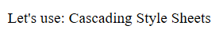

 本篇介绍CSS样式。 

<!--more-->


# CSS 概述

## 什么是CSS？

- CSS 指层叠样式表 (**C**ascading **S**tyle **S**heets)
- 样式定义**如何显示** HTML 元素
- 样式通常存储在**样式表**中
- 把样式添加到 HTML 4.0 中，是为了**解决内容与表现分离的问题**
- **外部样式表**可以极大提高工作效率
- 外部样式表通常存储在 **CSS 文件**中
- 多个样式定义可**层叠**为一


## CSS规则集 = 选择器 + 声明

CSS 规则由两个主要的部分构成：**选择器**，以及一条或多条**声明**。

`selector {declaration1; declaration2; ... declarationN }`

每条声明由一个**属性**和一个**值**组成，每个属性有一个值，属性和值被**冒号**分开。

声明与声明之间又是由**分号**隔开，声明要放在**花括号**里。


## 多重声明

下面这个多重声明是按照前面的语法规则构建的，前面是选择器，花括号内部是声明，声明与声明之间是用**分号**隔开的，声明中**属性**和**值**用冒号隔开（像key:value一样）。

```html
    <style>
        div{
            color: #946453;
            width: 200px;
            height: 200px;
            background-color: chartreuse;
            /*background-color: chartreuse; 注释 css样式*/ 
        }
    </style>
```


## CSS是如何工作的？

> 当浏览器显示文档时，它必须将文档的内容与其样式信息结合。它分两个阶段处理文档：
>
> 1. 浏览器将 [HTML](https://developer.mozilla.org/en-US/docs/Glossary/HTML) 和 [CSS](https://developer.mozilla.org/en-US/docs/Glossary/CSS) 转化成 [DOM](https://developer.mozilla.org/en-US/docs/Glossary/DOM) （*文档对象模型*）。DOM在计算机内存中表示文档。它把文档内容和其样式结合在一起。
> 2. 浏览器显示 DOM 的内容。


## CSS 语句（CSS statements）

CSS 规则是样式表的主要组成块 —— 是你在 CSS 中最常见的块。但这有一些其它类型的块，你以后偶尔会碰上 —— CSS 规则只是被称为 CSS 语句中的一种。其它类型如下：

- @-规则(At-rules)

  在CSS中被用来传递**元数据**、**条件信息**或其它描述性信息。它由（`@` ）符号开始，紧跟着一个表明它是哪种规则的描述符，之后是这种规则的语法块，并最终由一个半角分号（ `;` ）结束。每种由描述符定义的@-规则，都有其特有的内部语法和语义。一些例子如下：

  - [`@charset`](https://developer.mozilla.org/zh-CN/docs/Web/CSS/@charset) 和 [`@import`](https://developer.mozilla.org/zh-CN/docs/Web/CSS/@import) （元数据）
  - [`@media`](https://developer.mozilla.org/zh-CN/docs/Web/CSS/@media) 或 [`@document`](https://developer.mozilla.org/zh-CN/docs/Web/CSS/@document) （条件信息，又被称为嵌套语句，见下方。)
  - [`@font-face`](https://developer.mozilla.org/zh-CN/docs/Web/CSS/@font-face) （描述性信息）

  具体语法示例：

  ```html
  @import 'custom.css';
  ```

  该@-规则向当前 CSS 导入其它 CSS 文件

- 嵌套语句

  是@-规则中的一种，它的语法是 CSS 规则的嵌套块，只有在特定条件匹配时才会应用到文档上。特定条件如下：

  - [`@media`](https://developer.mozilla.org/zh-CN/docs/Web/CSS/@media) 只有在运行浏览器的设备匹配其表达条件时才会应用该@-规则的内容；
  - [`@supports`](https://developer.mozilla.org/zh-CN/docs/Web/CSS/@supports) 只有浏览器确实支持被测功能时才会应用该@-规则的内容；
  - [`@document`](https://developer.mozilla.org/zh-CN/docs/Web/CSS/@document) 只有当前页面匹配一些条件时才会应用该@-规则的内容。

  具体语法示例

  ```css
  @media (min-width: 801px) {
    body {
      margin: 0 auto;
      width: 800px;
    }
  }
  ```

  上述的嵌套语句只有在页面宽度超过801像素时才会应用。

  note：任何不是规则集或@-规则或嵌套语句的 CSS 语句都是无效的，并会因此被忽略。


## 注释

CSS中的注释以 `/*` 开始并以 `*/` 结束。


## 简写


## 关于DOM

> DOM是一种**树形结构**. 标记语言中的每个元素,属性,文本片段都变为一个 [DOM 节点](https://developer.mozilla.org/en-US/docs/Glossary/Node/DOM)。这些节点由它们与其它 DOM 节点的关系来定义。有的元素是某些子节点的父节点，且这些子节点有兄弟（节点）。

举一个例子：

```html
<p>
  Let's use:
  <span>Cascading</span>
  <span>Style</span>
  <span>Sheets</span>
</p>
```

在该 DOM 中，我们的 `<p>` 元素所对应的节点是父节点。它的子节点是一个文本节点和我们的一些 `<span>` 元素对应的节点。这些 `SPAN `结点也是父节点，它们各自的文本节点就是它们的子节点：

```
P
├─ "Let's use:"
├─ SPAN
|  └─ "Cascading"
├─ SPAN
|  └─ "Style"
└─ SPAN
   └─ "Sheets"
```

结果为：



应用CSS到DOM

```css
/* 对上面的span标签进行修饰 */
span {
  border: 1px solid black;
  background-color: lime;
}
```

结果为：


p比作树干，span比作树枝，像不像在几个树枝上刷油漆！😄


# 层叠机制

CSS 是 *Cascading Style Sheets* 的缩写，这暗示层叠（cascade）的概念是很重要的。在最基本的层面上，它表明CSS规则的顺序很重要，但它比那更复杂。什么选择器在层叠中胜出取决于三个因素（这些都是按重量级顺序排列的——前面的的一种会否决后一种）：

1. 重要性（Importance）
2. 专用性（Specificity）
3. 源代码次序（Source order）

## 重要性

在CSS中，有一个特别的语法可以让一条规则**总是**优先于其他规则：`!important`。把它加在属性值的后面可以使这条声明有无比强大的力量。  

## 专用性

层叠机制是多重样式将层叠为一个时的层叠次序 

**当同一个 HTML 元素被不止一个样式定义时，会使用哪个样式呢？** 

一般而言，所有的样式会根据下面的规则层叠于一个新的虚拟样式表中，其中数字 4 拥有最高的优先权。  

1. 浏览器缺省设置
2. 外部样式表
3. 内部样式表（位于 `<head>` 标签内部）
4. 内联样式（在 HTML 元素内部）

  

因此，内联样式（在 HTML 元素内部）拥有最高的优先权，这意味着它将优先于以下的样式声明：`<head>` 标签中的样式声明，外部样式表中的样式声明，或者浏览器中的样式声明（缺省值）。


# 样式的四种引入方式

## 1. 行内引入

详细见前面HTML样式

设置style属性

```html
<!DOCTYPE html>
<html lang="en">
<head>
    <meta charset="UTF-8">
    <title>CSS基础</title>
</head>
<body>
    <!--引入方式一：行内引入-->
    <span style="color: blue">哇哈哈</span>
    <div style="color: pink; height: 50px; background-color: green;">qq星</div>
</body>
</html>
```

## 2. 内联引入

通过 style 标签，在head中声明

```html
<!doctype html>
<html lang="en">
<head>
    <meta charset="UTF-8">
    <title>Document</title>
    <style>
        div{
            color: blueviolet;
        }
    </style>
</head>
<body>
    <div>你好呀！</div>
</body>
</html>
```


## 3. 链接引入

通过 link 标签，引入css文件

```html
<!doctype html>
<html lang="en">
<head>
    <meta charset="UTF-8">
    <title>Document</title>
    <link rel="stylesheet" href="index.css">
</head>
<body>
    <div>哇哈哈</div>
</body>
</html>
```


## 4. 导入

style标签 + @import

```html
<!doctype html>
<html lang="en">
<head>
    <meta charset="UTF-8">
    <title>Document</title>
    <style>
        @import "index.css";
    </style>
</head>
<body>
    <div>哇哈哈</div>
</body>
</html>
```

建议：对于导入方式，我们在编写的时候可以采取内联导入的方式，然后编写完成后将它独立出去做成一个css文件，在采用方式3.

# 选择器

## 基本选择器

- 标签选择器：标签名
- id选择器：`#` + id 值
- 类选择器：`.`+ class 值

```html
<!DOCTYPE html>
<html lang="en">
<head>
    <meta charset="UTF-8">
    <title>选择器</title>
    <style>
        div{
            color: #ff8a2f;
        }
        #div1{
            color: #946453;
        }
        .sp{
            color: blueviolet;
        }
    </style>
</head>
<body>
    <div>哇哈哈</div>
    <div id="div1">爽歪歪</div>
    <div class="sp">QQ星</div>
    <div>
        <a href="http://www.baidu.com">百度一下</a>
    </div>
</body>
</html>
```

样式的继承：子元素会继承父元素的样式，但是a标签除外，只能直接设置a标签的颜色。

样式之间的重叠部分是有优先级的，继承下来的样式的优先级为0（最低） ？？？


## 通用选择器

所有标签都会被选中

用以去掉所有“样式”。（漂白报纸）     待完善！！！

```css
*{
color : #946453;
text-decoration:none;
/*去掉a标签下划线*/
}
```


## 高级选择器

后代/子代选择器、毗邻选择器、弟弟选择器、属性选择器、并集/交集选择器、伪类选择器、伪元素选择器


### 后代/子代/毗邻/弟弟选择器

后代选择器： **空格** ，嵌套关系，找到所有子孙。

子代选择器： **>**      ,  嵌套关系，找到所有儿子。

毗邻选择器： **+**      ，并列关系，如果兄弟两紧挨着，则可以找到。

弟弟选择器： **~**      ，并列关系，找到所有弟弟，无论是否挨着，并列就行。

```css
<!DOCTYPE html>
<html lang="en">
<head>
    <meta charset="UTF-8">
    <title>后代/子代/毗邻/弟弟选择器</title>
    <style>
        /*找的是后代，如div下所有的span*/
        div b{
            color: #ff8a2f;
        }
        /*找的是所有儿子*/
        div>span{
            color: #946453;
        }
        /*找到毗邻：只找下一个兄弟，strong与em是兄弟（并列的）*/
        strong+em{
            color: blueviolet;
        }
        /*找到所有弟弟*/
        ins~del{
            color: blue;
        }
    </style>
</head>
<body>
    <div>
        <b>我</b>
        <b>很</b>
        <b>好</b>
        <p><b>!!!</b></p>
    </div>

    <div>
        <span>你</span>
        <span>好</span>
        <span>啊</span>
        <p><span>!!!</span></p>
    </div>

    <strong>我</strong>
    <!--<b>o</b>-->
    <!--毗邻是兄弟两必须挨着，不然就找不到-->
    <em>很</em>
    <em>好</em>
    <em>！！！</em>
    <br>

    <ins>你</ins>
    <del>好</del>
    <del>呀</del>
    <del>！！！</del>
    <b>o</b>
    <del>xxx</del>
    <!--不论是否挨着，只要是弟弟就改变-->
</body>
</html>
```


### 属性选择器

存在和值（Presence and value）属性选择器尝试匹配精确的属性值：

- `[attr]`：该选择器选择包含 attr 属性的所有元素，不论 attr 的值为何。
- `[attr=val]`：该选择器仅选择 attr 属性被赋值为 val 的所有元素。
- `[attr~=val]`：该选择器仅选择具有 attr 属性的元素，而且要求 `val` 值是 `attr` 值包含的被空格分隔的取值列表里中的一个。


子串值（Substring value）属性选择器也被称为“伪正则选择器”，因为它们提供类似 regular expression 的灵活匹配方式（但请注意，这些选择器并不是真正的正则表达式）：

- `[attr|=val]` : 选择attr属性的值是 `val` 或值以 `val-` 开头的元素（注意，这里的 “-” 不是一个错误，这是用来处理语言编码的）。
- `[attr^=val]` : 选择attr属性的值以 `val` 开头（包括 `val`）的元素。
- `[attr$=val]` : 选择attr属性的值以 `val` 结尾（包括 `val`）的元素。
- `[attr*=val]` : 选择attr属性的值中包含子字符串 `val` 的元素（一个子字符串就是一个字符串的一部分而已，例如，”cat“ 是 字符串 ”caterpillar“ 的子字符串）。


```html
<!DOCTYPE html>
<html lang="en">
<head>
    <meta charset="UTF-8">
    <title>Title</title>
    <style>
        [tt]{
            background-color: gray;
        }
        [class='pp']{
            color: red;
        }        
    </style>
</head>
<body>
    <p class="pp" tt>你好啊</p>
</body>
</html>
```


### 并集选择器与交集选择器

并集选择器：`,`   ，找到这些用 `,` 分隔的所有标签，如无序列表与有序列表。

交集选择器：`.`  或  `#`  ，找到某某标签的以这类命名或以这种id命名的。注意：**中间不可以有空格！**

```css
<!DOCTYPE html>
<html lang="en">
<head>
    <meta charset="UTF-8">
    <title>Title</title>
    <style>
        ul,ol{
            padding:0;
            margin:0;
            list-style: none;
            background-color: yellow;
        }
        div#father{
            width: 400px;
            height: 400px;
            background-color: gray;
        }
        div.son{
            width: 100px;
            height: 100px;
            background-color: red;
        }
    </style>
</head>
<body>
    <ul>
        <li>你</li>
        <li>好</li>
        <li>啊</li>
        <li>！！！</li>
    </ul>
    <ol>
        <li>我</li>
        <li>很</li>
        <li>好</li>
        <li>！！！</li>
    </ol>
    <div id="father">
        <div class="son"></div>
    </div>
</body>
</html>
```


### 伪类选择器

- 伪类选择器：`:`  , 匹配处于**确定状态**的一个或多个元素，比如被鼠标指针悬停的元素，或当前被选中或未选中的复选框，或元素是DOM树中一父节点的第一个子节点。
- 伪类存在的意义是为了通过选择器找到那些不存在与DOM树中的信息以及不能被常规css选择器获取到的信息。    
- 理解伪类：伪类选择器与类选择器的区别是，类选择器可以随便起名，譬如上面的”div.son” ，你也可以命名为”p.class1″ 与”p .class2″ ，然后在页面上使用”class=class1”与”class= class 2 ” ,但是伪类选择器是css 中已经**定义好的选择器**，不能随便起名。在css 中我们最常用的伪类选择器是使用在a(锚)元素上的几种选择器。

语法：

- `a:link{属性：属性值;}`超链接的初始状态;**（当前状态）**
- `a:hover{属性：属性值;}`鼠标悬停，即鼠标划过超链接时的状态;**（鼠标移上）**
- `a:active{属性：属性值;}`超链接被激活时的状态，即鼠标按下时超链接的状态;**（鼠标按下：又叫激活）**
- `a:visited{属性：属性值;}`超链接被访问后的状态;**（访问过后）**


```html
<!DOCTYPE html>
<html lang="en">
<head>
    <meta charset="UTF-8">
    <title>Title</title>
    <style>
        /*未访问的链接*/
        a:link{
            color: #946453;
        }
        /*选定的链接*/
        a:active{
            color: #ff8a2f;
        }
        /*已访问的链接*/
        a:visited{
            color: red;
        }
        /*鼠标移动到链接上*/
        a:hover{
            color: green;
        }
        /*当光标在input内时*/
        input:focus{
            background: orange;
        }
        div{
            width: 100px;
            height: 100px;
            background-color: lightgray;
        }
        /*当鼠标悬浮在div上时*/
        div:hover{
            background-color: pink;
        }

    </style>
</head>
<body>
<a href="https://www.baidu.com">百度一下</a>
<a href="https://www.taobao.com">淘宝</a>
<a href="https://www.jd.com">京东</a>
<from>
    <input type="text">
</from>
    <div>emmm</div>
</body>
</html>
```


| 属性         | 描述                                     | **CSS** |
| ------------ | ---------------------------------------- | ------- |
| :active      | 向被激活的元素添加样式。                 | 1       |
| :focus       | 向拥有键盘输入焦点的元素添加样式。       | 2       |
| :hover       | 当鼠标悬浮在元素上方时，向元素添加样式。 | 1       |
| :link        | 向未被访问的链接添加样式。               | 1       |
| :visited     | 向已被访问的链接添加样式。               | 1       |
| :first-child | 向元素的第一个子元素添加样式。           | 2       |
| :lang        | 向带有指定 lang 属性的元素添加样式。     | 2       |

更详细的如下图：


### 伪元素选择器

- 匹配处于相关的**确定位置**的一个或多个元素，例如每个段落的第一个字，或者某个元素之前生成的内容。 
- 伪元素在DOM树中创建了一些抽象元素，这些抽象元素是不存在与文档语言里的
- 伪元素由两个冒号开头，伪元素的名称使用两个冒号`::`是为了区别伪类和伪元素（css2中没有区别）。
- 考虑到兼容性，css2中的伪元素仍然可以使用一个冒号`:`的语法，但是css3中新增的伪元素必须使用两个冒号`::`
- 一个选择器只能使用一个伪元素，并且伪元素必须处于选择器语句的最后	
- 伪元素创建了一个虚拟容器，这个容器不包含任何DOM元素，但是可以包含内容，另外还可以为伪元素定制样式


#### `::first-letter`、 `::first-line`、 `::selection`

```html
<!DOCTYPE html>
<html lang="en">
<head>
    <meta charset="UTF-8">
    <title>Title</title>
    <style>
        /*第一个字符*/
        p::first-letter{
            font-size: 40px;
            color: green;
        }
        /*浏览器中的第一行*/
        p::first-line{
            background-color: gray;
        }
        /*鼠标拖动*/
        p::selection{
            background-color: red;
        }
    </style>
</head>
<body>
    <p>Netscape 在 20 年前以 Netvigator 开拓了民用浏览器市场，当他们正在大展拳脚之际，电脑平台上的霸主微软，突然以 Internet Explorer (IE) 向 Netscape 狂攻，开始了 “第一次浏览器大战”，结果 IE 在 Windows 的捆绑优势下，将 Netscape 击得溃不成军，最后在 1998 年只能卖盘收场。</p>
</body>
</html>
```


#### `::before`、 `::after`

- 必须带一个属性content
- 在内部内容的前面或者后面插入内容

```html
<!DOCTYPE html>
<html lang="en">
<head>
    <meta charset="UTF-8">
    <title>Title</title>
    <style>
        /*插入一个简单的内容*/
        /*div::before{*/
        /*    content: "我是插入内容";*/
        /*    background-color: red;*/
        /*}*/
        div{
            width: 500px;
            height: 500px;
            border: 1px solid #ff6700;
        }
        /*如果插入内容定义了宽和高和其他属性时，它是一个盒子（必须通过display转换，因为默认是一个行内元素）。*/
        /*有了它，我们可以和上面的内容分割开来,从而清除浮动*/
        div::before{
            content: "插入的盒子";
            display: block;
            width: 200px;
            height: 200px;
            background-color: yellow;
        }

    </style>
</head>
<body>
    <div>我是一个div标签</div>
</body>
</html>
```

清除浮动 + 列表并排

```css
.clearfix:after, .clearfix:before {
    content: " ";  
	/*相当于添加了一个没有宽度的盒子*/
    clear: both;
    display: block;
}
```

列表并排

```css
.clearfix:after, .clearfix:before {
    content: " ";
    display: table;
}
```


| 属性           | 描述                             | CSS  |
| -------------- | -------------------------------- | ---- |
| ::first-letter | 向文本的第一个字母添加特殊样式。 | 1    |
| ::first-line   | 向文本的首行添加特殊样式。       | 1    |
| ::selection    | 向被鼠标选中的字段添加特殊样式。 | 2    |
| ::before       | 在元素之前添加内容。             | 2    |
| ::after        | 在元素之后添加内容。             | 2    |


更详细的如下图：


## CSS选择器优先级

记忆：“行i类标继”

行内标签>id选择器>类选择器>标签选择器>继承

1000         100             10           1                 0

所有的值可以累加但不进位。

优先级如果相同，写在后面生效（后面覆盖前面）

`!important` 给最高优先权，尽量少用。

note：如果`!important`没有生效，后面可在重写一行不带`!important`的。


# 值的类型

- 数值: 长度值，用于指定例如元素宽度、边框（border）宽度或字体大小；以及无单位整数。用于指定例如相对线宽或运行动画的次数。
- 百分比: 可以用于指定尺寸或长度——例如取决于父容器的长度或高度，或默认的字体大小。
- 颜色: 用于指定背景颜色，字体颜色等。
- 坐标位置: 例如，以屏幕的左上角为坐标原点定位元素的位置。
- 函数: 例如，用于指定背景图片或背景图片渐变。

## 数值

### 绝对单位

像素 (px) 是一种绝对单位（**absolute units**）

### 相对单位

- em：1em与当前元素的字体大小相同（更具体地说，一个大写字母M的宽度）。em单位是会继承父元素的字体大小，所以如果在父元素上设置了不同的字体大小，em的像素值就会变得复杂。
- `rem`: REM（root em）和em以同样的方式工作，但它总是等于默认基础字体大小的尺寸；继承的字体大小将不起作用，所以这听起来像一个比em更好的选择，虽然在旧版本的IE上不被支持
- `ex`, `ch`: 分别是小写x的高度和数字0的宽度。这些并不像em那样被普遍使用或很好地被支持。

### 无单位的数值

例1：

让一个元素完全去除外边框和内边框，你可以只使用无单位的0——因为0就是0，不管单位是什么！ `margin : 0;`

例2：

这个无单位的数值就像一个简单的乘法因子

`line-height : 1.5` , 行高的1.5倍

例3：

这个无单位的数值表示次数

css动画中 `animation-iteration-count: 1;`它控制着动画启动后执行多少次。


### 百分比

对于父容器中的子容器，希望它占父容器宽度的一定百分比。

动态（流体）布局

- 跟随浏览器视口大小的变化。
- 可以使用动态布局来确保**标准文档始终适合于屏幕**，并且可以在**不同大小的移动设备**屏幕上表现良好。

固定宽度布局

- 不管怎样都保持不变
- 一个固定宽度的布局可以用来保持在线地图的大小相同；浏览器视口可以在地图上滚动，只在一个时间内查看一定数量的地图。您可以立即看到的量取决于您的视口有多大。


## 颜色表示

现代计算机中可用的标准颜色系统是24位，通过不同的红、绿、蓝通道，每个通道有256种不同的值，从而显示出大约1670万种不同的颜色。  (256 x 256 x 256 = 16,777,216.)

关键词，十六进制，RGB / HSLA / RGBA / HSLA 和不透明属性,有些因为兼容性就没有列举。

## rgb表示法

rgb：red  green  blue    光谱三原色

rgb(255,255,255) =  白色

rgb(0,0,0)=黑色

## 16进程的颜色表示法

`#000000` - `#FFFFFF` 

`#000` - `#FFF`

## 单词表示法

red, green, pink, gray

## rgba表示法

a表示**alpha通道**，透明度[0-1], 0是完全透明，1是不透明


# 字体

## font-size 字体大小

## font-weight 字体粗细

- 100 – Thin
- 200 – Extra Light (Ultra Light)
- 300 – Light
- 400 – Regular (Normal、Book、Roman)
- 500 – Medium
- 600 – Semi Bold (Demi Bold)
- 700 – Bold
- 800 – Extra Bold (Ultra Bold)
- 900 – Black (Heavy)

## font-family 字体类型

```css
p{
   font-family: 'Microsoft Yahei','楷体','仿宋';
   font-weight: bold;
   font-size: 12px;
}
```


# 文本

```css
text-align 文字的水平对齐
	left 左对齐
    center 居中
    reght 右对齐
text-decoration 文本装饰
    none;         没有下划线
    line-through; 中划线
    overline;     上划线
    underline;    下划线

text-indent 文本缩进
	text-indent: 2em; em单位是一个相对单位,相对当前字体大小的像素是1em

line-height	行高,设置行高=容器高度,文字自动垂直居中
	line-height: 200px;
	
color:设置字体颜色

text-shadow: 5px 5px 5px blueviolet;  文本阴影

text-overflow  文字溢出
设置了固定宽度 + 强制在一行内显示 + 超出部分隐藏 + 显示省略号来代表被修剪的文本。
overflow = hidden 超出部分隐藏
```


# 背景图片

```css
background-color: red;   在没有背景图片覆盖的范围显示背景颜色
background-image: url('timg.jpg'); 设置背景图片
height: 400px;
width: 400px; 
background-repeat: no-repeat; 设置图片不重复   repeat-x水平重复   repeat-y垂直重复
background-position: right top; 图片的位置    左中右x 上中下y
/*left center right /top center bottom*/
background-attachment: fixed; 在窗口中固定图片的位置
background:red url("timg.jpg") no-repeat left center;  把所有的设置综合写在background中
```

图片居中：

```css
img {
  display: block;
  margin: 0 auto;
}
```


# 边框的设置

```css
width: 100px;
height: 100px;
/*border-color: tomato green gray yellow;*/
/*border-width: 1px 3px 5px 7px;*/
/*border-style: solid dotted dashed double;*/
/*一个值:上下左右
四个值:遵循顺时针上右下左
三个值:上 右左 下
两个值:遵循上下 左右
*/
/*border-top-style:solid ;*/  单独设置顶线的样式(left,bottom,right)
/*border-left-style:solid ;*/ 单独设置左边线的样式
/*border-top-color:red;*/     单独设置顶线颜色
border:yellow solid  10px;    统一设置边框的颜色 样式 宽度
```


# 块和行内的概念以及转换

```css
对于行内标签来说不能设置宽和高
有些时候需要行内标签也设置宽和高,需要进行行内-->块,行内->行内块
display的属性值 : block块  inline行内 inline-block行内快 none
display: block;        独占一行并且可以设置宽高
display: inline-block;  既可以设置宽高又不会独占一行 行内\块转行内快
display: inline;        表示一个行内元素,不能设置宽高
display: none;          不仅不显示内容,连位置也不占了
```


# 盒模型

```css
border  : 边框的宽度
padding : 内边距的距离
content : width height
背景包含的部分:padding + conntent
计算一个盒子的总大小: 宽width+2padding+2border 高height+2padding+border
外边距 margin
    上下的盒子如果设置bottom和top会导致塌陷,取两个设置的最大值作为外边距
margin: 0 auto;定义元素上、下边界为0px，在浏览器中横向居中

分方向的设置
border-top border-right  border-bottom border-left
padding-top padding-right  padding-bottom padding-left
margin-top margin-right  margin-bottom margin-left

给图形设置圆角
border-radius: 5px;
```


## border的使用方法

### 一句表示

粗细（数值+单位） 颜色;

`border:3px solid red; `

### 属性

边框大小   border-width: 10px;（边框宽）

边框类型   border-style: solid;（线型）

边框颜色   border-color: #00f;（颜色）

### 边框border线型

- solid:实线
- dashed:线状虚线
- dotted:点状虚线
- double:双线**(至少3px)**

### 边框按方向分类

- 右边框 border-right
- 左边框 border-left
- 上边框 border-top
- 下边框 border-bottom


## padding的使用方法

内边距：padding,在设定页面中一个元素内容到元素的边缘(边框) 之间的距离。也称补白、填充。

- 用来调整内容在容器中的位置关系
- 用来调整子元素在父元素中的位置关系
- **写完padding看宽高，如果有做减法（不减容易把盒子撑高）**
- 支持背景

### 属性值的4种方式

- 四值法：上   右   下   左 {padding:10px   20px   30px    40px;}
- 三值法：上    右左    下  {padding:10px   20px   30px ;}
- 二值法：上下    右左      {padding:10px   20px  ;}
- 一值法：四个方向     padding:2px;（定义元素四周填充为2px）


## 属性的继承

- 父盒子的属性，如果子盒子能够读取得到，那么就是可以继承。
- 不可继承的：display、margin、border、padding、background、height、min-height、max-height、width、min-width、max-width、overflow、position、left、right、top、bottom、z-index、float、clear、table-layout、vertical-align、page-break-after、page-bread-before和unicode-bidi。
- **文本可继承**：letter-spacing、word-spacing、white-space、line-height、color、font、font-family、font-size、font-style、font-variant、font-weight、text-decoration、text-transform、direction、text-indent和text-align。
- **列表元素可继承**：list-style、list-style-type、list-style-position、list-style-image。


# 列表的样式

```css
在css中去掉列表的样式
ul,li{
   list-style: none;
}
```


# 浮动

```css
float:left /right
浮动的元素会脱离标准文档流,原本块级元素就不再独占整行了
并且在原页面中也不占位置了,之后的元素会挤到页面上影响页面的排版
清除浮动 clear:both
伪元素清除法:
        .clearfix:after{
            content: '';
            clear: both;
            display: block;
        }
<body>
<div class="father clearfix">
<div class="box"></div>
<div class="box"></div>
</div>
<div class="main">
    主页的内容
</div>
</body>
```


## overflow

```css
内容多余标签的大小
visible 可见(默认)
hidden 超出部分隐藏
scroll 超出显示滚动条
```


# 定位

CSS **position**属性用于指定一个元素在文档中的定位方式。`top`、`bottom`、`left`、`right`属性则决定了该元素的最终位置。


```css
position : relative /absolute /fixed
top:10px;
right:10px;
bottom:10px;
left:10px;
```


## 默认 static

- 该关键字指定元素使用正常的布局行为，即元素在文档常规流中当前的布局位置。此时 `top`, `right`, `bottom`, `left` 和 `z-index `属性无效。


## 相对定位

- 相对自己原来的位置移动,移动之后还占据原来的位置
- 不脱标占位，相对自身（标准流里的位置）定位，跟父盒子毫无关系
- `position:relative` 对 `table-*-group`, `table-row`, `table-column`, `table-cell`, `table-caption` 元素无效。

## 绝对定位

- 绝对定位是相对于整个html页面,不会占据原来的位置,层级的提升
- 不为元素预留空间，通过指定元素相对于最近的**非 static 定位祖先元素**的偏移，来确定元素位置。绝对定位的元素可以设置**外边距**（margins），且不会与其他边距合并。
- **脱标不占位**，如果不写坐标，脱标留原位（标准流里的位置）


### 父相子绝

- **脱离文档流**

- 如果我们设置了绝对定位

  - 父元素如果没有设置position,那么我们对元素的所有设置都是基于整个页面；
  - 父元素如果设置了position,那么子盒子的absolute位置会根据父盒子的位置定位

  


## 固定定位

- **脱离文档流**
- 相对屏幕视口（viewport）的位置来定位元素位置，元素的位置在屏幕滚动时不会改变。（如：返回顶部，定位在上方的导航）


# 用定位还是用浮动？

- 大布局、自适应，用“浮动”	———— 浮动一般和响应式结合的比较多；
- 小元素、固定宽高，用“定位”———— 一般只适用于一些很小的 icon ；

# z-index

- z-index 值表示谁压着谁，数值大的压盖住数值小的
- 只有定位了的元素，才能有z-index,也就是说，不管相对定位，绝对定位，固定定位，都可以使用z-index，而浮动元素不能使用z-index
- z-index值没有单位，就是一个正整数，默认的z-index值为0如果大家都没有z-index值，或者z-index值一样，那么谁写在HTML后面，谁在上面压着别人，定位了元素，永远压住没有定位的元素。
- 从父现象：父亲怂了，儿子再牛逼也没用


# opacity

不透明度

```css
opacity: 0.5;调整d4对应的整个标签的透明度是50%
.d4{
    opacity: 0.5;
}
<div class="d4">
    你好啊
	
</div>
```


# 自适应

## 宽高自适应

网页布局中经常要定义元素的宽和高。 但很多时候我们希望元素的大小能够根据窗口或子元素自动调整，这就是自适应。 

元素自适应在网页布局中非常重要，它能够使网页显示更灵活，可以适应在不同设备、不同窗口和不同分辨率下显示。


### 最小最大高度的自适应

最小高度：内容不足会呈递最小高度，内容超出会依据内容自适应高度

​	`min-height`属性：最小高度；

最大高度：内容不足最大高度时自适应，内容超出最大高度时溢出不再支撑盒子

​	`max-height`属性：最大高度；


### 最小最大宽度自适应

块元素宽度默认为100%(独占一行导致100%);

`min-width`属性：最小宽度；

`max-width`属性：最大宽度；

如果想给盒子应用最大最小宽度自适应，就必须将盒子转化为行内块 inline-block 或者添加float


### 宽度自适应于当前窗口

- 通过百分比实现宽度自适应 
- 盒子的百分数是参照父盒子的width的，子盒子的内外边距百分数也是参照父盒子的width


### 高度自适应于当前窗口

高度自适应当前窗口，必须将父盒子body和html的height都设为100%；

​    `body,html{ height:100%;}`

 只有这样，才能让当前盒子的{height：100%}生效；


### 浮动元素父元素高度自适应（高度塌陷\清除浮动）

1. 给父盒子添加一个死高度；

   ​	（清除浮动的一种方式，并不会自适应高度，因为已经固定）

2. 给父元素添加声明`overflow:hidden;`

3. 在浮动元素下方添加空div，并给该元素添加声明

   ```css
   clear:both; height:0; line-height:0; font-size:0; overflow:hidden;
   
   谁不想被浮动影响谁就加清除浮动clear：both
   
   （注意：不是给浮动的盒子加）
   ```

   

4. 伪类清除浮动(万能清浮法)

```css
浮动盒子的父元素::after{content:""; display:block;   clear:both;height:0;overflow:hidden;visibility:hidden;}

ie7以下版本浏览器不支持伪元素
visibility:hidden/visible;隐藏/可见

visibility:hidden;和display:none;的区别：
visibility:hidden;属性会使对象不可见，但该对象在网页所占的空间没有改变，等于留出了一块空白区域.
display:none属性会使这个对象彻底消失。
```


------

 