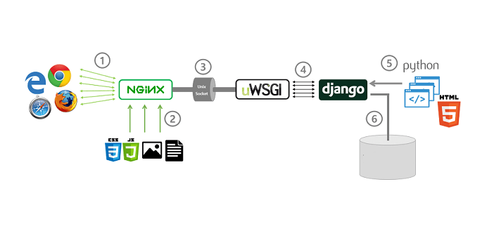

 本篇介绍在CentOS中部署一个前后端不分离的Django项目。 

<!--more-->

# 概述

对于前后端不分离项目，参考下图：




# 第一步

**mariadb数据库相关**


1. yum安装mariadb

   ```python
   yum install  mariadb-server  mariadb -y  
   ```

   

2. 启动数据库

   ```python
   systemctl start mariadb
   
   补充：
   	启动/停止/状态/重启 数据库
   		systemctl  start/stop/status/restart mariadb 
       查看端口：
       	netstat -ltunp
       查看端口状态：
       	netstat -tunlp | grep 3306
       改变密码：
       	set password=password('123456');
   ```

   

3. 导出windows的数据库，传给Linux

   Windows中：

   - 导出数据命令：

     ```python
     导出指定数据库的数据到 数据库名.sql 中：
     	mysqldump -uroot -p 数据库名 > 数据库名.sql    
     ps：使用cmd，使用powershell 会出错哦。。。
     ```

   - 传输到Linux中：

     ```python
     对于小文件使用 lrzsz 工具就可以，直接将文件拖到xshell中，或者使用rz
     ```

   - 在Linux中导入数据：

     - 方式一：

       ```python
       1. 创建一个数据库
       	create database 数据库名
       2. 执行导入数据的命令
       	mysql -uroot -p 数据库名 < 数据库名.sql
       ```

       

     - 方式二：

       ```python
       登录数据库之后，用命令导入数据
       1. 创建一个数据库
       	create database 数据库名
       2. 使用该数据库
       	use database 数据库名
       3. 读取SQL文件，写入数据
       	mareiadb>    source 数据库名.sql; 
       ```

       

# 第二部

**准备python3环境，以及虚拟环境** 

1. 下载并编译 python3：
   
- 详见博客
  
2. 使用virtualenvwrapper工具 来管理虚拟环境
   
- 待补充！！！
  
3. 使用mkvirtualenv命令，创建新的虚拟环境，用于启动crm

   ```python
   创建：
   	mkvirtualenv  虚拟环境名称
   
   补充：	
       mkvirtualenv  虚拟环境名          #创建虚拟环境 
       lsvirtualenv                 #列出虚拟环境的名字 
       workon   虚拟环境名字         #激活或切换虚拟环境  
       lssitepackages               #列出虚拟环境中的模块信息，其实就是 
       cdvirtualenv                 #进入虚拟环境家目录 
       cdsitepackages              #进入虚拟环境第三方模块目录 
   ```

4. 拷贝 django 代码，到Linux机器

5. 解决 django 项目运行所需要的环境依赖，django等模块，以及pymysql

   方式一：

   - 直接运行，根据报错逐个安装。

   方式二：

   - 从windows的项目中导出所需要的模块

   ```python
   pip freeze > requirements.txt  # requirements.txt文件是python程序员都认识的模块依赖文件
   ```

   - 在Linux中使用 `-r` 参数，来指定依赖文件

   ```python
   pip install -r requirements.txt  #指定依赖文件安装，读取文件中所有的模块信息
   ```


出现的问题：ERROR: Command errored out with exit status 1: python setup.py egg_info Check the logs for full command output.

解决办法：

升级工具并没有起作用，发现是以前的一些无关模块，就直接删除了。


# 第三步

**uWSGI相关**

1. 通过 pip 安装

   ```python
   pip3 install -i https://pypi.douban.com/simple   uwsgi 
   ```

2. 通过uwsgi命令去启动django

   启动方式1（只是练习用）：

   ```python
   通过命令和参数形式
   语法是：
   	uwsgi  --http :8000  --module  项目名.wsgi  
   		--http指定http协议启动socket服务端，可以通过浏览器直接访问
           --module  是找到crm项目第二级目录下的wsgi.py 文件
   ```

   启动方式2：

   通过配置文件方式启动，线上是这么使用的
   uwsig的配置文件 uwsgi.ini 

   ```python
   1. 创建配置文件
   	touch  uwsgi.ini 
   2.写入如下内容 （uwsgi.ini内容如下）
       [uwsgi]
       # Django-related settings
       # the base directory (full path)
       # 填写django项目的绝对路径，第一层 
       chdir           = /opt/.../django项目名
   
       # Django's wsgi file 
       #填写crm项目第二层目录中的wsgi文件 
       module          = 项目名.wsgi
   
       # the virtualenv (full path)
       #填写解释器的安装绝对路径（虚拟环境）
       home            = /root/Envs/虚拟环境名称
   
       # process-related settings
       # master
       master          = true
       # maximum number of worker processes
       #指定uwsgi的多进程数量，指定为cpu的核数即可（填cpu的4倍数量）
       processes       = 4
   
       # the socket (use the full path to be safe
       #指定crm启动的协议，当你和nginx结合进行反向代理，就用unix-socket协议 ，这种方式无法直接访问，只能通过nginx反代
       socket          = 0.0.0.0:8000
   
       #指定http协议启动，不安全，没有意义，只是自己调试使用
       #http =  0.0.0.0:8000
   
       # ... with appropriate permissions - may be needed
       # chmod-socket    = 664
       # clear environment on exit
       vacuum          = true    
   
       
   3.指定uwsgi.ini配置文件启动 
   uwsgi  --ini  uwsgi.ini   # 参数 --ini是指定文件的意思 
   ```


3. 收集django的所有静态文件，丢给nginx去处理

   打开 django的settings.py，修改为如下行

   ```python
       + STATIC_ROOT='/opt/项目目录.../项目名static/'        #加上这个参数就行了 
       STATIC_URL = '/static/'
       STATICFILES_DIRS = [
       os.path.join(BASE_DIR, 'static')
       ]
   ```


4. 通过命令收集django的所有静态文件

   ```python
   python3  manage.py collectstatic  
   ```


# 第四步

**使用nginx做反向代理**

1. 安装nginx 

   ```python
   yum install -y nginx
   ```

2. 修改配置文件 nginx.conf

   

   ```python
   注意: server{}多虚拟主机是自上而下的加载顺序
   因此修改第一个server{}虚拟主机，修改为如下反代的写法，
   且添加nginx处理django的静态文件方式
   	server {
   	#nginx监听的地址 
   	listen       80;
   	#定义网站的域名   _; 表示暂无
   	server_name  _; 
   
   	#charset koi8-r;
   	#nginx的url匹配 , /这个斜杠就代表这样的请求：  192.168.13.117:85/  
   	 
   	#这个是最低级匹配，所有的请求都会进入location，进行处理
   	#好比 http://192.168.13.117/crm/login/
   	location / {
   		#基于uwsgi协议的请求转发，给后端django的启动地址
   		uwsgi_pass django项目所在的服务器IP:8000;    #这个是请求转发
   		include  uwsgi_params;      #这个是添加一个文件，添加请起头信息的
   	}
   	#我现在想处理这样的请求http://192.168.13.117/static/css/reset.css          
   	#当以后请求是从static开始，我就让他去这个目录去找
   	#不加斜杠
   	location  /static  {
   			alias  /opt/crms23/crmstatic;                                     
   	}
   }
   
   补充：
   	nginx 的语法检测
   		nginx -t
       平滑重启
   		nginx -s reload    
   ```