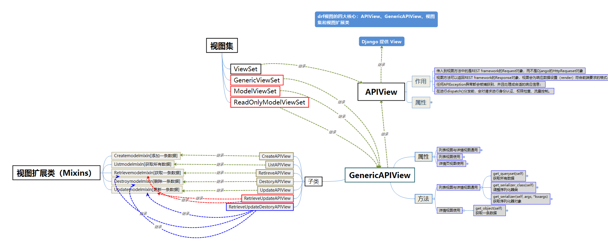

 本篇介绍DRF在视图层面为我们做的事情。 

<!--more-->


# 概述

DRF除了在数据序列化部分简写代码以外，还在视图中提供了简写操作。所以在django原有的django.views.View类基础上，drf封装了多个子类出来提供给我们使用。

Django REST framwork 提供的视图的主要作用：

- 控制序列化器的执行（检验、保存、转换数据）
- 控制数据库查询的执行
- 调用请求类和响应类（这两个类也是由DRF帮我们再次扩展了一些功能类）





# 始于请求与响应

## Request

变化：REST framework 传入视图的`request`对象不再是Django默认的`HttpRequest`对象，而是REST framework提供的扩展了`HttpRequest`类的**`Request`**类的对象：

- `request对象`(`HttpRequest`类)  --->   `request对象`(`Request类`)

原因：REST framework 提供了**Parser**解析器类，在接收到request请求后会自动根据`Content-Type`指明的请求数据类型（如JSON、表单等）将请求数据进行parse解析，解析为类字典（`QueryDict`）对象保存到**Request**对象中。

- **Request对象的数据是自动根据前端发送数据的格式进行解析之后的结果。**

- 无论前端发送的哪种格式的数据，我们都可以以统一的方式读取数据。


### 常用属性

#### `request.data`

`request.data` 返回解析之后的请求体数据。类似于Django中标准的`request.POST`和 `request.FILES`属性，但提供如下特性：

- 包含了解析之后的文件和非文件数据
- 包含了对POST、PUT、PATCH请求方式解析后的数据
- 利用了REST framework的parsers解析器，不仅支持表单类型数据，也支持JSON数据

#### `request.query_params`

`request.query_params`与Django标准的`request.GET`相同，表示的是URL上携带的参数。只是更换了更正确的名称而已。


## Response

变化：REST framework提供了一个响应类`Response`，使用该类构造响应对象时，响应的具体**数据内容会被转换**（render渲染器对象）成符合前端需求的类型。

​	REST framework提供了`Render` 渲染器，用来根据请求头中的`Accept`（接收数据类型声明）来自动转换响应数据到对应格式。如果前端请求中未进行Accept声明，则会采用默认方式处理响应数据，我们可以通过配置来修改默认响应格式。

原因：找到DRF的settings文件，我们发现按照下列字典中的设置，这也是根据

`restframework/settings.py`

```python
REST_FRAMEWORK = {
    'DEFAULT_RENDERER_CLASSES': (  # 默认响应渲染类
        'rest_framework.renderers.JSONRenderer',  # json渲染器
        'rest_framework.renderers.BrowsableAPIRenderer',  # 浏览API渲染器
    )
}
```

###  构造方式

```python
Response(data, status=None, template_name=None, headers=None, content_type=None)
```

`data`数据不要是render处理之后的数据，只需传递python的内建类型数据即可，REST framework会使用`renderer`渲染器处理`data`。

`data`不能是复杂结构的数据，如Django的模型类对象，对于这样的数据我们可以使用`Serializer`序列化器序列化处理后（转为了Python字典类型）再传递给`data`参数。

参数说明：

- `data`: 为响应准备的序列化处理后的数据；
- `status`: 状态码，默认200；
- `template_name`: 模板名称，如果使用`HTMLRenderer` 时需指明；
- `headers`: 用于存放响应头信息的字典；
- `content_type`: 响应数据的Content-Type，通常此参数无需传递，REST framework会根据前端所需类型数据来设置该参数。

### 常用属性

#### `response.data`

传给response对象的序列化后，但尚未render处理的数据

#### `response.status_code`

状态码的数字

#### `response.content`

经过render处理后的响应数据


### 状态码

为了方便设置状态码，REST framewrok在`rest_framework.status`模块中提供了常用状态码常量。

#### 信息告知 - 1xx

```python
HTTP_100_CONTINUE
HTTP_101_SWITCHING_PROTOCOLS
```

#### 成功 - 2xx

```python
HTTP_200_OK
HTTP_201_CREATED
HTTP_202_ACCEPTED
HTTP_203_NON_AUTHORITATIVE_INFORMATION
HTTP_204_NO_CONTENT
HTTP_205_RESET_CONTENT
HTTP_206_PARTIAL_CONTENT
HTTP_207_MULTI_STATUS
```

#### 重定向 - 3xx

```python
HTTP_300_MULTIPLE_CHOICES
HTTP_301_MOVED_PERMANENTLY
HTTP_302_FOUND
HTTP_303_SEE_OTHER
HTTP_304_NOT_MODIFIED
HTTP_305_USE_PROXY
HTTP_306_RESERVED
HTTP_307_TEMPORARY_REDIRECT
```

#### 客户端错误 - 4xx

```python
HTTP_400_BAD_REQUEST
HTTP_401_UNAUTHORIZED
HTTP_402_PAYMENT_REQUIRED
HTTP_403_FORBIDDEN
HTTP_404_NOT_FOUND
HTTP_405_METHOD_NOT_ALLOWED
HTTP_406_NOT_ACCEPTABLE
HTTP_407_PROXY_AUTHENTICATION_REQUIRED
HTTP_408_REQUEST_TIMEOUT
HTTP_409_CONFLICT
HTTP_410_GONE
HTTP_411_LENGTH_REQUIRED
HTTP_412_PRECONDITION_FAILED
HTTP_413_REQUEST_ENTITY_TOO_LARGE
HTTP_414_REQUEST_URI_TOO_LONG
HTTP_415_UNSUPPORTED_MEDIA_TYPE
HTTP_416_REQUESTED_RANGE_NOT_SATISFIABLE
HTTP_417_EXPECTATION_FAILED
HTTP_422_UNPROCESSABLE_ENTITY
HTTP_423_LOCKED
HTTP_424_FAILED_DEPENDENCY
HTTP_428_PRECONDITION_REQUIRED
HTTP_429_TOO_MANY_REQUESTS
HTTP_431_REQUEST_HEADER_FIELDS_TOO_LARGE
HTTP_451_UNAVAILABLE_FOR_LEGAL_REASONS
```

#### 服务器错误 - 5xx

```python
HTTP_500_INTERNAL_SERVER_ERROR
HTTP_501_NOT_IMPLEMENTED
HTTP_502_BAD_GATEWAY
HTTP_503_SERVICE_UNAVAILABLE
HTTP_504_GATEWAY_TIMEOUT
HTTP_505_HTTP_VERSION_NOT_SUPPORTED
HTTP_507_INSUFFICIENT_STORAGE
HTTP_511_NETWORK_AUTHENTICATION_REQUIRED
```


# 视图

REST framework 提供了众多的通用视图基类与扩展类，以简化视图的编写。


## 2个视图基类

### APIView

```python
rest_framework.views.APIView
```

`APIView`是REST framework提供的所有视图的基类，继承自Django的`View`父类。

`APIView`与`View`的不同之处在于：

- 传入到视图方法中的是REST framework的`Request`对象，而不是Django的`HttpRequeset`对象；
- 视图方法可以返回REST framework的`Response`对象，视图会为响应数据设置（render）符合前端要求的格式；
- 任何`APIException`异常都会被捕获到，并且处理成合适的响应信息；
- 在进行dispatch()分发前，会对请求进行身份认证、权限检查、流量控制。

支持定义的属性

- **authentication_classes** 列表或元祖，身份认证类
- **permissoin_classes** 列表或元祖，权限检查类
- **throttle_classes** 列表或元祖，流量控制类

在`APIView`中仍以常规的类视图定义方法来实现get() 、post() 或者其他请求方式的方法。


增删查改


### GenericAPIView

（通用视图类）

```python
rest_framework.generics.GenericAPIView
```

​	使用ViewSet通常并不方便，因为list、retrieve、create、update、destory等方法都需要自己编写，而这些方法与前面讲过的Mixin扩展类提供的方法同名，所以我们可以通过继承Mixin扩展类来复用这些方法而无需自己编写。但是Mixin扩展类依赖与`GenericAPIView`，所以还需要继承`GenericAPIView`。

**GenericViewSet**就帮助我们完成了这样的继承工作，继承自`GenericAPIView`与`ViewSetMixin`，在实现了调用as_view()时传入字典（如`{'get':'list'}`）的映射处理工作的同时，还提供了`GenericAPIView`提供的基础方法，可以直接搭配Mixin扩展类使用。

举例：

```python
from rest_framework.viewsets import GenericViewSet
from rest_framework.mixins import ListModelMixin,CreateModelMixin,RetrieveModelMixin,UpdateModelMixin,DestroyModelMixin
class Student4ViewSet(ListModelMixin):
    queryset = Student.objects.all()
    serializer_class = StudentModelSerializer
```

url的定义

```python
urlpatterns = [
    path("students7/", views.Student4ViewSet.as_view({"get": "list", "post": "create"})),
    re_path("students7/(?P<pk>\d+)/", views.Student4ViewSet.as_view({"get": "retrieve","put":"update","delete":"destroy"})),

]
```

### ModelViewSet

继承自`GenericViewSet`，同时包括了ListModelMixin、RetrieveModelMixin、CreateModelMixin、UpdateModelMixin、DestoryModelMixin。

### ReadOnlyModelViewSet

继承自`GenericViewSet`，同时包括了ListModelMixin、RetrieveModelMixin。


## 视图集中定义附加action动作

在视图集中，除了上述默认的方法动作外，还可以添加自定义动作。

举例：

```python
from rest_framework.viewsets import ModelViewSet,ReadOnlyModelViewSet
class StudentModelViewSet(ModelViewSet):
    queryset = Student.objects.all()
    serializer_class = StudentModelSerializer

    def login(self,request):
        """学生登录功能"""
        return Response({"message":"登录成功"})
```

url的定义

```python
urlpatterns = [
    path("students8/", views.StudentModelViewSet.as_view({"get": "list", "post": "create"})),
    re_path("students8/(?P<pk>\d+)/",
            views.StudentModelViewSet.as_view({"get": "retrieve", "put": "update", "delete": "destroy"})),

    path("stu/login/",views.StudentModelViewSet.as_view({"get":"login"}))

]
```


## action属性

在视图集中，我们可以通过action对象属性来获取当前请求视图集时的action动作是哪个。

例如：

```python
from rest_framework.viewsets import ModelViewSet
from students.models import Student
from .serializers import StudentModelSerializer
from rest_framework.response import Response
class StudentModelViewSet(ModelViewSet):
    queryset = Student.objects.all()
    serializer_class = StudentModelSerializer

    def get_new_5(self,request):
        """获取最近添加的5个学生信息"""
        # 操作数据库
        print(self.action) # 获取本次请求的视图方法名
                
# 通过路由访问到当前方法中.可以看到本次的action就是请求的方法名
```


完整代码如下：

views.py

```python
from django.views import View
from .models import Student
from .serializers import StudentModelSerializer
from django.http import JsonResponse

import json  # 只有原始的View才需要手动操作


class StudentView1(View):
    '''Django.view.View 原生写法'''

    def get(self, request, pk=None):
        if not pk:
            '''查询所有成员'''
            student_list = Student.objects.all()
            print(student_list)
            serializer = StudentModelSerializer(instance=student_list, many=True)
            # print(serializer.data)
            return JsonResponse(serializer.data, safe=False)
        else:
            '''查询单个成员'''
            print(pk)
            instance = Student.objects.get(pk=pk)
            serializer = StudentModelSerializer(instance=instance)
            return JsonResponse(serializer.data)

    def post(self, request):
        '''增加成员'''
        data_bytes = request.body
        data = json.loads(data_bytes)
        print(data)  # 列表中包含字典，这样可以是一个成员，也可以是多个成员
        serializer = StudentModelSerializer(data=data, many=True)
        serializer.is_valid(raise_exception=True)
        # 原来保存成员的方法，有了序列器，只需要使用 save方法即可
        # print(serializer.validated_data)
        # instance_list = []
        # for member in serializer.validated_data:
        #     Student.objects.create(**member)
        serializer.save()
        return JsonResponse(serializer.data, safe=False)

    def delete(self, request, pk=None):
        '''删除一个成员'''
        instance = Student.objects.get(pk=pk)
        instance.delete()
        return JsonResponse({"message": 'ok'})

    def put(self, request, pk=None):
        '''更改一个成员'''
        instance_old = Student.objects.get(pk=pk)
        instance_new = json.loads(request.body)
        serializer = StudentModelSerializer(instance=instance_old, data=instance_new, partial=True)
        serializer.is_valid(raise_exception=True)
        serializer.save()
        return JsonResponse(serializer.data)


from rest_framework.views import APIView
from rest_framework.response import Response
from rest_framework.request import Request
from rest_framework import status


class StudentView2(APIView):
    # queryset = Student.objects.all()

    '''APIView写法'''

    def get(self, request, pk=None):
        if not pk:
            '''查询所有成员'''
            print(request)  # rest_framework.request.Request
            print(request._request)  # django原来提供的request

            student_list = Student.objects.all()
            serializer = StudentModelSerializer(instance=student_list, many=True)
            # return JsonResponse(serializer.data,safe=False)   # DRF的Response对象会进行序列化，而且不需要写safe了
            return Response(serializer.data, status.HTTP_200_OK)
        else:
            '''查询单个成员'''
            instance = Student.objects.get(pk=pk)
            serializer = StudentModelSerializer(instance=instance)
            # return JsonResponse(serializer.data)
            return Response(serializer.data, status.HTTP_200_OK)

    def post(self, request):
        '''增加成员'''
        # data_bytes = request.body
        # data = json.loads(data_bytes)
        # print(data)         # 列表中包含字典，这样可以是一个成员，也可以是多个成员
        data = request.data  # 可以使用DRF的Request对象，可以帮你反序列化
        serializer = StudentModelSerializer(data=data, many=True)
        serializer.is_valid(raise_exception=True)
        serializer.save()
        # return JsonResponse(serializer.data,safe=False)
        return Response(serializer.data, status.HTTP_201_CREATED)

    def delete(self, request, pk=None):
        '''删除一个成员'''
        instance = Student.objects.get(pk=pk)
        instance.delete()
        # return JsonResponse({"message":'ok'})
        return Response(status=status.HTTP_204_NO_CONTENT)

    def put(self, request, pk=None):
        '''更改一个成员'''
        instance_old = Student.objects.get(pk=pk)
        instance_new = json.loads(request.body)
        serializer = StudentModelSerializer(instance=instance_old, data=instance_new, partial=True)
        serializer.is_valid(raise_exception=True)
        serializer.save()
        # return JsonResponse(serializer.data)
        return Response(serializer.data, status.HTTP_200_OK)


from rest_framework.generics import GenericAPIView


class StudentView3(GenericAPIView):
    queryset = Student.objects.all()
    serializer_class = StudentModelSerializer

    '''GenericAPIView的写法'''
    '''它将ＯＲＭ剥离出来，变得更加通用'''

    def get(self, request, pk=None):
        if not pk:
            '''查询所有成员'''
            # student_list = Student.objects.all()
            # serializer = StudentModelSerializer(instance=student_list,many=True)

            # 　写法一：
            # serializer = self.serializer_class(instance=self.get_queryset(),many=True)
            # 写法二：
            serializer = self.get_serializer(instance=self.get_queryset(), many=True)

            # return JsonResponse(serializer.data,safe=False)   # DRF的Response对象会进行序列化，而且不需要写safe了
            return Response(serializer.data, status.HTTP_200_OK)
        else:
            '''查询单个成员'''
            # instance = Student.objects.get(pk=pk)
            # serializer = StudentModelSerializer(instance=instance)

            serializer = self.get_serializer(instance=self.get_object())
            # return JsonResponse(serializer.data)
            return Response(serializer.data, status.HTTP_200_OK)

    def post(self, request):
        '''增加成员'''
        # # data_bytes = request.body
        # # data = json.loads(data_bytes)
        # # print(data)         # 列表中包含字典，这样可以是一个成员，也可以是多个成员
        # data = request.data     # 可以使用DRF的Request对象，可以帮你反序列化
        # serializer = StudentModelSerializer(data=data,many=True)
        # serializer.is_valid(raise_exception=True)
        # serializer.save()
        serializer = self.get_serializer(data=request.data, many=True)
        serializer.is_valid(raise_exception=True)
        serializer.save()
        # return JsonResponse(serializer.data,safe=False)
        return Response(serializer.data, status.HTTP_201_CREATED)

    def delete(self, request, pk=None):
        '''删除一个成员'''
        # instance = Student.objects.get(pk=pk)
        # instance.delete()
        instance = self.get_object()
        instance.delete()
        # return JsonResponse({"message":'ok'})
        return Response(status=status.HTTP_200_OK)

    def put(self, request, pk=None):
        '''更改一个成员'''
        # instance_old = Student.objects.get(pk=pk)
        # instance_new = json.loads(request.body)
        # serializer = StudentModelSerializer(instance=instance_old,data=instance_new,partial=True)
        serializer = self.get_serializer(instance=self.get_object(), data=request.data, partial=True)
        serializer.is_valid(raise_exception=True)
        serializer.save()
        # return JsonResponse(serializer.data)
        return Response(serializer.data, status.HTTP_200_OK)


from rest_framework.generics import GenericAPIView
from rest_framework.mixins import ListModelMixin, CreateModelMixin, RetrieveModelMixin, DestroyModelMixin, \
    UpdateModelMixin


class StudentView4(GenericAPIView, ListModelMixin, CreateModelMixin, RetrieveModelMixin, DestroyModelMixin,
                   UpdateModelMixin):
    queryset = Student.objects.all()
    serializer_class = StudentModelSerializer

    '''GenericAPIView的写法'''
    '''它将ＯＲＭ剥离出来，变得更加通用'''

    def get(self, request, pk=None):
        if not pk:
            '''查询所有成员'''
            # # # student_list = Student.objects.all()
            # # # serializer = StudentModelSerializer(instance=student_list,many=True)

            # #　写法一：
            # # serializer = self.serializer_class(instance=self.get_queryset(),many=True)
            # # 写法二：
            # serializer = self.get_serializer(instance=self.get_queryset(),many=True)

            # # # return JsonResponse(serializer.data,safe=False)   # DRF的Response对象会进行序列化，而且不需要写safe了
            # return Response(serializer.data, status.HTTP_200_OK)

            return self.list(request)  # ListModelMixin
        else:
            '''查询单个成员'''
            # # instance = Student.objects.get(pk=pk)
            # # serializer = StudentModelSerializer(instance=instance)

            # serializer = self.get_serializer(instance=self.get_object())
            # #　return JsonResponse(serializer.data)
            # return Response(serializer.data, status.HTTP_200_OK)
            return self.retrieve(request)  # RetrieveModelMixin

    def post(self, request):
        '''增加成员'''
        # # # data_bytes = request.body
        # # # data = json.loads(data_bytes)
        # # # print(data)         # 列表中包含字典，这样可以是一个成员，也可以是多个成员
        # # data = request.data     # 可以使用DRF的Request对象，可以帮你反序列化
        # # serializer = StudentModelSerializer(data=data,many=True)
        # # serializer.is_valid(raise_exception=True)
        # # serializer.save()
        # serializer = self.get_serializer(data=request.data, many=True)
        # serializer.is_valid(raise_exception=True)
        # serializer.save()
        # # return JsonResponse(serializer.data,safe=False)
        # return Response(serializer.data, status.HTTP_201_CREATED)
        return self.create(request)  # CreateModelMixin

    def delete(self, request, pk=None):
        '''删除一个成员'''
        # # instance = Student.objects.get(pk=pk)
        # # instance.delete()
        # instance = self.get_object()
        # instance.delete()
        # # return JsonResponse({"message":'ok'})
        # return Response(status=status.HTTP_200_OK)
        return self.destroy(request)  # DestroyModelMixin

    def put(self, request, pk=None):
        '''更改一个成员'''
        # # instance_old = Student.objects.get(pk=pk)
        # # instance_new = json.loads(request.body)
        # # serializer = StudentModelSerializer(instance=instance_old,data=instance_new,partial=True)
        # serializer = self.get_serializer(instance=self.get_object(), data=request.data, partial=True)
        # serializer.is_valid(raise_exception=True)
        # serializer.save()
        # # return JsonResponse(serializer.data)
        # return Response(serializer.data, status.HTTP_200_OK)
        return self.update(request)  # UpdateModelMixin


from rest_framework.generics import ListAPIView, RetrieveAPIView


class StudentView5(ListAPIView):
    queryset = Student.objects.all()
    serializer_class = StudentModelSerializer


class StudentView6(RetrieveAPIView):
    queryset = Student.objects.all()
    serializer_class = StudentModelSerializer


# 存在的问题，　get，retrieve 方法中获取多条数据与获取单个方法可能会出现问题，后面的覆盖前面的。
# 同名方法会影响　有pk 没有ｐｋ，如果用不同名字的方法就可以解决了


from rest_framework.viewsets import ViewSet


class StudentView7(ViewSet):
    queryset = Student.objects.all()
    serializer_class = StudentModelSerializer

    def get_one(self, request, pk):
        student = Student.objects.get(pk=pk)
        serializer = self.serializer_class(instance=student)
        return Response(serializer.data, status.HTTP_200_OK)

    def top_3(self, request):
        student_list = Student.objects.all()
        serializer = self.serializer_class(instance=student_list, many=True)
        return Response(serializer.data[:3], status.HTTP_200_OK)

    def get_all(self, request):
        student_list = Student.objects.all()
        serializer = self.serializer_class(instance=student_list, many=True)
        return Response(serializer.data, status.HTTP_200_OK)

    def delete(self, request, pk):
        student = Student.objects.get(pk=pk)
        student.delete()
        return Response(status=status.HTTP_204_NO_CONTENT)

    def update_one(self, request, pk):
        student = Student.objects.get(pk=pk)
        serializer = self.serializer_class(instance=student, data=request.data, partial=True)
        serializer.is_valid(raise_exception=True)
        serializer.save()
        return Response(serializer.data, status.HTTP_200_OK)

    def create_one(self, request):
        serializer = self.serializer_class(data=request.data)
        serializer.is_valid(raise_exception=True)
        serializer.save()
        return Response(serializer.data, status.HTTP_201_CREATED)


# 将上面变得更通用吧,使用get_object,就不用针对某个模型手动查询了。

from rest_framework.viewsets import GenericViewSet


class StudentView8(GenericViewSet):
    queryset = Student.objects.all()
    serializer_class = StudentModelSerializer

    def get_one(self, request, pk):
        # student = Student.objects.get(pk=pk)
        # serializer = self.serializer_class(instance=student)
        serializer = self.get_serializer(instance=self.get_object())
        return Response(serializer.data, status.HTTP_200_OK)

    def top_3(self, request):
        serializer = self.get_serializer(instance=self.get_queryset(), many=True)
        return Response(serializer.data[:3], status.HTTP_200_OK)

    def get_all(self, request):
        # student_list = Student.objects.all()
        # serializer = self.serializer_class(instance=student_list,many=True)
        serializer = self.get_serializer(instance=self.get_queryset(), many=True)
        return Response(serializer.data, status.HTTP_200_OK)

    def delete(self, request, pk):
        # student = Student.objects.get(pk=pk)
        student = self.get_object()
        student.delete()
        return Response(status=status.HTTP_204_NO_CONTENT)

    def update_one(self, request, pk):
        # student = Student.objects.get(pk=pk)
        # serializer = self.serializer_class(instance=student,data=request.data,partial=True)
        serializer = self.get_serializer(instance=self.get_object(), data=request.data, partial=True)
        serializer.is_valid(raise_exception=True)
        serializer.save()
        return Response(serializer.data, status.HTTP_200_OK)

    def create_one(self, request):
        # serializer = self.serializer_class(data=request.data)
        serializer = self.get_serializer(data=request.data)
        serializer.is_valid(raise_exception=True)
        serializer.save()
        return Response(serializer.data, status.HTTP_201_CREATED)


"""
 再次简化代码
 GenericViewSet 和　视图　mixins　配合
"""
from rest_framework.mixins import ListModelMixin, RetrieveModelMixin, CreateModelMixin, DestroyModelMixin, \
    UpdateModelMixin


class StudentView9(GenericViewSet, ListModelMixin):
    queryset = Student.objects.all()
    serializer_class = StudentModelSerializer

    def top_3(self, request):
        serializer = self.get_serializer(instance=self.get_queryset(), many=True)
        return Response(serializer.data[:3], status.HTTP_200_OK)


'''
只读视图集　ReadOnlyModelViewSet,只能查看所有成员或者查看一个成员
'''
from rest_framework.viewsets import ReadOnlyModelViewSet


class StudentView10(ReadOnlyModelViewSet):
    queryset = Student.objects.all()
    serializer_class = StudentModelSerializer


'''ａｃｔｉｏｎ动作属性'''
from rest_framework.decorators import action


class StudentView11(ViewSet):
    queryset = Student.objects.all()
    serializer_class = StudentModelSerializer

    @action(methods=['get'], detail=True)
    def get_one(self, request, pk):
        print(self.action)
        student = Student.objects.get(pk=pk)
        serializer = self.serializer_class(instance=student)
        return Response(serializer.data, status.HTTP_200_OK)

    def top_3(self, request):
        student_list = Student.objects.all()
        serializer = self.serializer_class(instance=student_list, many=True)
        return Response(serializer.data[:3], status.HTTP_200_OK)

    @action(methods=['get'], detail=False)
    def get_all(self, request):
        print(self.action)
        student_list = Student.objects.all()
        serializer = self.serializer_class(instance=student_list, many=True)
        return Response(serializer.data, status.HTTP_200_OK)

    @action(methods=['delete'], detail=True)
    def delete(self, request, pk):
        print(self.action)
        student = Student.objects.get(pk=pk)
        student.delete()
        return Response(status=status.HTTP_204_NO_CONTENT)

    @action(methods=['put'], detail=True)
    def update_one(self, request, pk):
        print(self.action)
        student = Student.objects.get(pk=pk)
        serializer = self.serializer_class(instance=student, data=request.data, partial=True)
        serializer.is_valid(raise_exception=True)
        serializer.save()
        return Response(serializer.data, status.HTTP_200_OK)

    @action(methods=['post'], detail=False)
    def create_one(self, request):
        print(self.action)
        serializer = self.serializer_class(data=request.data)
        serializer.is_valid(raise_exception=True)
        serializer.save()
        return Response(serializer.data, status.HTTP_201_CREATED)


from rest_framework.viewsets import ModelViewSet


class StudentView12(ModelViewSet):
    queryset = Student.objects.all()
    serializer_class = StudentModelSerializer


'''添加权限'''
from rest_framework.authentication import SessionAuthentication, BasicAuthentication

class StudentView13(ReadOnlyModelViewSet):
    queryset = Student.objects.all()
    serializer_class = StudentModelSerializer
    # authentication_classes = [SessionAuthentication, BasicAuthentication]

```


urls.py

```python
from django.urls import path, re_path
from .views import StudentView1, StudentView2, StudentView3, StudentView4, StudentView5, StudentView6, StudentView7, \
    StudentView8, StudentView9, StudentView10, StudentView11,StudentView12,StudentView13

urlpatterns = [
    # django 原生　Ｖｉｅｗ
    re_path('students1/(?P<pk>\d+)', StudentView1.as_view()),
    path('students1/', StudentView1.as_view()),

    # 使用APIView
    re_path('students2/(?P<pk>\d+)', StudentView2.as_view()),
    path('students2/', StudentView2.as_view()),

    # 使用GenericAPIView
    re_path('students3/(?P<pk>\d+)', StudentView3.as_view()),
    path('students3/', StudentView3.as_view()),

    # 使用GenericAPIView, ListModelMixin, CreateModelMixin, RetrieveModelMixin等
    re_path('students4/(?P<pk>\d+)', StudentView4.as_view()),
    path('students4/', StudentView4.as_view()),

    # 使用ListAPIView,RetrieveAPIView等来进行简化，但是得写多个类
    path('students5/', StudentView5.as_view()),
    re_path('students6/(?P<pk>\d+)', StudentView6.as_view()),

    # 使用ViewSet，为了将分开写的类进行合并,使用动作（action）参数，可以更加丰富
    path('students7/', StudentView7.as_view({'get': 'get_all', 'post': 'create_one'})),
    path('students7/top_3', StudentView7.as_view({'get': 'top_3'})),
    re_path('students7/(?P<pk>\d+)', StudentView7.as_view({'get': 'get_one', 'delete': 'delete', 'put': 'update_one'})),

    # 使用　GenericViewSet来让代码变得更加通用
    path('students8/', StudentView8.as_view({'get': 'get_all', 'post': 'create_one'})),
    path('students8/top_3', StudentView8.as_view({'get': 'top_3'})),
    re_path('students8/(?P<pk>\d+)', StudentView8.as_view({'get': 'get_one', 'delete': 'delete', 'put': 'update_one'})),

    # Mixin的源代码中，帮我们实现了相应的方法，但是多继承中，由于请求的方法一样会导致冲突，如查询一个与查询所有。
    # 解决这个问题的方法就是，使用动作（action）参数，更加细粒度的设置ｇｅｔ请求对应的视图。
    # 但是这样的话，路由就写的长了，那我们继续改进
    path('students9/', StudentView9.as_view({'get': 'list', 'post': 'create'})),
    path('students9/top_3', StudentView9.as_view({'get': 'top_3'})),
    re_path('students9/(?P<pk>\d+)', StudentView9.as_view({'get': 'retrieve', 'delete': 'destroy', 'put': 'update'})),

    # 只读视图集　ReadOnlyModelViewSet ，要求必须写入 动作（action）参数
    path('students10/', StudentView10.as_view({'get': 'list'})),
    re_path('students10/(?P<pk>\d+)', StudentView10.as_view({'get': 'retrieve'})),

    # 添加权限
    path('students13/', StudentView13.as_view({'get': 'list'})),
    re_path('students13/(?P<pk>\d+)', StudentView13.as_view({'get': 'retrieve'})),

]

# 使用了ａｃｔｉｏｎ装饰器和路由类生成路由，达到简写的目的
# SimpleRouter 和 DefaultRouter  作用：为视图集生成url路由
from student.views import StudentView11
from rest_framework.routers import DefaultRouter
router = DefaultRouter()
# 注册视图集，生成视图集对应的路由
# router.register("路由前缀","视图集类","可选参数：路由别名前缀")

router.register('students11',StudentView11,"student11")
# http://127.0.0.1:8000/students11/5/get_one  输入这样的ｕｒｌ可以查询。
# print(router.urls)
urlpatterns += router.urls
```

