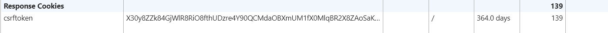
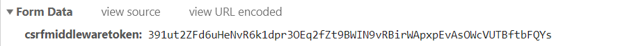

 本篇介绍csrf相关的装饰器，中间件，以及对部分源码进行分析。 

<!--more-->


# csrf相关的装饰器

```python
from django.views.decorators.csrf import csrf_exempt,csrf_protect
# csrf_exempt  豁免csrf校验
	csrf_exempt要加在CBV上，只能加dispatch上
# csrf_protect 强制进行csrf校验	
```

## csrf_exempt

-  豁免csrf校验

### FBV

```html
# home.html
<form action="" method="post">
    <input type="text" name="小伙子" value="欢迎回家">
    <button>提交</button>
</form>
```

- 只要添加 `csrf_exempt` 这个装饰器就可以豁免csrf校验

```python
from django.views.decorators.csrf import csrf_exempt
@csrf_exempt
def home1(request):    
    return render(request,'home.html')
```


### CBV

关于 `csrf_exempt`  两种无效的使用：

- 不用 method_decorator 是会报错的

```python
from django.views.decorators.csrf import csrf_exempt
class Home2(View):
    def get(self,request):
        return render(request, 'home.html')
    @csrf_exempt   # 直接这样添加是会报错的
    def post(self,request):
        return render(request, 'home.html')    
```

- 使用method_decorator 直接加在方法上也不行

```python
from django.views.decorators.csrf import csrf_exempt
from django.utils.decorators import method_decorator
class Home2(View):
    def get(self,request):
        return render(request, 'home.html')

    @method_decorator(csrf_exempt)  # 这样还是不行
    def post(self, request):
        return render(request, 'home.html')
```

关于给视图函数添加装饰器，详见 [Django的View](https://atlasnq.github.io/django/20190704-django_5.html)

正确的姿势：

- 给dispatch方法添加`csrf_exempt`  装饰器

```python
@method_decorator(csrf_exempt,name='dispatch')
class Home2(View):
    def get(self,request):
        return render(request, 'home.html')

    def post(self, request):
        return render(request, 'home.html')
```


## csrf_protect

- 强制进行csrf校验

### FBV

- 先在settings中注释掉关于csrf的中间件

```python
from django.views.decorators.csrf import csrf_protect
@csrf_protect
def home1(request):
    return render(request,'home.html')
```


CBV

- 不用method_decorator 是不行的。

```python
class Home2(View):
    def get(self,request):
        return render(request, 'home.html')
    # @csrf_protect 这种方式不行，会报 'Home2' object has no attribute 'COOKIES'
    @method_decorator(csrf_protect)
    def post(self, request):
        return render(request, 'home.html')
```


## ensure_csrf_cookie

待补充


# csrf中间件

有两个token

- 一个是Cookie中的csrftoken



- 一个是 input标签，名字为 `csrfmiddlewaretoken`，value是64位



cookie中的csrf token是不变的， input标签内的token是变化的。


想要通过csrf校验的先提条件，必须有csrftoken的cookie

1. ```
   设置 
   ```

   后面的源码分析中也会解释，有了它，就会在response的Cookie中设置csrftoken

2. ensure_csrf_cookie 这个装饰器，有了它，会在每次请求的response的Cookie中设置csrftoken

   

然后会把这两个token值作比较

1. 从cookie中获取csrftoken的值与post请求提交的数据中的csrfmiddlewaretoken的值做对比。
2. 如果request.POST中获取不到csrfmiddlewaretoken这个值，会尝试从请求头中获取 x-csrftoken的值，并且拿这个值与csrftoken做对比，对比成功也能通过校验。


# 源码分析


- 设置csrf_exempt = True , 会在 `CsrfViewMiddleware` 的 `process_view` 中使用

```python
# django\views\decorators\csrf.py
def csrf_exempt(view_func):
    """
    Marks a view function as being exempt from the CSRF view protection.
    """
    # We could just do view_func.csrf_exempt = True, but decorators
    # are nicer if they don't have side-effects, so we return a new
    # function.
    def wrapped_view(*args, **kwargs):
        return view_func(*args, **kwargs)
    wrapped_view.csrf_exempt = True    
    return wraps(view_func, assigned=available_attrs(view_func))(wrapped_view)
```

- CsrfViewMiddleware中间件的定义

```python
# django\middleware\csrf.py
class CsrfViewMiddleware(MiddlewareMixin):
    def process_request(self, request):
        # 该函数将Cookie中的csrftoken值添加到 request.META中
        csrf_token = self._get_token(request)
        if csrf_token is not None:
            # Use same token next time.
            request.META['CSRF_COOKIE'] = csrf_token
            
    def process_view(self, request, callback, callback_args, callback_kwargs):
        if getattr(request, 'csrf_processing_done', False):
            # 如果处理完成了，直接结束
            return None

        # Wait until request.META["CSRF_COOKIE"] has been manipulated before
        # bailing out, so that get_token still works
        if getattr(callback, 'csrf_exempt', False):
            # 如果由csrf_exempt豁免，也直接结束
            return None

        # Assume that anything not defined as 'safe' by RFC7231 needs protection
        # 没有标识安全的都将强制校验
        if request.method not in ('GET', 'HEAD', 'OPTIONS', 'TRACE'):...   
            # 如果不是这些方法
           省略...

        return self._accept(request)

     def process_response(self, request, response):
        if not getattr(request, 'csrf_cookie_needs_reset', False):
            if getattr(response, 'csrf_cookie_set', False):
                return response
        # 如果没有设置CSRF_COOKIE_USED，middleware会直接返回response而不在cookie里设置csrftoken。
        if not request.META.get("CSRF_COOKIE_USED", False):
            return response

        # Set the CSRF cookie even if it's already set, so we renew
        # the expiry timer.
        self._set_token(request, response)
        response.csrf_cookie_set = True
        return response
```

