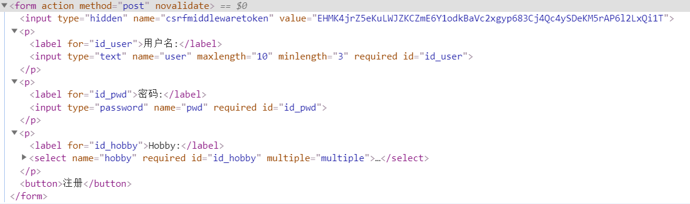

 对于用户输入前后端都是需要做校验的；按照以前的话我们需要对每一个输入进行校验，这样当输入内容增多，复杂度也会增加。对于这种情景Django为我们提供了form组件。 

<!--more-->

----------

通过这篇文章，你能了解到：

- form组件是什么?
- 局部钩子与全局钩子的定义。
- 字段、字段参数、widget插件、后端API等表格。
- 源码剖析 form组件是如何校验的。


# form组件

- 对于一个form我们需要做很多事情：不同的类型的数据要有不同的渲染；校验数据；获取检验后的干净数据，并将数据反序列化为相应数据类型如时间对象；保存传递给处理程序等等。

- Django的forms组件就完成了这些复杂的工作，提供方便的操作form的接口API给我们。


## form组件的主要功能

- 生成页面可用的HTML标签
- 对用户提交的数据进行校验
- 保留上次输入内容（源码剖析中会提到）


## 为什么要用form组件

### 以前的方式

- 写form表单以及所需input框

```html
# reg1.html
<form action="" method="post">
    
    <p>
        用户名: <input type="text" name="user" value="{{ user }}">
        <span style="color:red">{{ user_error }}</span>
    </p>
     <p>
        密码: <input type="password" name="pwd" value="{{ pwd }}">
    </p>

    <button>注册</button>
</form>
```

- 获取数据，然后写校验规则

```python
# views.py
def register(request):
    if request.method == "POST":
        user = request.POST.get('user')
        pwd = request.POST.get('pwd')
        # 对数据做校验
        if len(user) <= 6:
            user_error = '用户名太短了'
            return render(request, 'register.html', {'user': user, 'pwd': pwd, 'user_error': user_error})
        # 校验成功 保存数据库
        # 校验不成，返回填写的数据，错误提示

    return render(request, 'register.html')

```

缺点：当需要校验的内容多了，就会复杂


## 引例

生成页面可用的HTML标签

- 与前面相比，只需要在form表单内写待渲染的字段就可以 

```python
# reg2.html
<form action="" method="post" novalidate>
    
	{{ form_obj.as_p }}
    <button>注册</button>
</form>
```

对用户提交的数据进行校验

- 定义一个继承Form类的子类，很像orm中定义model的方式，我们定义form表单内相关元素（input，radio等等）的字段，字段参数是我们对该字段定义的规则。
- 对于GET请求返回页面的时候，只需要实例化定义的这个Form类
- 对于POST请求，将 `request.POST` 这个QueryDict作为参数重新实例化，有了这个对象就可以进行校验
- 通过 `对象.is_valid()` 的方法来进行校验
- 如果用户输入不符合该字段的规则，就会有提示产生。


```python
#forms.py
from django import forms

class RegForm(forms.Form):
    user = forms.CharField(label='用户名', min_length=6,max_length=12,) 
    pwd = forms.CharField(label='密码', widget=forms.PasswordInput)  

def reg2(request):
    form_obj = RegForm()
    if request.method == 'POST':
        form_obj = RegForm(data=request.POST)  # data是第一个位置参数
        if form_obj.is_valid():  # 做校验，校验之后有数据和错误信息
            # 插入数据库
            return HttpResponse('ok')

    return render(request, 'reg2.html', {"form_obj": form_obj})
```


通过这个例子我们就要开始学习django为我们提供的这个方便工具。


# 完善引例

我们显然需要更加细粒度的操作：

- 我们想要定义label的名字；错误提示信息；
- 对提交内容自定义校验；
- 使用全局钩子来做密码与确认密码的一致性检验；
- 当注册成功后，注册下一个的时候信息已经更新，而不是重启项目来更新数据。

 

## 渲染

### 自动渲染

引例中使用的 &#123;&#123;form_obj.as_p }} 是自动渲染的方式，按照P段落渲染,将所有的表单元素包裹在P标签内，效果如下图所示：



更详细的自动渲染见后文 FORM后端API


### 自定义错误信息

- 在该字段的参数内覆写error_messages

```python
    user = forms.CharField(
        label='用户名',
        min_length=6,
        max_length=10,
        error_messages={
            'required': '该字段是必填的~',
            'min_length':'至少是6位',
        },
        widget=[check_user],
    ) 
```


### 手动渲染

- 自定义p标签和label标签，label标签的内容为 &#123;&#123; field.label }}
- 标签后跟 &#123;&#123;  field }}
- span标签内放产生错误的信息  &#123;&#123; field.errors.0 &#125;&#125; 由于本例中错误只会产生一个，取第一个就可以
- 这样这样变量就会被渲染

```html
<form action="" method="post" novalidate>
    
    <p>
        <label for="{{ form_obj.user.id_for_label }}">{{ form_obj.user.label }}: </label>{{ form_obj.user }}
        <span>{{ form_obj.user.errors.0 }}</span>
    </p>
     <p>
        <label for="{{ form_obj.phone.id_for_label }}">{{ form_obj.phone.label }}: </label>{{ form_obj.phone }}
        <span>{{ form_obj.phone.errors.0 }}</span>
    </p>
    <p>
        <label for="{{ form_obj.Email.id_for_label }}">{{ form_obj.Email.label }}: </label>{{ form_obj.Email }}
        <span>{{ form_obj.Email.errors.0 }}</span>
    </p>
    <p>
        <label for="{{ form_obj.birth_day.id_for_label }}">{{ form_obj.birth_day.label }}: </label>{{ form_obj.birth_day }}
        <span>{{ form_obj.birth_day.errors.0 }}</span>
    </p>
     <p>
        <label for="{{ form_obj.gender.id_for_label }}">{{ form_obj.gender.label }}: </label>{{ form_obj.gender }}
        <span>{{ form_obj.gender.errors.0 }}</span>
    </p>
    <p>
        <label for="{{ form_obj.pwd.id_for_label }}">{{ form_obj.pwd.label }}: </label>{{ form_obj.pwd }}
        <span>{{ form_obj.pwd.errors.0 }}</span>
    </p>
    <p>
        <label for="{{ form_obj.re_pwd.id_for_label }}">{{ form_obj.re_pwd.label }}: </label>{{ form_obj.re_pwd }}
        <span>{{ form_obj.re_pwd.errors.0 }}</span>
    </p>

    <button>注册</button>
</form>
```

- 完善常用注册需要的字段
- 使用 is_valid方法进行校验

## 校验

### 内置校验器

- 使用内置校验器RegexValidator 完成对手机号的校验

```python
from django.core.validators import RegexValidator
phone = forms.CharField(label='手机',validators=[RegexValidator('^1[3-9]\d{9}$','手机号格式不正确')])
```


### 自定义校验器

字段参数中有一个是validators 这个参数是自定义校验器需要附加的。

```python
# views.py
from django.core.exceptions import ValidationError
import re
def phone_check(value):
    phone_re = re.compile('^1[3-9]\d{9}$')
    if not phone_re.match(value):
        raise ValidationError('手机号格式不正确')
        
对于 phone字段只需要添加就可以
phone = forms.CharField(label='手机',validators=[phone_check])
```


## 钩子

### 局部钩子

局部钩子就是在子类中重写父类的 `clean_field` 方法

- 没有参数，通过self.cleaned_data来获取字段值

- 如果不通过建议抛出ValidationError
- 通过校验必须返回当前字段的值

例子：

- 继续写对手机的校验

```python
class RegForm(forms.Form):	
    其它字段同前面所以省略...
    phone = forms.CharField(label='手机', )
    
    def clean_phone(self):
        # 局部(针对一个字段)钩子
        v = self.cleaned_data.get('phone')
        phone_re = re.compile('^1[3-9]\d{9}$')
        if not phone_re.match(v):
            # # 不通过校验 抛出异常
            raise ValidationError('手机号格式不正确')
        # 通过校验, 必须返回当前字段的值
        return v
```

为什么要返回当前字段的值呢？

```python
def _clean_fields(self):
    前面省略...    
    if hasattr(self, 'clean_%s' % name):    # 局部钩子，
        value = getattr(self, 'clean_%s' % name)()
        self.cleaned_data[name] = value
```

更多细节见后文源码剖析。


### 全局钩子

定义全局钩子：

- 没有参数，通过self.cleaned_data来获取字段值


例子：判断密码和确认密码是否一致

```python
class RegForm(forms.Form):	
    其它字段同前面所以省略...
     pwd = forms.CharField(label='密码', widget=forms.PasswordInput)
    re_pwd = forms.CharField(label='确认密码', widget=forms.PasswordInput)
    def clean(self):
        # 全局钩子
        pwd = self.cleaned_data.get('pwd')
        re_pwd = self.cleaned_data.get('re_pwd')
        if pwd and pwd != re_pwd:
            self.add_error('re_pwd', '两次密码不一致')  # 不在这写这个，错误显示的key为 __all__,不容易找 ，在{{ form_obj.non_field_errors }} 里
            raise ValidationError('两次密码不一致')
        return self.cleaned_data
```


## 随着数据库更新而更新

有些字段是会随着数据库的更新而更新

例如：ModelChoiceField(QuerySet)

- 在定义一个字段

```python
# views.py
hobby = forms.ModelChoiceField(models.Hobby.objects.all())
```

- models中写写入这个类

```python
# models.py
class Hobby(models.Model):
    name = models.CharField(max_length=12)
    def __str__(self):
        return self.name
```

- 这样页面中的信息会随着数据库中该字段的改变而改变


# 表格汇总

## 常用字段


| 字段名称            | 默认插件               | 错误使用参数                                                 | 解释                                                         |
| ------------------- | ---------------------- | ------------------------------------------------------------ | ------------------------------------------------------------ |
| BooleanField        | CheckboxInput          | required                                                     | 所有field的子类默认都设置了required=True.而布尔字段没有选中意味着False,会触发requird错误。<br />因此在布尔字段上要特别设置required=False |
| CharField           | TextInput              | required, max_length, min_length                             | 得到一个unicode字符串,<br />如果设置最大和最小长度,在HTML内就会验证.如果不设置最大和最小,任何输入都可以通过验证<br />参数strip,默认为True,表示去除输入前后空格. |
| ChoiceField         | Select                 | required, invalid_choice                                     | 用于单选的字段,更改默认的widget时候必须注意搭配,<br />choices的参数必须是可迭代的序列,每一个元素是一个2个元素的元组,第一个元素是值,第二个是显示的内容.如choices=((1, '男'), (2, '女')) |
| DateField           | DateInput              | required, invalid                                            | 返回一个Python的 datetime.date 对象,HTML表现形式是一个日期输入框.可以用input_formats字符串格式化参数指定具体样式<br />forms.DateField(input_formats=['%Y-%m']) |
| DateTimeField       | DateTimeInput          | required, invalid                                            | 与DateField类似.也有input_formats字符串格式化参数 <br />如input_formats=['%Y-%m'] |
| DecimalField        | NumberInput或TextInput | required, invalid, max_value, min_value, max_digits, max_decimal_places, max_whole_digits | 十进制浮点数字段,返回Python的decimal对象,可选参数是最大值,最小值,最大位数,最大小数位数 |
| DurationField       | TextInput              | required, invalid                                            | 返回一个Python timedelta对象,表示间隔.                       |
| EmailField          | EmailInput             | required, invalid                                            | 返回unicode字符串的邮件地址.可选参数是 max_length min_length. |
| FileField           | ClearableFileInput     | required, invalid, missing, empty, max_length                | 上传文件.返回一个Uploadfile对象,包含文件名和文件内容.两个可选参数max_length和allow_empty_file.上传文件的时候还需要[对form元素进行设置](https://docs.djangoproject.com/en/1.11/ref/forms/api/#binding-uploaded-files). |
| FilePathField       | Select                 | required, invalid, max_value, min_value                      | 选择文件上传,有一个必须参数path来指定想要开始选择的目录.具体看[这里](https://docs.djangoproject.com/en/1.11/ref/forms/fields/#filepathfield) |
| FloatField          | NumberInput或TextInput | required, invalid                                            | 可选参数为max_value 和 min_value,控制最大和最小值.           |
| ImageField          | ClearableFileInput     | required, invalid, missing, empty, invalid_image             | 与上传文件类似,但使用ImageField需要安装pillow库.             |
| IntegerField        | NumberInput或TextInput | required, invalid, max_value, min_value                      | 可选参数是max_value 和 min_value                             |
| MultipleChoiceField | SelectMultiple         | required,<br />invalid_choice, invalid_list                  | 使用choices属性传入选择项.用于多选.更改默认对应的widget时候注意搭配 |

所有字段可在 `django.forms.fields` 下查看

```python
# django.forms.fields.py
__all__ = (
    'Field', 'CharField', 'IntegerField',
    'DateField', 'TimeField', 'DateTimeField', 'DurationField',
    'RegexField', 'EmailField', 'FileField', 'ImageField', 'URLField',
    'BooleanField', 'NullBooleanField', 'ChoiceField', 'MultipleChoiceField',
    'ComboField', 'MultiValueField', 'FloatField', 'DecimalField',
    'SplitDateTimeField', 'GenericIPAddressField', 'FilePathField',
    'SlugField', 'TypedChoiceField', 'TypedMultipleChoiceField', 'UUIDField',
)
```


## 字段参数

- 验证相关的条件

- 参考[Core field arguments 核心字段属性](https://docs.djangoproject.com/en/1.11/ref/forms/fields/#core-field-arguments),这些Core field arguments是建立Form对象里的fields时一定要包含的属性

| 属性名               | 解释                                                         |
| -------------------- | ------------------------------------------------------------ |
| Field.required       | 默认设置为True,表示一定要输入内容,None或者空字符串都会引发错误. |
| Field.label          | 用于生成HTML代码对应该输入元素的label标签的text内容.         |
| Field.label_suffix   | 用于覆盖整个表单级别的label_suffix,就是给label的text部分加上后缀 |
| Field.initial        | 设置初始化的值,也就是设置标签的value属性.<br />注意,不同的field,initial需要被设置成对应的对象,比如时间字段就必须用datetime系列对象赋值给initial属性 |
| Field.widget         | 设置对应的widget类,用于控制具体的HTML代码                    |
| Field.help_text      | 在HTML中显示帮助文本信息                                     |
| Field.error_messages | 用于覆盖默认的错误信息,需要采用error_messages={‘required’: ‘Please enter your name’}类似的方法来传入,前边的键就是**错误键的名称**,值是自定义的**错误信息**. |
| Field.validators     | 选择针对该字段的验证器,验证器的详细看[这里](https://docs.djangoproject.com/en/1.11/ref/validators/) |
| Field.localize       | 和本地化有关,控制结果的本地化输出.                           |
| Field.disabled       | 设置表单元素的属性是否为disabled                             |
| Field.has_changed()  | 检测元素的值是否从initial值发生了变化,返回布尔类型.          |
| Field.choices        | choices的参数必须是可迭代的序列,每一个元素是一个2个元素的元组,第一个元素是值,第二个是显示的内容.如choices=((1, '男'), (2, '女')) |
| Field.min_length     | 字段最短长度                                                 |
| Field.max_length     | 字段最长长度                                                 |


### error_messages中的key

`null`, `blank`, `invalid`, `invalid_choice`, `unique`, `unique_for_date` and `invalid_date`


### 内置validators

| 校验器                                                       | 解释                                                         |
| ------------------------------------------------------------ | ------------------------------------------------------------ |
| `RegexValidator`( ***regex=None***, *message=None* **,** *code=None*,...) | 正则校验器 <br />regex正则表达式<br />message：错误提示<br />code用于覆盖原来 |
| `EmailValidator`( *message=None* )                           | 邮箱校验器<br />message：错误提示                            |
| `URLValidator`(*schemes=None***,** *regex=None***,** *message=None*,...) | URL校验器<br />默认schemes是`['http', 'https', 'ftp', 'ftps']` |
| `validate_email`                                             | 一个 EmailValidator 的不带任何参数的实例                     |
| `validate_slug`                                              | 一个正则表达式验证器的实例,仅能验证字母,数字,减号和下划线的组合 |
| `validate_unicode_slug`                                      | 一个正则表达式验证器的实例,仅能验证UNICODE的字母,数字,减号和下划线的组合 |
| `validate_ipv4_address`                                      | 一个正则表达式验证器的实例,验证合法的ipv4地址                |
| `validate_ipv6_address`                                      | 这是一个用了django.utils.ipv6 模块的ipv6地址的验证器         |
| `validate_ipv46_address`                                     | 实际上是同时使用了前边两个验证器的实例                       |
| validate_comma_separated_integer_list                        | 一个正则表达式验证器的实例,验证逗号分割的数字                |
| `MaxValueValidator(max_value, message=None)`                 | 最大值验证器,max_value参数默认使用该验证器                   |
| `MinValueValidator(min_value, message=None)`                 | 最小值验证器                                                 |
| `MaxLengthValidator(max_length, message=None)`               | 最大长度验证器                                               |
| `MinLengthValidator(min_length, message=None`                | 最小长度验证器                                               |
| `DecimalValidator(max_digits, decimal_places)`               | Decimal类型验证器<br />max_digits 是总的最长位数<br />decimal_places 是小数的位数 |

更多详见 [django-validators](https://docs.djangoproject.com/en/1.11/ref/validators/)


## Widgets 插件

- 渲染成想要的HTML。

- [widget](https://docs.djangoproject.com/en/1.11/ref/forms/widgets/),官方文档的原话是: A widget is Django’s representation of an HTML input element.也就是说一个插件就对应着一段HTML代码.

- 通过fields可以知道要拿到哪一种数据类型,通过**字段参数**可以得到验证相关的条件,widget则是最后一步,即**将字段的逻辑通过HTML展示出来**.同时widget也有各种属性可以设置,用于更好的控制具体HTML代码.

- 所有的widget类都继承自 Widget 和 MultiWidget 两个类,其中Widget有**attrs属性**,用来设置HTML标签的各种属性,常用的是设置css类从而应用样式.


|     内建的Widget类     |                                                              |
| :--------------------: | :----------------------------------------------------------: |
|          类名          |                             解释                             |
|       TextInput        |    输入类型是text,渲染的时候按照<input type=”text” …>渲染    |
|      NumberInput       |      输入类型是number,渲染的时候是number类型的input标签      |
|       EmailInput       |               渲染的时候是email类型的input标签               |
|        URLInput        |                      URL类型的input标签                      |
|     PasswordInput      | password类型的input标签,可以带一个额外属性是render_value,表示验证失败之后填写在密码框内的值,默认是False即保留原来的值 |
|      HiddenInput       |                   类型是hidden 的input标签                   |
|       DateInput        |   类型是text的input标签,可以使用额外参数format来控制格式化   |
|     DateTimeInput      |            类型是text的input标签,同样有format属性            |
|       TimeInput        |            类型是text的input标签,同样有format属性            |
|        Textarea        |                      渲染为textarea标签                      |
|     CheckboxInput      | 渲染为checkbox对象,有一个调用方法是check_test,检查是否应该选中这个值 |
|         Select         | 渲染为select及内嵌的option标签.有choices属性用于设置各个选项 |
|     SelectMultiple     |          多选,渲染为`<select multiple="multiple">`           |
|      RadioSelect       | 渲染成一个ul,每个li内部包含一个radio类型的input,模板内的标签使用方法比较多,具体看[这里](https://docs.djangoproject.com/en/1.11/ref/forms/widgets/#radioselect) |
| CheckboxSelectMultiple |    渲染成一个ul,每个li内包含一个类型是checkbox的input标签    |
|       FileInput        |                 渲染成<input type=”file” …>                  |

例如：

```python
gender = forms.ChoiceField(choices=((1, '男'), (2, '女')),widget=forms.RadioSelect)
```


## form后端API

|                   Form API                    |                                                              |
| :-------------------------------------------: | :----------------------------------------------------------: |
|                 属性或方法名                  |                             解释                             |
|                 Form.is_bound                 | 如果没有任何数据传入而新建Form对象,这是一个没有绑定的Form对象,如果传入了数据比如request.POST,这就是一个绑定了一个具体表单的数据,这个方法返回Form对象是否是一个绑定的对象 |
|                 Form.clean()                  | 执行校验；使用clean方法意味着调用`is_valid()`方法然后返回一个布尔值 |
|                  Form.errors                  | 返回**错误键与错误内容的字典**.调用该属性和is_valid()方法都会触发对Form对象的校验. |
|             Form.errors.as_data()             |               错误键不变,值变成原始的错误对象                |
|    Form.errors.as_json(escape_html=False)     | 将错误序列化为JSON对象,可加上 escape_html=True进行转义以便直接在HTML内使用 |
|                 Form.initial                  | 用字典的形式设置初始值,如果Form对象通过initial属性和字段的initial属性都设置了初始值,以Form对象的优先. |
| Form.get_initial_for_field(field, field_name) | 取得初始值,按照先取Form.initial,再取fields.initial的顺序,如果初始值需要求值也会被求值. |
|              Form.has_changed()               | 整个表单的初始值是否改变,需要先设置Form的initial属性,然后调用该方法即可查看是否改变. |
|               Form.changed_data               |        返回一个列表,包含所有与初始值有变化的字段名称.        |
|                  Form.fields                  | 直接用对象的字段变量名就可以访问该字段.之后再用field的那些arguments就可以访问字段的各种属性 |
|               Form.cleaned_data               | 当is_valid()或其他触发验证的动作实行后,如果通过了验证,则所有的数据会被包含在这个属性对应的一个字典里.而且所有的数据都被整理过,比如从前边可以知道,时间类型默认对应的widget是text类型,但是在cleaned_data中,时间类型的数据会被整理成datetime类型.其他的数据类型可以参考field部分的表格. |
|                  Form.as_p()                  | 按照P段落渲染,将所有的表单元素包裹在P标签内.改变的是直接print(Form对象)的结果. |
|                 Form.as_ul()                  |      将每一个表单元素放进一个ul的li元素中,影响print结果      |
|                Form.as_table()                | 包裹在tr th标签里,但是table元素需要页面来提供,一般不采用该方法. |
|               Form.label_suffix               | 这个属性的内容会在渲染的时候追加到所有的label 的text内容之后. |
|          Form.use_required_attribute          | 这个属性被设置成True的时候,所有必须填写的表单元素标签内都会带有required 的HTML 5 属性. |


## 在模板内使用Form对象

- 表单的关键,是展示提示,输入框以及错误信息.[Form对象如何在HTML中展示](https://docs.djangoproject.com/en/2.0/ref/forms/api/#ref-forms-api-outputting-html)

### 自动渲染

自动渲染就是一次性将整个form按照某种形式渲染出来,不单独操作表单的各个元素.

- &#123;&#123; form.as_table }}
- &#123;&#123; form.as_p }}
- &#123;&#123; form.as_ul }}

如果在对象内不做任何设置,那么元素的id会被自动设置成id_属性名.这种方法可自定义的部分较少,需要后期慢慢配样式.一般采用第二种方法.

### 手动渲染

手动渲染就是将传入模板的form对象的各个字段和错误信息取出,自行编写.

- &#123;&#123; form.name_of_field }} 表示渲染表单中的一个输入元素.
- &#123;&#123; form.name_of_field.label }}表示 该字段对应的label标签.
- &#123;&#123; form.name_of_field.errors }}表示经过验证后的该字段对应的错误消息.由于错误信息只会同时有一个,所以一般用&#123;&#123; form.name_of_field.errors.0 }}取出错误信息.

例如：

```html
    <p>
        <label for="{{ form_obj.user.id_for_label }}">{{ form_obj.user.label }}: </label>{{ form_obj.user }}
        <span>{{ form_obj.user.errors.0 }}</span>
    </p>
```


### 模板内的操作列表

- user字段 = form_obj.user

|  Form对象在模板内的操作   |                                                              |
| :-----------------------: | :----------------------------------------------------------: |
|          tag名称          |                             解释                             |
|     {{ field.label }}     |             字段的label属性的内容,就是一个字符串             |
|   {{ field.label_tag }}   |         一个完整的label标签,推荐使用该tag与field搭配         |
| {{ field.id_for_label }}  |                       这个字段使用的id                       |
|     {{ field.value }}     |          字段的值,提交表单之后会动态根据当前值改变           |
|   {{ field.html_name }}   |                       html的name属性值                       |
|   {{ field.help_text }}   |                           帮助信息                           |
|    {{ field.errors }}     | 当前字段的错误信息,如果验证通过则不会有错误信息.可以对其迭代取出所有错误或者用.0取第一个错误内容<br />如何过当前对象的话就是所有字段的错误 |
|   {{ field.is_hidden }}   |                   判断当前字段是否是隐藏的                   |
| {{ form.hidden_fields }}  | 这里注意之前的是field的属性,这里是form的属性,表示表单内的全部hidden字段,可以迭代取出具体字段 |
| {{ form.visible_fields }} |                    这个是所有的可视字段.                     |


推荐阅读 [Django 14 Django进阶-Django Form组件](http://www.conyli.cc/archives/1325)


# 源码剖析

## 第一块

回到最开始！我们使用 is_valid() 进行校验 点击进入

- is_valid 返回布尔值

```python
# django\forms\forms.py
def is_valid(self):
        """
        Returns True if the form has no errors. Otherwise, False. If errors are
        being ignored, returns False.
        """
        return self.is_bound and not self.errors
```

点击进入 self.errors

```python
    @property
    def errors(self):
        "Returns an ErrorDict for the data provided for the form"
        if self._errors is None:
            # 如果还是初始化 调用这个方法
            self.full_clean()
        return self._errors
```

点击进入full_clean

- self._errors 是一个存放错误信息的字典
- self.cleaned_data 是一个存放通过校验的数据字典

```python
    def full_clean(self):
        """
        Cleans all of self.data and populates self._errors and
        self.cleaned_data.
        """
        self._errors = ErrorDict() # 定义一个存放错误信息的字典
        if not self.is_bound:  # Stop further processing.
            return
        self.cleaned_data = {}  # 校验完成之后，存放通过校验的数据
        # If the form is permitted to be empty, and none of the form data has
        # changed from the initial data, short circuit any validation.
        if self.empty_permitted and not self.has_changed():
            return

        self._clean_fields()
        self._clean_form()
        self._post_clean()
```

## 第二块

点击进入_clean_fields  

```python
    def _clean_fields(self):
		# 校验字段
        for name, field in self.fields.items():
            # print(name, field)  # self.fields是一个有序字典，
            # field是一个对象
            # value_from_datadict() gets the data from the data dictionaries.
            # Each widget type knows how to retrieve its own data, because some
            # widgets split data over several HTML fields.
            if field.disabled:
                # 从这个字段去拿初始值，而不去前端拿，提高了安全性
                # 这里也是最开始提到的保留上次输入内容
                # 应用场景：确认信息
                value = self.get_initial_for_field(field, name)
            else:
                # 可以编辑的话从前端的input去拿
                value = field.widget.value_from_datadict(self.data, self.files, self.add_prefix(name))
            try:
                if isinstance(field, FileField):
                    initial = self.get_initial_for_field(field, name)
                    value = field.clean(value, initial)
                else:
                    value = field.clean(value)  # 当前字段内置的校验以及校验器的校验
                self.cleaned_data[name] = value  # 给局部钩子使用的，因为局部钩子没有传参
                if hasattr(self, 'clean_%s' % name):    # 局部钩子，
                    value = getattr(self, 'clean_%s' % name)()
                    self.cleaned_data[name] = value
            except ValidationError as e:
                self.add_error(name, e)
```

点击 value = field.clean(value) 进入clean

```python
    def clean(self, value):
        """
        Validates the given value and returns its "cleaned" value as an
        appropriate Python object.

        Raises ValidationError for any errors.
        """
        value = self.to_python(value)
        self.validate(value)        # 内置校验方法，校验是否为空或者是否是必填字段
        self.run_validators(value)  # 校验器
        return value
```

点击进入validate

```python
  def validate(self, value):
        if value in self.empty_values and self.required:
            raise ValidationError(self.error_messages['required'], code='required')
```

返回，然后点击进入run_validators

- 对一个字段，遍历这个字段的校验器并执行
- 校验器出现异常会抛出ValidationError 异常

```python
    def run_validators(self, value):
        if value in self.empty_values:
            return
        errors = []
        for v in self.validators:
            try:
                v(value)    # 这里也不接受返回值，所以我们的校验器不需要返回值
            except ValidationError as e:
                # 所以自定义的validator只能检测ValidationError异常
                if hasattr(e, 'code') and e.code in self.error_messages:
                    e.message = self.error_messages[e.code]
                errors.extend(e.error_list)
        if errors:
            raise ValidationError(errors)
```

返回到_clean_fields这里

- `self.cleaned_data[name] = value ` 是为了给局部钩子使用的，因为局部钩子没有传参

- clean_%s 就是我们定义局部钩子的所在，为什么局部钩子必须返回该字段的值呢? 因为 成功的话会给cleaned_data添加这个键值对。

  ```python
  value = getattr(self, 'clean_%s' % name)()
  self.cleaned_data[name] = value
  ```

点击进入 add_error

- 对于未绑定字段如 `__all__` ，就会存放在non_field_errors中
- 删除未通过局部钩子的无效字段 `del self.cleaned_data[field] `

```python
    def add_error(self, field, error):
   
        if not isinstance(error, ValidationError):
            # Normalize to ValidationError and let its constructor
            # do the hard work of making sense of the input.
            error = ValidationError(error)

        if hasattr(error, 'error_dict'):
            if field is not None:
                raise TypeError(
                    "The argument `field` must be `None` when the `error` "
                    "argument contains errors for multiple fields."
                )
            else:
                error = error.error_dict
        else:
            error = {field or NON_FIELD_ERRORS: error.error_list}

        for field, error_list in error.items():
            if field not in self.errors:
                if field != NON_FIELD_ERRORS and field not in self.fields:
                    raise ValueError(
                        "'%s' has no field named '%s'." % (self.__class__.__name__, field))
                if field == NON_FIELD_ERRORS:
                    # 如果没有绑定字段，就会存放在non_field_errors中，例如全局变量中做两个密码的校验，如果不绑定字段会把错误放在这里
                    self._errors[field] = self.error_class(error_class='nonfield')
                else:
                    self._errors[field] = self.error_class()
            self._errors[field].extend(error_list)  # 添加错误信息
            # print(error_list)
            if field in self.cleaned_data:
                # self.cleaned_data[name] = value 删除未通过局部钩子的无效字段
                del self.cleaned_data[field]
```

关于_clean_fields就结束了

## 第三块

返回到full_clean 中，点击进入_clean_form

```python
 def _clean_form(self):
        try:
            cleaned_data = self.clean()
        except ValidationError as e:
            self.add_error(None, e)
        else:
            if cleaned_data is not None:
                self.cleaned_data = cleaned_data
```

点击进入clean

- 这里就是我们**定义全局钩子**的地方啦

```python
    def clean(self):
        # 全局钩子
        """
        Hook for doing any extra form-wide cleaning after Field.clean() has been
        called on every field. Any ValidationError raised by this method will
        not be associated with a particular field; it will have a special-case
        association with the field named '__all__'.
        """
        return self.cleaned_data
```

返回_clean_form ， 由于 使用cleaned_data接收结果，所以我们在定义全局钩子的时候当校验成功必须返回cleaned_data。所以这里的思想就是我们要对通过校验的字段，再一次使用全局钩子进行校验。

再次返回到full_clean 中，点击进入_post_clean

- 这也是一个额外的钩子，在form cleaning之后再次进行校验，用于与model进行校验

```python
 def _post_clean(self):
        """
        An internal hook for performing additional cleaning after form cleaning
        is complete. Used for model validation in model forms.
        """
        pass
```

到此，我们的full_clean 方法执行完毕，errors方法执行完毕，返回错误信息这个字典（ErrorDict）

到此is_valid执行结束。


## 小结

1. is_valid()中要执行full_clean()：
   1. self._errors ={}    定义一个存放错误信息的字典   
   2. self.cleaned_data = {}   #  定义一个存放有效的数据
2. 执行self._clean_fields()
   1. 先执行内置的校验和校验器的校验
   2. 有局部钩子，执行局部钩子
3. 执行 self.clean() 全局钩子


