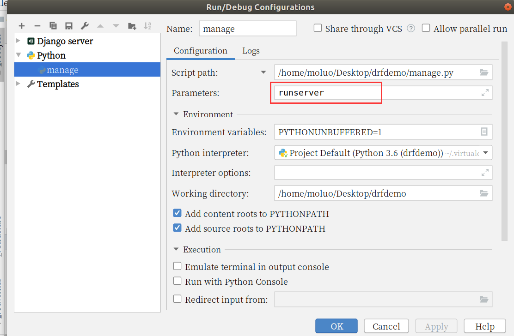
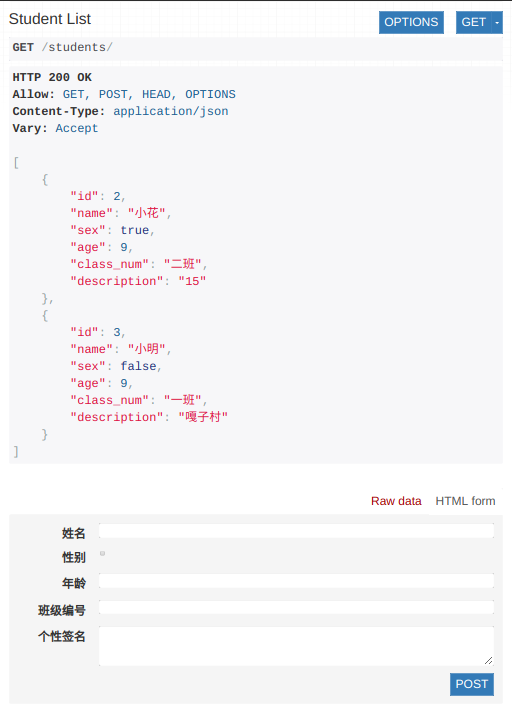
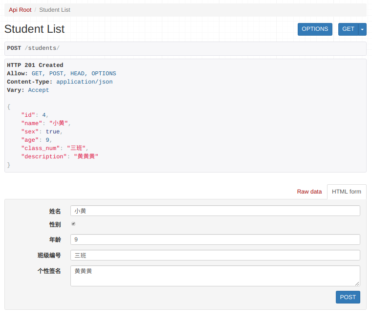
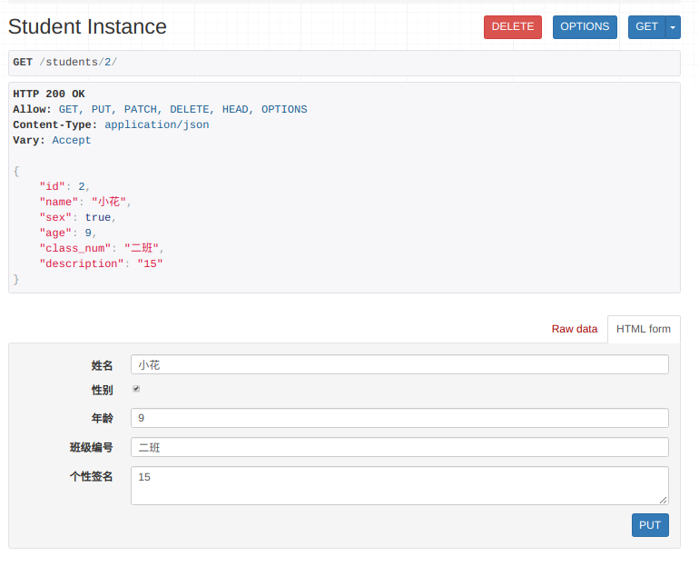

 Django Rest_Framework是一个建立在Django基础之上的Web 应用开发框架，帮助我们快速的开发REST API接口应用。 

<!--more-->

# 概述

> Django REST framework是一个建立在Django基础之上的Web 应用开发框架，可以快速的开发REST API接口应用。在REST framework中，提供了**序列化器** Serialzier 的定义，可以帮助我们简化序列化与反序列化的过程，不仅如此，还提供丰富的类视图、扩展类、视图集来简化视图的编写工作。REST framework还提供了认证、权限、限流、过滤、分页、接口文档等功能支持。REST framework提供了一个API 的Web可视化界面来方便查看测试接口。

中文文档：https://q1mi.github.io/Django-REST-framework-documentation/#django-rest-framework

github: https://github.com/encode/django-rest-framework/tree/master

DRF的核心思想：缩减编写API接口的代码！

## 特点

- 提供了定义序列化器Serializer的方法，可以快速根据 Django ORM 或者其它库自动序列化/反序列化；
- 提供了丰富的类视图、Mixin扩展类，简化视图的编写；
- 丰富的定制层级：函数视图、类视图、视图集合到自动生成 API，满足各种需要；
- 多种身份认证和权限认证方式的支持；[jwt]
- 内置了限流系统；
- 直观的 API web 界面；
- 可扩展性，插件丰富


# 环境安装与配置

DRF需要以下依赖：

- Python (2.7, 3.2, 3.3, 3.4, 3.5, 3.6)
- Django (1.10, 1.11, 2.0)

**DRF是以Django扩展应用的方式提供的，所以我们可以直接利用已有的Django环境而无需从新创建。（若没有Django环境，需要先创建环境安装Django）**


## 安装DRF

前提是已经安装了django，建议安装在虚拟环境

```python
# mkvirtualenv drfdemo -p python3
	# 执行上面的命令会在当前路径下创建虚拟环境，ubuntu下可以输入ll查看。
    # 如果想再次启动虚拟环境，可进入虚拟环境的bin目录，使用 source activate 进入虚拟环境。
# pip install django

pip install djangorestframework
pip install pymysql
	# pymysql为操作数据库模块
```

Tips：windows复制的内容，在Linux中可以使用shift + insert的快捷方式进行粘贴。


### 创建django项目

```python
cd ~/Desktop
django-admin startproject drfdemo
```

Tips：如果是在虚拟环境下安装的DRF，则这里使用虚拟环境的python创建项目。

使用pycharm打开项目，设置虚拟环境的解析器，并修改manage.py中的后缀参数。




## 注册rest_framework

在**settings.py**的**INSTALLED_APPS**中添加`'rest_framework'`。

```python
INSTALLED_APPS = [
    ...
    'rest_framework',
]
```

接下来就可以使用DRF提供的功能进行api接口开发了。在项目中如果使用rest_framework框架实现API接口，主要有以下三个步骤：

- 将请求的数据（如JSON格式）转换为模型类对象
- 操作数据库
- 将模型类对象转换为响应的数据（如JSON格式）


# 快速实现

体验 DRF 的优雅！ 


### 基本准备（同Django）

① 创建 students 子应用，并注册

```python
python manage.py startapp students
```

做法同注册rest_framework，写在它的下面：

```
INSTALLED_APPS = [
    ...
    'rest_framework',
    
    'students',    
]
```

Tips：内置的APP与我们编写的APP中间空一行，便于区分


② 定义models

```python
class Student(models.Model):
    # 模型字段
    name = models.CharField(max_length=100,verbose_name="姓名")
    sex = models.BooleanField(default=1,verbose_name="性别")
    age = models.IntegerField(verbose_name="年龄")
    class_num = models.CharField(max_length=5,verbose_name="班级编号")
    description = models.TextField(max_length=1000,verbose_name="详情描述")

    class Meta:
        db_table="tb_student"
        verbose_name = "学生"
        verbose_name_plural = verbose_name
```


③ 在MySQL数据库中创建库，并修改 `settings.py` 的配置

```
create database students charset=utf8mb4;
```

修改  `settings.py` 的 `DATABASES`

```python
DATABASES = {
    # 'default': {
    #     'ENGINE': 'django.db.backends.sqlite3',
    #     'NAME': os.path.join(BASE_DIR, 'db.sqlite3'),
    # },
    'default': {
        'ENGINE': 'django.db.backends.mysql',
        'NAME': "students",
        "HOST": "127.0.0.1",
        "PORT": 3306,
        "USER": "root",
        "PASSWORD":"123",
    }
}
```


④ 使用pymysql模块

在settings.py的同级目录中的 `__init__.py` 中写入如下内容：

```python
import pymysql
pymysql.install_as_MySQLdb()
```


⑤ Terminal下执行数据库迁移

```python
python manage.py makemigrations
python manage.py migrate
```


执行数据库迁移时可能出现如下错误：

第一个错误：


解决方案：

```python
注释掉 backends/mysql/base.py中的35和36行代码。
```

第二个错误：


解决方案：

backends/mysql/operations.py146行里面新增一行代码：


补充：我们需要注释掉关于CSRF的中间件，因为是前后端分离，所以不再需要这个中间件了。


### 使用DRF

#### 创建序列化器

在students应用目录中新建serializers.py用于保存该应用的序列化器。

创建一个StudentModelSerializer用于序列化与反序列化。

```python
# 创建序列化器类，将在试图中被调用
from rest_framework import serializers
from .models import Student

class StudentModelSerializer(serializers.ModelSerializer):
    class Meta:
        model = Student
        fields = "__all__"
```

- **model** 指明该序列化器处理的数据字段从模型类Student参考生成
- **fields** 指明该序列化器包含模型类中的哪些字段，'`__all__`'指明包含所有字段


#### 编写视图

在students应用的views.py中创建视图StudentViewSet，这是一个视图集合。

```python
from rest_framework.viewsets import ModelViewSet
from .models import Student
from .serializers import StudentModelSerializer
# Create your views here.
class StudentViewSet(ModelViewSet):
    queryset = Student.objects.all()
    serializer_class = StudentModelSerializer
```

- **queryset** 指明该视图集在查询数据时使用的查询集
- **serializer_class** 指明该视图在进行序列化或反序列化时使用的序列化器


#### 定义路由

在students应用的urls.py中定义路由信息。

```python
from . import views
from rest_framework.routers import DefaultRouter

# 路由列表
urlpatterns = []

router = DefaultRouter()  # 可以处理视图的路由器
router.register('students', views.StudentViewSet)  # 向路由器中注册视图集

urlpatterns += router.urls  # 将路由器中的所以路由信息追到到django的路由列表中
```

最后把students子应用中的路由文件加载到总路由文件中.

```python
from django.contrib import admin
from django.urls import path,include

urlpatterns = [
    path('admin/', admin.site.urls),
    path("",include("students.urls")),
]
```


### 运行测试

运行当前程序（与运行Django一样）

```shell
python manage.py runserver
```

在浏览器中输入网址127.0.0.1:8000，可以看到DRF提供的API Web浏览页面：


1. 点击链接 `http://127.0.0.1:8000/students/` 可以访问**获取所有数据的接口**（查询所有学生），呈现如下页面：




填写表单中的内容，点击POST（增），即可创建一个成员，然后返回如下页面:




再次编辑表单中的内容，可修改当前成员的信息。

地址栏输入 `http://127.0.0.1:8000/students/2/` 即可查看单个成员：




对于这个成员，使用PUT可以修改成员的内容，使用DELETE可以删除该成员。


# 总结

在DRF的帮助下，我们可以编写更短的代码来实现 RESTful API接口。在这里序列化器起很大的作用，它就像Django中的ModelForm来帮我们做更多额外的工作。