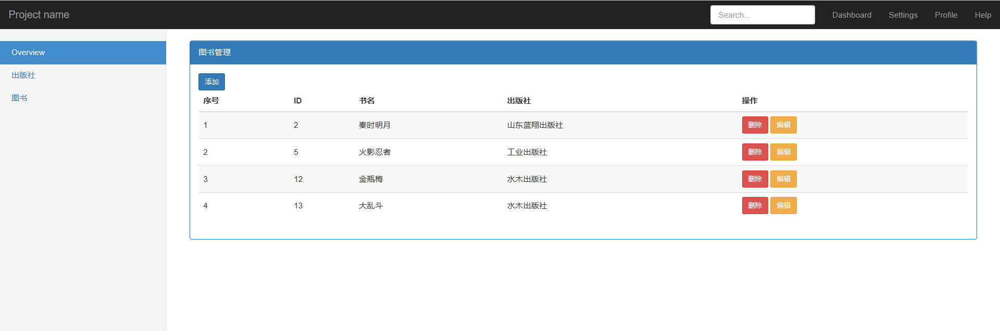

django第二篇，本篇使用django完成一个图书管理系统。 

<!--more-->

------------------

通过这篇文章，你能了解到：

- 使用django完成一个简单的图书管理系统。
- 在学习细节之前通过该例来熟悉django的整个流程，所以该例会有很多不足，未来也将用新的知识来进行改进。


# 概述

该图书管理系统涉及出版社的管理、图书的管理以及作者的管理。


# 出版社的管理

- 展示
- 新增
- 删除
- 编辑


## 准备工作

### 创建项目

pycharm --》 new project  -》  选择解释器，输入app名字，我输入的名字是app01


### settings

检查 `settings.py` 配置的内容：

- app01已创建

- 注释 `MIDDLEWARE` 中 关于 `csrf` 的那一条，防止提交时出现问题

  ```python
  MIDDLEWARE = [
      'django.middleware.security.SecurityMiddleware',
      'django.contrib.sessions.middleware.SessionMiddleware',
      'django.middleware.common.CommonMiddleware',
      #'django.middleware.csrf.CsrfViewMiddleware',
      'django.contrib.auth.middleware.AuthenticationMiddleware',
      'django.contrib.messages.middleware.MessageMiddleware',
      'django.middleware.clickjacking.XFrameOptionsMiddleware',
  ]
  ```

- 检查 `TEMPLATES` 中的 `DIRS` ，cmd创建的需要配置，pycharm不用。

- 在 `STATC_URL` 后面写 `STATICFILES_DIRS`

  ```
  STATICFILES_DIRS = [
  	os.path.join(BASE_DIR,'static')
  ]
  ```

  note：`STATC_URL` 只是一个别名，必须配置具体的路径，这样别名才有效。路径中只需要以 `/static/` 开头就可以。


### pymysql

在做关于数据库的事情之前，我们先切换数据库操作模块（默认只支持python2）

- 在 `settings.py` 同目录的 `__init__.py` 中写如下两条语句：

  ```python
  import pymysql
  pymysql.install_as_MySQLdb()
  ```

  


### 创建数据库

我们先做的是出版社的管理，所以，先构建关于出版社的表。

这个表只有两列：pid和出版社名称。


- cmd创建一个图书管理系统的数据库

  登录：`mysql -u 用户名 -p 密码`

  创建：`create database library;`


### 使用orm创建类（对应数据库中的表）

- 在 `models.py` 中创建类

  ```python
  class Publisher(models.Model):
      pid = models.AutoField(primary_key=True)
      name = models.CharField(max_length=32,unique=True)
  
      def __str__(self):
          return f"{self.name}"
      __repr__ = __str__
      # 定义 __repr__是为了在打印对象列表/字典的时候，里面显示的内容为__repr__定义的
  ```


### 配置数据库

- 再次打开 `settings.py` 配置MySQL 数据库

  ```python
  DATABASES = {
      'default': {
          'ENGINE': 'django.db.backends.mysql',
          'NAME': 'library',
          'HOST':'127.0.0.1',       	# ip/localhost
          'PORT':'3306',				# 端口
          'USER':'xxx',				# 用户名
          'PASSWORD':'xxx',			# 密码
      }
  }
  ```

  


### 执行迁移

- `python36 manage.py makemigrations`	制作迁移文件/变更记录

- `python36 manage.py migrate`   执行迁移


### nvicate 添加记录

- 添加几条出版社的信息，结果如下

  


## 展示（查）

### 建立对应关系

开始写函数，首先建立对应关系。在 `urls.py` 中写如下内容:

```python
from app01 import views

urlpatterns = [
    url(r'^admin/', admin.site.urls),
    url(r'^publisher_list/', views.publisher_list),

]
```

这样 url 与 函数的对应关系就可以建立起来了。


### 写对应函数

在 `views.py` 中定义 publisher_list

定义函数的时候，如果没有思路，就从最终目的开始分析，比如这个函数，我们最后的目标是要返回带有数据的页面。所以在这个之前自然就是获取数据喽。

```python
# views.py
from django.shortcuts import render, HttpResponse, redirect
from app01 import models

def publisher_list(request):
    # 从数据库中查询出所有出版社
    all_publishers = models.Publisher.objects.all().order_by('pid')  # 按pid排序
    print(all_publishers)
    # 返回页面  页面包含数据
    # return HttpResponse('ok')
    return render(request, 'publisher_list.html', {'all_publishers': all_publishers})
    # render 第三个参数，让all_publishers 与publisher_list.html 建立联系
```


### 写对应HTML

下面是对应的html页面，使用了bootstrap样式。

1. 首先选取[bootsrap的实例精选](https://v3.bootcss.com/getting-started/#examples)中的控制台，把它的html和css样式扒下来。

2. 然后删除左侧栏中多余的内容，删除右侧的全部内容。
3. 右侧内容放置一个 table 表格
4. 写增加，删除，编辑这几个标签


`publisher_list.html`

这个html页面是最完整的，后面的页面也只是把中间的内容换一下。

```html
<!DOCTYPE html>
<html lang="en">

<head>
    <meta charset="utf-8">
    <meta http-equiv="X-UA-Compatible" content="IE=edge">
    <meta name="viewport" content="width=device-width, initial-scale=1">
    <!-- 上述3个meta标签*必须*放在最前面，任何其他内容都*必须*跟随其后！ -->
    <meta name="description" content="">
    <meta name="author" content="">

    <title>Dashboard Template for Bootstrap</title>

    <!-- Bootstrap core CSS -->
    <link href="/static/plugins/bootstrap-3.3.7/css/bootstrap.min.css" rel="stylesheet">

    <!-- Custom styles for this template -->
    <link href="/static/css/dashboard.css" rel="stylesheet">
    <style>
        .table > tbody > tr > td {
            vertical-align: middle;
        }
    </style>

</head>
<body>
<nav class="navbar navbar-inverse navbar-fixed-top">
    <div class="container-fluid">
        <div class="navbar-header">
            <button type="button" class="navbar-toggle collapsed" data-toggle="collapse" data-target="#navbar"
                    aria-expanded="false" aria-controls="navbar">
                <span class="sr-only">Toggle navigation</span>
                <span class="icon-bar"></span>
                <span class="icon-bar"></span>
                <span class="icon-bar"></span>
            </button>
            <a class="navbar-brand" href="#">Project name</a>
        </div>
        <div id="navbar" class="navbar-collapse collapse">
            <ul class="nav navbar-nav navbar-right">
                <li><a href="#">Dashboard</a></li>
                <li><a href="#">Settings</a></li>
                <li><a href="#">Profile</a></li>
                <li><a href="#">Help</a></li>
            </ul>
            <form class="navbar-form navbar-right">
                <input type="text" class="form-control" placeholder="Search...">
            </form>
        </div>
    </div>
</nav>

<div class="container-fluid">
    <div class="row">
        <div class="col-sm-3 col-md-2 sidebar">
            <ul class="nav nav-sidebar">
                <li class="active"><a href="/publisher_list/">出版社</a></li>
                <li><a href="/book_list/">图书</a></li>
                <li><a href="/author_list/">出版社</a></li>

            </ul>
        </div>
        <div class="col-sm-9 col-sm-offset-3 col-md-10 col-md-offset-2 main">
            <div class="panel panel-primary">
                <div class="panel-heading">出版社管理</div>
                <div class="panel-body">
                    <a href="/publisher_add" class="btn btn-primary btn-sm">添加</a>
                    <table class="table table-striped table-hover">
                        <thead>
                        <tr>
                            <th>序号</th>
                            <th>ID</th>
                            <th>出版社名称</th>
                            <th>操作</th>
                        </tr>
                        </thead>
                        <tbody>
                        
                            <tr>
                                <td>{{ forloop.counter }}</td>
                                <td>{{ publisher.pk }}</td>
                                <td>{{ publisher.name }}</td>
                                <td>
                                    <a href="/publisher_del/?pk={{ publisher.pk }}" class="btn btn-danger">删除</a>
                                    <a href="/publisher_edit/?pk={{ publisher.pk }}" class="btn btn-warning">编辑</a>
                                </td>
                            </tr>
                        
                        </tbody>
                    </table>                   
                </div>
            </div>
        </div>
    </div>
</div>
</body>
</html>
```


模板的语法：

- &#123;&#123;  `all_publisher` &#125;&#125; 表示变量
- &#123; &#37; for i in li  &#37; &#125; 表示for循环

```python
    

```

- &#123; &#123;  `forloop.counter` &#125;&#125;  字典，显示循环次数


### 效果


## 增加

### 建立对应关系

`urls.py` 下的 `urlpatterns`中添加：

```python
url(r'^publisher_add/', views.publisher_add),
```


### 写对应函数

- 添加记录的两种方式：一种是使用`models.Publisher.objects.create(name=pub_name)`方式；一种是 `obj = models.Publisher(name=pub_name)`,但在后面还需要加一句 `obj.save()` 来提交到数据库。


`views.py`

```python
def publisher_add(request):
    error, pub_name = '', ''
    if request.method == 'POST':
        pub_name = request.POST.get('pub_name')
        obj = models.Publisher.objects.filter(name=pub_name)
        if not pub_name:
            # 提交空数据
            error = '数据为空'
        elif obj:
            # 表中数据存在
            error = '出版社名称重复'
        else:
            # 正确情况下，向数据库添加,并跳转到展示页面
            models.Publisher.objects.create(name=pub_name)
            return redirect('/publisher_list/')
    return render(request, 'publisher_add.html', {'error': error, 'pub_name': pub_name})
```


### 写HTML

- 只是把原来表格换成表单，表单里放置输入和提交

`publisher_list.html`

```html
 <div class="panel panel-primary">
     <div class="panel-heading">添加出版社</div>
     <div class="panel-body">
         <form action="" method="post">
             <p>
                 出版社名称：<input type="text" name="pub_name">
                 <span style="color: red">{{ error }}</span>
             </p>
             <button>提交</button>
         </form>
     </div>
</div>
```

### 效果


## 删除

在这里不需要去写它的HTML页面，我们只需要在 `publisher_list.html` 的基础上加入 error 提示，就可以。

### 建立对应关系

`urls.py` 下的 `urlpatterns`中添加：

```python
url(r'^publisher_del/', views.publisher_del),
```


### 写对应函数

- 删除数据有两种方式，一种是`对象列表.delete()`、一种是 `对象.delete()`


在`views.py` 中继续定义：

```python
def publisher_del(request):
    # 获取删除的数据   id
    error = ''
    pk = request.GET.get('pk')
    query = models.Publisher.objects.filter(pk=pk)
    if not query:
        # 数据不存在
        error = '要删除的数据不存在'
        all_publishers = models.Publisher.objects.all()
        return render(request,'publisher_list.html',{"error":error,"all_publishers":all_publishers})
    # 删除数据
    # 方式一
    # query.delete()  # 通过query_set 删除对象列表中的所有
    # 方式二
    query[0].delete()  # 删除单独的一个对象。
    # 跳转至展示页面
    return redirect('/publisher_list/')
```


### 修改publisher_list.html

- 只是在`</table>` 下加了一个 span

```html
<div class="panel-body">
    <a href="/publisher_add" class="btn btn-primary btn-sm">添加</a>
    <table class="table table-striped table-hover">
        <thead>
            <tr>
                <th>序号</th>
                <th>ID</th>
                <th>出版社名称</th>
                <th>操作</th>
            </tr>
        </thead>
        <tbody>
            
            <tr>
                <td>{{ forloop.counter }}</td>
                <td>{{ publisher.pk }}</td>
                <td>{{ publisher.name }}</td>
                <td>
                    <a href="/publisher_del/?pk={{ publisher.pk }}" class="btn btn-danger">删除</a>
                    <a href="/publisher_edit/?pk={{ publisher.pk }}" class="btn btn-warning">编辑</a>
                </td>
            </tr>
            
        </tbody>
    </table>
    <span style="color: red">{{ error }}</span>
</div>
```


## 编辑

修改的话，其实和添加很相似了，不过对于编辑，会在输入框中显示原来的内容。


- `~Q(CSBN=None)` 表示 `CSBN != None`

### 建立对应关系

`urls.py` 下的 `urlpatterns`中添加：

```python
url(r'^publisher_edit/', views.publisher_edit),
```


### 写对应函数

`views.py`

```python
def publisher_edit(request):
    error, pub_name = '', ''
    # 对于get请求，回一个编辑页面
    pk = request.GET.get('pk')  # url上携带的参数，不仅是get独有的
    obj = models.Publisher.objects.filter(pk=pk).first()
    if not obj:
        return HttpResponse('数据不存在')
    if request.method == 'POST':
        # 获取新提交的数据
        pub_name = request.POST.get('pub_name')
        check = models.Publisher.objects.filter(name=pub_name).first()  # 想要改的名字是不能重复的
        if not pub_name:
            error = '数据为空'
        elif check:
            error = '出版社名称重复'
        else:
            # 存在这条数据就修改它
            obj.name = pub_name
            obj.save()
            # 跳转到展示页面
            return redirect('/publisher_list/')
    return render(request, 'publisher_edit.html', {'error': error, 'pub_name': pub_name})
```


### 写HTML

- 编辑与添加相似，只是增加了对原来输入的显示。

`publisher_list.html`

```html
<div class="panel panel-primary">
    <div class="panel-heading">添加出版社</div>
    <div class="panel-body">
        <form action="" method="post">
            <p>
                出版社名称：<input type="text" name="pub_name" value="{{ pub_name }}">
                <span style="color: red">{{ error }}</span>
            </p>
            <button>提交</button>
        </form>
    </div>
</div>
```

### 效果


## 小结

本章回到的知识点有：

- render用来展示内容，他不会改变url的路径，只会在后面进行拼接；第三个参数可以向HTML中传递数据。

- 模板语法，如何将数据放到html页面内

  - {{ all_publisher  }} 表示变量
  - for循环

  ```python
      
  
  ```

  - {{forloop.counter}}  字典，显示循环次数

- orm操作

  - 增加  create / 实例化
  - 删除  对象/对象列表 delete
  - 修改  对象属性的重新赋值


# 图书的管理

增加了图书，宏观上和以前有什么不同？首先，因为有新增了一个类，它们之间就会产生联系，这里假设出版社与图书是一对多关系，所以由此产生外键，这也是下面的一个新知识点。


## 准备工作

### 使用orm创建类

打开 `models.py` 我们将新定义一个类，类名为Book。

这个类有两个属性，一个是书名 `title` 一个是出版社的pid（外键），这里假设出版社与书是一对多关系。

```python
class Book(models.Model):
    title = models.CharField(max_length=32)
    # pid = models.ForeignKey(Publisher)
    pid = models.ForeignKey('Publisher',on_delete=models.CASCADE)
    # 通过反射去拿，这样就没有前后放置的要求
    # 1.11版本默认on_delete=None， None的话，后面会进行警告并重新赋值 on_delete=models.CASCADE
    # 2.0版本 on_delete是必填参数
```

`models.ForeignKey('Publisher',on_delete= )`

对于关键字参数 `on_delete`

- 它是指当关联的数据删除时该数据怎么办
- `on_delete=models.CASCADE` 级联删除，关联的数据没有了，该数据也没了
- `on_delete = models.SET系列` 、 SET_DEFAULT设置默认，SET_NULL设为空，SET(VALUE)设为某值。
- `on_delete = models.Do_NOTHING`   啥也不做


### 执行迁移

`python manage.py makemigrations`  扫描models，记录变更

`python manage.py migrate` 与数据库同步


### nvicate添加记录

使用nvicate添加几组数据：


## 展示

### 建立对应关系

`urls.py` 下的 `urlpatterns`中添加：

```python
urlpatterns = [
    url(r'^admin/', admin.site.urls),
    # publisher 的增删查改
    url(r'^publisher_list/', views.publisher_list),
    url(r'^publisher_add/', views.publisher_add),
    url(r'^publisher_del/', views.publisher_del),
    url(r'^publisher_edit/', views.publisher_edit),
    # book 的增删查改
    url(r'^book_list/', views.book_list),

]
```


### 写对应函数

`views.py` 中完善函数 book_list 

```python
def book_list(request):
    all_books = models.Book.objects.all()
    return render(request,'book_list.html',{'all_books':all_books})
```


### 写HTML

- 继续使用前面的bootstrap样式
- 展示的内容是写在 table 中的。

```html
<div class="panel panel-primary">
    <div class="panel-heading">图书管理</div>
    <div class="panel-body">
        <a href="/book_add" class="btn btn-primary btn-sm">添加</a>
        <table class="table table-striped table-hover">
            <thead>
                <tr>
                    <th>序号</th>
                    <th>ID</th>
                    <th>书名</th>
                    <th>出版社</th>
                    <th>操作</th>
                </tr>
            </thead>
            <tbody>
                
                <tr>
                    <td>{{ forloop.counter }}</td>
                    <td>{{ book.pk }}</td>
                    <td>{{ book.title }}</td>
                    <td>{{ book.pid.name }}</td>
                    <td>
                        <a href="/book_del/?pk={{ book.pk }}" class="btn btn-danger btn-sm">删除</a>
                        <a href="/book_edit/?pk={{ book.pk }}" class="btn btn-warning btn-sm">编辑</a>
                    </td>
                </tr>
                
            </tbody>
        </table>
    </div>
</div>
```


### 效果




## 增加

### 建立对应关系

`urls.py` 下的 `urlpatterns`中添加：

```python
url(r'^book_add/', views.book_add),
```


### 写对应函数

`views.py`

```python
def book_add(request):
    # 分为get和post请求， get展示添加页面，post提交数据
    all_publisher = models.Publisher.objects.all()
    error = ''
    if request.method == 'POST':
        title = request.POST.get('title')
        pid_id = request.POST.get('pid_id')
        if models.Publisher.objects.filter(pid=pid_id):
            models.Book.objects.create(title=title, pid_id=pid_id)
            return redirect('/book_list/')
        else:
            error = '出版社不存在'
    return render(request, 'book_add.html', {'all_publisher': all_publisher, 'error': error})
    # 这个return 一个是对get请求的回应，一个是当没有改出版社的时候返回错误。
```


### 写HTML

`book_add.html`

- 对于这个页面来说，内容是一个form

```html
<div class="panel panel-primary">
    <div class="panel-heading">添加图书</div>
    <div class="panel-body">
        <form action="" method="post" class="form-horizontal col-lg-6 col-lg-offset-3">
            <div class="form-group">
                <label for="title">请输入书名：</label>
                <input type="text" name="title" id="title" class="form-control" placeholder="title">
            </div>
            <div class="form-group">
                <label for="publisher">选择出版社：</label>
                <select name="pid_id" id="publisher" class="form-control">
                    
                    <option value="{{ publishers.pk }}">{{ publishers.name }}</option>
                    
                </select>
            </div>
            <button class="btn btn-primary btn-sm col-lg-offset-4">提交</button>
        </form>
    </div>
</div>
```


### 效果


## 删除

### 建立对应关系

`urls.py` 下的 `urlpatterns`中添加：

```python
url(r'^book_del/', views.book_del),
```


### 写对应函数

`views.py`

```python
def book_del(request):
    # 点击book_list.html的a标签，发出一个url，通过这个url的键来判断
    error = ''
    pk = request.GET.get('pk')
    books = models.Book.objects.filter(pk=pk)
    if not books:
        # 当不存出版社时返回error提示（恶意修改url）
        all_books = models.Book.objects.all()
        error = '出版社不存在'
        # return render(request,'book_del.html',{'error':error,'all_books':all_books})
        return render(request,'book_list.html',{'error':error,'all_books':all_books})
    books.first().delete()
    return redirect('/book_list/')
```


### 修改HTML

在`book_list.html` 增加对error的输出

```html
<div class="panel-body">
    <a href="/book_add" class="btn btn-primary btn-sm">添加</a>
    <table class="table table-striped table-hover">
        <thead>
            <tr>
                <th>序号</th>
                <th>ID</th>
                <th>书名</th>
                <th>出版社</th>
                <th>操作</th>
            </tr>
        </thead>
        <tbody>
            
            <tr>
                <td>{{ forloop.counter }}</td>
                <td>{{ book.pk }}</td>
                <td>{{ book.title }}</td>
                <td>{{ book.pid.name }}</td>
                <td>
                    <a href="/book_del/?pk={{ book.pk }}" class="btn btn-danger btn-sm">删除</a>
                    <a href="/book_edit/?pk={{ book.pk }}" class="btn btn-warning btn-sm">编辑</a>
                </td>
            </tr>
            
        </tbody>
    </table>
    <span style="color: red">{{ error }}</span>
</div>
```


## 编辑

### 建立对应关系

`urls.py` 下的 `urlpatterns`中添加：

```python
url(r'^book_edit/', views.book_edit),
```


### 写对应函数

`views.py`

```python
def book_edit(request):
    # get方式展示编辑页面，post方式提交修改的数据
    pk = request.GET.get('pk')
    error = ""
    obj = models.Book.objects.filter(pk=pk).first()
    if not obj:
        error = '查询数据不存在'
        return render(request, 'book_edit.html', {'error': error})
    all_publisher = models.Publisher.objects.all()
    if request.method == "POST":
        title = request.POST.get('title')
        pid_id = request.POST.get('pid_id')
        # 检查出版社是否存在
        pid = models.Publisher.objects.filter(pid=pid_id).first()
        if not pid:
            error = '出版社不存在'
        else:
            # 输入合法，可以修改数据库
            obj.title = title
            obj.pid = pid
            obj.save()
            print('到这里啦')
            return redirect('/book_list/')
    return render(request, 'book_edit.html', {'book': obj, 'all_publisher': all_publisher,'error': error})
    # 包含get请求，以及出版社不存在的返回
```


### 写THML

`book_edit.html`

- 编辑与添加相似，都是在表单中完成的，只不过编辑会将原来用户输入的值显示出来。

```html
<div class="panel-heading">编辑图书</div>
<div class="panel-body">
    <form action="" method="post" class="form-group">
        <div class="form-group">
            <label for="title" class="col-sm-2 text-center">请输入书名：</label>
            <input type="text" name="title" id="title" class="col-sm-2 " value="{{ book.title }}">
        </div>
        <div class="form-group ">
            <label for="publisher" class="col-sm-2 text-center">选择出版社：</label>
            <select name="pid_id" id="publisher">
                
                
                <option value="{{ publishers.pk }}" selected>{{ publishers.name }}</option>
                
                <option value="{{ publishers.pk }}">{{ publishers.name }}</option>
                
                
            </select>
        </div>
        <div class="form-group">
            <div class="col-sm-offset-4 col-sm-10">
                <button class="btn btn-primary btn-sm ">提交</button>
            </div>
        </div>
        <span style="color: red">{{ error }}</span>
    </form>
</div>
```


### 效果


## 小结

本章完成对图书的增删查改，在出版社的管理的基础上，增加了外键。

1. 对于外键我们使用 `pid = models.ForeignKey('Publisher',on_delete=models.CASCADE)` 来创建外键，这里`pid`是一个对象，在数据库中实际存在的是`pid_id`，这样做的好处在于，有了图书这个对象，就可以找到它关联的对象，从而操作这个对象。
2. 对于这个方法，里面有一个关键字参数 `on_delete` 需要我们去选择一种合适的方式，在django1.11.23中可以不设定，但对与django2.0是必须设定的。
3. `__str__` ：当打印对象，先找str方法，没有就去父类中找。
4. `__repr__` ： 当打印对象列表，对象字典的时候，只会调用repr，在类中我们可以写 `__repr__ = __str__` 来使两个方法相同。

5. 模板语法：

   ```python
   
   	语句1
   
   	语句2
   
   	语句3
   
   ```


# 作者的管理

作者与书是多对多的关系，对于与这种关系，我们该如何处理呢？这也是本章的核心内容，其余都和前面相似，所以这一部分不会完全复制代码，只将关键步骤和不同之处记录下来。

## 准备工作

### 使用orm创建类

- Book或Author中任意一方都可以添加多对多关系。
- 使用`models.ManyToManyField()` 设置

```python
class Author(models.Model):
    name = models.CharField(max_length=32)
    books = models.ManyToManyField('Book')
    # 描述多对多关系 ， 不会再数据库中生成该字段，它帮助生成新的关系表。
    # 在Book 或 Author 中都可以去定义，通过Book拿作者 或者通过 作者拿书
```


### 执行迁移

```python
python36 manage.py makemigrations
python36 manage.py migrate
```


### nvicate添加记录

结果如下：


## 展示

### 建立对应关系

`urls.py` 下的 `urlpatterns`中添加：

```python
url(r'^author_list/', views.author_list),
```


### 写对应函数


```python
def author_list(request):
    all_authors = models.Author.objects.all()
    return render(request,'author_list.html',{'all_authors':all_authors})
```


### 写HTML

-  `author.books`是一个关系管理对象，通过 all 方法可以查询 作者所关联的所有书籍对象。
- 模板中函数是不需要加括号的，如 &#123;&#123;author.books.all&#125;&#125;

```html
<a href="">添加</a>
<table>
    <thead>
    <tr>
        <th>序号</th>
        <th>ID</th>
        <th>名字</th>
        <th>著作</th>
        <th>操作</th>
    </tr>
    </thead>
    <tbody>
    
        <tr>
            <td>{{ forloop.counter }}</td>
            <td>{{ author.pk }}</td>
            <td>{{ author.name }}</td>
            <td>
                {# author.books.all这里不加括号也是可以的#}
                
                    《{{ book.title }}》
                
            </td>
            <td>
                <a href="">删除</a>
                <a href="">编辑</a>
            </td>
        </tr>
    
    </tbody>
</table>
```

### 效果


## 增加

### 建立对应关系

```python
url(r'^author_add/', views.author_add),
```


### 写对应函数

- 通过 `关系管理对象.set( [1,3,4] )` 来为 `author_books` 关系表中添加内容
- get 只能获取一个元素（最后一个）
- getlist 获取列表
- 关系管理对象.set(列表)  列表中的是主键，字符串也不怕，它会帮你处理。

```python
def author_add(request):
    all_books = models.Book.objects.all()
    error = ''
    if request.method == 'POST':
        name = request.POST.get('name')
        books = request.POST.getlist('books')
        books_back = copy.deepcopy(books)
        for book in all_books:
            if str(book.pk) in books:
                books.remove(str(book.pk))
        if books:
            # 有不存在的书籍,会产生错误,返回一个错误
            error = '部分书籍不存在!'
        else:
            obj = models.Author.objects.create(name=name)
            obj.books.set(books_back)
            return redirect('/author_list/')
    # 展示 author_add.html 页面
    return render(request, 'author_add.html', {'all_books': all_books, 'error': error})
    # 包括对部分书籍不存在错误的返回
```


### 写HTML

- 书籍是通过 select 来进行选择的，需要加入multiple 。

```html
<form action="" method="post">
    <label for="">姓名:</label>
    <input type="text" name="name">
    <label for="books">著作:</label>
    <select name="books" id="books" multiple>
        
        <option value="{{ book.pk }}">{{ book.title }}</option>
                                    
    </select>
    <button>提交</button>
</form>
```


### 效果


## 删除

### 建立对应关系

```python
url(r'^author_del/', views.author_del),
```


### 写对应函数

作者  ---  对应表  ---  书籍

删除作者/书籍，任意一方后，对应表中的记录会消失，但是删除了作者，这本书还是存在的。

```python
def author_del(request):
    # 对url链接内容进行判断,查找作者主键,存在就删除,不存在返回error
    pk = request.GET.get('pk')
    error = ''
    author = models.Author.objects.filter(pk=pk)
    if not author:
        error = '作者不存在!'
    else:
        author.delete()
        return redirect('/author_list/')
    all_authors = models.Author.objects.all()
    return render(request, 'author_list.html', {'all_authors': all_authors, 'error': error})
```


### 写HTML

补全 `author_list.html` 中的删除

```html
<a href="/book_del/?pk={{ book.pk }}" class="btn btn-danger btn-sm">删除</a>
```


## 编辑

### 建立对应关系


### 写对应函数

- 对于传入参数中的书籍需要进行检查，对这个列表进行一次深拷贝，不然如果是赋值操作的话，两个列表的内容都会减少。
- `author.books.set(books_back)` 首先会删除所有与这个author对象有关的记录，然后再添加。

```python
def author_edit(request):

    # 展示编辑页面
    pk = request.GET.get('pk')
    error = ''
    author = models.Author.objects.filter(pk=pk).first()
    all_books = models.Book.objects.all()
    all_authors = models.Author.objects.all()
    if not author:
        error = '作者不存在!'
        return render(request, 'author_list.html', {'all_authors': all_authors, 'error': error})
    if request.method == 'POST':
        name = request.POST.get('name')
        books = request.POST.getlist('books')
        books_back = copy.deepcopy(books)
        for book in all_books:
            if str(book.pk) in books:
                books.remove(str(book.pk))
        if books:
            error = '部分书籍不存在'
        else:
            author.name = name
            author.save()
            print(books_back)
            author.books.set(books_back)
            return redirect('/author_list/')
    return render(request, 'author_edit.html', {'all_books': all_books, 'author': author, 'error': error})
```


### 写HTML

- 相对于 author_add.html 增加了值填充，和已选选项提示。

- 可以使用成员判断来找出已选择的书。

  

```html
 <form action="" method="post">
     <div class="form-group">
         <label for="name" class="col-sm-2 col-sm-offset-2 control-label">名字:</label>
         <div class="col-sm-6">
             <input type="text" name="name" id="name" class="form-control" value="{{ author.name }}">
         </div>
     </div>
     <div class="form-group">
         <label for="books" class="col-sm-2 col-sm-offset-2 form-group">著作:</label>
         <div class="col-sm-6">
             <select name="books" id="books" multiple class="form-control">
                 
                 
                 <option selected value="{{ book.pk }}">{{ book.title }}</option>
                 
                 <option value="{{ book.pk }}">{{ book.title }}</option>
                 
                 
             </select>
         </div>
     </div>
     <button class="btn btn-primary btn-sm col-sm-offset-6 ">提交</button>
</form>
```

### 效果


## 补充

`关系管理对象.set` 是先做删除，在做添加。


### 正/反向操作

#### 正向操作

- 在我们的orm定义中，`ManyToManyField` 是定义在Author中的。正向操作就是通过Author对象.books 直接拿到关系管理对象。

```python
class Book(models.Model):
    title = models.CharField(max_length=32)
    pid = models.ForeignKey('Publisher',on_delete=models.CASCADE)


class Author(models.Model):
    name = models.CharField(max_length=32)
    books = models.ManyToManyField('Book')
    def __str__(self):
        return self.name
    __repr__ = __str__
```

#### 反向操作

那通过Book来拿这个关系管理对象就是反向操作了：

- author_set 是一个 关系管理对象，前面的author是根据类名来的，后面的`_set` 是固定写法。通过它，可以查询 all，可以设置 set 。

```python
def test(request):
    books = models.Book.objects.all()
    print('-----------')
    for book in books:
        print(book.author_set.all(),type(book.author_set))
    return HttpResponse('ok')
```

note：需要在urls.py中设置对应关系 `url(r'^test/', views.test),`

打印如下内容：

```
<QuerySet [小灰]> <class 'django.db.models.fields.related_descriptors.create_forward_many_to_many_manager.<locals>.ManyRelatedManager'>
<QuerySet [岸本, 七七七]> <class 'django.db.models.fields.related_descriptors.create_forward_many_to_many_manager.<locals>.ManyRelatedManager'>
```


### 创建多对多关系中第三张表的方法

#### 方式一

django通过`ManyToManyField`自动创建第三张表

- 优点：通过 关系管理对象（`ManyRelatedManager`），可以查询 all ，可以为第三张表添加记录 set

- 缺点：列是固定的（一个主键两个外键，没有其他内容）

```python
class Book(models.Model):
    title = models.CharField(max_length=32)
    pub = models.ForeignKey('Publisher', on_delete=models.CASCADE)
    # authors = models.ManyToManyField('Author')  # 描述多对多的关系   不生成字段  生成关系表

    def __repr__(self):
        return self.title

    __str__ = __repr__

class Author(models.Model):
    name = models.CharField(max_length=32)
    books = models.ManyToManyField('Book')  # 描述多对多的关系   不生成字段  生成关系表
```


#### 方式二

手动创建，添加外键

- 优点：你可以自由添加字段
- 缺点：没有关系管理对象 ，从book/author不能直接得到 Book_Author的内容。

```python
class Book(models.Model):
    title = models.CharField(max_length=32)


class Author(models.Model):
    name = models.CharField(max_length=32)


class Book_Author(models.Model):
    book = models.ForeignKey(Book, on_delete=models.CASCADE)
    author = models.ForeignKey(Author, on_delete=models.CASCADE)
    date = models.DateField()
```


#### 方式三

自己创建 + ManyToManyField

- 优点：有了 关系管理对象，我们可以查询了 all ，通过 Author.books.all 或 book_set.all 查询；也可以定义额外的字段了
-  缺点：关系管理对象只能查询，不能设置（set），因为有额外的字段，考虑到没有这些字段的情况，从少的一方到多的一方是不能在进行设置的。

- 需要设置 `through`

```python
class Book(models.Model):
    title = models.CharField(max_length=32)


class Author(models.Model):
    name = models.CharField(max_length=32)
    books = models.ManyToManyField(Book, through='Book_Author')


class Book_Author(models.Model):
    book = models.ForeignKey(Book, on_delete=models.CASCADE)
    author = models.ForeignKey(Author, on_delete=models.CASCADE)
    date = models.DateField()
```


### 一种特殊情况

​	在上面Book_Author这张表中有两个外键，那如果在添加一个 `tuijian_author` 这个外键，它来自Author，这样我们需要额外设置参数来进行解释，编译器不至于混乱。

混乱来自：当进行**反向查询**的时候，不知道是 `author` 还是 `tuijian_author`

而且如果直接设置两个外键会产生重名问题，出现两个Author.book_author_set

```python
app02.Book_Author.author: (fields.E304) Reverse accessor for 'Book_Author.author' clashes with reverse accessor for 'Book_Author.tuijian_author'.
        HINT: Add or change a related_name argument to the definition for 'Book_Author.author' or 'Book_Author.tuijian_author'.
app02.Book_Author.tuijian_author: (fields.E304) Reverse accessor for 'Book_Author.tuijian_author' clashes with reverse accessor for 'Book_Author.author'.
        HINT: Add or change a related_name argument to the definition for 'Book_Author.tuijian_author' or 'Book_Author.author'.
```

- 在 `ForeignKey` 中需要设置 `related_name`，这在上面的错误中也提到了。

- 在 `ManyToManyField` 中需要设置`through_fields` 来指明 Book_Author 中的哪两个字段是多对多关系，而且这个列表是有顺序要求的。


```python
class Book(models.Model):
    title = models.CharField(max_length=32)

class Author(models.Model):
    name = models.CharField(max_length=32)
    books = models.ManyToManyField(Book, through='Book_Author', through_fields=['author', 'book', ])

class Book_Author(models.Model):
    book = models.ForeignKey(Book, on_delete=models.CASCADE)
    author = models.ForeignKey(Author, on_delete=models.CASCADE, related_name='x')
    tuijian_author = models.ForeignKey(Author, on_delete=models.CASCADE, related_name='x1')
    date = models.DateField()
```


# 小结


## django的所有命令

1. 下载安装

   pip install django == 1.11.23 -i 源

2. 创建项目

   django-admin startproject 项目名

3. 启动项目

   manage.py目录下 ： python manage.py runserver

4. 创建app

   python manage.py startapp app名称

5. 数据库迁移

   python manage.py makemigrations 扫描app下的models的变更记录  后面可以加具体app名称

   python migrate 同步， 后面可以加具体app名称

## 配置

1. TEMPLATES 模板    DIRS

2. 静态文件

   STATIC_URL = '/static/'

   STATICFILES_DIRS = [

   ​	os.path.join(BASE_DIR, 'static'),

   ]

3. 数据库 DATABASES

   ENGIN 引擎

   NAME 数据库名

   HOST

   PORT

   USER

   PASSWORD

4. 中间件

   注释csrf，提交post请求

5. 注册app

   INSTALL_APPS= [

   'app01.apps.App01Config'

   ]

## django使用MySQL数据库的流程

1. 切换数据库操作模块 pymysql， 写在与settings同级目录下的 `__init__.py`

   import pymyysql

   pymysql.install_as_MySQLdb()

2. 创建一个MySQL数据库

3. 在app下的models中写类

4. 制作迁移文件
5. 执行数据库迁移命令


## request

1. request对象：
2. GET：url上携带的参数   字典      ?k1=v1  
3. POST：POST请求的请求数据   get, getlist
4. method       GET POST PUT

## response

1. HttpResponse('字符串')   返回字符串

2. render(request,'模板', { 模板渲染})  返回一个完整的页面

3. redirect('url的路径') 重定向    响应头  Location：url  +  302状态码

   ```python
   def test(request):
       # ret = HttpResponse('ok')
       response = HttpResponse(status=302)
       response['Location'] = '/register/'
       return response
   ```

   

## orm

对应关系

- 类	     表
- 对象      记录
- 属性      字段

## 查询

```python
models.Publisher.objects.get(name = 'xxx')	# 获取一个满足条件的对象，找不到或多个就报错
models.Publisher.objects.filter()	# filter 获取满足条件的所有对象，对象列表
models.Publisher.objects.all()	# 获取所有数据

pub.obj.name 			# 出版社名字
pub.obj.pk  pub.obj.pid	# 出版社的主键

book_obj.pub 			# 所关联的出版设对象
book_obj.pub_id  		# 所关联的出版社对象的id

author_obj.books		# 关系管理对象
author_obj.books.all()	# 所关联的所有的书籍对象
```

## 新增

```python
Publisher
1.
	obj = models.Publisher.objects.create(name = 'xxx')
2.
    obj = models.Publisher(name = 'xxx')
	obj.save
    
Book：
	models.Book.objects.create(name = 'xxx',pub = pub_obj)
    models.Book.objects.create(name = 'xxx',pub_id = pub_obj.pk)
Author:
    author_obj = models.Author.objects.create(name = 'xxx')
    author_obj.books.set([1,2])	# 设置多对多的关系       
```

## 删除

```python
查询这个对象/对象列表  -> delete
models.Publisher.objects.filter(pk=pk).delete()
author_obj.delete()
```

## 编辑

```python
book_obj.pub = pub_obj
book_obj.pub_id = pub_obj.pk
author_obj.name = name
author_obj.save()
author_obj.books.set([id,id])
```

## 模板

render(request, '模板的文件名',{k1:v1})

```html
{{k1}}  v1

	x1

	x2


	{{forloop.counter}}
	{{i}}

```


下一篇为 [Django模板系统](https://chennq.com/django/20190701-django_3.html)，第一个需要了解的细节，学习了这一块，就可以得到任何想要的页面。