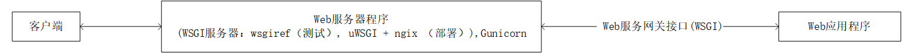
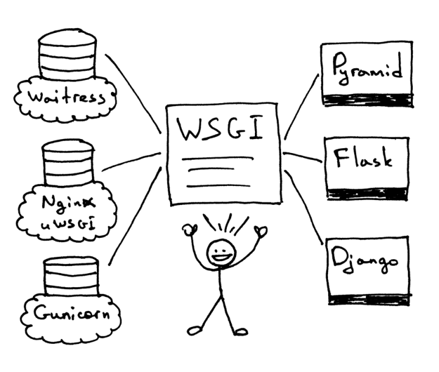
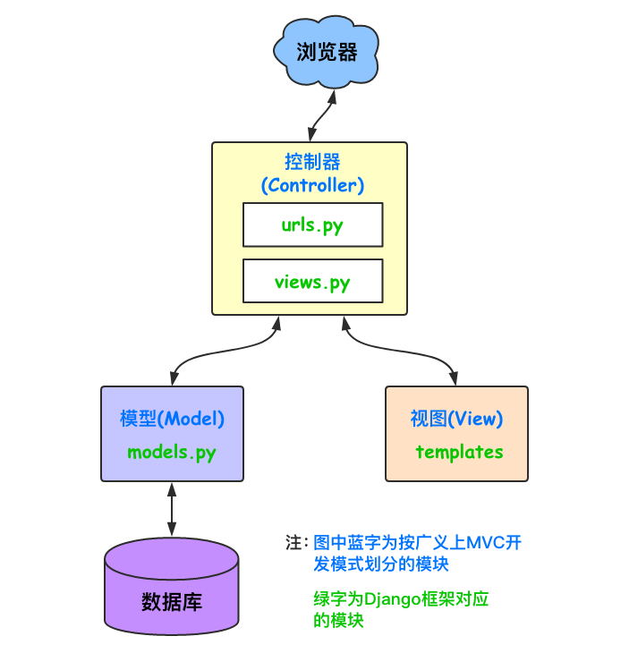

本篇介绍服务器程序与应用程序之间的联系以及Django的安装与简单使用。

<!--more-->

-----------------------


通过这篇文章，你能了解到：

- Web服务器程序、Web应用程序、框架、WSGI以及它们之间的联系。
- Django的安装与简单使用。


# 概述

在[Web前端-概述](https://chennq.com/Web%E5%89%8D%E7%AB%AF/20190609-Web_1.html) 中，我们完成一个自定义Web框架（服务端），它是由三部分构成的：

1. 使用socket收发消息
2. 根据不同的路径返回不同的内容
3. 返回动态的数据（字符串的替换  --->  模板的渲染）（模板：html   渲染：字符串替换 ）


# 服务器程序与应用程序

- web服务器程序：  接收HTTP请求并返回数据（概述中的第1部分）
- web应用程序：针对业务，对接收的数据处理并返回 （概述中的第2，3部分）
- web框架：方便开发Web应用程序
- WSGI：是一种通信协议,它只适用于 Python 语言，其全称为 Web Server Gateway Interface。它要完成的作用是定义 Python 应用程序要如何与apache/lighttpd/nginx 等之类的 WEB 服务器之间进行通信和交换信息。


预览：

- wsgiref/WSGI ： （概述中的第1部分）

- django：（概述中的第2，3部分）、大而全（本身都写好了）

- flask：（概述中的第2部分）、  需要加  jinjia2、轻量级（本身少需要第三方模块）
- tornado：（概述中的第1，2，3部分）、特点：异步非阻塞、轻量级（本身少需要第三方模块）


## WSGI 

### WSGI 规范

​	**Web服务网关接口**（Web Server Gateway Interface，简称“WSGI”）是一种在Web服务器 和Python Web应用程序或框架之间的标准接口。通过标准化Web服务器和Python web应用程序 或框架之间的行为和通信，WSGI使得编写可移植的的Python web代码变为可能，使其能够部署在任何符合WSGI的web服务器上。	

​	但规范不是实际可以直接拿来用的东西。 **flup** 就是使用 Python 语言对 WSGI 的一种实现，是可以用于 Python 应用开发中的一种工具或者说是一种库。





​	这样就可以根据你的需要搭配不同的web框架和web服务器了。可以使用Django、Flask或者Pyramid等等。



图片来自 [【翻译】一步步开发一个Web服务器.Part 2.](http://zkeeer.space/?p=212)


WSGIweb服务器针对一个WSGI应用：

1. 服务器启动并且加载一个web应用/web框架提供的‘application’可调用对象。

2. 服务器读取一个请求

3. 服务器解析这个请求

4. 服务器根据请求的数据创建一个‘environ’的字典

5. 调用可调用对象‘application’，使用‘environ’字典和可调用对象‘start_response’作为参数，得到一个响应主体。

6. 使用可调用对象‘application’返回的数据、状态码、可调用对象‘start_response’设置的响应头部。

7. 最后服务器把这个HTTP响应发送回客户端。


environ 与 request对象的区别：

- 通常没人愿意直接使用 environ 因为它对字节串是有限制的，而且不提供访问表单数据的方法除非手动解析数据。
- `Request` 对象封装 environ 并提供只读的方法访问数据


## 框架

广义地说，Web框架包含一系列库和一个主要的处理器（handler），这样您就能够构建自己的代码来实现Web应用 （比如说一个交互式的网站）。大多数web框架包含模式和工具，至少实现以下功能：

- **URL路由**（URL Routing）

  将输入的HTTP请求匹配到特定的Python代码用来调用

- **请求和响应对象**（Request and Response Objects）

  封装来自或发送给用户浏览器的信息

- **模板引擎**（Template Engine）

  能够将实现应用的Python代码逻辑和其要产生输出的HTML（或其他）分离开

- **Web服务器开发**（Development Web Server）

  在开发机上运行HTTP服务器，从而快速开发；当文件更新时自动更新服务端代码。


### Django

> [Django](https://www.djangoproject.com/) 是一个**功能齐备**的**web应用框架**。它是创建面向内容网站的极佳选择。 通过提供众多工具和模式，Django使得快速构建复杂的、有数据库支持的web应用成为可能， 同时鼓励使用它作为编写代码的最佳实践。
>
> Django 加快了 Web 应用程序的编写，并且大大减少了所需的代码，从而使维护应用程序更加容易。Django 严格遵循 **Don't Repeat Yourself (DRY) 原则**，因此每个不同的代码片段或数据仅在一个位置上出现。这意味着需要进行更改时，只修改一个地方就行，从而使更改软件更快、更轻松。

Django拥有非常庞大和活跃的社区。此外，许多预构建的 [可重用模块](https://djangopackages.com/) 可以原样合并到新工程中，或者定制成符合需求的样子。


### Flask


> [Flask](http://flask.pocoo.org/) 是一款针对Python的“**微型框架**”，它是构建更小应用、API和web服务的极佳选择。 使用Flask构建应用，除了一些函数附上路由，它和写标准Python模块很相似。它真的很赞。
>
> Flask不会提供一切您可能需要的内容，而是实现了web应用框架中最常用的核心组件，比如说URL路由、请求和响应对象和模板等。

作为Flask的用户，由您来决定选择和集成其他您可能用到的**组件**。比如说数据库访问或者表单生成和验证就不是Flask内置的功能。

这挺好的，因为很多web应用并不需要这些特性。 对于那些需要的，有许多可用的 [扩展](http://flask.pocoo.org/extensions/)或许符合您的需求。

Flask是任何不适用Django的Python web应用的默认选择。

### Falcon

> 当您的目标是构建快速、可扩展的REST风格API微服务时， [Falcon](https://falconframework.org/) 是个不错的选择。
>
> 这是一个可靠的、高性能的Python Web框架，用于构建大规模应用后端和微服务。Falcon鼓励REST架构风格的 URI到资源的映射，以花费尽可能少的精力同时又保持高效。

Falcon重点关注四个方面：速度、可靠性、灵活性和可调试性。它通过"响应者（responder）" （诸如 `on_get()`、 `on_put()` 等）来实现HTTP。这些响应者接收直接的请求，以及响应对象。


### Tornado

> [Tornado](http://www.tornadoweb.org/) 是一个面向Python的异步web框架，它有自己的事件。 这就使得它，举个例子，可以原生地支持WebSockets。编写良好的Tornado应用具有卓越的性能特性。


### Pyramid

> [Pyramid](https://trypyramid.com/) 是一个非常灵活的框架，重点关注模块化。 它内置少量库（“电池”）， 并鼓励用户扩展其基本功能。它提供一组cookiecutter模板，帮助用户生成新项目。Pyramid驱动了Python基础架构中 最重要部分之一—— [PyPI](https://pypi.org/)。

Pyramid不像Django和Flask，并没有庞大的用户基数。它一个有能力的框架，但如今新Python web 应用程序 并没有十分青睐它。


### Masonite

> [Masonite](https://docs.masoniteproject.com/) 是一个现代的，以开发人员为中心的“功能齐备”的网络框架。
>
> Masonite 框架遵循 MVC（Model-View-Controller，模型-视图-控制器）架构模式，受到 Rails 和 Laravel 等框架的极大启发， 因此如果您是从 Ruby 或 PHP 背景来到 Python，那么您将感到宾至如归！
>
> Masonite 提供了许多开箱即用的功能，包括一个功能强大的具有自动解析依赖注入IOC容器、craft 命令行工具和 Active Record 模式的 Orator ORM。

Masonite 非常适合初学者或经验丰富的开发人员。从安装到部署都相当快速和容易。只需尝试一次，你就会爱上它。


## Web 服务端

### Nginx

[Nginx](http://nginx.org/) （发音为 "engine-x"）是一个web服务器，并是HTTP、SMTP和其他协议的反向代理。 它由其高性能、相对简洁以及对众多应用服务器（比如WSGI服务器）兼容而著名。它也拥有便利的特性， 比如负载均衡、基本的认证、流等。Nginx被设计为承载高负载的网站，并逐渐变得广为流行。


## WSGI 服务器


独立WSGI服务器相比传统web服务器，使用更少的资源，并提供最高的性能。


### Gunicorn

> [Gunicorn](https://gunicorn.org/) （Green Unicorn，绿色独角兽）是一个纯Python WSGI服务器， 用来支持Python应用。不像其他Python web服务器，它有周全的用户界面，十分易于使用和配置。
>
> Gunicorn具有合理的默认配置。 然而，其他一些像uWSGI这样的服务器相较而言过于可定制化，因此更加难以高效使用。

Gunicorn是如今新Python web应用程序的推荐选择。


### Waitress

> [Waitress](https://waitress.readthedocs.io/) 是一个纯Python WSGI服务器，声称具备“非常可接受的性能”。 它的文档不是很详细，但它确实提供了一些很好的而Gunicorn没有的功能（例如HTTP请求缓冲）。

Waitress在Python Web开发社区中越来越受欢迎。


### uWSGI

> [uWSGI](https://uwsgi-docs.readthedocs.io/) 用来构建全栈式的主机服务。除了进程管理、进程监控和其他功能外， uWSGI也能作为一个应用服务器，适用于多种编程语言和协议 - 包括Python和WSIG。 uWSGI既能当作独立的web路由器来运行，也能运行在一个完整web服务器（比如Nginx或Apache）之后。 对于后者，web服务器可以基于 [uwsgi 协议](https://uwsgi-docs.readthedocs.io/en/latest/Protocol.html) 配置uWSGI和应用的操作。uWSGI的web服务器支持允许动态配置Python、传递环境变量以及进一步优化。 要看更多细节，请看 [uWSGI 魔法变量](https://uwsgi-docs.readthedocs.io/en/latest/Vars.html)。


## 服务端最佳实践

如今，自承载Python应用的主体托管于WSGI服务器（比如说 [Gunicorn](https://pythonguidecn.readthedocs.io/zh/latest/scenarios/web.html#gunicorn-ref)） 或是直接或间接在轻量级web服务器（比如说 [nginx](https://pythonguidecn.readthedocs.io/zh/latest/scenarios/web.html#nginx-ref)）之后。

WSGI服务器为Python应用服务，它能更好的处理诸如静态文件服务、请求路由、DDoS保护和基本认证的任务。

对于静态的这些不需要向后传递，它自己就可以解决。


## 模板

多数WSGI应用响应HTTP请求，从而服务于HTML或其他标记语言中的内容。**关注点分离**的概念建议我们使用模板， 而不是直接由Python生成文本内容。模板引擎管理一系列的模板文件，其系统的层次性和包容性避免了不必要的重复。 模板引擎负责渲染（产生）实际内容，用由应用生成的动态内容填充静态内容。

由于模板文件有时是由设计师或者前端开发者编写，处理不断增长的复杂度会变得困难。

一些通用的良好实践应用到了部分应用中，情景包括传递动态内容到模板引擎和模板自身中。

- 模板文件只应传递需要渲染的动态内容。避免传递附加的“以防万一”的内容： 需要时添加遗漏的变量比移除可能不用的变量要来的容易。
- 许多模板引擎允许在模板中编写复杂语句或者赋值，也有许多允许一些Python代码 在模板中等价编写。这种便利会导致复杂度不可控地增加，也使得查找bug变得更加困难。
- 我们常常需要混合JavaScript模板和HTML模板。一种聪明的做法是孤立出HTML 模板传递部分变量内容到JavaScript代码中的部分。


### Jinja2

[Jinja2](http://jinja.pocoo.org/) 是一个很受欢迎的**模板引擎**。

它使用基于文本的模板语言，因此可以用于生成任何类型的标记，而不仅仅是HTML。 它允许自定义过滤器，标签，测试和全局变量。 它具有Django模板系统的许多改进。

这里有一些在Jinja2中重要的HTML标签：

```
{# 这是注释 #}

{# 下一个标签是输出变量： #}
{{title}}

{# 区块标签，能通过继承其他html代码来替换区块内容 #}

<h1>This is the head!</h1>


{# 数组迭代输出 #}

<li>{{ item }}</li>

```


### Chameleon

> [Chameleon](https://chameleon.readthedocs.io/) 页面模板是使用 [模板属性语言（Template Attribute Language, TAL）](https://en.wikipedia.org/wiki/Template_Attribute_Language)、[TAL表达语法（TAL Expression Syntax,TALES）](https://chameleon.readthedocs.io/en/latest/reference.html#expressions-tales) 和 [宏扩展TAL（Macro Expansion TAL, Metal）](https://chameleon.readthedocs.io/en/latest/reference.html#macros-metal) 语法的HTML/XML模板引擎实现。
>
> Chameleon在Python2.5及以上版本（包括3.x和PyPy）都是可用的，并常被 [Pyramid Framework](https://trypyramid.com/) 使用。

页面模板是在文档结构中添加特定元素属性和文本标记。使用一系列简单语言概念，您能够控制文档流程、元素重复、文本替换和翻译。 由于使用了基于属性的语法，未渲染的页面模板是合法的HTML，它可以在浏览器中查看，甚至能够在WYSIWYG编辑器中编辑。 这使得设计者和原型构建者之间在浏览器是中静态文件上的往复合作变得更加简单。


### Mako

[Mako](http://www.makotemplates.org/) 是一种模板语言，为了最大的性能，它编译为了Python。 它的语法和API借鉴了其他模板语言，如Django和Jinja2中最好的部分。它 是包括 [Pylons 和 Pyramid](http://www.pylonsproject.org/) 在内的web框架所使用的默认模板语言。

Mako在Python web社区中受到重视。


推荐阅读 [Web 应用 & 框架](https://pythonguidecn.readthedocs.io/zh/latest/scenarios/web.html#id29)


# Django框架


## MVC与MTV

Django 的架构松散地基于模型-视图-控制器（Model-View-Controller，MVC）模式。在该模式中，应用程序逻辑、用户界面（UI）和数据访问层是分开的，从而允许在不影响到其他层的情况下独立地修改各个层。


MVC ：

- M： model 模型  操作数据库
- V ： view 视图  **展示**页面 ， HTML
- C：controller 控制器 调度 业务逻辑


​	不过，根据 Django 文档的描述，Django 采用的是类似的模式：*模型-模板-视图（Model-Template-View，MTV）*架构。





Model(模型)

​	负责业务对象与数据库的对象(ORM) 。模型可以看作数据访问层，应用程序在这里与其他数据库和信息源交互。

Template(模版)

​	负责如何把页面展示给用户 。**模板层**定义向用户显示数据的方式，这相当于 <u>MVC 模式中的视图层</u>。	

View(视图)

​	在 MTV 架构中，视图层描述应该向用户显示哪些数据。它不定义数据的显示方式；它将这个任务交给模板层处理。

​	负责业务逻辑，并在适当的时候调用Model和Template。

MTV：

- M：model 模型  操作数据库 orm
- T： template 模板   HTML
- V： view 视图  负责业务逻辑

C = V(views.py) + urls.py

 

对于 <u>MVC 的控制器层</u>，Django 将它看作**框架本身**，因为它决定向其发送请求的视图（像在 URL 配置中定义的那样）。

除了模型、模板和视图层之外，Django 还提供一些高级的开箱即用的特性，比如 URL 配置、自动管理界面和缓存等。例如：urls分发器，它的作用是将一个个URL的页面请求分发给不同的view处理，view再调用相应的Model和Template。

像 Python 一样，Django 背后的关键思想之一就是 “大批包含”，这意味着它自带了大量由其他包组成的标准库，您可以在应用程序中直接使用，而不需另外下载。


# Django的安装与简单使用

## 下载安装

### 命令行

```
pip install Django==1.11.23 -i https://pypi.tuna.tsinghua.edu.cn/simple/
```

如果同时安装了python2和python3的情况，可以参考如下方法，使用指定版本的python的pip安装

```
python2 -m pip install xxx
```

或者

```
python3 -m pip install xxx
```

### pycharm

在`setting`，`Project Interpreter` 中，右侧点`加号`，搜索`django`，勾选`Specify version` 选择`1.11.23`后点击`install`。

换源加快速度：在下面`Manage Repositories`中添加源。

下面有源可以添加上面的源


## 创建项目

### 命令行

一个python环境下：`django-admin startproject 项目名`

多个python环境：`python36 -m django startproject 项目名`

```
我自己的路径C:\Users\ATLAS\AppData\Local\Programs\Python\Python36\
```


#### 目录结构

创建好项目后，它的目录结构如下

```
mysite/    
	manage.py    
	mysite/        
		__init__.py        
		settings.py        
		urls.py        
		wsgi.py
```

这些目录和文件的用处是：

- 最外层的 `mysite` 是你的根目录也是项目名。
- `manage.py`: 一个让你用各种方式**管理** Django 项目的**命令行工具**。
- 里面一层的 `mysite/` 目录包含你的项目，它是一个纯 Python 包。它的名字就是当你引用它内部任何东西时需要用到的 Python 包名。 (比如 `mysite.urls`).
- `mysite/__init__.py`：一个空文件，告诉 Python 这个目录应该被认为是一个 **Python 包**。
- `mysite/settings.py`：Django 项目的**配置文件**。
- `mysite/urls.py`：Django 项目的 URL 声明，就像你网站的“目录”。
- `mysite/wsgi.py`：作为你的项目的运行在 WSGI 兼容的Web服务器上的入口。


### pycharm

专业版才有这些功能。

`file` -> `new project` -> `django` -> 项目路径 解释器选已有的（如果是新的虚拟环境会下载最新的django）

创建好项目后，它的目录结构如下：

```
mysite/	    
	manage.py    
	.idea/    	
		# pycharm优化所作的,包含各种配置    	
		dataSources.load.xml    	
		dataSources.xml    	
		mysite.iml    	
		misc.xml    	
		modules.xml    	
		workspace.xml   		
		templates/		
			# 存放HTML页面   
	mysite/        
		__init__.py        
		settings.py        
		urls.py        
		wsgi.py
```


## 启动项目

### 命令行

①默认是8000端口

```python
python36 manage.py runserver     # 127.0.0.1:8000
```

②加上端口号

```python
python36 manage.py runserver 80 访问时就不用加端口号了
```

③改ip地址

```python
python36 manage.py runserver 0.0.0.0:80
```

④让人去访问，修改settings.py

```python
allowed_hosts = ['*']
```


### pycharm

note: 打开别人的项目`.idea`要干掉，这里包含了别人的配置，会影响。

选择项目（dj图标） 点击 `绿三角` 启动， 不要右键运行文件

绿三角下面 `edit configure` 中 改ip和端口


## 创建APP

通常我们的业务逻辑是要放在APP中的，在views中写视图函数，在models中定义模型类。


App的目录结构

```python
app01
├── migrations         
├── __init__.py
├── admin.py			# django admin 对数据库中表进行操作
├── apps.py			 # app的信息
├── models.py    		# 模型  model  orm  跟数据库有关，
├── tests.py
└── views.py 			# 写函数
```


### 命令行

```python
python36 manage.py startapp app01
```

note：因为我的多`python`共存，我将这个`python`改名为`python36`.

### pycharm

只有在创建的时候可以输入一个Application的名字。


## 注册app

光创建是不行的，我们还需要在settings配置中注册APP。如果在创建项目的时候创建APP是不需要在进行注册的，在配置中找到下面，并在底部添加 `'app01.apps.App01Config'`。

```python
INSTALLED_APPS = [    
    'django.contrib.admin',    
    'django.contrib.auth',    
    'django.contrib.contenttypes',    
    'django.contrib.sessions',    
    'django.contrib.messages',    
    'django.contrib.staticfiles',    
    'app01.apps.App01Config',       # 推荐。创建项目时一并创建app，pycharm就是这样写的
]
```


## 使用MySQL数据库


### 修改数据库操作模块

数据库操作模块是python与MySQL沟通的桥梁。这个版本的django配置的数据库操作模块只支持python2，所以需要进行更换，我选择的是`pymysql`，

在app01这个包下面的 `__init__.py` 中写，`pymysql`模块是需要下载的，如果没有在pycharm的项目解释器（Project Iterpreter）中下载安装。

```
import pymysqlpymysql.install_as_MySQLdb()
```


### 添加MySQL数据库

settings中修改 `DATABASES`

连接数据库，需要如下参数：

```python
DATABASES = {    
    'default': {        
        'ENGINE': 'django.db.backends.mysql',        
        'NAME': 'userinfo',         # 数据库名称        
        'HOST':'localhost',			# 主机名        
        'PORT':'3306',				# 端口        
        'USER':'root',				# 登录用户        
        'PASSWORD':'xxxx',			# 密码    
    }}
```


### 数据库迁移

当我们在models.py中定义好模型类的时候就可以执行数据库迁移命令

① 将检测已经注册app下的models变更进行记录（将orm语句装成SQL语句）

```
python manage.py makemigrations 
```

②将models的变更记录同步到数据库

```
python manage.py migrate
```


# 小结

- 对于概念只需做一个了解，实际中练的多了在回顾会有更深的体会。

- django只是一个工具，对于掌握这个工具最佳的方法是边使用边看说明书（先学到够用的程度，把东西做出来在继续）。


下一篇为 [Django图书管理系统](https://chennq.com/django/20190627-django_2.html)，在这里我将一步一步完整的构建一个简单的例子来描述django的整个流程。


