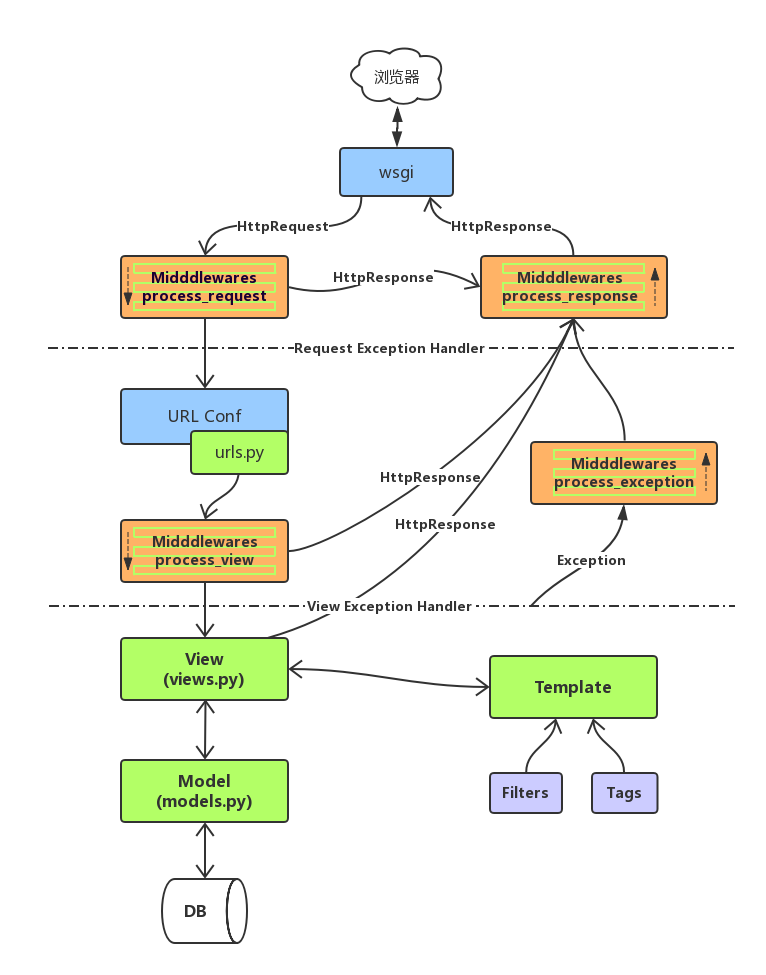

 本篇介绍Django的中间件(middleware)与Django处理请求的流程。 

<!--more-->


# Django’s request/response processing

​	在上一篇中，我们给视图函数加装饰器来判断是用户是否登录，把没有登录的用户请求跳转到登录页面。我们通过给几个特定视图函数加装饰器实现了这个需求。但是以后添加的视图函数可能也需要加上装饰器，这样是不是稍微有点繁琐，我们需要更合适的手段。

​	在前面的使用中，固定的套路是写urls.py，写views.py，写models.py,写模板中的页面。然后运行就OK了！但是在背后Django为我们所做的远远不止这么简单，一个Http请求所经历的也不仅仅是通过url进入views然后处理完成返回结果。例如，开始学习的时候，为了成功提交form表单，我们先将settings中MIDDLEWARE（中间件）中关于csrf那一条进行注释。这样我们就可以成功提交form表单。回头分析注释的这一条，有了它，Django就可以给客户端发送带有csrf_token 的表单，如果回执中没有这个 csrf_token ，则不做接收。所以Http请求也会经过中间件，那么一个Http请求的生命周期是怎样的呢？先给出结果，然后一步一步进行分析。


- 图中中间件的顺序是有原因的，有些中间件之间存在依赖关系，后面的中间件依赖于前面的中间件，如对于 `AuthenticationMiddleware` 来说，它依赖于 `SessionMiddleware` 。
- 我们可以把它看成一个**洋葱**，每个中间件是一层（layer），里面包裹着视图（view）（核心）。


# 中间件

## 为什么要有中间件？

​	Each middleware component is responsible for doing some specific function.

​	每一个中间件实现一个特定的功能，有了中间件，人们可以专注于业务，而不用在业务之外分太多精力。


## 定义

> Middleware is a framework of hooks into Django’s request/response processing. It’s a light, low-level “plugin” system for globally altering Django’s input or output.

- 中间件是一个用来处理Django的请求和响应的框架级别的钩子。它是一个轻量、低级别的插件系统，用于在全局范围内改变Django的输入和输出。每个中间件组件都负责做一些特定的功能。

- **在http请求 到达视图函数之前 和视图函数return之后，django会根据自己的规则在合适的时机执行中间件中相应的方法**。因为改变的是全局，所以需要谨慎实用，用不好会影响到性能。

> A middleware factory is a callable that takes a `get_response` callable and returns a middleware. A middleware is a callable that takes a request and returns a response, just like a view.

- 中间件是可调用的，像视图一样，它接受一个request对象并返回response对象。


### 函数形式

```python
def simple_middleware(get_response):
    # One-time configuration and initialization.

    def middleware(request):
        # Code to be executed for each request before
        # the view (and later middleware) are called.
		# 执行视图函数之前
        response = get_response(request)
		# 执行视图函数之后
        # Code to be executed for each request/response after
        # the view is called.

        return response

    return middleware
```

### 可调用的实例

```python
class SimpleMiddleware:
    def __init__(self, get_response):
        self.get_response = get_response
        # One-time configuration and initialization.

    def __call__(self, request):
        # Code to be executed for each request before
        # the view (and later middleware) are called.
		# 执行视图函数之前
        response = self.get_response(request)
		# 执行视图函数之后
        # Code to be executed for each request/response after
        # the view is called.

        return response
```

重要的事情说三遍，对于中间件把它理解成一颗洋葱，一颗洋葱，一颗洋葱。可以使用装饰器来包裹，也可以在类中定义 `__call__` 方法来包裹。


```
from django.utils.deprecation import MiddlewareMixin
```


# 五个方法，四个特征


### process_request(self,request)

执行时间：

- 执行视图函数之前，也在路由匹配之前。

参数：

- request ： 请求对象和视图中的是同一个。

执行的顺序：

- 按照中间件的注册顺序，顺序执行。

返回值：

- None：正常流程
- HttpResponse ： 当前中间件之后的中间件的process_request，路由匹配，视图函数都不执行，直接执行当前中间件的process_response的方法，倒序执行之前的process_response方法，最终返回给浏览器。


### process_response(self, request,response):

执行时间：

- 执行视图函数之后(或者其它特殊情况)

参数：

- request ： 请求对象和视图中的是一个
- response：返回的对象（视图，中间件）

执行的顺序：

- 按照中间件的注册顺序，**倒序**执行。视图之后的都是倒序执行

返回值：

- HttpResponse ： 必须返回response对象


### process_view(self,request, view_func, view_args, view_kwargs)

执行时间：

- 执行视图函数之前，路由之后

参数：

- request ： 请求对象和视图中的是一个
- view_func：视图函数
- view_args：传递给视图函数的位置参数，如分组。
- view_kwargs：传递给视图函数的关键字参数，如分组命名。

执行的顺序：

- 按照中间件的注册顺序，顺序执行

返回值：

- None：正常流程。
- HttpResponse：当前中间件之后的中间件的process_view，视图函数都不执行，直接执行最后一个中间件的process_response的方法，然后倒序执行之前的process_response方法，最终返回给浏览器。


### process_exception(self,request,exception)

执行时间（触发条件）：

- 视图层面中出现异常时才会执行

参数：

- request ： 请求对象和视图中的是一个
- exception：错误对象

执行的顺序：（视图函数之后执行的都是倒序）

- 按照中间件的注册顺序，**倒序**执行。

返回值：

- None：当前中间件处理不了，交给下一个中间件处理异常，所有的中间件都没有处理，将给django。
- HttpResponse：当前中间件处理了错误，之前中间件的process_exception不在执行，直接执行最后一个中间件的process_response的方法，然后倒序执行之前的process_response方法，最终返回给浏览器。

大黄页是  django帮你处理的这个异常。


### process_template_response(self,request,response)

执行时间（触发条件）：

- 视图返回的response 是一个 template_response对象

参数：

- request ： 请求对象和视图中的是一个
- response：响应对象

执行的顺序：（视图函数之后执行的都是倒序）

- 按照中间件的注册顺序，**倒序**执行

返回值：

- HttpResponse：必须返回


### render 与 process_template_response 的区别：

- render直接做好字符串的替换（渲染完成）

- process_template_response 执行完成之后，才会执行字符串的替换，比render更加灵活。

如果定义了process_template_response 方法，就会在该方法执行结束后进行render，所以相当于一种延时的渲染。

# 流程图

## 中间件的执行流程


## Django的请求流程




# 应用

练习1：限制访问频率（5s内只能访问3次）

- 通过IP
- 通过session

方法一：通过IP

```python
VISIT_HISTORY = {
        # ip：[time1(新),time2,time3(旧),]
        # ip：[time1(新),time2,time3(旧),]
    }
class Throttle(MiddlewareMixin):
    def process_request(self, request):
        IP = request.META['REMOTE_ADDR']
        history = VISIT_HISTORY.get(IP, [])
        print(history)
        while len(history) > 0 and time.time() - history[-1] > 5:
            history.pop()
        if len(history) > 3:
            return HttpResponse('太频繁了少年')
        else:
            history.append(time.time())
            VISIT_HISTORY[IP] = history
```

方法二：通过session

```python
class Throttle(MiddlewareMixin):
    def process_request(self, request):
        # [time1(新),time2,time3(旧),]  访问的时候，当有时间过期了，就pop
        history = request.session.get('history', [])
        print(history)
        while len(history) > 0 and time.time() - history[-1] > 5:
            history.pop()
            if len(history) > 3:
                return HttpResponse('太频繁了')
            else:
                history.append(time.time())
                request.session['history'] = history
```


练习2：使用中间件来验证是否登录，并给request对象封装当前登录的用户

- 装饰器是用来验证登录的一种方式，不过它需要一个一个的加在视图上。

- 中间件较之更为合理方便。

定义类AuthCheck类，定义process_request方法：

- 在这个方法中，建立白名单来使登录，注册，admin等通过，其它未登录的进行拦截。
- 登陆状态并存在该用户的时候，将该用户对象封装到request请求中，方便再视图中使用。

```python
class AuthCheck(MiddlewareMixin):

    def process_request(self, request):
        is_login = request.session.get('is_login')
        if request.path_info in [reverse('crm:login'), reverse('crm:register')]:
            # 白名单：如果是login或register就通过，其它未登录的都拦截
            return
        elif request.path_info.startswith('/admin'):
            # 也要让admin通过
            return
        if is_login != '1':
            # 对于白名单以外的都将拦截
            return redirect('crm:login')
        # 处于登录状态，就将获取用户的主键信息，找到并创建用户对象
        pk = request.session.get('pk')
        obj = models.UserProfile.objects.filter(pk=pk).first()
        if obj:
            # 访问其它页面的时候将该用户对象封装到request中
            # 这里不能使用 request.user ，它已经被Auth等中间件使用了，如果覆盖的话将不能使用admin等。
            request.user_obj = obj
            return
        else:
            # 对于session有问题的重新登录
            return redirect('crm:login')
```

note：重要的事情说三遍：定义完中间件别忘了再settings中注册呦！！！


# 源码分析

## MiddlewareMixin

ctrl+鼠标左键点击我们继承的 `MiddlewareMixin` 这个类，这是一个可调用的对象，分析如下：

```python
# django/utils/deprecation.py
class MiddlewareMixin(object):
    def __init__(self, get_response=None):
        self.get_response = get_response
        super(MiddlewareMixin, self).__init__()

    def __call__(self, request):
        response = None
        if hasattr(self, 'process_request'):	
            # 如果中间件中定义了process_request，就调用它。正常流程是返回None；
            # 如果返回response对象则请求不在进入后面的中间件。
            response = self.process_request(request)
        if not response:		
            # 如果process_request没有返回response，即正常流程下，调用视图
            response = self.get_response(request)
        if hasattr(self, 'process_response'):
            # 如果中间件中定义了process_request，就调用它。
            response = self.process_response(request, response)
        return response
```

​	通过这段代码我们明白了自定义的 `process_request` 与 `process_response`的细节，然后产生了新的疑问，那就是谁在调用中间件，怎么调用中间件，其它的方法的细节在哪儿呢？	

## core/handlers

```python
django
├── core        
│   ├── handlers  
│   │     ├── base.py		# BaseHandler类
│   │     ├── exception.py	# convert_exception_to_response 处理异常
│   │     └── wsgi.py  		# WSGIHandler类继承BaseHandler类，添加了 __call__方法
│   │  
│   ├── servers 	
│   │     └── basehttp.py   # 用于开发测试的server模块。WSGIServer、ServerHandler、 
│   │						# WSGIRequestHandler类
│   │
│   ├── wsgi.py 			# get_wsgi_application，启动server，传入application
│   └── ...
└── ...
```


django内置的server基本包括两部分：django.core.servers和django.core.handlers

- servers.basehttp是django自身提供的一个用于开发测试的server模块，其中提供的WSGIServer、ServerHandler、WSGIRequestHandler其实都是属于WSGI server，django只不过是对python内置的WSGI模块simple_server做的一层包装。WSGIServer 中携带了 django.core.handlers.wsgi 的 WSGIHandler 类的一个实例，通过 WSGIHandler 来处理由 Web 服务器（比如 Apache，Lighttpd 等）传过来的请求。

- handlers package包括 `base.py` 、 `wsgi.py` 和`exception.py `三个模块。
  - `base.py` 中只定义了一个BaseHandler类，涉及加载中间件，处理异常，获取响应数据等。
  - `wsgi.py` 中的WSGIHandler类，它继承了base.py中的BaseHandler，只添加了一个`__call__`方法，它是请求的入口，调用BaseHandler中定义的方法去执行加载中间件等一系列操作和异常处理，除此之外，WSGIHandler还会处理cookie、触发signal等。
  - `exception.py `中的 `convert_exception_to_response(get_response)` 函数，对response对象进行处理（包裹），所有的已知异常都会被转换成对应的4XX异常，如(Http404,PermissionDenied, MultiPartParserError, SuspiciousOperation),其它异常都会转换为500错误，这个装饰器自动应用到所有到中间件，确保中间件内部异常不会泄露而影响到后面到代码运行，然后下一个中间件可以继续处理上一个中间件返回的response,而不是抛出的异常。


### BaseHandler

- 加载中间件，处理异常，获取响应数据

```python
# django\core\handlers\base.py
class BaseHandler(object):
    
    def __init__(self):        
        self._request_middleware = None
        self._view_middleware = None
        self._template_response_middleware = None
        self._response_middleware = None
        self._exception_middleware = None
        self._middleware_chain = None

    def load_middleware(self):
        """
        Populate middleware lists from settings.MIDDLEWARE (or the deprecated
        MIDDLEWARE_CLASSES).

        Must be called after the environment is fixed (see __call__ in subclasses).
        """
        self._request_middleware = []
        self._view_middleware = []
        self._template_response_middleware = []
        self._response_middleware = []
        self._exception_middleware = []
        # 哇，在这里找到了，五大方法的影子，他们是一个个列表!!!

        if settings.MIDDLEWARE is None:      
            warnings.warn(
                "Old-style middleware using settings.MIDDLEWARE_CLASSES is "
                "deprecated. Update your middleware and use settings.MIDDLEWARE "
                "instead.", RemovedInDjango20Warning
            )
            handler = convert_exception_to_response(self._legacy_get_response)
            for middleware_path in settings.MIDDLEWARE_CLASSES:
                mw_class = import_string(middleware_path)
                try:
                    mw_instance = mw_class()
                except MiddlewareNotUsed as exc:
                    if settings.DEBUG:
                        if six.text_type(exc):
                            logger.debug('MiddlewareNotUsed(%r): %s', middleware_path, exc)
                        else:
                            logger.debug('MiddlewareNotUsed: %r', middleware_path)
                    continue
				
                # 将五大方法分别加到各自的列表中，request和view是尾插，另外三个是头插
                if hasattr(mw_instance, 'process_request'):
                    self._request_middleware.append(mw_instance.process_request)
                if hasattr(mw_instance, 'process_view'):
                    self._view_middleware.append(mw_instance.process_view)
                if hasattr(mw_instance, 'process_template_response'):
                    self._template_response_middleware.insert(0, mw_instance.process_template_response)
                if hasattr(mw_instance, 'process_response'):
                    self._response_middleware.insert(0, mw_instance.process_response)
                if hasattr(mw_instance, 'process_exception'):
                    self._exception_middleware.insert(0, mw_instance.process_exception)
        else:
            handler = convert_exception_to_response(self._get_response)
            for middleware_path in reversed(settings.MIDDLEWARE):
                middleware = import_string(middleware_path)
                try:
                    mw_instance = middleware(handler)
                except MiddlewareNotUsed as exc:
                    if settings.DEBUG:
                        if six.text_type(exc):
                            logger.debug('MiddlewareNotUsed(%r): %s', middleware_path, exc)
                        else:
                            logger.debug('MiddlewareNotUsed: %r', middleware_path)
                    continue

                if mw_instance is None:
                    raise ImproperlyConfigured(
                        'Middleware factory %s returned None.' % middleware_path
                    )

                if hasattr(mw_instance, 'process_view'):
                    self._view_middleware.insert(0, mw_instance.process_view)
                if hasattr(mw_instance, 'process_template_response'):
                    self._template_response_middleware.append(mw_instance.process_template_response)
                if hasattr(mw_instance, 'process_exception'):
                    self._exception_middleware.append(mw_instance.process_exception)

                handler = convert_exception_to_response(mw_instance)
                # 装饰到每个中间件前面

        # We only assign to this when initialization is complete as it is used
        # as a flag for initialization being complete.
        self._middleware_chain = handler

        
      

    def get_response(self, request):
        # 含有process_request 的逻辑
        """Return an HttpResponse object for the given HttpRequest."""
        省略...
        return response

    
    def _get_response(self, request):
        # process_view 的逻辑
        # views.py 自己定义的业务逻辑
        # process_template_response 的逻辑
        """
        Resolve and call the view, then apply view, exception, and
        template_response middleware. This method is everything that happens
        inside the request/response middleware.
        """
        省略...
        return response

    def process_exception_by_middleware(self, exception, request):
        # process_exception 的逻辑
        """
        Pass the exception to the exception middleware. If no middleware
        return a response for this exception, raise it.
        """
        for middleware_method in self._exception_middleware:
            response = middleware_method(request, exception)
            if response:
                return response
        raise


    def _legacy_get_response(self, request):
        # 先执行process_request，在执行_get_response包括（process_view, views.py ,process_template_response,process_exception）
        """
        Apply process_request() middleware and call the main _get_response(),
        if needed. Used only for legacy MIDDLEWARE_CLASSES.
        """
        response = None
        # Apply request middleware
        for middleware_method in self._request_middleware:
            response = middleware_method(request)
            if response:
                break

        if response is None:
            response = self._get_response(request)
        return response
```


### WSGIHandler

- 当有 HTTP 请求来时，WSGIHandler 就开始工作了，它从 BaseHandler 继承而来。WSGIHandler 为每个请求创建一个 WSGIRequest 实例，它相对于BaseHandler来说，只添加了一个 `__call__`方法，这是因为WSGI规范规定application是callable的。（callable包括函数、方法以及定义了 `__call__` 方法的对象）
- 执行BaseHandler中定义的方法。

```python
# django\core\handlers\wsgi.py
class WSGIHandler(base.BaseHandler):
    request_class = WSGIRequest

    def __init__(self, *args, **kwargs):
        super(WSGIHandler, self).__init__(*args, **kwargs)
        self.load_middleware()

    def __call__(self, environ, start_response):
        set_script_prefix(get_script_name(environ))
        signals.request_started.send(sender=self.__class__, environ=environ)
        request = self.request_class(environ)
        response = self.get_response(request)

        response._handler_class = self.__class__

        status = '%d %s' % (response.status_code, response.reason_phrase)
        response_headers = [(str(k), str(v)) for k, v in response.items()]
        for c in response.cookies.values():
            response_headers.append((str('Set-Cookie'), str(c.output(header=''))))
        start_response(force_str(status), response_headers)
        if getattr(response, 'file_to_stream', None) is not None and environ.get('wsgi.file_wrapper'):
            response = environ['wsgi.file_wrapper'](response.file_to_stream)
        return response
```

 

- 我们一共有process_request、process_response、process_view、自定义的CBV或FBV、process_template_response、process_exception 6个过程，当然还有url解析等。
- 从调用WSGIHandler开始，初始化的时候执行 `load_middleware` 将各个中间件通过get_response链接起来。
- `_middleware_chain`是职责链
- 执行 `WSGIHandler` 中的 `__call__` 方法，其中 `get_response` 分为两部分一部分是request请求顺序通过中间件依次进行处理（类似递归）：
  - 其中在 `BaseHandler`类中的 `_legacy_get_response` 方法中：先执行 `process_request`，正常流程中返回None，然后执行 `_get_response`方法（它是真正处理request的函数）；在 `_get_response` 方法中：先执行 `process_view` ，在执行 `自定义的CBV或FBV` ，在执行 `process_template_response` 如果遇到异常就会执行 `process_exception ` 。
- 另一部分是执行 `process_response` 方法以及异常处理。


到此，我们大致明白了这颗洋葱，那么在这些之前还有哪些动作呢?

1. 加载配置
   - django 的配置都在 “Project/settings.py” 中定义，可以是 django 的配置，也可以是自定义的配置，并且都通过 django.conf.settings 访问，非常方便。

2. 启动
   - 最核心动作的是通过 django.core.management.commands.runfcgi 的 Command 来启动，它运行 django.core.servers.fastcgi 中的 runfastcgi，runfastcgi 使用了 flup 的 WSGIServer 来启动 fastcgi 。而 WSGIServer 中携带了 django.core.handlers.wsgi 的 WSGIHandler 类的一个实例，通过 WSGIHandler 来处理由 Web 服务器（比如 Apache，Lighttpd 等）传过来的请求，此时才是真正进入 Django 的世界。


推荐阅读 [Django源码分析之server](https://blog.csdn.net/geekleee/article/details/73658549)

推荐阅读 [wsgi， flup和Django](https://blog.csdn.net/WitsMakeMen/article/details/19609835)

推荐阅读 [Django 源码阅读：服务启动(wsgi)](https://jianpengzhang.github.io/2019/01/16/2019011601/)