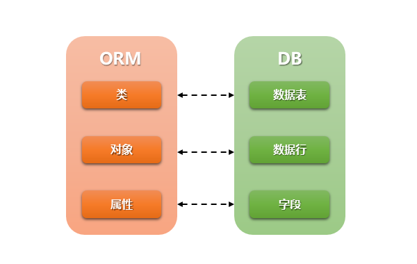

本篇介绍Django的ORM。 

<!--more-->

通过这篇文章，你能了解到：

- ORM是什么以及它的优缺点
- ORM语句的使用


# ORM

## 是什么

- 对象关系映射（Object Relational Mapping，简称ORM）模式是一种为了解决面向对象与关系数据库存在的互不匹配的现象的技术。

- Django的orm操作本质上会根据对接的数据库引擎，翻译成对应的sql语句；所有使用Django开发的项目无需关心程序底层使用的是MySQL、Oracle、sqlite....，如果数据库迁移，只需要更换Django的数据库引擎即可。




## 优势

使用 ORM 最大的优点就是快速开发，让我们将更多的精力放在业务上而不是数据库上，下面是 ORM 的几个优点

- 隐藏了数据访问细节，使通用数据库交互变得简单易行。同时 ORM 避免了不规范、冗余、风格不统一的 SQL 语句，可以避免很多人为的 bug，方便编码风格的统一和后期维护。
- ORM提供了对数据库的映射，不用直接编写SQL代码，只需操作对象就能对数据库操作数据。
- 方便数据库的迁移。当需要迁移到新的数据库时，不需要修改对象模型，只需要修改数据库的配置。


## 劣势

ORM 的最令人诟病的地方就是**性能**问题，不过现在已经提高了很多，下面是 ORM 的几个缺点

- 性能问题
  - 自动化进行数据库关系的映射需要消耗系统资源
  - 程序员编码
  - 在处理多表联查、where 条件复杂的查询时，ORM 可能会生成的效率低下的 SQL
  - 通过 Lazy load 和 Cache 很大程度上改善了性能问题
- SQL 调优，SQL 语句是由 ORM 框架自动生成，虽然减少了 SQL 语句错误的发生，但是也给 SQL 调优带来了困难。
- 越是功能强大的 ORM 越消耗内存，因为一个 ORM Object 会带有很多成员变量和成员函数。
- 对象和关系之间并不是完美映射

一般来说 ORM 足以满足我们的需求，如果对性能要求特别高或者查询十分复杂，可以考虑使用原生 SQL 和 ORM 共用的方式


## Django的ORM

- Django ORM用到三个类：`Manager`、`QuerySet`、`Model`。

- Manager定义表级方法（表级方法就是影响一条或多条记录的方法），我们可以以`models.Manager` 为父类，定义自己的manager，增加表级方法；
- QuerySet：Manager类的一些方法会返回QuerySet实例，QuerySet是一个可遍历结构，包含一个或多个元素，每个元素都是一个Model 实例，它里面的方法也是表级方法，前面说了，Django给我们提供了增加表级方法的途径，那就是自定义manager类，而不是自定义QuerySet类，一般的我们没有自定义QuerySet类的必要；
- Manager类的绝大部分方法是基于Queryset的。一个QuerySet包含一个或多个model instance。QuerySet类似于Python中的list，list的一些方法QuerySet也有，比如切片，遍历。
- django.db.models模块中的Model类，我们定义表的model时，就是继承它，它的功能很强大，通过自定义model的instance可以获取外键实体等，它的方法都是记录级方法（都是实例方法，貌似无类方法），不要在里面定义类方法，比如计算记录的总数，查看所有记录，这些应该放在自定义的manager类中。


## 测试方式

以前，我们不能直接运行一个py文件，因为会有环境约束，那我们还想在这个环境下，直接一段代码该怎么办？


### console控制台

在django项目中，点击Python Console，就可以使用Django环境。

- 优点：无需额外创建py文件
- 缺点：结果无法保存

```python
Python 3.6.5 (v3.6.5:f59c0932b4, Mar 28 2018, 17:00:18) [MSC v.1900 64 bit (AMD64)] on win32
Django 1.11.23
>>> from app01 import models
>>> models.Publisher.objects.all()
```


### 自定义py文件

在django项目下自定义一个py文件，写入如下内容，就可以在django环境下使用。

```python
import os
os.environ.setdefault("DJANGO_SETTINGS_MODULE", "about_orm.settings")
import django
django.setup()
```


### admin管理后台

可以使用的原因：

- url中有，而且在apps中也注册了

对表进行增删查改

1. 创建超级用户

   ```
   python manage.py createsuperuser
   ```

   - 然后，输入用户名密码

2. 注册

   ```python
   # app下的admin.py
   from django.contrib import admin
   from app01 import models
   
   admin.site.register(models.Person)
   # 注册了多个model，当编辑这个model是需要其它model（外键，多对多），但其它model内容为空就可以从当前页面打开创建其它model。
   ```

3. 登录

   - 127.0.0.1:8000/admin

4. 对于ManyToManyField字段 ，想避过admin校验（必填），可以加 `blank = True`


定制额外的功能

```python
from django.contrib import admin
from rbac import models


# Register your models here.
class PermissionAdmin(admin.ModelAdmin):
    list_display = ['title', 'url', 'is_menu', 'icon']
    list_editable = ['title', 'url', 'is_menu', 'icon']


admin.site.register(models.Role)
admin.site.register(models.Permission, PermissionAdmin)
admin.site.register(models.User)

但是这样运行的时候出现了如下错误：
ERRORS:
<class 'rbac.admin.PermissionAdmin'>: (admin.E124) The value of 'list_editable[0]' refers to the first field in 'list_display' ('title'), which cannot be used unless 'list_display_links' is set.
解决方法如下：
class PermissionAdmin(admin.ModelAdmin):
    list_display = ['title', 'url', 'is_menu', 'icon']
    # list_editable = ['title','url', 'is_menu', 'icon', ]
    list_editable = list_display
    list_display_links = None
设置 list_display_links 就好
```


### 打印sql语句

在settings.py中，添加如下配置，即可在使用orm查询数据库的时候，输出对应的sql语句。

```python
LOGGING = {
    'version': 1,
    'disable_existing_loggers': False,
    'handlers': {
        'console':{
            'level':'DEBUG',
            'class':'logging.StreamHandler',
        },
    },
    'loggers': {
        'django.db.backends': {
            'handlers': ['console'],
            'propagate': True,
            'level':'DEBUG',
        },
    }
}
```


# 字段

## 常用字段

### 数值

<u>**AutoField**</u>(Field)

- int自增列，必须填入参数 primary_key=True

- 一个model不能有两个AutoField


BigAutoField(AutoField)

- bigint自增列，必须填入参数 primary_key=True

note：当model中如果没有自增列，则自动会创建一个列名为id的列

SmallIntegerField(IntegerField):

- 小整数 -32768 ～ 32767 

PositiveSmallIntegerField(PositiveIntegerRelDbTypeMixin, IntegerField)

- 正小整数 0 ～ 32767

**<u>IntegerField</u>**(Field)

- 整数列(有符号的) -2147483648 ～ 2147483647
- 不要用它来存手机号（char）

PositiveIntegerField(PositiveIntegerRelDbTypeMixin, IntegerField)

- 正整数 0 ～ 2147483647

BigIntegerField(IntegerField):

	- 长整型(有符号的) -9223372036854775808 ～ 9223372036854775807

FloatField(Field)
- 浮点型

<u>**DecimalField**</u>(Field)

- 10进制小数
- 参数：
max_digits，小数总长度
decimal_places，小数位长度


BinaryField(Field)

- 二进制类型


### 布尔值

**<u>BooleanField</u>**(Field)

- 布尔值类型

NullBooleanField(Field):

- 可以为空的布尔值


### 字符

**<u>CharField</u>**(Field)

	- 字符类型
	- 必须提供max_length参数， max_length表示字符长度


TextField(Field)

- 文本类型


### 时间

**<u>DateTimeField</u>**(DateField)

- 日期+时间格式 `YYYY-MM-DD HH:MM[:ss[.uuuuuu]][TZ]`
- auto_now_add=True   只保存新增的那个时间
- auto_now  保存新增和修改的时间

<u>**DateField**</u>(DateTimeCheckMixin, Field)

- 日期格式      YYYY-MM-DD，相当于Python中的datetime.date的实例。
- auto_now：每次修改时修改为当前日期时间。
- auto_now_add：新创建对象时自动添加当前日期时间。

note：`auto_now` 、`auto_now_add` 、`default` 是互斥的


TimeField(DateTimeCheckMixin, Field)
- 时间格式      HH:MM[:ss[.uuuuuu]]

DurationField(Field)

- 长整数，时间间隔，数据库中按照bigint存储，ORM中获取的值为datetime.timedelta类型


### 验证

EmailField(CharField)：

- 字符串类型，Django Admin以及ModelForm中提供验证机制


IPAddressField(Field)

- 字符串类型，Django Admin以及ModelForm中提供验证 IPV4 机制


GenericIPAddressField(Field)

- 字符串类型，Django Admin以及ModelForm中提供验证 Ipv4和Ipv6
- 参数：
protocol，用于指定Ipv4或Ipv6， 'both',"ipv4","ipv6"
unpack_ipv4， 如果指定为True，则输入::ffff:192.0.2.1时候，可解析为192.0.2.1，开启此功能，需要protocol="both"


URLField(CharField)

- 字符串类型，Django Admin以及ModelForm中提供验证 URL


SlugField(CharField)

- 字符串类型，Django Admin以及ModelForm中提供验证支持 字母、数字、下划线、连接符（减号）


CommaSeparatedIntegerField(CharField)

- 字符串类型，格式必须为逗号分割的数字


UUIDField(Field)

- 字符串类型，Django Admin以及ModelForm中提供对UUID格式的验证


FilePathField(Field)

- 字符串，Django Admin以及ModelForm中提供读取文件夹下文件的功能
- 参数：
path,                               文件夹路径
match=None,                 正则匹配
recursive=False,              递归下面的文件夹
allow_files=True,             允许文件
allow_folders=False,       允许文件夹


FileField(Field)
- 字符串，路径保存在数据库，文件上传到指定目录
- 参数：
upload_to = ""      上传文件的保存路径
storage = None      存储组件，默认django.core.files.storage.FileSystemStorage


ImageField(FileField)
- 字符串，路径保存在数据库，文件上传到指定目录
- 参数：
upload_to = ""      上传文件的保存路径
storage = None      存储组件，默认django.core.files.storage.FileSystemStorage
width_field=None,   上传图片的高度保存的数据库字段名（字符串）
height_field=None   上传图片的宽度保存的数据库字段名（字符串）


推荐阅读: [field-types](https://docs.djangoproject.com/en/1.11/ref/models/fields/#field-types)


## 自定义字段

例子：自定义char类型

```python
class MyCharField(models.Field):
    '''自定义char类型的字段'''
    def __init__(self,max_length, *args, **kwargs):
        self.max_length = max_length
        super().__init__(max_length=max_length, *args, **kwargs)

    def db_type(self, connection):
        '''限定生成数据库表的字段类型为char，长度为max_length指定的值'''
        return f'char({self.max_length})'

class Person(models.Model):
    # 使用自定义char类型字段
    phone = MyCharField(max_length=11)
```


# 字段参数

## 常用参数

**null**

- 该字段可以为空

**blank**

- 设置字段后，使用admin管理的表中该字段可以不填
- 校验时可以为空（使用admin管理的表中可以不填）

default             

- 数据库中字段的默认值

**primary_key**         

- 数据库中字段是否为主键

db_index            

- 数据库中字段是否可以建立索引

unique              

- 数据库中字段是否可以建立唯一索引

unique_for_date     

- 数据库中字段【日期】部分是否可以建立唯一索引

unique_for_month    

- 数据库中字段【月】部分是否可以建立唯一索引

unique_for_year     

- 数据库中字段【年】部分是否可以建立唯一索引


## model form 系列

verbose_name        

- Admin中显示的字段名称

blank               

- Admin中是否允许用户输入为空

editable            

- Admin中是否可以编辑

help_text           

- Admin中该字段的提示信息

**<u>choices</u>**             

- Admin中显示选择框的内容，用不变动的数据放在内存中从而避免跨表操作

- 例子：

```python
# 元组中，左边是真实存放的值，右边是显示的值
gender = models.IntegerField(choices=[(0, '男'), (1, '女')])
```


对于choices字段：

`对象.get_字段名_display()` 来显示对应的值，而不是数据库中的值


error_messages 

- 自定义错误信息（字典类型），从而定制想要显示的错误信息；
- 字典健：null, blank, invalid, invalid_choice, unique, and unique_for_date
- 如：{'null': "不能为空.", 'invalid': '格式错误'}


validators          

- 自定义错误验证（列表类型），从而定制想要的验证规则

```python
from django.core.validators import RegexValidator
from django.core.validators import EmailValidator, URLValidator, DecimalValidator, MaxLengthValidator, MinLengthValidator, MaxValueValidator, MinValueValidator
    # 如：
test = models.CharField(
    max_length=32,
    error_messages={
        'c1': '优先错信息1',
        'c2': '优先错信息2',
        'c3': '优先错信息3',
    },
    validators=[
        RegexValidator(regex='root_\d+', message='错误了', code='c1'),
        RegexValidator(regex='root_112233\d+', message='又错误了', code='c2'),
        EmailValidator(message='又错误了', code='c3'), ]
    )
```

推荐阅读 [field-options](https://docs.djangoproject.com/en/1.11/ref/models/fields/#field-options)


## Model Meta参数

推荐阅读 [model meta options](https://docs.djangoproject.com/en/1.11/ref/models/options/#model-meta-options)

- 改变Admin中显示的内容：
- 改表名，显示名称

- 联合索引
- 联合唯一索引

```python
class Person(models.Model):
    pid = models.AutoField(primary_key=True)
    name = models.CharField(max_length=32)  # 旧版本按字节  varchar(32)
    age = models.IntegerField(null=True, blank=True)
    birth = models.DateTimeField(auto_now=True, null=True)
    gender = models.IntegerField(choices=[(0, '男'), (1, '女')])


    class Meta:
        # 数据库中生成的表名称 默认 app名称 + 下划线 + 类名
        db_table = "app01_person"

        # admin中显示的表名称
        verbose_name = '个人信息'

        # verbose_name加s
        verbose_name_plural = '所有用户信息'

        # 联合索引
        index_together = [
            ("name", "age"),  # 应为两个存在的字段
        ]

        # 联合唯一索引
        unique_together = (("name", "phone"),)  # 应为两个存在的字段
```

当我们在settings.py 设置 

LANGUAGE_CODE= ‘zh-Hans'

Admin 内的内容就翻译成中文了


# Manager

- 在创建完 Model 对象之后，Django 会自动为其关联一个 **Manager 对象**，该对象是 Model **进行数据库操作的接口**。默认的 Manager 对象名称为 objects。
- 表级
-  Manager 对象也可以自定义。


## 更改Manager对象的名称

```python
# models.py
# 更改Manager对象的名称
class Person(models.Model):
    people = models.Manager()
```


```python
# 自定义的py文件中
ret = models.Person.people.all()
print(ret)
```


## 自定义Manager对象

```python
# models.py
class NewManager(models.Manager):
    def func(self, **kwargs):
        from django.db import connection
        cursor = connection.cursor()
        condition = ''
        if kwargs.get('pid', None):
            condition = f"a.pid = {kwargs['pid']} and"
        query = f'''
                    SELECT a.name,a.age 
                    FROM app01_person a WHERE {condition} TRUE
                    GROUP BY a.pid
                '''
        # print(query)
        cursor.execute(query)
        result_list = cursor.fetchall()
        res = []
        for i,j in result_list:
            res.append(f"{i}今年{j}岁")
        return res
    
class Person(models.Model):
    # people = models.Manager()
    people = NewManager()   # 实例化自定义Manager对象
    pid = models.AutoField(primary_key=True)
    name = models.CharField(max_length=32)  # 旧版本按字节  varchar(32)
    age = models.IntegerField(null=True, blank=True)
    birth = models.DateTimeField(auto_now=True, null=True)

    def __str__(self):
        return f'{self.pk} {self.name}'
```

```python
# 自定义的py文件中
ret = models.Person.people.func()
ret = models.Person.people.func(pid=1)
print(ret)
```


# QuerySet 

- 从数据库中查询出来的结果一般是一个集合，这个集合称为 QuerySet。
- QuerySet 有两种来源：通过 Manager 的方法获取、通过 QuerySet 自身的方法获得。
- 字段级
- Manager 的查询方法和 QuerySet 的方法大部分同名、同意（Manager的就是基于 QuerySet 的实现的，所有两者会有相同的部分），例如 相同的有：filter, exclude等，但两者也有不同的方法，例如 Manager 的 create、get_or_create，QuerySet 的 delete 等。


## 限制QuerySet

在MySQL查询时，我们往往可以限制显示的数量， `LIMIT`，那再ORM中是如何表达呢? 切片！！！

对于QuerySet，我们可以时候python中的索引，切片，来限制输出，一个场景就是用于分页。

```python
# 显示前3个元素
ret = models.Person.objects.all()[:3]
print(ret)
```

- 看到这里可能会有一个疑惑，这有些low吧。查了所有，然后只显示前3个，其实并不是这样的，因为有Lazy load机制。


## Lazy load

QuerySet 是惰性加载的，创建查询集不会访问数据库，只有查询集需要**求值**时，才会真正运行这个查询。

在下面的例子中只有执行 `print ret` 才会真正的去查询数据库。

```python
ret = models.Person.objects.all()
print(ret)
```

关联对象也是惰性加载，只有用到了关联对象的值才会访问数据库

```python
ret = models.Person.objects.get(pk=1)
print(ret)
```

真正访问数据库的几种情况：

- 迭代：在首次迭代查询集时会执行数据库查询
- 切片(限制查询集)：对查询集执行切片操作时或指定 step 参数
- 序列化／缓存
- repr：对查询集调用 repr 函数
- len：对查询集调用 len 函数
- list: 对查询集调用 list() 方法强制求值
- bool:测试一个查询集的布尔值，例如使用bool(), or, and 或者 if 语句都将导致查询集的求值


## 缓存

每个 QuerySet 都包含一个缓存来最小化对数据库的访问

```python
# 访问两次数据库
print([obj.name for obj in models.Person.objects.all()])
print([obj.age for obj in models.Person.objects.all()])
# 访问一次数据库
ret = models.Person.objects.all()
print([obj.name for obj in ret])
print([obj.age for obj in ret])
```

- 在一个新的 QuerySet 中，缓存为空。当首次对 QuerySet 的所有实例进行求值时（代码中是print），会将查询结果保存到 QuerySet 的缓冲中。

- 当再访问该 QuerySet 时，会直接从缓冲中取数据。


# 必知必会13条（查询）

## 返回`QuerySet`   

**8 个**

- all
- filter
- exclude
- values
- values_list
- order_by
- reverse
- distinct

```python
#1. all 获取所有数据，返回QuerySet（对象列表）
ret = models.Person.objects.all()

#2. filter 获取所有满足条件的数据，返回QuerySet（对象列表）
ret = models.Person.objects.filter(pk=1)

#3. exclude 获取所有不满足条件的数据，返回QuerySet（对象列表）
ret = models.Person.objects.exclude(pk=1)

#4. orderby  按照字段进行排序，返回QuerySet。默认升序，加 - 表示降序
ret = models.Person.objects.all().order_by('-pid')
# 还可以按多个字段进行排序，前面的字段相同则按照后面的字段排序
ret = models.Person.objects.all().order_by('age', '-pid')

#5. reverse 对已经排序的queryset进行翻转（只是结果反过来）。 要求:在排序过的，才能执行翻转;
ret = models.Person.objects.all().order_by('pid')

#6. values 获取对象的字段名和字段值。返回QuerySet，QuerySet中包含字典。没有参数表示所有字段; 有参数获取指定字段。
ret = models.Person.objects.all().values()
# ret = models.Person.objects.all().values('pid')

#7. values_list 获取对象的字段值，返回QuerySet，QuerySet中包含元组。  没有参数时指所有字段；按顺序设置字段得到对应顺序的字段值。
ret = models.Person.objects.all().values_list()
ret = models.Person.objects.all().values_list('name','pid')
ret = models.Person.objects.all().values_list('pid','name')

#8.  distict 按照元素去重，如果元素是对象的话，需对象一样才能去重。不能直接按字段去重
ret = models.Person.objects.all().distinct()
	# 按指定字段去重 
ret = models.Person.objects.values('age').distinct()
```


## 返回对象   

**3个**

- get
- first
- last

```python
# get 获取一个满足条件的数据,返回对象  要求:存在且唯一,其它情况报错
ret = models.Person.objects.get(pk=1)

# first 获取第一个元素，如果不存在返回None
ret = models.Person.objects.filter(pk=100).first()
ret = models.Person.objects.filter(pk=1).first()

# last 获取最后一个元素，如果不存在返回None
ret = models.Person.objects.filter(pk=100).last()
ret = models.Person.objects.filter(pk=1).last()
```


## 返回bool

- exists

```python
# exists  判断数据是否存在,存在这条记录，返回True,否则返回False
ret = models.Person.objects.filter(pk=1).exists()
```


## 返回数字  

- count

```python
# count 计数,比len的效率高一些，因为len会真正的去数据库中进行查询
ret = models.Person.objects.all().count()
print(len(models.Person.objects.all()))
```


# 单表的双下划线

双下划线是python的一个特色，在ORM中通常用于显式分隔**过滤关键字** (filter key name) 的各个部分。在底层，字符串用这些下划线分割开，然后这些标记分开处理。`name__contains` 被替换成 `attribute: name, filter: contains`。

## 范围

### 大于，大于等于，小于，小于等于

- `__gt`
- `__gte`
- `__lt`
- `__lte`

```python
ret = models.Person.objects.filter(pk__gt=1)  # greater than
ret = models.Person.objects.filter(pk__gte=1)  # greater than equal
ret = models.Person.objects.filter(pk__lt=1)  # less than
ret = models.Person.objects.filter(pk__lte=1)  # less than equal
ret = models.Person.objects.filter(pk=1)  # equal
```

### 具体区间 

（闭区间）

- `__range`

```python
ret = models.Person.objects.filter(pk__range=[1, 3])  # 表示范围
```

### 成员判断

- `__in`

```python
ret = models.Person.objects.filter(pk__in=[1, 3, 7, 9])  # 取出这几个
```


## 模糊查询

### 包含

- `__contains`
- `__icontains`

```python
ret = models.Person.objects.filter(name__contains='a')  # like  包含/模糊查询
ret = models.Person.objects.filter(name__icontains='A')  # like  包含/模糊查询  ignore 忽略大小写
```


### 以什么开头

- `__startswith`
- `__istartswith`

```python
ret = models.Person.objects.filter(name__startswith='x')  # 以什么开头
ret = models.Person.objects.filter(name__istartswith='x')  # 以什么开头  忽略大小写
```


### 以什么结尾

- `__endswith`
- `__iendswith`

```python
ret = models.Person.objects.filter(name__endswith='x')  # 以什么结尾
ret = models.Person.objects.filter(name__iendswith='X')  # 以什么结尾  忽略大小写
```


### 年份

- `__year`

```python
ret = models.Person.objects.filter(birth__year=2019)  # 查询年份是2019
ret = models.Person.objects.filter(birth__month=9)  # 对于datetime是查不到的
```

- `__month`

```python
ret = models.Person.objects.filter(birth__month=9) # 对于date类型是可以查到的
```


- 使用模糊查询来查月份（会有警告，不过还是可以查到）

```python
ret = models.Person.objects.filter(birth__contains=9)
ret = models.Person.objects.filter(birth__contains='2019-09') 
```


### 为空

- `__isnull`

```
ret = models.Person.objects.filter(age__isnull=True)
```


# 外键的查询

## 模型定义

```python
class Publisher(models.Model):
    name = models.CharField(max_length=32)
    def __str__(self):
        return f"{self.pk}  {self.name}"

class Book(models.Model):
    title = models.CharField(max_length=32)
    pub = models.ForeignKey(to='Publisher')

    def __str__(self):
        return f"{self.pk}  {self.title}"
```


note：对于Book想要删除pub 只需要 Book.pub = None 就欧克了


### 自关联

- 表内自关联是指表内数据相关联的对象和表是相同字段，这样我们就直接用表内关联将外键关联设置成自身表的字段。同样表内关联也分一对多字段和多对多字段。

### 伪外键

db_constraint = False   数据库中不加这个外键约束，相当于伪约束。


## 基于对象的查询

基于对象的查询： 正向查询，反向查询


### 不指定related_name

1. 正向查询： 通过Book对象来查Publisher

```python
book_obj = models.Book.objects.all().first()
print(book_obj.pub)
print(book_obj.pub_id)	
print(book_obj.pub.name)	# 非id的其它字段就只能连续 . 了
```

2. 反向查询：通过Publisher对象来查询Book
   - 关系管理对象名称：类名小写 加 `_set` 

```python
pub_obj = models.Publisher.objects.get(pk=1)
print(pub_obj.name)
print(pub_obj.book_set,type(pub_obj.book_set))	# 关系管理对象
print(pub_obj.book_set.all())	# 查询关联的所有对象
```


### 指定related_name

在外键字段中 添加 `related_name='book'`

1. 正向查询：通过Book对象来查Publisher
   - 同前面，略。


1. 反向查询：通过Publisher对象来查询Book
   - 不同之处在于，关系管理对象的名字
   - 关系管理对象名称： `book`

```python
ret = pub_obj.book.all()
```


## 基于字段的查询

### 不指定related_name

1. 给出版社的名字，查书籍（通过外键）

   - pub__name表示从 book表跨到publisher

   - __  表示跨表，在sql语句中，就是要进行连表操作。

```python
book = models.Book.objects.filter(pub__name='变强出版社')
print(book)
```

2. 给书名查出版社

   - Publisher对象 通过 book (类名小写) 来跨表

   - 类名小写__字段

```python
ret = models.Publisher.objects.filter(book__title='Mysql删库到跑路')
print(ret)
```


### 指定related_name

外键定义中添加 related_name='books'

1. 给出版社的名字，查书籍（通过外键）
   - 同前面，不涉及related_name。
2. 给书名查出版社
   - 通过定义的 books 来进行跨表
   - 关系管理对象名称：`books `

```python
ret = models.Publisher.objects.filter(books__title='Mysql删库到跑路')
print(ret)
```


### 指定related_query_name

外键定义中添加 related_query_name='xxx'

1. 给出版社的名字，查书籍（通过外键）
   - 同前面，不涉及related_name。
2. 给书名查出版社
   - 通过定义的 xxx 来进行跨表
   - 关系管理对象名称：xxx
   - 且只能用在基于字段查询，不能用在基于对象查询

```python
ret = models.Publisher.objects.filter(xxx__title='Mysql删库到跑路')
print(ret)

# 通过对象是查不到的
pub_obj = models.Publisher.objects.all().first()
print(pub_obj.xxx)

# 即使 写了related_name 参数，仍优先使用related_query_name
```


### 小结

​	设置了外键后，我们可以通过外键来正向查询所关联的对象，名称为外键名（`pub =models.ForeignKey(to='Publisher')`），使用外键名与双下划线（`pub__`）就可以进行跨表查询，通过book对象，来查询出版社的信息。

​	那么对于出版社来说，通过出版社对象查询书籍的过程被称为反向操作(没有设置外键/少的一方 --->设置外键/多的一方)，具体如下：

- 在没有指定related_name的时候，我们通过设置外键的那个类的类名小写与双下划线结合( `book__` )来进行跨表查询；
- 设置了 related_name 后，我们不再用类名小写，而是用 related_name 的值；
- 在基于字段查询的过程中，如果设置了related_query_name，则优先使用related_query_name的值。
- 所以 related_name  和  related_query_name 都是反向查询时，关系管理对象可用的名字


## 关系管理对象的方法

- 通过关系管理对象来进行增删查改

- 针对出版社与书籍这个一对多关系


all  

- 获取所关联的所有对象

```python
# 正向
book = models.Book.objects.all().first()
print(book.pub)
# 反向
publish = models.Publisher.objects.all().first()
print(publish.book_set.all())
```


set  

- 设置一对多关系

- 只能用对象或对象列表，不能用id
- set(QuerySet)
- 当为外键设置 null=True 时，才可以减少（减少意味着，有些就为null了）；没有设置null=True 则不会改变。

```python
# 正向 ： 一本书对应一个出版社
# 对于正向来说，pub是关联的对象，而不是关系管理对象，所以不能使用这些方法。
book = models.Book.objects.all().first()
print(book.pub) # None
# book.pub.set(models.Publisher.objects.filter(pk=2))  # 报错， 当没有设置关联对象时，是没有set方法可以使用的。
book.pub = models.Publisher.objects.filter(pk=2).first()
book.save()
print(book.pub)


# 反向 ：一个出版社可以对应很多书
publish = models.Publisher.objects.all().first()
print(publish.book_set.all())
publish.book_set.set(models.Book.objects.filter(pk__in=[3]))
print(publish.book_set.all())
```


add

- 添加一对多关系

- add(对象, 对象)
- add( *QuerySet)   列表打散
- 理解上也是：我的少的一方可以指定多的一方（一个出版社可以对应很多书）

```python
# 正向
user_obj.customers.add(*models.Customer.objects.filter(pk__in=opt_cus))
```


remove/clear

- remove(*QuerySet)

- 当你干掉这两个字段后，为null，如果字段不允许为空就会报错
- 外键字段设置可以为空 null=True 后，才能用remove/clear

```python
# 反向：
publish = models.Publisher.objects.all().first()
print(publish.book_set.all())
publish.book_set.clear()      # 这一条
print(publish.book_set.all())

# 正向
user_obj.customers.remove(*models.Customer.objects.filter(pk__in=opt_cus))
```


create

- 新增一个所关联的对象，并且建立一对多的关系(少的一方创建多的一方)
- 小差别

```python
# 通过关系管理对象，创建一本书。
publish = models.Publisher.objects.all().first()
publish.book_set.create(title='祥龙宝典')
print(publish.book_set.all())

# 这也会给别的出版社添加一本书
publish = models.Publisher.objects.all().first()
publish.book_set.create(title='万象森罗',pub_id=3)
print(publish.book_set.all())
```


update

- 使用`update()`方法可以批量为QuerySet中所有的对象进行更新操作。
- 增加外键： 

```python
# 反向
models.Customer.objects.filter(pk__in=opt_cus).update(consultant=user_obj)
```

- 删除外键： 

```python
# 反向
models.Customer.objects.filter(pk__in=opt_cus).update(consultant=None)
```


# 多对多关系

## 模型定义

继续在models.py 中定义新类 Author， Author 与 Book 是多对多关系。

```python
class Publisher(models.Model):
    name = models.CharField(max_length=32)
    def __str__(self):
        return f"{self.pk}  {self.name}"

class Book(models.Model):
    title = models.CharField(max_length=32)
    pub = models.ForeignKey(to='Publisher')

    def __str__(self):
        return f"{self.pk}  {self.title}"
    
class Author(models.Model):
    name = models.CharField(max_length=32)
    books = models.ManyToManyField(to='Book')
    def __str__(self):
        return f"{self.pk}  {self.name}"
```


## 基于对象的查询

### 不指定related_name

1. 正向查询：

```python
author = models.Author.objects.all().first()
print(author.name)
print(author.books,type(author.books))  # 关系管理对象
print(author.books.all())	# 查询该作者关联的所有书籍
```

2. 反向查询：
   - 关系管理对象名称：类名小写 加 `_set`  （`author_set`）

```python
book_obj = models.Book.objects.all().first()
print(book_obj)
print(book_obj.author_set.all())	# 查询该书关联的所有作者
```


### 指定related_name

1. 正向：
   - 相似，略。（不涉及related_name）


2. 反向查询：
   - 在ManyToManyField设置 related_name 为authors
   - 关系管理对象名称： authors

```python
book_obj = models.Book.objects.all().first()
print(book_obj)
print(type(book_obj.authors))	# 关系管理对象
print(book_obj.authors.all())	# 查询该书关联的所有作者
```


## 基于字段的查询

### 不指定related_name

1. 通过书籍去查作者

   - 正向查询（设置ManyToManyField）

   - Author ---> Book

```python
author = models.Author.objects.filter(books__title='Mysql删库到跑路')
print(author)
```


2. 通过作者去查书籍
   - 查询这个作者写的书（反向查询）
   - Book --->  Author

```python
books = models.Book.objects.filter(author__name='光头强')
print(books)
```


### 指定related_name

在 ManyToManyField 定义中，添加 `related_name = 'authors'`

1. 通过书籍去查作者
   - 同前面， related_name 不影响正向

2. 通过作者去查书籍
   - 关系管理对象名称： authors

```python
books = models.Book.objects.filter(authors__name='光头强')
print(books)
```


### 小结

基于对象的查询与基于字段的查询：

- 基于字段的查询，名称是写在 filter 内部，当关键字参数；而基于对象的查询，是通过 `对象.关联对象小写__set` 这个关系管理对象来进行操作。


## 关系管理对象的方法

- 通过关系管理对象来进行增删查改
- 针对书籍与作者这个多对多关系

- 也分为正反向，反向也可以使用 related_name , 明确用对的关系管理对象名称就行。

all  

- 获取所关联的所有对象


set  

- 设置多对多关系（先删除该对象原有的，在添加新的）

- [id, id, id]
- [对象, 对象, 对象] 或 QuerySet，最终还是转成id
- 为什么可以做到呢? 因为这个表里共三个字段，id不用管，book_id 是你当前对象携带的，所以只需要指定 author_id 就行。

```python
book_obj = models.Book.objects.all().first()
print(book_obj.authors.all())   # 原来是<QuerySet [<Author: 1  光头强>, <Author: 2  小灰>]>

# 通过id 修改
book_obj.authors.set([2,3])     # 通过Book对象，在 author_book表中，进行修改，先删除原来的关系，在添加新的关系
print(book_obj.authors.all())   # 改为<QuerySet [<Author: 2  小灰>, <Author: 3  小光>]>

# 通过 QuerySet 修改
ret = book_obj.authors.set(models.Author.objects.filter(pk__in=[2]))
print(ret)	# 打印None
print(book_obj.authors.all())	# 成功修改
```


add

- 添加多对多关系（不在用列表了）

- add(id, id)
- add(对象, 对象)
- add( *QuerySet)   列表打散

```python
book_obj = models.Book.objects.all().first()
print(book_obj.authors.all())
# 通过 id 添加
book_obj.authors.add(1, 3)	# 这里不再是列表了
print(book_obj.authors.all())

# 打散QuerySet添加
print(book_obj.authors.all())
book_obj.authors.add(*models.Author.objects.filter(pk__in=[1,3]))
print(book_obj.authors.all())
```


remove

- 删除多对多关系 (有则删除，无则不变，不会报错)
- remove(id, id)
- remove(对象, 对象)
- remove( *QuerySet)   列表打散

```python
book_obj = models.Book.objects.all().first()
print(book_obj.authors.all())
book_obj.authors.remove(1)
print(book_obj.authors.all())
```


clear 

- 清空多对多关系

- 对象.关系管理对象.clear()

```python
book_obj = models.Book.objects.all().first()
print(book_obj.authors.all())
book_obj.authors.clear()
print(book_obj.authors.all())
```


create

- 新增一个所关联的对象，并且建立多对多的关系(通过作者去造一本书，并自动添加关系)

```python
# 正向  通过作者对象，来创建一本书，并自动添加关系
author = models.Author.objects.all().first()
print(author.books.all())
author.books.create(title='降龙十八掌', pub_id=2)
print(author.books.all())

# 反向  通过书籍对象，创造一个作者，并自动添加关系
book_obj = models.Book.objects.all().first()
print(book_obj.authors.all())
book_obj.authors.create(name='小强')
print(book_obj.authors.all())
```


### 小结

对于外键中关于关系管理对象的方法 和 多对多关系中关系管理对象的方法 它们的一个差别在于后者可以直接使用 id 来进行增删查改，而前者只能通过对象。


# 聚合查询和分组查询

## 聚合查询

- 从 django.db.models 导入聚合函数，这些聚合函数是类

- aggregate 是终止子句，执行后得到的是一个字典

例子:

```python
from django.db.models import Max,Min,Count,Avg,Sum

# 1.统计书中最高的价格
	# 默认是对 all()的结果进行聚合,all可以省略。
ret = models.Book.objects.aggregate(Max('price'))
print(ret)
	# 完整写法，
ret = models.Book.objects.all().aggregate(max=Max('price'))
print(ret)
	# 可以同时查最大，最小，等等。
ret = models.Book.objects.aggregate(max=Max('price'),min=Min('price'))
print(ret)
    # 也可以对筛选后的结果进行聚合，下面两个语句sql语句是一样的。
ret = models.Book.objects.filter(pk__range=[3,5]).aggregate(max=Max('price'),min=Min('price'))
print(ret)
ret = models.Book.objects.filter(pk__range=[3,5]).values().aggregate(max=Max('price'),min=Min('price'))
print(ret)

```


## 分组查询

- 分组查询需要和聚合一起使用，不然没多大意义
- annotate 是**注释**的意思（额外添加信息），将结果封装对象的属性，翻译成sql语句，里面是有group by的。
- annotate 默认以该对象的id，进行分组，如果想更改分组条件，可以先使用values进行筛选，然后使用annotate，添加注释。 见例中方法二。 当然使用values筛选建议筛选这个类（表）


例子:

```python
# 统计每一本书的作者个数
	# 使用annotate后给对象添加一个新属性，authors__count
ret = models.Book.objects.annotate(Count('authors'))
ret = models.Book.objects.annotate(Count('authors')).values()
print(ret)
for i in ret:
    print(i)	
    # print(i['authors__count'])

# 统计出每个出版社最便宜的书
	# 方法一： (按出版社进行分组) （一个出版社对应多本书，从少的一方）
ret = models.Publisher.objects.annotate(Min('book__price'))
ret = models.Publisher.objects.values().annotate(Min('book__price')).values()   # 加了values 会更清晰
print(ret)
	# 方法二：（从多的一方入手）
ret = models.Book.objects.values('pub__name').annotate(Min('price'))
ret = models.Book.objects.values('pub__name').annotate(Min('price')).values('title')  # 不再前面出现的字段，如.values('title')，会作为一个新的分组条件（sql语句中）
ret = models.Book.objects.values('pub__name').annotate(Min('price')).values('price')  # 前面出现的字段，做筛选，不会作为新的分组条件
print(ret)

# 统计不止一个作者图书
ret = models.Book.objects.annotate(count=Count('authors')).filter(count__gt=1).values()
print(ret)

# 查询各个作者出的书的总价格
ret = models.Author.objects.annotate(sum=Sum('books__price')).values()
print(ret)
```


# F查询与Q查询

F查询：字段之间的比较；动态获取字段的值。

Q查询是为了弥补 OR

## 模型定义

为了丰富查询，增加列

```python
class Book(models.Model):
    title = models.CharField(max_length=32)
    price = models.DecimalField(max_digits=5,decimal_places=2,default=5)
    sale = models.IntegerField()
    memo = models.IntegerField()
    pub = models.ForeignKey(to='Publisher',null=True)

    def __str__(self):
        return f"{self.pk}  {self.title}"
```


## F查询

### 字段之间的比较

以前在filter内写多个条件，用逗号隔开，这是与的意思。

例如：

我们查询销量大于50且库存大于30的

```python
ret = models.Book.objects.filter(sale__gt=50, memo__gt=30)   # sale >50 且 memo > 30
print(ret)
```


如果我们想查销量大于库存的行有哪些（同一行的不同字段间的比较），通过以前的方式是做不了的，所以引入F查询

```python
from django.db.models import F

ret = models.Book.objects.filter(sale__gt=F('memo'))
print(ret)
```


### 动态获取字段的值

假如我们想刷一下销量，按照以前的做法，可以这样做：

```python
ret = models.Book.objects.all()
for book in ret:
    book.sale += 10
    book.save()
```

- logging打印的sql语句：

```python
(0.001) UPDATE `app01_book` SET `title` = '祥龙宝典', `price` = '5.00', `sale` = 400, `memo` = 50, `pub_id` = 1 WHERE `app01_book`.`id` = 7; args=('祥龙宝典', '5.00', 400, 50, 1, 7)
(0.001) UPDATE `app01_book` SET `title` = '万象森罗', `price` = '5.00', `sale` = 400, `memo` = 50, `pub_id` = 3 WHERE `app01_book`.`id` = 9; args=('万象森罗', '5.00', 400, 50, 3, 9)
```


使用F查询就很简单

```python
ret = models.Book.objects.update(sale=F('sale') * 2 + 10)
print(ret)
```

- logging打印的sql语句

```python
(0.001) UPDATE `app01_book` SET `sale` = ((`app01_book`.`sale` * 2) + 10); args=(2, 10)
```


update与save比较：

save会把所有内容取出重新赋值，而update只会把需要修改的内容进行修改，效率上，这两个差异很大。


## Q查询

```python
# 取 2< pk < 5
ret = models.Book.objects.filter(pk__gt=2, pk__lt=5) 
# 那么如果是小于2或大于5呢？ exclue 能解决，但有些复杂了
ret = models.Book.objects.exclude(pk__gte=2, pk__lte=5)
```

引入Q查询，来解决 OR

```python
from django.db.models import Q

ret = models.Book.objects.filter(Q(pk__gt=5) | Q(pk__lt=2))  # >5 或 <2
print(ret)
ret = models.Book.objects.filter(~Q(pk__gt=5) | Q(pk__lt=2))  # <=5  或 <2
ret = models.Book.objects.filter(~Q(~Q(pk__gt=5) | Q(pk__lt=2)))  # >5
```

几种清空：

- Q(条件)

- Q(条件)&Q(条件)  与

- Q(条件)|Q(条件)  或

- ~Q(条件)   非


### Q对象的新写法

当我们使用搜索功能时，希望对搜索条件有一个更好的封装，而不是直接写一堆Q()

- 小试牛刀

```python
q = Q()
q.connector = 'OR'  # 里面的内容是或的关系
q.children.append(Q(qq__contains=search))			# 以前这样写
q.children.append(Q(('qq_name__contains',search)))  # 这里还需要括号包一层，这样的话不再是关键字参数，我们就可以进行变量的拼接
print(q)
query = models.Customer.objects.filter(q)
print(query)
```

- 整理简化

定义：

```python
def local_search(self, field_list, search):
    q = Q()
    q.connector = 'OR'
    for field in field_list:
        q.children.append(Q((f'{field}__contains', search)))
        # print(q)
    return q
```

使用：

```python
search = request.GET.get('local_search', '')
field_list = ['qq_name', 'phone', 'name', 'qq']
q = self.local_search(field_list, search)
```


# bulk_create

一次性插入多条

```python
# 批量插入数据
# 内存中生成
studyrecords_list = []
studyrecords_list.append(实例化)
# 使用bulk_create批量插入
models.StudyRecord.object.bulk_create(studyrecords_list)  # 批量插入
```


# 事务

一系列操作，当作一个操作。要么都成功，要么都失败。

格式：

```
with transation.atomic():
    # 设置事务回滚的标记点
    sid1 = transation.savepoint()

    .... # 增删改等数据库操作

    try:
    ....
    except:
    transation.savepoint_rallback(sid1)
```


例1：

a同学给b同学转账100元

```python
rom django.db import transaction

try:
    with transaction.atomic():
        # orm 操作
        a = models.People.objects.filter(pk=2).select_for_update()
        b = models.People.objects.filter(pk=3).select_for_update()       
        if a.account-100 < 0:
            raise Exception
        a.account -= 100
        a.save()
        # int('ssss')
        b.account += 100
        b.save()
except Exception as e:
    print(e)
```

-  `with transaction.atomic()` 开启事务

- `.select_for_update()` 开启行级锁

  


# 执行原生SQL

例子：

```python
from django.db import connection, connections
cursor = connection.cursor()  # cursor = connections['default'].cursor()
cursor.execute("""SELECT * from app01_person where pid = %s""", [1])
row = cursor.fetchone()
print(row)
```


# 小结

1. 写orm语句的时候，可以正向，可以反向，根据要求中出现的表名出发，两种写出来进行比较。

2. 正向查询后继续反向回查会多连一次表。例子如下：

```python
# 查找书名是“小灰机”的书的出版社出版的其他书籍的名字和价格
ret = models.Book.objects.filter(publisher__book__title='小灰机').exclude(title='小灰机')
# 从book 到 publisher 在回到 book 
# 在sql语句中是 将book表与publisher进行内连接，在与book表进行内连接。
```

3. 先values在filter 与 先filter在values是不一样的

   - 先filter在values，这样列少一些（少一些连表），信息会缺。

   - 先filter在values，先增加列信息，然后再进行筛选，这也不会缺失信息。（这个作者它的所有书籍都在一行，而不是一本书是一条行）

```python
# 查找书名是“小灰机”的书的作者们的姓名以及出版的所有书籍名称和价钱 
# orm语句
ret = models.Author.objects.filter(book__title='小灰机').values('name', 'book__title', 'book__price')
print(ret)
# 打印的sql语句
SELECT `app01_author`.`name`, `app01_book`.`title`, `app01_book`.`price`
FROM `app01_author` INNER JOIN `app01_book_author` ON (`app01_author`.`id` = `app01_book_author`.`author_id`)
                    INNER JOIN `app01_book` ON (`app01_book_author`.`book_id` = `app01_book`.`id`)
WHERE `app01_book`.`title` = '小灰机' LIMIT 21;


# orm语句
ret = models.Author.objects.values('name', 'book__title', 'book__price').filter(book__title='小灰机')
print(ret)
# 打印的sql语句
SELECT `app01_author`.`name`, `app01_book`.`title`, `app01_book`.`price`
FROM `app01_author` LEFT OUTER JOIN `app01_book_author` ON (`app01_author`.`id` = `app01_book_author`.`author_id`)
                    LEFT OUTER JOIN `app01_book` ON (`app01_book_author`.`book_id` = `app01_book`.`id`)
                    INNER JOIN `app01_book_author` T4 ON (`app01_author`.`id` = T4.`author_id`)
                    INNER JOIN `app01_book` T5 ON (T4.`book_id` = T5.`id`)
WHERE T5.`title` = '小灰机' LIMIT 21; 
```

4. null 和 空 的判断方式是不一样的，但对于查一个字段是否为空，需要将两者结合

```python
# 查找memo字段是空的书 
ret = models.Book.objects.filter(Q(memo__isnull=True) | Q(memo=''))
print(ret)
```

