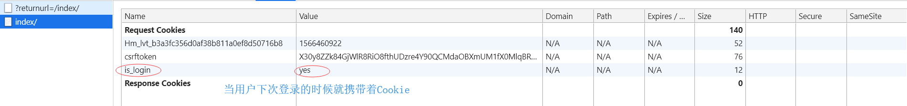

本篇介绍Django的Cookie和Session。 

<!--more-->


# Cookie

## 基本概念

### 定义

- Cookie指的是一小段信息，它是保存在浏览器的一组组键值对 key:value 。

### 原理

cookie的工作原理是：由服务器产生内容，浏览器收到请求后保存在本地；当浏览器再次访问时，浏览器会自动带上Cookie，这样服务器就能通过Cookie的内容来判断这个是“谁”了。

### 特性

1. 服务器让浏览器进行设置，浏览器也有权不设置

2. 保存在浏览器本地

3. 下次访问时自动携带对应的cookie

### 用途

- 因为[HTTP协议](https://zh.wikipedia.org/wiki/HTTP)是**无状态**的，即[服务器](https://zh.wikipedia.org/wiki/服务器)不知道用户上一次做了什么，这严重阻碍了[交互式Web应用程序](https://zh.wikipedia.org/wiki/交互式Web应用程序)的实现。所以凭借Cookie可以保存状态信息，如是否登录，购物车信息等。

### 缺陷

1. Cookie会被附加在每个HTTP请求中，所以无形中增加了流量。
2. 由于在HTTP请求中的Cookie是明文传递的，所以安全性成问题，除非用HTTPS。
3. Cookie的大小限制在4KB左右，对于复杂的存储需求来说是不够用的。

### 应用

1. 登录
2. 购物车
3. 记录网页的浏览习惯


# django中操作cookie

## 流程

cookie是服务器产生的一段随机的字符串，发送给客户端，随后客户端便保存cookie，并使用这个cookie附带进后续的请求

1. 客户端发起一个请求连接（如HTTP GET）。
2. 服务器在http响应头上加上`Set-Cookie`，里面存放字符串的键值对。
3. 客户端随后的http请求头加上`Cookie`首部，它包含了之前服务器响应中设置cookie的信息。

## 设置

### 两种设置方式

1. 普通的cookie

   response.set_cookie(k1,v1)  

   本质是 `ret['Set-Cookie'] = 'is_login=1000; path=/'`

2. 加密的cookie

   ```python
   ret.set_signed_cookie('is_login','yes',salt='super')
   ```

### 设置cookie的参数：

| 参数           | 含义                                                         |
| -------------- | ------------------------------------------------------------ |
| key            | 键                                                           |
| value          | 值                                                           |
| max_age=None   | 超时时间， 如5秒后超时，max_age=5                            |
| expires=None   | 超时时间(IE requires expires, so set it if hasn't been already.) |
| path='/home/'  | Cookie生效的路径，例如：只有访问 home才会带着cookie，其它页面不会带着。 一般情况设置为 '/' |
| domain=None    | Cookie生效的域名                                             |
| secure=True    | https传输的时候才会携带cookie，http传输不会携带              |
| httponly=False | 只能http协议传输，无法被JavaScript获取（不是绝对，底层抓包可以获取到也可以被覆盖） |


## 获取

### 普通的

```python
request.COOKIES.get('is_login')
```


### 加密的

```python
request.get_signed_cookie('is_login',default='',salt='super') 
```

加密只是在原来的基础后面加一段。

get_signed_cookie方法的参数：

- default: 默认值
- salt: 加密盐
- max_age: 后台控制过期时间


## 删除 （注销）

```python
def logout(request):
    # 删除is_login
    ret = redirect('/login/')
    ret.delete_cookie('is_login')  # 删除用户浏览器上之前设置的user的cookie值
    return ret
```


## 浏览器中分析

login/：

Response Headers： Set-Cookie: is_login=yes; Path=/


home/

Cookie: 

Request Headers



## 例子

实现登录，跳转，注销。

```python
def login(request):
    error = ''
    if request.method == 'POST':
        user = request.POST.get('user')
        pwd = request.POST.get('password')
        if user == 'atlas' and pwd == '123':
            ret = redirect('/home/')  # 这里写死了，应该返回原来所在的位置，后面会改动
            # 校验成功设置登陆状态
            # 设置cookie
            ret.set_cookie('is_login','yes')
            # ret['Set-Cookie'] = {'is_login':'yes'}
            return ret
        else:
            error = '用户名或密码错误'
    return render(request, 'login.html', {'error': error})

def logout(request):
    # 删除is_login
    ret = redirect('/login/')
    ret.delete_cookie('is_login')
    return ret

def home(request):
    # 读取cookie
    print(request.COOKIES)
    is_login = request.COOKIES.get('is_login')
    if not is_login:
        return redirect('/login/')
    # 判断是否登录
    return HttpResponse('home ok')
```


### 完善功能

- 增加装饰器
  - 对于其它页面的cookie验证，使用一个装饰器来进行检测，而不用在每个函数内增加逻辑。


```python
def login_required(func):
    def inner(request,*args,**kwargs):
        print(request.COOKIES)
        is_login = request.COOKIES.get('is_login')
        if not is_login:
            return redirect(f'/login/?returnurl={request.path_info}')
        else:
            ret = func(request,*args,**kwargs)
            return ret
    return inner

def login(request):
    request.clear_expired()
    error = ''
    if request.method == 'POST':
        user = request.POST.get('user')
        pwd = request.POST.get('password')
        if user == 'atlas' and pwd == '123':
            # ret = redirect('/home/')  # 这里写死了，应该返回原来所在的位置
            # 校验成功设置登陆状态          
                # 获取要跳转的地址
            returnurl = request.GET.get('returnurl')
            if returnurl:
                ret = redirect(returnurl)
            else:
                ret = redirect('/home/')
            # 设置cookie
            ret.set_cookie('is_login','yes')	# 本质上是添加Set-Cookie键值对
            # ret['Set-Cookie'] = {'is_login':'yes'}
            return ret
        else:
            error = '用户名或密码错误'
    return render(request, 'login.html', {'error': error})      # 只是返回内容

@login_required
def home(request):
    return HttpResponse('home ok')

@login_required
def index(request):
    return HttpResponse('index ok')
```

- 解释：

```python
# 装饰器中
redirect(f'/login/?returnurl={request.path_info}')

# login函数中
returnurl = request.GET.get('returnurl')
if returnurl:
    ret = redirect(returnurl)
    else:
        ret = redirect('/home/')
```

这样改是为了，如果我们从其它页面点击登录，登陆成功后可以回到该页面，如从index到登录，然后再回到index。

- 补充：

```html
<form action="" method="post">
```

`action=""`会携带后面的 `?returnurl`，但如果form表单中的 action属性中 写了 /login/ 则只会返回到home页面，因为写死了，从index到登录，但回不到index了。


- 补充：

如果从index点击登录，登陆的时候，用户名密码输入错误，登陆失败，那么url后面的参数returnurl还携带吗？

会的，因为render只是返回一个页面，如果form中没有设置action，登陆成功后依然会跳转到原来的页面（index）

# session

定义:

- 保存在服务器的一组组键值对，但是必须依赖于cookie 。

为什么要用session

- cookie保存在浏览器上，存在安全问题。
- 浏览器对cookie的大小有限制。


# django中操作session

## 流程


session是一个QueryDict（类字典，多了getlist方法）


## 设置

```python
request.session['is_login'] = '1000'
```

session默认保存到数据库中。

设置后需要执行 migrate命令，在数据库中建表。


## 获取

```python
is_login = request.session.get('is_login')
```


## 删除

- del request.session[key] 
- request.session.pop('key')

- `request.session.delete()`  删除数据库中的session数据，不删除cookie，但是登陆后也会重新设置cookie。

- `request.session.flush()`   删除数据库中的session数据，删除cookie


## 其它操作

将所有Session失效日期小于当前日期的数据删除

```python
request.session.clear_expired()
```


设置会话Session和Cookie的超时时间

```python
request.session.set_expiry(value)
```

- 0 浏览器关闭的时候结束
- 可以设置datetime
- 可以设置多少秒
- None 不超时

获取sessionid的值

```
request.session.session_key
```


## 配置

### session设置

from django.conf import global_settings

去这里找session配置

```python
# Cache to store session data if using the cache session backend.
SESSION_CACHE_ALIAS = 'default'
# Cookie name. This can be whatever you want.
SESSION_COOKIE_NAME = 'sessionid'	# cookie的名字
# Age of cookie, in seconds (default: 2 weeks).
SESSION_COOKIE_AGE = 60 * 60 * 24 * 7 * 2		# 超时时间
# A string like ".example.com", or None for standard domain cookie.
SESSION_COOKIE_DOMAIN = None
# Whether the session cookie should be secure (https:// only).
SESSION_COOKIE_SECURE = False
# The path of the session cookie.
SESSION_COOKIE_PATH = '/'
# Whether to use the non-RFC standard httpOnly flag (IE, FF3+, others)
SESSION_COOKIE_HTTPONLY = True
# Whether to save the session data on every request.
SESSION_SAVE_EVERY_REQUEST = False	# 每次访问都保存session数据（更新超时时间）
# Whether a user's session cookie expires when the Web browser is closed.
SESSION_EXPIRE_AT_BROWSER_CLOSE = False	# 浏览器关闭就会失效（箱子还在钥匙没了）（数据库中还有记录）
# The module to store session data
SESSION_ENGINE = 'django.contrib.sessions.backends.db'
# Directory to store session files if using the file session module. If None,
# the backend will use a sensible default.
SESSION_FILE_PATH = None
# class to serialize session data
SESSION_SERIALIZER = 'django.contrib.sessions.serializers.JSONSerializer'  # session_data 先json序列化再加密
```

session_key是根据**浏览器**来设置的，如果在登录的基础上再登录，session_key是不会变的；换一个浏览器，会再表中增加一条新的记录，新的session_key。


### 其他类型的session

settings.py 中 'django.contrib.sessions', 按着ctril + 鼠标左键，就可以到达。在sessions文件夹的backends中。

```python
1. 数据库Session
SESSION_ENGINE = 'django.contrib.sessions.backends.db'   # 引擎（默认）

2. 缓存Session
SESSION_ENGINE = 'django.contrib.sessions.backends.cache'  # 引擎
SESSION_CACHE_ALIAS = 'default'                            # 使用的缓存别名（默认内存缓存，也可以是memcache），此处别名依赖缓存的设置

3. 文件Session
SESSION_ENGINE = 'django.contrib.sessions.backends.file'    # 引擎
SESSION_FILE_PATH = None                                    # 缓存文件路径，如果为None，则使用tempfile模块获取一个临时地址tempfile.gettempdir() 

4. 缓存+数据库
SESSION_ENGINE = 'django.contrib.sessions.backends.cached_db'        # 引擎

5. 加密Cookie Session
SESSION_ENGINE = 'django.contrib.sessions.backends.signed_cookies'   # 引擎
```


所以Django的cookie与session归功于settings

```python
apps
'django.contrib.sessions',

中间件
'django.contrib.sessions.middleware.SessionMiddleware',
```


