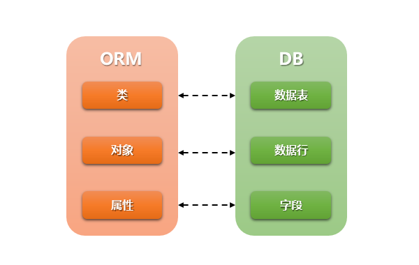

本篇介绍django的安装与简单使用。 

<!--more-->

------------------


>  通过这篇文章，你能了解到：   
>
> - django的安装与常用命令
> - 使用django做一个登录小栗子


# django的安装与简单使用

## 下载安装

### 命令行

`pip install Django==1.11.23 -i https://pypi.tuna.tsinghua.edu.cn/simple/ ` 


如果同时安装了python2和python3的情况，可以参考如下方法，使用指定版本的python的pip安装 

`python2 -m pip install xxx` 

或者 

`python3 -m pip install xxx`


### pycharm

在`setting`，`Project Interpreter` 中，右侧点`加号`，搜索`django`，勾选`Specify version` 选择`1.11.23`后点击`install`。

换源加快速度：在下面`Manage Repositories`中添加源。

下面有源可以添加上面的源


## 创建项目

### 命令行

一个python环境下：`django-admin startproject 项目名`

多个python环境：`python36 -m django startproject 项目名`

```
我自己的路径
C:\Users\ATLAS\AppData\Local\Programs\Python\Python36\
```

#### 目录结构

创建好项目后，它的目录结构如下

```
mysite/
    manage.py
    mysite/
        __init__.py
        settings.py
        urls.py
        wsgi.py
```

这些目录和文件的用处是：

- 最外层的:file: mysite/ 根目录只是你项目名。
- `manage.py`: 一个让你用各种方式**管理** Django 项目的**命令行工具**。
- 里面一层的 `mysite/` 目录包含你的项目，它是一个纯 Python 包。它的名字就是当你引用它内部任何东西时需要用到的 Python 包名。 (比如 `mysite.urls`).
- `mysite/__init__.py`：一个空文件，告诉 Python 这个目录应该被认为是一个 **Python 包**。
- `mysite/settings.py`：Django 项目的**配置文件**。
- `mysite/urls.py`：Django 项目的 URL 声明，就像你网站的“目录”。
- `mysite/wsgi.py`：作为你的项目的运行在 WSGI 兼容的Web服务器上的入口。

### pycharm

专业版才有这些功能。

`file`  ->  `new project`   ->    `django`    ->  项目路径   解释器选已有的（如果是新的虚拟环境会下载最新的django）


创建好项目后，它的目录结构如下

```
mysite/	
    manage.py
    .idea/
    	# pycharm优化所作的,包含各种配置
    	dataSources.load.xml
    	dataSources.xml
    	mysite.iml
    	misc.xml
    	modules.xml
    	workspace.xml   	
	templates/
		# 存放HTML页面
    mysite/
        __init__.py
        settings.py
        urls.py
        wsgi.py
```


## 启动项目

### 命令行

```
python36 manage.py runserver     # 127.0.0.1:8000
```

```
加上端口号
python36 manage.py runserver 80
访问时就不用加端口号了
```

```
改ip地址
python36 manage.py runserver 0.0.0.0:80
```

```
让人去访问
settings
allowed_hosts = ['*']
```


### pycharm

note: 打开别人的项目`.idea`要干掉，这里包含了别人的配置，会影响。

选择项目（dj图标） 点击 `绿三角`  启动， 不要右键运行文件

绿三角下面   `edit configure` 中 改ip和端口 


## 简单的使用

settings 中 pycharm 在 模板 TEMPLATES 的 DIR 帮我们写一个路径，在tmplates中写html就可以。

- urls.py 中写对应关系（路由）， 写函数

```python
# urls.py

from django.shortcuts import HttpResponse,render

def index(request):
    # 必须得加一个 参数 request，从对象中拿信息
    return HttpResponse('欢迎来到index')
    #  HttpResponse实例化一个对象并返回

def home(request):
    return render(request,'home.html')
	# render函数，返回一个结果。

def login(request):
    return render(request, 'login.html')

urlpatterns = [
    url(r'^admin/', admin.site.urls),
    url(r'^index/', index),
    url(r'^home/', home),
    url(r'^load/', login)
]
```

templates/home.html

```html
<!DOCTYPE html>
<html lang="en">
<head>
    <meta charset="UTF-8">
    <title>Title</title>
</head>
<body>
    <h1 style="color: red">欢迎来到home！</h1>
</body>
</html>
```

templates/load.html

使用了bootstrap中的表单

```html
<!DOCTYPE html>
<html lang="en">
<head>
    <meta charset="UTF-8">
    <title>Title</title>
    <link rel="stylesheet" href="https://cdn.jsdelivr.net/npm/bootstrap@3.3.7/dist/css/bootstrap.min.css" integrity="sha384-BVYiiSIFeK1dGmJRAkycuHAHRg32OmUcww7on3RYdg4Va+PmSTsz/K68vbdEjh4u" crossorigin="anonymous">
</head>
<body>
<div class="row container-fluid">
  <div class="col-md-4 col-md-offset-4 text-center">
      <h2>欢迎登录</h2>
  </div>
</div>


<form class="form-horizontal col-md-4 col-md-offset-4">
<div class="form-group">
<label for="inputEmail3" class="col-sm-2 control-label">Email</label>
<div class="col-sm-10">
  <input type="email" class="form-control" id="inputEmail3" placeholder="Email">
</div>
</div>
<div class="form-group">
<label for="inputPassword3" class="col-sm-2 control-label">Password</label>
<div class="col-sm-10">
  <input type="password" class="form-control" id="inputPassword3" placeholder="Password">
</div>
</div>
<div class="form-group">
<div class="col-sm-offset-2 col-sm-10">
  <div class="checkbox">
    <label>
      <input type="checkbox"> Remember me
    </label>
  </div>
</div>
</div>
<div class="form-group">
<div class="col-sm-offset-2 col-sm-10">
  <button type="submit" class="btn btn-default" id="sub">Sign in</button>
</div>
</div>
</form>
<script>
    var btn = document.getElementById('sub');
    var email = document.getElementById('inputEmail3');
    var pw = document.getElementById('inputPassword3');
    btn.onclick = function(){
        console.log(email.value);
        console.log(pw.value)
    }
</script>
</body>
</html>
```


# 完整的登录实例

## 第一步：完善前面的代码

### 完善HTML

对于上面的代码，涉及form表单，input标签，我们点击提交按钮，这个结果该怎么获得呢？

1. form的属性中 **action** 表示提交的地址，空表示向当前地址提交（和当前地址组成url）；属性`method` 确定请求的方式，对于表单提交我们采用 `post` 方式
2. 怎样获得input标签中输入的邮箱和密码呢？  属性 `name` 与值value 形成一个键值对，存在POST(QueryDict)中。
3. 对于提交按钮，如果是在form表单中，一个button（设不设置type都可以）就可以提交，或者是 将`input`标签的`type`属性设置为 `submit`。

修改结果如下：

- form中，设置 action method
- input中设置 name

```html
<form class="form-signin" action="" method="post"  novalidate>
        <h2 class="form-signin-heading">Please sign in</h2>
        <label for="inputEmail" class="sr-only">Email address</label>
        <input type="email" id="inputEmail" name="username" class="form-control" placeholder="Email address" required autofocus>
        <label for="inputPassword" class="sr-only">Password</label>
        <input type="password" id="inputPassword" name="password" class="form-control" placeholder="Password" required>
        <div class="checkbox">
          <label>
            <input type="checkbox" value="remember-me"> Remember me
          </label>
        </div>
        <button class="btn btn-lg btn-primary btn-block" type="submit">Sign in</button>
</form>
```

note：`form`表单中的`novalidate`是关闭对输入的验证（关闭前端验证）。


### 本地css,js,img等静态文件的配置

​	前面我们使用了一个网络链接，来导入bootstrap，那如果是本地的数据，该怎么存放，放在哪呢？？？从配置静态文件入手。

​	静态文件是指 网站中的 js, css, 图片，视频等文件以及 jQuery插件，对于这些静态文件我们需要将他们放在一个统一的文件夹下面。

例如：

```python
项目名
├── 项目名
├── app01
├── templates
├── static        # 静态文件目录  引用时，以 /static/ 开头
│   ├── css       # 存放css的静态文件
│   ├── imgs      # 存放图片
│   ├── js 		  # 存放js代码，jQuery
│   └── plugins   # 存放bootstrap插件
└── manage.py
```


首先配置 `settings.py` , 找到 `STATIC_URL = '/static/'`  并在下面补充一个`STATICFILES_DIRS = []`。

`/static/`是一个别名，

```python
STATIC_URL = '/static/'  # 别名

# 各个app共用的文件可以放在这
STATICFILES_DIRS = [
    os.path.join(BASE_DIR, 'static')
]


# 我们当然也可以这样去配置，查找的时候按照列表的顺序去查找，找到了就不找后面的了，所以如果出现同名情况，只会用前面找到的
STATICFILES_DIRS = [   #按照列表的顺序进行查找
    os.path.join(BASE_DIR, 'x1'),
    os.path.join(BASE_DIR, 'static'),
    os.path.join(BASE_DIR, 'x2')
]  
```


### 完善函数

① 在开始的时候，我们只是使用render函数，做一个返回。

```python
def login(request):
    return render(request, 'login.html')
```

② 接下来就该拿前端的数据，并进行用户名，密码的校验。

​	首先我们需要做一步分析，在同一个地址`login`下我们需要做两种操作，一个是打开这个页面，一个是提交用户名和密码，从后端我们该如何区分这两个呢？在地址栏输入 `http://127.0.0.1:8000/login`，我们打开了登录页面，这是一个get请求，那么当我们点击提交的时候这是一个post请求，所以可以通过一个条件判断来完成两种操作。如何区分请求呢？可以通过输出`request.method` 这个属性（**字符串类型**）来进行判断。对于get请求，依旧维持原样，打开这个登录页面。

​	然后，对于post请求，我们需要验证用户名和密码，我们该怎样拿到这两条数据呢？ `request.POST`这个属性是一个QueryDict，里面包含了提交的信息，对于QueryDict使用 get方法 `request.POST.get()` 来得到用户名和密码。（QueryDict继承字典，它本身还有getlist方法）

```python
<QueryDict: {'username': ['xiaobai'], 'password': ['123']}>
```

​	由于目前还没有没有提及数据库，我们先把这块写死，后面连接数据库后，从数据库中查询，来验证用户信息。

​	当用户名和密码校验成功后我们该怎么办呢？ 重定向！ 为什么要重定向呢？如果我们不重定向，使用render函数，虽然页面内容会发生改变，但是url是不会变的，重定向就像你在地址栏中重新输入一个url打开一个网页，这样页面内容和url都发生改变，符合对应关系。使用`redirect(to, *args, **kwargs):` 函数就可以完成重定向。

​	note：重定向中字符串前面必须加 `/` ，不加这个就会和当前的路径进行拼接，理解上也是，我们重新从 `/` 根 开始。

```python
def login(request):
    # print(request.method)
    if request.method == 'GET':
        return render(request,'login.html')
    else:
        user = request.POST.get('username')
        pwd = request.POST.get('password')
        if user == 'xiaobai' and pwd == '123':
            return redirect('/home/')    # 前面必须加/  ，不然就会和当前路径进行拼接,我们写的是url
        else:
            return render(request, 'login.html')
```

补充：可能会遇到关于`csrf` 的问题，打开settings配置，将 `MIDDLEWARE` 关于 `csrf` 那条信息注释掉就可以。

```python
MIDDLEWARE = [
    'django.middleware.security.SecurityMiddleware',
    'django.contrib.sessions.middleware.SessionMiddleware',
    'django.middleware.common.CommonMiddleware',
    #'django.middleware.csrf.CsrfViewMiddleware',
    'django.contrib.auth.middleware.AuthenticationMiddleware',
    'django.contrib.messages.middleware.MessageMiddleware',
    'django.middleware.clickjacking.XFrameOptionsMiddleware',
]
```


## 第二部：创建APP

​	反思前面所做的，我们把函数写在了 `urls.py` 内，这个py文件只是用来做对应关系的（哪个url对应哪个函数）。可我们把函数也写在了这里，这样就有些不合适了，所以接下来，我们要把函数放在属于它的地方。

​	APP把我们写的很多很多功能进行分类，规范写法。

### 新建APP，命令行

```python
python36 manage.py startapp app01
```

note：因为我的多`python`共存，我将这个`python`改名为`python36`.


### 注册APP

我们还需要在settings配置中注册APP。如果在创建项目的时候创建APP是不需要在进行注册的，在配置中找到下面，并在底部添加 `'app01.apps.App01Config'`。

```python
INSTALLED_APPS = [
    'django.contrib.admin',
    'django.contrib.auth',
    'django.contrib.contenttypes',
    'django.contrib.sessions',
    'django.contrib.messages',
    'django.contrib.staticfiles',
    'app01.apps.App01Config',       # 推荐。创建项目时一并创建app，pycharm就是这样写的
]
```


### 转移函数

APP创建好后，它的目录如下：

```python
app01
├── migrations         
├── __init__.py
├── admin.py			# django admin 对数据库中表进行操作
├── apps.py				# app的信息
├── models.py    		# 模型  model  orm  跟数据库有关，
├── tests.py
└── views.py 			# 写函数
```

​	明白了目录结构，那我们接下来的事情就是要将函数放入 `views.py` 中。那么在 `urls.py` 只需要做 `from app01 import views` 导入就行，使用时只是 `views.login`  。 在后面我会给出完整的 `views.py` 内容。

​	完成了函数部分，那接下来就该对数据库下手了！😄


## 第三步：使用数据库

前面的验证是写死的，真实的数据是存在数据库中的，那我们就首先来配置数据库，然后在使用数据库。


### 修改数据库操作模块

数据库操作模块是python与MySQL沟通的桥梁。这个版本的django配置的数据库操作模块只支持python2，所以需要进行更换，我选择的是`pymysql`，

在app01这个包下面的 `__init__.py` 中写，`pymysql`模块是需要下载的，如果没有在pycharm的项目解释器（Project Iterpreter）中下载安装。

```python
# 在settings.py同级下的 __init__ 写入如下内容，更换数据库操作模块
import pymysql
pymysql.install_as_MySQLdb()
```


### 创建一个库并添加用户名和密码

cmd中登录 mysql 创建一个数据库

```mysql
create database userinfo;
```

创建好数据库后先暂停，我们需要在python来创建表。


### 添加MySQL数据库

settings中修改 `DATABASES`

连接数据库，需要如下参数：

```python
DATABASES = {
    'default': {
        'ENGINE': 'django.db.backends.mysql',
        'NAME': 'userinfo',         # 数据库名称
        'HOST':'localhost',			# 主机名
        'PORT':'3306',				# 端口
        'USER':'root',				# 登录用户
        'PASSWORD':'xxxx',			# 密码
    }
}
```


### 使用ORM代替SQL语句

由于orm（object relation mapping）我们不再需要手写大部分的SQL语句，利用orm来进行操作。一个类就是一张表，一个对象就是一条记录，一个属性就是记录中的一个字段，这样就解决面向对象与关系数据库存在的互不匹配的现象。




① 在 `app01`下的 `model.py` 中**定义类**，

CharField为字段名  这里为varchar(32)

```python
class User(models.Model):
    username = models.CharField(max_length=32)
    password = models.CharField(max_length=32)
```


② pycharm下的terminal 输入

- `python manage.py makemigrations`  制作迁移文件，它会将变更的内容生成一个新的文件。
- `python manage.py migrate`  执行迁移， 将会和数据库进行同步，增删改


note：如果在输入第一个命令是会出现以下提示：

```python
django.core.exceptions.ImproperlyConfigured: Error loading MySQLdb module: No module named 'MySQLdb'.
Did you install mysqlclient or MySQL-python? 
```

说明没有切换数据库操作模块，在前面有提及。


​	执行上面的两条命令。数据库就多出好多张表，找到我们创建的User，使用Navicat打开这个数据库添加数据，或者使用cmd添加数据，或者是pycharm右侧的database来添加数据。

​	我开始使用的是pycharm来做的，由于pycharm版本是2019，在连接数据库的时候出现一个错误

```
Connection to @localhost failed.
[08001] Could not create connection to database server. Attempted reconnect 3 times. Giving up.
```

解决办法：

​	emmm....我先是使用的Navicat，后来换成了pycharm2018 ，最后看到了解决办法是在pycharm2019连接MySQL的时候需要选择版本。


这样用户名密码有了后，我们回到开始的地方。


③  使用orm方法，来查询数据库，有两种方法，一个是get方法，但这种方法在这里不合适。所以使用filter方法。

- `models.User.objects.get(username=user, password=pwd)`
- ` models.User.objects.filter(username=user, password=pwd)`

```python
def login(request):
    # print(request.method)
    if request.method == 'GET':
        return render(request, 'login.html')
    else:
        user = request.POST.get('username')
        pwd = request.POST.get('password')
        # ret = models.User.objects.get(username=user, password=pwd)
        # get方法如果找到唯一一条记录时，创建一个对象，orm中对象表示一条记录，所以这样对于多条数据，或者查不到的数据是不行
        ret = models.User.objects.filter(username=user, password=pwd)
        # 所以使用filter方法，
        #   当找不到该记录时，返回一个空的对象列表
        #   当找到记录，返回对象列表，如果是多条数据，列表内就放多个对象（一条记录）
        print(ret,type(ret))
        if ret:
            return redirect('/home/')
        else:
            return render(request, 'login.html')
```

​	到此，我们完成了一个登录的实例。


# 完整代码：

## app01文件夹下

### `__init__.py`

```python
# __init__.py
import pymysql
pymysql.install_as_MySQLdb()
```

### `views.py`

```python
# views.py
from django.shortcuts import render,redirect
from app01 import models
# Create your views here.

# def login(request):
#     # print(request.method)
#     if request.method == 'GET':
#         return render(request,'login.html')
#     else:
#         print(request.POST)
#         user = request.POST.get('username')
#         pwd = request.POST.get('password')
#         if user == 'xiaobai' and pwd == '123':
#             return redirect('/home/')    # 前面必须加/  ，不然就会和当前路径进行拼接,我们写的是url
#         else:
#             return render(request, 'login.html')


def login(request):
    # print(request.method)
    if request.method == 'GET':
        return render(request, 'login.html')
    else:
        print(request.POST)
        user = request.POST.get('username')
        pwd = request.POST.get('password')
        # ret = models.User.objects.get(username=user, password=pwd)
        # get方法如果找到唯一一条记录时，创建一个对象，orm中对象表示一条记录，所以这样对于多条数据，或者查不到的数据是不行
        ret = models.User.objects.filter(username=user, password=pwd)
        # 所以使用filter方法，
        #   当找不到该记录时，返回一个空的对象列表
        #   当找到记录，返回对象列表，如果是多条数据，列表内就放多个对象（一条记录）
        print(ret,type(ret))
        if ret:
            return redirect('/home/')
        else:
            return render(request, 'login.html')


def home(request):
    return render(request,'home.html')
```


## 根目录下的该项目名下

### settings.py

```python
"""
Django settings for Mylogin project.

Generated by 'django-admin startproject' using Django 1.11.23.

For more information on this file, see
https://docs.djangoproject.com/en/1.11/topics/settings/

For the full list of settings and their values, see
https://docs.djangoproject.com/en/1.11/ref/settings/
"""

import os

# Build paths inside the project like this: os.path.join(BASE_DIR, ...)
BASE_DIR = os.path.dirname(os.path.dirname(os.path.abspath(__file__)))


# Quick-start development settings - unsuitable for production
# See https://docs.djangoproject.com/en/1.11/howto/deployment/checklist/

# SECURITY WARNING: keep the secret key used in production secret!
SECRET_KEY = 'of9#^dq@yw+k6hnbh_vnnz_k%1!(!yg049^gfu2nb!cmhj-%u$'

# SECURITY WARNING: don't run with debug turned on in production!
DEBUG = True

ALLOWED_HOSTS = []


# Application definition

INSTALLED_APPS = [
    'django.contrib.admin',
    'django.contrib.auth',
    'django.contrib.contenttypes',
    'django.contrib.sessions',
    'django.contrib.messages',
    'django.contrib.staticfiles',
    'app01.apps.App01Config'
]

MIDDLEWARE = [
    'django.middleware.security.SecurityMiddleware',
    'django.contrib.sessions.middleware.SessionMiddleware',
    'django.middleware.common.CommonMiddleware',
    #'django.middleware.csrf.CsrfViewMiddleware',
    'django.contrib.auth.middleware.AuthenticationMiddleware',
    'django.contrib.messages.middleware.MessageMiddleware',
    'django.middleware.clickjacking.XFrameOptionsMiddleware',
]

ROOT_URLCONF = 'Mylogin.urls'

TEMPLATES = [
    {
        'BACKEND': 'django.template.backends.django.DjangoTemplates',
        'DIRS': [os.path.join(BASE_DIR, 'templates')]
        ,
        'APP_DIRS': True,
        'OPTIONS': {
            'context_processors': [
                'django.template.context_processors.debug',
                'django.template.context_processors.request',
                'django.contrib.auth.context_processors.auth',
                'django.contrib.messages.context_processors.messages',
            ],
        },
    },
]

WSGI_APPLICATION = 'Mylogin.wsgi.application'


# Database
# https://docs.djangoproject.com/en/1.11/ref/settings/#databases

DATABASES = {
    'default': {
        'ENGINE': 'django.db.backends.mysql',
        'NAME': 'Mylogin',
        'HOST':'localhost',
        'PORT':'3306',
        'USER':'root',
        'PASSWORD':'2296',
    }
}


# Password validation
# https://docs.djangoproject.com/en/1.11/ref/settings/#auth-password-validators

AUTH_PASSWORD_VALIDATORS = [
    {
        'NAME': 'django.contrib.auth.password_validation.UserAttributeSimilarityValidator',
    },
    {
        'NAME': 'django.contrib.auth.password_validation.MinimumLengthValidator',
    },
    {
        'NAME': 'django.contrib.auth.password_validation.CommonPasswordValidator',
    },
    {
        'NAME': 'django.contrib.auth.password_validation.NumericPasswordValidator',
    },
]


# Internationalization
# https://docs.djangoproject.com/en/1.11/topics/i18n/

LANGUAGE_CODE = 'en-us'

TIME_ZONE = 'UTC'

USE_I18N = True

USE_L10N = True

USE_TZ = True


# Static files (CSS, JavaScript, Images)
# https://docs.djangoproject.com/en/1.11/howto/static-files/

STATIC_URL = '/static/'
STATICFILES_DIRS = [
    os.path.join(BASE_DIR,'static')
]

```

### `urls.py`

```python
"""day54作业 URL Configuration

The `urlpatterns` list routes URLs to views. For more information please see:
    https://docs.djangoproject.com/en/1.11/topics/http/urls/
Examples:
Function views
    1. Add an import:  from my_app import views
    2. Add a URL to urlpatterns:  url(r'^$', views.home, name='home')
Class-based views
    1. Add an import:  from other_app.views import Home
    2. Add a URL to urlpatterns:  url(r'^$', Home.as_view(), name='home')
Including another URLconf
    1. Import the include() function: from django.conf.urls import url, include
    2. Add a URL to urlpatterns:  url(r'^blog/', include('blog.urls'))
"""
from django.conf.urls import url
from django.contrib import admin
from app01 import views

urlpatterns = [
    url(r'^admin/', admin.site.urls),
    url(r'^login/', views.login),
    url(r'^home/', views.home),
]
```


登录页面来自[bootstrap](https://v3.bootcss.com/examples/signin/)，大家直接扒就可以。


## 小结

django常用命令：

1. 下载

   pip install django==1.11.23 -i  镜像

2. 创建项目

   django-admin startproject 项目名

3. 启动项目

   cd 到项目的根目录

   python manage.py runserver    

   python manage.py runserver  80

   python manage.py runserver   0.0.0.0:80

4. 创建app

   python manage.py startapp app名

   注册app

5. 数据库迁移

   python manage.py makemigrations  将测已经注册app下的models

   python manage.py migrate  迁移，将models的变更记录同步到数据库

