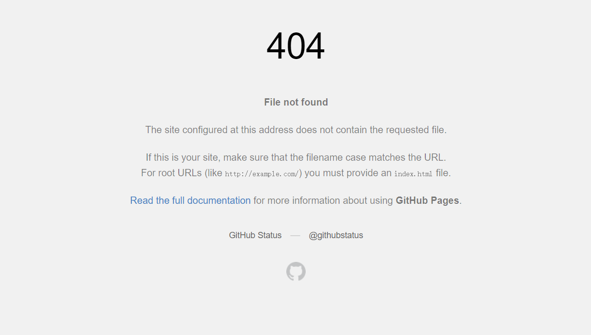
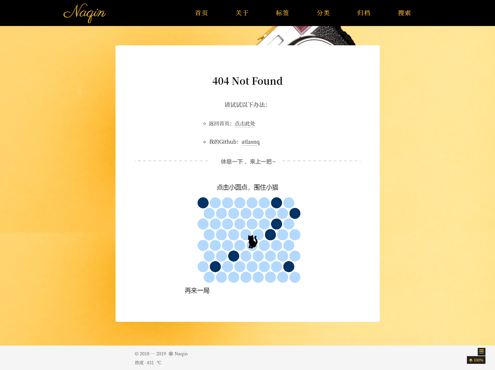

在GitHub page中定义自己的404页面！ 

<!--more-->

通过这篇文章，你能了解到：

- 如何自定义404页面
- 给404页面加入游戏的简单方式


## 自定义404页面

404页面是对非法请求的一个回应，在没有定义之前，显示如下：



容我先展示一下结果！ [404页面](chennq.com/404) 




接下来让我们开始：

1. 在博客根下的 `source` 目录中创建404.html
2. 打开html，写入想要展示的html代码，我们的html可以带着框架，也可以是完全独立的一个。

3. 不需要next主题进行渲染时：

```
---
layout: false			# 不需要渲染
comments: false			# 评论也需要关闭了
permalink: /404.html	# 设置固定链接
---
```

以下是我的404.html代码

[404页面](chennq.com/404)

```html
---
comments: false
permalink: /404.html
---
<!DOCTYPE html>
<html>
<head>
    <meta charset="UTF-8">
    <style>
        #game {
            width: 100%;
            margin-top: 32px;
            text-align: center;
        }

        #msg {
            width: 100%;
            text-align: center;
            font-size: 70px;
            font-family: PingFang SC, Helvetica Neue, Hiragino Sans GB, Segoe UI, Microsoft YaHei, sans-serif;
            font-weight: bold;
            color: #4f565f;
        }

        .have_rest {
            height: 41px;
            background: url("/images/have_rest.png") center no-repeat rgba(255, 255, 255, .8);
        }

        .main-inner {
            margin-top: 60px;
            padding: 60px 60px 60px 60px;
            background: rgba(255, 255, 255, 1) !important;
            min-height: 500px;
            border-radius: 5px;
        }
        
		@media screen and (max-width: 768px) {
			canvas{
            margin-left: -94px;
			}
		}
    </style>
    <script src="/js/src/catch-cat/catch-the-cat.min.js"></script>
</head
<body>

<p style="text-align: center;font-size: 30px; font-weight: bold">404 Not Found</p>
<div style="width: 320px;margin: 0 auto">
    <p style="text-align: center;font-size: large">请试试以下办法：</p>
    <ul>
        <li><p style="font-size: medium">返回首页：<a href="https://chennq.com">点击此处</a></p></li>
        <li><p style="font-size: medium">我的Github：<a href="https://github.com/atlasnq">atlasnq</a></p></li>
    </ul>
</div>

<div class="have_rest"></div>

<div class="error-split" id="up">
</div>

<script src="/js/src/catch-cat/phaser.min.js"></script>
<script src="/js/src/catch-cat/catch-the-cat.min.js"></script>
<div id="game">

</div>
<script>window.game = new CatchTheCatGame({
    w: 8,
    h: 8,
    r: 19,
    backgroundColor: 16777215,
    parent: "game",
    statusBarAlign: "center",
    credit: ""
})</script>
</body>
</html>
```

这里，我将 [phaser.min.js](https://chennq.com/js/src/catch-cat/phaser.min.js) 和 [catch-the-cat.min.js](https://chennq.com/js/src/catch-cat/catch-the-cat.min.js)上传到了自己的服务器，防止链接挂掉。如果想自定义的话，只需要将这两个js下载，然后模仿上文进行修改即可！


参考：[吾爱破解](https://www.jianshu.com/p/1b819734538f)、[自定义404抓猫游戏界面](https://www.kimiye.xyz/2019/08/17/hexo3/)


## 算法解析

边配置边玩😄，对猫的路径搜索特别好奇，探索探索补充它的原理~

待补充！！！