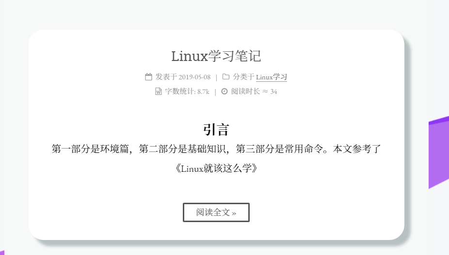

不想局限于博客园的单页面，直到发现了Hexo，在Hexo的基础上使用了Next主题，再加上些修改。 

<!-- more -->


### Hexo常用命令

1. `hexo clean`
2. `hexo g`  (Generate static files)
3. `hexo s`  (Run server)
4. `hexo d`  (Deploy to remote sites)
5. `hexo new page xxx`
6. `hexo new [layout] <title>`  (Create a new post)


### 首页文章框产生阴影

1. 在custom下改：

   ```
   //首页文章阴影样式
   .post {
       margin-top: 0px;
       margin-bottom: 25px;
       padding: 30px;
       -webkit-box-shadow: 0 0 5px rgba(202, 203, 203, .5);
       -moz-box-shadow: 0 0 5px #222
       border-radius:25px;  /* 矩形有圆角 */
   }
   ```

2. 改成圆角矩形后效果如下

​	


### 去掉首页中文章块下面的下划线

1. 原本是：

   ```
   .posts-expand .post-eof {
       display: block;
       margin: 15px auto px;
       width: 8%;
       height: 1;
       background: #ccc;
       text-align: center;
   }
   ```

2. 改为：

   ```
   .posts-expand .post-eof {
       display: none;    
   }
   ```

   


### 添加可爱的小姐姐（live2d插件）

1. [图片预览](https://huaji8.top/post/live2d-plugin-2.0/)

2. [官方写的很详细，直接一步一步走就好](https://github.com/EYHN/hexo-helper-live2d/blob/master/README.zh-CN.md)

3. 效果如下

   

### 添加图片，并控制大小。

1. 出现的问题：标准的markdown是在图片后面加上" =200x300"就可以定义图片大小，但此版本的hexo不行。

   ```
   
   ```

2. 解决办法：

   1. 使用img标签，设置图片大小

      ```
      
      ```

   2. 使用div标签

      ```
      <div align=center> 
      	
      </div>
      这里的width=200 控制宽度，效果如下
      ```

3. 效果如下：

<div align=center>
    
</div>


### hexo的常用操作


### Next主题下主页添加边框阴影效果

打开 `themes/下的 source/css/_custom/custom.styl`,向里面添加代码：

```
//首页文章阴影样式
.post {
    margin-top: 60px;
    margin-bottom: 60px;
    padding: 25px;
    -webkit-box-shadow: 0 0 10px rgba(202, 203, 203, .5);
    -moz-box-shadow: 0 0 10px rgba(202, 203, 204, .5);
}
```


### 右上角或左上角实现fork me on GitHub

1. 选择样式 [Github Corners](http://tholman.com/github-corners/) 还可以选择 [GitHub Ribbons](https://github.blog/2008-12-19-github-ribbons/)

2. 复制链接后修改 `https://github.com/you`为自己的GitHub链接。

3. 打开 `themes/next/layout/_layout.swig`，把代码复制到 `<div class="headband"></div>`下面，当然我们还需要在img标签内加入位置属性，可以参考以下设置。

   ```
   <a href="https://github.com/atlasnq"></a>
   ```

   


#### 换超级漂亮的字体

使用这位老哥的教程<https://io-oi.me/tech/noto-serif-sc-added-on-google-fonts.html>

就不copy了，给大家展示一下效果，喜欢的可以详看这里的教程。


#### 添加阅读时长和字数统计

1. 修改主题配置文件 `__config`

   ```
   # Post wordcount display settings
   # Dependencies: https://github.com/willin/hexo-wordcount
   post_wordcount:
     item_text: true
     wordcount: true         # 单篇 字数统计
     min2read: true          # 单篇 阅读时长
     totalcount: false       # 网站 字数统计
     separated_meta: true
   ```

2. 安装 hexo-wordcount插件

   ```
   npm i --save hexo-wordcount
   ```

3. 显示文字

   打开 post.swig 文件，路径如下：`xxx_blog/themes/next/layout/_macro/post.swig`

   在block content 内添加

   ```
   <span title="{{ __('post.wordcount') }}">
       {{ wordcount(post.content) }} 字
   </span>
   <span title="{{ __('post.min2read') }}">
       {{ min2read(post.content) }} 分钟
   </span>
   ```

   修改完成后，重启预览就可以了。


## Tag Cloud

[**hexo-tag-cloud**](https://github.com/MikeCoder/hexo-tag-cloud/blob/master/README.ZH.md)

设置过程直接开文档就可以!


补充：在我设置颜色的时候并没有起作用，然后我发现改为 `textColour` 和 `outlineColour` 就可以了，如果遇到问题的小伙伴可以试一试！


TagCanvas 是一个基于HTML5Canvas技术开发的标签云动画。

参数说明:

| **选项**         | **默认**                                       | **说明**                                                     |
| ---------------- | ---------------------------------------------- | ------------------------------------------------------------ |
| interval         | 20                                             | 动画帧之间的间隔，以毫秒为单位                               |
| maxSpeed         | 0.05                                           | 最大旋转速度                                                 |
| minSpeed         | 0.0                                            | 鼠标离开画布时的最小旋转速度                                 |
| decel            | 0.95                                           | 鼠标离开画布时的减速率                                       |
| minBrightness    | 0.1                                            | 最远点的标签亮度（0.0-1.0）                                  |
| textColour       | "#ff99ff"                                      | 标记文本的颜色                                               |
| textHeight       | 15                                             | 标记文本字体的高度（以像素为单位）                           |
| textFont         | "Helvetica, Arial, sans-serif"                 | 标签文本的字体系列                                           |
| outlineColour    | "#ffff99"                                      | 活动标签周围的框的颜色                                       |
| outlineThickness | 2                                              | 轮廓的粗细（以像素为单位）                                   |
| outlineOffset    | 5                                              | 轮廓与文本的距离，以像素为单位                               |
| pulsateTo        | 1.0                                            | "脉动轮廓不透明度(0.0 - 1.0)                                 |
| pulsateTime      | 3                                              | 脉搏率，以每秒的秒数为单位                                   |
| depth            | 0.5                                            | 控制透视（0.0-1.0）                                          |
| initial          | null                                           | 初始旋转，水平和垂直为数组，例如[0.8，-0.3。值乘以maxSpeed。 |
| freezeActive     | FALSE                                          | 设置为true以在突出显示标记时暂停移动。                       |
| frontSelect      | FALSE                                          | 设置为true以防止在云后面选择标记。                           |
| txtOpt           | TRUE                                           | 文本优化，将文本标签转换为图像以获得更好的性能。             |
| txtScale         | 2                                              | 在txtOpt模式下转换为图像时文本的缩放系数。                   |
| reverse          | FALSE                                          | 设置为true以反转相对于鼠标位置的移动方向。                   |
| hideTags         | FALSE                                          | 如果TagCanvas成功启动，则设置为true以自动隐藏标记列表元素。  |
| zoom             | 1                                              | 调整画布中标签云的相对大小。较大的值将放大到云，较小的值将缩小。 |
| wheelZoom        | TRUE                                           | 使用鼠标滚轮或滚动手势可以放大和缩小云。                     |
| zoomStep         | 0.05                                           | 每次移动鼠标滚轮时缩放变焦量。                               |
| zoomMax          | 3                                              | 最大缩放值。                                                 |
| zoomMin          | 0.3                                            | 最小缩放值。                                                 |
| shadow           | "#000000"                                      | 每个标签后面阴影的颜色。                                     |
| shadowBlur       | 0                                              | 标记阴影模糊量，以像素为单位。                               |
| shadowOffset     | [0,0]                                          | 标记阴影的X和Y偏移量，以像素为单位。                         |
| weight           | FALSE                                          | 设置为true以打开标签的权重。                                 |
| weightMode       | "size"                                         | 用于显示标记权重的方法。应该是尺寸，颜色或两者之一。         |
| weightSize       | 1                                              | 用于在使用大小或两者的重量模式时调整标签大小的乘数。         |
| weightGradient   | {0:'#f00', 0.33:'#ff0', 0.66:'#0f0', 1:'#00f'} | 使用颜色权重模式或两者时，用于着色标签的颜色渐变。           |
| weightFrom       | null                                           | 用于获取标记权重的link属性。默认值为null表示权重取自计算出的链接字体大小。 |
| shape            | "sphere"                                       | 目前支持的是Sphere,hcylinder 或vcylinder 三种形状显示        |
| lock             | null                                           | 值“x”限制云的旋转到（水平）x轴，值“y”限制旋转到（垂直）y轴。 （这些是字符串，因此需要引号） |

推荐阅读：[TagCanvas - HTML5 Canvas技术开发的标签云动画]([http://www.023xs.cn/Article/ZdPZna/TagCanvas-HTML5Canvas%E6%8A%80%E6%9C%AF%E5%BC%80%E5%8F%91%E7%9A%84%E6%A0%87%E7%AD%BE%E4%BA%91%E5%8A%A8%E7%94%BB](http://www.023xs.cn/Article/ZdPZna/TagCanvas-HTML5Canvas技术开发的标签云动画))


# 上传本地字体

- 为了使用漂亮的字体，先开始把`external-fonts.swig`这个文件的全部内容直接替换为 Google Fonts 网站生成的`<link>`代码，然后可以将`googleapis.com`修改为`loli.net`，来优化速度。
- 尝试一下上传本地字体。

### 下载字体

[Google Fonts](https://fonts.google.com/) 中选好自己喜欢的自己并下载，下载完成后解压到

`\themes\next\source\fonts`，然后在我们的 `custom.style` 中导入即可。


### 设置css

路径为：`source/css/_custom/custom.styl`

```js
// Font settings.

@font-face {
	font-family: 'Parisienne';
	src: local("Parisienne Regular"),local("Parisienne-Regular"),url("/fonts/Parisienne-Regular.ttf");
}
@font-face {
	font-family: 'PinyonScript';
	src: local("PinyonScript Regular"),local("PinyonScript-Regular"),url("/fonts/PinyonScript-Regular.ttf");
}
@font-face {
	font-family: "Noto Serif SC";
	src: local('NotoSerifSC Regular'), local('NotoSerifSC-Regular'), url("/fonts/NotoSerifSC-Regular.otf");
}
@font-face {
	font-family: "Noto Serif SC";
	font-weight: bold;
	src: local('NotoSerifSC Bold'), local('NotoSerifSC-Bold'), url("/fonts/NotoSerifSC-Bold.otf");
}
```

对于字体在css中的设置不太清楚的看官可以移动这篇  [推荐阅读](https://blog.gtwang.org/web-development/css-font-face/)。


修改主题下的 ``__config.yml``

```yml
font:
  enable: false
  host: 
  global:
    external: false
    #family: EB Garamond,Noto Serif SC
    family: 
    size:
    
  headings:
    external: false
    #family: Roboto Slab
    family: 
    size: 

  # Font settings for posts.
  # Fallback to `global` font settings.
  posts:
    external: false
    family:  

  # Font settings for Logo.
  # Fallback to `global` font settings.
  logo:
    external: false
    family: 
    size: 24

  # Font settings for <code> and code blocks.
  codes:
    external: true
    family: Roboto Mono
    size:
```

ps：如果出现问题，试着把上面 font 下的 enable 改为true。


### Preload

​	前面上传了本地字体，emmm，由于加了太多类型，导致加载增多，速度反倒更慢了，不过也学习到一个新的东西 preload，它能够增加内容的优先级，预先加载一些内容。

​	先看结果：

```
 <link rel="preload" href="/lib/font-awesome/fonts/fontawesome-webfont.woff2?v=4.7.0" as="font" type="font/woff2"  crossorigin>
 <link rel="preload" href="/fonts/NotoSerifSC-Regular.otf" as="font" type="font/otf" crossorigin>
 <link rel="preload" href="/fonts/Parisienne-Regular.ttf" as="font" type="font/ttf" crossorigin>
 <link rel="preload" href="/fonts/PinyonScript-Regular.ttf" as="font" type="font/ttf" crossorigin>
 <link rel="preload" href="/fonts/EBGaramond-Regular.ttf" as="font" type="font/ttf" crossorigin>

 <link rel="preload" href="https://source.unsplash.com/random/1600x900" as="image" crossorigin>
```


- preload可以预先加载字体，图片，js文件，css样式表等等。

- 通常我们可以写在`link`标签中，设置 `rel="preload"`，写 `href=" "` as属性， 如果出现重复引入可以设置crossorigin来进行合并。
- 下面对这些属性一一道来


#### preload提升了资源加载的优先级

- 使用 preload 前，遇到资源依赖时才进行加载
- 使用 preload 后，不管资源是否使用都将提前加载
- 但我们不能滥用preload，造成资源浪费。


#### preload与prefetch

先做一个区分：

- preload是告诉浏览器一定要加载什么资源
- prefetch是告诉浏览器可能需要什么资源


#### as属性

- `audio`: 音频文件。
- `document`: 一个将要被嵌入到[``](https://developer.mozilla.org/zh-CN/docs/Web/HTML/Element/frame)或[``](https://developer.mozilla.org/zh-CN/docs/Web/HTML/Element/iframe)内部的HTML文档。
- `embed`: 一个将要被嵌入到[``](https://developer.mozilla.org/zh-CN/docs/Web/HTML/Element/embed)元素内部的资源。
- `fetch`: 那些将要通过fetch和XHR请求来获取的资源，比如一个ArrayBuffer或JSON文件。
- `font`: 字体文件。
- `image`: 图片文件。
- `object`: 一个将会被嵌入到[``](https://developer.mozilla.org/zh-CN/docs/Web/HTML/Element/embed)元素内的文件。
- `script`: JavaScript文件。
- `style`: 样式表。
- `track`: WebVTT文件。
- `worker`: 一个JavaScript的web worker或shared worker。
- `video`: 视频文件。

#### crossorigin跨域获取

在没有设置这个属性之前，我们发现，我预先加载没用啊，资源加载了两遍，反倒有些浪费了，我们需要将它们合并的一个东西，所以 `crossorigin` 来了，在W3 规范是这么解释的：

> Preload links for CORS enabled resources, such as fonts or images with a crossorigin attribute, must also include a crossorigin attribute, in order for the resource to be properly used.

所以设置这个属性后，就可以合二为一了，我们只去请求了一次。

推荐阅读[用 preload 预加载页面资源](https://zhuanlan.zhihu.com/p/33759023)。


ps：其实这块，算是瞎折腾了，这样的本地字体，浏览器需要下载额外的，还是用现成的CDN好。

-----


