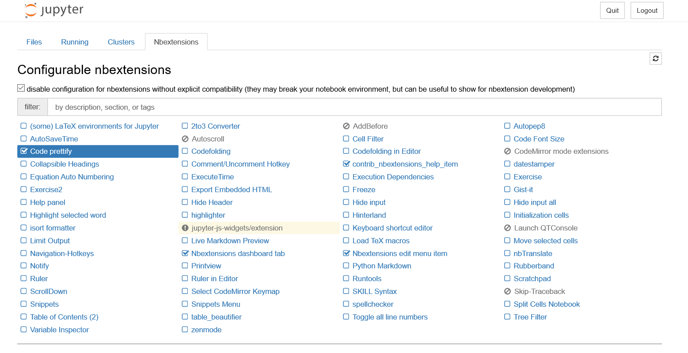

本篇介绍Jupyter Notebook的概念以及常用快捷方式。 

<!--more-->

# 概述

> Jupyter Notebook也称为 Ipython notebook是一种Web应用程序，您可以在其中创建和共享包含实时**代码**，**方程式**，**可视化效果**以及**文本**的文档，Jupyter Notebook是帮助您获得所需的数据科学技能的理想工具之一。

特色在于cell：

cell的先后顺序不区分，区分cell执行顺序：

- 理解上：这一个ipy文件在内存中对应的一块缓存，当cell执行后，其它cell都可以访问。


推荐阅读 [关于Jupyter Notebook的28个技巧](https://cloud.tencent.com/developer/article/1031448)


# 快捷键——更具生产力！

## 两种模式

### 键盘输入模式

Jupyter Notebooks 提供了两种不同的键盘输入模式——命令和编辑：

- 命令模式是将键盘和笔记本层面的命令绑定起来，并且由带有蓝色左边距的灰色单元边框表示。
- 编辑模式让你可以在活动单元中输入文本（或代码），用绿色单元边框表示。

```
使用 Esc 和 Enter 在命令模式和编辑模式之间跳跃。
```

### cell的两种模式

code模式 与 markdown 模式


## 命令行模式(按 Esc 生效)编辑快捷键

1. 运行选中的cell：

   ```
   Ctrl+Enter 
   ```

2. 运行代码块并选择下面的代码块

   ```
   Shift+Enter
   ```

3. 运行cell并在下面添加一个新单元：

   ```
   Alt + Enter 
   ```

4. 插入cell：	

   ```
   a 会在活跃单元之上插入一个新的单元，b 会在活跃单元之下插入一个新单元。
   ```

5. 删除cell：

   ```
   x 会删除该cell， 连续按两次d，也会删除该cell
   ```

6. 撤销被删除的cell：

   ```
   z 会撤销删除的cell
   ```

7. 将 cell 变成 markdown 模式：

   ```
   m 会将该cell变成markdown模式
   ```

8. 将 cell 变成 code 模式：

   ```
   y 会将该cell变成code模式
   ```

9. 选择多个cell并进行合并：

   ```
   Shift + 上或下箭头可选择多个单元。在多选模式时，按住 Shift + M 可合并你的选择。
   ```

10. 查找和替换：

    ```
    f 会弹出「查找和替换」菜单。
    ```

11. 查看所有快捷键：

    ```
    h 会弹出所有快捷键
    ```

完整如下:


当然了，点击编辑快捷键，我们可以自定义快捷键。

## 编辑模式下的快捷键

1. 到达单元起始位置/结尾：

   ```
   Ctrl + Home
   Ctrl + End
   ```

2. 打开帮助文档：

   ```
   Shift + Tab
   ```

3. 跳到单词右边：

   ```
   Ctrl + 右
   ```

4. 打开命令面板：

   ```
   Ctrl + Shift + F 
   ```

完整如下:


# 安装扩展

在使用中还是感觉有些缺乏，就比如说格式化代码，高亮代码等等。对于这些情况，我们需要添加扩展。扩展/附加组件是一种非常有生产力的方式，能帮你提升在 Jupyter Notebooks 上的生产力。这里安装的是 Nbextensions。


第一步：从 pip 安装它：

如果是多版本或环境较多不容易确定的时候，可以打开anaconda，在Environments中选择环境并点击绿三角选择 Open Terminal

```
pip install jupyter_contrib_nbextensions
```

第二步：安装相关的 JavaScript 和 CSS 文件：

```
jupyter contrib nbextension install –user
```

完成这个工作之后，你会在你的 Jupyter Notebook 主页顶部看见一个 Nbextensions 选项卡。点击一下，你就能看到很多可在你的项目中使用的扩展。

note：如果不成功，第二部改为：

```
jupyter contrib nbextension install --user --skip-running-check
```

第三步：安装完成后，重新启动jupyter notebook，“Nbextensions”出现在导航栏中。 



要启用某个扩展，只需勾选它即可。

