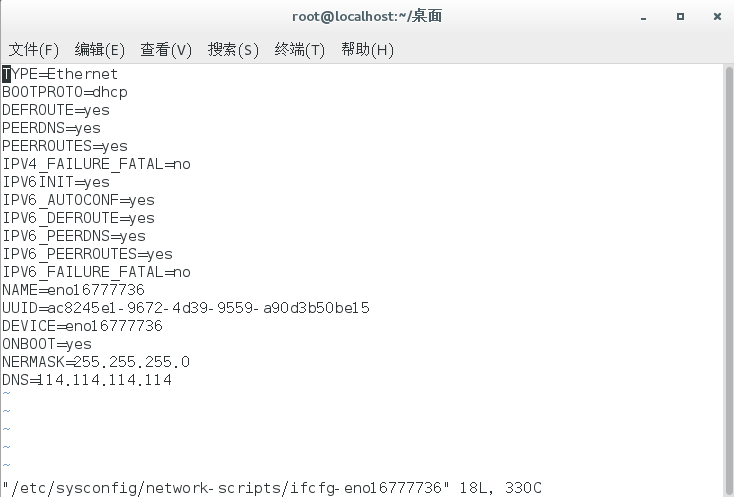
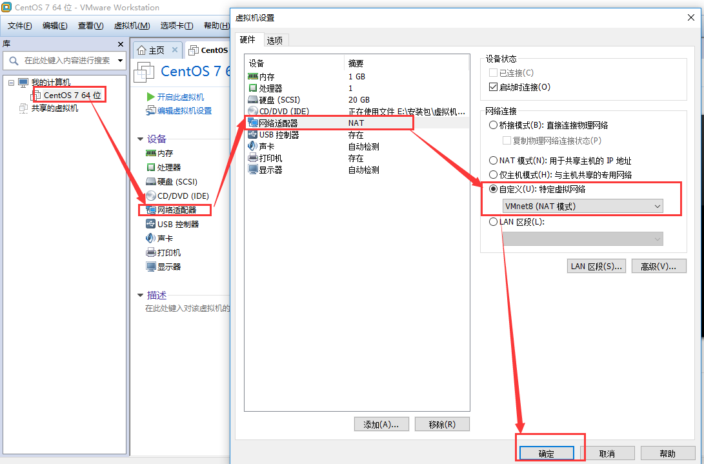
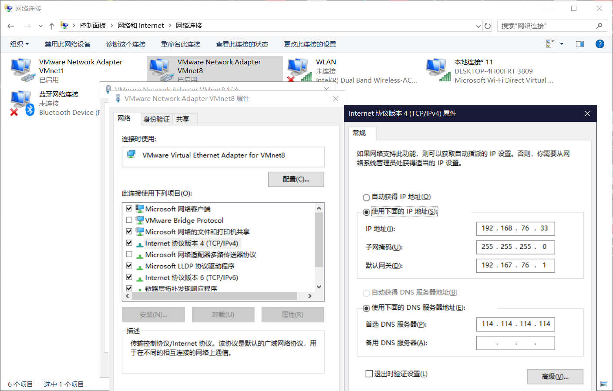
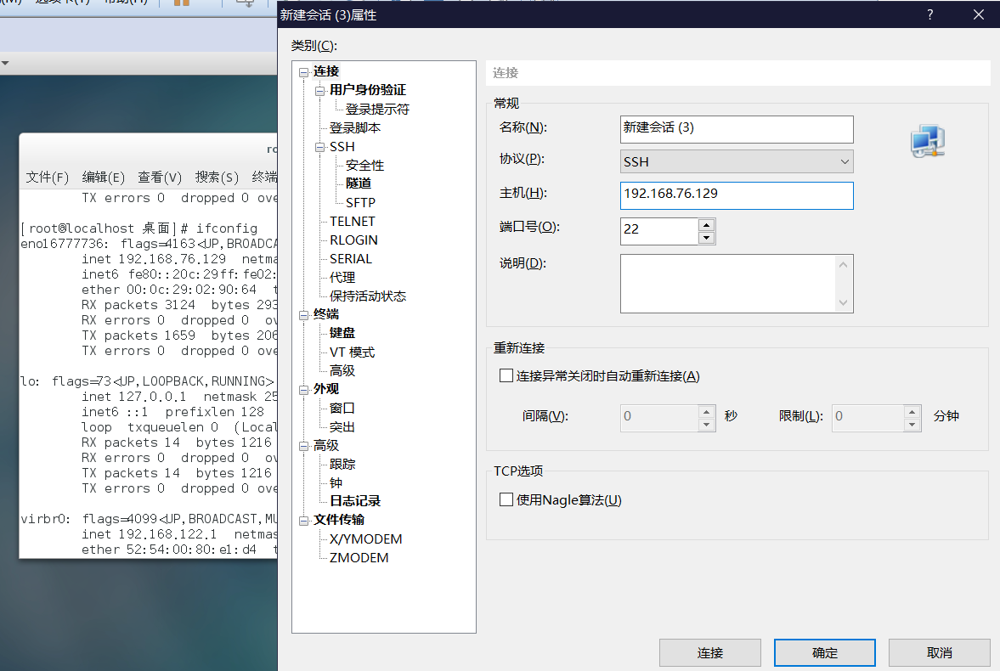
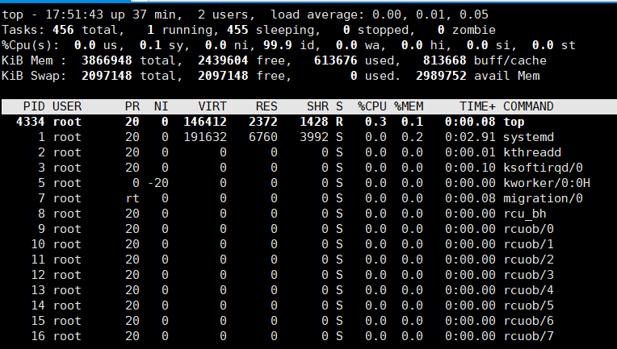
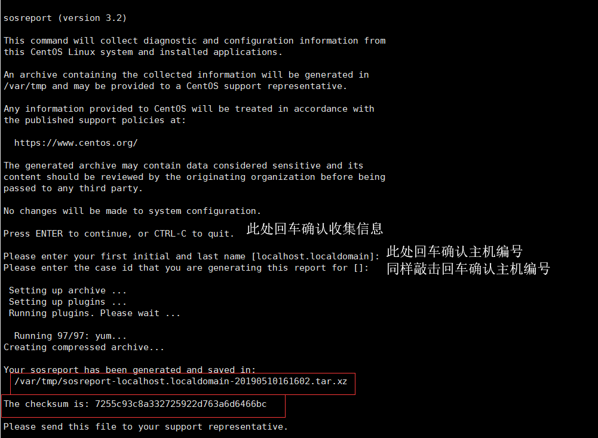

第一部分是环境篇，第二部分是基础知识，第三部分是常用命令。本文参考了《Linux就该这么学》 

<!-- more -->

## 环境篇

用xshell连接VMware中的centos7

方式一：设置动态ip：

①输入：`vi /etc/sysconfig/network-scripts/ifcfg-eno16777736` 打开配置文件eno16777736。



②**设置静态ip**

要想连接上xshell，需要配置IP，将Linux中的IP和虚拟机上的IP在<u>同一个网段中</u>。

- 设置linux系统的网络配置类型



- **配置虚拟机的IP**



④使用shell连接




## 基础知识

### RPM（红帽软件包管理器） 

RPM 有点像 Windows 系统中的控制面板，会建立统一的数据库文件，详细记录软件信息并能够自动分析依赖关系。RPM已经被 CentOS、Fedora、openSUSE等众多 Linux系统采用，它真的很好用！ 


### Yum 软件仓库 

尽管 RPM 能够帮助用户查询软件相关的依赖关系，但问题还是要运维人员自己来解决，Yum 软件仓库便是为了进一步降低软件安装难度和复杂度而设计的技术。Yum 软件仓库可以根据用户的要求分析出所需软件包及其相关的依赖关系，然后自动从服务器下载软件包并安装到系统。

RPM是为了简化安装的复杂度，而Yum软件仓库是为了解决软件包之间的依赖关系。 

配置yum源： 待补充！！！


### systemd 初始化进程

Linux 操作系统的开机过程：即从 BIOS 开始，然后进入 Boot Loader，再加载系统内核，然后内核进行初始化，最后启动初始化进程。初始化进程作为 Linux 系统的第一个进程，它需要完成 Linux 系统中相关的初始化工作，为用户提供合适的工作环境。 


### Shell

计算机硬件是由运算器、控制器、存储器、输入/输出设备等共同组成的，而让各种硬件设备各司其职且又能协同运行的东西就是系统内核。Linux 系统的内核负责完成对硬件资源的分配、调度等管理任务。由此可见，系统内核对计算机的正常运行来讲是太重要 了，因此一般不建议直接去编辑内核中的参数，而是让<u>用户通过基于系统调用接口开发出的程序或服务来管理计算机</u>，以满足日常工作的需要。


Shell 就是这样的一个命令行工具。Shell（也称为**终端**或**壳**）充当的是人与内核（硬件） 之间的翻译官，用户把一些命令“告诉”终端，它就会调用相应的程序服务去完成某些工作。 现在包括红帽系统在内的许多主流 Linux 系统<u>默认使用的终端是 Bash</u>（Bourne-Again SHell）解释器。它的优点是：

1. 通过上下方向键来调取过往执行过的 Linux 命令； 
2. 命令或参数仅需输入前几位就可以用 Tab 键补全； 
3. 具有强大的批处理脚本； 
4. 具有实用的环境变量功能。 


## 常用Linux命令

它们与系统工作、系统状态、 工作目录、文件、目录、打包压缩与搜索等主题相关。

### Linux命令格式

> 命令名称 [命令参数] [命令对象]  
>
> 之间由空格分隔

| 命令参数 |    写法    |
| :------: | :--------: |
|  长格式  | man --help |
|  短格式  |   man -h   |

注意：长格式和长格式之间不能合并，长格式和短格式之间也不能合并，但短格式和短格式之间是可以合并的，合并后仅保留一个-（减号）即可。

### man

man命令中常用按键以及用途

|   按键    |                用途                |
| :-------: | :--------------------------------: |
|  空格键   |             向下翻一页             |
| PaGe down |             向下翻一页             |
|  PaGe up  |             向上翻一页             |
|   home    |            直接前往首页            |
|    end    |            直接前往尾页            |
|     /     | 从上至下搜索某个关键词，如“/linux” |
|     ?     | 从下至上搜索某个关键词，如“?linux” |
|     n     |     定位到下一个搜索到的关键词     |
|     N     |     定位到上一个搜索到的关键词     |
|     q     |            退出帮助文档            |


### 常用系统工作命令

(echo、date、reboot、poweroff、wget、ps、top、pidof、kill、killall)

#### echo命令

- echo 命令用于在终端输出字符串或变量提取后的值

`echo [字符串 | $变量]`

ex:

> 把指定字符串“hello”输出到终端屏幕的命令为： 
>
> [root@localhost ~]# echo hello
> hello

> 使用$变量的方式提取变量 SHELL 的值，并将其输出到屏幕上： 
>
> [root@localhost ~]# echo $SHELL
> /bin/bash


#### alias命令

- 直接输入，查看当前机器的别名 

`alias`  

例子：配置别名，让用户使用rm的时候，提示"你这个ben蛋，求你别用rm了"

`alias rm="echo 你这个ben蛋，求你别用rm了"`

- 改回去

`alias  rm="rm -i"`     

`unalias`   取消别名


#### date命令

- date 命令用于显示及设置系统的时间或日期

`date [选项] [+指定的格式]`

| 参数 |      作用      |
| :--: | :------------: |
|  %t  |  跳格[Tab 键]  |
|  %H  | 小时（00～23） |
|  %I  | 小时（00～12） |
|  %M  | 分钟（00～59） |
|  %S  |  秒（00～59）  |
|  %j  | 今年中的第几天 |


> [root@localhost ~]# date
> 2019年 05月 09日 星期四 17:08:29 CST

> 按照“年-月-日 小时:分钟:秒”的格式查看当前系统时间
>
> [root@localhost ~]# date "+%Y-%m-%d %H:%M:%S" 
> 2019-05-09 17:05:13

> 参数%j 可用来查看今天是当年中的第几天。这个参数能够很好地区分备份时 间的新旧，即数字越大，越靠近当前时间。
>
> [root@localhost ~]# date "+%j"
> 129

同步服务器时间到ntp.aliyun.com
	[root@dudu opt]# ntpdate -u  ntp.aliyun.com


#### reboot命令

- reboot 命令用于重启系统

 `reboot`

由于重启计算机这种操作会涉及硬件资源的管理权限，因此默认**只能使用 root 管理员**来重启，其命令如下： 

> [root@localhost ~]# reboot


#### poweroff命令

- `poweroff` 命令用于关闭系统

 `poweroff`

该命令与 reboot 命令相同，都会涉及硬件资源的管理权限，因此默认**只有 root 管理员**才 可以关闭电脑，其命令如下： 

> [root@localhost ~]# poweroff


#### wget命令

- wget 命令用于在<u>终端中下载网络文件</u>

`wget [参数] 下载地址`

| 参数 |                 作用                 |
| :--- | :----------------------------------: |
| -b   |             后台下载模式             |
| -p   |            下载到指定目录            |
| -t   |             最大尝试次数             |
| -c   |               断点续传               |
| -p   | 下载页面内所有资源，包括图片、视频等 |
| -r   |               递归下载               |


#### ps命令

- ps 命令用于<u>查看系统中的进程状态</u>，通常与管道符技术搭配使用

`ps [参数]`

| 参数 |                作用                |
| ---- | :--------------------------------: |
| -a   | 显示所有进程（包括其他用户的进程） |
| -u   |        用户以及其他详细信息        |
| -x   |       显示没有控制终端的进程       |

Linux系统中时刻运行着许多进程，如果能够合理地管理它们，则可以优化系统的性能。在 Linux 系统中，有 5 种常见的进程状态，分别为**运行**、**中断**、**不可中断**、**僵死**与**停止**，其各自 含义如下所示。 

- R（运行）：进程正在运行或在运行队列中等待。 
- S（中断）：进程处于休眠中，当某个条件形成后或者接收到信号时，则脱离该状态。
- D（不可中断）：进程不响应系统异步信号，即便用 kill 命令也不能将其中断。 
- Z（僵死）：进程已经终止，但进程描述符依然存在, 直到父进程调用 wait4()系统函数
  后将进程释放。 
- T（停止）：进程收到停止信号后停止运行。 

进程状态

|                  USER                  | PID        | %MEM          | VSZ        | VSZ                       | RSS                       | TTY      | STAT     | START        | TIME              | COMMAND        |
| :------------------------------------: | ---------- | ------------- | ---------- | ------------------------- | ------------------------- | -------- | -------- | ------------ | ----------------- | -------------- |
|              进程的所有者              | 进程 ID 号 | 运算器 占用率 | 内存占用率 | 虚拟内存使用量（单 位KB） | 占用的固定内存量(单位KB） | 所在终端 | 进程状态 | 被启动的时间 | 实际使用CPU的时间 | 命令名称与参数 |
| root                                 S | 8          | 0.0           | 0.0        | 0                         | 0                         | ？       | S        | 17:13        | 0:00              | [rcu_bh]       |


> [root@localhost ~]# ps axu
> USER        PID %CPU %MEM    VSZ   RSS TTY      STAT START   TIME COMMAND
> root          1  0.3  0.1 191632  6760 ?        Ss   17:13   0:02 /usr/lib/systemd/systemd --switched-root --system
>           2  0.0  0.0      0     0 ?        S    17:13   0:00 [kthreadd]
> root                              17:13   0:00 [ksoftirqd/0]
> root          5  0.0  0.0      0     0 ?        S<   17:13   0:00 [kworker/0:0H]
> root          7  0.0  0.0      0     0 ?        S    17:13   0:00 [migration/0]

ps axu 也等同于  ps -ef

注意：ps命令可允许参数不加减号（-）。


#### top命令

top 命令用于<u>动态地监视进程活动与系统负载等信息</u>，其格式为 `top`

top 命令相当强大，能够动态地查看系统运维状态，完全将它看作 Linux 中的“强化版的 Windows 任务管理器”。



- 第 1 行：系统时间、运行时间、登录终端数、系统负载（三个数值分别为 1 分钟、5 分钟、15 分钟内的平均值，数值越小意味着负载越低）。 
- 第 2 行：进程总数、运行中的进程数、睡眠中的进程数、停止的进程数、僵死的进程数。
- 第 3 行：用户占用资源百分比、系统内核占用资源百分比、改变过优先级的进程资源百分比、空闲的资源百分比等。 
- 第 4 行：物理内存总量、内存使用量、内存空闲量、作为内核缓存的内存量。 
- 第 5 行：虚拟内存总量、虚拟内存使用量、虚拟内存空闲量、已被提前加载的内存量。 


#### pidof命令

- pidof 命令用于查询某个指定服务进程的 PID 值

`pidof [参数] [服务名称]`

每个进程的进程号码值（PID）是唯一的，因此可以通过 PID 来区分不同的进程。

> 查询本机上 sshd 服务程序的 PID： 
>
> [root@localhost ~]# pidof sshd
> 3024 1433


#### kill命令

- kill 命令用于终止某个指定 PID 的服务进程

`kill [参数] [进程 PID]`

> [root@localhost ~]# kill 3024

- `kill  -9  [进程 PID]`   强制杀死进程，慎重


#### killall命令

- killall 命令用于终止某个指定名称的服务所对应的全部进程

`killall [参数] [服务名称]`

通常来讲，复杂软件的服务程序会有多个进程协同为用户提供服务，如果逐个去结束这 些进程会比较麻烦，此时可以使用 killall 命令来批量结束某个服务程序带有的全部进程。

> [root@linuxprobe ~]# pidof httpd 
>
> 13581 13580 13579 13578 13577 13576 
>
> [root@linuxprobe ~]# killall httpd 
>
> [root@linuxprobe ~]# pidof httpd 
>
> [root@linuxprobe ~]# 

注意：在终端执行一个命令后想立即停止它，可以同时按下Ctrl + C 组合键，这样可以立即终止该命令的进程。或者，如果有些命令在执行时不断地在屏幕上输出信息，影响后续命令的输入，则可以在执行命令时在末尾添加上一个&符号，这样命令将进入系统后台来执行。


### 主机名相关

修改主机名：

- 普通用户执行需要有root密码
- `hostnamectl set-hostname  新的主机名`

查看主机名：

- `hostname `

在PATH中寻找 名为python的环境变量：

- `which python`

python在哪？

- `whereis python`


### 远程传输文件

1.  本地的文件，发送到远端服务器

   scp   你想发送的内容  你想要的放在哪

   scp  /tmp/胖子.txt   root@192.168.13.33:/opt/

   scp  /tmp/胖哥你好.txt   root@192.168.13.33:/opt/pang.txt   传过去并改名

   

2. 远端服务器上的资料，发送给自己（此时待在自己的服务器上）

   scp   你想要的内容  你想要的放在哪

   scp root@192.168.13.33:/tmp/胖哥你好.txt   ./tmp


3. 发送当前文件夹所有文件和文件夹

   scp  -r  ./*   root@192.168.13.33:/opt/test/


### Linux和Windows互传文件

####  `lrzsz` 

- 发送文件：  `sz  文件名`

- 接受文件：  `rz`

- 从Windows中直接拖拽文件到 `xshell` 中：

  - `lrzsz` 工具包的作用
  - xshell 提供的功能

  

#### `xftp`

用来传输大文件


### 系统状态检测命令

(ifconfig、uname、uptime、free、who、last、history、sosreport)

#### ifconfig命令

ifconfig命令用于获取网卡配置与网络状态等信息，格式为`ifconfig [网络设备] [参数]`

主要查看的就是网卡名称、inet 参数后面的 IP 地址、ether 参数后面的网卡物理地址（又称为 MAC 地址）， 以及 RX、TX 的接收数据包与发送数据包的个数及累计流量

> [root@localhost ~]# ifconfig
> **eno16777736**: flags=4163<UP,BROADCAST,RUNNING,MULTICAST>  mtu 1500
>         **inet 192.168.76.129**  netmask 255.255.255.0  broadcast 192.168.76.255
>         inet6 fe80::20c:29ff:fe02:9064  prefixlen 64  scopeid 0x20<link>
>         **ether 00:0c:29:02:90:64**  txqueuelen 1000  (Ethernet)
>         **RX packets 18311  bytes 18790832 (17.9 MiB)**
>         RX errors 0  dropped 0  overruns 0  frame 0
>         **TX packets 6314  bytes 4020291 (3.8 MiB)**
>         TX errors 0  dropped 0 overruns 0  carrier 0  collisions 0
>
> lo: flags=73<UP,LOOPBACK,RUNNING>  mtu 65536
>         inet 127.0.0.1  netmask 255.0.0.0
>         inet6 ::1  prefixlen 128  scopeid 0x10<host>
>         loop  txqueuelen 0  (Local Loopback)
>         RX packets 6  bytes 536 (536.0 B)
>         RX errors 0  dropped 0  overruns 0  frame 0
>         TX packets 6  bytes 536 (536.0 B)
>         TX errors 0  dropped 0 overruns 0  carrier 0  collisions 0


#### uname命令

- uname 命令用于查看系统内核与系统版本等信息

`uname [-a]`

在使用 uname 命令时，一般会固定搭配上-a 参数来完整地查看当前系统的内核名称、主机名、内核发行版本、节点名、系统时间、硬件名称、硬件平台、处理器类型以及操作系统名称等信息。

> [root@localhost ~]# uname
> Linux
>
> [root@localhost ~]# uname -a
> Linux localhost.localdomain 3.10.0-327.el7.x86_64 #1 SMP Thu May 09 22:10:57 UTC 2015 x86_64 x86_64 x86_64 GNU/Linux


#### uptime命令

- uptime 用于查看系统的负载信息

 `uptime`

显示当前系统时间、系统已运行时间、启用终端数量以及平均负载值等信息。平均负载值指的是系统在最近 1 分钟、5 分钟、15 分钟内的压力情况（下面加粗的信息部分）；负载值越低越好，尽量不要长期超过 1，在生产环境中不要超过 5。

> [root@localhost ~]# uptime
>  22:19:39 up  5:05,  2 users,  load average: 0.00, 0.01, 0.05


#### free命令

- free 用于显示当前系统中内存的使用量信息

`free [-h]`

为了保证 Linux 系统不会因资源耗尽而突然宕机，运维人员需要时刻关注内存的使用量。 在使用 free 命令时，可以结合使用-h 参数以更人性化的方式输出当前内存的实时使用量信息。 

|      | 内存总量 | 已用量 | 可用量 | 进程共享的内存量 | 磁盘缓存的内存量 | 缓存的内存量 |
| ---- | :------: | :----: | :----: | :--------------: | :--------------: | :----------: |
|      |  total   |  used  |  free  |      shared      |     buffers      |    cached    |
| Mem  |   3.7G   |  599M  |  2.3G  |       10M        |       795M       |     2.9G     |
| Swap |   2.0G   |   0B   |  2.0G  |                  |                  |              |


#### who命令

- who 用于查看当前登入主机的用户终端信息

`who [参数]`

这三个简单的字母可以快速显示出所有正在登录本机的用户的名称以及他们正在开启的终端信息。

> [root@localhost ~]# who
> root     :0           2019-07-09 17:21 (:0)
> root     pts/0        2019-07-09 18:02 (192.168.76.33)

| 登录的用户名 | 终端设备 |         登录到系统的时间         |
| :----------: | :------: | :------------------------------: |
|     root     |    :0    |      2019-07-09 17:21 (:0)       |
|     root     |  pts/0   | 2019-07-09 18:02 (192.168.76.33) |


#### whoami命令

打印与当前生效的用户 ID 关联的用户名


#### last命令

- last 命令用于查看所有系统的登录记录

`last [参数]`

使用 last 命令可以查看本机的登录记录。但是，由于这些信息都是以日志文件的形式保 存在系统中，因此黑客可以很容易地对内容进行篡改。千万不要单纯以该命令的输出信息而判断系统有无被恶意入侵

> [root@localhost ~]# last


#### history命令

- history 命令用于显示历史执行过的命令

`history [-c]`

在使用 history 命令时，如果使用-c 参数则会清空所有的命令历史记录。 还可以使用“!编码数字”的方式来重复执行某一次的命令。history 命令有很多有趣的玩法等待你去开发。

> [root@localhost ~]# history
>     1  systemctl enable nfs-server.service
>     2  ln -s '/usr/lib/systemd/system/nfs-server.service'
>     3  ln -s '/usr/lib/systemd/system/nfs-server.service' '/etc/'
>     4  exit
>     5  mount -t nfs 192.168.1.97:/opt/test /mnt
>     6  ping 192.168.1.102
>     7  mount -t nfs 192.168.1.97:/opt/test /mnt

历史命令会被保存到用户家目录中的.bash_history 文件中。Linux 系统中以点（.）开 头的文件均代表隐藏文件，这些文件大多数为系统服务文件，可以用 cat 命令查看其文件内容。

> [root@localhost ~]# cat ~/.bash_history 
> systemctl enable nfs-server.service
> ln -s '/usr/lib/systemd/system/nfs-server.service'
> ln -s '/usr/lib/systemd/system/nfs-server.service' '/etc/'
> exit
> mount -t nfs 192.168.1.97:/opt/test /mnt
> ping 192.168.1.102
> mount -t nfs 192.168.1.97:/opt/test /mnt
> mount -t nfs 192.168.1.102:/opt/test /mnt -o proto=tcp -o nolock


#### ntpdate 命令

- 同步时间

`ntpdate -u ntp.aliyun.com`


#### sosreport命令

sosreport 命令用于收集系统配置及架构信息并输出诊断文档，格式为 sosreport。 

当 Linux 系统出现故障需要联系技术支持人员时，大多数时候都要先使用这个命令来简单收集系统的运行状态和服务配置信息，以便让技术支持人员能够远程解决一些小问题，亦或让他们能提前了解某些复杂问题。




### 工作目录切换命令

（pwd、cd、ls）


#### pwd命令

- pwd 命令用于显示用户当前所处的工作目录

`pwd [选项]`

> [root@localhost tmp]# pwd
> /tmp


#### cd命令

- cd 命令用于切换工作路径

`cd [目录名称]`

除了常见的切换目录方式，

`cd -`命令返回到上一次所处的目录

`cd..`命令进入上级目录

`cd ~`命令切换到当前用户的家目录

`cd ~username`切换到其他用户的家目录。

> [root@localhost tmp]# cd -
> /root


#### ls命令

- ls 命令用于显示目录中的文件信息

`ls [选项] [文件]` 

`-a` 参数看 到全部文件（包括隐藏文件）

`-l` 参数可以查看文件的属性、大小等详细信息。

`-h` 参数可以以人类方便阅读的形式显示

将这 两个参数整合之后，再执行 ls 命令即可查看当前目录中的所有文件并输出这些文件的属性信息。

> [root@localhost ~]# ls -al
> 总用量 17068
> dr-xr-x---. 17 root root     4096 5月  10 16:24 .
> dr-xr-xr-x. 18 root root     4096 1月   7 2018 ..
> -rw-------.  1 root root     1500 1月   8 2018 anaconda-ks.cfg
> -rw-r--r--.  1 root root       18 12月 29 2013 .bash_logout
> -rw-r--r--.  1 root root      176 12月 29 2013 .bash_profile

如果想要查看目录属性信息，则需要额外添加一个-d 参数。例如，可使用如下命令查看 /etc 目录的权限与属性信息。

> [root@localhost ~]# ls -ld /etc
> drwxr-xr-x. 143 root root 8192 5月  10 2019 /etc


#### du命令

- `du  -h   文件`  （disk usage） 文件占用磁盘  

- `du -sh   文件夹`   整个文件夹多少  
  - -s  汇总内容，得到一个总大小


###  文本文件编辑命令 

（cat、more、head、tail、tr、wc、cut、diff）

Linux 系统中“一切都是文件”，而对服务程序进行配置自然也就是编辑程序的配置文件。如 果不能熟练地查阅系统或服务的配置文件，那以后工作时可就真的要尴尬了。

#### cat命令

- cat 命令用于查看纯文本文件（内容较少的）

`cat [选项] [文件]` 

Linux 系统中有多个用于查看文本内容的命令，每个命令都有自己的特点，比如这个 cat 命令就是用于查看内容较少的纯文本文件的。

-n参数：显示行号

> [root@localhost ~]# cat -n initial-setup-ks.cfg 
>      1	#version=DEVEL
>      2	# X Window System configuration information
>      3	xconfig  --startxonboot
>      4	# License agreement
>      5	eula --agreed
>      6	# System authorization information
>      7	auth --enableshadow --passalgo=sha512
>      8	# Use CDROM installation media
>      9	cdrom
>     10	# Use graphical install
>     11	graphical


#### more命令

- more 命令用于查看纯文本文件（内容较多的）

`more [选项]文件` 

如果需要阅读长篇小说或者非常长的配置文件，那么“小猫咪”可就真的不适合了。因为一旦使用 cat 命令阅读长篇的文本内容，信息就会在屏幕上快速翻滚，导致自己还没有来得及看到，内容就已经翻篇了。因此对于长篇的文本内容，推荐使用 more 命令来查看。more 命令会在最下面使用百分比的形式来提示您已经阅读了多少内容。您还可以使用空格键或回车键向下翻页： 

> [root@localhost ~]# more initial-setup-ks.cfg 
> #version=DEVEL
>
> X Window System configuration information
>
> xconfig  --startxonboot


#### less命令

**less 工具也是对文件或其它输出进行分页显示的工具**，应该说是**linux正统查看文件内容的工具**，功能极其强大。less 的用法比起 more 更加的有弹性。

在 more 的时候，我们并没有办法向前面翻， 只能往后面看，但若使用了 less 时，就可以使用 [pageup] [pagedown] 等按 键的功能来往前往后翻看文件，更容易用来查看一个文件的内容！除此之外，在 less 里头可以拥有更多的搜索功能，不止可以向下搜，也可以向上搜。


#### head命令

- head 命令用于查看纯文本文档的前 N 行，默认显示前10行

`head [选项] [文件]`

例如：查看文本内容的前20行

> [root@localhost ~]# head -20 /etc/passwd


#### tail命令

- tail 命令用于查看纯文本文档的后 N 行或持续刷新内容，默认显示后10行

`tail [选项] [文件]`

例如：查看文本内容的最后 20 行

`tail -20 文件名`

tail 命令最强悍的功能是可以持续刷新一个文件的内容，当想要实时查看最新日志文件时，这特别有用，此时的命令格式为“tail -f 文件名”： 

> [root@localhost ~]# tail -f /var/log/messages
> May 10 16:46:20 localhost rsyslogd: [origin software="rsyslogd" swVersion="7.4.7" x-pid="957" x-info="http://www.rsyslog.com"] rsyslogd was HUPed
> May 10 16:50:01 localhost systemd: Started Session 15 of user root.
> May 10 16:50:01 localhost systemd: Starting Session 15 of user root.


#### tr命令

- tr 命令用于替换文本文件中的字符

`tr [原始字符] [目标字符]` 

在很多时候，我们想要快速地替换文本中的一些词汇，又或者把整个文本内容都进行替换，如果进行手工替换，难免工作量太大，尤其是需要处理大批量的内容时，进行手工替换更是不现实。这时，就可以先使用 cat 命令读取待处理的文本，然后通过管道符把这些文本内容传递给 tr 命令进行替换操作即可。例如，把某个文本内容中的英文全部替换为大写：

> [root@localhost ~]# cat anaconda-ks.cfg | tr [a-z] [A-Z]


#### wc命令

- wc 命令用于统计指定文本的行数、字数、字节数

`wc [参数] 文本`

联想：到上厕所时好无聊，无聊到数完了手中的如厕读物上有多少行字。

-l只显示行数，-w只显示单词书，-c只显示字节数

> [root@localhost ~]# wc -lwc anaconda-ks.cfg 
>   63  127 1500 anaconda-ks.cfg

passwd 是用于保存系统账户信息的文件，要统计当前系统中有多少个用户，可以使用下面的命令来进行查询

> [root@localhost ~]# wc -l /etc/passwd
> 48 /etc/passwd


#### stat命令

stat 命令用于查看文件的具体存储信息和时间等信息，格式为`stat 文件名称`

 stat 命令可以用于查看文件的存储信息和时间等信息，命令 `stat anaconda-ks.cfg` 会显示出文件的三种时间状态（已加粗）：Access、Modify、Change。

> [root@localhost ~]# stat anaconda-ks.cfg 
>   文件："anaconda-ks.cfg"
>   大小：1500      	块：8          IO 块：4096   普通文件
> 设备：fd00h/64768d	Inode：71828008    硬链接：1
> 权限：(0600/-rw-------)  Uid：(    0/    root)   Gid：(    0/    root)
> 环境：system_u:object_r:admin_home_t:s0
> **最近访问**：2019-05-10 16:16:03.777572925 +0800
> **最近更改**：2018-01-08 04:23:22.893078877 +0800
> **最近改动**：2018-01-08 04:23:22.893078877 +0800
> 创建时间：-


#### cut命令

- cut 命令用于按“列”提取文本字符

`cut [参数] 文本`

在Linux系统中，如何准确地提取出最想要的数据，这也是我们应该重点学习的内容。一般而言，按基于“行”的方式来提取数据是比较简单的，只需要设置好要搜索的关键词即可。但是如果按列搜索，不仅要使用-f 参数来设置需要看的列数，还需要使用-d 参数来设置间隔符号。

例如passwd在保存用户数据信息时，用户信息的每一项值之间是采用冒号来间隔的，使用下述命令尝试提取出 passwd 文件中的用户名信息，即提取以冒号（：）为间隔符号的第一列内容： 

> [root@localhost ~]# head -n 2 /etc/passwd
> `root:x:0:0:root:/root:/bin/bash`
> `bin:x:1:1:bin:/bin:/sbin/nologin`
>
> [root@localhost ~]# cut -d: -f1 /etc/passwd
> root
> bin
> daemon
>
> [root@localhost ~]# cut -d: -f2 /etc/passwd
> x
> x


#### diff命令

- diff 命令用于比较多个文本文件的差异

`diff [参数] 文件`

在使用 diff 命令时，不仅可以使用--brief 参数来确认两个文件是否不同，还可以使用-c 参数来详细比较出多个文件的差异之处，这绝对是判断文件是否被篡改的有力神器。例如，先使用 cat 命令分别查看 diff_A.txt 和 diff_B.txt 文件的内容，然后进行比较： 

> [root@localhost ~]# diff --brief diff_A diff_B
> 文件 diff_A 和 diff_B 不同


#### 文件加锁

- 查看特殊权限

`lsattr  文件名`   

- 给文件加锁

`chattr  +i  文件名`

- 文件减锁

`chattr  -i  文件名`


### 文件目录管理命令

(touch、mkdir、cp、mv、rm、dd、file)

接下来是文件的创建、修改、复制、剪切、更名与删除等操作。 


#### touch命令

- touch 命令用于创建空白文件或设置文件的时间

`touch [选项] [文件]`

对 touch 命 令来讲，有难度的操作主要是体现在设置文件内容的修改时间（mtime）、文件权限或属性的更改时间（ctime）与文件的读取时间（atime）上面。-a 仅修改“读取时间”，-m仅修改“修改时间”，-d同时修改“atime与mtime”

> [root@localhost ~]# touch -d "2017-05-05 05:05" abcc
> [root@localhost ~]# ll
> 总用量 17008
> -rw-r--r--.  1 root root        0 5月  10 22:29 aa
> -rw-r--r--.  1 root root        0 5月   5 2017 abcc


#### mkdir命令

- mkdir 命令用于创建空白的目录

`mkdir [选项] 目录`

除了能创建单个空白目录外，mkdir 命令还可以结合**-p 参数来递归创建**出具有嵌套叠层关系的文件目录。 

> [root@localhost ~]# mkdir wenjianjia
> [root@localhost ~]# mkdir -p a/b/c/d/e
> [root@localhost ~]# ls
> a  wenjianjia


#### cp命令

- cp 命令用于复制文件或目录

`cp [选项] 源文件 目标文件`

- 如果目标文件是目录，则会把源文件复制到该目录中；

- 如果目标文件也是普通文件，则会询问是否要覆盖它； 
- 如果目标文件不存在，则执行正常的复制操作。 

| 参数 | 作用                                         |
| ---- | :------------------------------------------- |
| -p   | 保留原始文件的属性                           |
| -d   | 若对象为“链接文件”，则保留该“链接文件”的属性 |
| -r   | 递归持续复制（用于目录）                     |
| -i   | 若目标文件存在则询问是否覆盖                 |
| -a   | 相当于-pdr（p、d、r 为上述参数）             |


> [root@localhost ~]# cp aa abcc
> cp：是否覆盖"abcc"？ 
> [root@localhost ~]# ll
> 总用量 17008
> drwxr-xr-x.  3 root root       14 5月  10 22:34 a
> -rw-r--r--.  1 root root        0 5月  10 22:29 aa
> -rw-r--r--.  1 root root        0 5月   5 2017 abcc


#### mv命令

- mv 命令用于剪切文件或将文件重命名

`mv [选项] 源文件 [目标路径|目标文件名]`

剪切操作不同于复制操作，因为它会默认把源文件删除掉，只保留剪切后的文件。如果在同一个目录中对一个文件进行剪切操作，其实也就是对其进行重命名： 

> [root@localhost ~]# mv aa ab
> [root@localhost ~]# ll
> 总用量 17008
> -rw-r--r--.  1 root root        0 5月  10 22:29 ab


#### rm命令

- rm 命令用于删除文件或目录

`rm [选项] 文件`

在 Linux 系统中删除文件时，系统会默认向您询问是否要执行删除操作，如果不想总是 看到这种反复的确认信息，可在 rm 命令后跟上**-f 参数来强制删除**。另外，想要删除一个目录， 需要在 rm 命令后面一个**-r** 参数才可以，否则删除不掉

> [root@localhost ~]# rm a
> rm: 无法删除"a": 是一个目录
> [root@localhost ~]# rm -rf a


#### dd命令

- dd 命令用于按照指定大小和个数的数据块来**复制文件**或**转换文件**

`dd [参数]`

dd 命令是一个比较重要而且比较有特色的一个命令，它能够让用户按照指定大小和个数 的数据块来复制文件的内容。当然如果愿意的话，还可以在复制过程中转换其中的数据。Linux 系统中有一个名为/dev/zero 的设备文件。这个文件不会占用系统存储空间，但却可以提供无穷无尽的数据，因此可以使用它作为 dd 命令的输入文件，来生成一个指定大小的文件

| 参数  | 作用                 |
| ----- | -------------------- |
| if    | 输入的文件名称       |
| of    | 输出的文件名称       |
| bs    | 设置每个“块”的大小   |
| count | 设置要复制“块”的个数 |

例如我们可以用 dd 命令从/dev/zero 设备文件中取出一个大小为 560MB 的数据块，然后 保存成名为 560_file 的文件。在理解了这个命令后，以后就能随意创建任意大小的文件了

> [root@localhost ~]# dd if=/dev/zero of=560_file count=1 bs=560M
> 记录了1+0 的读入
> 记录了1+0 的写出
> 587202560字节(587 MB)已复制，18.8524 秒，31.1 MB/秒

dd 命令的功能也绝不仅限于复制文件这么简单。如果您想把光驱设备中的光盘制作成 iso格 式的镜像文件，在Windows 系统中需要借助于第三方软件才能做到，但在 Linux系统中可以直接 使用 dd 命令来压制出光盘镜像文件，将它变成一个可立即使用的 iso 镜像：

> [root@localhost ~]# dd if=/dev/cdrom of=RHEL-server-7.0.iso
> 记录了8456192+0 的读入
> 记录了8456192+0 的写出
> 4329570304字节(4.3 GB)已复制，249.043 秒，17.4 MB/秒

bs 与 count 都是用来指定容量的大小，只要能满足需求，可随意组合搭配方式。 


#### file命令

- file 命令用于**查看文件的类型**

`file 文件名`

在 Linux 系统中，由于文本、目录、设备等所有这些一切都统称为文件，而我们又不能单凭后缀就知道具体的文件类型，这时就需要使用 file 命令来查看文件类型了。 

> [root@localhost ~]# file ab
> ab: empty
> [root@localhost ~]# file anaconda-ks.cfg 
> anaconda-ks.cfg: ASCII text


### 打包压缩与搜索命令

 (tar、grep、find)

 Linux 系统中对文件进行打包压缩与解压，以及让用户基于关键词在文本文件中**搜索相匹配的信息**、在整个文件系统中基于指定的名称或属性搜索特定文件。


#### tar命令

- tar 命令用于对文件进行**打包压缩或解压**

`tar [选项] [文件]`

| 参数 | 作用                   |
| ---- | ---------------------- |
| -c   | 打包                   |
| -x   | 解包                   |
| -t   | 查看压缩包内有哪些文件 |
| -z   | 用 Gzip 压缩或解压     |
| -j   | 用 bzip2 压缩或解压    |
| -v   | 显示压缩或解压的过程   |
| -f   | 目标文件名             |
| -p   | 保留原始的权限与属性   |
| -P   | 使用绝对路径来压缩     |
| -C   | 指定解压到的目录       |

首先， -c 参数用于创建压缩文件， -x 参数用于解压文件，因此这两个参数不能同时使用。 其次，-z 参数指定使用 Gzip 格式来压缩或解压文件，-j 参数指定使用 bzip2 格式来压缩或解压文件。用户使用时则是根据文件的后缀来决定应使用何种格式参数进行解压。在执行某些压缩或解压操作时，可能需要花费数个小时，如果屏幕一直没有输出，您一方面不好判断打包的进度情况，另一方面也会怀疑电脑死机了，因此非常推荐使用-v 参数向用户不断显示压缩或解压的过程。-C 参数用于指定要解压到哪个指定的目录。-f 参数特别重要，它必须放到参数的最后一位，代表要压缩或解压的软件包名称。

一般使用`tar -czvf 压缩包名称.tar.gz 要打包的目录`命令把指定的文件进行打包压缩；

相应的解压命令为`tar -xzvf 压缩 包名称.tar.gz`


- 将/tmp下所有的内容打包，不节省磁盘空的命令  
  - tar  -cvf  alltmp.tar    /tmp/* 

- 解包的命令 alltmp.tar
  - tar  -xvf  alltmp.tar     

- 打包且压缩/tmp下所有内容命名为alltmp.tar.gz     alltmp.tgz         且放到 /opt/目录下 
  - tar  -czvf  /opt/alltmp.tgz    /tmp/*  

- 解压缩 
  - tar -zxvf  压缩包的名字  你要解压到哪


#### grep命令

- grep 命令用于在文本中执行关键词搜索，并显示匹配的结果

`grep [选项] [文件]`

| 参数 | 作用                                             |
| ---- | ------------------------------------------------ |
| -b   | 将可执行文件（binary）当作文本文件（text）来搜索 |
| -c   | 仅显示找到的行数                                 |
| -i   | 忽略大小写                                       |
| -n   | 显示行号                                         |
| -v   | 反向选择—仅列出没有“关键词”的行                  |

-n 参数用来显示搜索到信息的行号

-v 参数用于反选信息（即没有包含关键词的所有信息行）

这两个参数几乎能完成您日后 80%的工作需要，至于其他上百个参数， 即使以后在工作期间遇到了，再使用 man grep 命令查询也来得及。 

在 Linux 系统中，/etc/passwd 文件是保存着所有的用户信息，而一旦用户的登录终端被 设置成/sbin/nologin，则不再允许登录系统，因此可以使用 grep 命令来查找出当前系统中不允 许登录系统的所有用户信息： 

> [root@localhost ~]# grep -i  "allow"  settings.py     

匹配空白行（`^$`），以及 #号开头的注释内容（`^#`）

`grep -v "^#" pwd.txt | grep -v "^$"` 


#### find命令

- find 命令用于按照指定条件来查找文件

`find [查找路径] 寻找条件 操作`

Linux 系统中的一切都是文件。在 Linux 系统中，搜索工作一般都是通过 find 命令来完成的，它可以使用不同的文件特性作为寻找条件（如文件名、大小、修改时间、权限等信息），一旦匹配成功则默认将信息显示到屏幕上。

| 参数                    | 作用                                                         |
| ----------------------- | ------------------------------------------------------------ |
| -name                   | 匹配名称                                                     |
| -perm                   | 匹配权限（mode 为完全匹配，-mode 为包含即可）                |
| -user                   | 匹配所有者                                                   |
| -group                  | 匹配所有组                                                   |
| -mtime -n +n            | 匹配修改内容的时间（-n 指 n 天以内，+n 指 n 天以前）         |
| -atime -n +n            | 匹配访问文件的时间（-n 指 n 天以内，+n 指 n 天以前）         |
| -ctime -n +n            | 匹配修改文件权限的时间（-n 指 n 天以内，+n 指 n 天以前）     |
| -nouser                 | 匹配无所有者的文件                                           |
| -nogroup                | 匹配无所有组的文件                                           |
| -newer f1 !f2           | 匹配比文件 f1 新但比 f2 旧的文件                             |
| --type<br />b/d/c/p/l/f | 匹配文件类型（后面的字母参数依次表示块设备、目录、字符设备、管 道、链接文件、文本文件） |
| -size                   | 匹配文件的大小（+50KB 为查找超过 50KB 的文件，而-50KB 为查找小 于 50KB 的文件） |
| -prune                  | 忽略某个目录                                                 |
| -exec…… {}\;            | 后面可跟用于进一步处理搜索结果的命令                         |

重点讲解一下-exec 参数重要的作用。这个参数用于把 find 命令搜索到的结果交 由紧随其后的命令作进一步处理，它十分类似于管道符技术，并且由于 find 命令对参数的特殊要求，因此虽然 exec 是长格式形式，但依然只需要一个减号（-）。 


查找以host开头的文件或文件夹

> [root@localhost ~]# find /etc -name "host*" 

查找以python开头的文件夹

> [root@localhost ~]#  find / -type d  -name  "python*"

查找以python开头的文件

> [root@localhost ~]#  find / -type f  -name  "python*"


### 计划任务

- 后台运行，到了预定的时间就会自动执行的任务

`crontab （选项）（参数）`

`-e`：编辑该用户的计时器设置；
`-l`：列出该用户的计时器设置；
`-r`：删除该用户的计时器设置；
`-u<用户名称>`：指定要设定计时器的用户名称。

在编辑中写：

分   时   日   月    周    命令绝对路径 

例1：

`*  *   *  *  *   /usr/bin/echo "linux真好玩 ，我可不信" >> /tmp/骗谁呢.txt`


例2：

每周一到周五的凌晨1点整，清空/tmp目录的所有文件
分     时   日   月   周  命令绝对路径
 `0   1   *   *    1-5   /usr/bin/rm -rf  /tmp/*`  


## 管道符、重定向与环境变量

输入输出重定向； 管道命令符； 命令行的通配符； 常用的转义字符； 重要的环境变量。 

### 管道符

- 二次过滤

例1：查看网络状态，并过滤出22端口的信息

`netstat -tunlp | grep "22"`

例2：查看进程信息，并过滤出 python 的信息

`ps -ef | grep "python"`


### 重定向

`>`  重定向覆盖符 

`>>`  重定向追加符

`<`  输入重定向到一个程序，如做 MySQL数据导入

`<<`  重定向追加

例如：

```
echo "覆盖写入一条信息" > ./msg.txt
echo "追加一条信息" >> ./msg.txt
```


### 环境变量

echo $PATH   查看环境变量

vim /etc/profile  最下面可以添加环境变量


## Vim编辑器与shell命令脚本


## 用户身份与文件权限

用户分为：user、group、other

`useradd 用户名` 创建用户

`userdel -f 用户名`  删除用户

`userdel  -rf  用户名`   将用户家目录一并删除

`passwd  用户名`   给用户修改密码

`su  -  用户名`     su是切换用户的命令，中间的-表示环境变量的完全切换


`sudo 你想执行的命令`  以root身份执行命令

sudoers file

1. 使用visudo命令，默认是打开 /etc/sudoers 文件，且有语法检测

2. 添加 用户 到sudoers

3. 然后就可以增删查改，但不能进入到  / 下


权限分为：

- 第一个 `-` 表示文件、`d` 表示文件夹、`l`表示软链接

- r  4  可读
- w  2  可写

- x  1  可执行
- 后面的 `-` 表示没有权限

`chmod`    （change mode）更改权限

`chown`    （更改属主）

`chgrp`    （更改属组）    

`usermod`    （更改用户信息） 可以将用户添加到别的用户组中

`id 用户名`    查看用户信息

`su - 用户名`     切换用户


## 存储结构与磁盘划分


## 使用RAID与LVM磁盘阵列技术


-----

