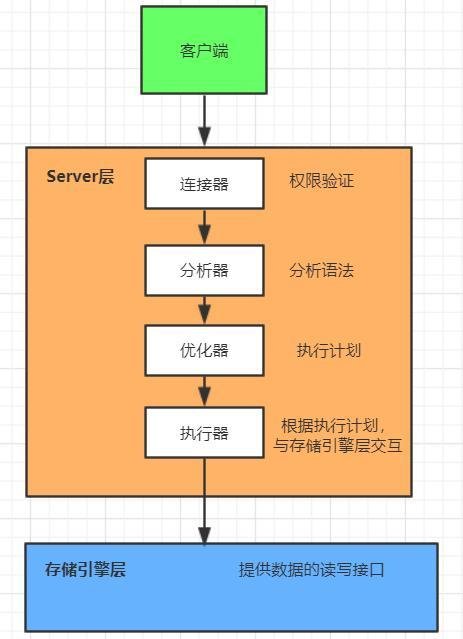

本篇主要介绍了MySQL库表的基本操作以及常用数据类型。 

<!--more-->


# 存储引擎

**插件式存储引擎**是MySQL数据库最重要的特性之一😄

数据的存储方式——存储引擎 engines，使用不同的存储引擎，数据是以不同的方式存储的

`show engines;`  查看存储引擎


## innodb

innodb：MySQL5.6以上默认存储方式

- transactions  **支持事务**  保证数据安全 数据的完整性而设置的概念。（先做内存级别的事情，整个事务完成了，才保存到硬盘）
- row-level locking **行级锁**，行锁大幅度进步了多用户并发操纵的功能。可是InnoDB的行锁，只有通过索引条件检索数据，InnoDB才使用行级锁，否则，InnoDB将使用表锁。
  - 支持事务和行级锁是innodb的最大特点。
- foreign keys 外键
- 树 tree —— 加速查询 （树形结构（数据+树） + 表结构）


### 存储结构

innodb在磁盘上存储为2个文件

`show create table staff` 

`staff.frm——frame`表结构

`staff.ibd——innodb`引擎


## myisam

myisam ：MySQL5.5以下 默认的存储方式 

- table-level 只支持表级锁
- 树 tree  （平衡二叉树） —— 加速查询（树形结构 + 数据 + 表结构）


### 存储结构

myisam在磁盘上存储为3个文件

创建一个以myisam为引擎的table

`create table myisam_t(id int) engine=myisam;`

`myisam_t.frm`结构

`myisam_t.MYD`数据

`myisam_t.MYI`索引


## memory

- memory：

  - 基于hash
  - 热数据 以前用，现在用redis代替了。

  

1个文件

`create table memory_t(id int) engine=memory;`

`memory_t.frm`结构

它存在内存中，关闭服务就会消失


## MySQL的工作流程



上图来自[掌握MySQL的逻辑结构](<https://kknews.cc/zh-tw/other/r5nk36r.html>)。


# SQL语句基础

## SQL简介

SQL是结构化查询语言(Structured  Query Language)

它是在关系型数据库上执行数据操作、数据检索以及数据维护的标准语言。


## SQL语句分类

在MySql数据库中，SQL语句主要可以划分为以下几类：

DDL(Data Definition Language)数据**定义**语言

- 定义对数据库对象(库、表、列、索引)的操作。
- CREATE、DROP、ALTER、RENAME、 TRUNCATE等

DML(Data Manipulation Language)数据**操作**语言

- 定义对数据库记录的操作。
- INSERT、DELETE、UPDATE、SELECT等

DCL(Data Control Language)数据**控制**语言

- 定义对数据库、表、字段、用户的访问权限和安全级别。
- GRANT、REVOKE等

Transaction Control事务控制

- COMMIT、ROLLBACK、SAVEPOINT等


## 识别符

数据库名、表名、索引名、列名和别名是识别符

操作系统的大小写敏感性决定了数据库名和表名的大小写敏感性：

- Windows操作系统大小写不敏感
- Linux，unix系统大小写敏感

列、索引、存储子程序和触发器名在任何平台上对大小写不敏感，列的别名也不敏感。


# 数据库操作

## SHOW DATABASES

`SHOW DATABASES [LIKE wild]`

- 列出在MySql服务器主机上的数据库。
- 如果使用LIKE wild不符，wild字符串可以是一个使用SQL的”%”和”_”通配符的字符串。

MySql自带数据库：

- information_schema:主要存储了系统中的一些数据库对象信息：如用户表信息、列信息、权限信息、字符集信息、分区信息等。(数据字典表)。该数据库主要关注server运行过程中的**元数据信息**。
- performance_schema:用于监控MySQL server在一个较低级别的运行过程中的资源消耗、资源等待等情况。该数据库主要关注数据库运行过程中的**性能相关的数据**。
- mysql:存储了系统的用户权限信息及帮助信息。
- Test:系统自动创建的测试数据库，任何用户都可以使用。


## CREATE DATABASE

`CREATE DATABASE [IF NOT EXISTS]数据库名;`

- 用给定的名字创建一个数据库，如果数据库已经存在，发生一个错误。
- 查看创建数据库：`SHOW CREATE DATABASE <数据库名>；`

note：CHARACTER SET 没有指定的话会依据配置文件。


## DROP DATABASE

`DROP DATABASE [IF EXISTS]数据库名;`       小心使用

- 删除数据库中得所有表和数据库


## 使用USE 选用数据库

 `USE 数据库名;`

- 把指定数据库作为默认(当前)数据库使用，用于后续语句。


## SELECT

### 查看当前连接的数据库

  `SELECT DATABASE();`

### 查看数据库版本

  `SELECT VERSION();`

### 查看当前用户

  `SELECT USER();`

## 执行Linux命令

  `SYSTEM <命令>`


## 数据库对象

### 数据库对象命名规则

- 必须以字母开头
- 可包括数字和三个特殊字符（# _ $）
- 不要使用MySQL的保留字
- 同一Schema（架构）下的对象不能同名

| 对象名称 | 描述                                                         |
| -------- | ------------------------------------------------------------ |
| 表       | 基本的数据存储对象，以行和列的形式存在；列就是**字段**，行就是**记录** |
| 约束     | 执行数据校验，保证了数据完整性                               |
| 数据字典 | 是系统表，存放数据库相关信息的表                             |
| 视图     | 一个或者多个表数据的逻辑表示                                 |
| 索引     | 用于提高查询的性能                                           |


# 表操作

数据库中的表包括用户表和数据字典表（视图）两类

## 用户表

被用户创建和维护的一些表，包括了用户自己的信息。


## 数据字典表(视图)

被数据库系统创建和维护的一些表，包括了数据库的信息。

例如，由information_schema数据库负责维护：

| 数据字典表        | 描述                                           |
| ----------------- | ---------------------------------------------- |
| tables            | 存放数据库里所有的数据表、以及每个表所在数据库 |
| schemata          | 存放数据库里所有的数据库信息                   |
| views             | 存放数据库里所有的视图信息                     |
| columns           | 存放数据库里所有的列信息                       |
| triggers          | 存放数据库里所有的触发器                       |
| routines          | 存放数据库里所有存储过程和函数                 |
| key_column_usage  | 存放数据库所有的主外键                         |
| table_constraints | 存放数据库全部约束                             |
| statistics        | 存放了数据表的索引                             |


## 表的基本操作

### 创建 CREATE TABLE

```mysql
 CREATE TABLE [schema.]table
  (column datatype[DEFAULT expr] , …
  ) ENGINE = 存储机制

# 简单：
 CREATE TABLE 表名(字段 数据类型(宽度) 约束,
				字段 数据类型(宽度) 约束)
```

- 标准的建表（table）语法(列定义之间以英文逗号,隔开)
- 数据表的**每行**称为一条**记录（record）**，**每一列**称为一个**字段（field）**。

主键列：唯一能够标识每条记录的列。


### 删除 DROP、DELETE、TRUNCATE

#### DROP TABLE

`DROP TABLE [IF EXISTS] 表名；`

删除指定的表


#### DELETE

`DELETE TABLE table_name`

清空一个表。

不是很彻底，例如它不会清空AUTO_INCREMENT。


#### TRUNCATE

`TRUNCATE TABLE table_name`

完全清空一个表。

DDL语句


#### DROP、TRUNCATE、DELETE比较

- delete 删除数据，保留表结构，可以回滚，如果数据量大，很慢
- truncate 删除所有数据，保留表结构，不可以回滚，一次全部删除所有数据，速度相对很快
- drop 删除数据和表结构,删除速度最快。


### 查看表与表结构 

#### DESCRIBE

`{DESCRIBE|DESC}表名[列名];`

查看数据表中各列的信息

`SHOW CREATE TABLE 表名` 

可以查看更全面的表定义信息


#### SHOW

`SHOW TABLES[FROM 数据库名][LIKE wild];`

显示当前数据库中已有的数据表的信息


### 修改表 ALTER TABLE

在实际中，基本不修改表，它是项目开始前决定好的。

#### 修改列类型 MODIFY

`ALTER TABLE 表名 MODIFY  存在的字段  新的类型 （宽度） 约束;  `

MODIFY 除了名字不能改，其它都能改

#### 增加列 ADD

`ALTER TABLE 表名 ADD  新字段  类型（宽度） 约束；`


增加一个列并放在某个列的后面：

`ALTER TABLE 表名 ADD 新字段  类型（宽度） 约束   AFTER 某个列;`

增加一个列并放在首位：

 `ALTER TABLE 表名 ADD 新字段  类型（宽度） 约束   FIRST;`


#### 删除列 DROP

`ALTER TABLE 表名 DROP 列名;`


#### 列改名 CHANGE

`ALTER TABLE 表名 CHANGE 旧字段 新字段   类型（宽度） 约束;`

`ALTER TABLE 表名 CHANGE 旧字段 新字段   类型（宽度） 约束 after id;`

CHANGE 啥也可以修改，如改名，修改属性等等。

#### 更改表名 RENAME

`ALTER TABLE 表名 RENAME 新表名;`

`RENAME TABLE 表名 TO 新表名;`


### 复制表的结构

复制一个表结构的实现方法有两种

1. 在create table语句的末尾添加like子句，可以将源表的**表结构复制**到新表中，语法格式如下。

   `create table 新表名 like 源表`

2. 在create table语句的末尾添加一个select语句，可以实现**表结构的复制**，甚至可以将**源表的表记录拷贝**到新表中。下面的语法格式将源表的表结构以及源表的所有记录拷贝到新表中。

   `create table 新表名 select * from 源表`
   
   `INSERT INTO 新表名(部分字段) SELECT (部分字段) FROM 源表`


## 表的操作-约束

约束是在表上强制执行的**数据校验**规则。

约束主要用于保证数据库的**完整性**。

当表中数据有**相互依赖**性时,可以保护相关的数据**不被删除**。

约束作为数据库对象，存放在系统表中，也有自己的名字。

创建约束的时机

- 在建表的同时创建
- 建表后创建（修改表）

可定义列级或表级约束

有单列约束和多列约束


### 列级约束

#### 定义列的同时定义约束

定义列的同时定义约束

`列定义 约束类型`


NOT NULL和DEFAULT只存在**列级约束**。

PRIMARY KEY、UNIQUE、FOREIGN KEY同时存在**表级约束和列级约束**。


### 表级约束

#### 创建表的时候定义约束

`列定义...,`

`[CONSTRAINT 约束名] 约束类型(列名)`


#### 创建完表后添加

`ALTER TABLE 表名 ADD CONSTRAINT 约束名 约束类型(要约束的列名)`


#### 约束名的取名规则

推荐： `表名_列名_约束类型简写`


### 无符号（UNSIGNED）

用于数值型


### 非空约束(NOT NULL)

确保字段值不允许为空，只能在字段级定义。

所有数据类型的值都可以是NULL。

空字符串不等于NULL。

0也不等于NULL。


```mysql
CREATE TABLE t1(id INT NOT NULL , name CHAR(12) NOT NULL , age TINYINT UNSIGNED);
```

但是：

```mysql
INSERT INTO t1(id,age) VALUES(1,20);
```

虽然not null可还是写入了

```
+----+------+------+
| id | name | age  |
+----+------+------+
|  1 |      |   20 |
+----+------+------+
```

当你的not null不生效的时候，改变设置为严格模式

**严格模式**的特点：

- 不支持对not null字段插入null值
- 不支持对自增长字段插入值
- 不支持text字段有默认值

存在两种情况：一种暂时，一种写入文件。

- 直接在mysql中生效(重启失效):

`set sql_mode="STRICT_TRANS_TABLES,NO_AUTO_CREATE_USER,NO_ENGINE_SUBSTITUTION";`

- 配置文件添加(永久失效)：

`sql-mode="STRICT_TRANS_TABLES,NO_AUTO_CREATE_USER,NO_ENGINE_SUBSTITUTION"`

重复之前的操作，发现这次并没有成功

`ERROR 1364 (HY000): Field 'name' doesn't have a default value`


### 默认（DEFAULT）

设置默认值


### 唯一约束（UNIQUE）

- 唯一性约束条件确保所在的**字段**或者**字段组合**不出现重复值

  同一张表内可**建多个唯一约束**

  唯一约束可由多列组合而成

  建唯一约束时MySQL会为之建立对应的索引。

  如果不给唯一约束起名，该唯一约束默认与列名相同。

- 唯一性约束条件的字段允许出现多个NULL

  数据与数据之间相等就是重复，null不能用等号判断

  is null 判断等于 null

- **联合唯一**

  单独的看某一列是不唯一的，但搭配起来是唯一的。

```mysql
CREATE TABLE t2(
    id INT PRIMARY KEY,
    servername CHAR(12) NOT NULL,
    ip CHAR(15),
    port INT,
    UNIQUE(ip, port)
);

INSERT INTO t2 VALUES(1,'输入法皮肤','10.10.3.1',8800);
INSERT INTO t2 VALUES(2,'mysql','10.10.2.4',3306);
INSERT INTO t2 VALUES(3,'mysql','10.10.2.5',3306);
INSERT INTO t2 VALUES(4,'输入法皮肤','10.10.3.1',8802);
INSERT INTO t2 VALUES(5,'redis','10.10.2.4',3306);
```


- 去掉字段的唯一约束：

```
 alter table student DROP INDEX class_id;
```


### 自增（AUTO_INCREMENT）

- 只针对int

- 自带 not null

- 对字段进行设置unique/primarily key，且一张表只能有一列为自增。

  `ERROR 1075 (42000): Incorrect table definition; there can be only one auto column and it must be defined as a key`

  尝试： 那么foreign key呢？ 可以，但很鸡肋。

- 内部有记录 AUTO_INCREMENT = x 这个数字为插入时的id。

```mysql
CREATE TABLE t3(
	id int UNIQUE AUTO_INCREMENT,
	name CHAR(12) NOT NULL
);

INSERT INTO t3(name) VALUES('aa');
INSERT INTO t3(name) VALUES('bb');

# 第一种情况：
DELETE FROM t3 where id = 2;
INSERT INTO t3(name) VALUES('cc');
	# cc 的 id 为 3  

# 第二种情况：
INSERT INTO t3(name) VALUES('bb');
	# bb 的 id 为 4
# 上面两种情况的原因为：新的id是AUTO_INCREMENT的值（使用SHOW CREATE TABLE t3可以看到AUTO_INCREMENT = 5 ）

DELETE FROM t3; 
# 清空表 它不会清空AUTO_INCREMENT  所以不推荐用delete

# 建议使用 它会清空AUTO_INCREMENT
TRUNCATE TABLE t3;
```


### 主键约束（PRIMARY KEY）

- 主键从功能上看相当于**非空且唯一**

  一个表中只允许**一个主键**

  主键是表中唯一确定一行数据的字段

  主键字段可以是**单字段**或者是**多字段**的组合

  当建立主键约束时，MySQL为主键创建对应的索引

- 联合主键（多字段组合）

```mysql
CREATE TABLE t4 (
	id INT PRIMARY KEY,
    name CHAR(14)
);
INSERT INTO t4(name) values('aa');
INSERT INTO t4(name) values('bb');   # 报错
# ERROR 1062 (23000): Duplicate entry '0' for key 'PRIMARY'
# 没有写默认为0

# 联合主键
CREATE TABLE t5(
	family_name CHAR(4),
    name CHAR(12),
    PRIMARY KEY(family_name, name)
);
INSERT INTO t5 VALUES('a','tlas');
INSERT INTO t5 VALUES('a','atlas');
INSERT INTO t5 VALUES('ab','tlas');

# 尽量不设置联合主键，设置联合唯一，和查询效率相关
CREATE TABLE t6(
	family_name CHAR(4) NOT NULL,
    name CHAR(12) NOT NULL,
    UNIQUE(family_name, name)
);
```

```
# 结果为
| t6    | CREATE TABLE `t6` (
  `family_name` char(4) NOT NULL,
  `name` char(12) NOT NULL,
  UNIQUE KEY `family_name` (`family_name`,`name`)
) ENGINE=InnoDB DEFAULT CHARSET=utf8 |
```


### 外键（FOREIGN KEY）

- 外键关联的字段 必须是unique / primary key 。推荐设置**主键**
- 级联更新 ON UPDATE CASCADE
- 级联删除 ON DELETE CASCADE

```mysql
CREATE TABLE student(
	id INT PRIMARY KEY AUTO_INCREMENT,
    name CHAR(12) NOT NULL,
    gender ENUM('男','女'),
    cid int 
);
CREATE TABLE class(
    id INT PRIMARY KEY AUTO_INCREMENT,
	cname CHAR(12) NOT NULL UNIQUE,
    start_date DATE,
    period CHAR(12),
    course CHAR(12),
    teacher CHAR(12)
);

INSERT INTO student VALUES(1, 'ATLAS', '男', 1);
INSERT INTO class VALUES(1, '小红旗', 20190505, '1 year', 'python',  '小红');

# 现在两个表是存在问题的，当class改变后，student会没有班级，所以需要一个新的约束
# 删除student表，在重新创建
CREATE TABLE student(
	id INT PRIMARY KEY AUTO_INCREMENT,
    name CHAR(12) NOT NULL,
    gender ENUM('男','女'),
    cid int ,
    FOREIGN KEY(cid) REFERENCES class(id)
);
INSERT INTO student VALUES(1, 'ATLAS', '男', 1);
#情况一： 增加学生时没有这个班级号会报错
INSERT INTO student VALUES(2, '小飞', '女', 2);  # 报错
# ERROR 1452 (23000): Cannot add or update a child row: a foreign key constraint fails
# 因为班级表里面还没有 2 班
#情况二： 删除班级中的1班

#情况二：修改班级中的1班的班号改为2班

# 那我们非要改呢?可以在创建的时候 
# 级联更新 + 级联删除(非常危险)， 可以只用级联更新
CREATE TABLE student1(
	id INT PRIMARY KEY AUTO_INCREMENT,
    name CHAR(12) NOT NULL,
    gender ENUM('男','女'),
    cid int ,
    FOREIGN KEY(cid) REFERENCES class(id) ON DELETE CASCADE ON UPDATE CASCADE   
);
CREATE TABLE class1(
    id INT PRIMARY KEY AUTO_INCREMENT,
	cname CHAR(12) NOT NULL UNIQUE,
    start_date DATE,
    period CHAR(12),
    course CHAR(12),
    teacher CHAR(12)
);
INSERT INTO class VALUES(1, '小红旗', 20190505, '1 year', 'python',  '小红');
INSERT INTO student VALUES(1, 'ATLAS', '男', 1);
UPDATE class1 set id = 2 where id = 1;
# 这样我们改了班级的id后，学生的id也改了
DELETE class1 WHERE id = 2;
# 学生也没了。
```


创建表后，添加外键约束

```mysql
ALTER TABLE student ADD FOREIGN KEY student_class(class_id) REFERENCES class(cid);
```


删除外键约束：

```mysql
show create table student;   # 记录外键名
alter table student drop foreign key 外键名
```


## 表与表之间的关系

###  一对多关系

例子：校区表 班级表 

- 校区表    一个校区可以有多个班级      一对多
- 班级表    一个班级只对应一个校区

#### 如何建表：设置foreign 

- <u>多的那一方 创建 FOREIGN KEY 关联少的那张表。奔着减少冗余去的。</u>

### 多对多关系

例子：学生与课程： 

- 学生角度上： 一个学生可以选多个课程，一对多
- 课程角度上：一个课程有多个学生，多对一

#### 如何建表：设置新表 + 两个foreign key 

- 拆成一对多，在键一张表。

- 多对多产生第三张表
  - **foreign + 新表**
  - 一个字段是外键关联一张表的主键
  - 另一个字段外键关联另一张表的主键

### 一对一关系

例子:会员表 客户表

- 会员表中创建客户字段（不会空），反过来会有很多空缺（不是所有客户都是会员的）。

#### 如何建表： foreign key + unique

客户字段（关联）（多的那方）设置为 foreign key + unique

相当于在一对多的基础上 + unique


# MySQL中的常用数据类型

MySQL支持多种列类型：

- 数值类型：常用 tinyint, int, float
- 日期/时间类型：常用 datetime, date, time, now()函数
- 字符串(字符)类型：常用 char, varchar
- set和enum：多选去重, 单选


## 数值类型

| 类型         | c存储字节                                              | 范围（有符号）                                               | 范围（无符号）unsigned约束                                   | 用途           |
| ------------ | ------------------------------------------------------ | ------------------------------------------------------------ | ------------------------------------------------------------ | -------------- |
| TINYINT      | 1 字节                                                 | (-128，127)                                                  | (0，255)                                                     | 小整数值       |
| SMALLINT     | 2 字节                                                 | (-32 768，32 767)                                            | (0，65 535)                                                  | 大整数值       |
| MEDIUMINT    | 3 字节                                                 | (-8 388 608，8 388 607)                                      | (0，16 777 215)                                              | 大整数值       |
| INT或INTEGER | 4 字节                                                 | (-2 147 483 648，2 147 483 647)                              | (0，4 294 967 295)                                           | 大整数值       |
| BIGINT       | 8 字节                                                 | (-9 233 372 036 854 775 808，9 223 372 036 854 775 807)      | (0，18 446 744 073 709 551 615)                              | 极大整数值     |
| FLOAT        | 4 字节 float(255,30)                                   | (-3.402 823 466 E+38，-1.175 494 351 E-38)，0，(1.175 494 351 E-38，3.402 823 466 351 E+38) | 0，(1.175 494 351 E-38，3.402 823 466 E+38)                  | 单精度浮点数值 |
| DOUBLE       | 8 字节 double(255,30)                                  | (-1.797 693 134 862 315 7 E+308，-2.225 073 858 507 201 4 E-308)，0，(2.225 073 858 507 201 4 E-308，1.797 693 134 862 315 7 E+308) | 0，(2.225 073 858 507 201 4 E-308，1.797 693 134 862 315 7 E+308) | 双精度浮点数值 |
| DECIMAL      | 对DECIMAL(M,D) ，如果M>D，为M+2否则为D+2 double(65,30) | 依赖于M和D的值                                               | 依赖于M和D的值                                               | 小数值         |


- 当你插入的数超过了数据类型的上限/下限，它会以上限/下限进行保存。
- 单精度和双精度它们的精度有限
  - float(255,30)  左边表示以共多少位，右边表示小数点保留位数。
  - 百万级 float(9,2)

```mysql
# 创建名为fd_t的表
CREATE TABLE fd_t(f float, d double, f2 float(5,2), d2 double(5,2));
# 插入很长的数，来验证结果
INSERT INTO fd_t VALUES(1.234567890987654321,1.23456789087654321,2.87654321,2.87654321);

INSERT INTO fd_t VALUES(1.23456789087654321, 1.23456789087654321, 1.23456789087654321, 1.23456789087654321)
```

```
结果为：
+---------+--------------------+------+------+
| f       | d                  | f2   | d2   |
+---------+--------------------+------+------+
| 1.23457 | 1.2345678908765432 | 2.88 | 2.88 |
| 1.23457 | 1.2345678908765432 | 1.23 | 1.23 |

```

结论：

- 精确位会做**四舍五入**。
- float 精度问题，小数点**后5位**
- 精度更高但也不准确


DECIMAL(M,D)

```mysql
CREATE TABLE dec_t(dec1 decimal, dec2 decimal(30,20));
INSERT INTO deci_t VALUES(1.23456789087654321,1.23456789087654321);

INSERT INTO deci_t VALUES(1.23456789087654321,9876543210987654321.23456789087654321);
```

结果为：

```
+------+---------------------------------+
| dec1 | dec2                            |
+------+---------------------------------+
|    1 |          1.23456789087654321000 |
|    1 | 9999999999.99999999999999999999 |
+------+---------------------------------+
```

结论：

- M表示最大显示宽度；D表示小数点后面的位数。
- 默认为decimal(10,0)
- 定点数DECIMAL在内部以字符串形式存放，适合表示货币等高精度的数据。


## 日期/时间

| 类型      | 存储字节 | 范围                                                         | 格式                | 用途                     |
| --------- | -------- | ------------------------------------------------------------ | ------------------- | ------------------------ |
| DATE      | 3        | 1000-01-01/9999-12-31                                        | YYYY-MM-DD          | 年月日                   |
| TIME      | 3        | '-838:59:59'/<br />'838:59:59'                               | HH:MM:SS            | 时分秒                   |
| YEAR      | 1        | 1901/2155                                                    | YYYY                | 年份值                   |
| DATETIME  | 8        | 1000-01-01 00:00:00/9999-12-31 23:59:59                      | YYYY-MM-DD HH:MM:SS | 年月日时分秒             |
| TIMESTAMP | 4        | 1970-01-01 00:00:00/2038 结束时间是第 **2147483647** 秒，北京时间 **2038-1-19 11:14:07**，格林尼治时间 2038年1月19日 凌晨 03:14:07 | YYYYMMDD HHMMSS     | 混合日期和时间值，时间戳 |

常用内置函数： now()

datetime：常用于日志/论坛博客类的评论，文章        `*****  `

date：常用于员工生日，入职日期，离职日期  `****`

time：常用于每天固定的时间   

timestamp：只能到2038年  由于表示范围的问题，导致用的少了   不能为空，默认值是当前时间，在修改的时候同时更新时间。

```mysql
CREATE TABLE time_t(d DATE, dt DATETIME, ts TIMESTAMP, t TIME, y YEAR);
INSERT INTO time_t VALUES(now(), now(), now(), now(), now());
INSERT INTO time_t VALUES('2038-1-19','2038-1-19 12:12:12','2038-1-19 12:12:12','12:12:12',2038 );
INSERT INTO time_t VALUES('2038-1-19','2038-1-19 10:12:12','2038-1-19 10:12:12','10:12:12',2038 );
```

结果为：

```
+------------+---------------------+---------------------+----------+------+
| d          | dt                  | ts                  | t        | y    |
+------------+---------------------+---------------------+----------+------+
| 2019-05-26 | 2019-05-26 20:23:57 | 2019-05-26 20:23:57 | 20:23:57 | 2019 |
| 2038-01-19 | 2038-01-19 12:12:12 | 0000-00-00 00:00:00 | 12:12:12 | 2038 |
| 2038-01-19 | 2038-01-19 10:12:12 | 2038-01-19 10:12:12 | 10:12:12 | 2038 |
+------------+---------------------+---------------------+----------+------+
```

结论：

- 使用`now()`函数
- 上面验证了TIMESTAMP到了北京时间 2038-1-19 11:14:07就会结束。
- TIMESTAMP跟时区相关，插入日期时，会先转化为本地时区后存放，而取出时，也会将日期转化为本地时区后显示。


单项插入整形时间，注意位数得对应

```mysql
INSERT INTO time_t(dt) VALUES(20180705112222);
```


验证当本行数据改变后，`TIMESTAMP`发生变化

```mysql
UPDATE time_t SET y = 2020 WHERE y = 2019;
```


基于以上`TIMESTAMP`的特点，如果我们修改`DATETIME`使它不能为空，默认值是当前时间，在修改的时候同时更新时间。我们可以参考`TIMESTAMP`的定义。

```mysql
SHOW CREATE TABLE time_t;

```

```
| time_t | CREATE TABLE `time_t` (
  `d` date DEFAULT NULL,
  `dt` datetime DEFAULT NULL,
  `ts` timestamp NOT NULL DEFAULT CURRENT_TIMESTAMP ON UPDATE CURRENT_TIMESTAMP,
  `t` time DEFAULT NULL,
  `y` year(4) DEFAULT NULL
) ENGINE=InnoDB DEFAULT CHARSET=utf8 |

```

所以我们在定义的时候需要加入NOT NULL DEFAULT CURRENT_TIMESTAMP ON UPDATE CURRENT_TIMESTAMP

```mysql
ALTER TABLE time_t ADD dts DATETIME NOT NULL DEFAULT CURRENT_TIMESTAMP ON UPDATE CURRENT_TIMESTAMP;
```


## 字符串

| 类型       | 存储字节                                                     | 描述                            |
| ---------- | ------------------------------------------------------------ | ------------------------------- |
| CHAR       | 0-255字节                                                    | 定长字符串                      |
| VARCHAR    | 0-65535 字节                                                 | 变长字符串                      |
| TINYBLOB   | 0-255字节                                                    | 不超过 255 个字符的二进制字符串 |
| TINYTEXT   | 0-255字节                                                    | 短文本字符串                    |
| BLOB       | 0-65 535字节                                                 | 二进制形式的长文本数据          |
| TEXT       | 0-65 535字节                                                 | 长文本数据                      |
| MEDIUMBLOB | 0-16 777 215字节                                             | 二进制形式的中等长度文本数据    |
| MEDIUMTEXT | 0-16 777 215字节                                             | 中等长度文本数据                |
| LONGBLOB   | 0-4 294 967 295字节                                          | 二进制形式的极大文本数据        |
| LONGTEXT   | 0-4 294 967 295字节                                          | 极大文本数据                    |
| ENUM       | 对1-255个成员的枚举需要1个字节存储; 对于255-65535个成员，需要2个字节存储; 最多允许65535个成员。 | 单选：选择性别                  |
| SET        | 1-8个成员的集合，占1个字节 9-16个成员的集合，占2个字节 17-24个成员的集合，占3个字节 25-32个成员的集合，占4个字节 33-64个成员的集合，占8个字节 | 多选：兴趣爱好                  |


char：定长存储，存储速度更快，占用更多的空间  `*****`

- char(12)   

  'alex'  --->   'alex          '

- 手机号码，身份证，用户名，密码  有一定范围，弹性不大

varchar：变长存储，存储速度相对慢，占用空间小  `****`

- varchar(12)

- 'alex' ---> 'alex4'   

- 微博评论，文章

  

验证定长存储，与变长存储：

```mysql
CREATE TABLE ch_t(c CHAR, vc VARCHAR(1), c2 CHAR(5), vc2 VARCHAR(5) );
INSERT INTO ch_t VALUES('我是naqin', '我是naqin', '我是naqin', '我是naqin');
INSERT INTO ch_t(c2, vc2) VALUES( 'a     ', 'a        ');
SELECT CONCAT(c2,'|'), CONCAT(vc2, '|') from ch_t;

```

note: varchar需要**指定长度**

显示的时候会自动清除空格，所以需要加上`concat()`

```
+----------------+------------------+
| CONCAT(c2,'|') | CONCAT(vc2, '|') |
+----------------+------------------+
| 我是naq|       | 我是naq|          |
| a|             | a    |           |
+----------------+------------------+

```


## enum和set

**单选**，`enum('男','女')` 约束中写入后完成二选一:

```mysql
CREATE TABLE enum_t(id INT, name CHAR(12), gender ENUM('male','female'));
INSERT INTO enum_t VALUES(1,'小白','male');
```


**多选题** 从有限的条件中选则:

```mysql
CREATE TABLE set_t(id INT, name CHAR(12), hobby SET('唱','跳','rap','篮球'));

INSERT INTO set_t VALUES(1, '小白', '唱','跳');
INSERT INTO set_t VALUES(2,'小黑',7);  
# 1 + 2 + 4 = 2^0 + 2^1 + 2^2 = 7
insert into set_t values(3, '小小', 120);
```

```
+------+--------+----------------+
| id   | name   | hobby          |
+------+--------+----------------+
|    1 | 小白   | 唱,rap          |
|    2 | 小黑   | 唱,跳,篮球      |
|    3 | 小小   | 篮球            |
+------+--------+----------------+
```


# 小结

## 有关数据库的DDL操作

`SHOW DATABASES;`

`CREATE DATABASE 数据库名；`

`DROP DATABASE [IF EXISTS] 数据库名；`

`USE 数据库名；`

## 有关数据表的DDL操作

`SHOW TABLES ;`

`DESC 表名；`

`CREATE TABLE 表名(……);`

`DROP TABLE 表名；`

`ALTER TABLE 表名；`

## 常用的数据类型

数值类型：int	tinyint	float(建议设置宽度)    

日期/时间：datetime	date	time	timestamp

字符串：char	varchar

enum和set：enum(单选)	set(多选，去重)

本篇介绍了MySQL库表的操作以及常用的数据类型。


------

