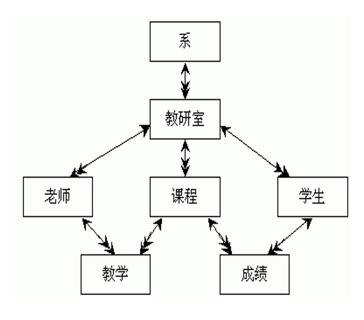
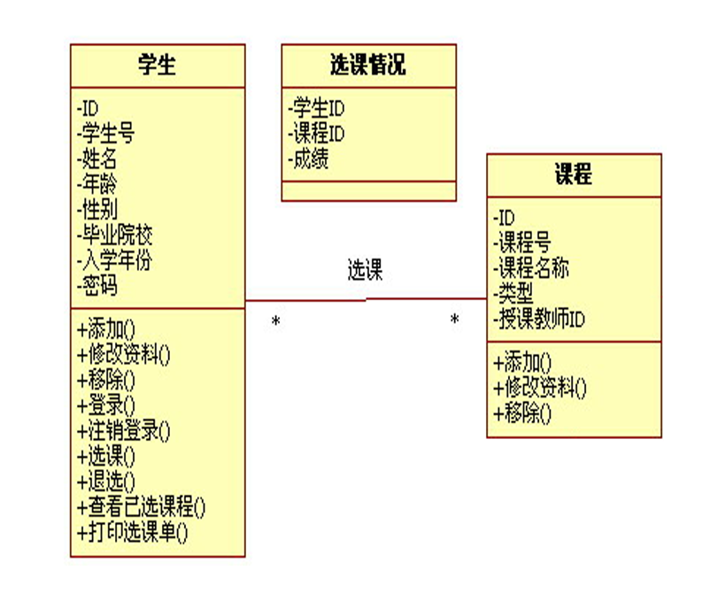

本篇是对数据库概念，历史，类型的简单介绍以及MySQL的安装与简单使用。 

<!--more-->


# 数据库概念


## 数据库

数据库是大量数据的集合，它们存储在计算机中，有组织，可扩展，并能快速更新、存取，服务于不同的用户。

简单来讲：数据库具有永久存储，有组织和可共享三个基本特点。


企业数据存储面临的问题

- 存储大量数据

- 大量数据的检索和访问

- 保持数据信息的一致、完整

- 数据共享和安全

- 通过分析整合，产生新的有用的信息


## 数据库的发展史

初始阶段-----人工管理（人力手工整理存储数据）

萌芽阶段-----文件系统	(使用磁盘文件来存储数据)

初级阶段-----第一代数据库	(出现了**网状模型**、**层次模型**的数据库)

中级阶段-----第二代数据库	(**关系型**数据库和结构化查询语言)

高级阶段------新一代数据库	(关系-对象 型数据库)


## 数据库管理系统(DBMS)

- 数据库系统**成熟**的标志就是数据库管理系统的出现。数据库管理系统(DataBase Management System，简称DBMS)是管理数据库的一个软件，它充当所有数据的知识库，并对它的存储、安全、一致性、并发操作、恢复和访问负责。是对数据库的一种完整和统一的管理和控制机制。数据库管理系统不仅让我们能够实现对数据的快速检索和维护，还为数据的安全性、完整性、并发控制和数据恢复提供了保证。数据库管理系统的核心是一个用来存储大量数据的数据库。

- DBMS是所有数据的知识库，并对数据的存储、安全、一致性、并发操作、恢复和访问负责。

- DBMS有一个**数据字典**（有时被称为**系统表**），用于贮存它拥有的每个事物的相关信息，例如名字、结构、位置和类型，这种关于数据的数据也被称为**元数据**（metadata）


## 数据库分类

### 关系型数据库

(一列数据之间是互相联系的)

- nMySQL （开源、小公司直接用、大公司二次开发）
- Oracle（严谨，安全性最高、金融）
- SQL server（微软）
- SQLlite
- Access（小金融公司）

### 非关系型数据库（大数据）

键值对 key：value

- redis（最好用的）
- mongodb（轻量级）
- memcache（内存级别的断电会消失）


## 数据库管理系统常用的数学模型

### 层次模型

层次数据模型是用**树**状（层次）结构来组织数据的数据模型。


#### 特点：

- 有且仅有一个节点无父节点，这个节点称为**根节点**
- 其他节点有且仅有一个父节点。

#### 优点：

- 层次数据模型的结构简单、清晰、明朗，很容易看到各个实体之间的联系
- 操作层次数据类型的数据库语句比较简单，只需要几条语句就可以完成数据库的操作
- 层次数据模型提供了较好的数据完整性支持，正如上所说，如果要删除父节点，那么其下的所有子节点都要同时删除
- 查询效率较高，在层次数据模型中，节点的有向边表示了节点之间的联系，在DBMS中如果有向边借助指针实现，那么依据路径很容易找到待查的记录

#### 缺点：

- 现实世界中，事物之间的联系更多的是非层次关系的，用层次模型表示非树型结构是很不直接的。

- 查询节点的时候必须知道其**双亲节点**的，因此限制了对数据库存取路径的控制
- 结构呆板，缺乏灵活性
- 层次数据模型只能表示实体之间的1:n的关系，**不能表示m:n**的复杂关系，因此现实世界中的很多模型不能通过该模型方便的表示


### 网状模型

用**有向图**表示实体和实体之间的联系的数据结构模型称为网状数据模型。



#### 特点：

- 允许一个以上的节点无父节点；
- 一个节点可以有多于一个的父节点。


#### 优点：

- 网状数据模型可以很方便的表示现实世界中的很多复杂的关系
- 修改网状数据模型时，没有层次状数据模型的那么多的严格限制，可以删除一个节点的父节点而依旧保留该节点；也允许插入一个没有任何父节点的节点，这样的插入在层次状数据模型中是不被允许的，除非是首先插入的是根节点
- 实体之间的关系在底层中可以借由指针指针实现，因此在这种数据库中的执行操作的效率较高


#### 缺点：

- 网状数据模型的结构复杂，使用不易，随着应用环境的扩大，数据结构越来越复杂，数据的插入、删除牵动的相关数据太多，**不利于数据库的维护和重建**
- 网状数据模型数据之间的彼此关联比较大，该模型其实一种**导航式的数据模型结构**，不仅要说明要对数据做些什么，还说明操作的记录的路径


note：网状数据库和层次数据库都很好地解决了数据的集中和共享问题，但在**数据独立性**和**抽象性**上有很大欠缺。 


### 关系模型

使用**表格**表示实体和实体之间关系的数据模型称之为关系数据模型。


#### 特点：

关系模型数据库采用表组织数据（表称为“关系”），一个数据库由许多个表组成，多个表数据之间存在着关系，在这些表上的数据操作依赖于关系，关系用来描述多个表之间的数据依存，包括了一对一、一对多、多对多的关系。

**实体**（Entity）、**属性**（Attribute）、**关系**（Relationship）。

关系数据库：用于存储各种类型数据的”仓库”，是二维表的集合。

表：实体的映射

行和列：行代表一个具体的实体的数据。也叫一条记录。列是属性的映射，用于描述实体的。


#### 优点：

- 结构简单，关系数据模型是一些表格的框架，实体的属性是表格中列的条目，实体之间的关系也是通过表格的公共属性表示，结构简单明了
- 关系数据模型中的存取路径对用户而言是完全隐蔽的，是程序和数据具有高度的独立性，其数据语言的非过程化程度较高
- 操作方便，在关系数据模型中操作的基本对象是集合而不是某一个元组

- 有坚实的数学理论做基础，包括逻辑计算、数学计算等

#### 缺点:

- 查询效率低，关系数据模型提供了较高的数据独立性和非过程化的查询功能（查询的时候只需指明数据存在的表和需要的数据所在的列，不用指明具体的查找路径），因此加大了系统的负担
- 由于查询效率较低，因此需要数据库管理系统对查询进行优化，加大了DBMS的负担


### 面向对象模型

九十年代，受当时面向对象技术风潮的影响，




#### 特点：

- 此面向对象数据库最大的性能优势是能以使用**数据的方式组织数据**，但也由此带来了**对象－关系不匹配**障碍。面向对象模型是以**分类为基础**的，类用来定义存储在数据库内对象的结构及行为；而**关系模型的基础是关系**，也就是基于关系的**表**，它要求将数据组织成规范的二维表，这种组织方式往往要求对象在经过分解后才能进入数据库，使用对象时再通过 SQL 语言进行组装。

- 从关系型数据库向面向对象数据库转换的工作量和开支是关系型数据库老用户们不愿意承受的。

- 它再通用性方面失去了优势


# MySQL初识

## mysql卸载与安装

### 卸载

1. net stop mysql 停止mysql服务    
2. 删除服务 mysqld remove
3. 把安装软件删除    
4. 删除环境变量
5. 清除注册表/重启计算机


### 安装

路径： 不能有中文，不能有特殊字符

修改配置文件

1. 编码设为`utf-8`
2. 配置项后面不要有空格
3. 修改`basedir` 和 `datadir`


```my.ini
[mysql]
# 设置mysql客户端默认字符集
default-character-set=utf8
[mysqld]
#设置3306端口
port = 3306
# 设置mysql的安装目录
basedir=D:\mysql\mysql-5.6.45-winx64
# 设置mysql数据库的数据的存放目录
datadir=D:\mysql\mysql-5.6.45-winx64\data
# 允许最大连接数
max_connections=200
# 服务端使用的字符集默认为8比特编码的latin1字符集
character-set-server=utf8
# 创建新表时将使用的默认存储引擎
default-storage-engine=INNODB
```

上述为 `my.ini`的配置，将它放到 `my-default.ini`旁边。

配置环境变量
    再path中添加 mysql的bin目录

以管理员身份重新打开cmd    

1. 执行安装
           mysqld install    
2. 启动mysql
            net start mysql
3. cmd启动mysql客户端
           mysql


##  数据库的基本使用

### 服务端mysqld

服务是MYSQL    

`net start mysql` 启动mysql的服务    

`net stop mysql` 停止mysql服务


### 客户端mysql

客户端会自动连接本地的3306端口

### 查看当前用户

`select user();`    

### 退出   

`exit`  

### 用root用户登录

初识时输入： `mysql -uroot;`  默认密码是空。

设置密码 `set password = password('123');`    

方法一：使用密码登录  mysql -uroot -p 回车后输入密码

方法二： mysql -uroot -p2296

### 创建账号

`create user 'nq'@'对方的ip' identified by '123';`
    192.168.13.%       

### 连接

​    `mysql -unq-h 192.168.13.254 -p123`        

### 授权

权限种类： 增删查改    查，增
    grant all 授予所有权限
    `grant select on 数据库.表 to 'nq'@'192.168.13.254';` 给一个已经存在的nq账号授予【数据库.表】的select权限。
    `grant select on 数据库.* to 'nq'@'192.168.13.%'identified by '123';`  创建nq账号并授予【数据库所有表的】select权限
    grant select on *.* to ...  格式

例如:

​    `grant select on nq.* to 'nq'@'%' identified by '123';` 


## 数据库操作

以数据库名ftp为例：

### 查看有哪些数据库

```mysql
show databases;
```


### 创建数据库

```mysql
create database ftp;
```


### 切换数据库

```mysql
use ftp;
```


### 修改数据库的字符集

```mysql
alter database ftp charset latin1;
```


### 删除数据库

```mysql
drop database ftp;
```


## 表操作

以表 userinfo为例


### 创建表

```mysql
create table userinfo(id int, name char(12));
```


### 查看当前库中的表

```mysql
show tables;
```


### 查看表的结构

#### 方法一

```mysql
desc userinfo;
```

```mysql
describle userinfo;
```

#### 方法二

```mysql
show create table userinfo;
```


### 修改表

```mysql
alter table userinfo rename 新名字;
```


### 删除表

```
drop table userinfo;
```


## 数据的操作

### 查

```mysql
select * from userinfo 
```

### 增

```mysql
insert into userinfo values(1,'nq'),(2,'xiao')
```

### 修改

```mysql
update userinfo set name='bai' where id = 1;
```

### 删除

```mysql
delete from userinfo;  # 清空userinfo表 （不用）
delete from userinfo where id=1;
```


# 小结

本篇第一部分对数据库概念，历史，类型进行简单介绍，对于历史推荐阅读：[数据库风云五十载：老骥伏枥，新秀迭起](https://cloud.tencent.com/developer/article/1461510),读后会有很多感触；

第二部分是MySQL的安装与简单使用。