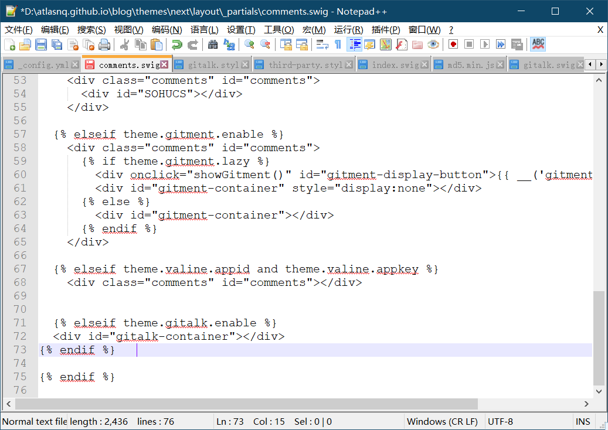
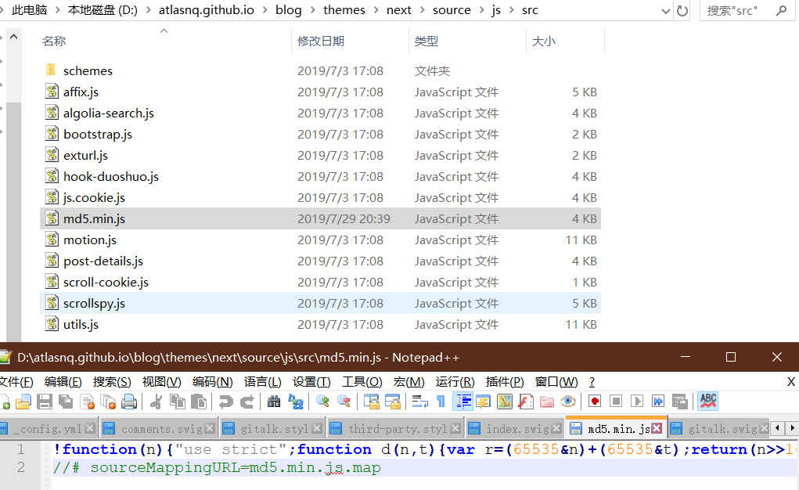
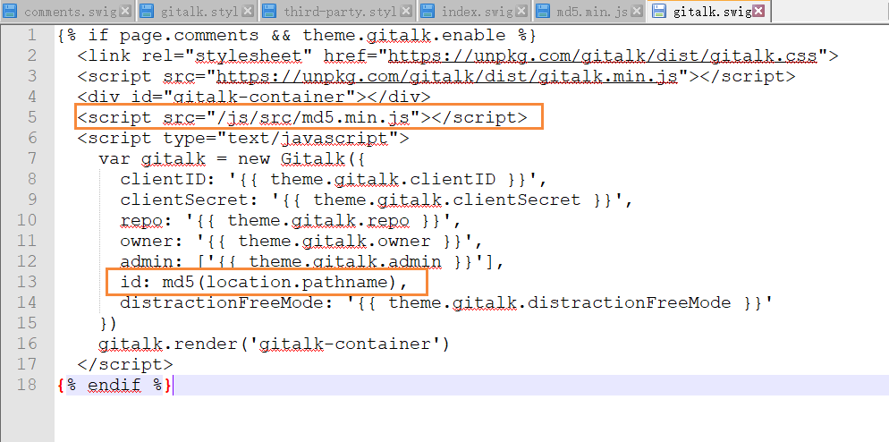

在hexo下的next主题添加gitalk评论，第一部分为初步配置，第二部分是我踩过的坑。 

<!--more-->

# 配置

## Register Application

在GitHub上注册新应用，链接：<https://github.com/settings/applications/new>

填些时注意：

Application name：guestbook # 我新建了一个名为guestbook的Repositories来存放这些Issues。
Homepage URL： # 网站URL，如`https://atlasnq.github.io/`
Application description # 描述，随意
Authorization callback URL：# 网站URL，`https://atlasnq.github.io/`

点击确定后会跳转到一个页面，记录 `client id`和`secret`


## `gitalk.swig`

新建`/layout/_third-party/comments/gitalk.swig`文件，并添加内容：

```

  <link rel="stylesheet" href="https://unpkg.com/gitalk/dist/gitalk.css">
  <script src="https://unpkg.com/gitalk/dist/gitalk.min.js"></script>
  <div id="gitalk-container"></div>
  <script src="/js/src/md5.min.js"></script>
  <script type="text/javascript">
    var gitalk = new Gitalk({
      clientID: '{{ theme.gitalk.clientID }}',
      clientSecret: '{{ theme.gitalk.clientSecret }}',
      repo: '{{ theme.gitalk.repo }}',
      owner: '{{ theme.gitalk.owner }}',
      admin: ['{{ theme.gitalk.admin }}'],
      id: md5(location.pathname),
      distractionFreeMode: '{{ theme.gitalk.distractionFreeMode }}'
    })
    gitalk.render('gitalk-container')
  </script>

```

## comments.swig

修改`/layout/_partials/comments.swig`，添加下面内容：

```

  <div id="gitalk-container"></div>
 
```



## index.swig

修改`layout/_third-party/comments/index.swig`，在最后一行添加内容：

```

```


## gitalk.styl

新建`/source/css/_common/components/third-party/gitalk.styl`文件，添加内容：

```
.gt-header a, .gt-comments a, .gt-popup a
  border-bottom: none;
.gt-container .gt-popup .gt-action.is--active:before
  top: 0.7em;
```


## third-party.styl

修改`/source/css/_common/components/third-party/third-party.styl`，在最后一行上添加内容，引入样式：

```
@import "gitalk";
```


## _config.yml

在主题配置文件`next/_config.yml`中添加如下内容：

```
gitalk: 
  enable: true   
  clientID: Client ID   
  clientSecret: Client Secret
  repo: # 仓库名称 例：guestbook  # 如果想用一个新的仓库存储Issues的话，可以写这个，与OAutu设置名称一致
  owner: # github帐号 # 指定可初始化评论账户  例如 atlasnq
  admin: # github帐号 # 指定可初始化评论账户  例如 atlasnq
  distractionFreeMode: true  
```

以上为Next主题下gitalk评论的配置，第二部分为自己实践中遇到的问题。


# 问题

## 问题一：gitalk无法登录github,重定向到主页

参考<https://github.com/gitalk/gitalk/issues/102>初步检查一下，总结一下，有可能配置写错了，还有可能就是你的链接是有问题的，我当时犯的错误是我原本的url链接中是含有空格的，改成空格后这个问题就解决了。

## 问题二：gitalk Error: Validation Failed.

当把问题一解决后每一秒，就发现我有的文章出现了新的问题Error: Validation Failed. 现在[Issues](https://github.com/gitalk/gitalk/issues/102)浏览了一会儿，解决这个问题的简单的一个办法是通过md5加密来 `github issue lables 50 字符`限制。

1. 打开<https://www.bootcdn.cn/blueimp-md5/>点击`复制<script>标签`完成对这个js的复制，在next主题文件夹下的`source\js\src`目录下新建名字为`md5.min.js`的文件后，粘贴。

   

2. 接下来在`layout/_third-party/comments/gitalk.swig`配置文件中修改或添加代码 `<script src="/js/src/md5.min.js"></script>`和 `id: md5(location.pathname),`

   

