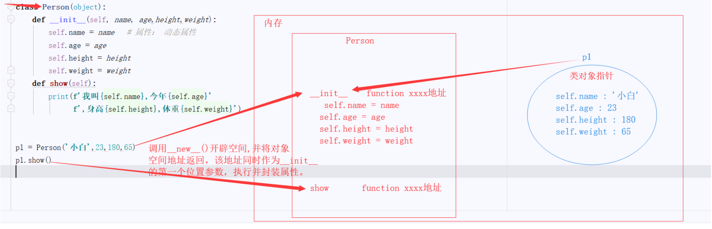

文章第一部分介绍了什么对象，对象有什么优点（多态，封装，继承）以及什么时候要使用对象；第二部分从类的结构入手，说明它的语法规则；第三部分介绍了类与对象的名称空间；第四部分介绍类与类之间的关系；第五部分再次谈到继承涉及多继承的顺序、抽象类等规范化开发；第六部分谈谈类中的双下划线方法和用到的一些内置函数；最后一部分是对概念，面向对象设计的总结。本文参考了《Python基础教程》《Python核心编程》。 

<!-- more -->

# 面向对象 

创建自定义对象（尤其是对象类型或类）是一个Python核心概念，这个概念非常重要，以至于Python与Smalltalk、C++、Java等众多语言一样，被视为一种面向对象的语言。

## 对象魔法

- 在面向对象编程中，术语**对象**大致意味着一系列**数据（属性）**以及一套访问和操作这些数据的**方法**。
- 使用对象的最重要的好处。：
  1. 多态：可对**不同类型的对象执行相同**的操作，而这些操作就像“被施了魔法”一样能够正常运行。 
  2. 封装：**对外部隐藏**有关对象工作原理的细节。 
  3. 继承：可基于通用类创建出专用类。

## 多态

- 术语多态（polymorphism）源自希腊语，意思是“有多种形态”。这大致意味着即便你不知道变量指向的是哪种对象，也能够对其执行操作，且操作的行为将随对象所属的类型（类）而异。 

- 例子：假设你要为一个销售食品的电子商务网站创建在线支付系统，程序将接收来自系统另一部分（或之后设计的类似系统）的购物车。因此你只需计算总价并从信用卡扣除费用即可。 

  ​	你首先想到的可能是，指定程序收到商品时必须如何表示。例如，你可能要求用元组表示收到的商品，如下所示：

   `('SPAM', 2.50)` 

  ​	但当价格可能存在一个变动的时候（打折），简单的元组就不够用了，再来一个神奇的网络方法吧，它可以得到变动后的价格。

  ```python
  # 不要像下面这样做： 
  def get_price(object):  
      if isinstance(object, tuple):     
  		return object[1]    
  	else:  
  		return magic_network_method(object)
  ```
> 注意：这里使用`isinstance`来执行类型/类检查旨在说明：使用类型检查通常是馊主意，应尽可能避免。  
>
> 补充：①要破坏多态，唯一的办法是使用诸如type、issubclass、isinstance等函数显式地执行类型检查，但你应尽可能避免以这种方式破坏多态。我们的**目标**是：<u>对象按你希望的那样行事，而非它是否是正确的类型（类）</u>。
>
> ​            ②这里讨论的多态形式是Python编程方式的核心，有时称为**鸭子类型**。这个术语源自如下说法：“<u>如果走起来像鸭子，叫起来像鸭子，那么它就是鸭子。</u>”   

>
  > 鸭子类型：<u>所有的类型制定了规范</u>（如不同的类有相同的方法名，如len方法的本质，含有 `__len__`方法的类，这样我们使用len(对象)就可以得到不同类型对象的长度）。
>
  > （另一种多态是从继承表现出来的）

  ​	前面的代码使用函数`isinstance`来检查object是否是元组。如果是，就返回其第二个元素， 否则调用一个神奇的网络方法。 

  ​	如果网络方法已就绪，问题就暂时解决了。但这种解决方案还是不太灵活。如果有位程序员很聪明，决定用十六进制的字符串表示价格，并将其存储在字典的'price'键下呢？没问题，你<u>只需更新相应的函数</u>。 

  ```python
  # 不要像下面这样做： 
  def get_price(object):  
  	if isinstance(object, tuple):     
  		return object[1]    
  	elif isinstance(object, dict):     
		return int(object['price'])    
  	else:  
		return magic_network_method(object) 
  ```

  ​	你确定现在考虑到了所有的可能性吗？①平时的想法就是那我就继续增加分支呗。

  ​	假设有人决定添加一种新字典，并在其中将价格存储在另一个键下，你该如何办呢？当然，可再次更新get_price，每当有人以不同的方式实现对象时，②你都需要重新实现你的模块。

  - **小结**：面向过程处理这种情况需要：

    ① 当有新的类型的数据时可以增加分支
  
    ② 当这个类型的数据发生变化时，更改原来对于这个类型数据的处理方法（get_price）
  
  - **解决方法**：让对象自己去处理这种操作，每种新对象都能够获取或计算其价格并返回结果，而你只需向它们询问价格即可。这正是多态（从某种程度上说还有封装）的用武之地。 

## 多态和方法 

- 你收到一个对象，却根本不知道它是如何实现的——它可能是众多“形态”中的任何一种。 你只知道可以询问其价格，但这就够了。至于询问价格的方式，你应该很熟悉。 

  ```python
  object.get_price()
  ```

  像这样<u>与对象属性相关联的函数称为方法</u>。

- 抛开这个例子回顾以前，我们以前也见到很多多态的例子：

  ```python
  >>> 'abc'.count('a') 
  1 
  >>> [1, 2, 'a'].count('a') 
  1
  ```

  ​	如果有一个变量x，你无需知道它是字符串还是列表就能调用方法count：只要你向这个方法提供一个字符作为参数，它就能正常运行。 

- 多态形式多样 （处处皆多态）

  每当无需知道对象是什么样的就能对其执行操作时，都是多态在起作用。这不仅仅适用于<u>方法</u>，我们还通过<u>内置运算符和函数</u>大量使用了多态。请看下面的代码： 

  ```python
  >>> 1 + 2 
  3 
  >>> 'Fish' + 'license' 
  'Fishlicense' 
  ```

  上述代码表明，加法运算符（+）既可用于数（这里是整数），也可用于字符串（以及其他类 型的序列）。 本质上是因为再int类，str类中定义了`__add__`方法。

  ​	我们通常定义的函数：

  ```python
  def add(x, y):     
  	return x + y 
  # 当然这里有一个小细节就是x和y应该是相同的类。如 1 + '1'就会报错
  ```

  ​	这也许有点傻，但重点在于参数可以是<u>任何支持加法的对象</u>。很多函数和运算符都是多态的，你编写的大多数函数也可能如此，即便你不是有意为之。每当你使用多态的函数和运算符时，多态都将发挥作用，这也体现了**处处是多态**。

- 小结：

  - 以上讨论的多态形式是Python编程方式的核心，有时称为鸭子类型。为了遵守某种规则/协议，我们定义了xx方法。
  - 多态让你<u>无需知道对象所属的类（对象的类型）就能调用其方法</u>，这也是我们在面向对象思考的一个套路。

## 封装

- **封装（encapsulation）**指的是向外部隐藏不必要的细节。这听起来有点像多态（无需知道对象的内部细节就可使用它）。这两个概念很像，因为它们都是**抽象的原则**。它们都像函数一样， 可帮助你处理程序的组成部分，让你无需关心不必要的细节。

  ​	但封装不同于多态。多态让你无需知道对象所属的类（对象的类型）就能调用其方法，而封装让你无需知道对象的构造就能使用它。听起来还是有点像？下面来看一个使用了多态但没有使用封装的示例。假设你有一个名为OpenObject的类

  ```python
  >>> o = OpenObject() # 对象就是这样创建的 
  >>> o.set_name('Sir Lancelot') 
  >>> o.get_name() 
  'Sir Lancelot' 
  ```

  ​	你（通过像调用函数一样调用类）创建一个对象，并将其关联到变量o，然后就可以使用方法set_name和get_name了（假设OpenObject支持这些方法）。一切都看起来完美无缺。然而，如果 o将其名称存储在全局变量global_name中呢？ 

  ```python
  >>> global_name 
  'Sir Lancelot'
  ```

  ​	这意味着使用OpenObject类的实例（对象）时，你需要考虑global_name的内容。事实上，必 须确保无人能修改它。

  ```python
  >>> global_name = 'Sir Gumby' 
  >>> o.get_name() 
  'Sir Gumby'
  ```

  ​	如果尝试创建多个OpenObject对象，将出现问题，因为它们共用同一个变量。 （全局变量/类中的静态变量）

  ```python
  >>> o1 = OpenObject() 
  >>> o2 = OpenObject() 
  >>> o1.set_name('Robin Hood') 
  >>> o2.get_name() 
  'Robin Hood'
  ```

  ​	如你所见，设置一个对象的名称时，将自动设置另一个对象的名称。这可不是你想要的结果。
   基本上，你希望对象是抽象的：当调用方法时，无需操心其他的事情，如避免干扰全局变量。 如何将名称“**封装**”在对象中呢？没问题，将其作为一个**属性**即可。 

  - 小结：上面提到的是类的静态变量出现的问题，为了避免共用，我们使用**封装**的思想，将其作为对象的属性。

  - **封装：将一些东西内容封装到一个地方，你还可以取出来使用**。

    这样的话：

  ```python
  >>> o1 = ClosedObject() 
  >>> o2 = ClosedObject() 
  >>> o1.set_name('小白') 
  >>> o2.set_name('小黑') 
  >>> o1.get_name() 
  '小白'
  >>> o2.get_name() 
  '小黑'
  ```

  ​	'小白'这个名称还在！因为对象有了自己的**状态**。对象的的状态由其属性（如名称）描述。对象的方法可能修改这些属性，因此对象将一系列函数（方法）组合起来，并赋予它们访问一些变量（属 性）的权限，而属性可用于在两次函数调用之间存储值。 

- 小结：当我们只使用多态而不是用封装，我们会出现问题（全局变量/类的静态变量，共用，一改都改）。封装的思想可以做的真正的隔离，如对象的属性。

  


## 继承

继承是另一种偷懒的方式（这里是褒义）。程序员总是想避免多次输入同样的代码。可以通过创建函数来达成这个目标，但现在要解决一个更微妙的问题。如果你已经有了一个类，并要创建一个与之很像的类（可能只是新增了几个方法），该如何办呢？创建这个新类时，你不想复制旧类的代码，将其粘贴到新类中。所以我们使用继承。


# 类

## 类到底是什么？

- 类/类型——一种对象。每个对象都属于特定的类，并被称为该类的**实例**。 

  例如，如果你在窗外看到一只鸟，这只鸟就是“鸟类”的一个实例。鸟类是一个非常通用（抽 象）的类，它有多个子类：你看到的那只鸟可能属于子类“云雀”。你可将“鸟类”视为由所有鸟组成的集合，而“云雀”是其一个子集。一个类的对象为另一个类的对象的子集时，前者就是后者的子类。因此“云雀”为“鸟类”的**子类**，而“鸟类”为“云雀”的**超类**。 

> 注意 在英语日常交谈中，使用复数来表示类，如birds（鸟类）和larks（云雀）。在Python中， 约定使用单数并将首字母大写，如Bird和Lark。 

> 注意 在较旧的Python版本中，类型和类之间泾渭分明：内置对象是基于类型的，而自定义对象是基于类的。因此，你可以创建类，但不能创建类型。在较新的Python 2版本中，这种差别不那么明显。在Python 3中，已不再区分类和类型了。

## 创建自定义类

创建自定义类

```python
# 创建一个类，里面拥有完整的结构：静态变量，动态变量，私有变量，类方法，绑定方法，静态方法，property属性。
class Person(object):
    def __init__(self, name, age,height,weight):
        self.name = name   # 属性： 动态变量
        self.age = age
        self.height = height
        self.weight = weight
    def show(self):
        print(f'我叫{self.name},今年{self.age},身高{self.height},体重{self.weight}')
    @property              # property属性
    def bmi(self):
        '''bmi指数（体脂） = kg / m ^ 2'''
        return self.weight / (self.height**2)

class Student(Person):
    daily = '学习'  		   
    __num = 0			    # 属性： 私有变量 

    def __init__(self, name, age,height,weight, grade):
        Person.__init__(self,name,age,height,weight)     # 在子类的方法中调用父类的方法 :父类名.方法名(self,)
        self.grade = grade
    def show(self):          # 方法:动态方法
        print(f'{self.name}今年{self.age}岁，是{self.grade}的一名学生')
    @classmethod			 # 类方法
    def addNum(cls):  		
        cls.__num += 1
    @classmethod
    def getNum(cls):
        return cls.__num
    @staticmethod            # 静态方法
    def homework():
        print('学生得做家庭作业')


s1 = Student('小白',18,1.8,60,'高三')   # 实例/对象
print(s1.__dict__)          # 打印s1对象的所有属性
s1.show()                   # 对象s1调用show方法
print(s1.bmi)               # 使用property装饰器使这个方法变成特殊的属性
Student.addNum()            # 类调用addNum方法。由于类成为调用者会更符合逻辑，使用classmethod装饰器装饰，使之成为类方法。
print(Student.getNum())     # 得到班级人数，因为__num是私有变量，所以需要定义getNum类方法。
Student.homework()          # 使用staticmethod装饰器装饰，使之成为静态方法，静态方法是一个独立的，单纯的函数。
```

​	这个例子包含静态变量，动态变量，私有变量，类方法，绑定方法，静态方法，property属性等全部语法。

​	不要慌，虽然是这么多，但总体分为两类，一类是属性，一类是方法。接下来就是对属性与方法的详细阐述，但始终是这两大类，只不过角度略有不同。

### 从类名的角度使用类	

```python
class Person(object):
    def __init__(self, name, age,height,weight):
        self.name = name   # 属性： 动态变量
        self.age = age
        self.height = height
        self.weight = weight
    def show(self):
        print(f'我叫{self.name},今年{self.age},身高{self.height},体重{self.weight}')


class Student(Person):
    daily = '学习'
    __num = 0			    # 属性： 私有变量

    def __init__(self, name, age,height,weight, grade):
        Person.__init__(self,name,age,height,weight)     # 在子类的方法中调用父类的方法 :父类名.方法名(self,)
        self.grade = grade
    def show(self):          # 方法:动态方法
        print(f'{self.name}今年{self.age}岁，是{self.grade}的一名学生')
    @classmethod			 # 类方法
    def addNum(cls):
        cls.__num += 1
    @classmethod
    def getNum(cls):
        return cls.__num
    @staticmethod            # 静态方法
    def homework():
        print('学生得做家庭作业')
s1 = Student('小白',18,1.8,60,'高三')   # 实例/对象
print(s1.__dict__)          # 打印s1对象的所有属性
s1.show()                   # 对象s1调用show方法
Student.addNum()            # 类调用addNum方法。由于类成为调用者会更符合逻辑，使用classmethod装饰器装饰，使之成为类方法。
print(Student.getNum())     # 得到班级人数，因为__num是私有变量，所以需要定义getNum类方法。
Student.homework()          # 使用staticmethod装饰器装饰，使之成为静态方法，静态方法是一个独立的，单纯的函数。
```


### 类名调用类中的属性(类名.属性)

```python
print(Student.daily)
# 学习
```

#### 特殊的类属性

对任何类C，下表显示了类C的所有特殊属性：

|     类属性     |            解释             |
| :------------: | :-------------------------: |
|  `C.__name__`  |     类C的名字（字符串）     |
|  `C.__doc__`   |       类C的文档字符串       |
|  `C.__base__`  |   类C的所有父类构成的元组   |
|  `C.__dict__`  |          类C的属性          |
| `C.__module__` |      类C定义所在的模块      |
| `C.__class__`  | 实例C对应的类（仅新式类中） |


### 类名调用对象方法

```python
p = Person('小白'，23，180，65)
Person.show(p)
```

它体现了一种**绑定（binding）**的效果，没有实例，方法不能够被调用。

①方法必须绑定(到一个实例)才能直接被调用（对象.方法）

②非绑定的方法可能可以被调用，但**实例对象**一定要**明确给出**，才能调用成功。

### 类方法（类名.类方法）

```python
Student.addNum()
print(Student.getNum())
# 1
```

- `__num`是一个私有变量，只能在类的内部访问，设置它是为了统计班级的人数，所以将其设置为类的一个属性，接着通过类调用`addNum`方法，实现班级人数加一，然后通过`getNum()`打印班级人数。

#### what

- 使用`classmethod`**装饰器**装饰的，第一个参数`cls`表示**类对象**。

#### how

- 类方法是通过装饰器`classmethod`装饰实现的，没有这个装饰器，类是不能调用绑定方法的，只能对象去调用绑定方法。

#### where

①类方法的存在是为了更有逻辑（有时候类名比对象名更适合作为主体，如上面的student的人数，比个体更合适）。

②不需要实例化，类方法通常用来对类属性的引用或修改。

③ `__new__`方法中，第一个参数就是cls

④ 使用@classmethod多态性构造对象 （effective-python中）

​		也就是怎么可以不通过`__init__`方法来实现类似于重载的构造方法的体现。


### 静态方法（类名.静态方法）

```python
Student.homework() 
# 学生得做家庭作业
```

#### what

- 静态方法就是一个<u>普通的函数</u>，只是碰巧在类的定义体中，而不是在模块层定义。

#### how：

- 使用`staticmethod`装饰器进行装饰，且不需要第一位置参数。

#### where

①不必实例化的时候可以考虑。

②在没有继承的情况下是可以与`classmethod`互换使用的，当这个类被继承了成为基类，然后基类因为某些原因被删除了，那么它们就不能互换使用了，而且类方法会比静态方法更合适，静态方法可能报错。

```python
class p:
    name = '小白'
    @classmethod
    def cl(cls):
        print(cls.name)
    @staticmethod
    def sta():
        print(p.name)
class p1(p):
    pass

p1.cl()
p1.sta()
del p
p1.cl()     #  小白
p1.sta()    # 报错     NameError: name 'p' is not defined
```

注意：静态方法本质上是函数：

```python
from types import MethodType
print(isinstance(obj.func1,MethodType))  # True
```


### 函数与方法的区别

判断一：

- 函数：全都是显性传参
- 方法：**隐性传参**

判断二:

利用types模块类中的FunctionType类和MethodType类

```python
from types import FunctionType
from types import MethodType
class A:
    def func(self):pass
    @staticmethod
    def func1():pass

# 类名调用类的静态方法就是一个函数
print(isinstance(A.func1,FunctionType))  # True
obj = A()
# 对象调用静态方法， 实际上成为静态函数
print(isinstance(obj.func1,FunctionType))  # True
```


# 实例化对象

## 实例化对象发生了三件事

```python
obj = Student() # 实例化一个对象
# obj称为对象，实例
```

1. 调用 `__new__`方法在内存中创建一个对象空间，并返回地址。
2. 将对象空间传给self参数，自动执行 `__init__`方法。
3. 执行 `__init__`方法时，给对象空间封装其属性。


## 对象调用对象的属性（对象.属性）

增、删、查、改

```python
class Student:
    '''此类是构建学生类'''
    daily = '学习'     # 属性：静态属性
    def __init__(self,name,sex):
        self.name = name
        self.sex = sex

s1 = Student('小黑','未知')
# 查询
print(s1.name)
# 删
del s1.sex
print(s1.__dict__)
# 增
s1.sex = '男'
# 改
s1.sex = '女'
```

注意：如果<u>删的这个属性在对象空间中不存在则会报错</u>，它不会去操作类空间中的属性。


## 对象调用类中的属性

1. 一边情况下，对象可以引用类中的属性（类中不存在同名属性），但是不可以修改，因为修改相当于在对象的属性中进行增加。

2. 特殊情况：

   - 当属性变量是可变数据类型，才能在类中间接的改变。

   ```python
   class Student:
       '''此类是构建学生类'''
       daily = '学习'     # 属性：静态属性
       examination = '考试'
       li = []
       def __init__(self,name,sex):
           pass
   
   s1.li.append(2)
   print(s1.li)   		# [2]
   print(s1.__dict__)	# {'name': '小黑', 'sex': '女'}
   print(Student.li)	# [2]
   ```


## 对象调用类中的方法（对象.绑定方法）

```python
s1 = Student('小白',18,1.8,60,'高三')   # 实例/对象
print(s1.__dict__)          # 打印s1对象的所有属性
s1.show()                   # 对象s1调用show方法
```


- 对象的方法也称绑定方法或方法。为什么称为绑定？因为在定义中，我们给第一个位置参数传对象的空间地址，这样产生了一种绑定关系，所以称之为绑定方法。self是约定俗成的。它只需要占据第一个位置参数就行。	
- 使用方法可以访问，操作属性。


## property属性

```python
class Person(object):
    def __init__(self, name, age,height,weight):
        self.name = name   # 属性： 动态变量
        self.age = age
        self.height = height
        self.weight = weight
    @property              # property属性
    def bmi(self):
        '''bmi指数（体脂） = kg / m ^ 2'''
        return self.weight / (self.height**2)
p1 = Person('小白',23,1.8,65)
print(p1.bmi)
```

### why

- 像体脂这样的**名词**，我们逻辑上更愿意像使用属性的方式去使用它，所以就产生了这种用法。

### how

- 加上@property装饰器后，将方法伪装成属性使用，在调用这个方法的时候就可以不用加括号直接得到返回值。

- 设置属性的另一种写法

  property是一个类，通过实例化对象产生属性。

```python
class Foo:
    def get_AAA(self):
        print('get的时候运行我啊')

    def set_AAA(self,value):
        print('set的时候运行我啊')

    def delete_AAA(self):
        print('delete的时候运行我啊')
    AAA=property(get_AAA,set_AAA,delete_AAA) #内置property三个参数与get,set,delete一一对应

f1=Foo()
f1.AAA
f1.AAA='aaa'
del f1.AAA
```

- 注意：装饰的这个方法，不能有参数。

### where

- 第一个场景：将方法伪装成属性
- 第二个场景：和私有属性合作，只能看不能改，用装饰的这种方式，让人只能看不能改。
- 第三个场景：能修改，但必须得符合我的逻辑。

所以property常用来替代私有属性以及访问私有属性的方法。


### @方法名.setter

进一步伪装--->可以修改,删除这个属性

再加一个装饰器 @方法名.setter

这么做的目的在于，要求符合自己的要求才能改，增加容错能力。

三部曲：
1. 必须有这个方法
2. @方法名.setter
3. 再次定义同名方法，它只能接受除self外的一个参数。

```python
# 例子
class p:
    name = '小白'
    @property
    def cl(self):
        return p.name
    @cl.setter
    def cl(self,na):
        p.name = na
    @cl.deleter
    def cl(self):
    	print('我执行啦')
    	del p.name

p1 = p()
print(p1.cl)
p1.cl = '小黑'
print(p1.cl)
```

### @方法名.deleter

增加了删除属性的能力：

- @方法名.deleter

  ```python
  del p1.name
  并不能真的删除什么，只是调用了对应的被@price.deleter装饰的方法而已。
  ```

  

## 结论

1. 类就像一个模板，它可以实例化多个对象。
2. 对于方法和属性来说，它有两个角度，一个是类一个是对象，类可以使用静态属性或私有变量，类可以调用类方法和静态方法；对于对象来说，对象可以使用静态属性，动态属性，私有属性等全部属性。对象也可以调用类方法，静态方法，绑定方法等全部。


# 类的名称空间

下面两条语句大致等价： 

```python
def foo(x): return x * x 

foo = lambda x: x * x
```

​	它们都创建一个返回参数平方的函数，并将这个函数关联到变量foo。可以在全局（模块）作用域内定义名称foo，也可以在函数或方法内定义。定义类时情况亦如此：<u>在class语句中定义的代码都是在一个特殊的命名空间（类的命名空间）内执行的，而类的所有成员都可访问这个命名空间。</u>类定义其实就是要执行的代码段。

类的命名空间：

​	第一部分：静态变量

​	第二部分：方法、函数

对象的空间：

​	类指针，存储了类所在的内存地址。

​	动态属性

对象和类的关系:
    单向作用（类指针）：这个单向是从对象到类是一个单项的过程，不能从类引用对象里的属性。



​	`__init__()`是在解释器为你创建一个实例后调用的第一个方法。

​	调用父类的`__new__()`来创建对象`__new__()`必须返回一个合法的实例，这样解释器在调用`__init__()`时，就可以把这个实例作为self参数传给它。

​	

# 类与类之间的关系

​	一个类被定义后，目标就是要将它当成一个模块来使用，并且把这些对象嵌入到你的代码中去，同其它数据类型及逻辑执行流混合使用。有两种方法可以在你的代码中利用类。第一种是**组合**（composition）。就是让不同的类混合并加入到其他类中来<u>增加功能和代码重用性</u>。另一种方法是通过**派生**。


## 组合（合成）

一个类的对象是另外一个类对象的属性

- 对象变成了另一个对象的一个属性 （这就在一个类和其它组成类之间定义了一种“有一个”（has-a）的关系）
- 所有的对象关联这个对象，这样可以方便修改。

例子：基于圆形类实现一个圆环类,要求接收参数是外圆半径和内圆半径。

```python
from math import pi
class Circle():
    def __init__(self,r):
        self.r = r
    def area(self):
        return pi*self.r**2        # 面积这个因该是源于Circle的， 而圆环只是利用了圆
    def perimeter(self):
        return 2*pi*self.r


class Circular():
    def __init__(self,ci,co):
        ci,co = (co, ci) if ci>co else (ci ,ci)
        self.c_inner = Circle(ci)
        self.c_outer = Circle(co)

    def area(self):
        return self.c_outer.area() - self.c_inner.area()
    def perimeter(self):
        return self.c_outer.perimeter() + self.c_inner.perimeter()
```

本题考察了含有重叠部分的两个类时，我们该如何设计，以及这样设计的优点。
1. 实例化要放在init里，
2. 当我们需要，修改圆的公式时，圆环，圆柱都不需要在修改了，同享这些改变。
3. 同样的方法不要用两次，而使用组合来减少代码的重复率。


### 结论

拿到了对象就像拿到了一切（就像组合中使用的那样）；

一个类的方法只能由此类的对象去调用；

一个类的方法的第一个self只接受此类的对象。

当对象之间有更接近的关系时，派生的概念可能对你的应用程序来说更有意义，特别是当你需要一些相似的对象，但却有少许不同功能的时候。


## 再谈继承

前面提到使用继承是为了解决代码的重复。接下来谈一下继承的语法。

```python
class A:
    pass
class B(A):
    pass
```

上面代码中：B继承A,A是父类,B是子类；A是**父类/基类/超类**B是**子类/派生类**；子类可以使用父类中的: 方法/静态变量。


### 调用过程

```
class Animal:
    def __init__(self,name):
        self.name = name
    def eat(self):
        print('%s is eating'%self.name)

class Cat(Animal):
    def climb_tree(self):
        print('%s is climbing'%self.name)


小白 = Cat('小白')
```

​	上述代码中：先开辟空间,空间里有一个类对象指针指向类Cat。接着调用`__init__`,对象在自己的空间中找`__init__`没找到,到Cat类中找`__init__`也没找到，在找父类Animal中的`__init__`，完成对对象空间属性的封装。

​	当子类和父类的方法重名的时候,我们只使用子类的方法,而不会去调用父类的方法了；<u>当子类想调用父类的同名方法</u>时：

- 方法一：父类名.方法名(self,)

- 方法二：super(子类名,self).方法名()

- 方法二的简写：super().方法名()

- 注意：方法二是在继承的前提下。

```
例子：
class Animal:
    def __init__(self,name,food):
        self.name = name
        self.food = food
        self.blood = 100
        self.waise = 100
    def eat(self):
        print('%s is eating %s'%(self.name,self.food))
 

class Cat(Animal):
    def eat(self):
        self.blood += 100
        # 方法一
        Animal.eat(self)      # 子类调用父类的同名方法
        # 方法二：
        super(Cat,self).__init__()
        # 简写	**推荐				
        super().__init__()
    def climb_tree(self):
        print('%s is climbing'%self.name)
        self.drink()

class Dog(Animal):
    def eat(self):
        self.waise += 100
        # 方法一:
        Animal.eat(self)      # 子类调用父类的同名方法
        # 方法二：
        super(Dog,self).__init__()
        # 简写    **推荐
        super().__init__()
    def house_keep(self):
        print('%s is keeping the house'%self.name)
        
小白 = Cat('小白','猫粮')
小黑 = Dog('小黑','狗粮')
小白.eat()
小黑.eat()
print(小白.__dict__)
print(小黑.__dict__)
```


#### 小结

上面提到了继承的语法规则；以及父类和子类方法的选择：

①子类的对象,如果去调用方法，永远优先调用自己的； 

②如果自己有就用自己的方法，自己没有就会用父类的；

③如果自己有还想用父类的 : 直接在子类方法中调父类的方法：父类名.方法名(self)。


## 多继承

单继承就如前面提到的继承的语法规则。但对于多继承就会存在一个继承顺序。


### 知识铺垫：

只要继承object类就是新式类；在py3中不存在，在py2中，不主动继承object的类都是经典类。

在python3 中所有的类都继承object类；python3 中所有的类都是新式类


### 规则

在多继承方面：经典类使用**深度优先**，新式类使用**mro算法**。

MRO列表

1. 事实上，对于你定义的每一个类，Python 会计算出一个**方法解析顺序（Method Resolution Order, MRO）列表**，**它代表了类继承的顺序**，我们可以通过`类名.mro()`得到类继承顺序

2. MRO列表是由 [C3 线性化算法](https://www.python.org/download/releases/2.3/mro/)来实现的，一个类的 MRO 列表就是合并所有父类的 MRO 列表.
   
3. 计算公式：

   表头：列表的第一个元素

   表尾：列表中表头以外的元素集合（可以为空）

   表头，表尾

   [A,B,C] : 表头：A 表尾： [B,C]

   [A] : 表头：A 表尾：[]

   > mro(Child(Base1，Base2)) = [ Child ] + merge( mro(Base1), mro(Base2), [ Base1, Base2] )
   > （其中Child继承自Base1, Base2）
   >
   > 由公式得到列表，再通过下面的merge合并完成得到结果。

   merge合并：

   ```
   如计算merge( [E,O], [C,E,F,O], [C] )
   有三个列表 ：  ①      ②          ③
   
   1 merge不为空，取出第一个列表列表①的表头E，进行判断                              
      各个列表的表尾分别是[O], [E,F,O]，E在这些表尾的集合中，因而跳过当前当前列表
   2 取出列表②的表头C，进行判断
      C不在各个列表的集合中，因而将C拿出到merge外，并从所有表头删除
      merge( [E,O], [C,E,F,O], [C]) = [C] + merge( [E,O], [E,F,O] )
   3 进行下一次新的merge操作 .....
   ```

   补充：也可以在拓扑排序的基础上加上从左到右这个规则进行。

对于新式类继承顺序，使用`类名.mro()`方法进行查看。

### super

- super（）严格意义并不是执行父类的方法（单继承是，多继承是有问题的）

- super是按照self从属类的**mro顺序**，来寻找当前类的下一个类

  ```
  例子：
  class A:
      def f1(self):
          print('in A')
  class Foo(A):
      def f1(self):
          super().f1()
          print('in Foo')
  class Bar(A):
      def f1(self):
          print('in Bar')
  class info(Foo,Bar):
      def f1(self):
          super().f1()
          print('in Info f1')
  a = info()
  print(info.__mro__)     # [info,Foo,Bar,object]
  a.f1()
  #(<class '__main__.info'>, <class '__main__.Foo'>, <class '__main__.Bar'>, <class '__main__.A'>, <class 'object'>)
  in Bar
  in Foo
  in Info f1
  ```

  

- 在py3中不需要传参数，自动帮我们寻找当前类的mro顺序的下一个类中的同名方法。

  - 默认super() , （）里面是(当前类名,self)

- 在py2，新式类中，必须得加参数`super(子类的名字，子类的对象).函数名()`；而且经典类不支持super（因为它都没有mro）

- 例子：

  ```
  在D类中找super的func，那么可以这样写super().func()
  也可以这样写super(D,self).func()(并且在py2中的新式类中必须这样写)
  ```

- 在单继承的程序中，super就是找父类。

- 推荐：是用super来调用父类的方法

  ```
  class A(object):
      def func(self):
          print('in A')
  # class B(A):
  #     super().func()
  # b = B()
  # 上面注释部分会报错    # RuntimeError: super(): no arguments
  class B(A):
      def func(self):
          # super().func() 
          super(B,self).func()    # 这两句是等价的
  b = B()
  b.func()
  ```

  

### 通过继承实现的类的开发规范

**抽象类**：是一个**开发的规范**，**约束它的所有子类必须实现一些和它同名的方法。**（java中的）

方法一：（在父类建立约束）对于同名方法的规范，定义一个父类，如果子类没有这个方法，调用父类中的这种方法，就会主动引起一个错误

- 优点：不依赖于模块
- 推荐的！！！
- 缺点：约束力不够强，只有在使用这个方法的时候才会报错。

例子：

```
支付程序
    微信支付 url连接,告诉你参数什么格式
        {'username':'用户名','money':200}
    支付宝支付 url连接,告诉你参数什么格式
        {'uname':'用户名','price':200}
    苹果支付
class Payment:     # 抽象类
    def pay(self,money):
        '''只要你见到了项目中有这种类,你要知道你的子类中必须实现和pay同名的方法'''
        raise NotImplementedError('请在子类中重写同名pay方法')
        # raise Exception("随便写一点")   

class Alipay(Payment):
    def __init__(self,name):
        self.name = name
    def pay(self,money):
        dic = {'uname':self.name,'price':money}
        # 想办法调用支付宝支付 url连接 把dic传过去
        print('%s通过支付宝支付%s钱成功'%(self.name,money))

class WeChat(Payment):
    def __init__(self,name):
        self.name = name
    def pay(self,money):
        dic = {'username':self.name,'money':money}
        # 想办法调用微信支付 url连接 把dic传过去
        print('%s通过微信支付%s钱成功'%(self.name,money))

class Apple(Payment):
    def __init__(self,name):
        self.name = name
    def pay(self,money):
        dic = {'name': self.name, 'number': money}
        # 想办法调用苹果支付 url连接 把dic传过去
        print('%s通过苹果支付%s钱成功' % (self.name, money))

# aw = WeChat('alex')
# aw.pay(400)
# aa = Alipay('alex')
# aa.pay(400)
# 利用例子类型，实现归一化设计（统一接口）   # 利用反射可以改进
def pay(name,price,kind):
    if kind == 'Wechat':
        obj = WeChat(name)
    elif kind == 'Alipay':
        obj = Alipay(name)
    elif kind == 'Apple':
        obj = Apple(name)
    obj.pay(price                    

pay('alex',400,'Wechat')
pay('alex',400,'Alipay')
pay('alex',400,'Apple')

appa = Apple('alex')
appa.fuqian(500)
```

补充：在我们查看源码时，很多都写着pass，这是在建议我们继承后要写同名方法。

方法二：使用`abc`模块的`ABCMeta`,`abstractmethod`来进行**强约束**。

- 优点：约束力强，对于没有被`@abstractmethod`标记的父类方法，如果子类中不存在这个方法就无法创建

例子：

```
实现抽象类的另一种方式,约束力强,依赖abc模块
from abc import ABCMeta,abstractmethod
class Payment(metaclass=ABCMeta):
    @abstractmethod
    def pay(self,money):
        '''只要你见到了项目中有这种类,你要知道你的子类中必须实现和pay同名的方法'''
        raise NotImplementedError('请在子类中重写同名pay方法')
        

class Alipay(Payment):
    def __init__(self,name):
        self.name = name
    def pay(self,money):
        dic = {'uname':self.name,'price':money}
        # 想办法调用支付宝支付 url连接 把dic传过去
        print('%s通过支付宝支付%s钱成功'%(self.name,money))

class WeChat(Payment):
    def __init__(self,name):
        self.name = name
    def pay(self,money):
        dic = {'username':self.name,'money':money}
        # 想办法调用微信支付 url连接 把dic传过去
        print('%s通过微信支付%s钱成功'%(self.name,money))

WeChat('alex') # 会报错
```


# 类中的常用双下划线方法

双下方法是特殊方法，他是解释器提供的由双下划线加方法名（`__方法名__`）具有特殊意义的方法,双下方法主要是python源码程序员使用的，我们在开发中尽量不要使用双下方法，但是深入研究双下方法，更有益于我们阅读源码。


## `__new__`构造方法

回顾之前实例化的三步走并进行补充：

- 先创建一块对象的空间，有一个指针能指向类  ——> 它是由`__new__`方法完成的。
- 在调用init

该方法需要cls也就是类对象（有了类对象才能开辟对象空间）

```
# 创造并返回一个新对象
class A:
    def __init__(self):
        print('in __init__')
    def __new__(cls, *args, **kwargs):    # 将类名A给了cls
        print(cls)
        print('in __new__')
        # object1 = object.__new__(cls)	  # 两种方法都可以，但一定要显示传cls
        object1 = super().__new__(cls)
        return object1

obj = A()
# 类名（） 先触发__new__并且将类名自动传给cls。
print(obj)
```


### 单例模式

一个类从头到尾只会实例化一次（只创建一次self的空间）。

这个类的对象不是个性的，主要是实例化对象之后去执行类中的方法。

节省内存！

```
class Baby:
    __instance = None    # 类似flag  存放的是开的那块空间的地址
    def __new__(cls, *args, **kwargs):
        if cls.__instance is None:
            cls.__instance = super().__new__(cls)
        return cls.__instance
    def __init__(self,cloth,pants):
        self.cloth = cloth
        self.pants = pants
b1 = Baby('红毛服','绿皮裤')
b2 = Baby('白衬衫','黑豹纹')
print(b1)
print(b2)
```

上述代码是一个单例模式，关键在于只需要调用一次 `__new__`方法，所以我们借助flag完成单例模式的设计。

另一种单例（模块导入的方式）：

```
单例.py
class Baby:
    def __init__(self,cloth,pants):
        self.cloth = cloth
        self.pants = pants
baby = Baby('红毛服','绿皮裤')

内容.py
from 单例 import baby
print(baby)   # 用模块的方式会认为是最简单的。 因为模块的导入是一次性的。
```


## `__del__`析构方法

调用del x 不表示调用了 `x.__del__()`——它只是减少了x的引用计数，当引用计数为0的时候会自动调用 `__del__()`子类没有就调用父类的。

```
class A:
    def __del__(self):
        print('执行__del__')
a1 = A()
a2 = a1
a3 = a1
del a1
del a2
del a3

# print结果 
执行__del__
```


## `__call__` 

callable(对象)    用来判断这个对象能不能运行。

对象（）调用的是 `__call__`方法下面的逻辑。

```
class A:
	def __call__(self):
		print('-------')
#方式一：
A()()
#方式二：
a = A()
a()
```


## `__len__`

len(对象)  能不能计算对象的长度，就看对象里有没有定义 `__len__`方法。

```
lst = [1,2,3]
def len(obj):
	return obj.__len__
print(lst.__len__)
print(len(obj))
```

len(对象) 需要实现这个类中的 `__len__`方法。

## `__str__`

1. 当你想打印对象，%s拼接对象，str（对象）的时候，必须在类内定义一个 `__str__`方法，才能在打印对象的时候，打印想要的内容，而不是内存地址。

```
lst = [1,2,3]
print(lst)   		# 如果没有这个方法，返回的是内存地址

print('你好，再见')   # 如果没有这个方法，返回的是内存地址
```

2. 只能返回 str数据类型。

3. 当打印对象，%s拼接对象，str（对象）的时候,我们总是调用这个对象的 `__str__`方法，如果找不到就调用 `__repr__`方法。

## `__repr__`

1. `__repr__`不仅是 `__str__`的替代品，还有自己的功能

2. 用 %r占位或repr(对象)的时候，总是调用`__repr__`方法。

3. str与repr的关系：
   - 帮助我们在打印，展示对象的时候更直观的显示对象的内容
   - str打印对象，%s拼接对象，str（对象）的时候使用。
   - repr是str的备胎，同时还和%r 和repr 有合作关系。
   - str范围更大一些，repr更精准，范围更小


## `__item__ 系列`

对对象进行类似于字典的操作

```
class Foo:
    def __init__(self,name):
        self.name = name
    def __getitem__(self, item):
        print('get时执行我了')
        return self.name     	# 设置返回值，才能查的到
    def __setitem__(self, key, value):
        print(key,type(key))
        setattr(self,key,value)	# 使用反射修改对象的属性
        print('set时执行我')
    def __delitem__(self, key):
        print('del时执行我')

a = Foo('御姐')
a['name']
a['name'] = '萝莉'
print(a.name)
del a['name']
```


## `__enter__与__exit__`

对一个对象类似于进行**with语句上下文管理**的操作，必须在类中定义 __enter__ __exit__ ， 在__enter__这个方法中必须设置返回值，它将对象返回给obj。

```
class A:
    def __init__(self,name):
        self.name = name
    def __enter__(self):
        print('执行__enter__')
        print(self.__dict__)
        return self    # 将对象返回给obj
    def __exit__(self, exc_type, exc_val, exc_tb):
        print('执行__exit__')

with A('小黑') as obj:
    print(obj.name)
    # print(obj)
```


## `__iter__`可迭代对象

```
class A:
    # 将一个对象设置成一个可迭代对象
    def __iter__(self):
        yield 1
        yield 2
obj = A()
# 1.for内部将可迭代对象转换成迭代器
for i in obj:
    print(i)

# 2.手动将可迭代对象转换成迭代器
o = iter(obj)
print(next(o))

# 3.转换成列表
print(list(obj))
print(list(obj)[0])
```


## `__hash__`与 `__eq__` 

```
class A:
    def __init__(self,name,count):
        self.name = name
        self.count = count
    def __hash__(self):
        print(f'{self.name}调用了哈希方法')
        # return hash(id(self))
        return hash(self.count)
    def __eq__(self, other):
        print(f'{self.name}调用了eq方法')
        if self.__dict__ == other.__dict__:
            return True
        else:
            return False
a1 = A('a1',1)
a2 = A('a2',2)
a3 = A('a2',2)
a4 = A('a4',2)
ls = [a1,a2,a3,a4]
print(set(ls))
```

set()函数的实现机制：

- 当两个变量的哈希值不相同时，就认为这两个变量是不同的。
- 当两个变量哈希值一样时，调用`__eq__`方法，当返回值为True时认为这两个变量是同一个，应该去除一个。返回FALSE时，不去重。


## 使用过的函数

|              函数               |                     描述                     |
| :-----------------------------: | :------------------------------------------: |
|        callable(object)         | 判断对象是否是可调用的（如是否是函数或方法） |
| getattr(object, name[,default]) |         获取属性的值，还可提供默认值         |
|      hasattr(object, name)      |           确定对象是否有指定的属性           |
|    isinstance(object, class)    |        确定对象是否是指定类的**实例**        |
|        issubclass(A, B)         |            确定A是否是B的**子类**            |
|  setattr(object, name, value)   |        将对象的指定属性设置为指定的值        |
|          type(object)           |                返回对象的类型                |

## 元类type

按照Python的一切皆对象理论，类其实也是一个对象，那么类这个对象是从哪里实例化出来的呢？

```
print(type([1,2,3]))
print(type(list))
# <class 'list'>
# <class 'type'>
```

type元类是获取该对象从属于的类,而type类比较特殊，Python原则是：一切皆对象，其实类也可以理解为'对象',而type元类又称作构建类，python中大多数内置的类（包括object）以及自己定义的类，都是由type元类创造的。

而type类与object类之间的关系比较独特：**object是type类的实例，而type类是object类的子类**，这种关系比较神奇无法使用python的代码表述，因为定义其中一个之前另一个必须存在。

```
print(type(object))  				# <class 'type'>   object是type的实例化对象
print(isinstance(object,type))		# True   
print(isinstance(type,object))		# True
print(issubclass(type,object))		# True   type是object的子类
```


# 总结


## 概念

**对象**：对象由属性和方法组成。属性不过是属于对象的变量，而方法是存储在属性中的函数。相比于其他函数，（关联的）方法有一个不同之处，那就是它总是将其所属的对象作为第一个参数，而这个参数通常被命名为self。 

**类**：类表示一组（或一类）对象，而每个对象都属于特定的类。类的主要任务是定义其实例将包含的方法。

**多态**：多态指的是能够同样地对待不同类型和类的对象，即无需知道对象属于哪个类就可调用其方法。 

​	补充：为不同数据类型的实体提供统一的接口（理解：这个人可以接受各种各样的朋友）

**封装**：对象可能隐藏（封装）其内部状态。在有些语言中，这意味着对象的状态（属性） 只能通过其方法来访问。（将一些东西内容封装到一个地方，不受外界干扰，同时你还可以取出来。）

**继承**：一个类可以是一个或多个类的子类，在这种情况下，子类将继承超类的所有方法。 你可指定多个超类，通过这样做可组合正交（独立且不相关）的功能。为此，一种常见的做法是使用一个核心超类以及一个或多个混合超类。 

​	继承的优点：重载、增强耦合、减少代码重复  			

​	缺点：耦合性增强后、会增加代码难度，牵一发动全身，慎用。

**接口和内省**：一般而言，你无需过于深入地研究对象，而只依赖于多态来调用所需的方 法。然而，如果要确定对象包含哪些方法或属性，有一些函数可供你用来完成这种工作。

- 补充：这种手动检查的方法是（hasattr、callable） 
- 来源：历史上的大部分时间内，Python几乎都只依赖于鸭子类型，即假设所有对象都能完成其工作，同时偶尔使用hasattr来检查所需的方法是否存在。  

**抽象基类**：使用模块abc可创建抽象基类。抽象基类用于指定子类必须提供哪些功能，却 不实现这些功能。 

- 来源：很多其它语言（如Java和Go）都采用引用模块abc提供了官方的解决方案。这个模块为所谓的抽象基类提供了支持。一般而言，抽象类是不能（至少是**不应该**）实例化的类，其职责是定义子类应实现的一组抽象方法。


## 面向对象设计

设计**面向对象模型**

​	(1) 将有关问题的描述（程序需要做什么）记录下来，并给所有的名词、动词和形容词加上标记。

​	(2) 在名词中找出可能的类。 

​	(3) 在动词中找出可能的方法。 

​	(4) 在形容词中找出可能的属性。 

​	(5) 将找出的方法和属性分配给各个类。

 进一步：

​	(1) 记录（或设想）一系列用例，即使用程序的场景，并尽力确保这些用例涵盖了所有的功能。

​	(2) 透彻而仔细地考虑每个场景，确保模型包含了所需的一切。如果有遗漏，就加上；如果 有不太对的地方，就修改。不断地重复这个过程，直到对模型满意为止。 

有了你认为行之有效的模型后，就可以着手编写程序了。


## 关于面向对象设计的一些思考

1. 将相关的东西放在一起。如果一个函数操作一个全局变量，最好将它们作为一个类的属 性和方法。

2. 不要让对象之间过于亲密。方法应只关心其所属实例的属性，对于其他实例的状态，让它们自己去管理就好了。
3. 慎用继承，尤其是多重继承。继承有时很有用，但在有些情况下可能带来不必要的复杂性。要正确地使用多重继承很难，要排除其中的bug更难。 
4. 保持简单。让方法短小紧凑。一般而言，应确保大多数方法都能在30秒内读完并理解。 对于其余的方法，尽可能将其篇幅控制在一页或一屏内。 


-----------