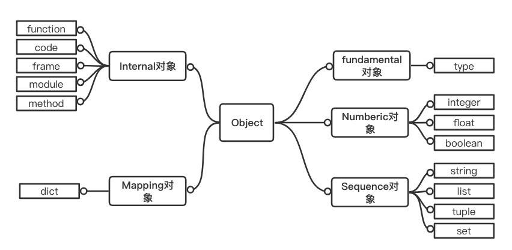

  

本篇介绍Python基础数据类型的底层原理



<!--more-->


## Python对象

- Fundamental 对象: 类型对象
- Numeric 对象: 数值对象
- Sequence 对象: 容纳其他对象的序列集合对象
- Mapping 对象: 类似 C++中的 map 的关联对象
- Internal 对象: Python 虚拟机在运行时内部使用的对象





| Python | C底层          |
| ------ | -------------- |
| int    | PyIntObject    |
| str    | PyStringObject |
| list   | PyListObject   |
| dict   | PyDictObject   |


## 字符串

- 字符串对象的C语言结构体

  ```c
  typedef struct {
      PyObject_VAR_HEAD  
      long ob_shash;   /* 字符串对象的哈希值，初始为-1 */
      int ob_sstate;   /* 标记该字符串是否经过intern机制处理 */
      char ob_sval[1]; /* 初始大小为1的字符数组，且 ob_sval[1] = '\0', 在后续中 ob_sval 指向的是一段长为 ob_size + 1个字节的内存 */
  } PyStringObject;
  ```

  

- 字符串对象在Python内部用`PyStringObject`表示

  - `PyStringObject`和`PyIntObject`一样都属于不可变对象，对象一旦创建就不能改变其值。

  ```python
  import sys
  print(sys.getsizeof(1000))          # 28
  print(sys.getsizeof(1000000000))    # 28
  print(sys.getsizeof(2000000000))    # 32
  print(sys.getsizeof('a'))           # 50
  print(sys.getsizeof('ab'))          # 51
  ```


- 关于创建的几点
  1. 如果字符串的长度超出了Python所能接受的最大长度(32位平台是2G)，则返回Null。
  2. 如果是空字符串，那么返回特殊的PyStringObject，即nullstring。
  3. 如果字符串的长度为1，那么返回特殊PyStringObject，即onestring。
  4. 其他情况下就是分配内存，初始化`PyStringObject`，把参数str的字符数组拷贝到`PyStringObject`中的`ob_sval`指向的内存空间。


- 字符串的INTERN机制
  - 本质：解释器运行过程中，只有唯一的一个字符串对应的 `PyStringObject` 对象。
  - interned其实是一个字典对象，如果新建的字符串存在，就将该对象的引用计数加1，临时创建的那个对象的引用计数减1；如果不存在就把这个临时创建的对象同时作为key和value添加到interned字典中，同时它的引用计数减2，因为被interned字典引用的2次不作为垃圾回收的判断依据。
  - 对于字符串 ‘abc’，首先创建一个临时 `PyStringObject` 对象出来，然后将这个临时的 `PyStringObject` 当作字典的 key 在interned中查找是否存在一个 `PyStringObject` 对象的值为 “abc”
- 字符串的拼接操作
  1. 利用“+” ：重新申请一段内存，把连接后的字符串复制到新内存中，也就是说N个字符串会申请N-1次内存
  2. join：接受一个可迭代对象，统计出有多少个字符串，统一分配内存，然后将连接后的字符串复制到新的内存中

- 字符串的缓冲池

  - 除了有intern机制缓存字符串外，字符串还有一种专门的短字符串缓冲池 `characters` ，用于缓存字符串长度为1的 `PyStringObject` 对象（1-255）

  ```python
  >>> s1 = '@@'
  >>> s2 = '@@'
  >>> s1 is s2
  False
  >>> s1 = '@'
  >>> s2 = '@'
  >>> s1 is s2
  True
  # 在cmd中，证实了该缓冲池characters存在，且大小为 1-255
  ```

  ```python
  s1 = '@@'
  s2 = '@@'
  print(s1 is s2)  # True
  
  # 而这里是因为 intern 机制
  ```

  - 在Console（交互式）中，每一条命令，解释器将其当作 **单独的代码块** 执行；而以脚本文件运行的方式，解释器将将其当作 **整个代码块** 执行。

  - intern保证的是整个代码块中，该字符串是唯一的；`characters`  缓存池的作用是保证长度为1的字符串的可重用性。


## 列表

- 持续更新中...

## 字典

- 持续更新中...


