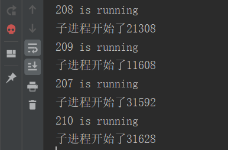

本篇介绍Python并发编程下的进程，先介绍进程的相关知识，然后对python中multiprocessing模块进行介绍（`Process`、`Pipe`、`Queue`以及 `Lock`）。 

<!--more-->


# 进程（process）

在面向线程设计的系统（如当代多数操作系统、Linux 2.6及更新的版本）中，进程本身不是基本运行单位，而是**线程的容器**。

进程拥有自己**独立**的内存空间，所属线程可以访问进程的空间。

程序本身只是指令、数据及其组织形式的描述，进程才是程序的真正运行实例。 例如，我们在PyCharm开发环境中写好一个程序，运行的时候python解释器完成解释并执行该程序。

进程 = 程序段 + 数据段 + PCB


## 全局解释器锁GIL

​	GIL是计算机程序设计语言解释器用于**同步线程**的一种机制，它使得任何时刻仅有一个线程在执行。即便在多核心处理器上，使用 GIL 的解释器也只允许**同一时间执行一个线程**。Python的Cpython解释器（普遍使用的解释器）使用GIL，在一个Python解释器进程内可以执行多线程程序，但每次一个线程执行时就会获得全局解释器锁，使得别的线程只能等待，由于GIL几乎释放的同时就会被原线程马上获得，那些等待线程可能刚唤醒，所以经常造成**线程不平衡享受CPU资源**，此时多线程的效率比单线程还要低下。

> In CPython, the global interpreter lock, or GIL, is a mutex that prevents multiple native threads from executing Python bytecodes at once. **This lock is necessary mainly because CPython’s memory management is not thread-safe.** (However, since the GIL exists, other features have grown to depend on the guarantees that it enforces.)

​	可以说它的初衷是很好的，为了保证**线程间的数据安全性**；但是随着时代的发展，GIL却成为了python并行计算的最大障碍，但这个时候GIL已经遍布CPython的各个角落，修改它的工作量太大，特别是对这种开源性的语音来说。但幸好GIL只锁了线程，我们可以再新建解释器进程来实现并行，那这就是multiprocessing的工作了。

# multiprocessing模块介绍

> doc：The multiprocessing package offers both local and remote concurrency, effectively side-stepping the Global Interpreter Lock by using subprocesses instead of threads.


## 开启子进程的两种方式

### 第一种：直接调用

```python
from multiprocessing import Process
import time
def task(name):
    print(f'{name}is running ')
    time.sleep(3)
    print(f'{name} is done')

if __name__ == '__main__':
    # windows操作系统开启多进程，必须得写在main下面。
    p = Process(target=task,args=('小黑',))   # args 一定是一个元组的形式
    p.start()
    print('===主进程')
    # start与print几乎是同时发出，但是由于操作系统调用子进程会慢一些。#

# 整个py文件是主进程
# p.start通知操作系统，你给我在内存中开辟一个空间，将p进程放进去，让cpu执行。
```


### 第二种 ：继承式调用

```python 
from multiprocessing import Process
import time
class Myprocess(Process):
    def __init__(self,name):
        # 这里的顺序是有要求，不然反过来写会覆盖。
        super().__init__()  # 必须要执行父类的init
        self.name = name
    def run(self):   # 必须定义这个名字
        print(f'{self.name}is running ')
        time.sleep(3)
        print(f'{self.name} is done')

if __name__ == '__main__':
    p = Myprocess('小黑')
    p.start()
    print('主进程')
```


## 获取进程以及父进程的pid

操作系统如何区分进程？每个进程都有一个唯一标识，pid

1. 在终端查看进程的pid，cmd中输入`tasklist`

2. 在终端查看指定的进程pid，cmd中输入 `tasklist | findstr pycharm`

   

3. 通过代码查看pid

   ```python
   import os
   import time
   print(f'子进程：{os.getpid()}')  # 查看当前进程pid
   print(f'父进程：{os.getppid()}') # 查看父进程pid
   time.sleep(50000)
   ```

   

## 进程之间的数据隔离

```python
from multiprocessing import Process
import time
x = 1000
def task():
    global x
    x = 2

if __name__ == '__main__':
    p1 = Process(target=task,)
    p1.start()  # 不是瞬发的，可能会等一会儿
    time.sleep(1)
    print(f'主进程：{x}')   # 主进程没有运行task这个函数，所以主进程内的x并未改变。

    # 但上面有些瑕疵，是主进程先执行的，我们想让子进程先执行，这样才能验证是否正的改变x,所以用一下time来使主进程慢一步。
```

结论：进程之间的数据是相互隔离的。

下面测试是否有小数据池：

```python
from multiprocessing import Process
import time
x = 100  # (-5 - 256)
s = 'h'
l1 = [1,2,3]
def task():
    print(f'子进程：{id(x)}')
    print(f'子进程：{id(s)}')
    print(f'子进程：{id(l1)}')

if __name__ == '__main__':
    print(f'主进程:{id(x)}')
    print(f'主进程:{id(s)}')
    print(f'主进程:{id(l1)}')
    p1 = Process(target=task,)
    p1.start()
```

结论：只有数字满足小数据池（-5-256）初始化时子进程与主进程是沿用一个.


## join方法

join ：阻塞目前父进程，它是通知主进程，等我执行完毕，主进程才能执行。

### 情景一

```python
from multiprocessing import Process
import time

def task(name,sec):
    time.sleep(sec)
    print(f'{name} is running')

if __name__ == '__main__':
    p1 = Process(target=task, args=('1',1))
    p2 = Process(target=task, args=('2',2))
    p3 = Process(target=task, args=('3',3))
    start_time = time.time()
    
p1.start()
p2.start()
p3.start()
p1.join()  # p1 1s
p2.join()  # p2 2s
p3.join()  # p3 3s
print(f'主进程{time.time()-start_time}秒后执行')  # 主进程3.194712162017822秒后执行
```

①当 `p1.join` 通知主进程等p1结束后，主进程开始执行，这里的主进程是 `p2.join`以后后面的内容。

②当p1执行结束后，`p2.join`通知主程序等p2结束后，主程序开始执行，这里面的主程序是 `p3.join`以及后面的内容。

③当p2执行结束后， `p3.join`通知主程序等p3结束后，主程序开始执行，这里面的主程序是`print`.

结论，由于p1,p2,p3是同时发出的通知，它们三个在同时处理，所以，最下面的`print`要等待这三个程序结束，也就是等待执行时间最长的进程结束后，才开始执行，


### 情景二

```python
from multiprocessing import Process
import time

def task(name,sec):
    time.sleep(sec)
    print(f'{name} is running')

if __name__ == '__main__':
    p1 = Process(target=task, args=('1',1))
    p2 = Process(target=task, args=('2',2))
    p3 = Process(target=task, args=('3',3))
    start_time = time.time()
  
p1.start()
p1.join()
p2.start()
p2.join()
p3.start()
p3.join()
print(f'主进程{time.time()-start_time}秒后执行') # 主进程6.424545526504517秒后执行
```

①当 `p1.join`通知主程序等p1 结束后，主程序开始执行，这里的主程序是 `p2.start`及以后的内容，所以，由于不是同时发出的通知，是一种串行的效果。


## 进程对象的其它属性

```python
from multiprocessing import Process
import time

def task(name):
    print(f'{name} is running')
    time.sleep(3)
    print(f'{name} is done')

if __name__ == '__main__':
    p = Process(target=task, args=('1',),name = '任务1')  # 给进程对象设置name属性
    p.start()         # start 只是一个通知，它会慢一拍。
    # print(p.pid)    # 获取进程pid号
    # print(p.name)
    # time.sleep(1)
    # p.terminate()     # 终止（结束）子进程, 它也不是立即的
    # terminate 与 start一样的工作原理：通知操作系统终止或开启一个子进程，内存中终止或开启是会耗费时间的。
    # print(p.is_alive())        # 判断子进程是否存活
    # is_alive 只是查看内存中p子进程是否运行，比terminat，start快。 这是否矛盾呢？
    # 问如何主动杀死子进程， terminate
    print('主进程')
```

#### `对象.pid()` 

获取对象pid号。

#### `对象.name`  

在初始化时，给进程对象设置name属性。

#### `对象.terminate()` 

终止（结束）子进程

terminate 与 start一样的工作原理：通知操作系统终止或开启一个子进程，内存中终止或开启是会耗费时间的。

#### `对象.is_alive()`

判断子进程是否存活.

如何`terminate()`与`对象.is_alive()`挨着，会打印True,因为`对象.is_alive()`的速度比terminate()快一些

补充：为什么


## 僵尸进程与孤儿进程（重要）


**僵尸进程**：在类UNIX系统中，僵尸进程是指**子进程**完成执行，父进程没有通过`wait`系统调用来读取这个子进程的退出状态的话（在操作系统的进程表中仍有一个表项（进程控制块PCB）（在Linux中具体是`task_struct`结构）），这个子进程就会一直维持僵尸进程状态，称为“僵尸进程”。

**回收**：子进程需要保留表项以允许其**父进程**读取子进程的 `exit status`：一旦退出态通过 `wait系统调用`读取，僵尸进程条目就从进程表中删除，称之为**回收**（reaped）

并且僵尸进程是无法通过 `kill`命令来清除。

> 僵尸进程的状态为`EXIT_ZOMBIE`，缩写`Z`，ps命令也会打印僵尸进程，但无法使用kill杀死。
>
> 可以使用命令： `ps aux | grep Z` 查看


**在回收僵尸进程之前，如果父进程退出了，则僵尸进程变为“孤儿进程”**，进而被`init`进程接管、回收。

**孤儿进程**：**父进程**执行完成或被**终止**后仍继续运行的一类进程。


```python
from multiprocessing import Process
import time
import os

def task(name):
    print(f'{name} is running')
    print(f'子进程开始了{os.getpid()}')
    time.sleep(10)

if __name__ == '__main__':
    p = Process(target=task, args=('1',))  # 给进程对象设置name属性
    for i in range(10000):
        p =Process(target=task, args=(str(i),))
        p.start()
    print(f'主进程开始了{os.getpid()}')
```

以上代码在pycharm运行时，会产生大量的僵尸进程，当我们点击停止（红色正方形）时，会出现一个红色骷髅的标志。




### 僵尸进程有害？

​    一种情景：父进程（僵尸进程）无限的开启子进程，递归的开启，子进程越来越多，僵尸进程越来越多，导致**资源泄露**。


### 为什么需要僵尸进程？

​	之所以保留 `task_struct`，是因为它里面保存了进程的pid，退出码、以及一些统计信息，父进程很可能会关心这些信息。


### 如何清除僵尸进程？

第一种方法：结束父进程，使之成为孤儿进程。当然者个是暴力的手段，因为我们一般肯定是希望父进程继续运行的。

第二种方法：通过wait调用来读取子进程退出状态。比如通过 `multiprocessing.Process`产出的进程可以通过 `子进程.join()`的方法来wait，也可以在父进程中处理 `SIGCHLD`信号，在处理程序中调用`wait`系统调用或者直接设置为 `SIG_IGN`来清除僵尸进程。


## 守护进程（重要）

```python
# 生产者与消费者模型会讲到。
from multiprocessing import Process
import time
import os

def task(name):
    print(f'{name} is running')
    print(f'子进程开始了{os.getpid()}')
    time.sleep(50)
    print(f'{name} is done')


if __name__ == '__main__':
    p = Process(target=task, args=('1',))  # 给进程对象设置name属性
    p.daemon = True  # 将p子进程设置成守护进程，守护主进程，只要主进程结束，子进程无论执行与否，都马上结束
    # 守护进程设置必须在 start前面！
    p.start()
    time.sleep(2)
    print(f'主进程开始了{os.getpid()}')
```

通俗：守护：我守护着你，你要是死了，我就与你一起

doc：当一个进程退出的时候，它试图关闭所有守护着它的子进程。

使用地方：生产者与消费者模型。

守护进程是不能开启子进程的，不然当父进程结束的时候，守护进程结束，那么由守护进程开启的进程会成为孤儿进程。

注意：守护进程设置必须在 start前面！


## 进程同步

### 背景

在系统中有一些需要相互合作、协同工作的进程，它们之间的相互联系称为**进程的同步**。 

### 进程同步的主要任务

使并发执行的诸进程之间能有效地**共享资源**和**相互合作**，从而使程序的并发执行具有可再现性。

### 进程的两种制约关系

- 间接制约：竞争同一资源而产生的**相互排斥**的关系 。
  - 解释： 当某一进程访问某一资源时，不允许别的进程同时访问，这种限制称为**互斥**， 即多个进程在访问某些资源（如临界资源）时，也要有一种执行次序上的协调 ，当一个进程访问完毕，另一个进程才能访问。所以就其本质来讲，互斥仍是一种同步。

- 直接制约：进程间共同完成一项任务时直接发生**相互作用**的关系。 

### 临界资源


- 临界资源：一次仅允许一个进程访问的资源。例如打印机。
- 临界区：访问临界资源的代码段，不允许多个并发进程交叉执行的一段程序。

### 临界区必须**互斥**访问

- 进入区：(1) 检查临界资源是否被访问，未被访问，转(2)，否则转(1)。

  ​			   (2) 进入临界区，并设访问标志。

- 退出区：恢复访问标志，允许其它进程进入

### 同步机制应遵循的准则

-  空闲让进——有效利用 
-  忙则等待——互斥 
-  有限等待——避免“死等” 
-  让权等待——避免“忙等” 


## 互斥锁


业务背景：3个进程，同一时刻共抢一个资源：输出平台。

分析：多个进程共抢一个资源，你要是做到结果第一位，效率第二位。你应该牺牲效率，保证结果。做到串行。

方法一：`join`

```python
from multiprocessing import Process
import time
import random

def task1():
    print('task1 开始打印')
    time.sleep(random.randint(1,3))
    print('task1 打印完成')
def task2():
    print('task2 开始打印')
    time.sleep(random.randint(1, 3))
    print('task2 打印完成')
def task3():
    print('task3 开始打印')
    time.sleep(random.randint(1, 3))
    print('task3 打印完成')

if __name__ == '__main__':
    p1 = Process(target=task1)
    p2 = Process(target=task2)
    p3 = Process(target=task3)
    p1.start()
    p1.join()
    p2.start()
    p2.join()
    p3.start()
    p3.join() 
```

虽然上面这个版本完成了串行结果，保证了顺序，但是没有保证公平。顺序是人为写好的。我们要做到公平的去抢占资源，谁先抢到，先执行谁。


方法二：`Lock`

```python
from multiprocessing import Process
from multiprocessing import Lock
import time
import random
# lock = Lock()  # 这样的话，子进程各会拷贝一份，也就是创建一把锁，会出问题，好多把锁
def task1(lock):
    print('task1')      # 第一种验证方法：验证cpu遇到I/O切换了
    lock.acquire()
    print('task1 开始打印')
    time.sleep(random.randint(1,3))
    print('task1 打印完成')
    lock.release()
def task2(lock):
    print('task2')
    lock.acquire()
    print('task2 开始打印')
    time.sleep(random.randint(1, 3))
    print('task2 打印完成')
    lock.release()
def task3(lock):
    print('task3')
    lock.acquire()
    # lock.acquire()  # 多加一次会进入死锁
    print('task3 开始打印')
    time.sleep(random.randint(1, 3))
    print('task3 打印完成')
    lock.release()
def task4():
    print('task4 开始打印')
    time.sleep(random.randint(1, 3))
    print('task4 打印完成')


if __name__ == '__main__':
    lock = Lock()       # 在这里实例化是要保证同一把锁！ 所以要以参数的形式传入
    p1 = Process(target=task1,args=(lock,))
    p2 = Process(target=task2,args=(lock,))
    p3 = Process(target=task3,args=(lock,))
    p4 = Process(target=task4)
    p1.start()
    p2.start()
    p3.start()
    # p4.start()    # 第二种验证方法，当如果p1拿到锁，并遇到I/O阻塞的时候，cpu会进行切换，找其它可用的进程。 
```

上面的程序中：当第一个到达的时候，假如p1开始执行，遇到阻塞的时候，cpu要切换，发现其它也需要同一把锁，所以cpu就停下来等待p1的阻塞结束。

上锁：一定要是同一把锁：上锁一次，解锁一次。


互斥锁与join区别共同点？ （重点）

- 共同点：都完成了进程之间的串行
- 区别：join是人为控制的进程串行， 互斥锁是随机的抢占资源


情景二：模拟抢票

需求分析：买票之前需要查票，必经流程，有可能你查票的同时，100个人也在查本次车票。买票时，你要先从服务端获取票数，票数 > 0，买票，然后服务端票数减一，中间肯定有网络延迟。


```python
from multiprocessing import Process
import time
import random
from multiprocessing import Lock
import json
import os

def search():
    time.sleep(random.random())
    dic = json.load(open('db.json',encoding='utf-8'))
    print(f"剩余票数：{dic['count']}")

def get():
    dic = json.load(open('db.json', encoding='utf-8'))
    time.sleep(random.randint(1,3))
    if dic['count'] > 0:
        dic['count'] -= 1
        json.dump(dic,open('db.json',mode = 'w' ,encoding='utf-8'))
        print(f'{os.getpid()}用户 购买成功')
    else:
        print('没票了....')

def task(lock):
    search()
    lock.acquire()
    get()
    lock.release()

if __name__ == '__main__':
    lock = Lock()
    for i in range(5):
        p = Process(target=task,args=(lock,))
        p.start()
    # with open('db.json',mode='w',encoding='utf-8') as f1:
    #     json.dump({'count':3},f1)     # 写入票数
   
```

多进程原则上是不能互相通信的，它们在内存级别数据隔离的。不代表硬盘的数据隔离,它们可以共同操作一个文件。

多个进程抢占同一个（）资源，要想公平按照顺序，只能串行。


## 进程之间的通信：队列（multiprocessing.Queue）

多个进程间的通信：基于文件以及加锁的方式。

缺点：

1. 操作文件效率低
2. 自己加锁很麻烦，很容易出现死锁，递归锁。

进程之间的通信最好的方式是基于队列。底层是利用管道和锁。

什么是队列？

队列是存在于内存中的一个容器，最大的一个特点：队列的特性就是FIFO，完全支持先进先出的原则。

```python
from multiprocessing import Queue

q = Queue(3)   # 可以设置元素的最大个数
q.put('小黑')
q.put({'count':1})
def func():
    print('in func')
q.put(func)
# q.put(666)    # 当队列中的数据已经达到上限，再插入数据的时候，该进程就会夯住，阻塞，等待别的进程取出数据。
print(q.get())
print(q.get())
print(q.get())
print(q.get()) # 当你将数据取完继续在取值的时候，该进程会夯住，阻塞，等待别的进程插入数据。
```

队列的`maxsize`    `q = Queue(maxsize)` 数据量不宜过大。精简的重要的数据。比如：各种请求链接。

常用方法介绍：

`put(self, obj, block=True, timeout=None)`

- 当超过最大限度时，默认阻塞  block=True  改成False 如果继续 `put` 报queue.Full异常
- timeout 延时报错，超过设置的时间间隔后还插不进去数据，会报queue.Full异常

`get(self, block=True, timeout=None)`

- 当队列为空的时候，默认阻塞；改为False后如果继续 `get` 报queue.Empty异常
- timeout 延时作业，超过设置的时间间隔还取不出来数据，会报queue.Empty异常。


### 进程之间的通信实例

背景：抢小米手环4，预期发售10个，100个人去抢。

```python
import os
from multiprocessing import Queue
from multiprocessing import Process
import queue

def task(q):
    try:
        q.put(f'{os.getpid()}',block=False)
    except queue.Full:
        pass

if __name__ == '__main__':
    q = Queue(10)
    for i in range(100):
        p  = Process(target=task,args=(q,))
        p.start()
    for i in range(1,11):
        print(f"排名{i}的 用户{q.get()}抢到了")
```

利用队列进行进程之间通信：简单，方便，不用自己手动加锁。队列自带阻塞，可持续化读取数据。


## 进程之间的通信：管道（multiprocessing.Pipe）

### 管道

- 在UNIX系统中，它连接一个**读进程**和一个**写进程**，以实现它们之间通信的共享文件，又称pipe文件。它是以文件为基础，实质是以**外存**来进行**数据通信**。
- 在windows中是一段共享内存。这段共享的内存设计采用**数据流I/0**的方式来访问。由一个**进程读**、另一个**进程写**。
- 类似于一根管道的两端，所以这种进程间的通信方式被称作“管道”。

```
Python官方文档的描述：
Returns a pair (conn1, conn2) of Connection objects representing the ends of a pipe.
```

因此, Pipe仅仅适用于只有两个进程**一读一写的单双工**情况，也就是说信息是只向一个方向流动。例如电视、广播，看电视的人只能看，电视台是能播送电视节目。

```python
from multiprocessing import Pipe,Process

def task(x,pipe):
    _out_pipe, _in_pipe = pipe
    print('子进程开始啦')
    # 关闭fork过来的输入端(关闭进水口)
    _in_pipe.close()
    while True:
        try:
            # 放水
            msg = _out_pipe.recv()
            print(msg)
        except EOFError:
            # 当out_pipe接受不到输出的时候且输入被关闭的时候，会抛出EORFError，可以捕获并且退出子进程
            return

if __name__ == '__main__':
    out_pipe, in_pipe = Pipe() # duplex为True，创建的管道是双向的，默认为
    p1 = Process(target=task, args=(100, (out_pipe, in_pipe)))
    p1.start()

    # 等pipe被fork 后，关闭主进程的输出端
    # 这样，创建的Pipe一端连接着主进程的输入，一端连接着子进程的输出口
    out_pipe.close()      # 关闭出水口，开始进水
    for x in range(100):
        in_pipe.send(x)
    print('xxxxxxx')
    in_pipe.close()       # 关闭进水口。 当进水口关闭后，子进程才开始使用这个管道。
    p1.join()
    print("主程序运行结束")
```

上面的代码主要用到了pipe的send()、recv()、close()方法。当pipe的输入端被关闭，且无法接收到输入的值，那么就会抛出EOFError。

新建一个Pipe(duplex)的时候，如果duplex为True，那么创建的管道是双向的；如果duplex为False，那么创建的管道是单向的。

形象的举例就是：

- 主程序关闭出水口，放水，当水充满后，关闭进水口；
- 子程序拿到管道。先关闭进水口，开始放水，等水流完后，关闭出水口。


## 生产者消费者模型

回顾：以前学到的模型，设计模式（单例模式），归一化设计，理论等待，都是交给你一个编程思路，如果以后遇到类似的情况，直接套用即可。

生产者：生产数据的进程。

消费者：对生产者生产出来的数据做进一步的处理的进程。

吃包子举例：**厨师**生产出包子，不可能直接塞你嘴里，他要放在**盆**中；**消费者**从盆中取出包子食用。

**三个主体**：（生产者）厨师、（容器队列）盆、（消费者）人。

为什么夹杂这个容器？

（容器）盆起到一个缓冲区的作用，也起到了解耦的作用（只有生产者和消费者话它们是强耦合的）。

**平衡了生产力和消费力。**

生产者消费者模型多用于**并发**。

方法一：利用队列实现

```python
from multiprocessing import Process
from multiprocessing import Queue
import time
import random

def producer(q):
    for i in range(1,6):
        time.sleep(random.randint(1,3))
        res = f'{i}号包子'
        q.put(res)
        print(f'\033[0;32m 生产者生产了{res}\033[0m')

def consumer(q):
    while 1:
        try:
            time.sleep(random.randint(1,3))
            ret = q.get(timeout= 5)
            print(f'消费者吃了{ret}')
        except Exception:
            return

if __name__ == '__main__':
    q = Queue()
    p1 = Process(target=producer,args=(q,))
    p2 = Process(target=consumer,args=(q,))
    p1.start()
    p2.start()
```

生产者消费者模型：

合理的去调控多个进行去生产数据以及提取数据，中间有个必不可少的环节容器队列。

本质上：利用队列进行通信。


方法二：利用管道实现

```python
from multiprocessing import Process,Pipe

def producer(out_pipe, in_pipe):
    out_pipe.close()
    for i in range(1,101):
        s = f"第{i}号包子"
        print(f'生产者生产了{s}')
        in_pipe.send(s)
    in_pipe.close()

def consumer(out_pipe, in_pipe):
    in_pipe.close()
    # while True:
    #     try:
    #         s = out_pipe.recv()
    #         print(f"消费者吃了{s}")
    #     except EOFError:          # 只有在进水口关闭的时候才能引发异常
    #         print('xxx')
    #         return
    for i in range(100):
        s = out_pipe.recv()
        print(f"消费者吃了{s}")
    out_pipe.close()

if __name__ == '__main__':
    out_pipe, in_pipe = Pipe()
    pro = Process(target=producer,args=(out_pipe, in_pipe))
    con = Process(target=consumer,args=(out_pipe, in_pipe))
    pro.start()
    con.start()
    con.join()
    print('主进程结束')

```


------

