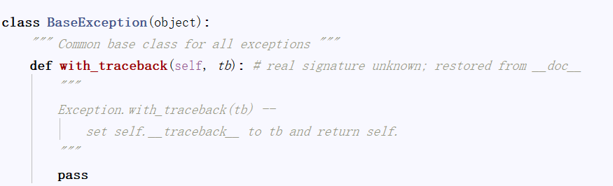
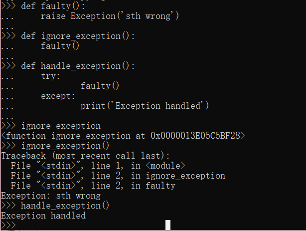

异常事件可能是错误，也可能是通常不会发生的事情。为了处理这些异常事件，我们曾今的做法是在发生这些事件的地方都使用条件语句。例如，我们希望用户输入的全是数字，所以需要对用户输入的字符进行检测，因为有不输入数字的可能存在。当我们判断的条件更加苛刻后，判断的层数也将增加，这样做不仅效率低下、缺乏灵活性，还可能导致程序难以卒读。所以我们需要一种新的替代方案——异常处理机制。 

<!-- more -->


## 异常是什么？

Python使用**异常对象**来表示异常状态，并在遇到错误时引发异常。异常对象未被处理（或捕获）时，程序将终止并显示一条错误消息（traceback）

> Traceback (most recent call last):
>   File "xxx.py", line 84, in <module>
>     int('E')
> ValueError: invalid literal for int() with base 10: 'E'

我们查看ValueError这个类，发现这个类继承于Exception，继续探索，发现所有的错误都是由BaseException派生的。



接下来我们要用各种方式引发和捕获这些实例，从而逮住错误并采取措施，并不是让整个程序失败。

我们平常遇到的错误可以分为：

- 语法错误
  
- 如缩进，等不该犯的错误（这部分是我们去避免的）
  
- 逻辑错误
  - 这是异常处理所做的。

  

## 让事情沿你指定的轨道出错

出现错误时，会引发异常，先来看看如何自主的引发异常，创建异常，然后是学习如何处理这些异常。

### raise语句

主动抛出异常：可以使用raise语句，并将一个类（必须是Exception的子类）或实例作为参数。将类作为参数是，将自动创建一个实例。下面的示例使用的是内置异常类Exception： 

`raise Exception('xxxError')` 

> Traceback (most recent call last):
>   File "xxx.py", line 87, in <module>
>     raise Exception('xxxError')
> Exception: xxxError

### 自定义的异常类

有时你想自己创建异常类，该怎么做呢？？就像创建其他类一样，但务必直接或间接地继承Exception（这意味着从任何内置异常类派生都可以）。

下面的示例是自定义的一个ConnectionError，

```
class ConnectionError(BaseException):
    def __init__(self,msg):
        self.msg = msg
    
raise  ConnectionError('触发了连接异常')
```


## 捕获异常

当我们明白了异常是怎么产生后，了解了解如何处理异常（通常称之为捕获异常）。如下面这个例子是一个最简单的异常处理，这里面包含两个错误，一个是IndexError，一个是KeyError。

#### 单分支（一个except）

```
try:
    l1 = [1,2,3]
    print(l1[100])  # 出错了下面就不执行了
    
    dic = {1:'a'}
    print(dic[3])    
except IndexError:
    print('处理了索引错误')
```

**try语句中出现一个异常后，后面的语句不会执行，从而捕获except处开始执行。**


### 多分支（多个except）

如果你运行的这一节程序有多种错误的可能时，使用except 。如下面例子，假设dic字典里，键是用户输入的选项，字典的值对应的是菜单，那对于输入可能产生多种错误，所以使用多分支（多个except子句）进行分流。

```
dic = {
    1:666,
    2:333,
    3:555,
}    # 对应三个函数名
while 1:
    try:
        num = input('请输入序号')
        int(num)
        print(dic[int(num)])
    except KeyError as e:
        print('选项超出范围，请重新输入')
    except ValueError as e:
        print('只能输入数字')    
```


### 单分支捕获多种异常（使用元组）

如果要是一个except子句捕获多种异常，可在一个元组中指定这些异常，如下所示

```
dic = {
    1:666,
    2:333,
    3:555,
}    # 对应三个函数名
while 1:
    try:
        num = input('请输入序号')
        int(num)
        print(dic[int(num)])
    except (KeyError,ValueError,Exception) as e :
        print('出现问题了')
        print(e)
```


### 万能异常

当except语句中不指定任何异常类，它可以捕获所有异常，但这种行为很危险，因为这不仅会隐藏你有心理准备的错误，还会隐藏你没有考虑过的错误。

```
dic = {
    1:666,
    2:333,
    3:555,
}    # 对应三个函数名
while 1:
    try:
        num = input('请输入序号')
        int(num)
        print(dic[int(num)])
    except :
        print('出现问题了')
```

更多情况我们使用`except Exception as e`来对异常对象进行检查，因为上面将会让不是从Exception派生而来的异常成为漏网之鱼，其中包括SystemExit和 KeyboardInterrupt（ctrl + c），因为它们是从BaseException（Exception的超类）派生而来的。 

### else

如果无异常执行else语句，否则不执行else语句。如下面这个例子，只有当我们输入正确计算出结果才能中止循坏。（else不能单独与try使用，必须是try,except,else）

```
while True:
    try:
        x = int(input('请输入一个数字：'))
        y = int(input('请输入一个数字：'))
        print(x/y)
    except Exception as e:
        print('输入有误，请重新尝试')
    else:
        break
```


### finally

用于在发生异常时执行清理工作。这个子句是与try子句配套的。

```
x = None
try:
    x = 1/ 0
finally:
    print('清理工作')
    del x
```

在上述示例中，不管try子句中发生什么异常，都将执行finally子句。为何在try子句之前初始化x呢？因为如果不这样做，ZeroDivisionError将导致根本没有机会给它赋值，进而导致在 finally子句中对其执行del时引发未捕获的异常。

虽然使用del来删除变量是相当愚蠢的清理措施，但finally子句非常适合用于**确保文件或网络套接字等得以关闭**。


## 异常和函数

异常和函数有着天然的联系。如果不处理函数中引发的异常，它将向上传播到调用函数的地 方。如果在那里也未得到处理，异常将继续传播，直至到达主程序（全局作用域）。



上面示例中，在调用的时候，首先引发一个异常，然后由handle_exception函数中的try/except语句处理。

## 异常之禅

有时候，可使用条件语句来达成异常处理实现的目标，但这样编写出来的代码可能不那么自 然，可读性也没那么高。另一方面，有些任务使用if/else完成时看似很自然，但实际上使用 try/except来完成要好得多。

异常处理并不是很复杂。如果你知道代码可能引发某种异常，且不希望出现这种异常时程序终止并显示栈跟踪消息，可添加必要的try/except或try/finally语句（或结合使用）来处理它。 


## 不那么异常的情况 

运行程序时，除了异常信息，我们还可能看到一些warning信息。如果你只想发出警告，指出情况偏离了正轨，可使用模块warnings中的函数warn。 

```
from warnings import warn
warn('这里要注意以下')
```

只会显示一下警告，其它什么事情都不会发生。

## 小结

- **异常对象**：异常情况（如发生错误）是用异常对象表示的。对于异常情况，有多种处理方式；如果忽略，将导致程序终止。 所有异常都是由BaseException产生的。

- **引发异常**：可使用raise语句来引发异常。它将一个异常类或异常实例作为参数，但你也可提供两个参数（异常和错误消息）。如果在except子句中调用raise时没有提供任何参数， 它将重新引发该子句捕获的异常。
-  **自定义的异常类**：你可通过从Exception派生来创建自定义的异常。 
-  **捕获异常**：单分支，多分支，等等。
- **else子句**：在主try块没有引发异常时执行。 
-  **finally**：要确保代码块（如清理代码）无论是否引发异常都将执行，可使用try/finally， 并将代码块放在finally子句中。 
- **异常和函数**：在函数中引发异常时，异常将传播到调用函数的地方
- **警告**：：警告类似于异常，但（通常）只打印一条错误消息。
- 不要在try else里写返回值。如果没有finally，就写在最后，或者只写在finally里。 
- try except else里都是**做某事**   而不是处理返回。

- **优点**：增强程序的健壮性与容错性
- **异常处理不能经常使用**：异常处理耗费性能，有些错误是需要进行分流使用，代码可读性变差。我们要在关键的节点使用，如对输入信息进行处理。