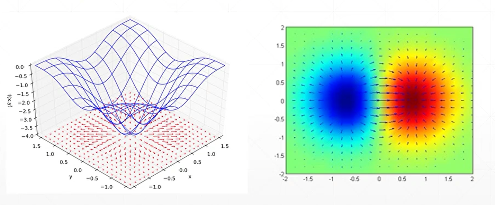
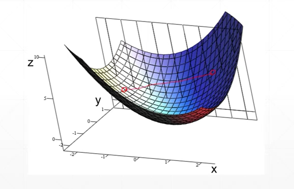
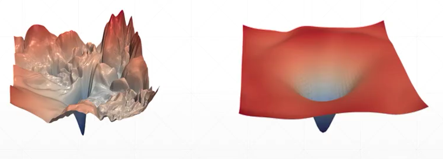

本篇介绍梯度是什么，在Pytorch中梯度是怎么使用的。 

<!--more-->

# Clarification

- 导数：derivate

  - 导数代表了在自变量变化趋于无穷小的时候，函数值的变化与自变量变化的比值代表了导数，几何意义有该点的切线。物理意义有该时刻的（瞬时）变化率。

  - 标量，反映的是变化程度。给定一个方向，用长度来表示变化率的大小。

- 偏微分：partical derivate

  - 标量，沿x，y方向的变化趋势。
  - 偏微分是导数的特殊情况。

- 梯度：gradient

  - 向量，所有偏微分组成的一个**向量**
  - 长度（模）：变化趋势，当前这个点增长的速率
  - 方向：增长方向

从下图感受梯度的长度与方向：

左图为：将函数*f*(*x*,*y*) = −(cos2*x* + cos2*y*)2的梯度描绘为在底面上投影的向量场。

右图为：将2D函数*f*(*x*, *y*) = *xe*−(*x*2 + *y*2)的梯度绘制为蓝色箭头，还绘制了这个函数的伪色图。

## How to search for minima? 

$$
\theta_{t+1} = \theta_t - \alpha_t\nabla f(\theta_t)
$$

## Convex function

- 凸函数（碗）

# 影响搜索的一些因素

## Local Minima

- 局部极小值点

ResNet中，shortcut模块，使 loss 更加平滑。

左图为ResNet-56将它所有的w进行可视化。

右图为使用了shorcut模块后的更深的网络。

https://github.com/tomgoldstein/loss-landscape

## Saddle point

- 鞍点
- 一个维度下是局部最小，另一个维度下是局部最大；在将来很多很多变量存在的情况下，这种情况很容易发生。

## Optimizer Performance

### initialization status

- 同样的网络，初始位置不同，结果差异很大，有的就容易陷入局部最优。

- 初始化很重要，可以参考主流的一些初始化方法。

- 何凯明提到的初始化方法（待补充）

### learning rate

- learning rate过大会导致不收敛

- 刚开始的时候先设置的小一些，然后在慢慢的放大。

  

### momentum（动量）

- Escape minima（逃离局部极小值）
- 用一个弹珠做比喻，当它在往下滑的过程中，遇到小坑（极小值），虽然会停顿一下，但是仍靠着惯性冲向最深的那个坑（全局最小值）。

