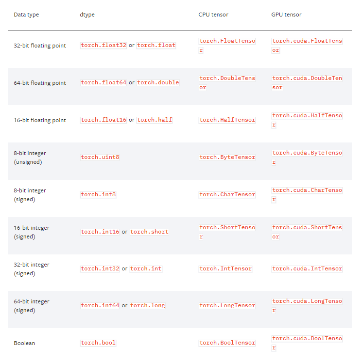

本篇介绍Pytorch的基础数据类型，判断方式以及常用向量。 

<!--more-->


# 基础数据类型

- `torch.Tensor`是一种包含单一数据类型元素的多维矩阵。
- 目前在[1.2版本](https://pytorch.org/docs/stable/tensors.html)中有9种类型。





- 同python相比，pytorch没有string类型；
- 由于pytorch是面向计算的，对于字符这种通常通过编码下手；
- 怎样用数字的形式去表示语言（字符串） ： NLP -> one-hot   或    Embedding（Word2vec，glove）


# 判断数据类型

1. 打印数据类型：a.type()
2. 打印的是基本的数据类型，没有提供额外的信息：type(a) 
3. 合法性检验：isinstance(a, torch.FloatTensor)

```python
In[2]: import torch
In[3]: a = torch.randn(2,3)       //两维 ， 每个数字是由随机的正态分布来初始化的，均值是0 方差是1
In[4]: a.type()                   // 方法一：打印数据类型
Out[4]: 'torch.FloatTensor'
In[5]: type(a)				  	  // 方法二：较少
Out[5]: torch.Tensor
In[6]: isinstance(a, torch.FloatTensor)		// 方法三：合法性检验
Out[6]: True
```


同一个tensor部署在cpu和gpu时的数据类型是不一样的

```python
In[7]: isinstance(a, torch.cuda.FloatTensor)
Out[7]: False
In[8]: a = a.cuda()
In[9]: isinstance(a, torch.cuda.FloatTensor)
Out[9]: True
```


标量  Dimension 0 / rank 0

```python
In[12]: torch.tensor(1.3)
Out[12]: tensor(1.3000)
```

loss 就是一个标量

查看标量的维度

1. `len(a.shape)`
2. `a.dim()`
3. `len(a.size())`

```python
In[13]: a = torch.tensor(2.2)
In[14]: a.shape
Out[14]: torch.Size([])
In[15]: len(a.shape)
Out[15]: 0
In[16]: a.size()
Out[16]: torch.Size([])
In[17]: a.dim()
Out[17]: 0
```


# 常用向量

## 1维向量

1. `torch.tensor([ 数据 ])`
2. `torch.FloatTensor(维度)`
3. 从numpy导入`torch.from_numpy(data)`

```python
In[19]: torch.tensor([1.1])
Out[19]: tensor([1.1000])
In[20]: torch.tensor([1.1, 2.2])
Out[20]: tensor([1.1000, 2.2000])
In[21]: torch.FloatTensor(1)
Out[21]: tensor([0.])
In[22]: torch.FloatTensor(2)
Out[22]: tensor([-1.0842e-19,  1.8875e+00])
In[23]: import numpy as np
In[24]: data = np.ones(2)
In[25]: data
Out[25]: array([1., 1.])
In[26]: torch.from_numpy(data)
Out[26]: tensor([1., 1.], dtype=torch.float64)
```

dim为1的向量有 Bias

Linear Input 线性层的输入

从0.4版本增加了 标量的表示，以前是[0.3]来表示标量，但这样语义上不太清晰。


1维的形状如何得到

- .size
- .shape

几个概念：

dim：指的是size/shape的长度

size/shape指的是具体的形状

tensor指的是具体的数字


## 2维向量

```python
In[30]: a = torch.randn(2,3)        
In[31]: a
Out[31]: 
tensor([[-0.1353,  0.9325, -1.7155],
        [-1.9443,  0.3485,  0.6418]])
In[32]: a.shape
Out[32]: torch.Size([2, 3])
In[33]: a.size(0)
Out[33]: 2
In[34]: a.size(1)
Out[34]: 3
In[35]: a.shape[1]
Out[35]: 3
```


常用于带有batch的 Linear Input   例如 [4, 784]      4张784像素的图片


## 3维向量

形状：`list(a.shape)`

```python
In[49]: a = torch.rand(1,2,3)     // 使用随机的均匀分布
In[50]: a
Out[50]: 
tensor([[[0.4700, 0.7649, 0.7688],
         [0.1973, 0.5232, 0.0038]]])
In[51]: a.shape
Out[51]: torch.Size([1, 2, 3])
In[52]: a[0]      // 取第一个维度的第零号元素 [2,3]
Out[52]: 
tensor([[0.4700, 0.7649, 0.7688],
        [0.1973, 0.5232, 0.0038]])
In[53]: list(a.shape)
Out[53]: [1, 2, 3]
```

场景：NLP文字处理

RNN Input Batch   例如   W,F[10, 100] 一个句子由10个单词构成，且每个单词由100维向量表示

W,S,F[10, 20, 100]   20个句子，每个句子由10个单词构成，且每个单词由100维向量表示


## 4维向量

```python
In[54]: a = torch.rand(2,3,28,28)             //随即均匀化
In[55]: a
Out[55]: 
tensor([[[[0.2990, 0.3407, 0.0149,  ..., 0.7321, 0.9115, 0.4388],
          [0.2001, 0.0137, 0.1427,  ..., 0.5508, 0.4747, 0.2132],
          [0.0919, 0.7190, 0.0269,  ..., 0.9440, 0.5967, 0.4414],
          ...,
          [0.7014, 0.4306, 0.1627,  ..., 0.8383, 0.4709, 0.3334],
          [0.7733, 0.2284, 0.5533,  ..., 0.3841, 0.6881, 0.3352],
          [0.5796, 0.7640, 0.3492,  ..., 0.6319, 0.6660, 0.1536]],

         [[0.3840, 0.4825, 0.6113,  ..., 0.5034, 0.2546, 0.1246],
          [0.2549, 0.4116, 0.8511,  ..., 0.8956, 0.4064, 0.0360],
          [0.4601, 0.8654, 0.9965,  ..., 0.7325, 0.5524, 0.3354],
          ...,
          [0.0220, 0.1239, 0.6685,  ..., 0.6109, 0.7329, 0.2162],
          [0.1790, 0.0919, 0.0559,  ..., 0.6279, 0.9586, 0.4919],
          [0.8246, 0.1804, 0.6107,  ..., 0.5497, 0.6124, 0.1172]],

         [[0.4151, 0.1750, 0.6129,  ..., 0.1962, 0.3190, 0.0227],
          [0.2165, 0.9139, 0.3081,  ..., 0.7211, 0.2220, 0.1521],
          [0.7928, 0.9053, 0.7208,  ..., 0.9461, 0.2194, 0.5177],
          ...,
          [0.4514, 0.6893, 0.3093,  ..., 0.7236, 0.1157, 0.7789],
          [0.6290, 0.8666, 0.4240,  ..., 0.4480, 0.7474, 0.0391],
          [0.4798, 0.3155, 0.9216,  ..., 0.5462, 0.2013, 0.7234]]],


        [[[0.1887, 0.1911, 0.5820,  ..., 0.1653, 0.7776, 0.3725],
          [0.3350, 0.3595, 0.6138,  ..., 0.3139, 0.1971, 0.7547],
          [0.3334, 0.5563, 0.6428,  ..., 0.6337, 0.3126, 0.0349],
          ...,
          [0.9218, 0.2081, 0.9644,  ..., 0.1333, 0.1972, 0.1489],
          [0.9598, 0.0323, 0.7847,  ..., 0.8366, 0.9486, 0.1052],
          [0.2474, 0.6811, 0.1599,  ..., 0.2132, 0.0211, 0.4123]],

         [[0.6994, 0.0694, 0.3789,  ..., 0.2333, 0.3922, 0.5462],
          [0.5692, 0.1016, 0.0053,  ..., 0.4257, 0.2898, 0.3655],
          [0.9806, 0.3084, 0.0129,  ..., 0.8453, 0.6952, 0.6759],
          ...,
          [0.2060, 0.5261, 0.5321,  ..., 0.1070, 0.4960, 0.7185],
          [0.1417, 0.7306, 0.0398,  ..., 0.9186, 0.9080, 0.8449],
          [0.0294, 0.5325, 0.5534,  ..., 0.0995, 0.5660, 0.1330]],

         [[0.5168, 0.4303, 0.9170,  ..., 0.3214, 0.1818, 0.4606],
          [0.4073, 0.9889, 0.2090,  ..., 0.2702, 0.9984, 0.3591],
          [0.2428, 0.7390, 0.6293,  ..., 0.3361, 0.6701, 0.1649],
          ...,
          [0.7242, 0.7595, 0.5713,  ..., 0.3498, 0.6220, 0.9937],
          [0.0988, 0.9972, 0.5013,  ..., 0.9467, 0.6382, 0.4678],
          [0.7906, 0.0443, 0.1911,  ..., 0.2179, 0.5613, 0.8539]]]])
In[56]: a.shape
Out[56]: torch.Size([2, 3, 28, 28])
    
In[56]: a.shape
Out[56]: torch.Size([2, 3, 28, 28])
In[57]: a.numel()          //number of element 2*3*28*28  tensor占用内存的数量
Out[57]: 4704              
In[58]: a.dim()
Out[58]: 4
```


场景 ： CNN

[b, c, h, w]      b：几张照片   c： 通道    w：宽   h：高度

 

PS：在我们学习的过程中，一定要结合着物理意义去学习，就比如说我创建一个 [4,3,28,28] 的向量，这个向量有什么含义？当我们把向量进行matmul(矩阵相乘) 后，又有什么含义？不仅仅是为学习工具而去学习，而要时刻明白我这样做能达到什么样的效果。