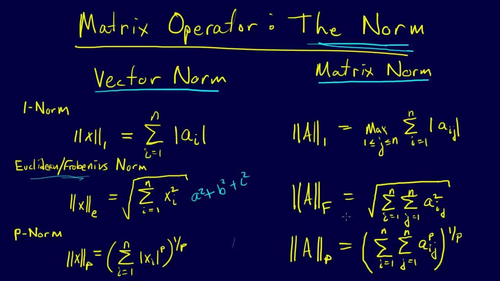

本篇介绍Pytorch属性统计的几种方式。 

<!--more-->


# 统计属性

求值或位置

- norm
- mean sum
- prod
- max, min, argmin, argmax
- kthvalue, topk


# norm

## norm 与 normalize 

- norm指的是范数，并不是normalize。
- normalize是归一化，例如 batch_norm。


## matrix norm 与 vector norn

要更好的理解范数，就要从函数、几何与矩阵的角度去理解。 
	我们都知道，函数与几何图形往往是有对应的关系，这个很好想象，特别是在三维以下的空间内，函数是几何图像的数学概括，而几何图像是函数的高度形象化，比如一个函数对应几何空间上若干点组成的图形。 
	但当函数与几何超出三维空间时，就难以获得较好的想象，于是就有了映射的概念，映射表达的就是一个集合通过某种关系转为另外一个集合。通常数学书是先说映射，然后再讨论函数，这是因为函数是映射的一个特例。 
	为了更好的在数学上表达这种映射关系，（这里特指线性关系）于是就引进了矩阵。这里的矩阵就是表征上述空间映射的线性关系。而通过向量来表示上述映射中所说的这个集合，而我们通常所说的基，就是这个集合的最一般关系。于是，我们可以这样理解，<u>一个集合（向量），通过一种映射关系（矩阵），得到另外一个几何（另外一个向量）</u>。 

- **向量的范数，就是表示这个原有集合的大小**。

- **矩阵的范数，就是表示这个变化过程的大小的一个度量**。

总结起来一句话，**范数(norm)，是具有“长度”概念的函数**。





推荐阅读 [向量范数与矩阵范数](https://blog.csdn.net/bitcarmanlee/article/details/51945271), [机器学习下的各种norm到底是个什么东西？](https://www.zhihu.com/question/29458275), [机器学习中的范数规则化之（一）L0、L1与L2范数](https://blog.csdn.net/zouxy09/article/details/24971995).


在做 gradient clipping 的时候，需要查看weight 的 gradient norm 如果太大的话就需要做 gradient clipping（使用clamp）


## norm-p

- 1-Norm就是所有元素的绝对值之和
- 2-Norm就是所有元素的平方和并开根号

- 不加dim参数，默认所有维度
- 从shape出发，加入dim后，这个dim就会消失（做Norm）

```python
In[3]: a = torch.full([8],1)
In[4]: b = a.view(2,4)
In[5]: c = a.view(2,2,2)
In[6]: b
Out[6]: 
tensor([[1., 1., 1., 1.],
        [1., 1., 1., 1.]])
In[7]: c
Out[7]: 
tensor([[[1., 1.],
         [1., 1.]],

        [[1., 1.],
         [1., 1.]]])

In[8]: a.norm(1), b.norm(1), c.norm(1)
Out[8]: (tensor(8.), tensor(8.), tensor(8.))
In[9]: a.norm(2), b.norm(2), c.norm(2)
Out[9]: (tensor(2.8284), tensor(2.8284), tensor(2.8284))
    
In[10]: b.norm(1,dim=1)
Out[10]: tensor([4., 4.])	# 就shape来讲 [2,4] norm之后 --> [2]
In[16]: b.norm(1,dim=0)
Out[16]: tensor([2., 2., 2., 2.])	# shape [2,4]  ---> [4]

In[11]: b.norm(2,dim=1)
Out[11]: tensor([2., 2.])
    
In[12]: c.norm(1,dim=0)	# [2,2,2]   在0维度做求1范数，那么这个维度就将消掉，得到shape为[2,2]
Out[12]: 
tensor([[2., 2.],
        [2., 2.]])
In[14]: c.norm(2,dim=0)		
Out[14]: 
tensor([[1.4142, 1.4142],
        [1.4142, 1.4142]])	
# 位置[0,0,0] 与 [1,0,0] 
[[[1., .],
  [ ., .]],

 [[1.,  .],
  [ .,  .]]]
```


# mean，sum，min，max，prod

- max() 求最大的值
- `min()` 求最小的值
- `mean()` 求平均值   mean = sum / size

- `prod()` 累乘
- `sum()` 求和
- `argmax()` 返回最大值元素的索引
- `argmin()` 返回最大值元素的索引
- `argmax(dim=l)` 求 `l` 维中，最大元素的位置，这样的话这一维将消失。

note：以上这些，如果不加参数，会先打平，在计算，所以对于 argmax 和 argmin来说得到的是打平后的索引。

```python
In[18]: a = torch.arange(8).view(2,4).float()		# 假设我们生成一组 gradient
In[19]: a
Out[19]: 
tensor([[0., 1., 2., 3.],					# 想要做clipping，先要知道它的最大最小值
        [4., 5., 6., 7.]])
In[20]: a.min(), a.max(), a.mean(), a.prod()
Out[20]: (tensor(0.), tensor(7.), tensor(3.5000), tensor(0.))
    
In[21]: a.sum()
Out[21]: tensor(28.)
    
In[22]: a.argmax()
Out[22]: tensor(7)
In[23]: a.argmin()
Out[23]: tensor(0)
    
In[24]: a = torch.randn(4,10)	# 假设生成4张手写体数字照片的概率（发生过偏移）
In[25]: a[0]
Out[25]: 
tensor([ 0.0234,  0.6830, -0.1518,  0.4595, -1.5634,  0.5534,  0.9934, -1.1536,
         0.3124, -1.4103])
In[26]: a.argmax()				# 打平成一个1维的vector
Out[26]: tensor(28)
In[28]: a.argmax(dim=1)			# shape[4,10] 在 dim=1 求最大值的索引
Out[28]: tensor([6, 1, 8, 1])	# 获取4张照片预测值最大的位置，这个位置决定了它是数字几  注意：参数dim=1 才拿到了这个结果！！    
```


## dim，keepdim

- 使用max(dim=) 函数配上dim参数，可以很好的返回最大值与该值的位置
- argmax 其实是 max 的一部分（位置）
- keepdim=True  设置这个参数后，维度得以保留，与原来的维度是一样的。

```python
In[33]: a				# # 假设生成4张手写体数字照片的概率（发生过偏移）
Out[33]: 
tensor([[ 0.0234,  0.6830, -0.1518,  0.4595, -1.5634,  0.5534,  0.9934, -1.1536,
          0.3124, -1.4103],
        [ 0.6339,  1.5724,  0.2552,  1.0917, -1.4003,  0.5165,  0.8891, -2.0315,
          0.4666,  1.4355],
        [ 1.6149,  0.2364,  0.3789, -0.3974, -0.1433,  0.9235,  0.6730,  0.3575,
          2.0742,  0.8954],
        [-0.1019,  1.6405, -1.3493,  0.5554, -0.0533,  0.0450,  0.2018, -0.1688,
         -1.2579, -0.7906]])

In[30]: a.max(dim=1)	
Out[30]: 
torch.return_types.max(
values=tensor([0.9934, 1.5724, 2.0742, 1.6405]),
indices=tensor([6, 1, 8, 1]))
# 第1张照片，预测为6的置信度为0.9934（这个概率是个示意，并不真是概率）
# 第2张照片，预测为1的置信度是1.5724
# 第3张照片，预测为8的置信度是2.0742
# 第4张照片，预测为1的置信度是1.6405


In[31]: a.max(dim=1,keepdim=True)
Out[31]: 
torch.return_types.max(
values=tensor([[0.9934],
        [1.5724],
        [2.0742],
        [1.6405]]),
indices=tensor([[6],
        [1],
        [8],
        [1]]))
In[32]: a.argmax(dim=1, keepdim=True)	# 返回一个 [4,1] , dim=1这一维并没有消失
Out[32]: 
tensor([[6],
        [1],
        [8],
        [1]])   
```


# Top-k or k-th

## topk

- 由于max只能找出一个最大，如果想找最大的几个就做不到了。
- top-k 比max提供更多的信息，适用于特定的场合。

- top-k 指的是返回概率最大的的 k 组数据以及位置
- largest=False 求概率最小的 k 组

例如：对于一张照片，他的概率是[0.2, 0.3, 0.1, 0.2, 0.1, 0.1]，使用topk(3) 会得到 概率最大的三个数[0.3, 0.2, 0.2] 以及位置[1, 0, 3]


```python
In[33]: a
Out[33]: 
tensor([[ 0.0234,  0.6830, -0.1518,  0.4595, -1.5634,  0.5534,  0.9934, -1.1536,
          0.3124, -1.4103],
        [ 0.6339,  1.5724,  0.2552,  1.0917, -1.4003,  0.5165,  0.8891, -2.0315,
          0.4666,  1.4355],
        [ 1.6149,  0.2364,  0.3789, -0.3974, -0.1433,  0.9235,  0.6730,  0.3575,
          2.0742,  0.8954],
        [-0.1019,  1.6405, -1.3493,  0.5554, -0.0533,  0.0450,  0.2018, -0.1688,
         -1.2579, -0.7906]])
In[34]: 
In[34]: a.topk(3,dim=1)
Out[34]: 
torch.return_types.topk(
values=tensor([[0.9934, 0.6830, 0.5534],	# 返回概率最大的前3个
        [1.5724, 1.4355, 1.0917],
        [2.0742, 1.6149, 0.9235],
        [1.6405, 0.5554, 0.2018]]),
    	# shape的话 从[4, 10]   --->  [4,3]
indices=tensor([[6, 1, 5],	# 最可能是6，1次之，5次之
        [1, 9, 3],
        [8, 0, 5],
        [1, 3, 6]]))

In[35]: a.topk(3,dim=1,largest=False)
Out[35]: 
torch.return_types.topk(
values=tensor([[-1.5634, -1.4103, -1.1536],
        [-2.0315, -1.4003,  0.2552],
        [-0.3974, -0.1433,  0.2364],
        [-1.3493, -1.2579, -0.7906]]),
indices=tensor([[4, 9, 7],	# 最不可能是4，9次之，7次之
        [7, 4, 2],
```


## kthvalue

- kthvalue(i, dim=j) 求 j 维上，第 i 小的元素以及位置。
- keepdim=True 会保持维度

```python
In[36]: a.kthvalue(8,dim=1)	# 求1维，第8小（第3大）（ 0-9，第10小=第1大）
Out[36]: 
torch.return_types.kthvalue(
values=tensor([0.5534, 1.0917, 0.9235, 0.2018]),
indices=tensor([5, 3, 5, 6]))
In[37]: a.kthvalue(3)
Out[37]: 
torch.return_types.kthvalue(
values=tensor([-1.1536,  0.2552,  0.2364, -0.7906]),
indices=tensor([7, 2, 1, 9]))
In[38]: a.kthvalue(3,dim=1)
Out[38]: 
torch.return_types.kthvalue(
values=tensor([-1.1536,  0.2552,  0.2364, -0.7906]),
indices=tensor([7, 2, 1, 9]))
```


# compare

- `>, >=, <, <=, !=, ==`
- 进行比较后，返回的是一个 bytetensor，不再是floattensor，由于pytorch中所有的类型都是数值，没有True or False ，为了表达使用整型的0，1
- torch.eq(a,b) 判断每一个元素是否相等，返回 bytetensor
- torch.equal(a,b)  返回True or False

```python
In[39]: a>0
Out[39]: 
tensor([[1, 1, 0, 1, 0, 1, 1, 0, 1, 0],
        [1, 1, 1, 1, 0, 1, 1, 0, 1, 1],
        [1, 1, 1, 0, 0, 1, 1, 1, 1, 1],
        [0, 1, 0, 1, 0, 1, 1, 0, 0, 0]], dtype=torch.uint8)
In[40]: torch.gt(a,0)
Out[40]: 
tensor([[1, 1, 0, 1, 0, 1, 1, 0, 1, 0],
        [1, 1, 1, 1, 0, 1, 1, 0, 1, 1],
        [1, 1, 1, 0, 0, 1, 1, 1, 1, 1],
        [0, 1, 0, 1, 0, 1, 1, 0, 0, 0]], dtype=torch.uint8)
In[41]: a!=0
Out[41]: 
tensor([[1, 1, 1, 1, 1, 1, 1, 1, 1, 1],
        [1, 1, 1, 1, 1, 1, 1, 1, 1, 1],
        [1, 1, 1, 1, 1, 1, 1, 1, 1, 1],
        [1, 1, 1, 1, 1, 1, 1, 1, 1, 1]], dtype=torch.uint8)
In[42]: a = torch.ones(2,3)
In[43]: b = torch.randn(2,3)
In[44]: torch.eq(a,b)
Out[44]: 
tensor([[0, 0, 0],
        [0, 0, 0]], dtype=torch.uint8)
In[45]: torch.eq(a,a)
Out[45]: 
tensor([[1, 1, 1],
        [1, 1, 1]], dtype=torch.uint8)
In[46]: torch.equal(a,a)
Out[46]: True
```

下表是numpy与pytorch比较操作的方法，还是推荐 符号 > < ..

| Numpy         | PyTorch |
| ------------- | ------- |
| np.less       | x.lt    |
| np.less_equal | x.le    |
| np.less_equal | x.le    |
| np.less_equal | x.le    |
| np.equal      | x.eq    |
| np.not_equal  | x.ne    |

