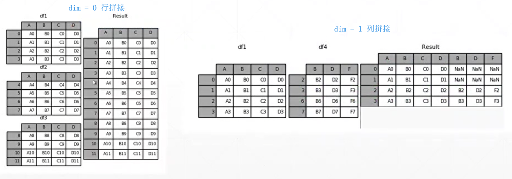

本篇介绍tensor的拼接与拆分。 

<!--more-->


# 拼接与拆分

- cat
- stack
- split
- chunk

# cat

- numpy中使用concat，在pytorch中使用更加简写的 cat
- 完成一个拼接
- 两个向量维度相同，想要拼接的维度上的值可以不同，但是其它维度上的值必须相同。

举个例子：还是按照前面的，想将这两组班级的成绩合并起来

a[class 1-4, students, scores] 

b[class 5-9, students, scores]

```python
In[4]: a = torch.rand(4,32,8)
In[5]: b = torch.rand(5,32,8)
In[6]: torch.cat([a,b],dim=0).shape
Out[6]: torch.Size([9, 32, 8])
# 结果就是9个班级的成绩
```

理解cat：

- 行拼接：[4, 4] 与 [5, 4] 以 dim=0（行）进行拼接  --->  [9, 4]   9个班的成绩合起来
- 列拼接：[4, 5] 与 [4, 3] 以 dim=1（列）进行拼接 ---> [4, 8]  每个班合成8项成绩




例2：

```python
In[7]: a1 = torch.rand(4,3,32,32)
In[8]: a2 = torch.rand(5,3,32,32)
In[9]: torch.cat([a1,a2],dim=0).shape		# 合并第1维 理解上相当于合并batch
Out[9]: torch.Size([9, 3, 32, 32])
In[11]: a2 = torch.rand(4,1,32,32)
In[12]: torch.cat([a1,a2],dim=1).shape		# 合并第2维 理解上相当于合并为 rgba
Out[12]: torch.Size([4, 4, 32, 32])
In[13]: a1 = torch.rand(4,3,16,32)
In[14]: a2 = torch.rand(4,3,16,32)
In[15]: torch.cat([a1,a2],dim=3).shape		# 合并第3维 理解上相当于合并照片的上下两半
Out[15]: torch.Size([4, 3, 16, 64])
In[17]: a1 = torch.rand(4,3,32,32)
In[18]: torch.cat([a1,a2],dim=0).shape
RuntimeError: invalid argument 0: Sizes of tensors must match except in dimension 0.
```


# stack

- 创造一个新的维度（代表了新的组别）
- 要求两个tensor的size完全相同

```python
In[19]: a1 = torch.rand(4,3,16,32)
In[20]: a2 = torch.rand(4,3,16,32) 
In[21]: torch.cat([a1,a2],dim=2).shape		# 合并照片的上下部分
Out[21]: torch.Size([4, 3, 32, 32])
In[22]: torch.stack([a1,a2],dim=2).shape	# 添加了一个维度 一个值代表上半部分，一个值代表下半部分。 这显然是没有cat合适的。
Out[22]: torch.Size([4, 3, 2, 16, 32])
In[23]: a = torch.rand(32,8)
In[24]: b = torch.rand(32,8)
In[25]: torch.stack([a,b],dim=0).shape		# 将两个班级的学生成绩合并，添加一个新的维度，这个维度的每个值代表一个班级。显然是比cat合适的。
Out[25]: torch.Size([2, 32, 8])
    
In[26]: a.shape
Out[26]: torch.Size([32, 8])
In[27]: b = torch.rand([30,8])
In[28]: torch.stack([a,b],dim=0)
RuntimeError: invalid argument 0: Sizes of tensors must match except in dimension 0
```


# split

- 按长度进行拆分：单元长度/数量
- 长度相同给一个固定值
- 长度不同给一个列表

```python
In[48]: a = torch.rand(32,8)
In[49]: b = torch.rand(32,8)
In[50]: c = torch.rand(32,8)
In[51]: d = torch.rand(32,8)
In[52]: e = torch.rand(32,8)
In[53]: f = torch.rand(32,8)
In[54]: s = torch.stack([a,b,c,d,e,f],dim=0)
In[55]: s.shape
Out[55]: torch.Size([6, 32, 8])  
In[57]: aa,bb = s.split(3,dim=0)	# 按数量切分，可以使用一个常数
In[58]: aa.shape, bb.shape
Out[58]: (torch.Size([3, 32, 8]), torch.Size([3, 32, 8]))
In[59]: cc,dd,ee = s.split([3,2,1],dim=0)	# 按单位长度切分，可以使用一个列表
In[60]: cc.shape, dd.shape, ee.shape
Out[60]: (torch.Size([3, 32, 8]), torch.Size([2, 32, 8]), torch.Size([1, 32, 8]))
    
In[61]: ff,gg = s.split(6,dim=0)	# 只切了一半，有一半不存在，所以报错
ValueError: not enough values to unpack (expected 2, got 1)
```


# chunk

- 按数量进行拆分

```python
In[63]: s.shape
Out[63]: torch.Size([6, 32, 8])
In[64]: aa,bb = s.chunk(2,dim=0)
In[65]: aa.shape, bb.shape
Out[65]: (torch.Size([3, 32, 8]), torch.Size([3, 32, 8]))
In[66]: cc,dd = s.split(3,dim=0)
In[67]: cc.shape,dd.shape
Out[67]: (torch.Size([3, 32, 8]), torch.Size([3, 32, 8]))
```


note：对于按数量切分：chunk中的参数是要切成几份；split的常数是每份有几个。