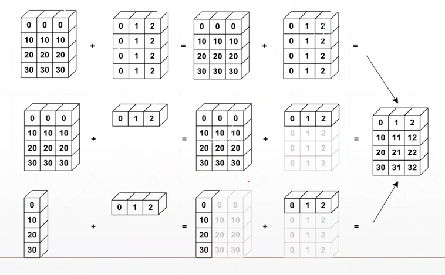

本篇介绍tensor的维度变化。 

<!--more-->


维度变化改变的是数据的理解方式！

- view/reshape：大小不变的条件下，转变shape
- squeeze/unsqueeze：减少/增加维度
- transpose/t/permute：转置，单次/多次交换
- expand/repeat：维度扩展


# view reshape

- 在pytorch0.3的时候，默认是view .为了与numpy一致0.4以后增加了reshape。
- **损失维度信息**，如果不额外存储/记忆的话，恢复时会出现问题。
- 执行view/reshape是有一定的物理意义的，不然不会这样做。
- 保证tensor的size不变即可/numel()一致/元素个数不变。
- **数据的存储/维度顺序非常非常非常重要**

```python
In[4]: a = torch.rand(4,1,28,28)
In[5]: a.shape
Out[5]: torch.Size([4, 1, 28, 28])
In[6]: a.view(4,28*28)        # 4, 1*28*28 将后面的进行合并/合并通道，长宽，忽略了通道信息，上下左右的空间信息。适合全连接层。
Out[6]: 
tensor([[0.1483, 0.6321, 0.8864,  ..., 0.0646, 0.4791, 0.0892],
        [0.5868, 0.5278, 0.8514,  ..., 0.0682, 0.7815, 0.2724],
        [0.4945, 0.4957, 0.0047,  ..., 0.4253, 0.4135, 0.1234],
        [0.0618, 0.4257, 0.1960,  ..., 0.1377, 0.5776, 0.4071]])
In[7]: a.view(4,28*28).shape
Out[7]: torch.Size([4, 784])
In[8]: a.view(4*28, 28).shape    # 合并batch，channel，行合并 放在一起为N [N,28] 每个N，刚好有28个像素点，只关心一行数据
Out[8]: torch.Size([112, 28])
In[9]: a.view(4*1,28,28).shape	# 4张叠起来了
Out[9]: torch.Size([4, 28, 28])
In[10]: b = a.view(4,784)  # a原来的维度信息是[b,c,h,w],但a这样赋值后，它是恢复不到原来的
In[11]: b.view(4,28,28,1)  # logic Bug  # 语法上没有问题，但逻辑上 [b h w c] 与以前是不对应的。
a.view(4,783)
RuntimeError: shape '[4, 783]' is invalid for input of size 3136
```


# squeeze 与 unsqueeze

## unsqueeze

- unsqueeze(index) 拉伸（增加一个维度）  （增加一个组别）
- 参数的范围是 [-a.dim()-1, a.dim()+1)    如下面例子中范围是[-5,5)  
- -5 --> 0   ... -1 --> 4   这样的话，0表示在前面插入，-1表示在后面插入，正负会有些混乱，所以推荐用正数。
- 0与正数，就是在xxx前面插入。

```python
In[17]: a.shape
Out[17]: torch.Size([4, 1, 28, 28])
In[18]: a.unsqueeze(0).shape	# 在0的前面插入一个维度
Out[18]: torch.Size([1, 4, 1, 28, 28])  # 理解上就是在batch的基础上增加了组。
In[19]: a.unsqueeze(-1).shape	# 在-1之后插入一个维度
Out[19]: torch.Size([4, 1, 28, 28, 1])  # 理解上可能增加一个方差之类的
In[20]: a.unsqueeze(4).shape
Out[20]: torch.Size([4, 1, 28, 28, 1])
In[21]: a.unsqueeze(-4).shape
Out[21]: torch.Size([4, 1, 1, 28, 28])
In[22]: a.unsqueeze(-5).shape
Out[22]: torch.Size([1, 4, 1, 28, 28])
In[23]: a.unsqueeze(-6).shape
IndexError: Dimension out of range (expected to be in range of [-5, 4], but got -6)
    
In[24]: a = torch.tensor([1.2,2.3])
In[27]: a.shape
Out[27]: torch.Size([2])
In[25]: a.unsqueeze(-1)  # 维度变成 [2,1]  2行1列
Out[25]: 
tensor([[1.2000],
        [2.3000]])
In[26]: a.unsqueeze(0)
Out[26]: tensor([[1.2000, 2.3000]]) # 维度变成 [1,2]  1行2列
```

## 实际案例

给一个bias（偏置），bias相当于给每个channel上的所有像素增加一个偏置

为了做到 f+b 我们需要改变b的维度

```python 
In[28]: b = torch.rand(32)
In[29]: f = torch.rand(4,32,14,14)
In[30]: b = b.unsqueeze(1).unsqueeze(2).unsqueeze(0)
In[31]: b.shape
Out[31]: torch.Size([1, 32, 1, 1])
```

后面进一步扩张到 [4,32,14,14]


## queeze

- squeeze(index) 当index对应的dim为1，就产生作用。
- 不写参数，会挤压所有维度为1的。

```python
In[38]: b.shape
Out[38]: torch.Size([1, 32, 1, 1])
In[39]: b.squeeze().shape  # 默认将所有维度为1的进行挤压 这32个channel，每个channel有一个值
Out[39]: torch.Size([32])
In[40]: b.squeeze(0).shape
Out[40]: torch.Size([32, 1, 1])
In[41]: b.squeeze(-1).shape
Out[41]: torch.Size([1, 32, 1])
In[42]: b.squeeze(1).shape
Out[42]: torch.Size([1, 32, 1, 1])
In[43]: b.squeeze(-4).shape
Out[43]: torch.Size([32, 1, 1])
```


# expand / repeat

- Expand：broadcasting  （推荐）
  - 只是改变了理解方式，并没有增加数据
  - 在需要的时候复制数据
- Reapeat：memory copied
  - 会实实在在的增加数据


上面提到的b [1, 32, 1, 1]    	f[ 4, 32, 14, 14 ]

目标是将b的维度变成与f相同的维度。

## expand

- 扩展（expand）张量**不会分配新的内存**，只是在存在的张量上创建一个新的视图（view）

```python
In[44]: a = torch.rand(4,32,14,14)
In[45]: b.shape
Out[45]: torch.Size([1, 32, 1, 1])  # 只有1-->N才是可行的， 3 -> N 是需要规则的
In[46]: b.expand(4,32,14,14).shape
Out[46]: torch.Size([4, 32, 14, 14])
In[47]: b.expand(-1,32,-1,-1).shape	# -1表示这个维度不变
Out[47]: torch.Size([1, 32, 1, 1])
In[48]: b.expand(-1,32,-1,-4).shape	# -4这里是一个bug，没有意义，最新版已经修复了
Out[48]: torch.Size([1, 32, 1, -4])
```


## repeat

- 主动复制原来的。
- 参数表示的是要拷贝的次数/是原来维度的倍数
- 沿着特定的维度重复这个张量，和*expand()*不同的是，这个函数**拷贝**张量的数据。

```python
In[49]: b.shape
Out[49]: torch.Size([1, 32, 1, 1])
In[50]: b.repeat(4,32,1,1).shape
Out[50]: torch.Size([4, 1024, 1, 1])
In[51]: b.repeat(4,1,1,1).shape
Out[51]: torch.Size([4, 32, 1, 1])
In[52]: b.repeat(4,1,32,32)
In[53]: b.repeat(4,1,32,32).shape
Out[53]: torch.Size([4, 32, 32, 32])
In[55]: b.repeat(4,1,14,14).shape	# 这样就达到目标了
Out[55]: torch.Size([4, 32, 14, 14])
```


# 转置

## .t

转置操作

- .t 只针对 2维矩阵

```python
a = torch.randn(3,4)
a.t().shape
Out[58]: torch.Size([4, 3])
In[60]: a
Out[60]: 
tensor([[ 0.5629, -0.5085, -0.3371,  1.2387],
        [ 0.2142, -1.7846,  0.2297,  1.7797],
        [-0.3197,  0.6116,  0.3791,  0.9218]])
In[61]: a.t()
Out[61]: 
tensor([[ 0.5629,  0.2142, -0.3197],
        [-0.5085, -1.7846,  0.6116],
        [-0.3371,  0.2297,  0.3791],
        [ 1.2387,  1.7797,  0.9218]])
b.t()
RuntimeError: t() expects a tensor with <= 2 dimensions, but self is 4D
```


## transpose

- 在结合view使用的时候，view会导致维度顺序关系变模糊，所以需要人为跟踪。
- 错误的顺序，会导致数据污染
- 一次只能两两交换
- contiguous

```python
# 由于交换了1，3维度，就会变得不连续，所以需要用contiguous，来吧数据变得连续。
In[17]: a1 = a.transpose(1,3).view(4,3*32*32).view(4,3,32,32)
RuntimeError: invalid argument 2: view size is not compatible with input tensor's size and stride (at least one dimension spans across two contiguous subspaces). Call .contiguous() before .view()
        
In[8]: a = torch.randn(4,3,32,32)
In[9]: a.shape
Out[9]: torch.Size([4, 3, 32, 32])
In[10]: a1 = a.transpose(1,3).contiguous().view(4,3*32*32).view(4,3,32,32)
    #[b c h w] 交换1，3维度的数据 [b w h c]，再把后面的三个连在一起，展开后变为 [b c w h] 导致和原来的顺序不同，造成数据污染！！！
In[11]: a1.shape
Out[11]: torch.Size([4, 3, 32, 32])
In[12]: a2 = a.transpose(1,3).contiguous().view(4,3*32*32).view(4,32,32,3).transpose(1,3)
    # [b c h w] -> [b w h c] -> [b w h c] -> [b c h w] 和原来顺序相同。
In[13]: a2.shape
Out[13]: torch.Size([4, 3, 32, 32])
# 验证向量一致性
In[14]: torch.all(torch.eq(a,a1))
Out[14]: tensor(0, dtype=torch.uint8)
In[15]: torch.all(torch.eq(a,a2))
Out[15]: tensor(1, dtype=torch.uint8)
```


## permute

- 会打乱内存顺序，待补充！！！
- 由于transpose一次只能两两交换，所以变换后在变回去至少需要两次操作，而permute一次就好。例如对于[b,h,w,c]
- [b,h,w,c]是numpy存储图片的格式，需要这一步才能导出numpy

```python
In[18]: a = torch.rand(4,3,28,28)
In[19]: a.transpose(1,3).shape	# [b c h w] -> [b w h c]  h与w的顺序发生了变换，导致图像发生了变化
Out[19]: torch.Size([4, 28, 28, 3]) 
In[20]: b = torch.rand(4,3,28,32)
In[21]: b.transpose(1,3).shape
Out[21]: torch.Size([4, 32, 28, 3])
In[22]: b.transpose(1,3).transpose(1,2).shape
Out[22]: torch.Size([4, 28, 32, 3]) # [b,h,w,c]是numpy存储图片的格式，需要这一步才能导出numpy
In[23]: b.permute(0,2,3,1).shape
Out[23]: torch.Size([4, 28, 32, 3])

```


# Broadcast

**自动扩展**：

- 维度扩展，自动调用expand
- without copying data ，不需要拷贝数据。


## 核心思想

- 在前面插入1维
- 将size 1 扩展成相同 size 的维度

例子：

- 对于 feature maps : [4, 32, 14, 14]，想给它添加一个偏置Bias
- Bias:[32]  --> [32, 1 , 1] (这里是手动的)  => [1, 32, 1, 1]  =>  [4, 32, 14, 14]
- 目标：当Bias和feature maps的size一样时，才能执行叠加操作！！！


## Why broadcasting？

就像下图表示的一样：我们希望进行如下的几种计算，但需要满足数学上的约束（size相同），为了节省人们为满足数学上的约束而手动复制的过程，而产生的Broadcast，它节省了大量的内容消耗。



- 第二行数据中  [3] => [1, 3] => [4, 3] (行复制了4次)
- 第三行数据中  
  - [4,1] => [4, 3]  (列复制了3次)
  - [1,3] => [4, 3] （行复制了4次）
- broadcast = unsqueze（插入新维度） + expand（将1dim变成相同维度）

例子：

- 有这样的数据 [class, students, scores]，具体是4个班，每个班32人，每人8门课程[4, 32, 8] 。
- 考试不理想，对于这组数据我们需要为每一位同学的成绩加5分
- 要求：   [4, 32, 8]  + [4, 32, 8] 
- 实际上：[4, 32, 8]  + [5.0]
- 操作上：[1] =>(unsqueeze) [1, 1, 1] =>(expand_as)  [4, 32, 8]，这样需要写3个接口。
- 所以才会有 broadcast！！

内存分析：

- [4, 32, 8] => 1024
- [5.0] => 1    如果是手动复制的话，内存消耗将变为原来的1024倍


## 使用条件？

A [ 大维度  --->  小维度 ]

从最后一位（最小维度）开始匹配，如果维度上的size是0，1或相同，则满足条件，看下一个维度，直到都满足条件为止。

- 如果当前维度是1，扩张到相同维度
- 如果没有维度，插入一个维度并扩张到相同维度
- 当最小维度不匹配的时候是没法使用broadcastiong，如共有8门课程，但只给了4门课程的变化，这样就会产生歧义。

note：小维度指定，大维度随意

小维度指定：假如英语考难了，只加英语成绩 [0 0 5 0 0 0 0 0]


## 案例

### 情况一

A[4, 32, 14, 14]

B[1, 32, 1, 1]  => [4,,32, 14, 14]

### 情况二

A[4, 32, 14, 14]

B[14, 14] => [1, 1, 14, 14] => [4, 32, 14, 14]

### 情况三

不符合条件

A[4, 32, 14, 14]

B[2, 32, 14, 14]


## 理解这种行为

- 小维度指定，大维度随意。小维度设定规则（加5分），大维度默认按照这个规则（通用）。
- 维度为1才满足条件，是为了保证公平（统一的规则）


## 常见使用情景

- A [4, 3, 32, 32]      b,c,h,w 
- +[32, 32]    叠加一个相同的feature map，做一些平移变换。相当于一个base（基底），
- +[3, 1, 1]    针对 RGB 进行不同的补充，如R 0.5 、G 0 、B 0.3
- +[1, 1, 1, 1]    对于所有的都加一个数值，抬高一下，如加0.5.