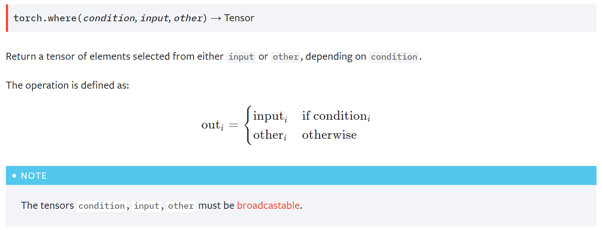

本篇介绍Pytorch的两个高阶操作: where与gather。 

<!--more-->


# where

## 使用



图片来自 [Pytorch官方文档](https://pytorch.org/docs/stable/torch.html?highlight=where#torch.where).

- 就像python中的三元运算一样，如果条件满足，选input的元素，不满足选other的元素。

```python
In[49]: cond = torch.rand(2,2)	# 制作一个选择器
In[50]: cond
Out[50]: 
tensor([[0.2181, 0.4352],
        [0.2425, 0.7505]])
In[51]: a = torch.zeros(2,2)
In[52]: b = torch.ones(2,2)
In[53]: torch.where(cond>0.5,a,b)
Out[53]: 
tensor([[1., 1.],
        [1., 0.]])
```


## 为什么会有where

- 以前我们通常在for循环下以 c[0] = a[0] 来进行整段的复制，但是这些都是在cpu上完成的，想要用gpu并行，就必须摆脱这种方式。
- 使用where语句，**在gpu中，高度并行**。
- cond 可以由cpu生成也可以有gpu生成。


# gather

```python
torch.gather(input, dim, index, out=None, sparse_grad=False) → Tensor
```

- 收集/查表

- input 理解为一张表；dim决定哪个维度查找；所查的索引

- 这样做一来可以用gpu加速，二来可以达到从 relative gather 到 global gather。


例子：

- 以手写体数字为例，我们假设输出[4,10]

- 每张图片取可能性最大的前3


```python
In[3]: prob=torch.randn(4,10)
In[4]: idx = prob.topk(dim=1, k=3)
In[5]: idx
Out[5]: 
torch.return_types.topk(
values=tensor([[0.6667, 0.3384, 0.2990],
        [1.7411, 0.6379, 0.3942],
        [1.4432, 1.3714, 0.9460],
        [1.8640, 1.2523, 0.8521]]),
indices=tensor([[6, 5, 1],
        [1, 8, 5],
        [1, 0, 8],
        [3, 6, 7]]))
In[6]: label = torch.arange(10)+100		# 生成label
In[17]: _,idx = idx
In[18]: idx
Out[18]: 
tensor([[6, 5, 1],
        [1, 8, 5],
        [1, 0, 8],
        [3, 6, 7]])
In[19]: torch.gather(label.expand(4,10),dim=1,index=idx)	# 完成查表
Out[19]: 
tensor([[106, 105, 101],
        [101, 108, 105],
        [101, 100, 108],
        [103, 106, 107]])
```

