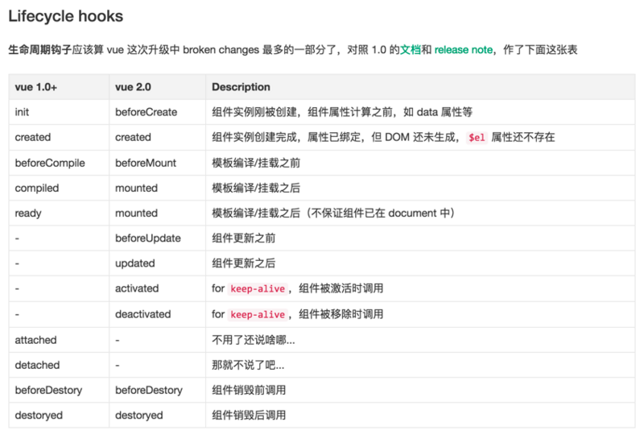
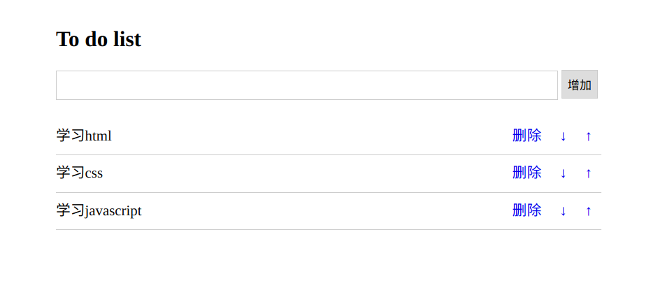

本篇介绍Vue基础。 

<!--more-->


# 入门篇

- vue.js是目前前端web开发最流行的工具库，由尤雨溪在2014年2月发布的。

- 另外几个常见的工具库：react.js /angular.js

- 官方网站：

  - 中文：https://cn.vuejs.org/

  - 英文：https://vuejs.org/

- 官方文档：https://cn.vuejs.org/v2/guide/

- vue.js目前有1.x、2.x和3.x 版本，本篇使用2.x，原因是目前3.x还不成熟。


## vue.js库的下载

1. 可以在 [官网](https://cn.vuejs.org/v2/guide/installation.html) 下载，有开发版本和生产版本，学习时使用开发版本就行。

2. 也可以在 [GitHub](https://github.com/vuejs/vue) 下载，js位于 `dist` 文件夹


## vue.js库的基本使用

vue的引入类似于jQuery，开发中可以使用开发版本vue.js，产品上线要换成vue.min.js。


三步走：

```html
1.创建Vue对象
	var vm = new Vue()
2.创建vue对象的时候，需要传递参数，是json对象，json对象对象必须至少有两个属性成员
	var vm = new Vue({
    	el: "#app",
    	data: {
    		hello: "Hello Vue!",
   		}
    })
   el:设置vue可以操作的html内容范围，值一般就是css的id选择器。
   data: 保存vue.js中要显示到html页面的数据。
3. vue.js要控制器的内容外围，必须先通过id来设置。
	<div id="app">
    	{{hello}}
	</div>
```


第一个vue示例：

```html
<!DOCTYPE html>
<html lang="en">
<head>
    <meta charset="UTF-8">
    <title>Title</title>
    <script src="vue.js"></script>
    <script>
        window.onload = function () {
            var vm = new Vue({
                el: "#app",
                data: {
                    hello: "Hello Vue!",
                }
            })
        }        
    </script>
</head>
<body>
<div id="app">
    {{hello}}
</div>
</body>
</html>
```

上面代码将在页面中显示： Hello Vue!

 

## vue.js的M-V-VM思想

MVVM 是Model-View-ViewModel 的缩写，它是一种基于前端开发的架构模式。

`Model` 指代的就是vue对象的**data属性里面的数据**。这里的数据要显示到页面中。

`View`  指代的就是vue中数据要显示的HTML页面(绑定标签)，在vue中，也称之为“视图模板” 。

`ViewModel ` 指代的是vue.js中我们编写代码时的**vm对象**了，它是vue.js的核心，负责连接 View 和 Model，保证**数据data属性中的数据和html视图中的内容的一致性**，所以前面代码中，data里面的数据被显示中p标签中就是vm对象自动完成的。


例子：

```html
<!DOCTYPE html>
<html lang="en">
<head>
    <meta charset="UTF-8">
    <title>Title</title>
    <script src="js/vue.js"></script>
    <script>
        window.onload = function () {
            vm = new Vue({
                el: "#box",
                data: {
                    img: "logo.png",
                    content: "<h1>大标题</h1>",
                    url: "https://www.baidu.com",
                },
                // 事件触发时调用的方法，待补充
                methods: {
                    show() {
                        alert('hello')
                    }
                }
            })
        }
        // js中也有三元表达式，也叫三元运算符
        // 格式：
        // 条件?true:false;

    </script>

</head>
<body>

<div id="box">
    <!--支持js的方法-->
    <span v-text="img.toUpperCase()"></span> <br>
    <span v-text="img.toUpperCase()">不要在这里写了，写了也不会显示</span> <br>

    <!--v-text只能显示字符串-->
    <span v-text="content"></span> <br>
    <!--v-html将解析字符串中的标签-->
    <span v-html="content"></span> <br>
    <!--显示图片-->
     <br>
    <!--v-model 将来可以同步到model中-->
    <input type="text" v-model="img"> <br>
    <!--三元运算符-->
    {{num%2==0?"偶数":"奇数"}} <br>

    <a v-bind:href="url">百度</a> <!--不建议使用-->
    <br>
    <!--使用链接-->
    <a :href="url">百度</a>

    <!--绑定事件-->
    <p @click="show">点我</p>
    <p v-on:click="show">点我</p>  <!--不建议使用-->
</div>
</body>
</html>
```


总结：

```
1. 如果要输出data里面的数据作为普通标签的内容，需要使用{{  }}
   用法：
      vue对象的data属性：
          data:{
            name:"小明",
          }
      标签元素：
      		<h1>{{ name }}</h1>
      		
2. 如果要输出data里面的数据作为表单元素的值，需要使用vue.js提供的元素属性v-model
   用法：
      vue对象的data属性：
          data:{
            name:"小明",
          }
      表单元素：
      		<input v-model="name">
      
   使用v-model把data里面的数据显示到表单元素以后，一旦用户修改表单元素的值，则data里面对应数据的值也会随之发生改变，甚至，页面中凡是使用了这个数据都会发生变化。

3.可以在普通标签中使用{{  }} 或者 v-html 来输出data里面的数据
   <h1>{{message}}</h1>

4.可以在表单标签中使用v-model属性来输出data里面的数据，同时还可以修改data里面的数据
   <input type="text" v-model="username">

5.三元运算符
	判断条件 ? 条件为true : 条件为false的结果
```


# 常用指令

指令 (Directives) 是带有“v-”前缀的特殊属性。每一个指令在vue中都有固定的作用。

在vue中，提供了很多指令，常用的有：v-if、v-model、v-for等等。

指令会在vm对象的data属性的数据发生变化时，会同时改变元素中的其控制的内容或属性。

因为vue的历史版本原因，所以有一部分指令都有两种写法：

```
vue1.x写法             vue2.x的写法
v-html         ---->   {{ 普通文本 }}   # vue2.x 也支持v-html,v-text，输出html代码的内容
v-bind:属性名   ---->   :属性
v-on:事件名     ---->   @事件名
```


## 操作属性

格式：

```
<标签名 :标签属性="data属性"></标签名>
```


在 2.x 中，省略了v-bind，直接使用冒号就可以。

```html
<p :title="str1">{{ str1 }}</p> <!-- 也可以使用v-html显示双标签的内容，{{  }} 是简写 -->
<a :href="url2">淘宝</a>
<a v-bind:href="url1">百度</a>  <!-- v-bind是vue1.x版本的写法 -->
```


例子：显示输入的密码效果：

```html
<!DOCTYPE html>
<html lang="en">
<head>
    <meta charset="UTF-8">
    <title>Title</title>
    <script src="js/vue.js"></script>

</head>
<body>
<div id="app">
    <input :type="tp" v-model="pwd">
    <input type="button" @mousedown="down" @mouseup="up" v-model="message">
</div>
   <script>
        var vm = new Vue({
            el: "#app",
            data: {
                pwd:"",
                tp:"password",
                message:"显示密码"
            },
            methods:{
                down(){
                    // 在methods中把子方法里面要做data的属性，可以直接用this.属性值
                    this.tp = "text",
                    this.message="隐藏密码"
                },
               up(){
                    this.tp = "password",
                   this.message="显示密码"
               }
            }
        })
    </script>
</body>
</html>
```


## 事件绑定

有两种事件操作的写法，@事件名 和 v-on:事件名，@是 2.x 版本，也是推荐使用的：

```html
<button v-on:click="num++">按钮</button>   <!-- v-on 是vue1.x版本的写法 -->
<button @click="num+=5">按钮</button>
```

总结：

```html
1. 使用@事件名来进行事件的绑定
   语法：
      <h1 @click="num++">{{num}}</h1>

2. 绑定的事件的事件名，全部都是js的事件名：
   @submit   --->  onsubmit
   @focus    --->  onfocus
   ....

```


例子：购物车中的商品数量调整，并改变总价

- 浮点数的运算永远是近似计算。我们需要四舍五入，保留两位。

```html
<!DOCTYPE html>
<html lang="en">
<head>
    <meta charset="UTF-8">
    <title>Title</title>
    <script src="js/vue.js"></script>
</head>
<body>
<div id="box">
   <button @click="add">+</button>
    <input type="text" v-model="num">
   <button @click="sub">-</button>
    单价：{{price.toFixed(2)}}
    <p>总计：{{total.toFixed(2)}}</p>
</div>
<script>
    var vm = new Vue({
        el: "#box",
        data: {
            num:1,
            total:39.8,
            price:39.8,
        },
        methods:{
            add(){
                // 减少数量
                this.num = parseInt(this.num) + 1;
                    // 将 num 转成int 不然的话会变成字符串的拼接
                // 计算总价
                this.total = this.price * this.num
                // 浮点数的运算永远是近似计算。四舍五入
            },
            sub(){
                // 减少数量
                if (this.num <=1){
                    return
                }
                this.num -= 1;
                // 计算总价
                this.calc();
            },
            calc(){
                this.total = this.price * this.num
            }
        }
    })
</script>
</body>
</html>
```


## 操作样式

推荐使用 class ，而不使用 style 来操作样式。

### 控制标签class类名

格式：

```
   <h1 :class="值">元素</h1>  值可以是字符串、对象、对象名、数组
```


```html
<!DOCTYPE html>
<html lang="en">
<head>
    <meta charset="UTF-8">
    <title>Title</title>
    <script src="js/vue.js"></script>
    <style>
      .box{
          width: 100px;
          height: 100px;
          background-color: red;
      }
        .box1{
            border-radius: 5px;
        }
        .box3{
            width: 200px;
            height: 200px;
            background-color: blue;
        }
    </style>
</head>
<body>
<div id="app">
    <!--第一种：使用变量-->
    <div :class="cls"></div>

    <!--第二种：使用数组-->
    <div :class="[cls1,cls2]"></div>

    <!--第三种：使用对象-->
    <div :class="{box3:show_box3,box1:show_box1}"></div>
</div>
<script>
    var vm = new Vue({
        el: "#app",
        data: {
            cls:"box box1",
            cls1:'box',
            cls2:'box1',
            show_box3:true,
            show_box1:true
        },
    })
</script>
</body>
</html>
```

总结：

```html
1. 给元素绑定class类名，最常用的就是第一种。
    vue对象的data数据：
        data:{
          myObj:{
            complete:true,
            uncomplete:false,
          }
        }

		html元素：    
    		<div class="box" :class="myObj">2222</div>
    最终浏览器效果：
		    <div class="box complete">2222</div>
```


例子：网页背景开关灯

```html
<!DOCTYPE html>
<html lang="en">
<head>
    <meta charset="UTF-8">
    <title>Title</title>
    <script src="js/vue.js"></script>
    <style>
        .baitian{
            background-color: white;
        }
        .heiye{
            background-color: #666;
        }
        .bg{
            width: 100%;
            height: 1000px;
        }
    </style>
</head>
<body >
<div id="app" class="bg" :class="{baitian:is_show,heiye:is_show_2}">
    <button @click="change">关灯</button>
</div>

<script>
    var vm = new Vue({
        el: "#app",
        data: {
            is_show:true,
            is_show_2:false
        },
        methods:{
            change(){
                if(this.is_show == true){
                    this.is_show = false;
                    this.is_show_2 = true
                }
                else{
                    this.is_show = true;
                    this.is_show_2 = false
                }
            }
        }
    })
</script>
</body>
</html>
```


### 控制标签style样式

使用 style 的缺点：不好更新，不利于复制

```html
格式1：值是json对象，对象写在元素的:style属性中
	 标签元素：
		     <div :style="{color: activeColor, fontSize: fontSize + 'px' }"></div>
	 data数据如下：
         data: {
             activeColor: 'red',
             fontSize: 30
         }
格式2：值是对象变量名，对象在data中进行声明
   标签元素：
   			<div v-bind:style="styleObject"></div>
   data数据如下：
         data: {
            	styleObject: {
             		color: 'red',
             		fontSize: '13px'
			  	}
		}

格式3：值是数组
  标签元素：
				<div v-bind:style="[style1, style2]"></div>
	data数据如下：
				data: {
                     style1:{
                       color:"red"
                     },
                     style2:{
                       background:"yellow",
                       fontSize: "21px"
                     }
				}
```


例子：vue版本选项卡

```html
<!DOCTYPE html>
<html lang="en">
<head>
    <meta charset="UTF-8">
    <title>Title</title>
    <style>
        #card{
            width: 500px;
            height: 350px;
        }
        .title{
            height:50px;
        }
        .title span{
            width: 100px;
            height: 50px;
            background-color:#ccc;
            display: inline-block;
            line-height: 50px; /* 设置行和当前元素的高度相等,就可以让文本内容上下居中 */
            text-align:center;
        }
        .content .list{
            width: 500px;
            height: 300px;
            background-color: yellow;
            display: none;
        }
        .content .active{
            display: block;
        }

        .title .current{
            background-color: yellow;
        }
    </style>
    <script src="js/vue.js"></script>
</head>
<body>

    <div id="card">
        <div class="title">
            <span @mouseover="num=1" @mouseleave="num=0" :class="num==1?'current':''">国内新闻</span>
            <span @mouseover="num=2" @mouseleave="num=0" :class="num==2?'current':''">国际新闻</span>
            <span @mouseover="num=3" @mouseleave="num=0" :class="num==3?'current':''">银河新闻</span>
            <!--<span>{{num}}</span>-->
        </div>
        <div class="content">
            <div class="list" :class="num==1?'active':''">国内新闻列表</div>
            <div class="list" :class="num==2?'active':''">国际新闻列表</div>
            <div class="list" :class="num==3?'active':''">银河新闻列表</div>
        </div>
    </div>
    <script>
        // 思路：
        // 当用户点击标题栏的按钮[span]时，显示对应索引下标的内容块[.list]
        // 代码实现：
        var card = new Vue({
            el:"#card",
            data:{
                num:0,
            },
        });
    </script>
</body>
</html>
```


## 条件渲染指令

vue中提供了两个指令可以用于判断是否要显示元素，分别是v-if和v-show。

### v-if

- 如果为false，则 v-if 会直接干掉标签

```html
  标签元素：
      <!-- vue对象最终会把条件的结果变成布尔值 -->
			<h1 v-if="ok">Yes</h1>
  data数据：
  		data:{
      		ok:false    // true则是显示，false是隐藏，不再DOM中
      }
```


### v-else

- v-else指令来表示 v-if 的“else 块”，v-else 元素必须紧跟在带 v-if 或者 v-else-if 的元素的后面，否则它将不会被识别。
- 如果为false，则标签将不会在DOM中。

```html
  标签元素：
			<h1 v-if="ok">Yes</h1>
			<h1 v-else>No</h1>
  data数据：
  		data:{
      		ok:false    // true则是显示，false是隐藏 => 不再DOM
      }
```


### v-else-if

- 可以出现多个v-else-if语句，但是v-else-if之前必须有一个v-if开头。后面可以跟着v-else，也可以没有。

- 如果为false，则 v-else-if 会直接干掉标签

```html
  标签元素：
		<h1 v-if="num==1">num的值为1</h1>
		<h1 v-else-if="num==2">num的值为2</h1>
		<h1 v-else>num的值是{{num}}</h1>
  data数据：
  		data:{
      		num:2
      }
```


### v-show

用法和v-if大致一样，区别在于2点：

1. v-show后面不能v-else或者v-else-if
2. v-show隐藏元素时，使用的是display:none来隐藏的，而v-if是直接从HTML文档中移除元素[ DOM操作中的remove ] 

```html
  标签元素：
			<h1 v-show="ok">Hello!</h1>
  data数据：
  		data:{
      		ok:false    // true则是显示，false是隐藏 => display:none
      }
```


例子：

```html
    <div id="app">
        <div class="box" v-if="ok">v-if</div>
        <div class="box box1" v-else>v-else</div>
        <div class="box" v-show="ok">v-show</div>
        <!--v-if 会直接干掉标签-->
        <!--v-show 只是改变display:none-->
        <hr>
        <div class="box" v-if="num%3==0">num是3的倍数</div>
        <div class="box" v-else-if="num%5==0">num是5的倍数</div>
        <div class="box box1" v-else>num既不是3也不是5的倍数</div>
    </div>
    <script>
        var vm = new Vue({
            el:"#app",
            data:{
                ok:true,
                num:3
            },
        });
    </script>
```


## 列表渲染指令

- 通过v-for指令可以将一组数据渲染到页面中，数据可以是数组或者对象。
- 如： `student,index in student_list`

```html
<!DOCTYPE html>
<html lang="en">
<head>
    <meta charset="UTF-8">
    <title>Title</title>
    <style>
        .box {
            height: 100px;
            width: 100px;
            background-color: black;
        }
        .box {
            background-color: red;
        }
    </style>
    <script src="js/vue.js"></script>
</head>
<body>
<div id="app">
    <table border="1" width="800px">
        <tr>
            <th>序号</th>
            <th>ID</th>
            <th>姓名</th>
            <th>年龄</th>
        </tr>
        <tr v-for="student,index in student_list">
            <td>{{index+1}}</td>
            <td>{{student.id}}</td>
            <td>{{student.name}}</td>
            <td>{{student.age}}</td>

        </tr>
    </table>
</div>
<script>
    var vm = new Vue({
        el: "#app",
        data: {
            student_list: [
                {'id': 1, "name": "小明1", "age": 13},
                {'id': 2, "name": "小明2", "age": 13},
                {'id': 3, "name": "小明3", "age": 13},
                {'id': 4, "name": "小明4", "age": 13},
                {'id': 5, "name": "小明5", "age": 13},
            ]
        },
    });
</script>

</body>
</html>
```


# Vue对象提供的属性功能

## 过滤器

- 过滤器，就是vue允许开发者自定义的文本格式化函数，可以使用在两个地方：输出内容和操作数据中。

- 它将对原本的数据加工成我们想要的新数据。

- 定义过滤器的方式有两种：全局过滤器与局部过滤器。


### 全局过滤器

格式：`Vue.filter('过滤器名称',匿名函数)`

```html
<div id="app">
    <p>{{price|RMB}}</p>
</div>
<script>    
    // 全局过滤器：通过Vue.filter('过滤器名称',匿名函数)
    Vue.filter('RMB',function (v) {
        return "￥"+v;
    });
    var vm = new Vue({
        el: '#app',
        data: {
            price:30.5
        },
    })
</script>
```


### 局部过滤器

格式：`filters:{ 过滤器函数 }`

```html
<div id="app">
    <p>{{price|RMB}}</p>
</div>
<script>  
    // 局部过滤器:直接把过滤器写在当前vm对象中，只适用于当前vm对象
    var vm = new Vue({
        el: '#app',
        data: {
            price:30.5
        },
        filters:{
            RMB(v) {
                return '￥' + v;
            }
        }
    })
</script>
```


## 计算属性

- 当我们需要针对data的数据调整成另一个变量，留作其他地方进行运算时使用，可以使用计算属性得到一个新的变量
- 计算属性（computed），可以让我们把调整data数据的代码存在在该属性中。
- 如下例中从price中拿到price2

```html
<div id="app">
    <p>{{price}}</p>
    <p>{{price2}}</p>
</div>
<script>
    // 当我们需要针对data的数据调整成另一个变量，留作其他地方进行运算时使用，可以使用计算属性得到一个新的变量
    var vm = new Vue({
        el: '#app',
        data: {
            price:30.5
        },
        computed:{  //计算属性：里面的函数都必须有返回值
            price2(){
                return this.price.toFixed(2)
            }
        }
    })
</script>
```


## 监听属性

侦听属性（watch），可以帮助我们侦听data某个数据的变化，从而做相应的自定义操作。

侦听属性是一个对象，它的键是要监听的对象或者变量，值一般是函数，当侦听的data数据发生变化时，会自定执行的对应函数，这个函数在被调用时，vue会传入两个形参，第一个是变化前的数据值，第二个是变化后的数据值。

例子：

```html
<div id="app">
    数量：<input type="text" v-model="num">
    单价：<input type="text" v-model="price">
    总价：{{total}}
</div>
<script>
    // 只要监听的变量有变化，则会自动执行匿名函数
    var vm = new Vue({
        el: '#app',
        data: {
            price:30.5,
            num:0,
            total:0,
        },
        watch:{
            num(newval, oldval){
                // num发生变化的时候，要执行的代码
                // console.log('修改后num='+ newval);
                // console.log('修改前num='+ oldval);
                this.total = this.price * this.num;
            },
            price(){
                // price发生变化的时候，要执行的代码
                this.total = this.price * this.num;
            }
        }
    })
</script>
```


### Vue对象的生命周期

每个Vue对象在创建时都要经过一系列的初始化过程。在这个过程中Vue.js会自动运行一些叫做生命周期的的钩子函数，我们可以使用这些函数，在对象创建的不同阶段加上我们需要的代码，实现特定的功能。

话不多说，先上图：

生命周期：


钩子：



通过一个例子解释：

```html
<!DOCTYPE html>
<html lang="en">
<head>
    <meta charset="UTF-8">
    <title>Title</title>
    <script src="js/vue.js"></script>
    <script src="js/filter.js"></script>
</head>
<body>
<div id="app">
    {{num}}

    <!--修改内容时会涉及 beforeUpdate 与 updated-->
    <input type="text" v-model="num">
</div>
<script>
    // 只要监听的变量有变化，则会自动执行匿名函数
    var vm = new Vue({
        el: '#app',
        data: {
            num: 30,
        },
        // 创建data之前,组件实例刚刚被创建，组件属性计算之前；（vm对象还没有初始化完成的时候执行）
        // 用来加载第三方扩展
        beforeCreate() {
            console.log('beforeCreate');
            console.log(this.$data);    //undefined 组件属性还未计算，如data属性
            console.log(this.num);      //undefined 得不到里面的数据
            console.log('---------------')
        },
        created() {
            // 这里的代码执行时，vm对象创建完成，属性已绑定，但是还没有把数据和视图模板进行绑定（DOM未生成，$el属性还不存在）
            console.log(this.num);      // data的数据已经可以操作了。
            console.log(this.$data);    // 可以取出数据了
            console.log(this.$el);      //undefined 此时还没有绑定视图
            // console.log(this.$el.innerHTML)  // DOM未生成
            // 这里以后用于编写从后端获取数据的代码
            console.log('---------------')
        },
        beforeMount() {
            // 这里的代码执行时，已经绑定了视图，但是没有更新视图中的数据
            // 还没有把数据放入
            console.log(this.$el.innerHTML);
            console.log('---------------')
        },
        mounted() {
            // 这里的代码执行时，已经把 data 中的数据替换了模板视图对应的内容
            console.log(this.$el);
            // 这里可以用于编写一些需要操作视图初始化代码
            console.log('---------------')
        },
        beforeUpdate() {
            // 更新html模板数据之前
            console.log(this.num);
            console.log(this.$el.innerHTML);
            console.log('---------------')
        },
        updated() {
            // 更新html模板数据之后，区别在于视图模板
            console.log(this.num);
            console.log(this.$el.innerHTML);
            console.log('---------------')
        }
        // beforeUpdate,updated很少用，因为监听属性和他们重复了，所以很少用
        // created,mounted 经常使用
    })
</script>
</body>
</html>
```

总结：

待补充！！！！！！！！！！！！！！！！！！！！！！！！！


## 阻止事件冒泡和刷新页面

只需要在事件后面加上.stop和.prevent，如@click.stop，@click.prevent


### 事件

- 事件（event）在js中表示用户和浏览器之间进行的一次交互过程

- 事件在触发时，就会有一个事件对象来记录整个事件发生的过程和发生的位置

### 事件冒泡

- 从事件发生位置由内及外，根据标签之间父子嵌套关系，逐层往外传播，让父级元素触发同类事件，这种事件的传递方式称为事件冒泡。

- 优点：可以利用这种机制实现事件的委托。
- 缺点：当前元素的父级元素有同类事件，会随着冒泡直接全部执行。


事件冒泡效果演示：

```html
<body onclick="alert('body')">
<div onclick="alert('div')">
    <button>按钮</button>
</div>
<script>
    var vm = new Vue({
        el: '#app',
        data: {
            num:30,
        },
    })
</script>
```


### 事件委托

- 场景：当一个父标签下有很多的子标签时，逐个给子标签绑定事件是一个繁琐，重复的过程。或者当我们在父标签中添加新的子标签时，对子标签绑定事件也有些繁琐。所以事件委托是很好的解决办法。


原生 js 如下：

```html
<ul id="list">
    <li>111</li>
    <li>222</li>
    <li>333</li>
    <li>444</li>
    <li>555</li>
    <li>666</li>
</ul>
<script>
    var list = document.getElementById('list');
    list.onclick = function (event) {
        console.log(this);          // 事件绑定的对象
        console.log(event);         //  事件对象
        console.log(event.target);  //  事件触发点
        let self = event.target;
        console.log(self.innerHTML)
    }
</script>
```


有适合事件委托的场景，那也就有不适合事件委托的场景了，如我只希望该标签响应而不希望它的父标签或者父级的父级标签响应。


### 阻止事件冒泡（原生js）

在函数定义内加入如下两句：

- `event.stopPropagation();`       
- `event.cancelBubble = true;`

```html
<div id="box">
    <button id="btn">按钮</button>
</div>
<script>
    var box = document.getElementById('box');
    var btn = document.getElementById('btn');
    box.onclick = function (event) {
        alert('父元素')
    };
    btn.onclick = function (event) {
        alert('按钮');
        // 为了兼容，两个一起用
        event.stopPropagation();
        event.cancelBubble = true;
    }
</script>
```


### 阻止事件冒泡（vue）

- 只需要在事件后面加上.stop如 `@click.stop`

```python
<div id="box" @click="show2">
	<button @click="show">按钮</button>
    <button @click.stop="show">按钮</button>
</div>
<script>
    var vm = new Vue({
        el:'#box',
        data:{},
        methods:{
            show(){
                console.log(666)
                alert('按钮')
            },
            show2(){
                console.log(777)
                alert('父元素')
            },
        }
    })
</script>
```


### 阻止页面刷新

场景：对于会产生跳转的标签（如a标签，表单中的 submit，button）我们绑定了click事件的时候，但我们只想执行click事件，而不想刷新页面。例如：对于a标签，当它有 href 属性的时候，虽然 href 的值为空，但只要点击这个标签就会刷新页面。

- js 中直接使用return 就可以
- 在vue中，使用 `@事件.prevent`

```
<div id="box">      
	<a href="" @click="show3">a链接</a>
    <a href="" @click.prevent="show4">a链接</a>
    <!-- 很多时候，这里会有空href -->
</div>
<script>
    var vm = new Vue({
        el:'#box',
        data:{},
        methods:{          
            show3(){
                // 需要阻止默认的刷新，以前在js中使用return false
                console.log('一句话')
            },
            show4(){
                // 需要阻止默认的刷新，以前在js中使用return false
                console.log('一句话')
            },
        }
    })
</script>
```


### 综合练习

完成我的计划列表，该列表中可以添加，删除计划，同时每行信息可以上下移动。

效果如下：




核心：

- 使用push来完成添加
- 使用splice来完成上下移动以及删除。

完整代码如下：

```html
<!DOCTYPE html>
<html lang="en">
<head>
	<meta charset="UTF-8">
	<title>todolist</title>
	<style type="text/css">
		.list_con{
			width:600px;
			margin:50px auto 0;
		}
		.inputtxt{
			width:550px;
			height:30px;
			border:1px solid #ccc;
			padding:0px;
			text-indent:10px;
		}
		.inputbtn{
			width:40px;
			height:32px;
			padding:0px;
			border:1px solid #ccc;
		}
		.list{
			margin:0;
			padding:0;
			list-style:none;
			margin-top:20px;
		}
		.list li{
			height:40px;
			line-height:40px;
			border-bottom:1px solid #ccc;
		}

		.list li span{
			float:left;
		}

		.list li a{
			float:right;
			text-decoration:none;
			margin:0 10px;
		}
	</style>
	<script src="js/vue.js"></script>
</head>
<body>
	<div class="list_con" id="app">
		<h2>To do list</h2>
		<input type="text" name="" id="txt1" class="inputtxt" v-model="text">
		<input type="button" name="" value="增加" id="btn1" class="inputbtn" @click="add">

		<ul id="list" class="list">			
			<li v-for="item,index in todolist">
				<span>{{item}}</span>
				<a href="javascript:;" class="up" @click="up(index)"> ↑ </a>
				<a href="javascript:;" class="down" @click="down(index)"> ↓ </a>
				<a href="javascript:;" class="del" @click="del(index)">删除</a>
			</li>
			</ul>
	</div>

    <script>
        var vm = new Vue({
            el:'#app',
            data:{
            	todolist:[
            		'学习html',
            		'学习css',
            		'学习javascript',
				],
				text:''
            },
			methods:{
            	add(){
            		console.log(this.text);
            		this.todolist.push(this.text);
					this.text = ''
				},
				del(index){
            		this.todolist.splice(index,1);
				},
				up(index){
            		if(index===0){
            			return
					}
					ret = this.todolist.splice(index,1)[0];
					console.log(ret);
					this.todolist.splice(index - 1,0,ret);
					console.log(this.todolist)
				},
				down(index){
					ret = this.todolist.splice(index,1)[0];
					console.log(ret);
					this.todolist.splice(index + 1,0,ret);
					console.log(this.todolist)
				}
			}
			// splice 万能函数，可以做增删查改
        })
    </script>
</body>
</html>
```

