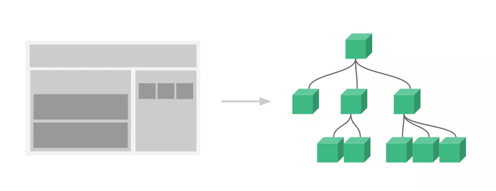
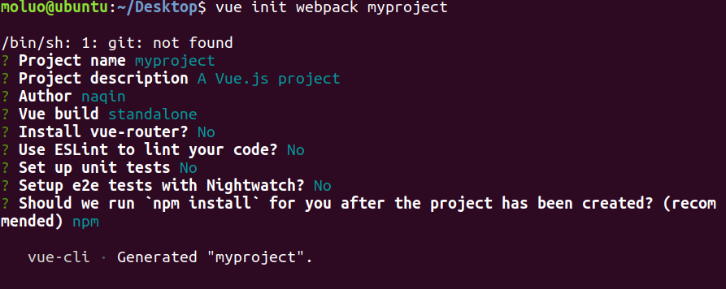
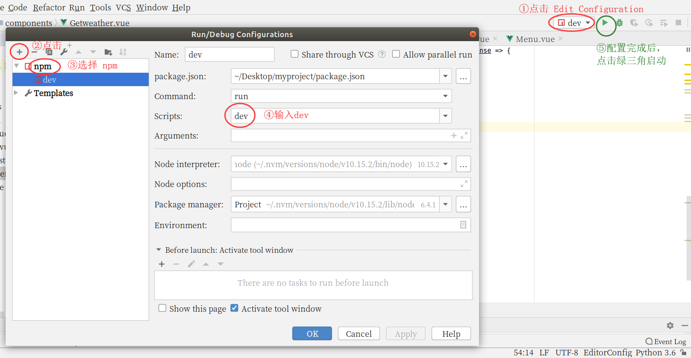
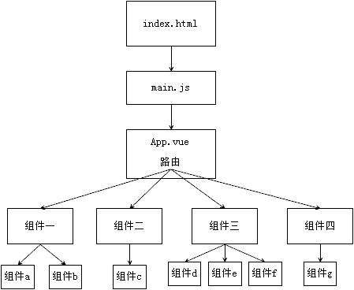

Vue组件是Vue.js最强大的功能之一，把页面抽象成一颗组件树，这颗树由独立的可复用的小组件构成！ 

<!--more-->


# 组件（component）

- 组件（Component）是自定义封装的功能。在前端开发过程中，经常出现多个网页的功能是重复的，而且很多不同的页面之间，也存在同样的功能。

- 而在网页中实现一个功能，需要使用html定义功能的内容结构，使用css声明功能的外观样式，还要使用js来定义功能的特效，因此就产生了**把一个功能相关的[HTML、css和javascript]代码封装在一起组成一个整体的代码块封装模式**，我们称之为“组件”。


- 所以，组件就是一个html网页中的功能，一般就是一个标签，标签中有自己的html内容结构，css样式和js特效。就如下图中页面像一个拼图，每一个组件是一块小的拼图，来构成整个页面。
- 将页面抽象为一颗组件树，由一个根组件以及独立的，可复用的小组件构成。





- vue的组件有两种：默认组件[全局组件] 和 单文件组件


## 默认组件（全局组件）

组件名称命名建议：驼峰体！

格式为：

```js
 Vue.component("组件名称", {
        template: "模板内容",
        data: function () {
            return json对象
        }
    })
```

- 在我们使用 `Vue.component` 定义了全局组件后，还需要用 `new Vue({ el: '#container '})` 在每个页面内指定一个容器元素。
- 与我们定义vm对象中的data有所差别，这里的data的属性是函数，返回值必须是json对象。


例子：

```html
<div id="container">
    <show></show>
</div>
<script>
    Vue.component("show", {
        template: '<p>我是{{iam}}</p>',
        data: function () {
            // 写在这里的数据只有当前组件可以使用
            return {
                iam: '一个p标签'
            }
        }
    })
    var vm = new Vue({el: '#container'})
    // 起一个容器的作用，没有这个容器，组件的不会生效的。
</script>
```

全局组件的优点在于简单上手，适用于小规模项目，但它的缺点也非常明显：

1. **全局定义 (Global definitions)** 强制要求每个 component 中的命名不得重复
2. **字符串模板 (String templates)** 缺乏语法高亮，在 HTML 有多行的时候，需要用到丑陋的 `\`
3. **不支持 CSS (No CSS support)** 意味着当 HTML 和 JavaScript 组件化时，CSS 明显被遗漏
4. **没有构建步骤 (No build step)** 限制只能使用 HTML 和 ES5 JavaScript, 而不能使用预处理器，如 Pug (formerly Jade) 和 Babel


## 单文件组件

- 单文件组件（**single-file components**）的文件扩展名为 `.vue`，它解决了全局组件存在的问题，并且还可以使用 webpack 或 Browserify 等构建工具。

- 在介绍单文件组件之前，我们需要安装准备一些组件开发工具，一般情况下，单文件组件，我们运行在自动化工具 Vue-cli 中


# 准备工作

已经配置好的，这块可以跳过。

如果没有配置的推荐阅读 [Ubuntu安装Vue-cli](待补充！！！


# Vue自动化工具（Vue-cli）

vue-cli 是脚手架工具，其作用就是用配置好的模板迅速搭建起一个前端项目工程


## 创建前端项目

### 生成项目目录

使用vue自动化工具可以快速搭建单页应用项目目录。

该工具为现代化的前端开发工作流提供了开箱即用的构建配置。只需几分钟即可创建并启动一个带热重载、保存时静态检查以及可用于生产环境的构建配置的项目：

生成一个基于 webpack 模板的新项目:

```
vue init webpack 项目目录名
```

例如:




进入项目目录可以启动开发服务器, ctrl+c 停止服务:

```
cd myproject
npm run dev           # 运行这个命令就可以启动node提供的测试http服务器
```

访问：http://localhost:8080/


简化操作：

当我们修改内容后就需要手动关闭，然后手动开启，这样太过繁琐。使用 pycharm 来简化操作：




这样只需要点击绿三角，启动后，当我们修改了内容，pycharm会自动重新执行。


### 项目目录结构


```
|-- build                            // 项目构建(webpack)相关代码：开发/生产环境
|   |-- build.js                     // 生产环境构建代码
|   |-- check-version.js             // 检查node、npm等版本
|   |-- dev-client.js                // 热重载相关
|   |-- dev-server.js                // 构建本地服务器
|   |-- utils.js                     // 构建工具相关
|   |-- webpack.base.conf.js         // webpack基础配置
|   |-- webpack.dev.conf.js          // webpack开发环境配置
|   |-- webpack.prod.conf.js         // webpack生产环境配置
|   └── ...
|  
|-- node_modules  					// npm install 安装的依赖代码库
|   └── ...
|  
|-- config                           // 项目开发环境配置
|   |-- dev.env.js                   // 开发环境变量
|   |-- index.js                     // 项目一些配置变量
|   └── prod.env.js                  // 生产环境变量
|  
|-- src                              // 源码目录
|   |-- components  目录             // vue公共组件  ***
|   |-- assets  目录                 // 资源文件夹，一般放一些静态资源文件  
|   |-- App.vue                      // 页面入口文件  ***
|   └── main.js                      // 程序入口文件，加载各种公共组件  ***
|  
|-- static                           // 静态资源目录，存放所有的css，js文件。
|   
|-- .babelrc                         // ES6语法编译配置
|-- .editorconfig                    // 定义代码格式
|-- .gitignore                       // git上传需要忽略的文件格式
|-- README.md                        // 项目说明
|-- favicon.ico 
|-- index.html                       // 入口页面  ***
|-- package.json                     // 项目基本信息
```


### 项目执行流程图




- 整个项目是一个主文件 `index.html`

- `index.html` 中会引入src文件夹中的 `main.js` 

- `main.js` 中会导入顶级单文件组件 `App.vue`
- `App.vue` 中会通过组件嵌套或者路由来引用 components 文件夹中的其他单文件组件。


## 单文件组件的使用

### template 编写html代码的地方

```html
<template>
  <div>
    <button @click="add">+</button>
    <input type="text" v-model="num">
    <button @click="sub">-</button>
  </div>
  <!--只能有一个根标签-->
</template>
```

note：只能有一个根标签，其它标签都写在根标签下

### script编写vue.js代码

```html
<script>
    export default {
        name: "Home", // 组件名称，将来提供给路由进行页面跳转
        data() {
            return {              
                num: 0,
            }
        },
        methods: {
            add() {
                this.num = parseInt(this.num) + 1;
            },
            sub() {
                if (this.num <= 1) {
                    return 0
                }
                this.num -= 1
            }
        }
    }
</script>
```

note：

- 在这里 export default 只能有一个。
- data是一个函数，返回的是一个json对象。


### style编写当前组件的样式代码

```html
<style scoped>
  /* scoped 是为了保证只在局部范围内生效，不会影响外界*/
  inpupt[type=text] {
    width: 80px;
  }

</style>
```

note：scoped是为了保证只在当前组件范围内生效。


完整例子：点击加减数字

上面的三块是对于当前组件的定义，那么如何调用这个组件呢？

在 App.vue 中调用这个组件：

- 导入组件，注册组件，使用标签。

```html
<template>
  <div id="app">
    <home></home>
  </div>
</template>

<script>
import Home from "./components/Home";

export default {
  name: 'App',
  components: {
    // 组件注册列表
      Home
  }
}
</script>

<style>
</style>
```


## 组件的嵌套

- 一个页面是一颗组件树，对于组件特别复杂时，我们可以把子组件分目录存储：将父组件下的子组件存在一个目录下。

- 例如，我们可以声明一个组件，作为父组件（Home），在components/创建一个保存子组件的目录HomeSon，这里存放的是 Home 组件的子组件。


## 传递数据

### 父组件的数据传递给子组件

① 父组件中通过子组件**标签的属性**来传递数据：

```vue
<Menu :sonnum="num" title="这是：父组件传递给子组件的字符串数据"/>
```

上面表示在父组件调用Menu子组件的时候传递了2个数据：

- 如果要传递变量[变量可以各种类型的数据]，属性名左边必须加上冒号 `:` ，同时，属性名是自定义的，会在子组件中使用。

- 如果要传递普通字符串数据，则不需要加上冒号:

② 子组件通过 **`props`** 来接接收数据：

```vue
<script>
    export default {
        name: "Menu",
        props:["sonnum","title"],
        data(){
            return {
               msg:'我是Menu组件的内容：',
            }
        }
    }
</script>
```

③  对于接收到的数据，按使用data中的变量使用就可以：

```vue
<template>
  <div id="menu">
    <p>{{msg}}</p>
    <p>{{title}}</p>
    <p>{{sonnum}}</p>
    <input type="text" v-model="sonnum">
  </div>
</template>
```

note：

1. 传递数据是变量，则需要在属性左边添加冒号.

   - 传递数据是变量,这种数据称之为"**动态数据传递**"

   - 传递数据不是变量,这种数据称之为"**静态数据传递**"

2. 父组件中修改了数据,在子组件中会被同步修改,但是,子组件中的数据修改了,是不是影响到父组件中的数据.

   - 这种情况,在开发时,也被称为"**单向数据流**"


### 子组件传递数据给父组件

① 子组件监听父组件传来的变量，如果在子组件中改变这个变量的值，就使用 `this.$emit("父元素的自定义事件","要传递的数据");`  来向父组件提交这个改变的数据[事件的方式进行传递]。

例中，使用 $emit 提交的事件名称为：`sendparentdata`。

```vue
<template>
  <div id="menu">
    <p>{{msg}}</p>
    <p>{{title}}</p>
    <p>{{sonnum}}</p>
    <input type="text" v-model="sonnum">

  </div>
</template>

<script>
    export default {
        name: "Menu",
        props:["sonnum","title"],
        data(){
            return {
               msg:'我是Menu组件的内容：',
            }
        },
        watch:{
            sonnum(){
                console.log('给父组件发出数据');
                this.$emit("sendparentdata", this.sonnum)
            }
        }
    }
</script>

<style scoped>
</style>

```


② 父组件中，声明一个和子组件中`this.$emit("自定义事件名称")`对应的事件属性。

例中，使用子组件中的同名事件 `sendparentdata`

```vue
<Menu :sonnum="num" title="这是：父组件传递给子组件的字符串数据" @sendparentdata="getnum"/>
```

③ 父组件中，声明一个自定义方法，在事件被调用时执行。

例中，自定义 `getnum` 方法，需要使用参数（`sondata`）接收传递过来的数据，然后赋给父组件的变量就可以

```vue
<template>
  <div>
    <p>我是Home组件的内容:</p>
    <button @click="add">+</button>
    <input type="text" v-model="num">
    <button @click="sub">-</button>
    <hr>
    
    <Menu :sonnum="num" title="这是：父组件传递给子组件的字符串数据" @sendparentdata="getnum"/>
  
  </div>  
</template>

<script>
    import Menu from "./Homeson/Menu";
    export default {
        name: "Home", // 组件名称，将来提供给路由进行页面跳转
        data() {
            return {
                num: 0,
            }
        },
        methods: {
            add() {
                this.num = parseInt(this.num) + 1;
            },
            sub() {
                if (this.num <= 1) {
                    return 0
                }
                this.num -= 1
            },
            getnum(sondata){
                console.log("接收到子组件发过来的数据")
                this.num = sondata
            }
        },
        components: {
            Menu
        }
    }
</script>

<style scoped>
  /* scoped 是为了保证只在局部范围内生效，不会影响外界*/
  inpupt[type=text] {
    width: 80px;
  }
</style>

```


## 在组件中使用axios获取数据


### 全局组件

- 在全局组件的方法中使用 `axios.get` 发送 ajax 请求即可。

```html
<div id="app">
    <getweather></getweather>
</div>
<script>
    Vue.component("getweather", {
        template: "<div><button @click='getbeijing'>查询北京天气</button> <br/> <p>{{content}}</p></div>",
        data() {
            return {
                content: ''
            }
        },
        methods: {
            getbeijing() {
                axios.get("http://wthrcdn.etouch.cn/weather_mini?city=北京").then(response => {
                    this.content = response['data']['data']['ganmao']
                })
            }
        }
    });
    var vm = new Vue({el: '#app'})
</script>
```


### 单文件组件

- 只需要在事件的定义中，使用 `axios.get` 来发送 ajax 请求

```vue
<!--Getweather.vue-->
<template>
  <div>
    <button @click="getbeijing">查询北京天气</button>
    <p>{{content}}</p>
  </div>
</template>
<script>
    import axios from 'axios'

    export default {
        name: "Getweather",
        data() {
            return {
                content: ''
            }
        },
        methods: {
            getbeijing() {                axios.get("http://wthrcdn.etouch.cn/weather_mini?city=北京").then(response=>{
                    console.log(response)
                    this.content = response['data']['data']['ganmao']
                })
            }
        }
    }
</script>

<style scoped>
</style>
```

