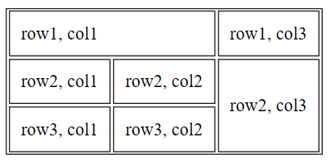
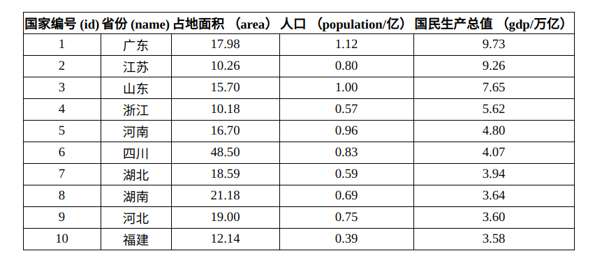

 本篇首先回顾http与socket的关系后引出Web前端和HTML，接下来介绍HTML特点与语法。 

<!--more-->

# 回顾

回顾之前在网络编程中学到的socket，选择tcp后开启服务端，以前是用另一个py文件开启客户端，两者交互。那如果我们在浏览器中输入这个网址和端口`http://127.0.0.1:9000`会怎么样呢？

```python
import socket

sk = socket.socket()
sk.bind(('127.0.0.1',9000))
sk.listen()
try:
    conn, addr = sk.accept()
    ret = conn.recv(1024)
    print(ret)
    conn.send(b'hello')
except Exception as e:
    print(e)
finally:
    conn.close()
    sk.close()
```

打印内容如下：

```
b'GET / HTTP/1.1\r\nCache-Control: max-age=0\r\nAccept: text/html,application/xhtml+xml,application/xml;q=0.9,*/*;q=0.8\r\nAccept-Language: zh-CN\r\nUpgrade-Insecure-Requests: 1\r\nUser-Agent: Mozilla/5.0 (Windows NT 10.0; Win64; x64) AppleWebKit/537.36 (KHTML, like Gecko) Chrome/64.0.3282.140 Safari/537.36 Edge/18.17763\r\nAccept-Encoding: gzip, deflate\r\nHost: 127.0.0.1:9000\r\nConnection: Keep-Alive\r\n\r\n'
```

通过上面，我们发现服务端接收到了http请求。那接下来服务端能否给回应一个消息呢？正如上面的 `conn.send(b'hello')`，可浏览器依旧是无法访问。那接下来该怎么办呢？

答案需要从socket与http中去寻找，我们的socket是对传输层以及传输层以下的一个抽象。http协议是一个应用层协议，它建立在socket的基础上。我们前面遇到的问题是我们**只用到了socket的知识**，没有用到http，那么浏览器没有无法访问也在情理之中，我们需要把http的规则加进去。

应用层的协议有很多如http、https、smtp、ftp，它们都是基于socket，那它们之间必须得有所区分才能方便我们的使用。所以**socket 通过协议头辨识这些不同的协议**。那我们我们接下来加一个协议头，让socket按照http协议来回应。

```python
import socket

sk = socket.socket()
sk.bind(('127.0.0.1',9000))
sk.listen()
try:
    conn, addr = sk.accept()
    ret = conn.recv(1024)
    print(ret)
    conn.send(b'HTTP/1.1 200 OK \r\n\r\n')  # socket按照http协议来回应
    conn.send(b'hello')

except Exception as e:
    print(e)
finally:
    conn.close()
    sk.close()
```

浏览器接收、解析、渲染。最终显示一个hello。

以上我们知道了http（超文本传输协议）是基于socket的，并且有一个协议头，是用于在服务端和客户端之间传输超文本文件。那么这个超文本是什么呢? HTML就该出场了！


# Web端的组成

HTML：一堆标签组成的内容，包括基础的排版和样式；从语义的角度，描述页面**结构**。

CSS：描述了标签的样式；从审美的角度，描述**样式**（美化页面）。

JavaScript/jQuery：动态的效果；从交互的角度，描述**行为**（提升用户体验）。

一张图来形容这三者的关系：


# Browser

在我们的电脑上可能会装很多浏览器edge、chrome、Firefox等等。那么它们之间有什么差别呢？与我们的HTML、CSS、JS之间有什么关系呢？

浏览器的内核架构有三个分支：

- （**挪威**）KTHML，Opera  -> Webkit -> Blink (Chrome, opera, Safari)
- Gecko引擎(Mozilla基金) -> Netscape -> Firefox
- Trident -> IE/Edge

Google的Blink来源于苹果开源的Webkit，苹果Safari的开源Webkit来源于KTHML，属于KDE的一部分，KDE采用的是TrollTech公司开发的Qt程序库。TrollTech公司也是挪威的一家公司而且就在Opera的楼下，他们的代码是部分共享的，因此KTHML和Opera的引擎Presto架构非常类似。

blink 基于 Webkit，两者大体一致，无非前者把 Webkit 中相关类换成 chromium 与 v8 相关的，并在此之上扩充。

浏览器的内核包括**渲染引擎（Rendering Engine）**和**脚本引擎**，具体分为：

- HTML、CSS解析器和DOM
- 排版引擎
- JavaScript脚本引擎
- HTTP协议引擎

同的浏览器内核对网页语法的解释不尽相同，这就导致了不同浏览器渲染出的网页可能有一些差异。**不同的渲染引擎是兼容性出现的根本问题**。


# HTML

> HTML全称HyperText Markup Language，翻译为超文本**标记语言**，它不是一种编程语言，是一种**描述**性的标记语言，用于描述超文本内容的显示方式。比如字体、颜色、大小等。

> HTML5是HTML最新的修订版本，由万维网联盟（W3C）于2014年10月完成标准制定。目标是取代1999年所制定的HTML 4.01和XHTML 1.0标准，以期能在互联网应用迅速发展的时候，使网络标准达到符合当代的网络需求。广义论及HTML5时，实际指的是包括HTML、CSS和JavaScript在内的一套技术组合。它希望能够减少网页浏览器对于需要插件的丰富性网络应用服务（Plug-in-Based Rich Internet Application，RIA），例如：Adobe Flash、Microsoft Silverlight与Oracle JavaFX的需求，并且提供更多能有效加强网络应用的标准集。
>
> HTML5添加了许多新的语法特征，其中包括`<video>`、`<audio>`和`<canvas>`元素，同时集成了SVG内容。这些元素是为了更容易的在网页中添加和处理多媒体和图片内容而添加的。其它新的元素如`<section>`、`<article>`、`<header>`和`<nav>`则是为了丰富文档的数据内容。新的属性的添加也是为了同样的目的。同时也有一些属性和元素被移除掉了。一些元素，像`<a>`、`<cite>`和`<menu>`被修改，重新定义或标准化了。同时APIs和DOM已经成为HTML5中的基础部分了。HTML5还定义了处理非法文档的具体细节，使得所有浏览器和客户端程序能够一致地处理语法错误。

## 拆开解释HTML

- 超文本（HyperText）：超文本是用超链接的方法，将各种不同空间的文字信息组织在一起的网状文本。超文本更是一种用户界面范式，用以显示文本及与文本之间相关的内容。

  标记语言的真正威力在于其收集能力，它可以将收集来的文档组合成一个完整的信息库，并且可以将文档库与世界上的其他文档集合链接起来。

- 标记：<英文单词或者字母>称为标记，所有内容都是包裹在标签中。

**注意**：HTML语言不是一个编程语言(有编译过程)，而是一个**标记语言**(**没有编译过程**)，HTML页面直接由浏览器解析执行。


## HTML的网络术语

- 网页 ： HTML 文档（由各种标记组成）
- 主页(首页) : 一个网站的起始页面或者导航页面。

- 标记： `<p>`称为开始标记 ，`</p>`称为结束标记，也叫标签。每个标签都规定好了特殊的含义。

- 元素：`<p>内容</p>`从开始标签到结束标签的内容称为元素.
- 属性：给每一个标签所做的辅助信息，属性总是在 HTML 元素的**开始标签**中规定。


## HTML的结构 

- 声明部分：主要作用是用来告诉浏览器这个页面使用的是哪个标准。是HTML5标准。
- head部分：将页面的一些额外信息告诉服务器。不会显示在页面上。
- body部分：我们所写的需要显示出来的代码必须放在此标签內。

在pycharm中创建一个html文件，pycharm会自动写出如下内容，在pycharm中还可以用 ! + tab 来补全。

```
<!doctype html>
<html lang="en">
<head>
    <meta charset="UTF-8">
    <meta name="viewport"
          content="width=device-width, user-scalable=no, initial-scale=1.0, maximum-scale=1.0, minimum-scale=1.0">
    # 帮助搜索引擎爬取的话写这一块      
          
    <meta http-equiv="X-UA-Compatible" content="ie=edge">
    # 以最高渲染
    <title>Document</title>
</head>
<body>

</body>
</html>
```


## HTML的基本语法特征

### HTML对换行不敏感，对tab不敏感 

HTML只在乎标签的嵌套结构，嵌套的关系。谁嵌套了谁，谁被谁嵌套了，和换行、tab无关。换不换行、tab不tab，都不影响页面的结构。 

也就是说，HTML**不是**依靠缩进来表示嵌套的，就是看标签的包裹关系。但是，我们发现有良好的缩进，代码更易读。要求大家都正确缩进标签。


### 空白折叠现象 

HTML中所有的**文字之间**，如果有空格、换行、tab都将被折叠为一个空格显示。                     


| 显示结果 | 描述   | 实体名称  | 实体编号  |
| -------- | ------ | --------- | --------- |
|          | 空格   | `&nbsp;`  | `&#160;`  |
| <        | 小于号 | `&lt;`    | `&#60;`   |
| >        | 大于号 | `&gt;`    | `&#62;`   |
| &        | 和号   | `&amp;`   | `&#38;`   |
| "        | 双引号 | `&quot;`  | `&#34;`   |
| '        | 单引号 | `&apos;`  | `&#39;`   |
| {        |        |           | `&#123;`  |
| }        |        |           | `&#125;`  |
| %        |        |           | `&#37;`   |
| &copy;   | 版权   | `&copy;`  | `&#169;`  |
| &trade;  | 商标   | `&trade;` | `&#8482;` |

[HTML字符实体转换](https://www.qqxiuzi.cn/bianma/zifushiti.php)


### 标签要严格封闭 

```
<html></html>
<meta />
```


## 标记（标签）的分类

### 分类一

- 双边标记 `<body></body>`  开始标签，闭合标签  双闭合标记
- 单边标记 `<meta />` 单闭合标记 

在开始标签中添加斜杠，比如 `<br />`，是关闭空元素的正确方法即使 `<br>` 在所有浏览器中都是有效的，但使用 `<br />` 其实是更长远的保障。

### 分类二

- 块级标签
- 行内标签/内联标签


# `<html>` 标签

`<html>` 元素定义了整个 HTML 文档。`</html>`

## 注释

`<!-- 注释 -->`


# head：一个人的思想

写在head标签中的所有内容在网页上都看不见

## meta

网页元信息，编码，浏览器版本，关键字，描述（搜索相关）

## title

打开网页的时候标签页显示的内容

## style css

- 内部定义的css

- 详见[CSS笔记](https://atlasnq.github.io/CSS笔记/20190611-learning_CSS.html)


## link css

- 导入外部css
- 详见[CSS笔记](https://atlasnq.github.io/CSS笔记/20190611-learning_CSS.html)

## script  js

- 导入外部JavaScript

- 详见[JavaScript](https://atlasnq.github.io/JavaScript/20190612-JavaScript_1.html)


# body：一个人的身体

## 块级标签

浏览器会自动地在标题的前后添加空行。这样占满一整行，所以自带换行效果。

### HTML heading 标题

- `<h1>` 定义最大的标题。`<h6>` 定义最小的标题。

- 搜索引擎使用标题为您的网页的结构和内容编制索引。

- 默认情况下，HTML 会自动地在块级元素前后添加一个额外的空行，比如段落、标题元素前后。


### HTML 段落

-  `<p>`是块级元素

- 段落是通过 `<p>` 标签定义的。


### HTML 水平线

- `<hr />`标签在 HTML 页面中创建水平线。

- hr 元素可用于分隔内容。


[块级标签列表](https://developer.mozilla.org/zh-CN/docs/Web/HTML/Block-level_elements)


## 内联标签/行内标签

### 文本格式化标签

| 标签       | 描述                                    |
| ---------- | --------------------------------------- |
| `<b>`      | 定义粗体文本                            |
| `<big>`    | 定义大号字                              |
| `<em>`     | 定义着重文字                            |
| `<i>`      | 定义斜体字                              |
| `<small>`  | 定义小号字                              |
| `<strong>` | 定义加重语气                            |
| `<sub>`    | 定义下标字                              |
| `<sup>`    | 定义上标字                              |
| `<ins>`    | 定义插入字(带下划线)                    |
| `<del>`    | 定义删除字                              |
| `<s>`      | **不赞成使用。**使用 <del> 代替         |
| `<strike>` | **不赞成使用。**使用 <del> 代替。       |
| `<u>`      | **不赞成使用。**使用样式（style）代替。 |


### 换行符

`<br/>`


### 内容

`<span></span>`   没有任何样式，但用的是最多的，配合css达到更好的表达效果。


### 链接

HTML 使用超级链接与网络上的另一个文档相连。几乎可以在所有的网页中找到链接。超链接可以是一个字，一个词，或者一组词，也可以是一幅图像，点击这些内容来跳转到新的文档或者当前文档中的某个部分。

> 超链接（hyper text），或者按照标准叫法称为**锚**（anchor），是使用` <a> `标签标记的，可以用两种方式表示。锚的一种类型是在文档中**创建一个热点**，当用户激活或选中（通常是使用鼠标）这个热点时，会导致浏览器进行链接。浏览器会自动加载并显示同一文档或其他文档中的某个部分，或触发某些与因特网服务相关的操作，例如发送电子邮件或下载特殊文件等。锚的另一种类型会在文档中**创建一个标记**，该标记可以被超链接引用。
>
> note：锚的这两种类型都使用同样的标签；也许这就是它们拥有同样的名称的原因。但是我们发现，如果将它们区分开，把**提供热点和超链接地址的锚看作“链接”**，而用于**标记文档的目标部分的锚称为“锚”**，那么您将更容易理解这两种类型的锚。

```html
<a href="url">Link text</a>
```

#### href 属性

href 属性规定链接的目标。（引入一个锚点 anchor    拿着锚就能找到这艘船）

1. 网络资源：点击可以跳转到一个网址。
2. 邮件资源： `<a href="mailto:xxx@126.com">联系我们</a>`

3. 设置锚点：

   - 方式一：跳转到本页的起始：`href = "#"`
   - 方式二：如果想回到本地页的某一个地方
     1. 给这个地方添加一个标签，属性是id
     2. 在a标签设置锚#id的值，跳转到对应的标签

   补充：这里的命名方式有两种：

   1. 使用name属性
      - 定义锚：`<a name="label">锚（显示在页面上的文本）</a>`使用name属性
      - 定义链接：`<a href="#label">回到标识为label的位置</a>`

   2. 添加id属性
      - 定义锚：`<h2 id="xxx">我是一个h2</h2>`
      - 定义链接：`<a href="#xxx">回到h2标签</a>`

#### target属性

- 默认值 `__self` 在当前网页打开
- `__blank`   新建标签跳转

#### title属性

- 鼠标悬浮显示的小标题


### 图像

- 单边标记

```
  
```

- 每一个属性都需要加**引号** 

#### src属性

- src是一张图的网络地址/本地路径

#### alt 属性 

- 图裂（加载失败）了地时候，显示的信息，如果没有就连图裂的信息都没有。要写！！！
  - 用户体验，爬虫

#### width 属性

设置图片宽度，如"200px"

#### height  属性

设置图片高度，如"400px"

- width和height二选一，不然会改变原本比例。


## 列表

### 无序列表 undefined list

无序列表始于 `<ul>` 标签。每个列表项始于 `<li>`。

```html
<!--默认显示实心圆-->
<ul>
    <li>手机</li>
    <li>电脑</li>
    <li>其他电器</li>
</ul>
<!--设置不显示任何样式-->
<ul type="None">
    <li>手机</li>
    <li>电脑</li>
    <li>其他电器</li>
</ul>
<!--设置显示空心圆-->
<ul type="circle">
    <li>旧电脑 </li>
    <li>旧家具 </li>
    <li>旧手机 </li>
</ul>
<!--设置显示实心方块-->
<ul type="square">
    <li>旧电脑 </li>
    <li>旧家具 </li>
    <li>旧手机 </li>
</ul>
```

note：列表项内部可以使用段落、换行符、图片、链接以及其他列表等等。

补充：

```css
ul{
    list-style: none;
    /* 可以去掉列表前面的点 */
}
li{
    float: left;
    /* 让列表横向 */
}
```


### 有序列表 order list

```html
<ol>
    <li>旧电脑</li>
    <li>旧冰箱</li>
    <li>旧洗衣机</li>
</ol>
```

默认显示如下：

1. 旧电脑
2. 旧冰箱
3. 旧洗衣机

修改 `type`属性设置显示内容，也可以修改`start`属性改变起始

```html
<ol type  = I>
    <li>长头发</li>
    <li>旧家电</li>
    <li>破剪刀</li>
</ol>
<ol start="2">
    <li>长头发</li>
    <li>旧家电</li>
    <li>破剪刀</li>
</ol>
<ol type="a">
    <li>长头发</li>
    <li>旧家电</li>
    <li>破剪刀</li>
</ol>
<!--从c开始-->
<ol type="a" start="3">
    <li>旧电脑</li>
    <li>旧冰箱</li>
    <li>旧洗衣机</li>
</ol>
```


### 定义列表 define list

自定义列表不仅仅是一列项目，而是**项目及其注释的组合**。

自定义列表以 `<dl>` 标签开始。每个自定义列表项以 `<dt>` 开始。每个自定义列表项的定义以 `<dd>` 开始。

dl 的 l 表示 list

dt 的 t 表示 title

dd 的 d 表示 data

```html
<dl>
    <dt>回收旧家电</dt>
    <dd>旧冰箱</dd>
    <dd>旧电视</dd>
    <dd>旧洗衣机</dd>
    <dt>回收旧衣服</dt>
    <dd>旧羽绒服</dd>
    <dd>旧羊绒裤</dd>
</dl>
```


## 表格

### 标准表格（带表头）

- 标准表格 `<table>` 分为 `<thead>` 和 `<tbody>` 
- `<tr>` 表示每一行，tr表示表行(table row)
- `<th>` 表示`<thead>`中的每一个元素，th表示表头(table header)
- `<td>` 表示`<tbody>`中的每一个元素，td表示表格数据(table data)
- border 属性 设置边框
- cellpadding 属性 内容与内边框进行填充
- cellspacing 属性 内边框与外边框进行填充

```html
    <table border="1" cellpadding="10px" cellspacing="5px">
        <thead>
            <tr>
                <th>姓名</th>
                <th>年龄</th>
                <th>身高</th>
            </tr>
        </thead>
        <tbody>
            <tr>
                <td>nq</td>
                <td>23</td>
                <td>178</td>
            </tr>
        </tbody>
    </table>
```

```css
在css中我们如下设置才能添加边框
table, th, td, tr {
    border: #0f0f0f solid 1px;
    border-spacing: 0px;
}
```


### 不带表头的表格

- 只有tbody这一部分，没有thead这一部分。

- 数据单元格可以包含文本、图片、列表、段落、表单、水平线、表格等等。

```html
    <table>
        <tbody>
            <tr>
                <td>nq</td>
                <td>23</td>
                <td>178</td>
            </tr>
            <tr>
                <td>小黑</td>
                <td>20</td>
                <td>175</td>
            </tr>
        </tbody>
    </table>
```


### 行/列的合并

例如：

- 合并第一行的1，2列，则需让第一行的第2列为空，然后在(1，1)位置 `<td>` 标签中设置`colspan = "2"`.
- 合并第三列的2，3行，则需让第三列的第3行为空，然后在(2,3)位置的 `<td> `标签中设置`rowspan = "2"`.

```html
  <table border="0.5" cellpadding="10px">
        <tr>
            <td colspan="2">row1, col1</td>

            <td>row1, col3</td>
        </tr>
        <tr>
            <td>row2, col1</td>
            <td>row2, col2</td>
            <td rowspan="2">row2, col3</td>
        </tr>
        <tr>
            <td>row3, col1</td>
            <td>row3, col2</td>

        </tr>
    </table>
```

效果如下：




补充：设置表格的css，效果是边框没有间距。

```css
<style>
  table {
    margin: 0 auto;
    text-align: center;
    border: black solid 1px;    /* 按需修改border宽度 */
    border-collapse: collapse;
  }
  table td{
    border: 1px solid black;   /* 按需修改border宽度 */
  }
</style>
```

效果如下：




# Form表单

**HTML 表单用于搜集不同类型的用户输入。**

## `<form>` 元素

- `<form>` 元素定义 HTML 表单

- action 属性：提交到的地址，把表单中的数据提交到对应的地址上。
- Method 属性：规定在提交表单时所用的 HTTP 方法（**GET** 或 **POST**）
  - 何时使用 GET？
    - 默认使用 GET，如果表单提交是被动的（比如搜索引擎查询），并且**没有敏感信息**。当您使用 GET 时，表单数据在页面地址栏中是可见的。综上GET 最适合少量数据的提交。浏览器会设定容量限制。
  - 何时使用 POST？
    - 如果表单正在更新数据，或者包含**敏感信息**（例如密码）。POST 的安全性更加，因为在页面地址栏中被提交的数据是不可见的。
- enctype 规定被提交数据的编码（默认：url-encoded），如果是大文本数据需要修改。

## `<input>` 元素

- `<input>` 元素是最重要的**表单元素**。
- `<input>` 元素有很多形态，根据不同的 **type** 属性。

- **type** 属性种类：`text`, `passowrd`, `radio`, `checkbox`, `submit`, `reset`, `hidden`, `button`, `file`, `date`
- 如何把数据提交到后台的？
  - input标签必须设置name属性和value属性
- 对于选择框：`checked`属性表示默认选中
- submit 与 input在form表单中都表示提交

```html
<form action="http://127.0.0.1:9000">
<!--我们是需要指定key：value，才能在后端拿到值-->
    <input type="text" name="username" value="alexander" readonly placeholder="用户名手机号/邮箱" >
    <!--注意：设置了readonly，那么不能修改只能提交；只能给输入框的模式设置-->
    <!--注意：设置了disabled，那么不能修改不能提交；可以给所有表单元素设置-->
    <input type="password" name="password" disabled >
    <input type="radio" name="sex" value="1" checked = "checked"> 男
    <input type="radio" name="sex" value="2"> 女
    <input type="checkbox" name="hobby" value="a" checked>抽烟
    <input type="checkbox" name="hobby" value="b">喝酒
    <input type="checkbox" name="hobby" value="c">烫头
    <input type="submit" value="表单按钮">
    <button>提交按钮</button>
<!-- 注意：在form表单中 input的submit类型和button放在form表单中都表示提交-->
    <input type="hidden">
    <input type="reset">
    <input type="button" value="普通按钮">
    <input type="file">
    <input type="date">   
    
</form>
    <input type="submit" value="普通按钮">
    <button>普通按钮</button>
<!--如果submit和button放在外面就变成普通的按钮-->
```

设置server端尝试接收：

```python
import socket

sk = socket.socket()
sk.bind(('127.0.0.1',9000))
sk.listen()
try:
    conn, addr = sk.accept()
    ret = conn.recv(1024)
    print(ret)
except Exception as e:
    print(e)
finally:
    conn.close()
    sk.close()
```

note：如果是file类型的input标签需要修改表单的enctype类型


### 输入限制

| 属性      | 描述                               |
| --------- | ---------------------------------- |
| disabled  | 规定输入字段应该被禁用。           |
| max       | 规定输入字段的最大值。             |
| maxlength | 规定输入字段的最大字符数。         |
| min       | 规定输入字段的最小值。             |
| pattern   | 规定通过其检查输入值的正则表达式。 |
| readonly  | 规定输入字段为只读（无法修改）。   |
| required  | 规定输入字段是必需的（必需填写）。 |
| size      | 规定输入字段的宽度（以字符计）。   |
| step      | 规定输入字段的合法数字间隔。       |
| value     | 规定输入字段的默认值。             |


## label框、文本框、选择框(下拉列表)

```html
<form>
    <!--label框-->
    <label for="user">用户名：</label>
    <input type="text" id="user"><br/>
    <label for="password">密码：</label>
    <input type="password" id="password"><br/>
    <input type="radio" name="sex" id="sex1">
    <label for="sex1">男</label>
    <input type="radio" name="sex" id="sex2">
    <label for="sex2">女</label>
    <br/><br/>

    <!--文本框-->
    <textarea name="text" id="text" cols="30" rows="10"></textarea>
    <br/><br/>
    <!--选择框 默认是单选-->
    <select name="city" id="city" size="1">
        <!--size表示选择框显示几条内容-->
        <option value="1">北京</option>
        <option value="2">上海</option>
        <option value="3">广州</option>
        <option value="4">深圳</option>
    </select>

    <!--多选框：设置multiple属性-->
    <!--注意：使用multiple属性设置为多选：按住鼠标下拉，按shift选，按ctrl选 -->
    <select name="hobby" id="hobby" multiple>
        <option value="1">唱</option>
        <option value="2">跳</option>
        <option value="3">rap</option>
        <option value="4">篮球</option>
    </select>
</form>
```


## 用 `<fieldset> `组合表单数据  

`<fieldset>` 元素组合表单中的相关数据  

`<legend>` 元素为 `<fieldset>` 元素定义标题。

```html
<from>
    <fieldset>
        <legend>Personal information:</legend>
        姓: <br>
        <input type="text" name="lastname" placeholder="姓">
        <br>
        名：<br>
        <input type="text" name="firstname" placeholder="名">
        <br> <br>
        <input type="submit" value="提交">
    </fieldset>
</from>
```


# HTML 样式

style 属性用于改变 HTML 元素的样式。

样式是 HTML 4 引入的，它是一种新的首选的改变 HTML 元素样式的方式。通过 HTML 样式，能够通过使用 style 属性直接将样式添加到 HTML 元素，或者间接地在独立的样式表中（CSS 文件）进行定义。

本部分通过CSS的行内引入方式来介绍几种样式，是从HTML向CSS的一个过渡。

## HTML 样式实例 - 背景颜色

background-color 属性为元素定义了背景颜色。

```html
<html>
<body style="background-color:yellow">
<h2 style="background-color:red">This is a heading</h2>
<p style="background-color:green">This is a paragraph.</p>
</body>
</html>
```


## HTML 样式实例 - 字体、颜色和尺寸

font-family：定义元素中文本的字体

color：定义元素中文本的颜色

font-size：定义元素中文本的字体尺寸

```html
<html>
<body>
    
<h1 style="font-family:verdana">A heading</h1>
<p style="font-family:arial;color:red;font-size:20px;">A paragraph.</p>
    
</body>
</html>
```


## HTML 样式实例 - 文本对齐

text-align 属性规定了元素中文本的水平对齐

```html
<html>
<body>

<h1 style="text-align:center">This is a heading</h1>
<p>上面的标题相对于页面居中对齐。</p>

</body>
</html>
```


## 避免使用下面这些标签和属性

这些标签和属性，都被样式代替。

| 标签                   | 描述               |
| ---------------------- | ------------------ |
| `<center>`             | 定义居中的内容     |
| `<font> 和 <basefont>` | 定义HTML字体       |
| `<s> 和 <strike>`      | 定义删除线文本     |
| `<u>`                  | 定义下划线文本     |
| 属性                   | 描述               |
| align                  | 定义文本的对齐方式 |
| bgcolor                | 定义背景颜色       |
| color                  | 定义文本颜色       |


---------------------


