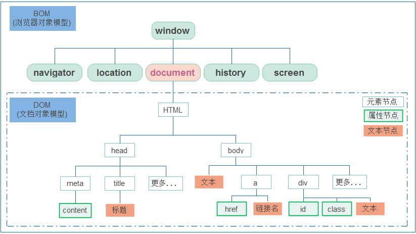
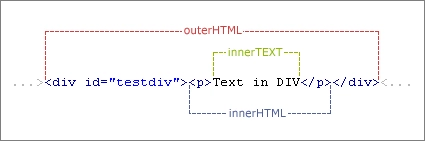

本篇介绍JavaScript。 

<!--more-->


# JavaScript

## 什么是JavaScript

> [JavaScript](https://developer.mozilla.org/en-US/docs/Glossary/JavaScript) 编程语言允许你在 Web 页面上实现复杂的功能。如果你看到一个网页不仅仅显示静态的信息，而是显示依时间更新的内容，或者交互式地图，或者 2D/3D 动画图像，或者滚动的视频播放器，等等——你基本可以确定，这需要 JavaScript 的参与。

JavaScript 是属于 HTML 和 Web 的编程语言，它的基础又分为三个部分： 

- ECMAScript：JavaScript的语法标准。包括变量、表达式、运算符、函数、if语句、for语句等。
- DOM：文档对象模型，操作网页上的元素的API。比如让盒子移动、变色、轮播图等。
- BOM：浏览器对象模型，操作浏览器部分功能的API。比如让浏览器自动滚动。

## JavaScript的特性

> JavaScript 语言核心之上所构建的功能更令人兴奋。**应用程序接口（Application Programming Interfaces**（**API**））将为你的代码提供额外的超能力。
>
> API 是已经建立好的一套代码组件（轮子），可以让开发者实现原本很难甚至无法实现的程序。

> API 通常分为两类：
>
> **浏览器 API** 内建于 web 浏览器中，它们可以使周边计算环境的数据暴露出来，还可以做实用的复杂工作。例如：
>
> - [`文档对象模型 API（DOM（Document Object Model）API）`](https://developer.mozilla.org/zh-CN/docs/Web/API/Document_Object_Model) 能通过创建、移除和修改 HTML，为页面动态应用新样式等手段来操作 HTML 和 CSS。比如当某个页面出现了一个弹窗，或者显示了一些新内容（像上文小 demo 中看到那样），这就是 DOM 在运行。
> - [`地理位置 API（Geolocation API）`](https://developer.mozilla.org/zh-CN/docs/Web/API/Geolocation) 获取地理信息。这就是为什么 [谷歌地图](https://www.google.cn/maps) 可以找到你的位置，而且标示在地图上。
> - [`画布（Canvas）`](https://developer.mozilla.org/zh-CN/docs/Web/API/Canvas_API) 和 [`WebGL`](https://developer.mozilla.org/zh-CN/docs/Web/API/WebGL_API) API 可以创建生动的 2D 和 3D 图像。人们正运用这些 web 技术制作令人惊叹的作品。参见 [Chrome Experiments](https://www.chromeexperiments.com/webgl) 以及 [webglsamples](http://webglsamples.org/)。
> - 诸如 [`HTMLMediaElement`](https://developer.mozilla.org/zh-CN/docs/Web/API/HTMLMediaElement) 和 [`WebRTC`](https://developer.mozilla.org/zh-CN/docs/Web/API/WebRTC_API) 等 [影音类 API](https://developer.mozilla.org/en-US/Apps/Fundamentals/Audio_and_video_delivery) 让你可以利用多媒体做一些非常有趣的事，比如在网页中直接播放音乐和影片，或用自己的网络摄像头获取录像，然后在其他人的电脑上展示（试用简易版 [截图 demo](http://chrisdavidmills.github.io/snapshot/) 以理解这个概念）。
>
> **第三方 API** 并没有默认嵌入浏览器中，一般要从网上取得它们的代码和信息。比如：
>
> - [Twitter API](https://dev.twitter.com/overview/documentation) 和 [新浪微博 API](https://open.weibo.com/) 可以在网站上展示最新推文之类。
> - [谷歌地图 API](https://developers.google.com/maps/) 和 [高德地图 API](https://lbs.amap.com/) 可以在网站嵌入定制的地图等等。


## JavaScript在页面上做了什么？

在前文中有过css与html是如何工作（[CSS 如何工作](https://atlasnq.github.io/HTML-CSS/20190611-CSS_1.html#more) ）的提及。浏览器在读取一个网页时，代码（HTML, CSS 和 JavaScript）将在一个运行环境（浏览器标签）中得到执行。就像一间工厂，将原材料（代码）加工为一件产品（网页）。在 HTML 和 CSS 集合组装成一个网页后，浏览器的 JavaScript 引擎将执行 JavaScript 代码。这保证了当 JavaScript 开始运行之前，网页的结构和样式已经就位。

这样很好，因为**通过 DOM API（见上文）动态修改 HTML 和 CSS 来更新 UI 正是 JavaScript 最普遍的用处所在**。如果 JavaScript 在 HTML 和 CSS 就位之前加载运行，就会引发错误。


### 浏览器在加载页面时的顺序

1. 浏览器会收到服务器返回的html页面内容
2. 建立一颗DOM树
3. 建立一颗CSSOM树
4. 根据DOM树和CSSOM树，合成了一颗渲染树
5. 计算布局(元素越多，计算越耗时)
6. 描绘


## 解释代码vs编译代码

解释：代码自上而下运行，且实时返回运行结果（**逐行解释**）。代码在执行前，无需由浏览器将其转化为其他形式。

编译：编译型语言代码能够运行之前需要先转化（**一次性编译**）成另一种形式。比如 C/C++ 先被编译成汇编语言，然后才能由计算机运行。

JavaScript 是轻量级解释型语言。


## 服务器端代码vs客户端代码

客户端代码是在用户的电脑上运行的代码，在浏览一个网页时，它的客户端代码就会被下载，然后由浏览器来运行并展示。这就是**客户端 JavaScript**。

服务器端代码在服务器上运行，浏览器将结果下载并展示出来。流行的服务器端 web 语言包括：PHP、Python、Ruby、ASP.NET 以及 JavaScript！JavaScript 也可用作服务器端语言，比如现在流行的 **Node.js** 环境


## js的本质

**js是一种纯对象语言！**

# js的引入

## 内部js

在 `</body>` 标签结束前（`</body>` 标签之前，与之相邻）插入以下代码：

```html
<script>
    
  // 在此编写 JavaScript 代码
    
</script>
```


## 外部js

创建一个 `.js` 文件，并在HTML文件中引入：

```html
<script src="first.js"></script>
```


# 脚本调用策略

## 存在问题

我们遇到最常见的问题是：HTML 元素是按其在页面中出现的次序调用的，如果用 JavaScript 来管理页面上的元素（更精确的说法是使用文档对象模型DOM），若 JavaScript 加载于欲操作的 HTML 元素之前，则代码将出错。

例如：如果我们把脚本调用放在head内就会出现这个问题。

## 解决方法

### 使用事件监听器（旧）

```js
document.addEventListener("DOMContentLoaded", function() {
  //代码块
});
```

这是一个事件监听器，它监听浏览器的 "`DOMContentLoaded`" 事件，即 HTML 文档体加载、解释完毕事件。事件触发时将调用代码块，从而避免了错误发生。


### 脚本元素放在文档体的底端（旧）

以前是我们要把脚本元素放在文档体的底端（`</html>` 标签之前，与之相邻），这样脚本就可以在 HTML 解析完毕后加载了。此方案（以及上述的 `DOMContentLoaded` 方案）的问题是：只有在所有 HTML DOM 加载完成后才开始脚本的加载/解析过程。对于有大量 JavaScript 代码的大型网站，可能会带来显著的性能损耗。这也是 `async` 属性诞生的初衷。


### `async`

添加`async` “异步”属性来解决，它告知浏览器在遇到 `<script>` 元素时不要中断后续 HTML 内容的加载。

```js
<script src="script.js" async></script>
```

上述情况下，脚本和 HTML 将一并加载，代码将顺利运行。

note： `async` 属性可以解决调用顺序问题，因此无需使用 `DOMContentLoaded` 事件。而 `async` 只能用于外部js，不适用于内部js。


### `defer`

由于添加`async` “异步”属性导致不同脚本间的调用顺序是不确定的，如果后面的脚本依赖于前面的脚本，我们需要添加 `defer` 属性，来要求脚本必须按照页面出现的顺序加载。

```js
<script defer src="js/vendor/jquery.js"></script>

<script defer src="js/script2.js"></script>

<script defer src="js/script3.js"></script>
```

所以对于`async`和`defer`来说：

- 如果脚本无需等待页面解析，且无依赖独立运行，那么应使用 `async`。
- 如果脚本需要等待解析，且依赖于其它脚本，调用这些脚本时应使用 `defer`，将关联的脚本按所需顺序置于 HTML 中。


# 结束符和注释

## 结束符 `;`

每条语句需要使用 `;` 进行结束，因为通常我们的代码是需要压缩通过网络进行传输，所以需要做一个分隔。

## 单行注释

```js
// 我是单行注释
```

## 多行注释

```js
/*我是
多行
注释*/
```


# 变量

变量本质上是**值**（例如数字或字符串）的**容器**。 你可以使用关键字 `let` （旧代码中使用 `var`）和一个名字来创建变量。常量用于存储不希望更改的数据，用关键字 `const` 创建

```js
let a = 1;
const b = 2;
```


## 变量与值的区分

变量不是数值本身，它们仅仅是一个用于存储数值的容器。你可以把变量想象成一个个用来装东西的纸箱子。


## 声明变量

要想使用变量，需要先声明变量

```js
let 变量名;
```

在控制台输入上面这条命令时会打印 `undefined` 。

声明了但没有初始化就是 `undefined` 。


## 初始化变量

```js
变量名 = 值;
```

可以进行合并

```js
let 变量名 = 值;
```


## 变量的命名规则

- 使用拉丁字符(0-9,a-z,A-Z)和下划线字符
- 变量名不要以下划线开头—— 以下划线开头的被某些JavaScript设计为特殊的含义，因此可能让人迷惑。
- 变量名不要以数字开头。这种行为是不被允许的，并且将引发一个错误。
- 一个可靠的命名约定叫做 ["小写驼峰命名法"](https://en.wikipedia.org/wiki/CamelCase#Variations_and_synonyms)，用来将多个单词组在一起，小写整个命名的第一个字母然后大写剩下单词的首字符。
- 避免使用JavaScript的保留字给变量命名。保留字，即是组成JavaScript的实际语法的单词。


## let与var区别（补充）

`let` 是在现代版本中的 JavaScript 创建的一个新的关键字，用于创建与 `var` 工作方式有些不同的变量，解决了过程中的问题。

- **var**可以根据需要**多次声明**相同名称的变量，这会出现[变量提升](https://developer.mozilla.org/zh-CN/docs/Web/JavaScript/Reference/Statements/var#变量提升)。

- **let不允许重新声明变量。**

更详细的内容见[let 和 var 之间的区别](https://developer.mozilla.org/zh-CN/docs/Learn/JavaScript/First_steps/Variables#var_与_let_的区别)。


# 输入与输出

## 弹出框

```js
alert('hello');
```


## 弹出输入框

```js
prompt('你好吗？')
```


## 控制台输出框

```js
console.log('hello')
```


例子：

```html
<!DOCTYPE html>
<html lang="en">
<head>
    <meta charset="UTF-8">
    <title>Title</title>
</head>
<body>
    <button>快点我！</button>

    <script>
        const button = document.querySelector('button');
        button.onclick = function () {
            let res = prompt('朋友，认识一下？');
            alert('我也'+ res);
        }
    </script>
</body>
</html>
```

note：当我们把button按钮放在script下面，在点击就不会有反映了，这是因为js先于button调用。


# 变量类型

- Undefined 未定义
- Null 空值
- Boolean 布尔类型
- Number 数字类型
- String 字符串类型
- Object 对象类型
- symbol

## 动态类型

JavaScript是一种“动态类型语言”，不同于其他一些语言(如C、JAVA)，不需要指定变量将包含什么数据类型（例如number或string）

例如：声明并初始化，没有指定变量类型，但浏览器会知道他是一个字符串。

```js
let str = 'hello'
```


## 查看数据类型

```
typeof 变量;
typeof(变量);
```


## Number

与其他编程语言不同，不管是**整数**还是**浮点数**都是**Number**。


NaN ：not a number

infinite ： 无穷大


### `.toFixed(i)`

保留小数点后i位有效数字，四舍五入。

```js
a = 2.867
a.toFixed(2)
```


### 算术运算符

| 运算符 | 名称                 | 作用                                                         | 示例                                                |
| ------ | -------------------- | ------------------------------------------------------------ | --------------------------------------------------- |
| `+`    | 加法                 | 两个数相加。                                                 | `6 + 9`                                             |
| `-`    | 减法                 | 从左边减去右边的数。                                         | `20 - 15`                                           |
| `*`    | 乘法                 | 两个数相乘。                                                 | `3 * 7`                                             |
| `/`    | 除法                 | 用右边的数除左边的数                                         | `10 / 5`                                            |
| `%`    | 求余(有时候也叫取模) | 在你将左边的数分成同右边数字相同的若干整数部分后，返回剩下的余数 | `8 % 3` (返回 2，将8分成3份，余下2 。)              |
| `**`   | 幂                   | 取底数的指数次方，即指数所指定的底数相乘。它在EcmaScript 2016 中首次引入。 | `5 ** 5` (返回 3125，相当于 `5 * 5 * 5 * 5 * 5` 。) |
| `++`   | 增量                 | 递增变量                                                     | num = 1<br />`num++` 或 `++num`                     |
| `--`   | 递减                 | 递减变量                                                     | num = 1<br />`num--`或`--num`                       |


### 赋值运算符

| 运算符 | 名称     | 作用                                           | 示例             |
| ------ | -------- | ---------------------------------------------- | ---------------- |
| +=     | 递增赋值 | 右边的数值加上左边的变量，然后再返回新的变量。 | `x = 3;x += 4;`  |
| -=     | 递减赋值 | 左边的变量减去右边的数值，然后再返回新的变量。 | `x = 6;x -= 3;`  |
| *=     | 乘法赋值 | 左边的变量乘以右边的数值，然后再返回新的变量。 | `x = 2;x *= 3;`  |
| /=     | 除法赋值 | 左边的变量除以右边的数值，然后再返回新的变量。 | `x = 10;x /= 5;` |


### 三元运算符

如果 a>b 则 c = a ；否则 c = b

```js
let c = a>b ?  a:b
```


### 比较运算符

| 运算符 | 名称       | 作用                           | 示例          |
| ------ | ---------- | ------------------------------ | ------------- |
| `===`  | 严格等于   | 测试左右值是否相同             | `5 === 2 + 4` |
| `!==`  | 严格不等于 | 测试左右值是否**不**相同       | `5 !== 2 + 3` |
| `<`    | 小于       | 测试左值是否小于右值。         | `10 < 6`      |
| `>`    | 大于       | 测试左值是否大于右值           | `10 > 20`     |
| <=     | 小于或等于 | 测试左值是否小于或等于右值。   | `3 <= 2`      |
| >=     | 大于或等于 | 测试左值是否大于或等于正确值。 | `5 >= 4`      |

note：还有用`==`和`!=`来判断相等和不相等，它是用来测试值是否相同， 但是**数据类型可能不同**；而`===`/`!==`严格测试**值和数据类型是否相同**。 严格的版本往往导致更少的错误，建议使用。


例子: 完成一个简单灯的**切换**：

```html
<!DOCTYPE html>
<html lang="en">
<head>
    <meta charset="UTF-8">
    <title>Title</title>
</head>
<body>
<button>关灯</button>
<script>
    const btn = document.querySelector('button');
    const bod = document.querySelector('body');
    btn.addEventListener('click',updateBtn);
    function updateBtn() {
        if (btn.textContent === '关灯'){
            btn.textContent = '开灯';
            bod.style.backgroundColor = '#000';
        }else{
            btn.textContent = '关灯';
            bod.style.backgroundColor = '#FFF';
        }
    }
</script>
</body>
</html>
```


## String

- 字符串是文本的一部分。当你给一个变量赋值为字符串时，你需要用单引号或者双引号把值给包起来，否则JavaScript将会把这个字符串值理解成别的变量名。

- 单引号或双引号没有什么区别。

### 基本字符串与字符串对象

字符串 (通过单引号或双引号定义) 和 直接调用 String 方法(没有通过 new 生成字符串对象实例)的字符串都是基本字符串。JavaScript会<u>自动将基本字符串转换为字符串对象，只有将基本字符串转化为字符串对象之后才可以使用字符串对象的方法</u>。当基本字符串需要调用一个字符串对象才有的方法或者查询值的时候(基本字符串是没有这些方法的)，JavaScript 会自动将基本字符串转化为字符串对象并且调用相应的方法或者执行查询。

```js
s1 = 'cc';
typeof s1;   //"string"
s2 = new String(s1);
typeof s2;	//"object"
```


### 属性

length

```js
let str = 'ni hao a ';
str.length；
```


### 常用方法

都是返回一个新字符串，而不改变原字符串。

```js
str.trim()  			/*返回两边没有空白的字符串*/   

str.concat('666');		/*str拼接'666'*/

str[3];           		/*根据索引求字符*/
str.charAt(3);    		/*根据索引求字符*/
str.indexOf('h')  		/*根据字符求索引*/
str.indexOf('hao');  	/*打印3，打印首字符h的位置*/
str.indexOf('haoa'); 	/*打印-1，没有找到就返回-1*/

str.slice(1,5);			/*顾头不顾尾,可以用负数,取子串*/
str.slice(-5,-1);		/*打印"ao a"*/

str.toUpperCase();		/*全部变大写*/
str.toLowerCase();		/*全部变小写	*/

str.split('');  		/*每个字符都拆开，返回数组*/
str.split(' ');			/*根据空格分割，返回数组*/
str.split(' ',1);		/*根据空格做分割，返回1个结果数组["ni"]*/
```

更多方法参考[这里](https://developer.mozilla.org/zh-CN/docs/Web/JavaScript/Reference/Global_Objects/String#Parameters)。


### 正则匹配

```js
创建一个正则：
第一种方式：
let reg = new RegExp('\\d');
note: \d会发生转移， 需要用\\ 来表示 \   所有带\的元字符都会被转义。
第二种方式
var = reg2 = /\d/    用//来代替引号，里面的不会发生转义。
reg.test(待检测的字符串)   如果字符串中含有符合表达式规则的内容就返回true，否则返回false。
在字符串中应用正则

在字符串中应用正则
var eee = 'alex3714'
eee.match(/\d/);      // 只匹配从左到右的第一个   
["3", index: 4, input: "alex3714", groups: undefined]
eee.match(/\d/g);     // 匹配所有符合规则的，返回一个数组
(4) ["3", "7", "1", "4"]

//match
var exp2 = 'Alex is a big sb'
undefined
exp2.match(/a/i);      // i表示不区分大小写
["A", index: 0, input: "Alex is a big sb", groups: undefined]
exp2.match(/a/ig);     //不区分大小写并匹配所有
(2) ["A", "a"]

//search
exp2.search(/a/);
8
exp2.search(/a/i);       //不区分大小写，从exp字符串中字符串找出符合条件的子串的第一个索引位置
0
exp2.search(/a/ig);       
0

//split
exp2.split(/\s/);       
exp2.split(/正则/i,n);   //根据正则切割，不区分大小写，返回前n个结果

exp2.replace(/正则/gi, 新的值)// i 不区分大小写， g替换所有，将符合正则条件的内容替换成新的值
exp2.replace(/\s/,'--');
"Alex--is a big sb"
exp2.replace(/\s/g,'--');
"Alex--is--a--big--sb"

小问题1：
var reg2 = /\d/g              //正则表示要匹配多个值
reg2.test('a1b2c3')           //多次test会得到三个true  一个 flase ，继续会循环上面的结果
走三次到第四次返回false
通过lastIndex返回位置。

小问题2：
var reg3 = /\w{5,10}/;
reg3.test();    // true    啥都不写，默认是一个undefined，把undefined转成一个字符串，然后符合正则。所以显示true
```


### 转义字符 \

```js
let bai = 'I\'m bai';
bai;
```

| Code | Output     |
| ---- | ---------- |
| `\0` | 空字符     |
| `\'` | 单引号     |
| `\"` | `双引号`   |
| `\\` | 反斜杠     |
| `\n` | 换行       |
| `\r` | `回车`     |
| `\v` | 垂直制表符 |
| `\t` | 水平制表符 |
| `\b` | 退格       |
| `\f` | 换页       |


## Boolean

Boolean 的值有2种：true或false。它们通常被用于在适当的代码之后，测试条件是否成立。


```js
true : []  {}
false : false,undefined null NaN 0 ""  (包含全部)
```

### null 空和undefined未定义

```js
null 表示空  boolean值为false
undefined 没有定义 创建变量但是不赋值 boolean值为false
```


## 数据类型之间的转换

`parseInt`、 `parseFloat`、 `toString`、`String`、 `Boolean`

```js
string --> Number 整
	parseInt('123') //123
	parseInt('123abc') //123
	parseInt('abc') //NaN  not a number
string --> Number 浮点
	parseFloat('1.233') 
float/int --> String
	var num = 123
	String(123)
	var str = num.toString()
    str = String(num)
任意类型 --> Boolean
	Boolean(数据)

字符串和数字相加 --> 字符串
字符串和数字相减 --> 数字   NaN 
```

note：使用 String() 方法将其它对象转化为字符串可以被认为是一种更加安全的做法，虽然该方法底层使用的也是 toString() 方法，但是针对 null/undefined/symbols，String() 方法会有特殊的处理。

例如：

```js
// 1.
a = null
a.toString()   	//报错
Uncaught TypeError: Cannot read property 'toString' of null

String(a)		//"null"
// 2.
let cc;
cc.toString();  //报错
Uncaught TypeError: Cannot read property 'toString' of undefined
String(cc)		//"undefined"
```


# 内置对象类型

## Array

数组是一个单个对象，其中包含很多值，方括号括起来，并用逗号分隔。这是一种将一组数据存储在单个变量名下的优雅方式。


### 创建数组

#### 创建空数组

```js
let arr2 = new Array();
let arr3 = []
```


#### 创建并初始化

```js
let arr = [1,2,'a',['b']];
let arr2 = new Array([1,2,'a',['b']]);
```


### 访问和修改数组元素

#### 访问

```js
arr[1];
```

#### 修改

```js
arr[1]=666;
```


### Array常用的属性和方法

#### 属性

```js
/*length  返回数组元素个数*/
arr.length;
```

#### 方法

```js
/**/
arr.push(666);     			/*数组尾部追加元素*/
arr.pop();					/*获取尾部的元素*/

arr.unshift(777);  			/*头部插入元素*/  
arr.shift();				/*获取头部元素*/  

arr.slice(1, 3);			/*切片，顾头不顾尾*/
arr.reverse();				/*翻转原数组*/	

str = arr.join('|');		/*将数组元素连接成字符串*/
arr.concat(7,8,9);   		//数组合并,得到一个新数组，原数组不变。 如 [777, Array(1), "a", 666, 1, 7, 8, 9]

arr.sort();					//排序

arr.splice();				//参数：1.从哪删(索引), 2.删几个  3.删除位置替换的新元素(可多个元素)	删除元素，并向数组添加新元素。
arr.splice(1,2);       		//从1开始删，删两个元素
arr.splice(1,1,'a','b','c');//[777, "a", "b", "c", 1]
```


#### 待补充： sort


## 自定义对象

在编程中，对象是现实生活中的模型的一种代码结构。

```js
let person = {name:'小白', sex:'男', age:18}
```

查看对象的属性：

```js
person
person.name
person['name']
```


## Date对象

```
创建对象:
var dt = new Date() //获取到当前时间
dt.toLocalString() //转换成'2019/8/13 10:18:12'
dt.getFullYear() //年
dt.getMonth() //月 1月是0
dt.getday()   //周中天 周日是0
dt.getDate()  //月中天 1号是1
dt.getHours() //时 从0开始
dt.getMinutes() //分 从0开始
dt.getSeconds() //秒 从0开始

自定义时间:
var dt2 = new Date('2018/1/1 12:12:12')   1月1日
var dt2 = new Date(2018,1,1);             2月1日
```


## Math对象

| 方法          | 含义                                                         |
| ------------- | ------------------------------------------------------------ |
| Math.floor()  | 向下取整，称为”地板函数“                                     |
| Math.ceil()   | 向上取整，称为”天花板函数“                                   |
| Math.max(a,b) | 求a和b中的最大值                                             |
| Math.min(a,b) | 求a和b中的最小值                                             |
| Math.random() | 随机数，默认0-1之间的随机数，公式： `min + Math.random()*(max-min)`，求min·max之间的随机数 |


## 面向对象

```js
function stu(name, age){
	this.name = name
	this.age = age
}
var s = stu('cc',18)
s.name       //查看属性
s.age
```


prototype

类似元类type 创造者

```js
//绑定方法
stu.prototype.show = function(){
    alert(this.name + this.age)}
s.show()
```


```js
//给祖宗添加方法
Object.prototype.show = function(){
    console.log('wahaha')
}
ƒ (){
    console.log('wahaha')
}
d.show()     // VM2267:2 wahaha

// 所有的对象都可以用这个方法
var a = 'abc'
undefined
a.show()
VM2267:2 wahaha
```


## Symbol

symbol 是避免代码冲突的一种方法。

```js
typeof Symbol();
"symbol"
```


### 获取 symbol 的三种方法

#### 调用 Symbol()

每次调用都会返回一个新的唯一 symbol。

#### 调用 Symbol.for(string)

这种方式会访问 symbol 注册表，其中存储了已经存在的一系列 symbol。这种方式与通过`Symbol()`定义的独立 symbol 不同，symbol 注册表中的 symbol 是共享的。如果你连续三十次调用`Symbol.for("cat")`，每次都会返回相同的 symbol。注册表非常有用，在多个 web 页面或同一个 web 页面的多个模块中经常需要共享一个 symbol。

#### 使用标准定义的 symbol

**Symbol.iterator。**标准根据一些特殊用途定义了少许的几个 symbol。


# 流程控制

## 条件判断

### if 语句

任何不是 `false`, `undefined`, `null`, `0`, `NaN` 的值，或一个空字符串（''）在作为条件语句进行测试时实际返回true

```js
if (condition1) {
  // 为真，运行这条代码块
} else if (condition2)
{
  // 为真，运行这条代码块      
}
else {
  // 其它条件不符合，运行这条代码块
}
```

### switch case语句

`if...else` 语句能够很好地实现条件代码，但是它们不是没有缺点。 它们主要适用于只有几个选择的情况，每个都需要相当数量的代码来运行。 对于只想将变量设置一系列为特定值的选项或根据条件打印特定语句的情况，语法可能会很麻烦，特别是如果**您有大量选择**。

```js
    var err_type = 'info'
    switch(err_type) {
        case 'warining':
            console.log('警告');
            break;
        case 'error':
            console.log('错误');
            break;
        default:
            console.log('没错')
    }
```

- 关键字 `switch`, 后跟一组括号。
- 括号内的表达式或值。
- 关键字 `case`, 后跟一个选项的表达式/值，后面跟一个冒号。
- 如果选择与表达式匹配，则运行一些代码。
- 一个 `break` 语句, 分号结尾. 如果先前的选择与表达式/值匹配，则浏览器在此停止执行代码块，并执行switch语句之后的代码。在这里，<u>case就像一个开关，当符合条件了就打开了开关，后面都会执行，所以需要加break。</u>
- 关键字 `default`, 它后面不需要再有选项, 并且不需要 `break` 语句, 因为之后没有任何运行代码. 如果之前没有选项匹配，则运行`default`选项。
- 如果把default放在最前面，后面的语句就会都执行（没有break）。


## 循环语句

### `for`

```js
//方式一:
for(let i = 1;i<=10;i++){
    console.log(i)
}

//方式二:
let arr = [1,2,3,4,5]
for (n in arr){
    // n是索引、 arr[n]是值
    console.log(n)
}
//方式三：
for (var i=0; i<arr.length;i++){
    //i 是索引，arr[i]是具体的值
}
```

- 开始条件**，**它被初始化为一个特定的值 - 这是循环的起点。
- 结束条件，这是循环停止的标准 - 通常计数器达到一定值。
- 迭代器**，**这通常在每个连续循环上递增少量的计数器，直到达到退出条件。


### `while`

```js
let i = 1; //初始化循环变量
while(i<=9){ //判断循环条件
    console.log(i);
    i = i+1; //更新循环条件
}
```


### `do while`

```js
let i = 1; //初始化循环变量
do{
	console.log(i);
    i = i+1; //更新循环条件
}while(i<=9)


while(i<=9){ //判断循环条件
    console.log(i);
    i = i+1; //更新循环条件
}
```

note：使用 while 和 do...while — 所有循环都一样 — 你必须保证初始变量是迭代的，那么它才会逐渐地达到退出条件. 不然, 它将会永远循环下去, 要么浏览器会强制终止它，要么它自己会崩溃. 这称为无限循环.


### `break` 与 `continue`

- 使用break退出循环
- 使用continue跳过迭代


### 循环的选择

建议使用`for`，因为它可能是最简单地帮你记住一切 - 初始化程序，退出条件和最终表达式都必须整齐地放入括号，所以很容易看到他们在哪里并检查你没有丢失他们。


# 函数

## 函数与方法

严格说来，内置浏览器函数并不是函数——它们是**方法**。这听起来有点可怕和令人困惑，但不要担心 ——函数和方法在很大程度上是可互换的。

二者区别在于方法是在对象内定义的函数。浏览器内置函数（**方法**）和变量（称为**属性**）存储在**结构化对象内**，以使代码更加高效，易于处理。


```js
function 函数名(参数){
    函数体
    return 返回值
}
函数名(参数)
//注意 : 传递的参数可以和定义的个数不一样,但是不要这么写
//      返回值只能有一个，如果有多个值，放在数组中返回
```

### arguments 伪数组

函数中内置的动态参数，可以接收所有参数。

只能看，只能改，但不能增删。

```js
function add(){
    console.log(arguments);
}
add(1,2,3,4)

function add(a,b){
    console.log(arguments);
}
add(1,2,3,4)
```


## 匿名函数

**匿名函数** — 它没有函数名! I它也不会自己做任何事情。匿名函数主要用来来运行负载的代码以响应事件触发（如点击按钮） - 使用事件处理程序。,例如，如果单击相关按钮，以下操作将在函数内运行代码：

```js
var myButton = document.querySelector('button');

myButton.onclick = function() {
  alert('hello');
}
```

还可以将匿名函数分配为变量的值，例如：

```js
var say = function(){
    console.log('hello world');
} 
say()  //调用
```


## 自调用函数

```js
(function(a,b){
    console.log(a,b)
})(1,2)

(function(形参){
 	//函数体
    return 返回值    
 })(实参)
```


# 再谈DOM

## 什么是dom？

- document object modle 文档对象模型
- 整个文档就是一颗树
- 树当中的每一个节点都是一个对象 : 这个对象中维系着 **属性信息** **文本信息** **关系信息**
- 在页面上还有一些动作效果:
  	根据人的行为改变的 点击 鼠标悬浮、或是自动在改变的。




## js是怎么给前端的web加上动作的呢?

1. 找到对应的标签
2. 给标签绑定对应的事件
3. 操作对应的标签


## 查找标签

### 直接查找

```js
var a = document.getElementById('baidu')           //直接返回一个元素对象
console.log(a)
var sons = document.getElementsByClassName('son')  //返回元素组成的数组
console.log(sons)
sons[0] //获取到一个标签对象  
var divs = document.getElementsByTagName('div')    //返回元素组成的数组
console.log(divs)
```


### 间接查找

```js
关系放在属性里
找父亲
	节点.parentNode      				//返回一个
找兄弟
	节点.previousElementsSiblings  	//返回上一个
	节点.nextElementsSiblings  		//返回下一个
	节点.siblings		   				//所有兄弟
找儿子
	节点.firstElementChild            //返回一个
	节点.lastElementChild  			//返回一个
	节点.children  					//返回一组
```

例如：补充find

```
节点.siblings().find('.body').
```


## 操作本身的标签

### 标签的创建

```js
var obj = document.createElement('标签名')   // a div ul li span
obj就是一个新创建出来的标签对象
```


### 标签的添加

```js
父节点.appendChild(要添加的节点) //添加在父节点的儿子们之后
父节点.insertBefore(要添加的节点,参考儿子节点) //添加在父节点的某个儿子之前
```


### 标签的删除

```js
父节点.removeChild(要删除的子节点)
子节点1.parentNode.removeChile(子节点2)
```


### 标签的替换

```js
父节点.replaceChild(新标签,旧儿子)
```


### 标签的复制

```js
节点.cloneNode()     //只克隆标签
节点.cloneNode(true) //全部克隆，包括元素
注意 :如果克隆出来的标签的id是重复的,那么修改之后才能应用到页面上
```


## 节点的文本操作



```js
节点对象.innerText = '只能写文字'
节点对象.innerHTML = '可以放标签'
```


## 节点的属性操作

```js
节点对象.getAttribute('属性名')
节点对象.setAttribute('属性名','属性值')
节点对象.removeAttribute('属性名')
```


### 节点的值操作

```js
节点对象.value 			 //查看对象的value
节点对象.value = 值 		//修改对象的value
```


### 节点的类操作

```js
节点对象.classList        查看所有的类
节点对象.classList.add('类名')
节点对象.classList.remove('类名')
节点对象.classList.contains('类名')
节点对象.classList.toggle('类名')    //有就删掉，没有就加上
```


### 节点的style操作

```js
节点对象.style.样式属性 = 值    
//常用来设置行内样式，而不用来获取行内样式，所有带中线的方法都要改成驼峰命名
```


# 事件

当事件发生时，其祖先元素都知道该事件的发生

- 网景认为：外面的元素先收到事件，逐层向内传递(**事件捕获**)
- 微软认为：里面的元素先收到事件，逐层向外传递(**事件冒泡**)
- W3C:     事件发生时，先从外向内传递，在从内向外传递(**DOM事件流**)

例如

```html
<div class="outer">
        <div class="inner">
            <button>点我</button>
        </div>
    </div>
上面的button被点击后，事件的流经过程：
	window   ->  document   ->   html    ->  body    ->  div.outer   ->  div.inner   ->  button
	button   ->  div.inner   ->  div.outer   ->  body    ->  html    ->  document    ->  window
```

无论事件是否处理，默认情况下，事件流都是存在的。
真正触发事件的元素，叫做：目标元素(target)


## 常见的DOM事件

| 鼠标事件             | 键盘事件 | 表单事件 | 文档/窗口事件 |
| -------------------- | -------- | -------- | ------------- |
| click                | keypress | submit   | load          |
| dblclick             | keydown  | change   | resize        |
| mouseenter/mouseover | keyup    | focus    | scroll        |
| mouseleave/mouseout  |          | blur     | unload        |
| hover                |          |          |               |


## DOM0事件处理程序

`xxx.onyyyzzzjjj = function () {}`
特点：

1. 绑定事件，使用on+事件名称
2. 所有的字母都是小写
3. 只能处理冒泡阶段的事件
4. 在处理函数内部，this指向on前边的元素
5. 为相同元素的同一个事件重复绑定事件，后绑定的会将先绑定的覆盖

## DOM0：删除事件处理程序

`xxx.onyyyzzzjjj = null;`

```js
document.querySelector('button.del').onclick = function () {
	inner.onclick = null;
}
```


```html
绑定方式:
<button id="btn">点击一下</button>
方式一:
    var btn = document.getElementById('btn')
    btn.onclick = function () {
        alert('点我干嘛')
    }
方式二:
	btn.onclick = clik
    function clik() {
        alert('不要点')
    }
方式三:（不推荐）
	<button id="btn" onclick="clik()">点击一下</button>
	function clik() {
        alert('不要点')
    }
```


## 鼠标状态

- mousedown: 鼠标按下

- mousemove: 鼠标移动

- mouseup:   鼠标抬起（移动过程）
- mouseover: 光标移上
- mouseout:  光标移出

on + 状态就可以绑定事件了


## 键盘事件

keydown:键盘按下

- 按键信息，被存在事件对象中
- 在键盘事件中，每个按键都与一个数字对应(不是字符编码)
- 键盘事件中的目标元素，焦点所在的元素

keyup: 键盘抬起

- 按键信息，被存在事件对象中
- 在键盘事件中，每个按键都与一个数字对应(不是字符编码)


# BOM

- browser object model 浏览器对象模型


- **window对象是BOM的顶层(核心)对象**，所有对象都是通过它延伸出来的，也可以称为window的子对象。
- DOM是BOM的一部分。


## BOM对象大小写的区别

使用时我们常使用的是小写字母开头的比如window，但上图中也画了Window，那它们之间有什么关系呢？ 首先我们要在捡起来开发规范：例如面向对象语言中的**类名**一般采用大写，包括接口、枚举和注解等，而**对象名、变量名**一般采用小写，方法采用驼峰写法。

所以Window，Document等都是一个个接口（function），window，document这些才是对象，这些对象是这些BOM接口的实例，而且是单例模式！


## window对象 

- **window对象是JavaScript中的顶级对象**。
- 全局变量、自定义函数也是window对象的属性和方法。
- window对象下的属性和方法调用时，可以省略window。


innerWidth, innerHeight指的是页面的宽和高。这两个值，不受滚动条的影响。

outerWidth, outerHeight指浏览器的宽和高。

### location对象

- 浏览器当前的URL信息

- window的子对象  window.location

```js
属性:
window.location.href 查看当前网页的url
window.location.href = 'http://www.baidu.com'   修改当前网页的url,修改之后会跳转
方法:
window.location.reload()  刷新页面
```

### history对象

- 浏览器的浏览历史记录信息。

```js
history.back()    	go(-1)			//回到上页
history.go(0)       window.location.reload()          	//刷新
history.forward()   go(1)			//去下一页
```

### screen对象

- 浏览器的屏幕信息。

```
Screen {availWidth: 1536, availHeight: 824, width: 1536, height: 864, colorDepth: 24, …}
availHeight: 824
availLeft: 0
availTop: 0
availWidth: 1536
colorDepth: 24
height: 864
orientation: ScreenOrientation {angle: 0, type: "landscape-primary", onchange: null}
pixelDepth: 24
width: 1536
__proto__: Screen
```

### navigator对象

- 浏览器本身的信息
- userAgent

```
userAgent: "Mozilla/5.0 (Windows NT 10.0; Win64; x64) AppleWebKit/537.36 (KHTML, like Gecko) Chrome/75.0.3770.100 Safari/537.36"
```


## 定时器

### setInterval

```
每隔一段时间就完成某个操作
var tid = setInterval(fn,n)  每隔n毫秒就调用一次fn函数
var tid = setInterval("fn()",n) 

clearInterval(tid)   清除定时器
```

### setTimeOut

```
在设定时间之后执行一次来完成某个操作
var tid = setTimeout(fn,n)       n毫秒之后只调用一次fn函数
var tid = setTimeout("fn()",n) 

clearTimeout(tid)   清除定时器
```


# 练习

## 猜数字游戏

需求：游戏应随机选择一个 100 以内的自然数, 然后邀请玩家在 10 轮以内猜出这个数字。每轮后都应告知玩家的答案正确与否，如果出错了，则告诉他数字是低了还是高了。并且应显示出玩家前一轮所猜的数字。一旦玩家猜对，或者用尽所有机会，游戏将结束。游戏结束后，可以让玩家选择再次开始。

```html
<!doctype html>
<html lang="en">
<head>
    <meta charset="UTF-8">
    <meta name="viewport"
          content="width=device-width, user-scalable=no, initial-scale=1.0, maximum-scale=1.0, minimum-scale=1.0">
    <meta http-equiv="X-UA-Compatible" content="ie=edge">
    <title>Document</title>
    <style>
        .d{
            width: 700px;
            position: relative;
            margin: 0 auto;
        }
    </style>
</head>
<body>
    <div class="d">
    <h1>猜数字游戏</h1>
    <br>
    <p>我刚才随机选定了一个100以内的自然数。看你能否在 10 次以内猜中它。每次我都会告诉你所猜的结果是高了还是低了。</p>
    请猜数：<input type="text" id="guess">
    <button id="but">确定</button>
    <p id="result"></p>
    </div>
    <script>
        //生成随机数
        var num = Math.ceil(Math.random() * 100);
        var times = 0;
        var button = document.getElementById('but');
        button.onclick = function (){
            var guess = document.getElementById('guess');
            var res = document.getElementById('result');
            console.log(num);
            console.log(times);
            times += 1;
            if (guess.value == num && times < 10){
                res.innerText ='第' +String(times + 1) + '次: 猜对了';
            }else if(guess.value > num && times < 10 ){
                res.innerText = '第' +String(times + 1) + '次: 猜大了';
            }else if(guess.value < num && times < 10 ){
                res.innerText = '第' +String(times + 1) + '次: 猜小了';
            }else{
                res.innerText = '第' +String(times + 1) + '次: 上限了';
            }
        }
    </script>
</body>
</html>
```


## 红绿灯

需求：做一个红绿灯

```html
<!DOCTYPE html>
<html lang="en">
<head>
    <meta charset="UTF-8">
    <title>Title</title>
    <style>
        #foo{
            border: gray 1px solid;
            float: left;
        }
        .light{
            margin: 5px;
            width: 50px;
            height:50px;
            border-radius: 50%;
            background-color: gray;
            display: inline-block;
        }
        #redlight{
        }
        #greenlight{
        }
        #yellowlight{
        }
    </style>
</head>
<body>
    <div id="foo">
        <div id="redlight" class="light">
        </div>
        <div id="yellowlight" class="light">
        </div>
        <div id="greenlight" class="light">
        </div>

    </div>

    <script>
        var red = document.querySelector('#redlight');
        var green = document.querySelector('#greenlight');
        var yellow = document.querySelector('#yellowlight');
        setInterval(fn,1000);     // 每隔一段时间就执行fn
        red.style.backgroundColor = 'red';
        function fn() {
            // 利用条件依次变灯的颜色就行
            if(red.style.backgroundColor === 'red'){
                red.style.backgroundColor = 'gray';
                yellow.style.backgroundColor = 'yellow';
            }else if(yellow.style.backgroundColor === 'yellow'){
                yellow.style.backgroundColor = 'gray';
                green.style.backgroundColor = 'green';
            }else if (green.style.backgroundColor === 'green'){
                green.style.backgroundColor = 'gray';
                red.style.backgroundColor = 'red';
            }
        }
    </script>

</body>
</html>
```


## 动态显示时间

需求：显示时分秒，且必须是一个数子一个数字分开，类似 1 8 : 1 4 : 5 3

使用了`setInterval`

```html
<!DOCTYPE html>
<html lang="en">
<head>
    <meta charset="UTF-8">
    <title>Title</title>
    <style>
        .foo{
            padding: 5px;
            border: gray 1px solid;
            float: left;
        }
        .time{
            margin: 2px;
            text-align: center;
            border: lightgray 1px solid;
            border-radius: 5px;
            padding: 5px;
            height: 50px;
            width: 40px;
            font-size: 40px;
            line-height: 100%;
            float: left;
        }
        .sig{
            font-size: 40px;
            float: left;
        }
    </style>
</head>
<body>
<div class="foo">
    <div  id="11" class="time"></div>
    <div  id="12" class="time"></div>
    <span class="sig">:</span>
    <div id="21" class="time"></div>
    <div id="22" class="time"></div>
    <span class="sig">:</span>
    <div id="31" class="time"></div>
    <div id="32" class="time"></div>
    <script>
        var t11 = document.getElementById('11');
        var t12 = document.getElementById('12');
        var t21 = document.getElementById('21');
        var t22 = document.getElementById('22');
        var t31 = document.getElementById('31');
        var t32 = document.getElementById('32');
        var tid = setInterval(fn,1000);
        var tim;
        function fn() {
            tim = new Date();
            h = tim.getHours();
            m = tim.getMinutes();
            s = tim.getSeconds();
            console.log(h,m,s);
            // 时
            if(h/10 >= 1){
                t11.innerText = Math.floor(h/10);
                t12.innerText = h % 10;
            }else{
                t11.innerText = '0';
                t12.innerText = h;
            }
            // 分
            if(m/10 >= 1){
                t21.innerText = Math.floor(m/10);
                t22.innerText = m % 10;
            }else{
                t21.innerText = '0';
                t22.innerText = m;
            }
            // 秒
            if(s/10 >= 1){
                t31.innerText = Math.floor(s/10);
                t32.innerText = s % 10;
            }else{
                t31.innerText = '0';
                t32.innerText = s;
            }
        }
    </script>

</div>
</body>
</html>
```

  

## 置顶小广告

性感荷官在线发牌！

- `onclick` 事件

```html
<!DOCTYPE html>
<html lang="en">
<head>
    <meta charset="UTF-8">
    <title>Title</title>
    <style>
        body{
            margin: 0;
        }
        .ad{
            background-color: green;
            height: 50px;
            width: 100%;
            position: fixed;
            padding: 5px;
            color: yellow;
            text-align: center;
            line-height: 50px;
        }
        .content{

            height: 1200px;
        }
        button{
            float: right;
        }
    </style>
</head>
<body>
    <div class="ad">
       澳门赌场开业了，性感荷官在线发牌！
        <button id="close">x</button>
    </div>

    <div class="content">
        <div>
            <p>我是正文内容</p>
        </div>
    </div>
    <script>
        var btn = document.getElementById('close')
        btn.onclick = function () {
            this.parentNode.style.display = 'none'
        }
    </script>
</body>
</html>
```


## 鼠标悬浮时换图

当鼠标悬停在img上时，更换为另外一张图片；鼠标离开时，还原为本来的图片。

可以使用hover，在里面设置背景，这里使用js来设置img。

- onmouseover  鼠标悬停
- onmouseleave  鼠标离开

```html
<!DOCTYPE html>
<html lang="en">
<head>
    <meta charset="UTF-8">
    <title>Title</title>
    <style>
        #container{
            float: left;
        }
        .img{
            width: 500px;
        }
    </style>
</head>
<body>
    <div id="container">
        
    </div>
    <script>
        // 反思，先开始打算设置div为事件源，这样增加了复杂（大小等因素），其实只要改img属性就好了
        // 页面加载完毕后在执行此代码
        window.onload = function () {
            // 1.获取事件源
            var img = document.getElementById('im')
            // 2.绑定事件
            img.onmouseover = function () {
                // 3.书写事件驱动程序
                img.setAttribute('src','2.jpg');
            }
            img.onmouseleave = function () {
                img.setAttribute('src','1.jpg');
            }
        }
    </script>
</body>
</html>
```


## 模态框

需求：打开网页时有一个普通的按钮，点击当前按钮显示一个背景图，中心并弹出一个弹出框，点击X的时候会关闭当前的模态框。

- onclick
- 弹出框并不在中央（是因为我的top和left边框是处于中央的）， 设置margin就可以移动盒子到中央

```html
<!DOCTYPE html>
<html lang="en">
<head>
    <meta charset="UTF-8">
    <title>Title</title>
    <style>
        body{
            margin: 0;
        }  
        .container{
            background-color: rgba(255,255,255,0.8);
        }
        #door{
            height: 300px;
            width: 300px;
            display: none;
            left: 50%;
            top: 50%;
            position: fixed;
            border: lightgray 1px solid;
            background-color: white;
            line-height: 300px;
            text-align: center;
            margin-left: -150px;
            margin-top: -150px;
        }
        #close{
            float: right;
        }
    </style>
</head>
<body>
    <div class="container">
        <p>你</p>
        <p>好</p>
        <p>啊</p>
        <p>啊</p>
        <p>啊</p>
        <p>啊</p>
        <p>啊</p>
        <button id="btn">点我</button>
    </div>
    <div id = 'door'>你只能看到我呦
        <button id="close"> X </button>
    </div>
    <script>
        var btn = document.getElementById('btn')
        var close = document.getElementById('close')
        console.log(btn);
        flag = true;
        btn.onclick = function () {
            var door = document.querySelector('#door');
            var con = document.querySelector('.container');
            if (flag === true){
                door.style.display = 'block';
                con.style.display = 'none';
                flag = false;
            }
        }
        close.onclick = function () {
            if (flag === false){
                flag = true;
                var door = document.querySelector('#door');
                var con = document.querySelector('.container');
                door.style.display = 'none';
                con.style.display = 'block';
            }
        }
    </script>
</body>
</html>
```


## select框的联动

需求:两个选择框，当我们选择省份后，另一个框生成对应的城市。


- onchange
- this.options
- this.options.selectedIndex

```html
<!DOCTYPE html>
<html lang="en">
<head>
    <meta charset="UTF-8">
    <title>Title</title>
</head>
<body>
<select name="province" id="province">
    <option value="0">请选择省份</option>
</select>

<select name="city" id="city">
    <option value="0">请选择城市</option>
</select>
</body>
<script>
    data = {"河北": ["廊坊", "邯郸"], "北京": ["朝阳区", "海淀区"], "山东": ["威海市", "烟台市"]}
    var p = document.getElementById('province');
    var c = document.getElementById('city');
    for (i in data){
        console.log(i);
        var t = document.createElement('option');
        t.innerText = i;
        p.appendChild(t)
    }
    p.onchange = function () {
        //要先清空选项历史数据
        c.innerText = null;
        // this.options  以及  this.options.selectedIndex 是特别精华的，没有他们，你只能通过增加value去联系。
        city = data[this.options[this.options.selectedIndex].innerText];
        // 插入选项
        for (i in city){
            console.log(i)
            var t = document.createElement('option');
            t.innerText = city[i];
            c.appendChild(t)
        }
    }
</script>
</html>
```


## 简易留言板

需求：当在textarea中输入内容，点击留言按钮，会添加到浏览器中。


## 随着滚动轴移动，回到顶部


## 购物车

- onmouseover
- onmouseleave
- z-index
  - **如果元素是没有定位的，对其设置的 z-index 会是无效的**。

```html
<!DOCTYPE html>
<html lang="en">
<head>
    <meta charset="UTF-8">
    <title>Title</title>
    <style>
        body{
            margin: 0;
        }
        #c{
            width: 300px;
            height: 200px;
            background-color: red;
            display: none;
        }
        .con{
            position: fixed;
        }
        #car{
            width: 50px;
            margin: 10px;
        }
    </style>
</head>
<body>
    <div>
        <div id="car">购物车</div>
        <div id="c"></div>
        <div class="con">
            <p>正文：</p>
            <p>你</p>
            <p>好</p>
            <p>啊</p>
            <p>！</p>
            <p>！</p>
            <p>！</p>
        </div>
    </div>
</body>
<script>
    var car = document.getElementById('car');
    var c = document.getElementById('c');
    car.onmouseover = function () {
        console.log(6666);
        c.style.display = 'block';
        c.style.position = 'fixed';
        c.style.float = 'left';
        c.style.zIndex = 30;
    };
    car.onmouseleave = function () {
        c.style.display = 'none'
    }
</script>
</html>
```


## 计时器

- 写一个时，分，秒的 计时器
- 遇到的坑：按钮点击事件有问题，应该用on系列
  - on与不加on的区别：onclick是绑定**事件**，click本身是**方法**作用是触发onclick事件（执行元素的click()方法）
  - 所以想要绑定事件必须使用on系列

```html
<!DOCTYPE html>
<html lang="en">
<head>
    <meta charset="UTF-8">
    <title>Title</title>
    <style>
        div{
            margin: 2px;
            vertical-align: center;
            position: relative;
            width: 50px;
            height: 100px;
            line-height: 100px;
            border: gray 1px solid;
            display: inline-block;
            font-size: 50px;
            border-radius: 5px;
            text-align: center;
            float: left;
        /*  遇到的第一个问题是，有数字的话div框就下移了,试着漂移一下,成功解决  */
        }
        span{
            position: relative;
            font-size: 50px;
            height: 100px;
            line-height: 100px;
            text-align: center;
            display: inline-block;
            float: left;
        }
        p:after{
            content: "";
            clear: both;
            display: block;
        }
    </style>
</head>
<body>

    <!--时-->
    <div id="11">0</div>
    <div id="12">0</div>
    <span>:</span>
    <!--分-->
    <div id="21">0</div>
    <div id="22">0</div>
    <span>:</span>
    <!--秒-->
    <div id="31">0</div>
    <div id="32">0</div>
    <p></p>
<!--    <span>.</span>-->
<!--    &lt;!&ndash;毫秒&ndash;&gt;-->
<!--    <div id="41">0</div>-->
<!--    <div id="42">0</div>-->
<!--    <div id="43">0</div>-->
<button id="stop">暂停</button>
<button id="restart">继续</button>
<button id="reset">重置</button>

</body>
<script>
    var h1 = document.getElementById('11');
    var h2 = document.getElementById('12');
    var m1 = document.getElementById('21');
    var m2 = document.getElementById('22');
    var s1 = document.getElementById('31');
    var s2 = document.getElementById('32');

    var h = 0;
    var m = 0;
    var s = 0;
    var flag = true;
    var btn_stop = document.getElementById('stop');
    var btn_restart = document.getElementById('restart');
    var btn_reset = document.getElementById('reset');

    btn_stop.onclick = function () {
        console.log(flag);
        flag = false
    };
    btn_restart.onclick = function () {
        console.log(flag);
        flag = true
    };
    btn_reset.onclick = function () {
        s = 0;
        m = 0;
        h = 0;
    };

    setInterval('fn(flag)',1000);
    function fn(flag) {
        if(flag){
            console.log(s);
            st = String(s);
            mt = String(m);
            ht = String(h);
            if(st.length === 2){
                s1.innerText = st[0];
                s2.innerText = st[1];
            }else{
                s1.innerText = '0';
                s2.innerText = st;
            }
            if(mt.length === 2){
                m1.innerText = mt[0];
                m2.innerText = mt[1];
            }else{
                m1.innerText = '0';
                m2.innerText = mt;
            }
            if(ht.length === 2){
                h1.innerText = ht[0];
                h2.innerText = ht[1];
            }else{
                h1.innerText = '0';
                h2.innerText = ht;
            }
            // 放在后面可以从0开始显示
            s += 1;
            if (s === 60){
                s = 0;
                m += 1;
                if (m === 60){
                    m = 0;
                    s += 1
                }
            }
        }
    }
</script>
</html>
```


