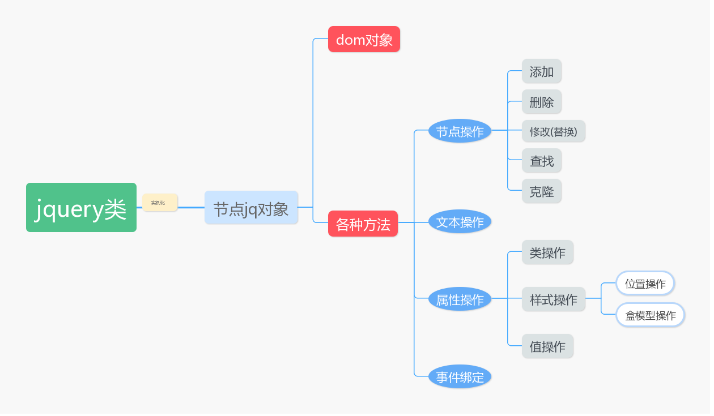

---

title: Web前端-jQuery
date: 2019-06-15 10:15:26
tags: [Web前端,jQuery,学习笔记]
categories: jQuery
comments: true
urlname:  jQuery_1
copyright: true
---


本篇介绍jQuery。 

<!--more-->


## jquery的优势

1. js代码对浏览器的兼容性做的更好了
2. 隐式循环
3. 链式操作

jQuery理念“Write Less, Do More”


## jquery是什么

高度封装了js代码的模块

- 封装了dom节点

- 还封装了很多操作dom节点的简便方法。

**找节点的过程也是对象实例化的过程。**这是优势但同时也带来了效率问题。




## jQuery的导入

```
https://code.jquery.com/jquery-3.4.1.js 未压缩版
https://code.jquery.com/jquery-3.4.1.min.js 压缩版
下载:保存在本地文件里
引入:<script src="jquery3.4.1.min.js"></script>
```

```html
<script src="jquery3.4.1.js"></script>
```

```html
验证：
<script>
    console.log(jQuery)
</script>
```


## jQuery对象

```js
>>>jQuery('#box')
jQuery.fn.init [div#box]
0: div#box
length: 1
__proto__: Object(0)
>>>$('#box')   
//结果同上
>>>$ === jQuery
true
```

$ 就是 jQuery 的别名

jQuery是一个构造函数，我们通过$()返回的是一个伪数组，它是jQuery的一个实例

## jQuery对象和dom对象的关系和转换

```js
jQuery封装了dom
dom转成jQuery ： jQuery(dom对象) === $(dom对象)
jQuery转成dom	： jq对象[index] === $(dom对象)[index]
```


# jQuery的选择器（方式一）

## 基础选择器

id选择器`#`、类选择器 `.` 、标签选择器` *`、通用选择器 `*`、 交集选择器 `标签名.类名/#id`、并集选择器 `,`

```js
#id选择器   .类选择器  标签选择器   *通用选择器
$('#city')
k.fn.init [ul#city]0: ul#citylength: 1__proto__: Object(0)
$('.box')
k.fn.init [div.box, prevObject: k.fn.init(1)]0: div.boxlength: 1prevObject: k.fn.init [document]__proto__: Object(0)
$('li')
k.fn.init(4) [li, li, li, li, prevObject: k.fn.init(1)]0: li1: li2: li3: lilength: 4prevObject: k.fn.init [document]__proto__: Object(0)
$('a')
k.fn.init(2) [a, a, prevObject: k.fn.init(1)]0: a1: alength: 2prevObject: k.fn.init [document]__proto__: Object(0)
$('*')
k.fn.init(16) [html, head, meta, title, body, div.box, ul#city, li, li, a, li, a, li, p, script, script, prevObject: k.fn.init(1)]

div.c1交集选择器      div,p并集选择器
$('div.box')
k.fn.init [div.box, prevObject: k.fn.init(1)]0: div.boxlength: 1prevObject: k.fn.init [document]__proto__: Object(0)
$('div,p,a')
k.fn.init(4) [div.box, a, a, p, prevObject: k.fn.init(1)]                           
```


## 层级选择器

后代选择器 `空格`、 子代选择器 `>` 、 毗邻选择器 `+` （必须得挨着？） 、弟弟选择器 `~`(弟弟要浪)

 

```js
空格 后代选择器    >子代选择器 +毗邻选择器  ~弟弟选择器
$('div li')
$('div>ul>li')
$('.baidu+li')
k.fn.init [prevObject: k.fn.init(1)]
$('.baidu~li')
k.fn.init(3) [li, li, li, prevObject: k.fn.init(1)]
```


## 属性选择器

`[属性名]`

`标签名[属性名=字符串]`

`标签名[属性名=正则匹配]`

```js
$('[属性名]')         必须是含有某属性的标签
$('a[属性名]')        含有某属性的a标签
$('选择器[属性名]')    含有某属性的符合前面选择器的标签
$('选择器[属性名="aaaa"]')  属性名=aaa的符合选择器要求标签
$('选择器[属性名$="xxx"]')  属性值以xxx结尾的
$('选择器[属性名^="xxx"]')  属性值以xxx开头的
$('选择器[属性名*="xxx"]')  属性值包含xxx
$('选择器[属性名1][属性名2="xxx]')  拥有属性1,且属性二的值='xxx',符合前面选择器要求的
```


# jQuery的筛选器

筛选器是在实例化中进行筛选

## 基础筛选器

```js
$('选择器:筛选器')
$('选择器:first')
作用于选择器选择出来的结果
$('选择器:first')		//找第一个
$('选择器:last')		//找最后一个
:eq(index)           	// :eq(1)   :eq(-2)
:even     
:odd     		     
:gt(index)				// 大于    gt(0) 相当于 索引 > 0
:lt(index)             // 小于
:not(选择器)			// not(选择器)  not(#sh)
:has(选择器)			// has(选择器) has(a) 含有a标签的li标签

区别 $('li a')    //找li中的a标签
```

## 表单筛选器

### type筛选器

根据input标签的type类型进行筛选

```js
$(':text')
$(':password')
$(':radio')
$(':checkbox')
$(':file')
$(':submit')
$(':resset')
$(':button')
note : date是找不到的
```

### 状态筛选器

```js
$(':enabled')
$(':disenabled')
$(':checked')
$(':selected')
$('input:checkbox:checked')
```


# jQuery的筛选器方法（方式二）

通过已知的某个节点（jQuery对象）去找 兄弟、祖宗、儿子。

找兄弟：

- 找所有兄弟     sibllings
- 找哥哥  prev()     prevAll()  prevUntil('选择器')
- 找弟弟  next()      nextAll()  nextUntil('选择器')

找祖宗：

- 找父亲	parent()     parents()
- 刨祖坟     parentsUntil('body')     

找儿子：

- 找儿子   children()

筛选方法：

```js
$(selector).first()               // 选第一个
$(selector).last()                // 选最后一个
$(selector).eq(index)             // 选第 index 
$(selector).not('选择器')          //去掉满足选择器条件的
$(selector).filter('选择器') 		//交集选择器，在所有的结果中继续找满足选择器要求的
$(selector).find('选择器')		    //后代选择器  
$(selector).has('选择器')			// 通过后代关系找当代
```


# 事件

## 事件的绑定

```js
<body>
    <button>点击1</button>
    <button>点击2</button>
</body>

<script src="jquery.3.4.1.js"></script>
<script>
    $('button').click(
        function () {
            alert('你点了我一下!')
        }
    )
</script>
```


# jQuery操作标签

- 操作文本 : <>文本内容<>
- 操作标签 : 添加 删除 修改 克隆 
- 操作属性 : 通用属性 类 css样式 value 盒子模型 滚动条  

## 操作文本

- `text` 与 `html` 都可以获得值设置值
- text 像 innerText   html 像 innerHTML
- html 还可以识别**标签**、**dom对象**、**jq对象**

```js
text()
$('li:first').text()         // 获取值
$('li:first').text('wahaha') // 设置值

$('li:last').html()          // 获取值
$('li:last').html('qqxing')  // 设置值

$('li:first').html('<a href="http://www.mi.com">爽歪歪</a>')   //a标签

var a = document.createElement('a')
a.innerText = '我是AD钙'
$('li:last').html(a)     	//a 是dom对象

var a2 = document.createElement('a')
var jqobj = $(a2)
jqobj.text('乳娃娃')
$('li:last').html(jqobj)   //jqobj是jquery对象
```


## 操作标签

### 增加

#### 父子关系

- 追加儿子： `(父亲).append(儿子)`	`(儿子).appendTo(父亲)`
- 头部添加： `(父亲).prepend(儿子)`  `(儿子).prependTo(父亲)`

#### 兄弟关系

- 添加哥哥（before）： `参考点.before(要插入的)`        `要插入的.insertBefore(参考点)`
- 添加弟弟（after） ： `参考点.after (要插入的)`        `要插入的.insertAfter(参考点)`

注意：方法前面的必须是jq对象

坑：如果被添加的标签原本就在文档树中，就相当于移动


例子:

```js
追加儿子
例子append
    var li = document.createElement('li')
    var jq = $(li).text('小黑')
    $('ul').append(jq)          // 添加 jq对象
    
    var li = document.createElement('li')
    var jq = $(li).text('小白')
    $('ul').append(jq[0])       // 添加 dom对象
   

    $('ul').append('<li>小红</li>')   // 添加 标签
    
例子appendTo
	var li = document.createElement('li')
    var jq = $(li).text('小黑')
    jq.appendTo('ul')			// 标签选择器
    
    var dom_ul = document.getElementsByTagName('ul')[0]
    var li = document.createElement('li')
    var jq = $(li).text('小白')
    jq.appendTo(dom_ul)			// dom 对象
    
    var li = document.createElement('li')
    var jq = $(li).text('小红')
    jq.appendTo($('ul'))       // jq对象
   
对已经存在的内容进行添加 -- 移动
   $('li:first').appendTo('ul')  

头部添加
prepend
$('ul').prepend('<li>小红</li>')
prependTo
$('<li>小白</li>').prependTo('ul')

添加哥哥
before
$('#l2').before('<li>小白</li>')
insertBefore
$('<li>小黑</li>').insertBefore('#l2')

添加弟弟
after
$('#l2').after('<li>小白</li>')
insertAfter
$('<li>小黑</li>').insertAfter('#l2')
```


### 删除

- `jq对象.remove()`、 `jq对象.detach()` 、 `jq对象.empty()`

- `remove` : 删除标签和事件，返回一个不包含事件的标签

- `detach`：删除标签和事件，返回一个包含事件的标签

- `empty`：清空内容，自己被保留


### 修改

- `replaceWith`  、 `replaceAll`

- `replaceWith`： `a.replaceWith(b)`  用b替换a

- `replaceAll`：   `a.replaceAll(b)`    用a替换b


### 克隆

- 默认参数为false表示不能克隆事件： `jq对象.clone()`

- 参数改为true表示克隆事件：`jq对象.clone(true)`

```js
复制 : clone
var btn = $(this).clone()      //克隆标签但不能克隆事件
var btn = $(this).clone(true)  //克隆标签和事件
```


## 操作属性

### 通用属性

#### `attr()`

- 获取属性的值 		一个参数
- 设置属性的值 	    两个参数
- 设置多个属性的值  字典

```js
获取属性的值
$('a').attr('href')
设置/修改属性的值
$('a').attr('href','http://www.baidu.com')
设置多个属性值
$('a').attr({'href':'http://www.baidu.com','title':'baidu'})
```


#### `removeattr('属性名')`

- 删除属性

```js
$('a').removeAttr('title') //删除title属性
```


#### prop

-  如果一个标签只有true和false两种情况，适合用prop处理，selected，checked）
- 如果获取的结果是true表示选中，false表示取消选中

```js
$(':checkbox:checked').prop('checked') 		 //获取值
$(':checkbox:checked').prop('checked',false) //表示取消选中
```


### 类的操作

- 添加类   addClass

​		多个参数，添加多个类

```js
$('div').addClass('red')        //添加一个类
$('div').addClass('red bigger') //添加多个类
```


- 删除类   removeClass

​		多个参数，删除多个类

```js
$('div').removeClass('bigger')  	//删除一个类
$('div').removeClass('red bigger')  //一次删多个属性
```


- 转换类   toggleClass

​		多个参数，添加多个类

```js
$('div').toggleClass('red')             //有即删 无即加
$('div').toggleClass('red bigger')      // 一次多个属性
```


### value值的操作

`jq对象.val()`

特殊：对于select  checkbox这些  需要使用 [index] 的方式来设置**选中**，  而不是 index本身        

```js
$(input).val()            	 // 查看值
$(':text').val('值')		 	// 设置/修改值
$(':password').val('值')		// 设置/修改值

对于选择框 : 单选 多选 下拉选择
设置选中的值需要放在数组中 : 
	$(':radio').val([1])  		// 需要放在数组中
	$(':radio').val([1,2,3])
当然有个前提是：在checkbox中分别设置了value 1，2，3 ，不然无法选中
```


### css样式

`jq对象.css()`

单个：`jq对象.css('样式名称','值')`

多个：`jq对象.css({'样式名1':'值1','样式名2':'值2'})`

```js
$('div').css('background-color','red')           //设置一个样式
$('div').css({'height':'100px','width':'100px'}) //设置多个样式
```


# 杂项

## 滚动条

`jq对象.scrollTop()`

`jq对象.scrollLeft()`

```js
$(window).scrollLeft()
$(window).scrollTop()
```


## 盒子模型

内容的宽高

- width  

-  height

内容 + padding

- innerWidth

-  innerHeight

内容 + padding + border

- outerWidth

-  outerHeight

内容 + padding + border + margin

-  outerHeight(true)   默认为flase不计算margin

- outerWidth(true)

当你用这些方法修改值得时候，永远是content被修改


## 表单操作

当我们点击button按钮时，返回true就会跳转，返回false就不跳转

```js
$(':submit').click(
    function () {
        return false
    }
)
```


# jQuery效果

## 隐藏/显示

隐藏，显示，切换，滑动，淡入淡出和动画。

### `hide()` 和 `show()`

语法：

```js
$(selector).hide(speed,callback);
$(selector).show(speed,callback);
```

- 可选的**speed**参数指定隐藏/显示的速度，可以采用：“slow”，“fast”或毫秒。

- 可选的回调参数是在**hide()**或**show()**方法完成后执行的函数。

```html
<!DOCTYPE html>
<html lang="en">
<head>
    <meta charset="UTF-8">
    <title>Title</title>
    <style>
        div{
            height: 100px;
            width: 100px;
            text-align: center;
            line-height: 100px;
            background-color: red;
        }
    </style>
    <script src="jquery3.4.1.js"></script>
</head>
<body>
    <button>点我</button>
    <p>我即将要消失啦</p>
    <div>
        我是小盒子
    </div>
</body>
<script>
    $('button').click(function () {
        $('p').hide(2000)
    })
</script>
</html>
```


### `toggle()`

有则删除，无则添加

语法：

`$(selector).toggle(speed,callback);`

- 可选的speed参数可以采用：“normal”，“slow”，“fast”或毫秒。
- 可选的回调参数是在toggle()完成后执行的函数。

```js
// 将上面的 $('p').hide(2000) 替换为下面
$('p').toggle(2000)

小bug 如果不停的点，就会出现，动画连续不断的效果
所以应该在 toggle的前面stop所有的动画
$('p').stop()
```


## 淡入淡出 fade系列

- fadeIn()
- fadeOut()
- fadeToggle()
- fadeTo()

### `fadeIn()` 与  `fadeOut()`

语法：

`$(selector).fadeIn(speed,easing,callback)`

该方法方法逐渐改变被选元素的**不透明度**，从隐藏到可见（褪色效果）。

note:隐藏的元素不会被完全显示（不再影响页面的布局）。

`$(selector).fadeOut(speed,easing,callback)`

该方法方法逐渐改变被选元素的不透明度，从可见到隐藏。


*speed 参数*：（可选，规定褪色效果的速度）

- 毫秒
- 'fast'
- 'slow'

*easing 参数*： （可选，规定在动画的不同点上元素的速度。默认值为 "swing"）

- "swing" - 在开头/结尾移动慢，在中间移动快
- "linear" - 匀速移动

*callback 参数*： （可选。fadeIn() 方法执行完之后，要执行的函数。）


```html
<!DOCTYPE html>
<html lang="en">
<head>
    <meta charset="UTF-8">
    <title>Title</title>
    <script src="jquery3.4.1.js"></script>
    <style>

    </style>
</head>
<body>
    <button>点我</button>
    <p id="p1">我出现啦</p>
    <p>我是一个p标签</p>
</body>
<script>
    $('button').click(function () {
        console.log($('#p1'));
        $('#p1').fadeIn(2000);
        $('#p1').fadeOut(2000);
    })
</script>
</html>
```


### `fadeToggle()`

语法：

`$(selector).fadeToggle(speed,callback)`

jQuery fadeToggle() 方法可以在 fadeIn() 与 fadeOut() 方法之间进行切换。

如果元素已淡出，则 fadeToggle() 会向元素添加淡入效果。

如果元素已淡入，则 fadeToggle() 会向元素添加淡出效果。

```js
将上面两句代码
$('#p1').fadeIn(2000);      
$('#p1').fadeOut(2000);
换成
$('#p1').fadeToggle(2000);
即可
```


### `fadeTo()`

语法：

`$(selector).fadeTo(speed,opacity,callback);`

该方法允许渐变为给定的不透明度（值介于 0 与 1 之间）。

```html
<!DOCTYPE html>
<html lang="en">
<head>
    <meta charset="UTF-8">
    <title>Title</title>
    <script src="jquery3.4.1.js"></script>
    <style>

    </style>
</head>
<body>
    <button>点我</button>
    <p id="p1">我出现啦</p>
    <p>我是一个p标签</p>
</body>
<script>
    $('button').click(function () {
        console.log($('#p1'));
        // $('#p1').fadeIn(2000);
        // $('#p1').fadeOut(2000);
        $('#p1').fadeTo(2000,0.15);
        $('#p1').fadeTo(2000,0.75);
    })
</script>
</html>
```


## 滑动 slide系列

- slideDown()
- slideUp()
- slideToggle()


### slideUp() 与 slideDown()

语法：

`$(selector).slideUp(speed,callback);` 向上滑动元素（设置display为none）

`$(selector).slideDown(speed,callback);` 用于向下滑动元素。（设置display为block）

```html
<!DOCTYPE html>
<html lang="en">
<head>
    <meta charset="UTF-8">
    <title>Title</title>
    <style>
        #flip{
            background-color: gray;
            height: 30px;
            line-height: 30px;
            text-align: center;
        }
        #contain{
            background-color: lightgray;
            height: 60px;
            line-height: 60px;
            text-align: center;
            display: none;
        }
    </style>
    <script src="jquery3.4.1.js"></script>
</head>
<body>
    <div id="flip">
        点我有惊喜！
    </div>
    <div id="contain">
        骗你的呦!
    </div>
</body>
<script>
    $('#flip').click(function () {
        $('#contain').slideDown(2000)
        $('#contain').slideUp(2000)
    })
</script>
</html>
```

注意：让它滑动出现先的前提是 ` display: none;`


### slideToggle()

语法：

`$(selector).slideToggle(speed,callback);`

在 slideDown() 与 slideUp() 方法之间进行切换。

```js
  $('#flip').click(function () {
        // $('#contain').slideDown(2000)
        // $('#contain').slideUp(2000)
        $('#contain').slideToggle(2000)
    })
```


## 动画

### animate()

语法

`$(selector).animate({params},speed,callback);`

- 必选的**params**参数定义要设置动画的CSS属性。

- 可选的**speed**参数指定效果的持续时间。 它可以采用以下值："slow", "fast"或者毫秒。
- 可选的回调参数是动画完成后要执行的函数。

note：默认情况下，所有HTML元素都具有静态位置，并且无法移动。要操纵位置，请记住首先将元素的CSS **position**属性设置为relative，fixed或absolute！

### 操作多个属性 + 使用相对值

```html
<!DOCTYPE html>
<html lang="en">
<head>
    <meta charset="UTF-8">
    <title>Title</title>
    <style>
        div{
            height: 100px;
            width: 100px;
            background-color: gray;
            position: relative;
            /* 开始时忘记设置position所以没有动画  */
        }
    </style>
    <script src="jquery3.4.1.js"></script>
</head>
<body>
    <button>点我</button>
    <div></div>
</body>
<script>
    $('button').click(function () {

        $('div').animate({
            left:'300px',
            height:'+=150px',
            width:'+=150px',
            backgroundColor:'red'
            // 颜色是不行的，需要下载插件
        });
    })
</script>
</html>
```

**可以用 animate() 方法来操作所有 CSS 属性吗？**

是的，几乎可以！不过，需要记住一件重要的事情：当使用 animate() 时，必须使用 **Camel 标记法**书写所有的属性名，比如，必须使用 paddingLeft 而不是 padding-left，使用 marginRight 而不是 margin-right，等等。

同时，色彩动画并不包含在核心 jQuery 库中。需要从 [jquery.com](http://jquery.com/download/) 下载 [颜色动画](http://plugins.jquery.com/color/) 插件。


### 使用预定义的值

```html
<!DOCTYPE html>
<html lang="en">
<head>
    <meta charset="UTF-8">
    <title>Title</title>
    <style>
        div{
            height: 100px;
            width: 100px;
            background-color: gray;
            position: relative;
            /* 开始时忘记设置position所以没有动画  */
        }
    </style>
    <script src="jquery3.4.1.js"></script>
</head>
<body>
    <button>点我</button>
    <div></div>
</body>
<script>
    $('button').click(function () {
        $('div').animate({
            height:'toggle'
        });
    })
</script>
</html>
```


### 使用队列功能

对于函数体内多个animate() ，jQuery 会创建包含这些方法调用的"内部"队列。然后逐一运行这些 animate 调用。

```html
<!DOCTYPE html>
<html lang="en">
<head>
    <meta charset="UTF-8">
    <title>Title</title>
    <style>
        div{
            height: 100px;
            width: 100px;
            background-color: gray;
            position: relative;
        }
    </style>
    <script src="jquery3.4.1.js"></script>
</head>
<body>
    <button>点我</button>
    <div></div>
</body>
<script>
    $('button').click(function () {
        $('div').animate({height:'+=150px'},'slow');
        $('div').animate({width:'+=150px'},'slow');
        $('div').animate({height:'-=150px'},'slow');
        $('div').animate({width:'-=150px'},'slow');
    })
</script>
</html>
```

​	jquery中有一个Queue队列的接口，这个模块没有单独拿出来是因为这个是内部专门为动画服务的，Queue队列如同data数据缓存与Deferred异步模型一样，都是jQuery库的内部实现的基础设施（**底层方法**）。

​	我们一直习惯于线性的编写代码逻辑，但是在JavaScript编程几乎总是伴随着**异步**操作：

`setTImeout`，`css3Transition`/`Animation`,`ajax`,dom的绘制，`postmessage`，`web Database` 等等，大量异步操作所带来的回调函数会把我们的算法分解，**对于“异步+回调”的模式，怎么“拉平”异步操作使之跟同步一样，因为异步操作进行流程控制的时候无非避免的要嵌套大量的回调逻辑，所以就会出现 promises 约定了。**

​	那么 jQuery 引入队列其实从一个角度上可以认为：**允许一系列函数被异步地调用而不会阻塞程序**。

​	前面提到jQuery的优势有一条为链式，举个例子：

```js
$("div").slideUp().fadeIn()
```

这是 jQuery 的一组动画链式序列，它的内部其实就是一组队列 Queue，所以队列和 Deferred 地位类似，是一个内部使用的基础设施。

- 当 slideUp 运行时，fadeIn 被放到 fx 队列中（这个队列存在进程锁）
- 当 slideUp 完成后，从队列中被取出运行（ 使用dequeue 方法 ）


### 小结

为什么这里突然提到了异步，提到了队列，从开始的目标开始分析，对于 jQuery 的动画的设计我们要分 2 个层面理解：

- 每一个动画效果可以看作一个**独立的**动画对象，每个对象都实现了针对自己这个动画的**生命周期**的控制。
- 动画对象与动画对象之间其实是**没有直接关系**，但是为了做到连续调用就需要引入一套队列机制也就是 **Queue 来控制对象之间的转换的控制**。
- 动画调度的流程：利用[队列异步的空闲然后执行同步的代码](https://www.runoob.com/jquery/jquery-animate.html)。


## 停止动画

### stop()

语法：

`$(selector).stop(stopAll,goToEnd);`

stop() 方法适用于所有 jQuery 效果函数，包括滑动、淡入淡出和自定义动画。

-  stopAll 参数规定**是否应该清除动画队列**。默认是 false，即仅停止活动的动画，允许任何排入队列的动画向后执行。
-  goToEnd 参数规定**是否立即完成当前动画**。默认是 false。
-  对于每个动画的开始，我们应首先停止以前的动画，在开始当前的动画。

```html
<!DOCTYPE html>
<html lang="en">
<head>
    <meta charset="UTF-8">
    <title>Title</title>
    <style>
        div{
            height: 100px;
            width: 100px;
            background-color: gray;
            position: relative;
        }
    </style>
    <script src="jquery3.4.1.js"></script>
</head>
<body>
    <button id="b1">点我</button>
    <button id="b2">点我停止</button>
    <div></div>
</body>
<script>
    $('#b1').click(function () {
        $('div').stop()
        $('div').animate({height:'+=150px'},'slow');
        $('div').animate({width:'+=150px'},'slow');
        $('div').animate({height:'-=150px'},'slow');
        $('div').animate({width:'-=150px'},'slow');
    })
    $('#b2').click(function () {
        $('div').stop()
        // 瞬间暂停
        // $('div').stop(true)
        // 立即完成并停止
        // $('div').stop(true,true)
        // note:由于div的形状是通过相对值来改变的,这样突然的停止会导致下一次和原本的差异
    })
</script>
</html>
```


## 回调 Callback

前面提到的很多方法中，很多可以包含着回调函数。

```html
<!DOCTYPE html>
<html lang="en">
<head>
    <meta charset="UTF-8">
    <title>Title</title>
    <style>
        div{
            width: 100px;
            height: 100px;
            background-color: gray;
        }
    </style>
    <script src="jquery3.4.1.js"></script>
</head>
<body>
    <button>点我</button>
    <div></div>
</body>
<script>
    $('button').click(function () {
        $('div').slideUp(2000,function () {
            alert('盒子隐藏了!')
        })
    })
</script>
</html>
```


## 链式操作 Chaining

- Chaining 允许我们在一条语句中运行多个 jQuery 方法（在相同的元素上）。

- 只需要把把该动作追加到之前的动作上就可以了。


```html
<!DOCTYPE html>
<html lang="en">
<head>
    <meta charset="UTF-8">
    <title>Title</title>
    <script src="jquery3.4.1.js"></script>
    <style>
        p{
            display: none;
        }
    </style>
</head>
<body>
    <button>点我</button>
    <p>我是一个p标签</p>
</body>
<script>
    $('button').click(function () {
        $('p').css({color:'yellow',backgroundColor:'#000'}).slideDown(2000).slideUp(2000)
    })
</script>
</html>
```


# 事件

## jQuery事件发展历程

简单事件绑定>>bind事件绑定>>delegate事件绑定>>on事件绑定(推荐)

### 简单事件绑定

```js
click(handler)          单击事件
mouseenter(handler)     鼠标进入事件
mouseleave(handler)     鼠标离开事件
```

- 缺点：不能同时注册多个事件


### bind事件绑定

```js
//第一个参数：事件类型
//第二个参数：传入参数
//第三个参数：事件处理程序
$("p").bind("click mouseenter", function(){
    //事件响应方法
});

// bind 参数都是选传的,接收参数e.data
$('button').bind('click',{'a':'b'},fn)
function fn(e) {
    console.log(e.data)
    console.log(e.data.a)
}
```

- 缺点：不支持动态事件绑定


### delegate委托事件绑定

```js
// 第一个参数：要绑定事件的元素
// 第二个参数：事件类型
// 第三个参数：事件处理函数
$(".parentBox").delegate("p", "click", function(){
    //为 .parentBox下面的所有的p标签绑定事件
});
```


## on注册事件（主要）

> jQuery1.7之后，jQuery用on统一了所有事件的处理方法。 
>
> 最现代的方式，兼容zepto(移动端类似jQuery的一个库)，强烈建议使用。

### on注册简单事件

```js
// 表示给$(selector)绑定事件，并且由自己触发，不支持动态绑定。
$(selector).on( "click", function() {});
```

### on注册委托事件

```js
// 表示给$(selector)绑定代理事件，当必须是它的内部元素span才能触发这个事件，支持动态绑定
$(selector).on( "click",“span”, function() {});
```

on注册事件的完整语法：

```js
// 第一个参数：events，绑定事件的名称可以是由空格分隔的多个事件（标准事件或者自定义事件）
// 第二个参数：selector, 执行事件的后代元素（可选），如果没有后代元素，那么事件将有自己执行。
// 第三个参数：data，传递给处理函数的数据，事件触发的时候通过event.data来使用（不常使用）
// 第四个参数：handler，事件处理函数
$(selector).on(events[,selector][,data],handler);
```


## 解除绑定

### unbind方式（不用）

```js
$(selector).unbind(); //解绑所有的事件
$(selector).unbind("click"); //解绑指定的事件
```

### undelegate方式（不用）

```js
$( selector ).undelegate(); //解绑所有的delegate事件
$( selector).undelegate( “click” ); //解绑所有的click事件
```

### off方式（推荐）

```js
与on搭配的off
// 解绑匹配元素的所有事件
$(selector).off();
// 解绑匹配元素的所有click事件
$(selector).off("click");
```


## 触发事件

```js
$(selector).click(); //触发 click事件
$(selector).trigger("click");
```


## jQuery事件对象

jQuery事件对象其实就是js事件对象的一个封装，处理了兼容性。

```js
//各种事件
click(function(){...})   // 单机事件

blur(function(){...})    // 失去焦点  校验输入，符合显示绿色
focus(function(){...})   // 获得焦点  表单处理，去掉右侧的提示

change(function(){...})  // input框鼠标离开时内容改变触发

keyup(function(){...})   // 按下的键盘触发事件 27对应的是esc键 获取键盘编号 e.keyCode
mouseover/mouseout       // 如果给父元素绑定了over事件,那么这个父元素如果有子元素,每一次进入子元素也							   触发父元素的over事件
mouseenter/mouseleave = hover(function(){...})  //鼠标的悬浮

//screenX和screenY   对应屏幕最左上角的值
//clientX和clientY   距离页面左上角的位置（忽视滚动条）
//pageX和pageY   距离页面最顶部的左上角的位置（会计算滚动条的距离）

//event.keyCode 按下的键盘代码
//event.data    存储绑定事件时传递的附加数据

//event.stopPropagation()   阻止事件冒泡行为
//event.preventDefault()    阻止浏览器默认行为
//return false:既能阻止事件冒泡，又能阻止浏览器默认行为。
```


## 事件冒泡

当点击子元素的时候，子元素和父元素都触发点击事件

```html
<style>
        .outer{
            width: 300px;
            height: 300px;
            background-color: red;
        }
        .inner{
            width: 100px;
            height: 100px;
            background-color: forestgreen;
        }
    </style>

<body>
    <div class="outer">
        <div class="inner"></div>
    </div>
</body>

<script>
    $('.outer').click(
        function () {
            alert('outer')
        }
    )
    $('.inner').click(
        function (e) {
            alert('inner')
            // e.stopPropagation() //阻止事件冒泡方法1
            return false    //阻止事件冒泡方法2
        }
    )
</script>
```


## 事件委托

```js
$('div').on('click','button',{'a':'b'},function (event) {
        console.log(event.data)
        alert('不许点')
    })
相当于把button元素的点击事件委托给了父元素div
后添加进来的button也能拥有click事件
```


## jQuery中 `onclick` 与 `click`

`click`和`onclick`的区别：

1. onclick是绑定事件，告诉浏览器在鼠标点击时候要做什么；click本身是方法作用是触发onclick事件，只要执行了元素的click()方法，就会触发onclick事件。
2. click()方法的主要作用是触发调用click方法元素onclick事件,实际上是模拟了鼠标的点击动作。此外，如果在click括号内定义了其他可执行语句，则click方法会在执行完onclick事件之后执行括号内部的语句。
3. 在js中我们在`onclick`绑定事件中定义所做的事情； 在jq中我们在`click`方法中定义触发该事件后所作的事情。


# 页面的加载

```js
document.onload = function(){
   //js 代码 
}
window.onload = function () {
            $('button').click(function () {
            alert('不许点')
            })
}
onload要等到所有的文档 音视频都加在完毕才触发
onload只能绑定一次

//jquery的方式,只等待文档加载完毕之后就可以执行,在同一个html页面上可以多次使用
$(document).ready(
     function () {
       //文档加在完毕之后能做的事情 
})

//jquery的方式(简写)*****
$(function () {
	//文档加在完毕之后能做的事情        
  })

//示例
$(function () {
     $('button').click(function () {
          alert('不许点')
     })
})

//jquery中等待所有的资源包括视频 音频都加载完才执行function中的代码,可以使用多次
$(window).ready(
      function () {
           alert('123')
})
```


# each

由于jQuery隐式循环，所以实际中还是很少使用的。

```js
<body>
    <ul>
        <li>选项一</li>
        <li>选项二</li>
        <li>选项三</li>
    </ul>
</body>
<script>
    $('li').each(
        function (ind,dom) {      //主动传ind是每项的索引,dom是每一项的标签对象
            console.log(ind,dom)
        }
    )
</script>
```


# 练习

## 选择框插件

- 做一个选择框的插件

- 可以全选，可以反选，可以取消选择

```html
<!DOCTYPE html>
<html lang="en">
<head>
    <meta charset="UTF-8">
    <title>Title</title>
    <style>
        table,th,td,tr{
            border: #0f0f0f solid 1px;
            border-spacing: 0px;
        }
        tr{
            padding: 5px;
        }
        td,th{
            text-align: center;
            padding: 5px;
        }
    </style>
    <script src="jquery3.4.1.js"></script>
</head>
<body>
    <div>
        <button id="b1">全选</button>
        <button id="b2">反选</button>
        <button id="b3">取消</button>
    </div>
    <table>
        <thead>
            <tr>
                <th>#</th>
                <th>姓名</th>
                <th>爱好</th>
            </tr>
        </thead>
        <tbody>
            <tr>
                <td>
                    <input type="checkbox" name="cho" value="1">
                </td>
                <td>小白</td>
                <td>唱</td>
            </tr>
            <tr>
                <td>
                    <input type="checkbox" name="cho" value="2">
                </td>
                <td>小黑</td>
                <td>跳</td>
            </tr>
            <tr>
                <td>
                    <input type="checkbox" name="cho" value="3">
                </td>
                <td>小红</td>
                <td>rap</td>
            </tr>
        </tbody>
    </table>
</body>
<script>
    $('#b1').click(function () {
        // 出现的问题，不太明确怎样能选中：必须设置value，然后数组里写该value即可。
        // 方法一：
        // $(':checkbox').val([1,2,3]);
        // 方法二： 该方法扩展性强
        // for (var t=0; t<$(':checkbox').length; t++){
        //     $(':checkbox').eq(t).prop('checked',true)
        // }
        // 方法三： 最简单的
        $(':checkbox').prop('checked',true)

    })
    $('#b2').click(function () {
        // 出现的问题，不知道怎样获取checkbox的值: 忘记了对于这种二值形式的可以用prop查看，修改
        // 循环解决吧
        for (var t=0 ; t < $(':checkbox').length; t++){
            if ($(':checkbox').eq(t).prop('checked')){
                $(':checkbox').eq(t).prop('checked',false)
            }else{
                $(':checkbox').eq(t).prop('checked',true)
            }
        }
    });
    $('#b3').click(function () {
        $(':checkbox').prop('checked',false)
    })
</script>
</html>
```

### 遇到的问题

1. 全选时，不知道该怎样去选中
   - 方法一：在checkbox中设置value，然后 使用 val方法，参数为列表，列表中为选择的value值。
   - 方法二：遍历，然后利用prop方法，设置 checked属性 为 true
2. 不知道如何获取勾选的checkbox， 遍历checkbox，利用prop挨个检查 checked 属性。

### 小结

prop对于checkbox, radio 这类是一个神器。


## tab栏选项卡

- 将列表横向
- 清除浮动
- 设置动作

```html
<!DOCTYPE html>
<html lang="en">
<head>
    <meta charset="UTF-8">
    <title>Title</title>
    <style>
        ul{
            margin-left: -40px;
            margin-bottom: 0px;
            list-style: none;
        }
        li{
            float: left;
            font-size: 20px;
            padding: 10px;
            border: gray solid 1px;
        }
        ul:after{
            content: "";
            clear: both;
            display: block;
        }
        #tab1,#tab2,#tab3,#tab4{
            width: 260px;
            height: 300px;
            background-color: gray;
            text-align: center;
            line-height: 300px;
            display: none;
        }
    </style>
    <script src="jquery3.4.1.js"></script>
</head>
<body>
    <ul >
        <li id="t1">tab1</li>
        <li id="t2">tab2</li>
        <li id="t3">tab3</li>
        <li id="t4">tab4</li>
    </ul>
    <div id="tab1" class="tab">
        我是tab1的内容
    </div>
    <div id="tab2" class="tab">
        我是tab2的内容
    </div>
    <div id="tab3" class="tab">
        我是tab3的内容
    </div>
    <div id="tab4" class="tab">
        我是tab4的内容
    </div>

</body>
<script>
    $('#t1').click(function () {
        $('.tab').slideUp(500);
        $('#tab1').slideDown(1000);
    })
    $('#t2').click(function () {
        $('.tab').slideUp(500);
        $('#tab2').slideDown(1000);
    })
    $('#t3').click(function () {
        $('.tab').slideUp(500);
        $('#tab3').slideDown(1000);
    })
    $('#t4').click(function () {
        $('.tab').slideUp(500);
        $('#tab4').slideDown(1000);
    })
</script>
</html>
```


## form表单验证

- 用户输入用户名和密码，需要对用户名，密码的内容以及长度进行检查，如果检查通过则可以跳转。
- 用到的方法：hide,show,RegExp.test

```html
<!DOCTYPE html>
<html lang="en">
<head>
    <meta charset="UTF-8">
    <title>Title</title>
    <script src="jquery3.4.1.js"></script>
    <style>
        #u_msg{
            color: red;
            display: none;
        }
        #p_msg{
            color: red;
            display: none;
        }
    </style>
</head>
<body>
<form action="myForm">
    <label for="user">用户名：</label>
    <input type="text" id="user">
    <span id="u_msg">用户名需是5到10位数字</span>
    <label for="pw">密码：</label>
    <input type="password" id="pw">
    <span id="p_msg">密码需是6位到17位</span>
    <button>登录</button>
</form>
</body>
<script>
    $('#user').focus(function () {
        $('#u_msg').hide(0);
    });
    $('#user').blur(function () {
        user = $('#user').val();
        val_user(user)

    });
    $('#pw').focus(function () {
        $('#p_msg').hide(0);
    });
    $("#pw").blur(function () {
        pw = $('#pw').val();
        val_pw(pw)
    });
    function val_user(user){
        reg = RegExp(/^[\d]{5,11}$/)
        if(reg.test(user)){
            console.log('用户名合法');
            $('#u_msg').hide(0);
            return true
        }else{
            console.log('用户名需是5到10位数字');
            $('#u_msg').show(0);
            return false
        }
    }
    function val_pw(pw){
        reg = RegExp(/^[^\s]{6,18}$/);
        if(reg.test(pw)){
            console.log('密码合法');
            $('#p_msg').hide(0);
            return true
        }else{
            $('#p_msg').show(0);
            return false
        }
    }
    $('button').click(function () {
        if(val_user($('#user').val()) && val_pw($('#pw').val())){
            return true
        }else{
            return false
        }
    })
</script>
</html>
```


## 计时器

- 该计时器包含 时，分，秒，毫秒

- 在对div进行文本操作时 要用 text 先开始用的 innerText，记混了。

```html
<!DOCTYPE html>
<html lang="en">
<head>
    <meta charset="UTF-8">
    <title>Title</title>
    <script src="jquery3.4.1.js"></script>
    <style>
        div{
            margin: 5px;
            width: 50px;
            height: 100px;
            border: lightgray 1px solid;
            border-radius: 5px;
            float: left;
            line-height: 100px;
            font-size: 50px;
            text-align: center;
        }
        span{
            font-size: 40px;
            height: 100px;
            line-height: 100px;
            float: left;
        }
        p:after{
            /*插入无形的一行*/
            content: "";
            clear: both;
            display: block;
        }

    </style>
</head>
<body>
    <!-- 时 -->
    <div id="h1"></div>
    <div id="h2"></div>
    <span>:</span>
    <!-- 分 -->
    <div id="m1"></div>
    <div id="m2"></div>
    <span>:</span>
    <!-- 秒 -->
    <div id="s1"></div>
    <div id="s2"></div>
    <span>.</span>
    <!-- 毫秒 -->
    <div id="ms1"></div>
    <div id="ms2"></div>
    <div id="ms3"></div>
    <p></p>

    <button id="suspend">暂停</button>
    <button id="continue">继续</button>
    <button id="reset">重置</button>
</body>
<script>
    var d = 0;
    var h = 0;
    var m = 0;
    var s = 0;
    var ms = 0;
    flag = true;

    setInterval('fn(flag)',1);
    function fn(flag){
        if (flag){
            console.log(s);
            if(ms === 1000){
                ms = 0;
                s += 1;
            }
            if(s === 60){
                s = 0;
                m += 1;
            }
            if(m === 60){
                m = 0;
                h += 1;
            }
            if(h === 24){
                h = 0;
                d += 1;
            }
            // 时间从0开始
            ms += 1;

            // 写在div上
            s_ms = String(ms);
            s_s = String(s);
            s_m = String(m);
            s_h = String(h);

            if(s_ms.length === 3){
                $('#ms1').text(s_ms[0]);
                $('#ms2').text(s_ms[1]);
                $('#ms3').text(s_ms[2]);
            }else if(s_ms.length === 2) {
                $('#ms1').text('0');
                $('#ms2').text(s_ms[0]);
                $('#ms3').text(s_ms[1]);
            }else{
                $('#ms1').text('0');
                $('#ms2').text('0');
                $('#ms3').text(s_ms);
            }
            if(s_s.length === 2){
                $('#s1').text(s_s[0]);
                $('#s2').text(s_s[1]);
            }else if(s_s.length === 1){
                $('#s1').text('0');
                $('#s2').text(s_s);
            }
        }
    }
    $('#suspend').click(function () {
        flag = false
    });
    $('#continue').click(function () {
        flag = true
    });
    $("#reset").click(function () {
        flag = true
        d = 0;
        h = 0;
        m = 0;
        s = 0;
        ms = 0;
    });

</script>
</html>
```


## 模态框

- 除了点击按钮可以退出
- 按 ESC也可以退出


```html
<!DOCTYPE html>
<html lang="en">
<head>
    <meta charset="UTF-8">
    <title>Title</title>
    <style>
        body{
            margin: 0;
            height: 100%;
        }
        .container{
            opacity: 0;

        }
        #container{
            position: relative;
            height: 100%;
        }
        #door{
            height: 300px;
            width: 300px;
            display: none;
            left: 50%;
            top: 50%;
            position: fixed;
            border: lightgray 1px solid;
            background-color: white;
            line-height: 300px;
            text-align: center;
            margin-left: -150px;
            margin-top: -150px;
            opacity: 2;
        }
        #close{
            float: right;
        }
    </style>
    <script src="jquery3.4.1.js"></script>
</head>
<body>
    <div id="container">
        <p>你</p>
        <p>好</p>
        <p>啊</p>
        <p>啊</p>
        <p>啊</p>
        <p>啊</p>
        <p>啊</p>
        <button id="btn">点我</button>
    </div>
    <div id = 'door'>你只能看到我呦
        <button id="close"> X </button>
    </div>
    <script>
        flag = true;
        $('#btn').click(function () {
              if (flag) {
                  $('#door').css('display', 'block');
                  $('#container').addClass('container');
                  flag = false;
              }
        });
        $('#close').click(function () {
            $('#door').css('display', 'none');
            $('#container').removeClass('container');
            flag = true;
        });
        $(window).keyup(function (e) {
            console.log(e.keyCode);
            if(e.keyCode === 27 ){
                 if(flag === false){
                     $('#door').css('display', 'none');
                     $('#container').removeClass('container');
                     flag = true;
                 }
            }
        })
    </script>
</body>
</html>
```

### 遇到的问题

- 父元素设置透明度，子元素会继承透明度，我的解决办法是将父子关系变成兄弟关系。
- 这时由于设置为兄弟，不再直接用body了，那我的高就变小了。希望和body是一样的，可以在body中设置高度100% ，然后再子元素里设置高度 100% 。


## 表单操作

- 使用时间委托——每一行有一个button，点击删除整行。


### 方法一：利用克隆

```html
<!DOCTYPE html>
<html lang="en">
<head>
    <meta charset="UTF-8">
    <title>Title</title>
    <script src="jquery3.4.1.js"></script>
    <style>
        table,tr,th,td{
            position: relative;
            border: gray 1px solid;
            border-spacing: 0px;
            padding: 5px;
        }
        #mask{
            position: fixed;
            top:50%;
            left: 50%;
            height: 200px;
            width: 300px;
            margin-top: -100px;
            margin-left: -100px;
            border: lightgray 1px solid;
            border-radius: 5px;
            text-align: center;
            display: none;

        }
        .ma{
            opacity: 0.2;
        }
        .inner{
            margin: 30px;
        }

    </style>
</head>
<body>
    <button class="increase">新增</button>
    <table>
        <thead>
            <tr>
                <th>#</th>
                <th>姓名</th>
                <th>爱好</th>
                <th>操作</th>
            </tr>
        </thead>
        <tbody>
            <tr>
                <td>
                    <input type="checkbox">
                </td>
                <td>小黑</td>
                <td>唱</td>
                <td>
                    <button class="del">开除</button>
                </td>
            </tr>
            <tr>
                <td>
                    <input type="checkbox">
                </td>
                <td>小白</td>
                <td>跳</td>
                <td>
                    <button class="del">开除</button>
                </td>
            </tr>
            <tr>
                <td>
                    <input type="checkbox">
                </td>
                <td>小红</td>
                <td>rap</td>
                <td>
                    <button class="del">开除</button>
                </td>
            </tr>
        </tbody>
    </table>
    <div id="mask">
        <div class="inner">
            <label for="name">姓名:</label>
            <input type="text" id="name">
        </div>
        <div class="inner">
            <label for="hobby">爱好:</label>
            <input type="text" id="hobby">
        </div>
        <button id="sub">提交</button>
    </div>
</body>
<script>
    $('.del').click(function () {
            console.log(this);
            console.log($(this).parent().parent()[0]);
            $(this).parent().parent().remove()
        }
    );
    //先备份一份节点，将它放在 del click的下面，这样能克隆事件
    var baba = $('table').children().last();
    var node_back = $('table').children().last().children().last().clone(true); // 克隆节点和事件
    // console.log('备份的节点是:');
    // console.log(baba[0]);
    // console.log(node_back[0]);

    $('.increase').click(function () {
        $('table').addClass('ma');
        $('#mask').show(0)
        // console.log('插入----');
        // console.log('备份的节点是:');
        // console.log(node_back[0]);
        node = $(this).next().children().last().children().last().clone(true); // 克隆节点和事件
        // console.log('克隆的节点是：');
        // console.log(node[0]);

        if (node[0]){
            console.log('存在');
        }else {
            console.log('不存在');
            // 不存的从备份克隆一份
            node = node_back.clone(true)
        }
        // 修改节点内容  模态框出现了
        // 获得提交的数据
        $('#sub').on('click',function () {
            na = $('#name').val();
            ho = $('#hobby').val();
            // node.children().eq(1).text(na);
            // node.children().eq(2).text(ho);
            // console.log(node[0]);
            baba.append(node)
            $('table').removeClass('ma');
            $('#mask').hide(0)
            // 克隆的这种方法有个潜在bug，如果先把内容都删除了，那么就没有克隆的地方了，解决办法：留个备份
            // 新的问题就是，前面的bug解决了，可以添加新的节点了，但是事件丢了 解决办法：将事件的定义放在前面。
            // 又遇到一个问题，就是第一轮清空，第二轮清空，第三轮就删除不了了？？？事件丢了，为什么？绕了一圈又回到了? ，解决办法清空后克隆开始的克隆版本就可以
        });
    })
</script>
</html>
```

### 方法二：事件委托

```

```

