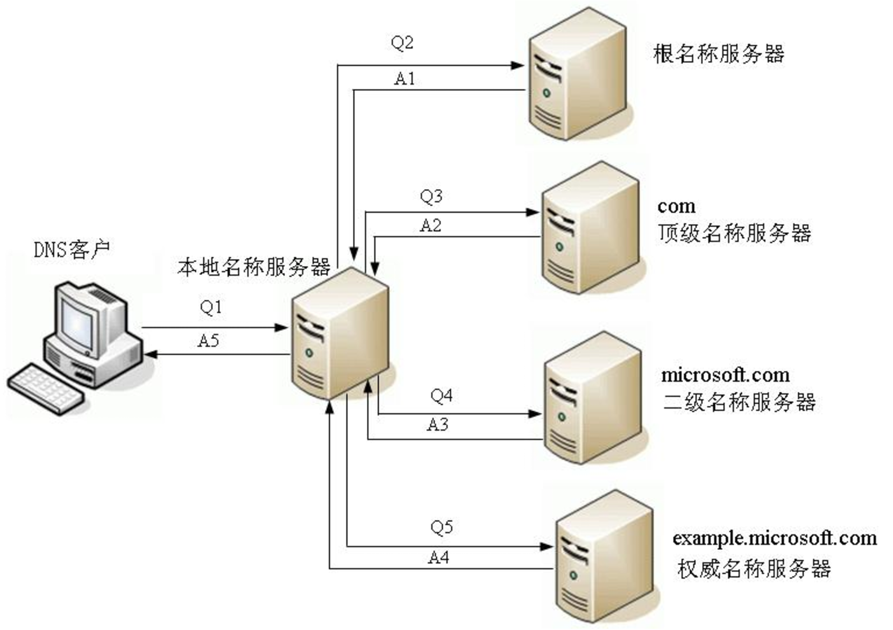

本篇介绍Web前端基础。 

<!--more-->

----------


通过这篇文章，你能了解到：

- 与Web前端相关的基本概念
  - C/S与B/S、TCP/IP、DNS、HTTP、组成文件
- 我们访问网页时发生了什么
- 如何自定义一个Web框架


# B/S与C/S

C/S结构是客户端服务器的意思，而现在的B/S(Browser/Server)结构是从C/S架构衍生出来的，browser相当于一个特殊的客户端。


## 第一种

​	开始的时候，C/S架构软件（即客户机/服务器模式）分为**客户机和服务器两层**：第一层是在客户机系统上结合了表示与业务逻辑，第二层是通过网络结合了数据库服务器。简单的说就是第一层是用户表示层，第二层是数据库层。

​	B/S是C/S架构的一种改进，可以说属于三层C/S架构：

客户端-服务器-数据库（三层C/S架构）


流程:

  1、客户端向服务器发起Http请求

  2、服务器中的web服务层能够处理Http请求

  3、服务器中的应用层部分调用业务逻辑，调用业务逻辑上的方法

  4、如果有必要，服务器会和数据库进行数据交换. 然后将模版＋数据渲染成最终的html, 返送给客户端

以上也可以理解为：**前后端不分离**


- 模板位于后端，前端混有后端的代码，后端含有前端的后台
- 直接返回的 content-type 是html/text


## 第二种

**前后端分离**

客户端－web服务器－应用服务器－数据库


类似于第一种方法，只是将web服务和应用服务解耦

1. 客户端向web服务器发起Http请求
2. web服务能够处理Http请求，并且调用应用服务器暴露在外的RESTFUL接口
3. 应用服务器的RESTFUL接口被调用，会执行对应的暴露方法.如果有必要和数据库进行数据交互，应用服务器会和数据库进行交互后，将json数据返回给web服务器
4. web服务器将模版＋数据组合渲染成html返回给客户端

以上也可以理解为：**前后端分离**


- 前端写前端的代码，后端写后端的代码，然后进行组合！
- 请求数据，可以按照restful，或者rpc规范。
- 返回数据通常是JSON格式
- 前后端分离后，应用服务器具有更强的扩展性。


### api接口

为了在团队内部形成共识、防止个人习惯差异引起的混乱，我们需要找到一种大家都觉得很好的接口实现规范，而且这种规范能够让后端写的接口，用途一目了然，减少双方之间的合作成本。

- 接口服务架构主要有：**restful**、**rpc**。

#### RPC

- Remote Procedure Call，远程过程调用/远程服务调用。

- 理解为：前端将需要调用的函数名与参数发到后端，后端执行相应的函数并返回数据。

例如：

对于一个网址 http://www.xxx.com/api 发送请求 action=get_all_movies&start=25


缺点：

- 接口多了，对应函数名和参数就多了，前端在请求api接口时，就会比较难找，容易出现重复的接口。


#### RESTful

- Representational State Transfer，表述性状态转移/ 资源状态转换.

- 核心：把后端所有的数据/文件都看成资源，那么接口请求数据，本质上来说就是对资源的操作了。

- web项目中操作资源，无非就是增删查改。所以要求在地址栏中声明要操作的资源是什么。

- 然后通过**HTTP请求动词**来说明对资源进行哪一种操作.

  POST http://www.xxx.com/api/movies/   添加电影

  GET    http://www.xxx.com/api/movies/   获取所有电影

  DELETE http://www.xxx.com/api/movies/<pk>   删除1步电影

  GET  http://www.xxx.com/api/movies/<pk>  获取一部电影

- 对于API接口/后端来说，只需要执行如下过程：
  
  - 接收数据(反序列化)   --->   操作数据   --->   响应数据(序列化)
- 最后通过HTTP状态码来得到结果状态。


当然对于把所有操作看作增删查改，有些绝对，比如说对于用户登录，我们需要在数据库中查找用户是否存在，如果存在则修改他的最后登录时间，这种混合型的该怎么处理呢？？？


推荐阅读 [RESTful API规范](https://chennq.com/RESTful/20191028-RESTful-1.html)


## 第三种

**负载均衡**

客户端－负载均衡器(Nginx)－中间服务器(Node)－应用服务器－数据库

这种模式一般用在有大量的用户，高并发的应用中。


真正暴露在外的不是真正web服务器的地址，而是负载均衡器器的地址

1. 客户向负载均衡器发起Http请求

2. 负载均衡器能够将客户端的Http请求均匀的转发给Node服务器集群

3. Node服务器接收到Http请求之后，能够对其进行解析，并且能够调用应用服务器暴露在外的RESTFUL接口

4. 应用服务器的RESTFUL接口被调用，会执行对应的暴露方法.如果有必要和数据库进行数据交互，应用服务器会和数据库进行交互后，将json数据返回给Node

5. Node层将模版＋数据组合渲染成html返回反向代理服务器

6. 反向代理服务器将对应html返回给客户端

推荐阅读 [【原】作为前端需要了解的B/S架构](https://www.cnblogs.com/xianyulaodi/p/5986748.html)


## 第四种

**微服务**

负载均衡能解决的问题很多，但是还是不够好，比如说，只是某一个功能模块（假设是用户中心）被访问的次数特别频繁，我可不可以把这部分内容单独拿出去？用户中心的机器独立，给它单独的带宽，给他单独的服务器，给他单独的数据库？微服务随之产生！

- 在微服务种通常使用RPC，同上面介绍的RPC。
- RPC要解决两个问题：
  1. **解决分布式系统中，服务之间的调用问题。**
  2. **远程调用时，要能够像本地调用一样方便，让调用者感知不到远程调用的逻辑。**


# 网络连接

- 有了网络连接才能在互联网上发送和接收数据。

- 对于概念需要了解OSI七层模型与TCP/IP协议簇。
- 实际使用socket 套接字，应用层和传输层之间的抽象层，一个接口。


# DNS

> **域名系统**（英语：**D**omain **N**ame **S**ystem，缩写：**DNS**）是[互联网](https://zh.wikipedia.org/wiki/互联网)的一项服务。它作为将[域名](https://zh.wikipedia.org/wiki/域名)和[IP地址](https://zh.wikipedia.org/wiki/IP地址)相互[映射](https://zh.wikipedia.org/wiki/映射)的一个[分布式数据库](https://zh.wikipedia.org/wiki/分布式数据库)，能够使人更方便地访问[互联网](https://zh.wikipedia.org/wiki/互联网)。

​	域名系统服务器像是一本网站通讯录。当你在浏览器内输入一个网址时，浏览器获取网页之前将会查看域名系统（域名解析）。浏览器需要找到存放你想要的网页的服务器，才能发送 HTTP 请求到正确的地方。


## 域名解析

将域名解析成IP

DNS查询有两种方式：**递归**和**迭代**。


### 递归解析

​	如果客户端配置的本地名称服务器不能解析的话，则后面的查询全由本地名称服务器代替DNS客户端进行查询，直到本地名称服务器从权威名称服务器得到了正确的解析结果，然后由本地名称服务器告诉DNS客户端查询的结果。




### 迭代解析

​	递归是用户只向**本地DNS服务器**发出请求，然后等待肯定或否定答案。而迭代是本地服务器向**根DNS服务器**发出请求，而**根DNS服务器**只是给出下一级DNS服务器的地址，然后本地DNS服务器再向下一级DNS发送查询请求直至得到最终答案。

​	DNS服务器之间一般采用迭代查询方式。


# HTTP

## 协议简介

超文本传输协议（英文：Hyper Text Transfer Protocol，HTTP）是一种用于分布式、协作式和超媒体信息系统的应用层协议。HTTP是万维网的数据通信的基础。HTTP有很多应用，但最著名的是用于web浏览器和web服务器之间的双工通信。

HTTP 1.1  广泛使用，HTTP/2标准未来将取代它。


## 协议概述

HTTP是一个客户端终端（用户）和服务器端（网站）**请求和应答的标准**（TCP）。

客户端：用户代理程序（user agent）

应答的服务器：源服务器（origin server），存储着一些资源，比如HTML文件和图像。

中间层：在用户代理和源服务器中间可能存在多个“中间层”，比如代理服务器、网关或者隧道（tunnel）。


## 工作原理

前面提到HTTP规定了客户端与服务器之间的请求与应答，那么这两个标准具体是怎样的呢？


### 请求格式

**请求 = 请求行 + 请求头部 + 请求数据**（body）


打开chrome浏览器，点击键盘F12，然后点击 Network， 网址栏中输入 `http://www.hao123.com/`，然后在下面的Name中点击 `www.hao123.com` 就可以看到Genneral、Request Headers 与  Response Headers。

Genneral中记录了 请求的URL、请求方式、状态码、服务器地址

Request Headers 中 点击 view source （注：只有http协议才有，https没有）

- 从中结合请求格式我们可以看到第一行（请求行）为：`GET / HTTP/1.1`   采用get请求，访问根目录，采用的协议为HTTP/1.1。
- 剩下的为请求头部，由于是get请求，所以是没有请求数据的。


### 响应格式

响应 = 状态行 + 响应头部 + 响应正文（body）


请求报文：请求行，请求头部，请求数据  、空行

响应：状态行（状态代码）、响应头部、响应数据   、空行 


## 请求方式

HTTP/1.1协议中共定义了八种方法（也叫“动作”）来以不同方式操作指定的资源：

### get  （获取）

向指定的资源发出“显示”请求。使用GET方法应该只用在读取数据，而不应当被用于产生“副作用”的操作中，例如在Web Application中。其中一个原因是GET可能会被网络蜘蛛等随意访问。

get请求会有 Query String Parameters 它是在请求行内。

什么情况下，浏览器发送get请求？

- 直接在浏览器地址栏输入某个地址
- 点击链接
- 表单默认的提交方式


### HEAD 

与GET方法一样，都是向服务器发出指定资源的请求。只不过服务器将不传回资源的本文部分。它的好处在于，使用这个方法可以在不必传输全部内容的情况下，就可以**获取**其中“关于该资源的信息”（**元信息**或称**元数据**）。


### POST （提交）

向指定资源**提交数据**，请求服务器进行处理（例如提交表单或者上传文件）。数据被包含在**请求体**中。这个请求可能会创建新的资源或修改现有资源，或二者皆有。格式一般都是`json`格式

什么情况下，浏览器会发送post请求？

- 设置表单method = "post"


### PUT

向指定资源位置**上传其最新内容**。


### DELETE

请求服务器**删除Request-URI所标识的资源**。


### TRACE

回显服务器收到的请求，主要用于**测试或诊断**。


### OPTIONS

这个方法可使服务器传回**该资源所支持的所有HTTP请求方法**。用 `*` 来代替资源名称，向Web服务器发送OPTIONS请求，可以**测试服务器**功能是否正常运作。


### CONNECT

HTTP/1.1协议中预留给能够将连接改为管道方式的代理服务器。通常用于**SSL加密服务器的链接**（经由非加密的HTTP代理服务器）。


note:

- HTTP服务器至少应该实现GET和HEAD方法，其他方法都是可选的。当然，所有的方法支持的实现都应当匹配下述的方法各自的语义定义。

- 方法名称是区分大小写的。当某个请求所针对的资源不支持对应的请求方法的时候，服务器应当返回状态码405（Method Not Allowed），当服务器不认识或者不支持对应的请求方法的时候，应当返回状态码501（Not Implemented）。


## HTTP状态码

状态代码的第一个数字代表当前响应的类型： 

- 1xx消息——请求已被服务器接收，**继续处理**
- 2xx成功——请求已**成功**被服务器接收、理解、并接受
- 3xx重定向——需要后续操作才能完成这一请求。 301临时重定向、302永久重定向   
- 4xx请求错误——请求含有词法错误或者无法被执行。 404发送有误，服务器没有了、 403 权限不够 、405不支持该方法
- 5xx服务器错误——服务器在处理某个正确请求时发生错误。 500后台代码有误、501不支持对应的请求方法、502网络有问题。


重定向的本质是:在响应头部中有 Location：url


## URL

超文本传输协议（HTTP）的统一资源定位符将从因特网获取信息的五个基本元素包括在一个简单的地址中：

- 传送协议。
- 层级URL**标记符号**（固定标记）(为`//`, 固定不变)
- 访问资源需要的凭证信息（可省略）
- 服务器。（通常为**域名**，有时为IP地址）
- 端口号。（以数字方式表示，若为http的默认值“80”可省略 ；https的默认值为443）
- 路径。（以“/”字符区别路径中的每一个目录名称）


GET查询：GET模式的窗体参数（Query String Parmeters），以“?”字符为起点，每个参数以“&”隔开，再以“=”分开参数名称与数据，通常以UTF8的URL编码，避开字符冲突的问题。query string的长度由浏览器和web服务器限制。


例如： `https://www.sogou.com/web?query=%E5%9B%9B%E5%85%AD%E7%BA%A7&_ast=1566390027`

- `https` 是协议
- `//`是固定标记
- `www.sogou.com`为域名
- `web`是路径
- `?query=%E5%9B%9B%E5%85%AD%E7%BA%A7&_ast=1566390027`是get查询的参数。它位于请求行中。
- `#` 是在页内跳转


## HTTP协议是无状态的

http协议是无状态的，同一个客户端的这次请求和上次请求是没有对应关系，对http服务器来说，它并不知道这两个请求来自同一个客户端。 为了解决这个问题， Web程序引入了Cookie机制来维护状态.


# 组成文件

一个网页由许多文件组成，就像商店里不同的商品一样。这些文件有两种类型：

- **代码** : 网页大体由 HTML、CSS、JavaScript组成，不过你会在后面看到不同的技术。
- **资源** : 这是其他组成网页的东西的集合，比如图像、音乐、视频、Word文档、PDF文件。


# 到底发生了什么？

当你在浏览器里输入一个URL：

1. 浏览器向 **DNS** 服务器请求解析该 URL 中的域名所对应的 IP 地址;
2. 解析出 IP 地址后，根据该 IP 地址和默认端口 80，和服务器**建立TCP连接**;
3. 浏览器发出读取文件(URL 中域名后面部分对应的文件)的**HTTP 请求**，该请求报文作为 TCP 三次握手的第三个报文的数据发送给服务器;
4. 服务器对浏览器请求作出**响应**，并把对应的 html 文本发送给浏览器;
5. **释放** TCP连接;
6. 浏览器**解析**html代码，并请求html代码中的资源


# Python中自定义Web框架

web框架的本质：**socket服务端**，而浏览器其实是一个socket客户端。

- 功能： 3部分，待会儿细谈。

http规范了请求与响应的格式，模仿这个格式可以简单的建立一个应用程序。


## 版本一

这个版本让我们知道请求与响应是什么？

- 符合格式的比特流

```python
__author__ = 'naqin'
__date__ = '2019/8/21 9:06'

import socket

# 创建socket对象
sk = socket.socket()
# 绑定ip和端口
sk.bind(('127.0.0.1',8848))   # 实际上是80
# 监听
sk.listen()
# 等待连接
while True:
    conn,addr = sk.accept()
    data = conn.recv(1024)
    print(data)
    # conn.send(b'ok')
    conn.send(b'HTTP/1.1 200 OK\r\n\r\n ok')
    # 没写响应头部，只有状态行和响应正文。
    conn.close()
```


回车符 `\r` , 换行符 `\n`

```
b'GET / HTTP/1.1
\r\nHost: 127.0.0.1:8848
\r\nConnection: keep-alive
\r\nUpgrade-Insecure-Requests: 1
\r\nUser-Agent: Mozilla/5.0 (Windows NT 10.0; Win64; x64) AppleWebKit/537.36 (KHTML, like Gecko) Chrome/75.0.3770.100 Safari/537.36
\r\nAccept: text/html,application/xhtml+xml,application/xml;q=0.9,image/webp,image/apng,*/*;q=0.8,application/signed-exchange;v=b3
\r\nAccept-Encoding: gzip, deflate, br
\r\nAccept-Language: zh-CN,zh;q=0.9\r\n\r\n'
# get请求没有 body
```


## 版本二

上一个版本，我们明白了只要按照格式，就可以与客户端做一个简单的响应。

在这个版本中，我们完成了一个简单的服务端：

1. 使用socket收发消息
2. 根据不同的路径生成不同的内容
3. 返回动态的数据（字符串的替换  --->  模板的渲染）（模板：html   渲染：字符串替换 ）

在未来对框架的学习过程中，本质上我们也是学习的这三块内容。


```python
__author__ = 'naqin'
__date__ = '2019/8/21 9:06'

import socket
import time

sk = socket.socket()

# 绑定ip和端口
sk.bind(('127.0.0.1',8848))   # 实际上是80

# 监听
sk.listen()


# 函数化处理请求
def index(url):
    with open('index.html','rb') as f:
        return f.read()

def home(url):
    ret = f'欢迎回家！{url}'
    return ret.encode('utf-8')

def root(url):
    ret = f'根路径！{url}'
    return ret.encode('utf-8')

def timer(url):
    now = time.time()
    with open('time.html',encoding='utf-8') as f:
        ret = f.read()
    ret = ret.replace('@@time@@',str(now))  # 动态的数据
    return ret.encode('utf-8')


# 改变if判断，建立对应关系
li = [
    ('/',root),
    ('/index',index),
    ('/home',home),
    ('/time',timer),
]

# 规范化，我们在增加新的路径时，只需要增加函数和对应关系，其它逻辑可以不用管。


# 等待连接
while True:
    conn,addr = sk.accept()
    data = conn.recv(1024)
    url = data.decode('utf-8').split()[1]
    print(url)
    # conn.send(b'ok')
    for i in li:
        if i[0] == url:
            ret = i[1](url)
            break
    else:
        ret = '路径不存在'.encode('utf-8')

    conn.send(b'HTTP/1.1 200 OK\r\nContent-Type: text/html;charset=UTF-8\r\n\r\n')
    conn.send(ret)
    # 没写响应头部

    conn.close()
```


# 小结

Web依赖于协议，通过http协议规定客户端与服务端的请求与响应规则，我们可以简单的自制一个框架，它是由三部分构成：利用socket收发消息的收发；生成想要的数据；返回动态的数据（模板渲染）。 