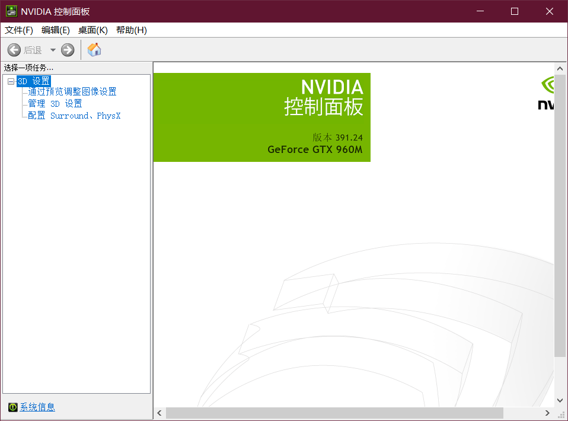
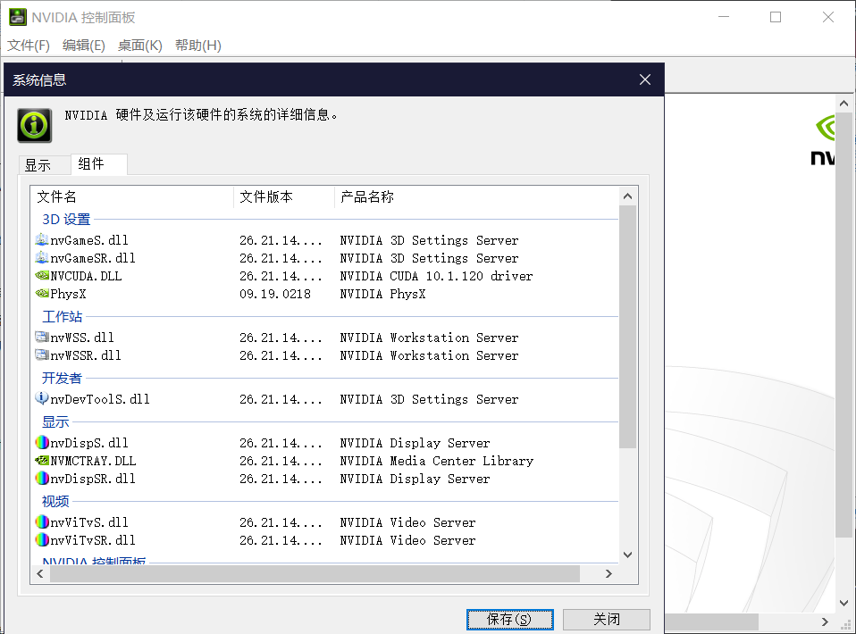
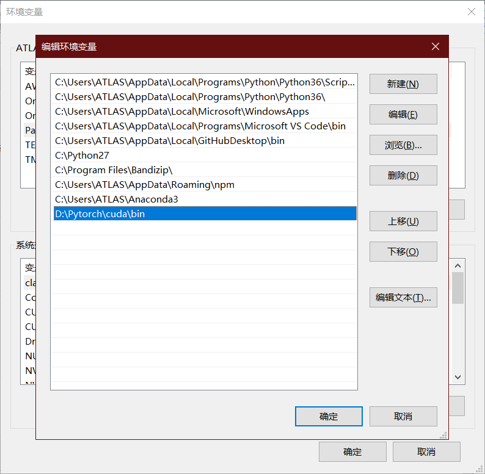
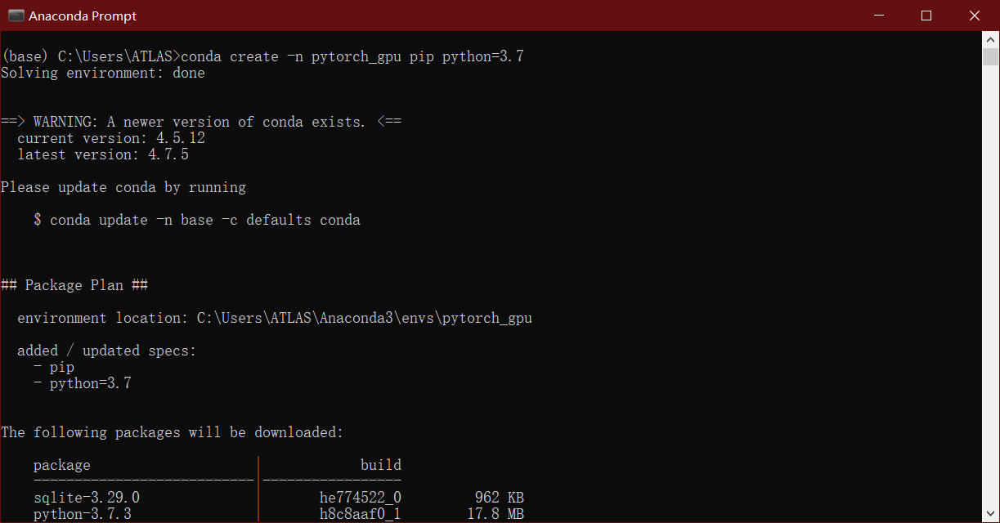
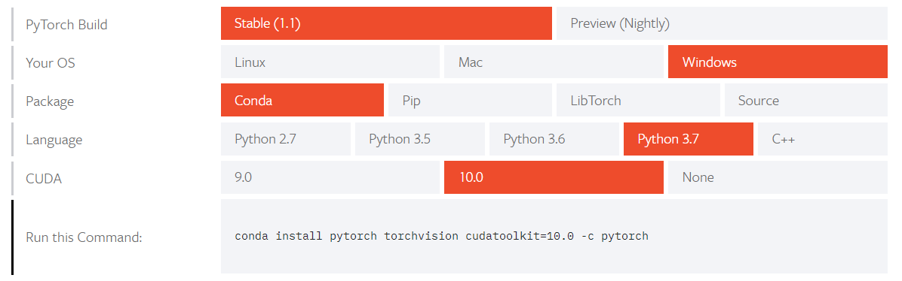
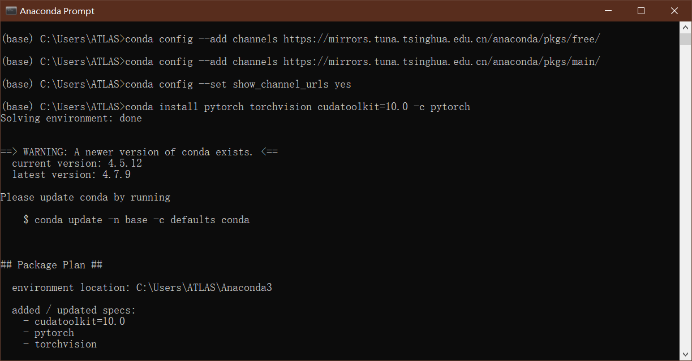
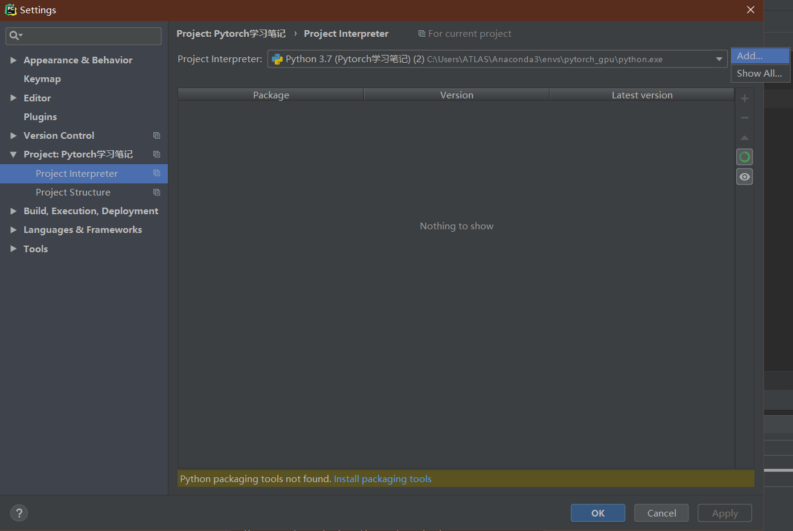
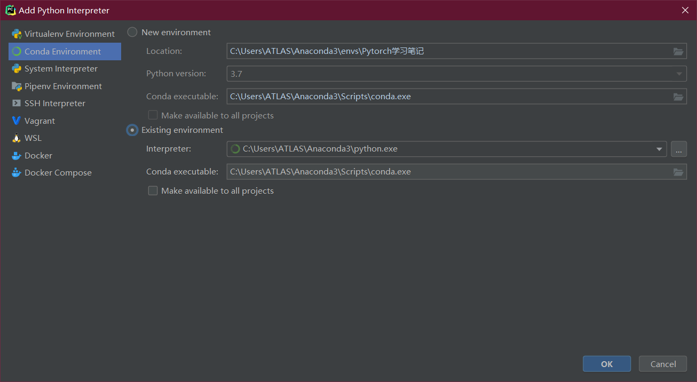
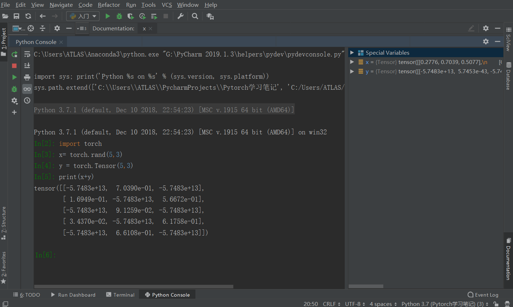

本篇为Pytorch安装。 

<!--more-->


# 环境配置篇

## 安装cuda


### 更新nvidia驱动

打开GeForce Game Ready Driver或在 [GeForce  Experience](https://www.geforce.cn/drivers)中下载符合自己gpu的程序。


### 选择cuda 

1. 打开nvidia控制面板

   


2. 点击帮助、点击系统信息、在点击组件在3D设置中可以看到cuda信息

   

   在我升级过nvidia驱动后，cuda的版本更新到了10.1。接下来下载cuda

   [cuda10.1](https://developer.nvidia.com/cuda-downloads?target_os=Windows&target_arch=x86_64&target_version=10&target_type=exelocal)安装完毕。

   

## 安装cuDNN


在安装了cuda10.1后选择对应的cuDNN版本v7.6.1

解压文件，然后添加bin目录到环境变量




## 使用Anaconda prompt创建环境

```
conda create -n pytorch_gpu pip python=3.7
```

其中pytorch_gpu是环境的名字，python版本是3.7




```
conda activate pytorch_gpu
```

这个命令可以进入创建好的环境。


## 安装Pytorch 

建议切换源，我使用的是中国科学技术大学”（[USTC Open Source Software Mirror](https://link.zhihu.com/?target=http%3A//mirrors.ustc.edu.cn/)）提供anaconda的镜像源，速度提高不少。

方法一：

```
conda config --add channels https://mirrors.ustc.edu.cn/anaconda/pkgs/free/
conda config --set show_channel_urls yes
```

方法二：

打开.condarc文件，进行编辑


这个顺序存在一个优先级，会先在中国科学技术大学的镜像源寻找，如果大家感觉速度慢，也可以换别的镜像源。


打开[官网](<https://pytorch.org/get-started/locally/>)选择后复制命令



```
conda install pytorch torchvision cudatoolkit=10.0 -c pytorch
```



整个过程只需要按一下'y'即可。


## 验证

为了确保PyTorch是否安装成功，我们需要运行简单的样例代码测试，例如打印出随机生成的张量矩阵，以及gpu是否可以使用。

```python
import torch
x = torch.rand(5,5)
print(x)
```

输出类似下面

```
tensor([[0.7078, 0.1424, 0.3411, 0.3987, 0.3476],
        [0.7534, 0.7137, 0.3489, 0.4226, 0.3640],
        [0.4104, 0.8411, 0.5112, 0.0629, 0.0664],
        [0.7568, 0.9495, 0.3300, 0.2392, 0.6441],
        [0.7615, 0.1883, 0.6001, 0.9663, 0.3313]])
```

如果ok，pytorch安装成功。


```python
torch.cuda.is_available()
```

返回True，GPU版Pytorch安装完毕。


## 将PyTorch导入Pycharm

点击Pycharm的选项栏中的File选择Settings，然后点击Project Interpreter，接着点击右侧的Add。



然后在Conda Environment中选择Existing environment 

选择Anaconda3下的python.exe，Conda executable选择conda.exe



如果失败，选择Anaconda3下的env下的新创建的虚拟环境中选择python，试一试。


### Pycharm开启科学计算模式（Scientific Mode）

#### 具体步骤：

1. Settings –> Tools –> Python Scientific > Show plots in tool window 勾选 
2. View 勾选 Scientific Mode 
3. Run–>Edit configurations… 
4. 勾选 Run with python console



开启科学运算模式，舒服，正在习惯这个姿势。


ps：如果想恢复到普通模式，只需要在view下，取消scientific mode勾选。


## 补充

1. anaconda查看虚拟环境 

```
conda env list
```


2. 进入虚拟环境，可以在anaconda下，直接open terminal


3. 但如果想要以管理员的身份进入呢？可以使用如下命令：

```
C:\Users\ATLAS\Anaconda3\condabin>activate.bat pytorch_gpu
```


## 结束语

​	环境安装完毕，接下来开始我的探索之路，共勉！


------------------


