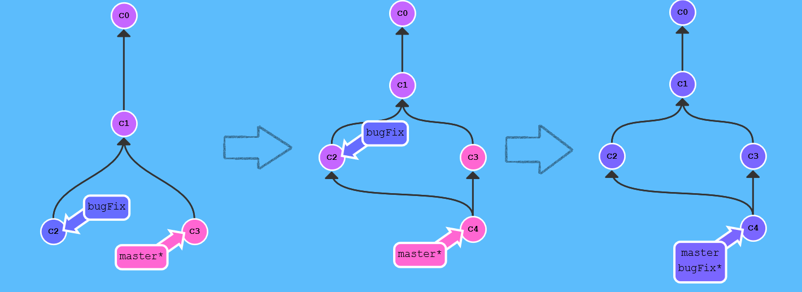
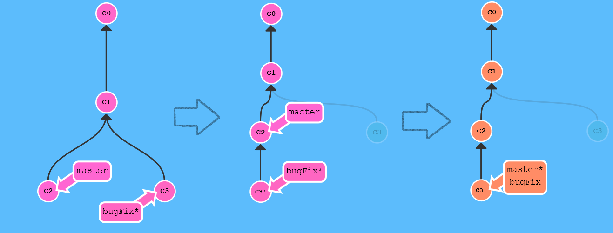
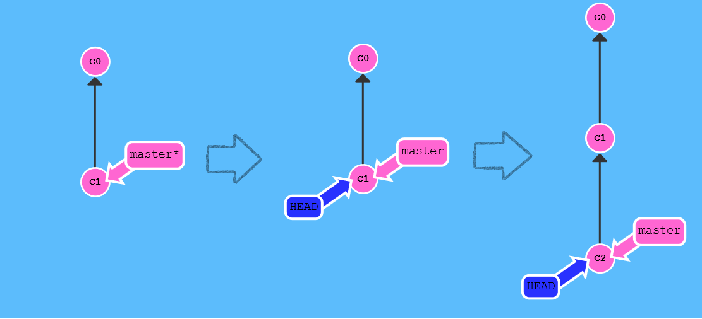
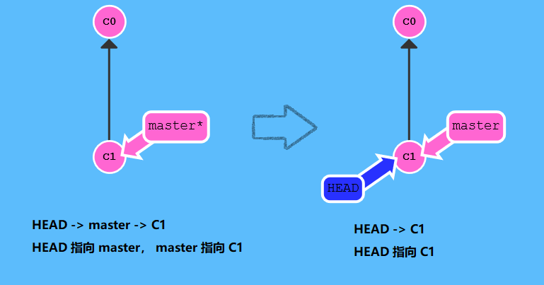
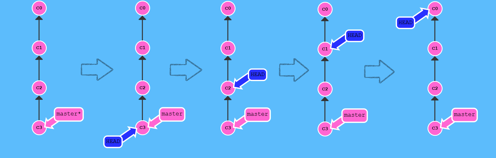
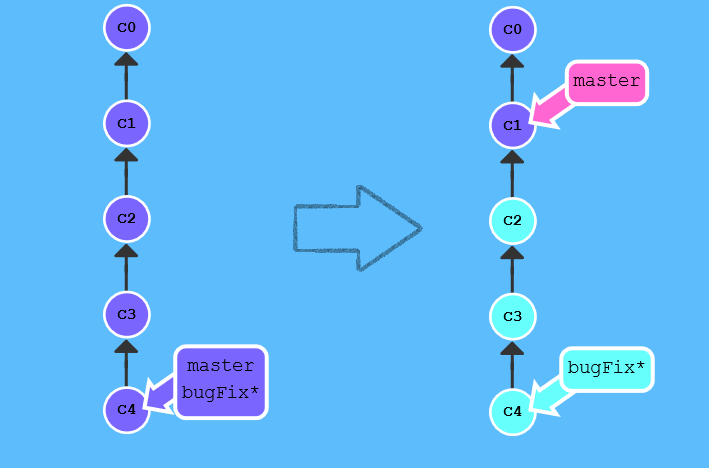
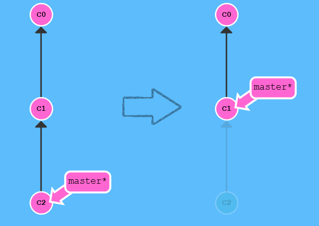
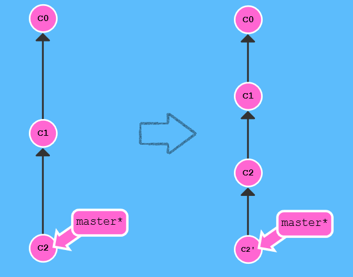

 本篇介绍git的基础命令，以及三个场景下的使用流程。   

<!--more-->


通过这篇文章，你能了解到：

- git的基础命令
- 个人开发场景下的流程（待补充）
- 公司和家配合开发场景下的流程（待补充）
- 协同开发（待补充）


推荐学习 [学习Git分支](https://oschina.gitee.io/learn-git-branching/) ，本文大部分内容也来自此


# 概述

## 版本控制有什么作用？

1. 防止代码冲突，相互覆盖

2. 帮助后面的人员快速了解整个项目的开发过程

3. 如果出现需求变更，方便还原代码


## 代码版本控制软件

git，svn（老旧的项目），csv（比svn还早，银行）

SVN的缺点：如果中央服务器挂了，只能停工了。


git：分布式的版本控制，每个节点平等。本地的可以充当中央服务器。

- 先提交到本地（commit），在推送到线上（push）。
- 既充当服务器也充当客户端


# Git基础命令

## 90%

### git commit

- Git 仓库中的**提交记录**保存的是你的目录下所有文件的**快照**。
- 每次进行提交时，它并不会盲目地复制整个目录。条件允许的情况下，它会将当前版本与仓库中的上一个版本进行对比，并把所有的**差异**打包到一起作为一个提交记录。
- Git 还保存了提交的**历史记录**。这也是为什么大多数提交记录的上面都有父节点的原因。


### git branch

- Git 的分支非常轻量。它们只是简单地指向某个提交纪录：早建分支！多用分支！

- 分支的作用：我想基于这个提交以及它所有的父提交进行新的工作。

```
git branch newImage   	创建一个到名为 newImage 的分支
git chechout <name>		在提交修改之前切换到新分支上
git checkout -b <your-branch-name>	创建一个新的分支同时切换到新创建的分支
```


### 分支与合并

**Git Merge**（第一种）

- 在 Git 中合并两个分支时会产生一个特殊的提交记录，它有两个父节点。
- 翻译成自然语言相当于：“我要把这两个父节点本身及它们所有的祖先都包含进来。”




```
第一个箭头：
	git merge bugFix;      	将bugFix合并到当前分支上（master）
第二个箭头：
	git checkout bugFix;  	切换分支
	git merge master;     	把 master 分支合并到 bugFix
```

解释：

第一个箭头：

- `master` 现在指向了一个拥有两个父节点的提交记录。
- 假如从 `master` 开始沿着箭头向上看，在到达起点的路上会经过所有的提交记录。这意味着 `master` 包含了对代码库的所有修改。

第二个箭头：

- 因为 `master` 继承自 `bugFix`，Git 什么都不用做，只是简单地把 `bugFix` 移动到 `master` 所指向的那个提交记录。  

- 现在所有提交记录的颜色都一样了，这表明每一个分支都包含了代码库的所有修改！


命令补充：

git分支改名：

```
如果对于分支不是当前分支：
	git branch -m 原名 新
如果是当前，那么可以使用加上新名字：
	git branch -m 原名 
```


**Git Rebase** （第二种）

- Rebase 实际上就是取出一系列的提交记录，“复制”它们，然后在另外一个地方逐个的放下去。

- Rebase 的优势就是可以**创造更线性的提交历史**，如果只允许使用 Rebase 的话，代码库的提交历史将会变得异常清晰。



目标：

- 我们想要**把 bugFix 分支里的工作直接移到 master 分支上**。移动以后会使得两个分支的功能看起来像是按顺序开发，但实际上它们是并行开发的。

命令：

```
第一个箭头：
	git rebase master      	把当前分支（bugFix）rebase到master分支上
第二个箭头：
	git checkout master 	切换到master
	git rebase bugFix		把当前分支（master）rebase到bugFix分支上。
```

解释：

第一个箭头：

-  bugFix 分支上的工作在 master 的最顶端，同时我们也得到了一个更线性的提交序列。
- 提交记录 C3 依然存在（树上那个半透明的节点），而 C3' 是我们 Rebase 到 master 分支上的 C3 的副本。

第二个箭头：

- 由于 `bugFix` 继承自 `master`，所以 Git 只是简单的把 `master` 分支的引用向前移动了一下而已。


## 在提交树上移动


### **HEAD**

- HEAD 是一个对当前检出记录的符号引用，也就是**指向**你正在其基础上**进行工作的提交记录**。




命令：

```
git checkout C1;
git checkout master;
git commit;
git checkout C2;
```

解释：

- HEAD 指向了 `master`，随着提交向前移动。
- 这些命令并不是真正查看 HEAD 指向，补充命令如下：

补充命令：

```
查看HEAD指向：
cat .git/HEAD
git symbolic-ref HEAD
```


### **分离的 HEAD**

- 分离的 HEAD 就是让其**指向了某个具体的提交记录**而不是分支名。



命令：

```
git checkout C1
```

在命令执行之前的状态如下所示：   

- HEAD -> master -> C1

-  HEAD 指向 master， master 指向 C1

执行命令后：

- HEAD -> C1

note：图中C1，C2 指得是哈希值，通过哈希值指定提交记录。


### git log

- 查看提交记录的哈希值（基于 SHA-1，共 40 位）。
- 虽然哈希值有些长~，但是Git 对哈希的处理很智能。你只需要提供能够唯一标识提交记录的前几个字符即可。


### 相对引用

- 正如前面，通过哈希值指定提交记录很不方便，所以 Git 引入了相对引用。这个就很厉害了!
- 使用相对引用的话，你就可以从一个易于记忆的地方（比如 `bugFix` 分支或 `HEAD`）开始计算。


第一种用法：

使用 `^` 向上移动 1 个提交记录

- 操作符 (^)：把这个符号加在引用名称的后面，表示让 Git 寻找指定提交记录的父提交。




命令：

```
git checkout C3;
git checkout HEAD^;
git checkout HEAD^;
git checkout HEAD^;

也可以写为：
git checkout C3;
git checkout HEAD^^^;
```


第二种用法:

- 显然如果向上移动很多步的话，敲那么多 `^` 貌似也挺烦人的，所以Git又引入了操作符 `~`。

- 使用 `~<num>` 向上移动多个提交记录，如 `~3`

上面的命令就可以改为：

```
也可以写为：
git checkout HEAD~4;
```


### **强制修改分支位置**

使用相对引用最多的就是移动分支。可以直接使用 `-f` 选项让分支指向另一个提交。

例如:  上例中，将 master 分支强制指向 HEAD 的第 3 级父提交。




命令：

```
git branch -f master HEAD~3
```


## 撤销变更

- 在 Git 里撤销变更的方法很多。和提交一样，撤销变更由底层部分（暂存区的独立文件或者片段）和上层部分（变更到底是通过哪种方式被撤销的）组成。

- 这里关注的是后者


### git reset

- `git reset` 通过把分支记录回退几个提交记录来实现撤销改动。你可以将这想象成“改写历史”。`git reset` 向上移动分支，原来指向的提交记录就跟从来没有提交过一样。



命令：

```
git reset HEAD~1
```


解释：

- Git 把 master 分支移回到 `C1`；现在我们的本地代码库根本就不知道有 `C2` 这个提交了。
- 在reset后， `C2` 所做的变更还在，但是处于未加入暂存区状态。


### git revert

- 虽然在你的本地分支中使用 `git reset` 很方便，但是这种“改写历史”的方法对大家一起使用的远程分支是无效的哦！
- 为了撤销更改并**分享**给别人，我们需要使用 `git revert`。来看演示：



命令：

```
git revert HEAD
```

解释：

- 不同于reset的回退，revert后多了一个新提交，在这个新提交记录 `C2'` 引入了**更改** —— 这些更改刚好是用来撤销 `C2` 这个提交的。也就是说 `C2'` 的状态与 `C1` 是相同的。


## 10%


待补充！！！


通用流程如下：

