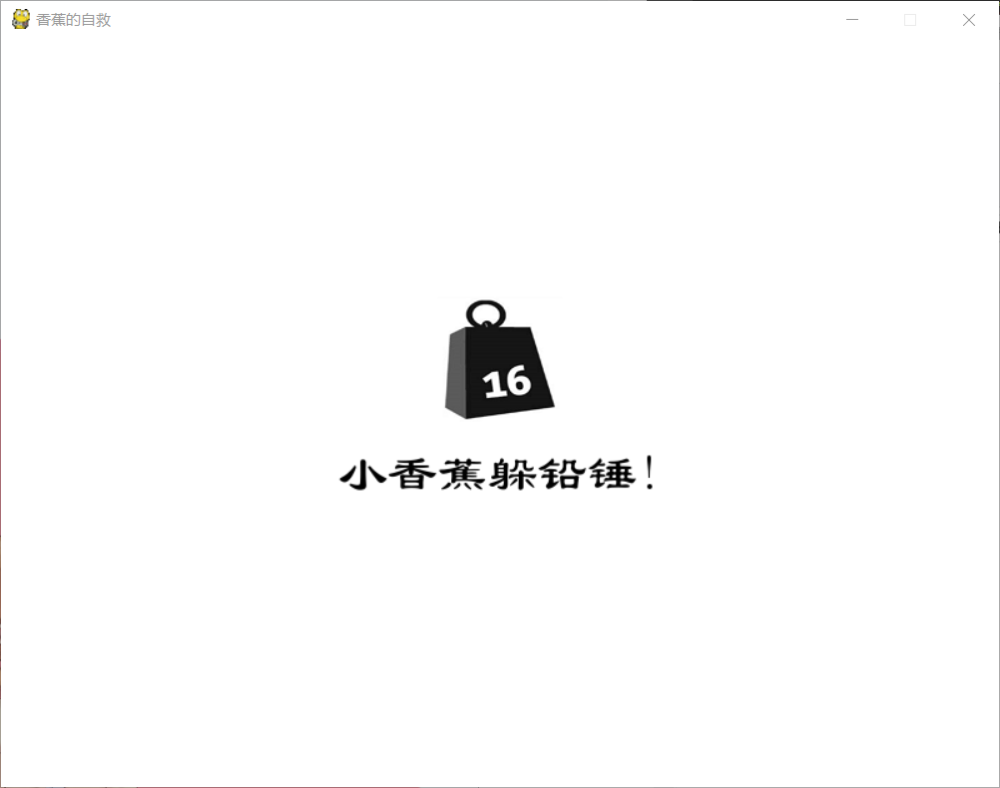
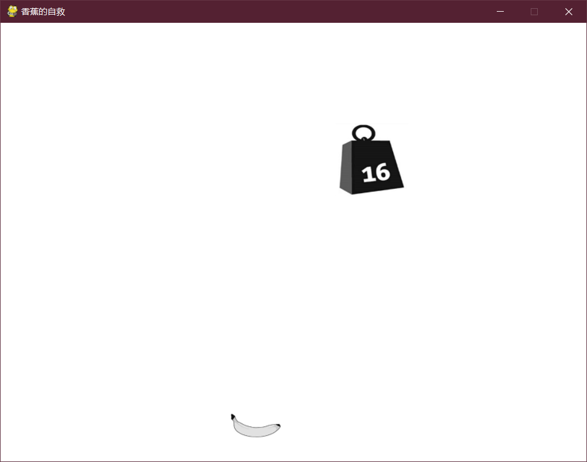
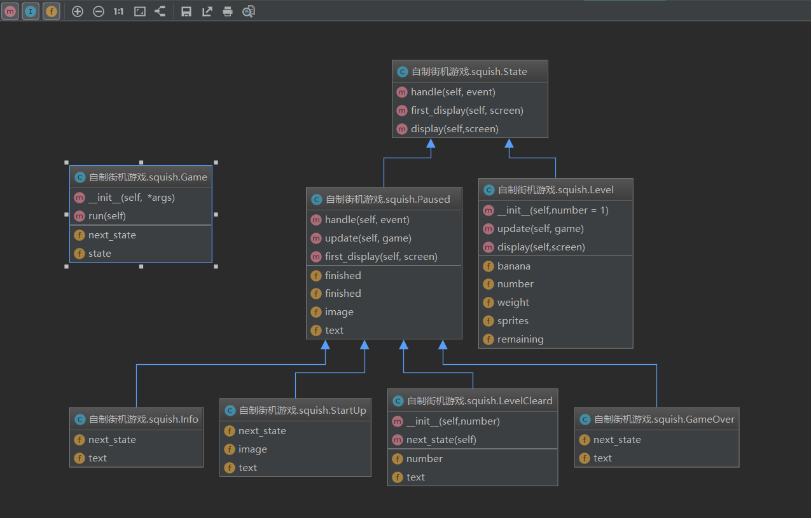
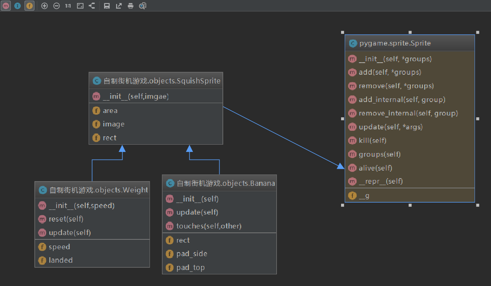

使用Pygame扩展，编写功能齐备的全屏街机游戏。参考《python基础教程》 

<!-- more -->


------


## 问题描述

如何编写计算机游戏呢？游戏的基本设计过程与其他程序类似，但开发对象模型前， 必须先设计游戏本身，如游戏包含的角色、所处的环境以及要实现的目标。 

这里将创建的游戏是从巨蟒剧团推出的著名短剧“Self-Defense Against Fresh Fruit”改编而 来的。在这个短剧中，军士长John Cleese指挥士兵使用防守战术抵御入侵者使用新鲜水果（如石 榴、糖水芒果、青梅和香蕉）发起的进攻。防守战术包括使用枪支、放老虎以及在敌人头顶扔下 重达16吨的铅锤。在这个游戏中，我们将反过来，让玩家控制一支香蕉。这支香蕉要躲开从天而 降的16吨铅锤，尽力在防御战中活下来。我想将这个游戏命名为Squish比较合适。

这个项目的目标是围绕着游戏设计展开的。这款游戏必须像设计的那样：香蕉能够移动，16 吨的铅锤从天而降。另外，与往常一样，代码必须是模块化的，且易于扩展。一个重要的需求是， 设计应包含一些游戏状态（如游戏简介、关卡和“游戏结束”状态），同时可轻松地添加新状态。


## 有用的工具 

### pygame 

模块pygame自动导入其他所有的Pygame模块。如pygame.display和pygame.font。 

模块pygame包含函数Surface，它返回一个新的Surface对象。Surface对象其实就是一个指定尺寸的空图像，可用来绘画和传送。传送（调用Surface对象的方法blit）意味着在Surface之间 传输内容。［传送的英文单词blit是从技术术语块传输（block transfer）的简写BLT衍生而来的。］ 

函数**init**是Pygame游戏的核心，必须在游戏进入主事件循环前调用。这个函数<u>自动初始化其他所有模块</u>（如font和image）。 

如果要捕获Pygame特有的错误，就需要使用error类。 

```
import pygame, sys
from pygame.locals import *

white = 255,255,255
black = 0,0,0

pygame.init()

screen = pygame.display.set_mode((500, 500))
myfront = pygame.font.Font(None,60)
textImage = myfront.render("Hello Pygame", True, black)

while True:		# 死循环确保窗口一直显示
    for event in pygame.event.get():     # 遍历所有事件
        if event.type in (QUIT, KEYDOWN): # 单击关闭窗口，或键盘输入就退出
            sys.exit()
    screen.fill(white)					# 白色填充
    screen.blit(textImage, (100, 100))  # 改变画面，加上字
    pygame.display.update() 			# 更新画面
```


### pygame.locals 

模块pygame.locals包含你可能在自定义模块的作用域内使用的名称（变量），如事件类型、 键、视频模式等的名称。可导入这个模块的所有内容（from pygame.locals import *），但如果知道需要哪些名称，应该做更具体的导入，如from pygame.locals import FULLSCREEN。 


### pygame.display

模块pygame.display包含处理**内容显示**的函数，这些内容可显示在普通窗口中，也可占据整个屏幕。在这个项目中，需要用到如下函数。

- flip：更新显示。一般而言，分两步来修改当前屏幕。首先，对函数get_surface返回 的Surface对象做必要的修改，然后调用pygame.display.flip来更新显示，反映出所做 的修改。 
- update：只想更新屏幕的一部分时，使用这个函数，而不是flip。调用这个函数时，可只 提供一个参数，即RenderUpdates类的方法draw返回的矩形列表。 
- set_mode：设置显示的尺寸和类型。显示模式有多种，但这里只使用全屏模式和默认模式 “在窗口中显示”。 
- set_caption：设置Pygame程序的标题。函数set_caption主要用于游戏在窗口中运行（而不是以全屏模式运行）时，因为标题将用作窗口的标题。 
- get_surface：返回一个Surface对象，你可在其中绘制图形，再调用pygame.display.flip 或pygame.display.blit。这个项目只使用了Surface对象的一个方法来绘画，这就是**blit**， <u>它将一个Surface对象中的图形传输到另一个Surface对象的指定位置</u>。另外，还将使用 Group对象的方法draw在Surface上绘制Sprite对象。


### pygame.font 

模块pygame.font包含函数Font。字体对象用于表示不同的字体，可用于将文本渲染为可在 Pygame中作为普通图形使用的图像。


### pygame.sprite （小精灵）

模块pygame.sprite包含两个非常重要的类：Sprite和Group。 

Sprite类是**所有可见游戏对象**（在这个项目中，是香蕉和重16吨的铅锤）的**基类**。要实现自 定义的游戏对象，可从Sprite派生出子类，并重写构造函数以设置其属性image和rect（这些属性 决定了Sprite的外观和位置），同时重写在Sprite可能需要更新时调用的方法update。 

Group及其子类的实例用作**Sprite对象的容器**。一般而言，使用Group是个不错的主意。在简 单的游戏（如本章的项目）中，只需创建一个名为sprites或allsprites之类的Group，并将所有 Sprite都添加到其中。这样，当你调用Group对象的方法update时，将自动调用所有Sprite对象的方法update。另外，Group对象的方法clear用于清除它包含的所有Sprite对象（实际的清理工作是使用一个回调函数完成的），而方法draw可用于绘制所有的Sprite对象。 

在这个项目中，将使用Group的子类RenderUpdates，其方法draw返回列表，其中包含所有受 到影响的矩形。可将这个列表传递给pygame.display.update，以只更新需要更新的部分。通过这 样做，有可能极大地改善游戏的性能。


### pygame.mouse 

在即将开发的游戏Squish中，只使用模块`pygame.mouse`来做两件事情：隐藏鼠标以及获取鼠标的位置。这两件事分别是使用`pygame.mouse.set_visible(False)`和`pygame.mouse.get_pos()` 来完成的。


### pygame.event 

模块`pygame.event`跟踪各种事件，如鼠标单击、鼠标移动、按下或松开键等。要获取最近发生的事件列表，可使用函数`pygame.event.get`。

如果只需要状态信息，如`pygame.mouse.get_pos`返回的鼠标位置，就无需使用`pygame.event.get`。 然而，你需要确保`Pygame`同步地更新，为此可定期调用函数`pygame.event.pump`。 


### pygame.image 

模块pygame.image用于处理图像，如以GIF、PNG、JPEG和其他几种文件格式存储的图像。 在这个项目中，只需要这个模块中的函数load，它读取图像文件并创建一个包含该图像的Surface 对象。


### pygame.Rect

Rect是用于存储矩形坐标的pygame对象。

rect对象有一些虚拟属性，比如top.left,bottom.right这些是用来固定矩形的位置的，

还有size,width,height，这些是描述矩形大小，宽高分别是多大。

center为矩形的中心点，其实就是关于横纵坐标的二元组，因此又有centerx,centery两个属性。此外，还有x，y。


## 初次实现（铅锤下降）

使用诸如Pygame等新工具开发程序时，应让第一个原型尽可能简单，并将重点放在学习新 工具的基本知识，而不是程序本身的细节上。这样做通常大有裨益。因此，在游戏Squish的第一 个版本中，我们只创建重16吨的铅锤从天而降的动画。制作这个动画需要的步骤如下。 

### 步骤如下：

(1) 使用`pygame.init`、`pygame.display.set_mode`和`pygame.mouse.set_visible`初始化`Pygame`。 使用`pygame.display.get_surface`获取屏幕表面，使用方法fill以白色填充屏幕表面，再调用 `pygame.display.flip`显示所做的修改。

```
white = 255,255,255
pygame.init()
screen = pygame.display.set_mode((500,500))
pygame.mouse.set_visible(True)
pygame.display.get_surface()
screen.fill(white)
pygame.display.flip()
```


(2) 加载铅锤图像。 

```
plumb = pygame.image.load('plumb.png')
plumb = plumb.convert()  #这将根据当前显示量身定制一个Surface对象，从而最大限度地提高其显示速度。
```


(3) 使用这幅图像创建自定义类Weight（Sprite的子类）的一个实例。将这个对象添加到Render Updates编组sprites中。（处理多个Sprite对象时，这样做很有帮助。） 

```
sprites = pygame.sprite.RenderUpdates()
sprites.add(Weight(speed))
```


(4) 使用pygame.event.get获取最近发生的所有事件，并依次检查这些事件。如果发现事件QUIT 或因按下Escape键（K_ESCAPE）而触发的KEYDOWN事件，就退出程序。事件类型和键分别存储在事件对象的属性type和key中。诸如QUIT、KEYDOWN和K_ESCAPE等常量可从模块pygame.locals导入。） 

```
while True:
    # 检查退出事件
    for event in pygame.event.get():
        if event.type in (QUIT, KEYDOWN):
            sys.exit()
```


(5) 调用编组sprites的方法clear和update。方法clear使用回调函数来清除所有的Sprite对象 （这里是铅锤），而方法update调用Weight实例的方法update（你必须在Weight类中实现方法update）

```
def update(self, *args):
        '''更新下一帧中的铅锤'''
        self.rect.top += self.speed
        print(self.rect.top)
        if self.rect.top > screen_size[1]:
            print('over')
            self.reset()
```

 

(6) 调用sprites.draw并将屏幕表面作为参数，以便在当前位置绘制铅锤（每次调用Weight实例 的update方法后，位置都将发生变化）。

```
updates = sprites.draw(screen)
```


(7) 调用pygame.display.update，并将sprites.draw返回的矩形列表作为参数，只更新需要更新的部分。（如果你不在乎性能，可使用pygame.display.flip来更新整个屏幕。）

```
pygame.display.update(updates)
```


(8) 重复4-7步

完整代码如下：

```
import pygame
import sys
from random import  randrange
from pygame.locals import *


class Weight(pygame.sprite.Sprite):  # sprite 模块下的 Sprite
    def __init__(self,speed):
        # super().__init__(self)  # 有问题这句话
        pygame.sprite.Sprite.__init__(self)
        self.speed = speed
        # 绘制Sprite对象时要用到图像和矩形：
        self.image = plumb
        self.rect = self.image.get_rect()
        self.reset()
    def reset(self):
        '''将铅锤移动到顶端的一个随机位置'''
        self.rect.top = -self.rect.height
        self.rect.centerx = randrange(screen_size[0])
    def update(self, *args):
        '''更新下一帧中的铅锤'''
        self.rect.top += self.speed
        print(self.rect.top)
        if self.rect.top > screen_size[1]:
            print('over')
            self.reset()

white = (255,255,255)
screen_size = (500,500)

# 用于清除Sprite对象
def clear_callback(surf , rect):
    surf.fill(white , rect)


# 初始化
pygame.init()
screen = pygame.display.set_mode(screen_size)
pygame.mouse.set_visible(0)
pygame.display.get_surface()
screen.fill(white)
pygame.display.flip()


# 加载铅锤图像
plumb = pygame.image.load('plumb.png')
plumb = plumb.convert()  # )# 以便与显示匹配
print('--->',plumb.get_rect())  # 矩形

# 设置速度
speed = 1

# 创建一个Sprite对象编组，并向其中添加一个Weight实例
sprites = pygame.sprite.RenderUpdates()
sprites.add(Weight(speed))


while True:
    # 检查退出事件
    for event in pygame.event.get():
        if event.type == QUIT:       # QUIT 在pygame.locals中
            sys.exit()
        elif event.type == KEYDOWN and event.type == K_ESCAPE :
            sys.exit()
    # 清除以前的位置
    sprites.clear(screen,clear_callback)
    # 更新所有的Sprite对象；
    sprites.update()
    # 绘制所有的Sprite对象
    updates = sprites.draw(screen)
    # 更新必要的显示部分
    pygame.display.update(updates)
    pygame.time.delay(10)
```

### 补充：

- 所有的Sprite对象都有属性image和rect，其中前者应是一个Surface对象（图像），而后者应是一个矩形对象（只需使用self.image.get_rect()初始化它即可）。绘制Sprite对象时，将用到这两个属性。通过修改self.rect，可移动Sprite对象。 
- Surface对象包含方法convert，可用于创建使用不同颜色模式的副本。你无需关心细节， 只需在调用convert时不提供任何参数即可。这将根据当前显示量身定制一个Surface对 象，从而最大限度地提高其显示速度。 
- 颜色是使用RGB元组（红绿蓝，每个值的取值范围都是0~255）指定的，因此元素(255, 255, 255)表示白色。
- 要修改矩形（如这里的self.rect），可设置其属性（top、bottom、left、right、topleft、 topright、bottomleft、bottomright、size、width、height、center、centerx、centery、midleft、 midright、midtop和midbottom），也可调用诸如inflate、move等方法。


## 游戏实现

### 结果预览



这是游戏界面





### 分析

下图是整个游戏的uml用例图。



- 状态类：(**State**)
  - 暂停状态(**Paused**)

    **StartUp**（显示启动图像和欢迎消息的暂停状态，后面是**Info**状态）；**Info**（显示游戏信息的暂停状态，后面紧跟第一关） ；**LevelCleard**（已过关的暂停状态）；**GameOver**（游戏已结束的状态，后面是第一关的Level状态）

  - 进行状态:

    **Level**(游戏关卡)

- **Game**（主事件循环）


下图是objects.py的图。



总共四个类，Sprite是pygame.sprite模块下的类，我们自定义三个类，其中，SquishSprite是Banana（香蕉）和Weight（铅锤）的父类，它加载香蕉和铅锤的图像，定义了它们的外接矩阵和活动范围。


### config.py

```
# 游戏Squish的配置文件 
# -----------------------------
# 可根据偏好随意修改配置变量 # 如果游戏的节奏太快或太慢，可尝试修改与速度相关的变量
# 要在这个游戏中使用其他图像，可修改这些变量：
banana_image = 'banana.jpg'
weight_image = 'plumb.jpg'
splash_image = 'plumb.jpg'
# 这些配置决定了游戏的总体外观：
screen_size = 800, 600
background_color = 255, 255, 255   # 白色
margin = 30
full_screen = 0
font_size = 40
# 这些设置决定了游戏的行为：
drop_speed = 1
banana_speed = 10
speed_increase = 1
weights_per_level = 10
banana_pad_top = 4
banana_pad_side = 0
```


### objects.py

```
import pygame,config,os
from random import randrange

"""这个模块包含游戏Squish使用的游戏对象"""

class SquishSprite(pygame.sprite.Sprite):
    """
    游戏Squish中所有精灵（sprite）的超类。构造函数加载一张图像，
    设置精灵的外接矩形和移动范围。移动范围取决于屏幕尺寸和边距
    """
    def __init__(self,imgae):
        pygame.sprite.Sprite.__init__(self)
        self.image = pygame.image.load(imgae).convert()
        self.rect = self.image.get_rect()
        screen = pygame.display.get_surface()
        shrink = -config.margin * 2
        # 定制活动区域
        self.area = screen.get_rect().inflate(shrink, shrink)  # 缩小rect对象的属性。


class Weight(SquishSprite):
    '''
    从天而降的铅锤。使用SquishSprite的构造函数来设置表示铅锤的图像，
    并以其构造函数的一个参数指定的速度下降。
    '''
    def __init__(self,speed):
        SquishSprite.__init__(self,config.weight_image)
        self.speed = speed
        self.reset()

    def reset(self):
        """将铅锤移到屏幕顶端（使其刚好看不到），并放在一个随机的水平位置"""
        x = randrange(self.area.left, self.area.right)
        self.rect.midbottom = x,0

    def update(self):
        """
        根据据铅锤的速度垂直向下移动相应的距离。
        同时，根据铅锤是否已到达屏幕底部相应地设置属性landed
        """
        self.rect.top += self.speed
        self.landed = self.rect.top >= self.area.bottom

class Banana(SquishSprite):
    """
    使用SquishSprite的构造函数来设置香蕉图像，并停留
    在屏幕底部附近，且水平位置由鼠标的当前位置决定（有一定的限制）
    """
    def __init__(self):
        SquishSprite.__init__(self,config.banana_image)
        self.rect.bottom = self.area.bottom
        # 这些内边距表示图像中不属于香蕉的部分
        #  如果铅锤进入这些区域，并不认为它砸到了香蕉
        self.pad_top = config.banana_pad_top
        self.pad_side = config.banana_pad_side


    def update(self):
        """
        将香蕉中心的x坐标设置为鼠标的当前x坐标，再使用
        矩形的方法clamp确保香蕉位于允许的移动范围内
        """

        self.rect.centerx = pygame.mouse.get_pos()[0]
        self.rect = self.rect.clamp(self.area)


    def touches(self,other):
        """
         判断香蕉是否与另一个精灵（如铅锤）发生了碰撞。这里没有直接
         使用矩形的方法colliderect，而是先使用矩形的方法inflat以及
         pad_side和pad_top计算出一个新的矩形，这个矩形不包含香蕉图
         像顶部和两边的“空白”区域
        """
        # 通过剔除内边距来计算bounds：
        bounds = self.rect.inflate(- self.pad_side, -self.pad_top)
        # 将bounds移动到与香蕉底部对齐
        bounds.bottom = self.rect.bottom
        # 检查bounds是否与另一个对象的rect重叠
        return bounds.colliderect(other.rect)
```


### squish.py

```
import os,sys,pygame
from pygame.locals import *
import objects, config

"""本模块包含游戏Squish的主游戏逻辑"""
class State:
    """
    游戏状态超类，能够处理事件以及指定表明上的自己
    """
    def handle(self, event):
        """
        只处理退出事件的默认事件处理
        """
        if event.type == QUIT:
            sys.exit()
        if event.type == KEYDOWN and event.key == K_ESCAPE:
            sys.exit()
    def first_display(self, screen):
        """
        在首次显示状态时使用，它使用背景色填充屏
        """
        screen.fill(config.background_color)
        # 调用flip，将修改反映出来
        pygame.display.flip()
    def display(self,screen):
        """后续显示状态，其默认行为是什么都不做"""
        pass
class Level(State):
    """
    游戏关卡。它计算落下了多少个铅锤，移动精灵并执行其他与游戏逻辑相关的任务
    """
    def __init__(self,number = 1):
        self.number = number
        # 还需要躲开多少个铅锤才能通过当前关卡？
        self.remaining = config.weights_per_level

        speed = config.drop_speed
        # 每过一关都将速度提高speed_increase：
        speed += (self.number - 1) * config.speed_increase
        # 创建铅锤和香蕉：
        self.weight = objects.Weight(speed)
        self.banana = objects.Banana()
        both = self.weight,self.banana # 可包含更多精灵
        self.sprites = pygame.sprite.RenderUpdates(both)

    def update(self, game):
        """更新游戏状态"""
        """更新所有的精灵"""
        self.sprites.update()
        # 如果香蕉和铅锤发生了碰撞，就让游戏切换到GameOver状态：
        if self.banana.touches(self.weight):
            game.next_state = GameOver()
        # 否则，如果铅锤已落到地上，就将其复位
        # 如果躲开了当前关卡内的所有铅锤，就让游戏切换到LevelCleared状态：
        elif self.weight.landed:
            self.weight.reset()
            self.remaining -= 1
            if self.remaining == 0:
                game.next_state = LevelCleard(self.number)

    def display(self,screen):
        """
        在第一次显示（清屏）后显示状态。不同于firstDisplay，
        这个方法调用pygame.display.update并向它传递一个需要
        更新的矩形列表，这个列表是由self.sprites.draw提供的
        """
        screen.fill(config.background_color)
        updates = self.sprites.draw(screen)
        pygame.display.update(updates)

class Paused(State):
    """
    简单的游戏暂停状态，用户可通过按任何键盘键或单击鼠标来结束这种状态
    """
    finished = 0 # 用户结束暂停了吗？
    image = None # 如果需要显示图像，将这个属性设置为一个文件名
    text = ''    # 将这个属性设置为一些说明性文本

    def handle(self, event):
        """这样来处理事件：将这项任务委托给State（它只处理退出事件），
        并对按键和鼠标单击做出响应。如果用户按下了键盘键或单击了鼠标，
        就将self.finished设置为True
        """
        State.handle(self, event)
        if event.type in [MOUSEBUTTONDOWN, KEYDOWN]:
            self.finished = 1
    def update(self, game):
        """
         更新关卡。如果用户按下了键盘键或单击了鼠标（即self.finished为True），
         就让游戏切换到（由子类实现的方法）self.next_state()返回的状态
        """
        if self.finished:
            game.next_state = self.next_state()
    def first_display(self, screen):
        """
        在首次显示暂停状态时调用，它绘制图像（如果指定了）并渲染文本
        """
        # 首先,通过使用背景色填充屏幕来清屏:
        screen.fill(config.background_color)

        # 创建一个使用默认外观和指定字号的Font对象:
        font = pygame.font.SysFont('隶书', config.font_size)

        # 获取self.text中的文本行，但忽略开头和末尾的空行：
        lines = self.text.strip().splitlines()

        #  使用font.get_linesize()获取每行文本的高度，并计算文本的总高度：
        height = len(lines) * font.get_linesize()

        # 计算文本的位置（屏幕上居中）
        center, top = screen.get_rect().center
        top -= height // 2

        # 如果有图像要显示：
        if self.image:
            # 加载该图像：
            image = pygame.image.load(self.image).convert()
            # 获取其rect
            r = image.get_rect()
            # 将文本下移图像高度一半的距离
            top += r.height // 2
            # 将图像放在文本上方20像素处
            r.midbottom = center, top-20
            # 将图像传输到屏幕上
            screen.blit(image, r)
        antialia = 1 # 消除文本的锯齿
        black = 0,0,0

        # 从计算得到的top处开始渲染所有的文本行，
        # 每渲染一行都向下移动font.get_linesize()像素
        for line in lines:
            text = font.render(line.strip(),antialia, black)
            r = text.get_rect()
            r.midtop = center, top
            screen.blit(text, r)
            top += font.get_linesize()
        # 显示所做的所有修改
        pygame.display.flip()

class Info(Paused):
    """显示一些游戏信息的简单暂停状态，紧跟在这个状态后面的是Level状态（第一关） """
    next_state = Level
    text = '''
    我是一个香蕉，
    尽力躲避铅锤吧！
    '''
class StartUp(Paused):
    """
    显示启动图像和欢迎消息的暂停状态，紧跟在它后面的是Info状态
    """
    next_state = Info
    image = config.splash_image
    text = """
    小香蕉躲铅锤!
    """
class LevelCleard(Paused):
    """
    指出用户已过关的暂停状态，紧跟在它后面的是表示下一关的Level状态
    """
    def __init__(self,number):
        self.number = number
        self.text = f"""通关第{self.number}关，
        单击继续！
        """
    def next_state(self):
        return Level(self.number + 1)
class GameOver(Paused):
    """
    指出游戏已结束的状态，紧跟在它后面的是表示第一关的Level状态
    """
    next_state = Level
    text = """
    游戏结束
    单击重新开始，Esc退出
    """
class Game:
    """
    负责主事件循环（包括在不同游戏状态之间切换）的游戏对象
    """
    def __init__(self,  *args):
        # 获取游戏和图像所在的目录：
        path = os.path.abspath(args[0])
        dir = os.path.split(path)[0]
        # 切换到这个目录，以便以后能打开图像文件
        os.chdir(dir)
        # 最初不处于任何状态
        self.state = None
        # 在第一次事件循环迭代中切换到StartUp状态
        self.next_state = StartUp()

    def run(self):
        """
         这个方法设置一些变量。它执行一些重要的初始化任务，并进入主事件循环
        """
        # 初始化所有的Pygame模块
        pygame.init()

        # 决定在窗口还是整个屏幕中显示游戏
        flag = 0    # 默认在窗口中显示游戏

        if config.full_screen:
            flag = FULLSCREEN # 全屏模式
        screen_size = config.screen_size
        screen = pygame.display.set_mode(screen_size, flag)

        pygame.display.set_caption('香蕉的自救')
        pygame.mouse.set_visible(False)

        # 主事件循环
        while True:
            #  (1)如果nextState被修改，就切换到修改后的状态并显示它（首次）：
            if self.state != self.next_state:
                self.state = self.next_state
                self.state.first_display(screen)
            # (2)将事件处理工作委托给当前状态：
            for event in pygame.event.get():
                self.state.handle(event)
            # (3)更新当前状态：
            self.state.update(self)
            # (4)显示当前状态：
            self.state.display(screen)
            pygame.time.delay(5)
if __name__ == '__main__':
    game = Game(*sys.argv)
    game.run()

```


### 出现的问题

#### 只显示铅锤，香蕉并没有显示

是因为，精灵的活动范围设置的超过了屏幕的尺寸，而且，香蕉是在底部，就造成它没有显示的现象。

```
self.area = screen.get_rect().inflate(shrink, shrink)  # 缩小rect对象的属性。
# 确保：shrink 是一个负数，如果是整数就是放大。
```


#### pygame中文乱码问题解决

```
# 打印系统支持的字体
print(pygame.font.get_fonts())
font=pygame.font.SysFont('隶书',40)
```


------------

