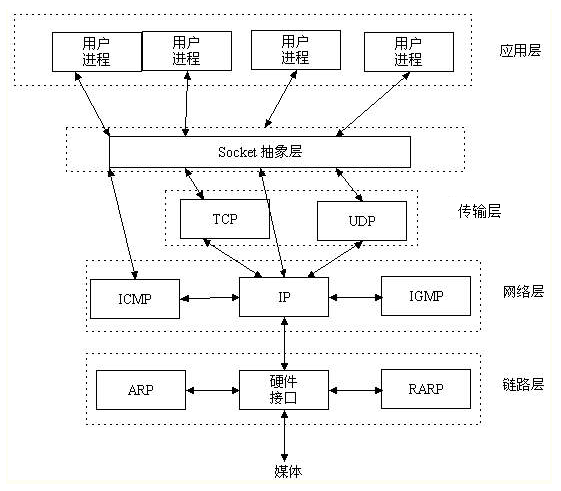
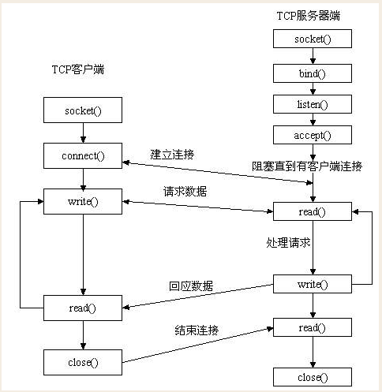
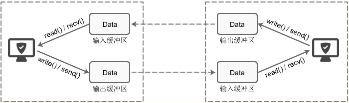
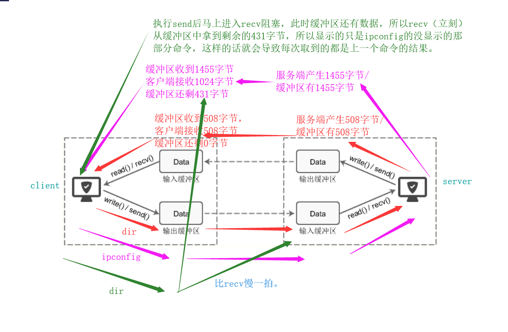
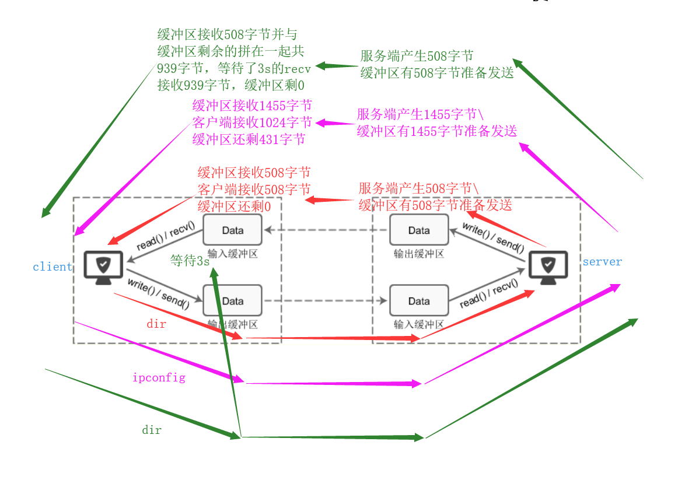
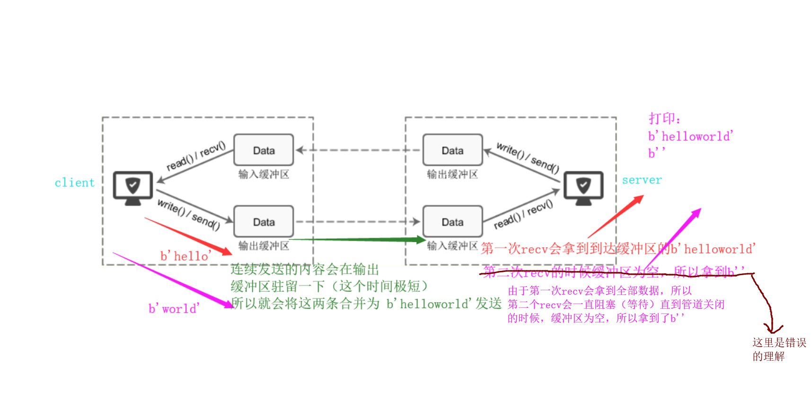
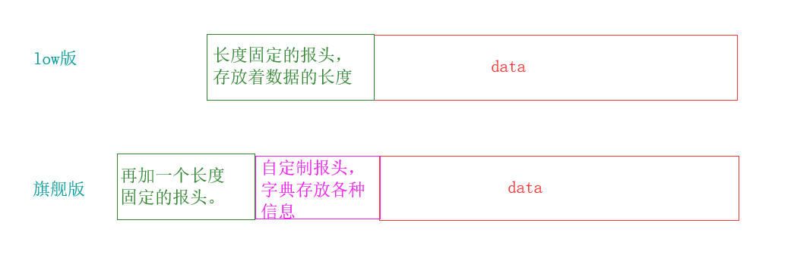

本文介绍socket的基础知识、python中socket模块的使用方法，对于tcp通过自定制报头解决黏包问题。对于udp做一个简单的例子。 

<!-- more -->


## socket基础

### 铺垫

传输层向高层用户**屏蔽**了下面网络核心的细节（如网络拓扑、所采用的路由选择协议等），它使应用进程看见的就是好像在两个运输层实体之间有一条**端到端的逻辑通信信道。**

当传输层采用面向连接的 TCP 协议时，尽管下面的网络是不可靠的（只提供尽最大努力服务），但这种逻辑通信信道就相当于一条全双工的**可靠信道**。

当传输层采用无连接的 UDP 协议时，这种逻辑通信信道是一条**不可靠信道**。 


### 什么是socket

socket 套接字，它存在于传输层与应用层之间的抽象层，是对底层网络通信的一层抽象，让程序员可以像文件那样操作网络上发送和接收的数据。

1. 避免你学习各层的接口，以及协议的使用，socket已经封装好了所有的接口。直接使用这些接口或者方法即可，使用起来方便，提升开发效率。    
2. Python中socket就是一个模块，通过使用学习模块提供的方法，建立客户端与服务端的通信，建立客户端与服务端的通信，使用方便。



所以，从传输层包括传输层以下，都是操作系统帮助我们封装的各种header，你不用去关心。我们只需要掌握socket这个模块就行。


### 创建socket对象

创建socket的时候需要指定socket的类型，一般有三种：

1. SOCK_STREAM：面向连接的稳定通信，底层是 TCP 协议，参数默认是这个
2. SOCK_DGRAM：无连接的通信，底层是 UDP 协议，需要上层的协议来保证可靠性。
3. SOCK_RAW：更加灵活的数据控制，能让你指定 IP 头部

还需要指定套接字的家族，有两种

1. 基于文件类型的套接字家族：AF_UNIX
2. 基于网络类型的套接字家族：AF_INET，最为广泛，本文也将使用这个


## 基于TCP协议的socket通信

下图是基于TCP协议的socket通信流程



下面通过一个形象的例子来讲解，把上图的整个流程比作打电话。

版本一：

```python
# server.py
import socket

# phone = socket.socket(socket.AF_INET,socket.SOCK_STREAM)   # 基于网络的套接字AF_INET , 流式（tcp）
# 1. 创建socket对象（买手机）
phone = socket.socket()   # 可以默认不写

# 2. 绑定ip地址和端口（办卡）
phone.bind(('127.0.0.1',8848))   # 本地回环地址

# 3. 监听（开机状态）
phone.listen(5)  # 参数数字没什么用，半连接池

# 4.接受连接
print('start')
conn,addr = phone.accept()          # 等待。
print(conn,addr)
# 5.收发消息
from_client_data = conn.recv(1024)  # 最多接收1024个字节 ，过大会出现MemoryError
conn.send(from_client_data.upper())
# 6.关闭管道（挂断电话）
conn.close()   
# 7.关闭服务(关机)
phone.close() 
```

```python
# client.py
import socket

# 1. 创建socket对象（买手机）
phone = socket.socket()   				# 可以默认不写

# 2.连接服务器的ip和端口
phone.connect(('127.0.0.1',8848))
# 3.发送接收消息。
phone.send('hello'.encode('utf-8'))
from_server_data = phone.recv(1024)		# 等待
print(from_server_data)
# 4.关机
phone.close()
```


## 单个客户端与服务端循环通信

上面的版本的最基本的，他只能互发固定的一句话，接下来的版本二实现，两个人的循环通信

版本二：

```python
# server.py
import socket
so = socket.socket()
server = ('127.0.0.1',8848)
so.bind(server)

so.listen()

print('start')
conn,addr = so.accept()
# 两个人的循环通信，所以我们就需要循环了
while 1 :
    try:
        from_client_data = conn.recv(1024).decode('utf-8')
        # 增加判断，可以在客户端停止的时候，被动关闭服务器。
        if from_client_data == 'byebye':
            print(from_client_data)
            break
        print(f"来自客户端{addr} 消息：{from_client_data}")
        to_client = input('>>>')
        conn.send(to_client.encode('utf-8'))
    except (ConnectionResetError):
        break
conn.close()
so.close()
```

```python
# client.py
import socket

so = socket.socket()
server = ('127.0.0.1',8848)
so.connect(server)

while True:
    to_server = input('>>>')
    # 为了能够停止对话，增加一步判断，如果输入Q退出，则发送一句b'byebye'并且终止客户端。
    if to_server.upper() == 'Q':
        so.send(b'byebye')
        break
    so.send(to_server.encode('utf-8'))
    from_server_data = so.recv(1024).decode('utf-8')
    print(f"来自服务端{server}消息：{from_server_data}")
so.close()
```


## 通信，连接循环

上面这个版本实现了单用户与服务器的循环通信，接下来要实现多用户与服务器的循环通信，其实只是在版本二的基础上增加一层循环。

版本三：

```python
# server.py
import socket
so = socket.socket()
server = ('127.0.0.1',8848)
so.bind(server)

so.listen()
# 在这里加一层循环，达到和多用户聊天的效果，不过，只能是与一个用户结束聊天后才能和下一个用户开始聊天。
while 1:
    print()
    print('start')
    conn,addr = so.accept()
    while 1 :
        try:
            from_client_data = conn.recv(1024).decode('utf-8')
            if from_client_data == 'byebye':
                break
            print(f"来自{addr} 消息： {from_client_data}")
            to_client = input('>>>')
            conn.send(to_client.encode('utf-8'))
        except (ConnectionResetError):
            break
    print(f'结束与{addr}的通话')
    conn.close()

so.close()
```

```python
# client.py
import socket

so = socket.socket()
server = ('127.0.0.1',8848)
so.connect(server)

while True:
    to_server = input('>>>')
    if to_server.upper() == 'Q':
        so.send(b'byebye')
        break
    so.send(to_server.encode('utf-8'))
    from_server = so.recv(1024).decode('utf-8')
    print(f"来自{server} 消息： {from_server}")
so.close()
```


## 利用socket完成获取远端命令

### 铺垫

既然想执行远端命令，那我们就需要学习新的模块来实现这个功能，这个模块就是subprocess模块，下面这个例子是完成dir目录查询。

```python
import subprocess

obj = subprocess.Popen(
    'dir',
    shell=True,
    stdout=subprocess.PIPE,
    stderr=subprocess.PIPE,
)
print(obj.stdout.read().decode('gbk'))  # 正确目录
print(obj.stderr.read().decode('gbk'))  # 错误命令
```

在版本三的基础上，我们先将上面这个简单的例子做成一个函数

```python
import subprocess
def sub(command):
    obj = subprocess.Popen(
        command,
        shell=True,
        stdout=subprocess.PIPE,
        stderr=subprocess.PIPE,
    )
    return obj.stdout.read() + obj.stderr.read()
# print(sub('dir').decode('gbk'))  # 测试函数
```

然后放入版本三中：

```python
# server.py
import subprocess
def sub(command):
    obj = subprocess.Popen(
        command,
        shell=True,
        stdout=subprocess.PIPE,
        stderr=subprocess.PIPE,
    )
    return obj.stdout.read() + obj.stderr.read()
# print(sub('dir').decode('gbk'))  # 测试函数

import socket
so = socket.socket()
server = ('127.0.0.1',8848)
so.bind(server)

so.listen()
# 在这里加一层循环，达到和多用户聊天的效果，不过，只能是与一个用户结束聊天后才能和下一个用户开始聊天。
while 1:
    print()
    print('start')
    conn,addr = so.accept()
    while 1 :
        try:
            from_client_data = conn.recv(1024).decode('utf-8')
            if from_client_data == 'byebye':
                break
            to_client = sub(from_client_data)
            conn.send(to_client)
        except (ConnectionResetError):
            break
    print(f'结束与{addr}的通话')
    conn.close()

so.close()
```

```python
# client.py
import socket

so = socket.socket()
server = ('127.0.0.1',8848)
so.connect(server)

while True:
    to_server = input('>>>')
    if to_server.upper() == 'Q':
        so.send(b'byebye')
        break
    so.send(to_server.encode('utf-8'))
    from_server = so.recv(1024).decode('gbk')
    print(f"来自{server} 消息：\n {from_server}")
so.close()
```

但是我们在实际测试中发现，打印的结果并不完整，产生了**黏包现象**！

### 小结

tcp创建服务端的四大步骤：

sbla         （socket，bind，listen，accept）


## 黏包现象




### 黏包现象

现象一：	recv端产生的黏包现象

- 第一次 dir                   数据  <  1024

  - 服务端产生 508字节           客户端接收508字节

- 第二次 ipconfig           数据  > 1024

  - 服务端产生1455字节          客户端接收1024字节

- 第三次 dir 		          数据  <  1024

  - 服务端产生508字节            客户端接收431字节

  send把数据发送输出缓冲区后，recv进入阻塞状态，recv等待抓取输入缓冲区的数据。

  粘包现象的根本原因：缓冲区

  

---------------------------------加入sleep进行验证---------------------------------

- 第一次 dir                   数据  <  1024

  - 服务端产生 508字节           客户端接收508字节

- 第二次 ipconfig           数据  > 1024

  - 服务端产生1455字节          客户端接收1024字节

- 第三次 dir 		          数据  <  1024

  - sleep(3)   第二次间隔3秒钟接收数据， 发现此数据和之前没有取完的数据黏在一起。
  - TCP协议的流式协议，数据与水流一样源源不断，粘包现象
  - 服务端产生508字节            客户端接收431字节 + 508字节
  - 原因：recv之前，缓冲区已经得到了dir的数据

  

现象二：send端可能产生的粘包现象（连续send少量数据发到输出缓冲区，可能在缓冲区不断积压，多次写入的数据一次性发到网络，这取决于当前的网络状态）




### 系统缓冲区

缓冲区一般是8k左右

#### 缓冲区的作用？

没有缓冲区：如果你的网络出现短暂的异常或者波动，你接收数据就会出现短暂的中断，影响你的下载或上传的效率。

就像cpu的缓冲区一样，cpu的效率是特别高的，没有缓冲区，cpu的等待时间就会长了，这样效率就会大大降低。 设计缓冲区也是希望减少recv的等待。

生活上的理解就是输液器的那个小葫芦/蓄水池。

但是缓冲区虽然解决了效率问题，但也带来了粘包问题。


### 什么是黏包

1. 发送端为了将多个发往接收端的包，更有效的发到对方，使用了优化方法（Nagle算法），将多次间隔较小、数据量小的数据包，合并成一个大的数据包发送(把发送端的缓冲区填满一次性发送)。
2. 接收端底层会把tcp段整理排序交给缓冲区，这样接收端应用程序从缓冲区取数据就只能得到整体数据而不知道怎么拆分（tcp协议是流式协议，多条消息之间没有边界）


### 解决黏包的方案


#### 错误示例：

1. 扩大接收recv的上限 recv(10000000)，这么多的数据会放在内存。不是解决这个问题的根本原因。
2. 故意延长recv的执行时间。 sleep........... 效率......


#### 如何解决：


##### recv的工作原理

When no data is available, block untilat least one byte is available or until the remote end is closed.
当缓冲区没有数据可取时，recv会一直处于阻塞状态，直到缓冲区至少有一个字节数据可取，或者远程端关闭。
When the remote end is closed and all data is read, return the empty string.
关闭远程端并读取所有数据后，返回空字符串。

下面进行验证

```python
# server.py
import socket

phone = socket.socket()
phone.bind(('127.0.0.1',8848))
phone.listen()
conn,addr = phone.accept()
# 连续接收3次
ret1 = conn.recv(1024)
# 这一次显示后，等待了50s后，显示后面两个空字节
print(ret1)
ret2 = conn.recv(1024)
ret3 = conn.recv(1024)
print(ret2)
print(ret3)
conn.close()
phone.close()
```

```python
# client.py
import time
import socket
phone = socket.socket()
server = ('127.0.0.1',8848)
phone.connect(server)
# 两次发送一个比较短的数据
phone.send(b'hello')
time.sleep(50)
phone.close()
```


##### 核心思路

send可以一次，recv可以多次

目标：发多少，收多少字节

1. 当我第二次给服务器发送命令之前，我应该循环recv直至所有的数据全部取完。

   result 3000bytes         recv 3次

   result 5000bytes		 recv 5次

   result 30000bytes	   recv    ？   ----> 循环次数相关

2. 如何限制循环次数？

   当你发送的总bytes个数与接收的总bytes个数相等时，循环结束。

3. 如何获取发送的总bytes个数：服务端： len() --->  3400个字节  int

   ​	总数据  result = b'sdfjsoidfjoidsjjio'

   ​	所以：	

   ​	服务端要完成:

   ​		send（总个数)

   ​		send（总数据）

4. 总个数是什么类型? int()      send 需要发送bytes类型

   ​	将 int 转化成bytes 即可。 

   ​	方案一：

   ​	str(3400)  --->  bytes('3400')  --->  b'3400'   ---> 4个字节

   ​	难点：但是由于总个数不同，头部的字节数是不断变化的

   ​	我们需要解决的问题是：无论总字节个数是多少，我们头部是固定的。

   ​	需要将不固定长度的 int 转化成一个固定长度的 bytes类型，方便获取头部信息。

   ​	struct模块（将一个类型转换成固定长度的bytes，转换后还可以翻转回来）

   ​	

   

##### low版

```python
# server.py
import struct
import subprocess
def sub(command):
    obj = subprocess.Popen(
        command,
        shell=True,
        stdout=subprocess.PIPE,
        stderr=subprocess.PIPE,
    )
    return obj.stdout.read() + obj.stderr.read()
# print(sub('dir').decode('gbk'))  # 测试函数

import socket
so = socket.socket()
server = ('127.0.0.1',8848)
so.bind(server)

so.listen()

conn,addr = so.accept()
while 1 :
    try:
        from_client_data = conn.recv(1024).decode('utf-8')
        if from_client_data == 'byebye':
            break
        to_client = sub(from_client_data)
        print()
        print(f"服务端发送的总字节数: {len(to_client)}")          # gbk形式的
        # 1.制作报头
        total_size = len(to_client)
        # 2.将不固定长度的int转换成固定长度的bytes类型   int  4字节
        total_size_bytes = struct.pack('i',total_size)
        # 3. 发送报头
        conn.send(total_size_bytes)
        # 4. 发送原数据
        conn.send(to_client)
    except (ConnectionResetError):
        break
print(f'结束与{addr}的通话')
conn.close()
so.close()
```

```python
# client.py
import socket
import struct
so = socket.socket()
server = ('127.0.0.1',8848)
so.connect(server)

while True:
    to_server = input('>>>')
    if to_server.upper() == 'Q':
        so.send(b'byebye')
        break
    so.send(to_server.encode('utf-8'))
    # 1.接受报头
    head_bytes = so.recv(4)
    # 2.将报头反转回int类型
    total_size = struct.unpack('i',head_bytes)[0]
    # 3.循环接收元数据
    total_data = b''
    while len(total_data) < total_size:
        total_data += so.recv(1024)
    print(total_data.decode('gbk'))

so.close()
```

问题1：较大的数据，直接用struct会报错

```python
import struct
ret = struct.pack('i',100000000000)
ret2 = struct.pack('q',1000000000000000000000000)
# struct.error: argument out of range
```

问题2：报头信息不可能只包含数据总大小，md5，文件名，文件路径。


##### 旗舰版

根据发生的问题**自定制报头**（总大小，文件名，md5）

我们是在报头的基础上加上一层报头

效果如下


```python
# server.py
import json
import struct
import subprocess
def sub(command):
    obj = subprocess.Popen(
        command,
        shell=True,
        stdout=subprocess.PIPE,
        stderr=subprocess.PIPE,
    )
    return obj.stdout.read() + obj.stderr.read()
# print(sub('dir').decode('gbk'))  # 测试函数

import socket
so = socket.socket()
server = ('127.0.0.1',8848)
so.bind(server)
so.listen()
conn,addr = so.accept()
while 1 :
    try:
        from_client_data = conn.recv(1024).decode('utf-8')
        if from_client_data == 'byebye':
            break
        to_client = sub(from_client_data).decode('gbk').encode('utf-8')
        print()
        print(f"服务端发送的总字节数: {len(to_client)}")          # gbk形式的
        # 1.制作报头
        head_dict = {
            'MD5': 'sdofijoisjdfo',
            'file_name':'婚前视频',
            'file_size':len(to_client),
        }

        # 2.将报头字典序列化转化成json字符串
        head_dict_json = json.dumps(head_dict)
        # 3. 将json字符串转化成bytes
        head_dict_json_bytes = head_dict_json.encode('utf-8')
            # 但是，目前这个报头不固定,使用len方法得到报头的长度
            # 再次使用报头的长度用struct模块包装。
        # 4.获取报头的长度
        haed_len = len(head_dict_json_bytes)
        # 5.将长度转化成固定的4个字节
        head_len_bytes = struct.pack('i',haed_len)
        # 6. 发送固定的4字节
        conn.send(head_len_bytes)
        # 7. 发送报头
        conn.send(head_dict_json_bytes)
        # 8. 发送原数据
        conn.send(to_client)
    except (ConnectionResetError):
        break
print(f'结束与{addr}的通话')
conn.close()
so.close()
```

```python
# client.py
import socket
import struct
import json
so = socket.socket()
server = ('127.0.0.1',8848)
so.connect(server)

while True:
    to_server = input('>>>')
    if to_server.upper() == 'Q':
        so.send(b'byebye')
        break
    so.send(to_server.encode('utf-8'))
    # 1.接受报头长度
    head_len_bytes = so.recv(4)
    # 2.将报头长度反转回int类型
    head_len_size = struct.unpack('i',head_len_bytes)[0]
    # 3.接收报头
    head_bytes = so.recv(head_len_size)
    head = json.loads(head_bytes.decode('utf-8'))
    total_size = head['file_size']
    # 4.循环接收元数据
    total_data = b''
    while len(total_data) < total_size:
        total_data += so.recv(1024)
    print(total_data.decode('utf-8'))

so.close()
```


## UDP

前面都是基于UDP协议，接下来探讨udp。

当传输层采用无连接的 UDP 协议时，这种逻辑通信信道是一条不可靠信道。 （安全可靠体现在数据能否安全到达。）。面向数据报（无连接）的协议，效率高，速度快。


```python
# server.py
import socket
udp_server = socket.socket(socket.AF_INET,socket.SOCK_DGRAM)
server = ('127.0.0.1',9000)
udp_server.bind(server)

while 1:
    # 谁先给我发，就给谁先回。
    from_client_data,client = udp_server.recvfrom(1024)
    print(from_client_data.decode('utf-8'))
    to_client_data = input(">>>").strip()
    udp_server.sendto(to_client_data.encode('utf-8'),client)
```

```python
# client.py
import socket
udp_client = socket.socket(socket.AF_INET,socket.SOCK_DGRAM)
server = ('127.0.0.1',9000)
while 1:
    to_server_data = input('>>>').strip()
    udp_client.sendto(to_server_data.encode('utf-8'),server)
    from_server_data,server = udp_client.recvfrom(1024)
    print(from_server_data.decode('utf-8'))
```


## socketserver

前面我们使用的socket方式是单线程的，接下来使用socketserver开启一个多线程。

### 模板

```python
# server.py
import socketserver

class Myserver(socketserver.BaseRequestHandler): # 继承的类是固定的

    def handle(self):      # 必须定义这个同名方法
        '''只有这里是自己写的，其它都是固定写法'''
        while 1:
            from_client_data = self.request.recv(1024).decode('utf-8')  # 相当于conn
            print(from_client_data)
            to_client_data = input('>>>').strip()
            self.request.send(to_client_data.encode('utf-8'))


if __name__ == '__main__':
    ip_port = ('127.0.0.1',8848)
    server = socketserver.ThreadingTCPServer(ip_port,Myserver)
    server.serve_forever()
```

```python
# client.py
import socket
client = socket.socket()

client.connect(('127.0.0.1',8848))

while 1:
    to_server = input('>>>').strip()
    client.send(f'小黑：{to_server}'.encode('utf-8'))
    # 接收信息
    from_server_data = client.recv(1024)
    print(f"来自服务器的消息：{from_server_data.decode('utf-8')}")
```


### 刨析

对于一个新出现的模块，要学习它需要有一个入口，实例化对象是一个不错的选择：

```python
# 1.从实例化对象入手
server = socketserver.ThreadingTCPServer(ip_port,Myserver)
```

```python
# 2.了解它的继承关系
print(socketserver.ThreadingTCPServer.mro())
# [<class 'socketserver.ThreadingTCPServer'>, <class 'socketserver.ThreadingMixIn'>, <class 'socketserver.TCPServer'>, <class 'socketserver.BaseServer'>, <class 'object'>]
```

```python
# 3.查看它的__init__方法
# 在TCPServer中写了__init__
class TCPServer(BaseServer):
    '''省略一部分常量'''
    def __init__(self, server_address, RequestHandlerClass, bind_and_activate=True):
        """Constructor.  May be extended, do not override."""
        BaseServer.__init__(self, server_address, RequestHandlerClass)
        self.socket = socket.socket(self.address_family,
                                    self.socket_type)
        if bind_and_activate:
            try:
                self.server_bind()
                self.server_activate()
            except:
                self.server_close()
                raise
# 结论：它还调用了BaseServer.__init__()在点击查看。
```

```python
# 4.在BaseServer查看__init__方法
class BaseServer:
        def __init__(self, server_address, RequestHandlerClass):
        """Constructor.  May be extended, do not override."""
        self.server_address = server_address
        self.RequestHandlerClass = RequestHandlerClass
        self.__is_shut_down = threading.Event()
        self.__shutdown_request = False
# 结论：看到这里我们明白了，我们实例化时的参数是以属性的形式被封装。
```

```python
# 5.继续查看TCPServer中的__init__方法
class TCPServer(BaseServer):
    '''省略一部分常量'''
    def __init__(self, server_address, RequestHandlerClass, bind_and_activate=True):
        """Constructor.  May be extended, do not override."""
        BaseServer.__init__(self, server_address, RequestHandlerClass)        
#-------------------------------------------------------------        
        self.socket = socket.socket(self.address_family,
                                    self.socket_type)
        if bind_and_activate:
            try:
                self.server_bind()
                self.server_activate()
            except:
                self.server_close()
                raise
#-------------------------------------------------------------
# 结论:继续读后面的内容，我们发现，原来底层依旧是使用socket模块来创建socket对象
```

```python
# 6. 接下来对于 self.server_bind() 找到它的定义
    def server_bind(self):
        """Called by constructor to bind the socket.
        May be overridden.
        """
        if self.allow_reuse_address:
            self.socket.setsockopt(socket.SOL_SOCKET, socket.SO_REUSEADDR, 1)
        self.socket.bind(self.server_address)
        self.server_address = self.socket.getsockname()
# 前面的常量中allow_reuse_address默认是False
# 结论：我们bind方法也是由socket模块实现的，绑定端口，给对象封装地址
```

```python
# 7. 接下来就到了self.server_activate() 找到它的定义
    def server_activate(self):
        """Called by constructor to activate the server.
        May be overridden.
        """
        self.socket.listen(self.request_queue_size)
# 结论：只有一句话，就是用socket模块下的listen方法开始监听。
```

到了这里我们就已经对这个实例化对象有了个大概的了解，它使用了进程方面的模块，也使用了socket模块。

然后查看代码中server.py的 server.serve_forever()，我们想知道到这个方法做了哪些事儿。

```python
class BaseServer: 
    '''上面的内容省略'''
    def serve_forever(self, poll_interval=0.5):
        """Handle one request at a time until shutdown.
        Polls for shutdown every poll_interval seconds. Ignores
        self.timeout. If you need to do periodic tasks, do them in
        another thread.
        """
        self.__is_shut_down.clear()
        try:
            # XXX: Consider using another file descriptor or connecting to the
            # socket to wake this up instead of polling. Polling reduces our
            # responsiveness to a shutdown request and wastes cpu at all other
            # times.
            with _ServerSelector() as selector:
                selector.register(self, selectors.EVENT_READ)

                while not self.__shutdown_request:
                    ready = selector.select(poll_interval)
                    if ready:
                        self._handle_request_noblock()

                    self.service_actions()
        finally:
            self.__shutdown_request = False
            self.__is_shut_down.set()
# emmm这一块代码还看不太懂，未完待续！！！
```


----

