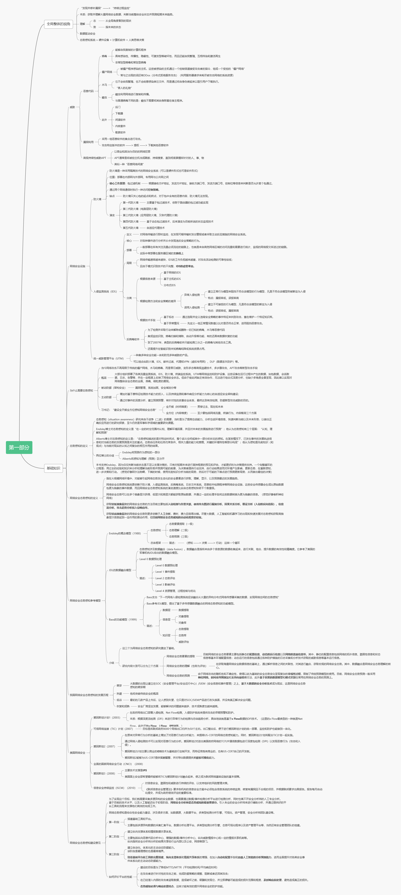

 网络安全的哲学已经由“努力防住”转变为“防范终将失效”，从“发现并修补漏洞”转变为“持续过程监控”。网络安全态势感知就是这种思路的具体体现，通过获取海量数据与事件，直观、动态、全面、细粒度地提取各类网络攻击行为，并对其进行理解、分析、预测以及可视化，从而实现态势感知。本篇以思维导图的形式进行总结。 

<!--more-->

## 第一部分：基础知识

## 第二部分：态势提取

## 第三部分：态势理解

## 第四部分：态势预测

