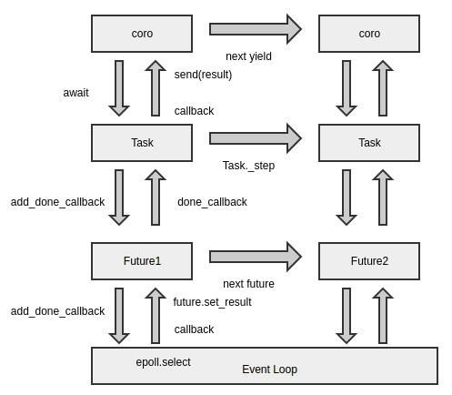
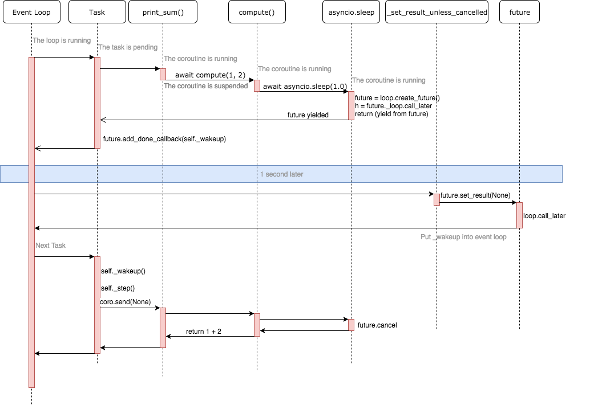

本篇介绍基于asyncio模块，实现单线程-多任务的异步协程。 

<!--more-->


# 基本概念

>  	协程是实现并发编程的一种方式。一说并发，你肯定想到了多线程 / 多进程模型，没错，多线程 / 多进程，正是解决并发问题的经典模型之一。最初的互联网世界，多线程 / 多进程在服务器并发中，起到举足轻重的作用。
>
> ​	随着互联网的快速发展，你逐渐遇到了 **C10K 瓶颈**，也就是同时连接到服务器的客户达到了一万个。于是很多代码跑崩了，进程上下文切换占用了大量的资源，线程也顶不住如此巨大的压力，这时， NGINX 带着**事件循环**出来拯救世界了。
>
> ​	如果将多进程 / 多线程类比为起源于唐朝的藩镇割据，那么事件循环，就是宋朝加强的中央集权制。**事件循环启动一个统一的调度器，让调度器来决定一个时刻去运行哪个任务，于是省却了多线程中启动线程、管理线程、同步锁等各种开销。**同一时期的 NGINX，在高并发下能保持低资源低消耗高性能，相比 Apache 也支持更多的并发连接。
>
> ​	再到后来，出现了一个很有名的名词，叫做回调地狱（callback hell），手撸过 JavaScript 的朋友肯定知道我在说什么。我们大家惊喜地发现，这种工具完美地继承了事件循环的优越性，同时还能提供 async / await 语法糖，解决了执行性和可读性共存的难题。于是，协程逐渐被更多人发现并看好，也有越来越多的人尝试用 Node.js 做起了后端开发。（讲个笑话，JavaScript 是一门编程语言。）
>
> 引用自《Python核心技术与实战》


## 协程函数

- *协程函数*: 定义形式为 [`async def`](https://docs.python.org/zh-cn/3/reference/compound_stmts.html#async-def) 的函数;

### aysnc

- 在`Python`3.5+版本新增了`aysnc`和`await`关键字，这两个语法糖让我们非常方便地定义和使用协程。

- 如果一个函数的定义被`async`修饰后，则该函数就是一个**特殊的函数（协程函数）**。

```python
# 使用 async 关键字修饰函数后，调用该函数，但不会执行函数，而是返回一个coroutine协程对象
async def get_request(url):
    print("正在请求: ", url)
    sleep(1)
    print('请求结束:', url)
    
get_request('www.b.com')	
```

运行分析：

- 直接调用这个函数的话并不会被执行，也会出现一条警告 `RuntimeWarning: coroutine 'get_request' was never awaited` 。

- 对于它的解释 [官方文档](https://docs.python.org/zh-cn/3/library/asyncio-dev.html) 里提到，当协程程序被调用而不是被等待时（即执行 `get_request('www.b.com')` 而不是  `await get_request('www.b.com')` ）或者协程没有通过 [`asyncio.create_task()`](https://docs.python.org/zh-cn/3/library/asyncio-task.html#asyncio.create_task) 被排入计划日程（**创建任务对象**），asyncio 将会发出一条 [`RuntimeWarning`](https://docs.python.org/zh-cn/3/library/exceptions.html#RuntimeWarning)。

- 当然 asyncio.create_task( get_request)  是py3.7中的，在之前的版本中是用到的 asyncio.ensure_future( get_request )


### await

- 在协程中如果要调用另一个协程就使用`await`，它可以**挂起阻塞**的异步调用接口。
  - **要注意await关键字要在async定义的函数中使用，而反过来async函数可以不出现await**
- 如果一个对象可以在 [`await`](https://docs.python.org/zh-cn/3/reference/expressions.html#await) 语句中使用，那么它就是 **可等待** 对象。许多 asyncio API 都被设计为接受可等待对象。
- <span style="color:red">可等待</span> 对象有三种主要类型: **协程**, **任务** 和 **Future**.
  - 如果直接使用 `await 协程函数` 、是不会有异步效果的，相当于用异步接口写了个同步代码。需要将协程对象转化成任务才可以异步运行。
  - 通过 `ensure_future` 或 `create_task` 函数打包协程对象即可得到**任务**。
  - [`Future`](https://docs.python.org/zh-cn/3/library/asyncio-future.html#asyncio.Future) 是一种特殊的 **低层级** 可等待对象，表示一个异步操作的 **最终结果**。
    - 不用回调方法编写异步代码后，为了获取异步调用的结果，引入一个 Future 未来对象。Future 封装了与 loop 的交互行为，add_done_callback 方法向 epoll 注册回调函数，当 result 属性得到返回值后，会运行之前注册的回调函数，向上传递给 coroutine。
    - 通常情况下 **没有必要** 在应用层级的代码中创建 Future 对象

```python
import asyncio

async def producer():
    for i in range(1, 6):
        print(f'生产：{i}')
        await consumer(i)

async def consumer(i):
    print(f'消费：{i}')

asyncio.run(producer())
# asyncio.run() 是py3.7更新出来的，在py3.7中，使用这个可以简单直接的运行 asyncio 程序。
```

- [`asyncio.run()`](https://docs.python.org/zh-cn/3/library/asyncio-task.html#asyncio.run) 函数用来运行最高层级的入口点 "main()" 函数，更多解释详见 [官方文档](https://docs.python.org/zh-cn/3/library/asyncio-task.html#asyncio.create_task)

- 此函数总是会创建一个新的事件循环并在结束时关闭之。它应当被用作 asyncio 程序的主入口点，理想情况下应当只被调用一次。


## 协程对象

- *协程对象*：调用 *协程函数* 所返回的对象。
  - 特殊函数被调用后，函数内部的实现语句不会被立即执行，然后该函数调用会返回一个协程对象。

- 结论：协程对象 == 特殊的函数调用

```python
async def get_request(url):
    print("正在请求: ", url)
    sleep(1) # 这里是个小坑
    print('请求结束:', url)

# 函数调用：返回的就是一个协程对象
c = get_request('www.b.com')
print(c)	
	# <coroutine object get_request at 0x000002A6DFA026D0>

# 创建3个协程对象
urls = [
    '1.com', '2.com', '3.com'
]
coroutine_list = []
for url in urls:
    c = get_request(url)
    coroutine_list.append(c)
print(coroutine_list)
	# [<coroutine object get_request at 0x0000022FE5313F10>, <coroutine object get_request at 0x0000022FE52426D0>, <coroutine object get_request at 0x0000022FE5313EB8>]
```


## 任务对象

- **任务对象其实就是对协程对象的进一步封装**。
- *任务* 被用来设置日程以便 *并发* 执行协程。

结论：任务对象 == 高级的协程对象 == 特殊的函数调用

特性：可以绑定回调（爬虫中回调函数常用来做数据解析）


```python
import asyncio
from time import sleep

# 协程函数的定义
async def get_request(url):
    print("正在请求: ", url)
    sleep(1)	# 这里是个小坑
    print('请求结束:', url)


# 函数调用：返回的就是一个协程对象
c = get_request('www.b.com')

# 创建一个任务对象：基于协程对象创建的
task = asyncio.ensure_future(c)			# ensure_future 是py3.7之前的

# 创建3个任务对象
urls = [
    '1.com', '2.com', '3.com'
]
task_list = []  # 存放多个任务对象的列表
for url in urls:
    c = get_request(url)
    task = asyncio.ensure_future(c)
    task_list.append(task)
```


### 绑定回调

回调函数什么时候被执行？

- 任务对象执行结束后执行

`task.add_done_callback(func)`

- func必须要有一个参数，该参数表示的是该回调函数对应的任务对象
- `回调函数的参数.result()` ： 任务对象对应的特殊函数执行结束的返回值。


## 事件循环对象

- 作用：将其内部注册的任务对象进行异步执行。
- **事件循环是异步编程的底层基石**。
- 在py3.6中我们需要手动创建事件循环对象。
- 在py3.7中，有了高层级的 asyncio 函数，例如 asyncio.run()，就很少有必要使用 **低层级函数** 来手动创建和关闭事件循环。

```python
import asyncio
import time


# 函数的定义
# 使用 async 关键字修饰函数后，调用该函数，但不会执行函数，而是返回一个coroutine协程对象
async def get_request(url):
    print("正在请求: ", url)
    # asyncio.sleep(1)    # 阻塞1s没有成功
    await asyncio.sleep(1)  # 加上await关键字即可，这里的 await 表示等待
    print('请求结束:', url)


# 创建3个协程对象
urls = [
    '1.com', '2.com', '3.com'
]
start = time.time()


# py3.6
# 创建任务列表：存储多个任务对象
tasks = [asyncio.ensure_future(get_request(url)) for url in urls]

# 获取当前事件循环，如果当前os线程没有设置并且 set_event_loop() 还没有被调用，asyncio创建一个新的事件循环
loop = asyncio.get_event_loop()
loop.run_until_complete(asyncio.wait(tasks))  # 直接列表会报错，需要修饰以下，这里的 wait 表示挂起

print('总耗时：', time.time() - start)

# py3.7

# 当然这样的写法仍是同步
# async def main():
#     for url in urls:
#         task = asyncio.create_task(get_request(url))
#         await task			# 当前也只有一个任务，所以仍是同步
#     print('总耗时：', time.time() - start)
#
# asyncio.run(main())


# 异步写法一
# async def main():
#     tasks = [asyncio.create_task(get_request(url)) for url in urls]
#     for task in tasks:
#         await task              # 这样当一个任务遇到阻塞就会切换到下一个任务，知道所有任务都结束为止
#     print('总耗时：', time.time() - start)
#
# asyncio.run(main())

# 异步写法二：推荐
# 为了省去遍历任务列表的过程增加了 gather 方法
# async def main():
#     tasks = [asyncio.create_task(get_request(url)) for url in urls]
#     await asyncio.gather(*tasks)
#     print('总耗时：', time.time() - start)
# 
# asyncio.run(main())

```

- 与py3.6相比，都是先做一个任务列表，然后py3.6需要手动创建事件循环对象`get_event_loop` 并使用 `run_until_complete` 来达到异步执行，而在py3.7中，gather会并发的执行传入的可等待对象并在run的调用下完成异步执行。所以在新版py3.7中，我们无需手动创建和关闭事件循环了。
- py3.7用 create_task 代替 ensure_future。


## 编码流程

- 定义协程函数
- 创建协程对象
- 封装任务对象
  - 绑定回调函数
- 创建事件循环对象

- 将任务对象注册到事件循环对象中，并且开启事件循环。


按照流程完整的py3.6代码如下：

```python
import asyncio
import time


# 定义协程函数
async def get_request(url):
    print("正在请求: ", url)
    # asyncio.sleep(1)    # 阻塞1s没有成功
    await asyncio.sleep(1)  # 加上await关键字即可，这里的 await 表示等待
    print('请求结束:', url)
    return '我去回调啦'


def parse(task):  # task 表示与回调函数绑定的任务对象 / 给回调函数传入任务对象
    print('i am task callback() !!!', task.result())


urls = [
    '1.com', '2.com', '3.com'
]
start = time.time()

# 任务列表：存储多个任务对象
tasks = []
for url in urls:
    # 创建协程对象
    c = get_request(url)
    # 封装任务对象
    task = asyncio.ensure_future(c)
    # 绑定回调
    task.add_done_callback(parse)
    tasks.append(task)
# 创建事件循环对象
loop = asyncio.get_event_loop()
# 将任务对象注册到事件循环对象中，并且开启事件循环
loop.run_until_complete(asyncio.wait(tasks))  # 直接列表会报错，需要修饰以下，这里的 wait 表示挂起

print('总耗时：', time.time() - start)
```

note：在特殊函数内部的实现语句中不可以出现不支持异步的模块对应的代码，否则就会终止多任务异步协程的异步效果。


在py3.7中，则为

- 定义协程函数
- 定义 asyncio 程序的主入口
  - 创建协程对象
  - 封装任务对象
  - 绑定回调函数

- `asyncio.run(main())`


按照流程完整的py3.7代码如下：

```python
import asyncio
import time


# 定义协程函数
async def get_request(url):
    print("正在请求: ", url)
    await asyncio.sleep(1)
    print('请求结束:', url)
    return '我去回调啦'


def parse(task):  # task 表示与回调函数绑定的任务对象 / 给回调函数传入任务对象
    print('i am task callback() !!!', task.result())


urls = [
    '1.com', '2.com', '3.com'
]
start = time.time()


# 定义 asyncio 程序的入口点
async def main():
    tasks = []
    for url in urls:
        # 创建协程对象
        c = get_request(url)
        # 封装任务对象
        task = asyncio.create_task(c)
        # 绑定回调函数
        task.add_done_callback(parse)
        tasks.append(task)
    await asyncio.gather(*tasks)
    print('总耗时：', time.time() - start)


asyncio.run(main())
```


## 异步的本质

- 按照注册顺序执行，遇到阻塞就会挂起，执行下一个任务。
- 当上一个任务的阻塞结束后，就会继续执行该任务。

- 真正的挂起是由 `asyncio.wait(tasks)` 做到的




图片来自: [谈谈Python协程技术的演进](https://zhuanlan.zhihu.com/p/30275154)




图片来自 [理解 Python asyncio](https://lotabout.me/2017/understand-python-asyncio/)


底层还没有理解，先把大佬的图粘过来慢慢研究😄


待补充！！！


# 总结

## 执行协程的三种机制

asyncio提供了三种执行协程的机制：

1. 使用`asyncio.run()`执行协程。一般用于执行最顶层的入口函数，如`main()`。

2. `await`一个协程。一般用于在一个协程中调用另一协程。

3. 用 `asyncio.create_task()` 或 `asyncio.ensure_futuer()` 方法将Coroutine（协程）封装为Task（任务）。一般用于实现异步并发操作。 需要注意的是，只有在当前线程存在事件循环的时候才能创建任务（Task）。

   

在下一篇中将结合 aiohttp 网络请求模块，加速爬取！！！