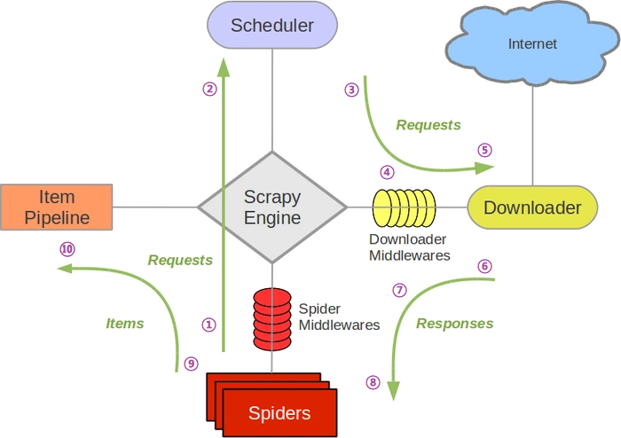

Scrapy是一个为了爬取网站数据，提取结构性数据而编写的应用框架。 可以应用在包括数据挖掘，信息处理或存储历史数据等一系列的程序中。 

<!--more-->


# scrapy 框架

- 高性能的网络请求
- 高性能的数据解析
- 高性能的持久化存储
- 深度爬取
- 全站爬取
- 分布式
- 中间件
- 请求传参


## 环境的安装

- mac/linux：pip install scrapy 
- windows：
  - pip install wheel
  - twisted(异步相关，scrapy 的异步由twisted实现)
  - 一定要在twisted安装成功的情况下执行后面的安装

环境测试： cmd中 输入scrapy 就安装成功


## 基本使用

1. 新建一个工程：

   - 终端下 `scrapy startproject  ProName`
     - 如果环境变量中没有，前面加 `python -m  scrapy startproject  ProName`

   - 目录结构

     - spiders（包）：空包

   - 修改配置文件（settings.py）

     - 不遵从robots
       - `ROBOTSTXT_OBEY = False`

     - UA伪装
       - `USER_AGENT = 'xxx'`

     - 日志等级的指定
       - `LOG_LEVEL = 'ERROR'`
       - `LOG_FILE = './file.txt'`
       - `scrapy crawl spiderName  --nolog`   不推荐

     - CONCURRENT_REQUESTS = 16  默认开启的线程数量
     - AUTOTHROTTLE_START_DELAY = 3  开始下载时限速并延迟时间
     - AUTOTHROTTLE_MAX_DELAY = 60  高并发请求时最大延迟时间

2. `cd ProName`： 进入到工程目录
3. 在spiders（爬虫文件夹）中创建一个爬虫文件
   - `scrapy genspider  spiderName  www.xxx.com`
     - url 随意，后面再改

4. 编写代码：主要代码会编写在爬虫文件中
   - 爬虫类：父类（spider），后面还有4中爬虫类
   - 爬虫文件的名称：当前爬虫源文件的唯一标识
   - 通常注释掉 allowed_domains , 因为有些资源是存在别的域名的
   - 起始的url列表：
     - 列表中存放的url都可以被scrapy进行异步的网络请求

5. 执行工程： `scrapy crawl spiderName`


## scrapy的数据解析

parse用作数据解析

- 参数：response 就是响应对象

- extract、extract_first() 作用


## scrapy的持久化存储

### 基于终端指令进行持久化存储

- 只可以将parse方法的返回值存储到本地的磁盘文件（指定形式后缀）中。
- `sracpy crawl spiderName -o filePath` 
- 局限性：
  1. 只能是parse的返回值
  2. 不能存到数据库中


### 基于管道进行持久化存储（推荐）

编码流程：
1. 在爬虫文件中进行数据解析
2. 在item类中定义相关的属性/字段
3. 将解析到的数据存储到一个item类型的对象中
   - Field类型视为一个万能的数据类型
4. 将item类型的对象提交给管道
   - 采用这样的规则是比手动存效率高的。
   - 管道负责持久化存储
   - yield item  将item提交给管道
5. 管道类的process_item方法负责接收item，接收到后可以对item实现任意形式的持久化存储操作。
   1. return item  会将item传递给下一个即将执行的管道类。
   2. 重写父类方法 open_spider 该方法只会被执行一次，并且在爬虫之前执行
   3. 重写父类方法 close_spider 该方法只会被执行一次，并且在爬虫结束执行
6. 在配置文件中开启管道。
   1. 300 表示的是优先级，数值越小优先级越高，可以定义多个管道类，这样优先级就会起作用。

note：一个管道类对应一种平台的持久化存储


## 例子：爬取抽屉网热榜

需求：爬取抽屉网热榜的作者和内容并做持久化存储

地址为：`https://dig.chouti.com/`


### ①修改spider

生成 spider 文件： `scrapy genspider first www.xxx.com`

补充数据解析的逻辑：

```python
# first.py
# -*- coding: utf-8 -*-
import scrapy
from choutiPro.items import ChoutiproItem

class FirstSpider(scrapy.Spider):
    name = 'first'
    # allowed_domains = ['www.xxx.com']		# 注释掉，因为有时候爬取的资源不一定在该域名下。
    start_urls = ['https://dig.chouti.com/']

    def parse(self, response):
        # 解析内容和发布平台
        div_list = response.xpath('//div[@class="link-info-con left"]')  # 支持class属性中有多个值（中间有空格）
        print(len(div_list))
        for div in div_list:
            # print(div)
            content = div.xpath('.//a[@class="link-title link-statistics"]/text()').extract_first()
            author = div.xpath('.//span[@class="left author-name"]/text()').extract_first()
            # 不同于etree，数据提取的时候不再是字符串，而是封装到了selector对象。  使用 .extract() 来提取 .extract_first()
            # xpath在取标签中存储在文本数据时必须使用 extract() , extract_first() 进行字符串的单独提取

            item = ChoutiproItem()
            item['author'] = author
            item['content'] = content

            # 将 item类型的对象提交给管道
            yield item
```

### ②定义Item

定义Item，来将数据从 spider 传入管道并进行处理。

```python
# items.py
import scrapy
class ChoutiproItem(scrapy.Item):

    author = scrapy.Field()
    content = scrapy.Field()
    pass
```


### ③定义pipeline

定义 pipeline 来做持久化存储。

```python
# pipelines.py
class ChoutiproPipeline(object):
    fp = None

    def open_spider(self, spider):
        self.fp = open('news.txt', 'w', encoding='utf-8')

    def process_item(self, item, spider):
        author = item['author']
        content = item['content']
        self.fp.write(author + '\n\t' + content + '\n')
        return item

    def close_spider(self, spider):
        self.fp.close()
```


# 请求传参（深度爬取）

深度爬取：

- 爬取的数据没有存在同一张页面中。


如何实现请求传参：

例如：`yield scrapy.Request(detail_url, callback=self.parse_detail, meta={'item': item})`

- `meta= {}` : 可以将meta字典传递给 callback
- 在 callback 接收 `item = response.meta['item']`


# scrapy的五大核心组件



- 引擎依据接接受到的数据流的类型调用相关事务！

## Scrapy运行流程

①：spider中的url被封装成请求对象交给引擎(每一个对应一个请求对象)

②：引擎拿到请求对象之后,将全部交给调度器

③：调度器过滤掉重复的请求对象（request）（重复的url），然后使用队列来存储非重复的请求对象，并将去重的消息队列回发给引擎


④：引擎将调度器调度出的请求对象交给下载器

⑤：下载器拿到该请求对象去互联网中下载数据

⑥：数据下载成功后会被封装到response中，随后response会被交给下载器

⑦：下载器将response交给引擎


⑧：引擎将response对象交给spiders（爬虫文件）

⑨：spiders拿到response后调用回调方法进行数据解析，解析成功后生成item,随后spiders将item交给引擎

⑩：引擎将解析好的item对象交给管道，管道拿到item后进行数据的持久化存储


## 引擎

所有组件的交互都要经过引擎，它控制着整个流程。

引擎定义了很多方法（parse，process_item），那它什么时候该执行这是如何做到的呢？

- 通过数据流来判断

作用：

- 接收所有事务流
- 对事务流进行判断来执行下一步


## spider

封装成请求对象


## 调度器

- 调度请求对象

过滤器

- 过滤掉重复的请求对象

队列

- 存储非重复的请求的对象


## 实体管道

- 做持久化存储


## 下载器

- 将下载好的数据封装成response对象
- 异步体现在下载器这里

scrapy的异步也体现在下载器的异步，是建立在twisted这个高效的异步模型上的(其实整个框架都在建立在这个模型上的)。


# scrapy的中间件

## 中间件有哪些？

### 下载中间件

引擎和下载器之间


### 爬虫中间件

引擎和spider之间


## 下载中间件的作用

- 批量拦截所有的请求和响应

## 为什么需要拦截请求?

- 篡改请求的头信息（headers）（UA）
  - 建一个UA池
  - request.headers['User-Agent'] =  'xxx'
- 代理
  - request.meta['proxy'] = 'http://ip:port'


## 为什么拦截响应？

- 篡改响应数据
- 篡改响应对象（推荐）


```python
# middlewares.py
from scrapy import signals
import random

user_agent_list = [
    "Mozilla/5.0 (Windows NT 6.1; WOW64) AppleWebKit/537.1 "
    "(KHTML, like Gecko) Chrome/22.0.1207.1 Safari/537.1",
    "Mozilla/5.0 (X11; CrOS i686 2268.111.0) AppleWebKit/536.11 "
    "(KHTML, like Gecko) Chrome/20.0.1132.57 Safari/536.11",
    "Mozilla/5.0 (Windows NT 6.1; WOW64) AppleWebKit/536.6 "
    "(KHTML, like Gecko) Chrome/20.0.1092.0 Safari/536.6",
    "Mozilla/5.0 (Windows NT 6.2) AppleWebKit/536.6 "
    "(KHTML, like Gecko) Chrome/20.0.1090.0 Safari/536.6",
    "Mozilla/5.0 (Windows NT 6.2; WOW64) AppleWebKit/537.1 "
    "(KHTML, like Gecko) Chrome/19.77.34.5 Safari/537.1",
    "Mozilla/5.0 (X11; Linux x86_64) AppleWebKit/536.5 "
    "(KHTML, like Gecko) Chrome/19.0.1084.9 Safari/536.5",
    "Mozilla/5.0 (Windows NT 6.0) AppleWebKit/536.5 "
    "(KHTML, like Gecko) Chrome/19.0.1084.36 Safari/536.5",
    "Mozilla/5.0 (Windows NT 6.1; WOW64) AppleWebKit/536.3 "
    "(KHTML, like Gecko) Chrome/19.0.1063.0 Safari/536.3",
    "Mozilla/5.0 (Windows NT 5.1) AppleWebKit/536.3 "
    "(KHTML, like Gecko) Chrome/19.0.1063.0 Safari/536.3",
    "Mozilla/5.0 (Macintosh; Intel Mac OS X 10_8_0) AppleWebKit/536.3 "
    "(KHTML, like Gecko) Chrome/19.0.1063.0 Safari/536.3",
    "Mozilla/5.0 (Windows NT 6.2) AppleWebKit/536.3 "
    "(KHTML, like Gecko) Chrome/19.0.1062.0 Safari/536.3",
    "Mozilla/5.0 (Windows NT 6.1; WOW64) AppleWebKit/536.3 "
    "(KHTML, like Gecko) Chrome/19.0.1062.0 Safari/536.3",
    "Mozilla/5.0 (Windows NT 6.2) AppleWebKit/536.3 "
    "(KHTML, like Gecko) Chrome/19.0.1061.1 Safari/536.3",
    "Mozilla/5.0 (Windows NT 6.1; WOW64) AppleWebKit/536.3 "
    "(KHTML, like Gecko) Chrome/19.0.1061.1 Safari/536.3",
    "Mozilla/5.0 (Windows NT 6.1) AppleWebKit/536.3 "
    "(KHTML, like Gecko) Chrome/19.0.1061.1 Safari/536.3",
    "Mozilla/5.0 (Windows NT 6.2) AppleWebKit/536.3 "
    "(KHTML, like Gecko) Chrome/19.0.1061.0 Safari/536.3",
    "Mozilla/5.0 (X11; Linux x86_64) AppleWebKit/535.24 "
    "(KHTML, like Gecko) Chrome/19.0.1055.1 Safari/535.24",
    "Mozilla/5.0 (Windows NT 6.2; WOW64) AppleWebKit/535.24 "
    "(KHTML, like Gecko) Chrome/19.0.1055.1 Safari/535.24"
]
PROXY_http = [
    'http://153.180.102.104:80',
    'http://195.208.131.189:56055',
]
PROXY_https = [
    'https://120.83.49.90:9000',
    'https://95.189.112.214:35508',
]


class MiddleproDownloaderMiddleware(object):

    # 拦截正常的请求
    def process_request(self, request, spider):
        print("i am process_request")
        # 拦截请求尽可能多的设定不同的UA
        request.headers['User-Agent'] = random.choice(user_agent_list)

        # 代理的应用
        # 两个代理池，一个是http代理池 一个是https代理池
        if request.url.split(':')[0] == 'http':
            request.meta['proxy'] = 'http://ip:port'
        else:
            request.meta['proxy'] = 'https://ip:port'
        return None

    # 拦截所有的响应
    def process_response(self, request, response, spider):
        print('i am process_response')
        return response

    # 拦截异常的请求
    def process_exception(self, request, exception, spider):
        print('i am process_exception')
        # 相关的修正操作，将修正后的请求对象重新发送

        return request  # 将异常的请求重新发送

```


# 爬取网易新闻

- **基于Scrapy框架中的Spider的递归爬取进行实现（Request模块递归回调parse方法）**

（国内、国际、军事、航空、无人机）  新闻数据的标题和内容

分析：

1. 每一个板块下对应的新闻数据都是动态加载出来的
2. 会对5个板块的响应数据进行数据解析，但是板块对应的响应对象中是不包含动态加载的新闻数据的，意味着目前获取的每一个板块对应的响应对象是不满足需求的响应对象！！！
3. 将不满足需求的5个响应对象篡改（工程中一共有1 + 5 + n），修改成满足需求的
   
   1. 找到指定的5个不满足需求的响应对象（中间件中完成）
   2. 使用selenium加载动态数据，获取标题和新闻详情的url
   
4. 持久化存储：

   - mysql

   - redis


完整代码如下：

- wangyi.py

```python
# wangyi.py
# -*- coding: utf-8 -*-
import scrapy
from selenium import webdriver
from wangyiPro.items import WangyiproItem


class WangyiSpider(scrapy.Spider):
    name = 'wangyi'
    # allowed_domains = ['www.1.com']
    start_urls = ['https://news.163.com/']

    model_urls = []  # 5个板块对应的url，使用spider对象可以拿到

    bro = webdriver.Chrome(r'C:\Users\ATLAS\爬虫学习\wangyiPro\wangyiPro\chromedriver.exe')

    # 解析出每一个板块对应的url
    def parse(self, response):
        li_list = response.xpath('//div[@class="bd"]/div[@class="ns_area list"]/ul/li')
        indexes = [3, 4, 6, 7, 8]
        for index in indexes:
            li_tag = li_list[index]
            # 解析到每一个板块对应的url
            model_url = li_tag.xpath('./a/@href').extract_first()
            self.model_urls.append(model_url)
            # 对板块的url进行请求发送获取每一个板块对应页码源码数据
            yield scrapy.Request(model_url, callback=self.parse_model_page)

    # 用来解析每一个板块对应新闻标题
    def parse_model_page(self, response):
        div_list = response.xpath('//div[@class="ndi_main"]/div')
        item = WangyiproItem()
        for div in div_list:
            detail_url = div.xpath('./a/@href').extract_first()
            title = div.xpath('./div//h3//text()').extract_first()
            if title and detail_url:
                item['title'] = title
                yield scrapy.Request(detail_url, callback=self.parse_detail, meta={'item': item})
                break

    def parse_detail(self, response):
        item = response.meta['item']
        content_list = response.xpath('//*[@id="endText"]/p/text()').extract()
        content = ''
        for i in content_list:
            if 'endText' and 'window.' and 'if' not in i:
                content += i
        content = ''.join(content).replace(' ', '')  # 去除空格
        content = ''.join(content).replace('\n', '')  # 去除多余的回车

        if content:
            item['content'] = content
            yield item

    # 该方法是在最后被执行一次，用来关闭浏览器
    def closed(self, spider):
        self.bro.close()

```

- items.py

```python
# items.py
import scrapy

class WangyiproItem(scrapy.Item):
    # define the fields for your item here like:
    title = scrapy.Field()
    content = scrapy.Field()
    keywords = scrapy.Field()
    types = scrapy.Field()

```

- middlewares.py

```python
# middlewares.py
# -*- coding: utf-8 -*-

from scrapy import signals
from scrapy.http import HtmlResponse
from time import sleep

class WangyiproDownloaderMiddleware(object):

    def process_request(self, request, spider):
        return None

    # 可以拦截到1 + 5 + n个响应对象
    def process_response(self, request, response, spider):
        # 根据5个板块的url定位到指定的request
        # request定位到指定的response
        model_urls = spider.model_urls
        if request.url in model_urls:
            # response，就是最后定位到的5大板块对应的响应对象
            # 如果该新的响应对象中对应的响应对象中包含了动态加载的数据
            # 使用selenium请求 request.url。浏览器对象只能实例化一次,在爬虫类中实例化
            bro = spider.bro
            bro.get(request.url)
            sleep(1)
            bro.execute_script('window.scrollTo(0,document.body.scrollHeight)')
            sleep(1)
            # bro.execute_script('window.scrollTo(0,document.body.scrollHeight)')
            # sleep(1)
            # bro.execute_script('window.scrollTo(0,document.body.scrollHeight)')
            page_text = bro.page_source
            new_response = HtmlResponse(url=request.url, body=page_text, encoding='utf-8', request=request)  # 参数'待补充'
            # print(page_text)
            return new_response
        else:
            return response

```

- pipelines.py

```python
# pipelines.py

# -*- coding: utf-8 -*-

import pymysql
from redis import Redis


def AI(title, content):
    from aip import AipNlp

    """ 你的 APPID AK SK """
    APP_ID = 'APP的id'
    API_KEY = 'APP的key'
    SECRET_KEY = '密钥'

    print(title)
    print(len(content))

    client = AipNlp(APP_ID, API_KEY, SECRET_KEY)
    types = []
    title_dict = client.topic(title, content).get('items')
    if title_dict:
        for title_list in title_dict.values():
            for title in title_list:
                types.append(title['tag'])
    types = ','.join(types)
    tag_list = []
    tag_dict = client.keyword(title, content).get('items')
    if tag_dict:
        for tag in tag_dict:
            tag_list.append(tag['tag'])
    keywords = ','.join(tag_list)
    return types, keywords


class WangyiMysql(object):
    conn = None
    cursor = None

    def open_spider(self, spider):
        self.conn = pymysql.Connection(host='127.0.0.1', user='root', password='2296', database='spider',
                                       charset='utf8')

    def process_item(self, item, spider):
        self.cursor = self.conn.cursor()
        title = item['title']
        content = item['content']
        types, keywords = AI(title, content)
        item['types'] = types
        item['keywords'] = keywords
        sql = f'insert into wangyi values ("{title}","{keywords}","{types}","{content}")'
        try:
            self.cursor.execute(sql)
            self.conn.commit()
        except Exception as e:
            print(e)
            self.conn.rollback()

        return item

    def close_spider(self, spider):
        self.cursor.close()
        self.conn.close()


class WangyiRedis(object):
    conn = None

    def open_spider(self, spider):
        self.conn = Redis(host='127.0.0.1', port='6379')
        print(self.conn)

    def process_item(self, item, spider):
        self.conn.lpush(item)
        return item
```

redis

- 启动server 启动cle
- 查看数据  keys *
- lpush key value
- lpush names 123

redis如果不可以写入字典：

- pip install - U redis == 2.10.6

