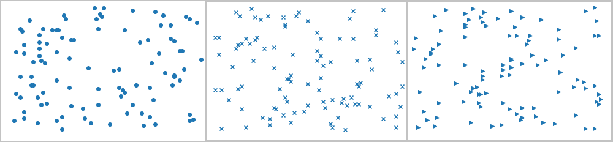
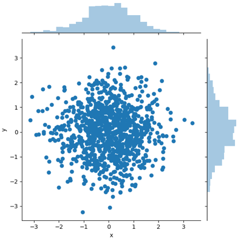
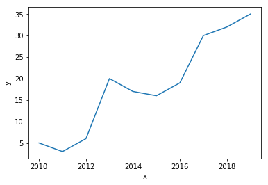
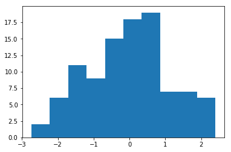
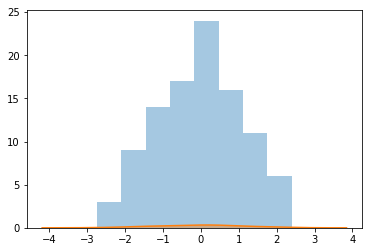
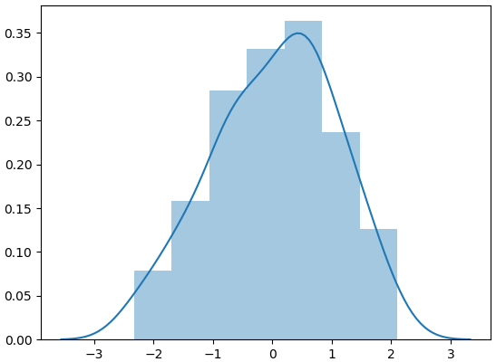
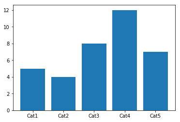
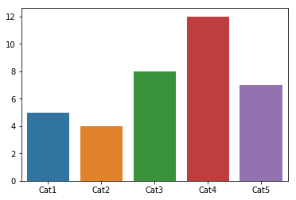
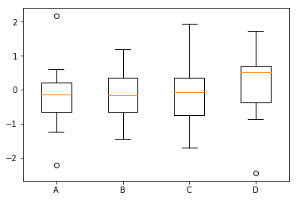
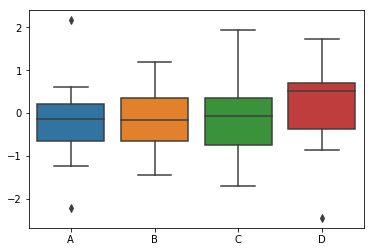

本篇介绍Python的可视化技术以及10种可视化视图，包括散点图、折线图、直方图、条形图、箱线图、饼图、热力图、蜘蛛图、二元变量分布和成对关系。 

<!--more-->


# 可视化技术有哪些？

## Matplotlib

> Matplotlib 是一个 Python 的 2D绘图库，它以各种硬拷贝格式和跨平台的交互式环境生成出版质量级别的图形。通过 Matplotlib，开发者可以仅需要几行代码，便可以生成绘图，直方图，功率谱，条形图，错误图，散点图等。


## Seaborn

> Seaborn是一个基于matplotlib的Python数据可视化库。它提供了一个高级界面，用于绘制有吸引力且信息丰富的统计图形。Seaborn是一个用Python制作统计图形的库。它建立在matplotlib之上，并与pandas数据结构紧密集成。


# 可视化视图都有哪些？

按照数据之间的关系，我们可以把可视化视图划分为 4 类，它们分别是比较、联系、构成和分布。

1. 比较：比较数据间各类别的关系，或者是它们随着时间的变化趋势，比如**折线图**；
2. 联系：查看两个或两个以上变量之间的关系，比如**散点图**；
3. 构成：每个部分占整体的百分比，或者是随着时间的百分比变化，比如**饼图**；
4. 分布：关注单个变量，或者多个变量的分布情况，比如**直方图**。


## 散点图（scatter plot）

散点图：

### 使用Matplotlib

​	先导包。pyplot这个工具包，它包括了很多绘图函数，类似 Matlab 的绘图框架。

```python
import matplotlib.pyplot as plt
```

​	在工具包引用后，画散点图，需要使用 plt.scatter(x, y, marker=None) 函数。x、y 是坐标，marker 代表了标记的符号。比如“x”、“>”或者“o”。选择不同的 marker，呈现出来的符号样式也会不同：

```python
import numpy as np
x = np.random.randint(0,100,size=(100,))
y = np.random.randint(0,100,size=(100,))
# plt.scatter(x,y,marker='x')
# plt.scatter(x,y,marker='>')
plt.scatter(x,y,marker='o')
```




### 使用Seaborn 

​	先导包

```python
import seaborn as sns
```

​	在引用 seaborn 工具包之后，就可以使用 seaborn 工具包的函数了。

散点图使用 `sns.jointplot(x, y, data=None, kind=‘scatter’)` 函数。其中 x、y 是 data 中的下标。data 就是我们要传入的数据，一般是 DataFrame 类型。kind 这类我们取 scatter，代表散点的意思。

```python
import pandas as pd 
df = pd.DataFrame({'x':x,'y':y})
sns.jointplot(x="x",y="y",data=df, kind='scatter')
```



从上下两张图中可以看出 Matplotlib 和 Seaborn 的视图呈现还是有差别的。Matplotlib 默认情况下呈现出来的是个长方形。而 Seaborn 呈现的是个正方形，而且不仅显示出了散点图，还给了这两个变量的分布情况。


## 折线图

折线图：用来表示数据随着时间变化的趋势。


- Matplotlib 

在 Matplotlib 中，我们可以直接使用 plt.plot() 函数，当然需要提前把数据按照 x 轴的大小进行排序，要不画出来的折线图就无法按照 x 轴递增的顺序展示。

- Seaborn 

在 Seaborn 中，我们使用 sns.lineplot (x, y, data=None) 函数。其中 x、y 是 data 中的下标。data 就是我们要传入的数据，一般是 DataFrame 类型。


例子：包含 x、y 的数组。x 数组代表时间（年），y 数组我们随便设置几个取值。下面是详细的代码。

```python
import pandas as pd
import matplotlib.pyplot as plt
import seaborn as sns
# 数据准备
x = [2010, 2011, 2012, 2013, 2014, 2015, 2016, 2017, 2018, 2019]
y = [5, 3, 6, 20, 17, 16, 19, 30, 32, 35]
# 使用 Matplotlib 画折线图
plt.plot(x, y)
plt.show()
# 使用 Seaborn 画折线图
df = pd.DataFrame({'x': x, 'y': y})
sns.lineplot(x="x", y="y", data=df)
```

Matplotlib 折线图：


Seaborn 折线图：



## 直方图

直方图：表示变量的数值分布

​	直方图是比较常见的视图，它是把横坐标等分成了一定数量的小区间，这个小区间也叫作“箱子”，然后在每个“箱子”内用矩形条（bars）展示该箱子的箱子数（也就是 y 值），这样就完成了对数据集的直方图分布的可视化。


- Matplotlib 

在 Matplotlib 中，我们使用 plt.hist(x, bins=10) 函数，其中参数 x 是一维数组，bins 代表直方图中的箱子数量，默认是 10。

- Seaborn 

在 Seaborn 中，我们使用 sns.distplot(x, bins=10, kde=True) 函数。其中参数 x 是一维数组，bins 代表直方图中的箱子数量，kde 代表显示核密度估计，默认是 True，我们也可以把 kde 设置为 False，不进行显示。核密度估计是通过核函数帮我们来估计概率密度的方法。


例子：

```python
import numpy as np
import pandas as pd
import matplotlib.pyplot as plt
import seaborn as sns
# 数据准备
a = np.random.randn(100)
s = pd.Series(a) 
# 用 Matplotlib 画直方图
plt.hist(s)
plt.show()
# 用 Seaborn 画直方图
sns.distplot(s, kde=False)
sns.distplot(s, kde=True)
```

Matplotlib 直方图：



Seaborn 直方图：







## 条形图

条形图：显示类别的特征。在条形图中，长条形的长度表示类别的频数，宽度表示类别。

- Matplotlib 

在 Matplotlib 中，我们使用 plt.bar(x, height) 函数，其中参数 x 代表 x 轴的位置序列，height 是 y 轴的数值序列，也就是柱子的高度。


- Seaborn 

在 Seaborn 中，我们使用 sns.barplot(x=None, y=None, data=None) 函数。其中参数 data 为 DataFrame 类型，x、y 是 data 中的变量。


例子：

```python
import matplotlib.pyplot as plt
import seaborn as sns
# 数据准备
x = ['Cat1', 'Cat2', 'Cat3', 'Cat4', 'Cat5']
y = [5, 4, 8, 12, 7]
# 用 Matplotlib 画条形图
plt.bar(x, y)
plt.show()
# 用 Seaborn 画条形图
sns.barplot(x, y)
```

Matplotlib ：



Seaborn ：




## 箱线图

箱线图，又称盒式图，它是在 1977 年提出的，由五个数值点组成：**最大值 (max)**、**最小值 (min)**、**中位数 (median)** 和**上下四分位数** (Q3, Q1)。它可以帮我们分析出数据的**差异性**、**离散程度**和**异常值**等。

- Matplotlib 

在 Matplotlib 中，我们使用 plt.boxplot(x, labels=None) 函数，其中参数 x 代表要绘制箱线图的数据，labels 是缺省值，可以为箱线图添加标签。

- Seaborn 

在 Seaborn 中，我们使用 sns.boxplot(x=None, y=None, data=None) 函数。其中参数 data 为 DataFrame 类型，x、y 是 data 中的变量。


例子：

```python
# 数据准备
# 生成 0-1 之间的 10*4 维度数据
data=np.random.normal(size=(10,4)) 
lables = ['A','B','C','D']
# 用 Matplotlib 画箱线图
plt.boxplot(data,labels=lables)
plt.show()
# 用 Seaborn 画箱线图
df = pd.DataFrame(data, columns=lables)
sns.boxplot(data=df)
```

Matplotlib 箱线图：



Seaborn 箱线图：




待补充！！！