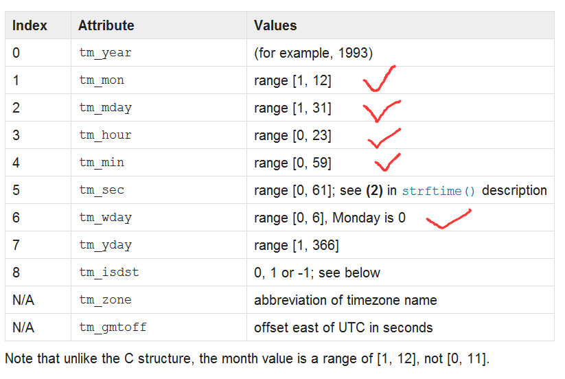
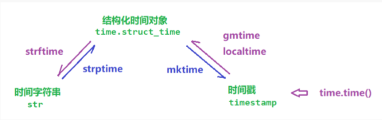

本篇介绍Python中的常用模块。 

<!-- more -->


常用模块的介绍:

- time,datetime
- os,sys
- hashlib,json,pickle,collections

# time

封装了获取时间戳和字符串形式的时间的一些方法。

## time模块的三大对象

### 时间戳

时间戳：从时间元年开始的**秒数**（1970 1 1 00：00：00）（python中获取的秒数，java是毫秒）

```
print(time.time())
```


### 结构化时间对象

- 结构化时间对象（class time.struct_time）：像一个元组，拥有9个属性字段，可以单独使用其中的属性（index/attribute name） 
- 它就像一个中介，供不同地区的计算机相互使用。

```python
obj =  time.gmtime()      
# 默认参数是当前系统时间的时间戳，背后调用了time()方法
print(obj)
# time.struct_time(tm_year=2019, tm_mon=4, tm_mday=4, tm_hour=12, tm_min=28, tm_sec=1, tm_wday=0, tm_yday=140, tm_isdst=0)
```

time.gmtime()  与 time.localtime() 类似，作用是格式化时间戳为本地的时间。
如果sec参数未输入，则以当前时间为转换标准。    DST (Daylight Savings Time) flag (-1, 0 or 1) 是否是夏令时。也就是说，如果没有参数，它们的结果是相同的。



note：月和日期是从1开始的，小时，分钟，秒，星期都是从0开始的


### 时间字符串

- 1和2利于在不同的时区之间进行传播(即:国际化),但是不利于阅读。
- 字符串便于阅读.但是不利于国际化.


## time三大对象之间的转换

- 时间戳 ---> 格式化时间对象 ：time.gmtime   localtime()   mktime()
- 格式化时间对象 ---> 时间字符串： time.strftime(format,时间对象)
- 时间字符串 ---> 格式化时间对象：time.strptime(str,format)



```python
# 时间对象 ---> 时间戳
t = time.localtime()   # 获取结构化时间对象
print(time.mktime(t))  # 获取对应的时间戳


#格式化时间对象和字符串之间的转换  （计算机传输，人类阅读）
s = time.strftime("year:%Y %m %d %H:%M:%S")
print(s)

# 时间字符串转换成事件对象
time_obj = time.strptime('2010 10 10',"%Y %m %d")  #时，分，秒 默认为0
time_obj = time.strptime('2010',"%Y") #月份日期 默认为1

#time_obj = time.strptime('0',"%Y") #月份日期 默认为1       #ValueError: time data '0' does not match format '%Y'
# print(time_obj)

```


## 日期格式化符号

- %y 两位数的年份表示（00-99） 

- %Y 四位数的年份表示（000-9999） 

- %m 月份（01-12） 

- %d 月内中的一天（0-31） 

- %H 24小时制小时数（0-23）

- %I 12小时制小时数（01-12） 

- %M 分钟数（00=59） 

- %S 秒（00-59）

 

- %a 本地简化星期名称 

- %A 本地完整星期名称 

- %b 本地简化的月份名称 

- %B 本地完整的月份名称 

- %c 本地相应的日期表示和时间表示

 

- %j 年内的一天（001-366） 

- %p 本地A.M.或P.M.的等价符 

- %U 一年中的星期数（00-53）星期天为星期的开始

-  %w 星期（0-6），星期天为星期的开始

- %W 一年中的星期数（00-53）星期一为星期的开始

-  %x 本地相应的日期表示

-  %X 本地相应的时间表示

-  %Z 当前时区的名称

-  %% %号本身 


# datetime

同time模块相比，它的主要功能在于对属性值的抽取和计算上。

## 模块中的四大类

- date：日期,包含year,month,day三个属性
- time：时间,包含hour,minute,second,microsecond,tzinfo属性
- datetime：前两者的混合体
- timedelta：时间增量

```python
import datetime
# date 类: 年月日
d = datetime.date(2010,10,10)
print(d)    #2010-10-10
# 获取date对象的各个属性 property
print(d.year)
print(d.month)
print(d.day)

# time类： 时分秒
t = datetime.time(10,24,59)
print(t)	#10:24:59
print(t.hour)
print(t.minute)
print(t.second)

# datetime
dt = datetime.datetime(2010,11,11,11,11,11)
print(dt)

# datetime中的类，主要用于数学计算
# timedelta ：时间的变化量    (delta表示的是变化量/差值)
td = datetime.timedelta(days=1)
print(td)
# 参与数学运算：
# 1.创建时间对象：
#  #只能和这三类做运算：date,datetime,timedelta
d = datetime.date(2010,10,10)
res = d + td
res = d + td * 50
print(res)

#  时间变化量的计算是否会产生进位?
t = datetime.datetime(2010,10,10,10,10,59)
td = datetime.timedelta(seconds=3)
res = t + td
print(res)

例子：判断某一年是否是闰年
year = 1970
obj = datetime.date(year,3,1)
de = datetime.timedelta(days = 1)
res = obj-de
print(res.day)
```

note：time不能参与运算

```
o = datetime.time(21,20,5)
d = datetime.timedelta(seconds=50)
print(d + o)
TypeError: unsupported operand type(s) for +: 'datetime.timedelta' and 'datetime.time'
```

练习：

```
练习2：计算三天前的日期
import datetime
import time

# obj1 = datetime.date(time.localtime().tm_year,time.localtime().tm_mon,time.localtime().tm_mday)      #这个方法有些繁杂
obj1 = datetime.datetime.now()     #只有datetime下有now方法。
print(obj1)
de = datetime.timedelta(days=3)
obj2 = obj1 - de
print(obj2)
print(obj2.strftime("%Y %m %d"))
```


# os

# sys

# hashlib

- 该模块封装一些用于加密的类。

- 包含很多的加密算法：MD5，sha1，sha256，sha512


## 用途

1. 密码加密，不能以明文的形式存储密码，密文的形式。
2. 文件的校验


## 特点

- 将bytes类型字节转化成固定长度数字组成的字符串。

- 把一个大的数据切分成不同的小块，分别对不同的块进行加密，在汇总的结果，和直接对整体数据加密的结果一致。
- 单向加密，不可逆。
- 原始数据的一点小的变化，将导致结果的非常大的差异，“雪崩”效应。


## 步骤

1. 获取一个加密对象

   `m = hashlib.md5()`

2. 使用对象的update，进行加密

   `m.update(b'abc')` 

3. 通过hexdigest获取加密结果

   `ret = m.hexdigest()`

note：其中1，2也可以合在一起写为： 

​	`m = hashlib.md5(b'abc')`


## 加盐

### 为什么要加盐?

 如果一个用户的用户名 abc 密码 123，另一个用户的用户名 ab  密码  c123  这样容易撞在一起，所以加盐。另外也是为了增加破解的难度。


### 让结果更复杂一些

```
在基础上加密后，在加密一次
m =  hashlib.md5()
m.update(password.encode('utf-8'))
m.update('salt'.encode('utf-8'))
```

动态的盐

```
加的盐要不断变化
```

sha系列  金融类，安全类，用这个级别。

- 随着sha系列数字越高，加密越复杂，越不易破解，但耗时越长。


## 文件的校验

linux中一切皆文件：文本，非文本文件，音频，视频，图片...

无论下载的视频，还是软件（国外的软件），往往都会有一个md5值。

版本一：

```
file = 'pycharm-professional-2019.1.2.exe'
m = hashlib.sha256()
with open(file, mode='rb') as f:
    con = f.read()
m.update(con)
print(m.hexdigest())
```


版本二： read(1024)  没有行的区分。

```
#read(1024) 表示最大读1024个字节。
#为什么把 打开文件 放在 循环里面就出错了， 因为在循环中，会不断重复open操作这样会出bug！
# 错误版
file = 'pycharm-professional-2019.1.2.exe'
m = hashlib.sha256()
while 1:
    with open(file, mode='rb') as f:
        con = f.read(1024)
        if con:
            print(con)
            m.update(con)
        else:
            break
print(m.hexdigest())

# 正确版：
file = 'pycharm-professional-2019.1.2.exe'
m = hashlib.sha256()
with open(file, mode='rb') as f:
    while 1:
        con = f.read(1024)
        if con:
            print(con)
            m.update(con)
        else:
            break
print(m.hexdigest())
```


# json


# pickle


#  collections模块

给我们提供一些python的数据类型，比较特殊的数据类型。

## namedtuple：命名元组

## deque：双端队列

类似于列表的一种容器型数据，高效实现插入和删除操作。


## Counter：计数器

主要用来计数


## OrderedDict：有序字典  

（3.6后面的版本很少用了）

## defaultdict：带有<u>默认值</u>的字典

因为可以设置值的默认值，所以，相对于字典可以少一部初始化。 

例子：

```python
l = [11,22,33,44,55,66,77,88]
# 问：小于66的添加到一个字典的一个键中，大于等于66的添加到该字典的另一个键。

# 进阶：
dic7 = defaultdict(list)
[dic7['key1'].append(i) for i in l if i < 66] and [dic7['key2'].append(j) for j in l if j >= 66]
print(dic7)
```


## functools

#### wraps

- 用于保留函数的元信息，详见 [Python 函数](https://chennq.com/learn-python/20190403-python-function.html)

#### partial

- partial可以生成一个固定了参数的新函数

```python
import functools

def func(a1, a2):
    return a1 + a2


'''
ret = func(1,5)
print(ret)
'''
new_func = functools.partial(func, 1)
ret = new_func(3)
print(ret)  # 4

new_func2 = functools.partial(func, 1, 2)
print(new_func2())  # 3
# partial可以生成一个固定了参数的新函数
```