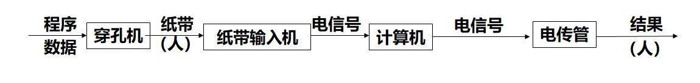
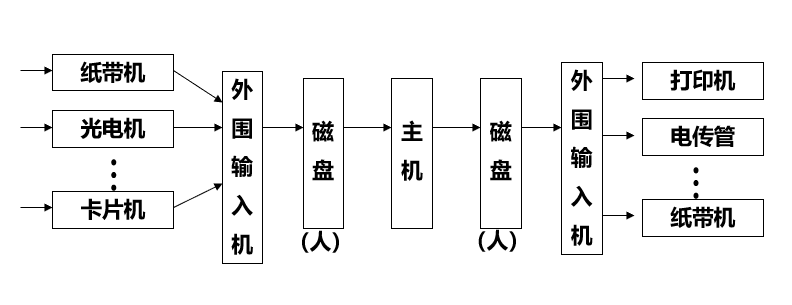
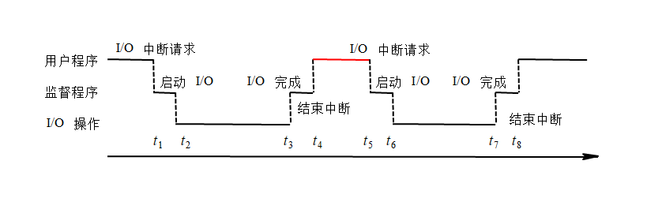
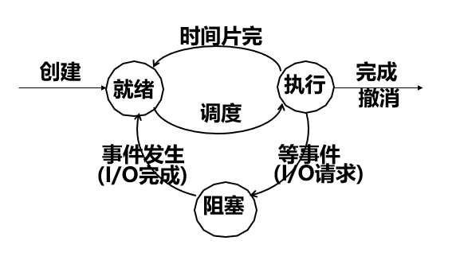
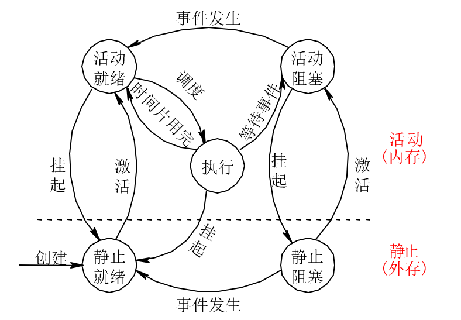

as you will，如果你认为操作系统没有用，那是因为你的编程和程序开发处在一个低级的水平。 

<!--more-->

# 引论

## 操作系统的形成

### 人工操作阶段

特点：

- 用户独占全机——资源利用率低
- 机等人：CPU等待人工操作（装带、卸带时）

缺点:

- 输入、纸带、电传都可能出错
- 多个用户不能同时使用

### 脱机输入输出技术

引入： 为缓解人机矛盾，CPU速度与I/O设备速度不匹配的矛盾。

优点：

- 减少了CPU的空闲时间，缓解了人机矛盾。
- 缓和了CPU和I/O设备速度不匹配的矛盾，进一步减少CPU空闲时间。 

### 批处理技术（单道批处理技术）

​    在磁带中有若干作业（一批作业），配有专门编制的监督程序，主机一启动，以监督程序自动完成作业的切换，使作业自动的一个接一个的处理。 

特征：

自动性、顺序性、单道性（内存任何时候只有一道作业；FCFS）

优点：实现作业自动转接，克服了机等人。 
缺点：输入时，主机空闲；计算时，外围设备空闲——计算机使用效率仍然不高。 

### 多道批处理技术

引入：提高资源利用率。

思想：内存中同时存放几道相互独立的程序，一个I/O时，另一个用CPU，多道程序合理搭配交替运行，充分利用资源，提高效率。 

需要解决的问题：

- 处理机管理问题：CPU分配和回收
- 内存管理问题：内存分配、扩充和回收
- I/O设备的管理问题
- 文件管理问题
- 作业管理问题 

操作系统是在不断改善计算机系统性能和提高资源利用率，方便用户的过程中诞生的。**多道程序设计技术**的出现，标志着操作系统的诞生。 

### 分时系统

​	当用户的需求表现为：人机交互；共享主机；便于用户上机。多个用户同时使用一台计算，互不干扰，就象独占一样。

​	一般采用**时间片轮转**的方式，使一台计算机为多个终端服务，对每个用户能保证足够快的时间响应，并提供交互会话能力。

特点：多路性、独立性、及时性、交互性

## 什么是操作系统

- 操作系统是一个介于计算机和应用程序之间的一个软件系统。它使计算机变得更好用，使计算机运行变得有序。
- <u>操作系统是掌握是计算机上所有事情的软件系统</u>

## 操作系统的特征

### 并发

并行性：两个或两个以上的操作在**同一时刻**发生。

并发性：两个或两个以上的操作在**同一时间间隔**内发生。

### 共享

共享：系统中的资源供内存中多个并发执行的进程共同使用。

类型：

- 互斥共享方式
- 同时访问方式

并发与共享：互为存在条件，**共享以并发为条件**，**共享影响并发**。

### 虚拟

虚拟：是指通过某种技术把一个物理实体变成若干个逻辑上的对应物。 

### 异步

多道程序环境下，进程以异步方式运行。

## 操作系统扮演着两个角色：

### 魔术师：

操作系统通过进程抽象让每一个用户都感觉有一台自己**独享的cpu**；通过**虚拟内存**的抽象，让用户感觉物理内存具有无限扩张性。（当然这种把少变多不是无中生有，变多也不是无限，只是针对磁盘容量大小）

### 管理者：

为了让用户很好的利用硬件资源，资源需要**分块（parcels out）**，把硬件分块出来给应用程序使用。管理者要做到的是**有效和公平**。有效指的是不能浪费资源，公平指的是每个人都有享有资源的可能，不能有不公平的现象。

根据管理的资源不同，操作系统的**具体功能**包括：

- CPU管理：如何分配CPU给不同应用和用户。
- 内存管理：如何分配内存给不同应用和用户。
- 外存管理：如何分配外存（磁盘）给不同应用和用户。
- I/O管理：如何分配输入输出设备给应用和用户。
- 健壮性管理：即如何确保操作系统自身的正常运行。
- 安全性管理：即如何防止非法操作和入侵。

# 进程的描述与控制

## 程序与进程

引入：为描述**并发**下程序的执行情况

进程：进程是**程序**的一次执行过程，是系统进行**资源分配**和**处理机调度**的一个**独立单位**。 

进程 = 程序段 + 数据段 + PCB（进程控制块）

- 数据段：操作对象及工作区

- 程序块：描述要完成的功能
- PCB：动态特征的集中体现

程序：程序就是文件，是控制计算机的指令。

### 程序是如何运行的？

程序运行至少需要如下4要素

- 程序设计语言
- 编译系统
- 操作系统
- 指令集结构（计算机硬件系统）

### 进程的三种基本状态

- 就绪状态(ready):等处理机 
- 执行状态(running):用处理机 
- 阻塞状态(blocked):等事件 

有了基本的状态我们就有了最基本的状态演变：

但这个还不够，我们还需要调节系统负荷、满足终端用户，操作系统的需要。

**挂起**：使正在活动的进程（或执行、或就绪、或阻塞）处于静止状态，此时系统回收被这些进程占用的**内存**资源。 

### 进程控制块PCB

PCB是进程存在的唯一标志，OS根据PCB来对并发执行的进程进行控制和管理。

组织方式：

- 链接方式

- 索引方式

  它两的区别在于，索引方式会在链接方式的基础上增加索引表

### 进程控制

到此为止，逐步深入，了解了进程，那么进程是被谁控制的呢？ **OS内核**。

进程控制，就是对系统中所有进程的**生命历程**实施控制。也即：进程控制是管理进程生灭及状态转换的**程序的集合**。

内核：在层次结构中最里层的程序模块集合。即：内核是计算机硬件的**第一层扩充软件**。

内核的基本功能：

- 资源管理：
  - 进程管理、存储器管理、设备管理
- 支撑功能
  - 中断处理、时钟管理、原语操作

内核的实现：

- 它是由**原语**实现
- 原语：由若干条机器指令构成的，完成特定功能的一段程序，其执行过程不可分割，就象一条指令一样
- 例如：进程的创建、终止；进程的阻塞、唤醒；进程的挂起、激活。

### 进程同步

在系统中有一些需要相互合作、协同工作的进程，它们之间的相互联系称为**进程的同步**。 

#### 进程同步的主要任务

使并发执行的诸进程之间能有效地**共享资源**和**相互合作**，从而使程序的并发执行具有可再现性。

#### 进程的两种制约关系

- 间接制约：竞争同一资源而产生的**相互排斥**的关系 。
  - 解释： 当某一进程访问某一资源时，不允许别的进程同时访问，这种限制称为**互斥**， 即多个进程在访问某些资源（如临界资源）时，也要有一种执行次序上的协调 ，当一个进程访问完毕，另一个进程才能访问。所以就其本质来讲，互斥仍是一种同步。
- 直接制约：进程间共同完成一项任务时直接发生**相互作用**的关系。 

#### 临界资源

- 临界资源：一次仅允许一个进程访问的资源。例如打印机。
- 临界区：访问临界资源的代码段，不允许多个并发进程交叉执行的一段程序。

#### 临界区必须**互斥**访问

- 进入区：(1) 检查临界资源是否被访问，未被访问，转(2)，否则转(1)。

  ​			   (2) 进入临界区，并设访问标志。

- 退出区：恢复访问标志，允许其它进程进入

- 

#### 同步机制应遵循的准则

- 空闲让进——有效利用 
- 忙则等待——互斥 
- 有限等待——避免“死等” 
- 让权等待——避免“忙等” 

# 处理机调度与死锁

### 进程调度时机

- 正在执行的进程执行完毕; 
- 执行中的进程因提出I/O请求或发生等事 件而暂停执行; 
- 时间片完成; 
- 在进程通信或同步过程中执行了某种原 语操作，如P操作(wait操作)阻塞; 
- 高优先者进入; 

### 处理机调度的层次

作业调度

进程调度

内存调度

# 存储器管理

# 虚拟存储器

未完待续！！！

-----

