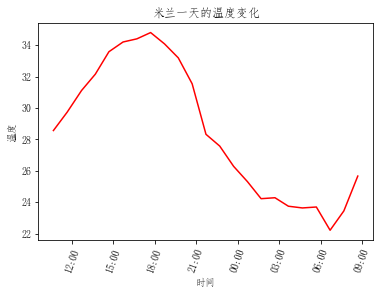

城市气候与海洋的关系研究。 

<!--more-->


## 引入

​	本例来自《Python数据分析实战》第九章：数据分析实例——气象数据。

​	作者是意大利人，本例的出发点为：<u>夏天的时候，人们常常到山村或滨海城市避暑，由此延伸出一个疑问，靠海对气候有什么影响？也就是海洋对一个地区的气候有何影响？</u>


### 研究系统：亚得里亚海和波河流域

​	为了衡量海洋对气候的影响，<u>排除了山地</u>，因为山地也许会引入其他很多因素，比如海拔。	

​	意大利波河流域这块区域就很适合研究海洋对气候的影响。这一片平原东起亚得里亚海，向内陆延伸数百公里（见图1）。它周边虽不乏群山环绕，但由于它很宽广，削弱了群山的影响。此外，该区域城镇密集，也便于选取一组离海远近不同的城市。我们所选的几个城市，两个城市间的最大距离约为 400 公里。


第一步，选 10 个城市作为参照组。选择城市时，注意它们要能代表整个平原地区，还有一个海滨城市，作为计算其他城市离海远近的基点。结果如下图所示：


如上图所示，我们选取了 10 个城市。随后将分析它们的天气数据，其中 5 个城市在距海 100 公里范围内，其余 5 个距海 100～400 公里。

选作样本的城市列表如下：

- Ferrara（费拉拉）
- Torino（都灵）
- Mantova（曼托瓦）
- Milano（米兰）
- Ravenna（拉文纳）
- Asti（阿斯蒂）
- Bologna（博洛尼亚）
- Piacenza（皮亚琴察）
- Cesena（切塞纳）
- Faenza（法恩莎）

接下来，我们需要计算这些城市离海有多远。这里使用 TheTimeNow 网站提供的服务，以海滨城市 Comacchio 作为基点，计算其他城市与它之间的距离：


### 数据源

该数据集共30个文本文件，每个城市有3个文本文件，对应着不同的日期。

数据集的下载链接为：  待补充！！！


## 导入数据集

- 导入各个城市的数据，并将不同日期的城市数据进行合并。

```python
import numpy as np
import pandas as pd
from pandas import Series,DataFrame

ferrara1 = pd.read_csv('./ferrara_150715.csv')
ferrara2 = pd.read_csv('./ferrara_250715.csv')
ferrara3 = pd.read_csv('./ferrara_270615.csv')
ferrara=pd.concat([ferrara1,ferrara2,ferrara3],ignore_index=True)

torino1 = pd.read_csv('./torino_150715.csv')
torino2 = pd.read_csv('./torino_250715.csv')
torino3 = pd.read_csv('./torino_270615.csv')
torino = pd.concat([torino1,torino2,torino3],ignore_index=True) 

mantova1 = pd.read_csv('./mantova_150715.csv')
mantova2 = pd.read_csv('./mantova_250715.csv')
mantova3 = pd.read_csv('./mantova_270615.csv')
mantova = pd.concat([mantova1,mantova2,mantova3],ignore_index=True) 

milano1 = pd.read_csv('./milano_150715.csv')
milano2 = pd.read_csv('./milano_250715.csv')
milano3 = pd.read_csv('./milano_270615.csv')
milano = pd.concat([milano1,milano2,milano3],ignore_index=True) 

ravenna1 = pd.read_csv('./ravenna_150715.csv')
ravenna2 = pd.read_csv('./ravenna_250715.csv')
ravenna3 = pd.read_csv('./ravenna_270615.csv')
ravenna = pd.concat([ravenna1,ravenna2,ravenna3],ignore_index=True)

asti1 = pd.read_csv('./asti_150715.csv')
asti2 = pd.read_csv('./asti_250715.csv')
asti3 = pd.read_csv('./asti_270615.csv')
asti = pd.concat([asti1,asti2,asti3],ignore_index=True)

bologna1 = pd.read_csv('./bologna_150715.csv')
bologna2 = pd.read_csv('./bologna_250715.csv')
bologna3 = pd.read_csv('./bologna_270615.csv')
bologna = pd.concat([bologna1,bologna2,bologna3],ignore_index=True)

piacenza1 = pd.read_csv('./piacenza_150715.csv')
piacenza2 = pd.read_csv('./piacenza_250715.csv')
piacenza3 = pd.read_csv('./piacenza_270615.csv')
piacenza = pd.concat([piacenza1,piacenza2,piacenza3],ignore_index=True)

cesena1 = pd.read_csv('./cesena_150715.csv')
cesena2 = pd.read_csv('./cesena_250715.csv')
cesena3 = pd.read_csv('./cesena_270615.csv')
cesena = pd.concat([cesena1,cesena2,cesena3],ignore_index=True)

faenza1 = pd.read_csv('./faenza_150715.csv')
faenza2 = pd.read_csv('./faenza_250715.csv')
faenza3 = pd.read_csv('./faenza_270615.csv')
faenza = pd.concat([faenza1,faenza2,faenza3],ignore_index=True)
```

- 显示一个城市的内容

```python
milano.head()
```


## 数据可视化


### 温度

先分析一天中气温的变化趋势，以城市米兰为例：

```python
# 温度和日期数据
x1 = milano['day'][:23]
y1 = milano['temp'][:23]


# 把日期数据转换成 datetime 的格式
dt_x1 = [parser.parse(x) for x in x1]

fig, ax = plt.subplots()
# 调整x轴坐标刻度，使其旋转70度，方便查看
plt.xticks(rotation=70) 
# 设定X轴显示的格式
hours = mdates.DateFormatter('%H:%M')
ax.xaxis.set_major_formatter(hours)  
ax.plot(dt_x1 ,y1, 'r')

plt.xlabel('时间')
plt.ylabel('温度')
plt.title('米兰一天的温度变化')
```

结果如下图：



​	我们进行数据分析的目的是尝试解释是否能够评估海洋是怎样影响气温的，以及是否能够影响气温趋势，因此我们同时来看几个不同城市的气温趋势。这是检验分析方向是否正确的唯一方式。因此，我们选择三个离海最近以及三个离海最远的城市。

```python
x1 = ravenna['day'][:24]
y1 = ravenna['temp'][:24]
x2 = faenza['day'][:24]
y2 = faenza['temp'][:24]
x3 = cesena['day'][:24]
y3 = cesena['temp'][:24]
x4 = milano['day'][:24]
y4 = milano['temp'][:24]
x5 = asti['day'][:24]
y5 = asti['temp'][:24]
x6 = torino['day'][:24]
y6 = torino['temp'][:24]

# 把日期从 string 类型转化为标准的 datetime 类型
dt_x1 = [parser.parse(x) for x in x1]
dt_x2 = [parser.parse(x) for x in x2]
dt_x3 = [parser.parse(x) for x in x3]
dt_x4 = [parser.parse(x) for x in x4]
dt_x5 = [parser.parse(x) for x in x5]
dt_x6 = [parser.parse(x) for x in x6]

fig, ax = plt.subplots()
# 调整x轴坐标刻度，使其旋转70度，方便查看
plt.xticks(rotation=70) 
# 设定X轴显示的格式
hours = mdates.DateFormatter('%H:%M')
ax.xaxis.set_major_formatter(hours)  
# 红色表示离海最近的三个城市，绿色表示离海最远的三个城市
ax.plot(dt_x1 ,y1, 'r',dt_x2 ,y2, 'r',dt_x3 ,y3, 'r')
ax.plot(dt_x4 ,y4, 'g',dt_x5 ,y5, 'g',dt_x6 ,y6, 'g')
```

六个城市的气温趋势如下图所示，红色表示离海最近的三个城市，绿色表示离海最远的三个城市：


可以沿着这个方向做深入研究，收集10个城市的最高温和最低温，用线性图表示气温最值点和离海远近之间的关系。

```python
# 城市列表
cities = [ravenna,cesena,faenza,ferrara,bologna,mantova,piacenza,milano,asti,torino]
# 最高气温列表
temp_max = np.array([max(i['temp']) for i in cities])
# 最低气温列表
temp_min = np.array([min(i['temp']) for i in cities])
# 距离列表
location = np.array([i['dist'][0] for i in cities])
```


### 最高气温

先把最高气温的散点图画出来

```python
# 最高温度
plt.scatter(location,temp_max)
plt.xlabel('距离')
plt.ylabel('温度')
plt.title('10个城市的最高气温')
```


如图所示，海洋对气象数据具有一定程度的影响这个假设是正确的（至少一天内如此）。而且从图中可以发现，海洋的影响衰减的很快，离海60~70公里开外，气温就已攀升到高位。

使用线性回归算法（scikit-learn库的SVR）得到两条直线，分别表示两种不同的气温趋势。


持续更新中！！！


