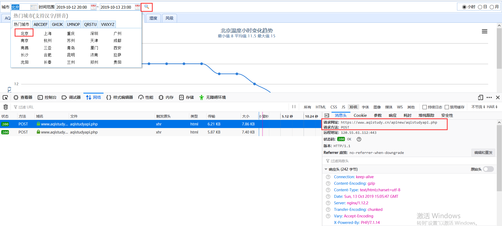
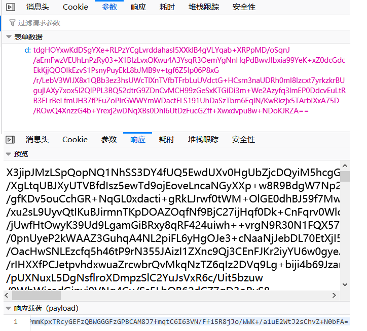
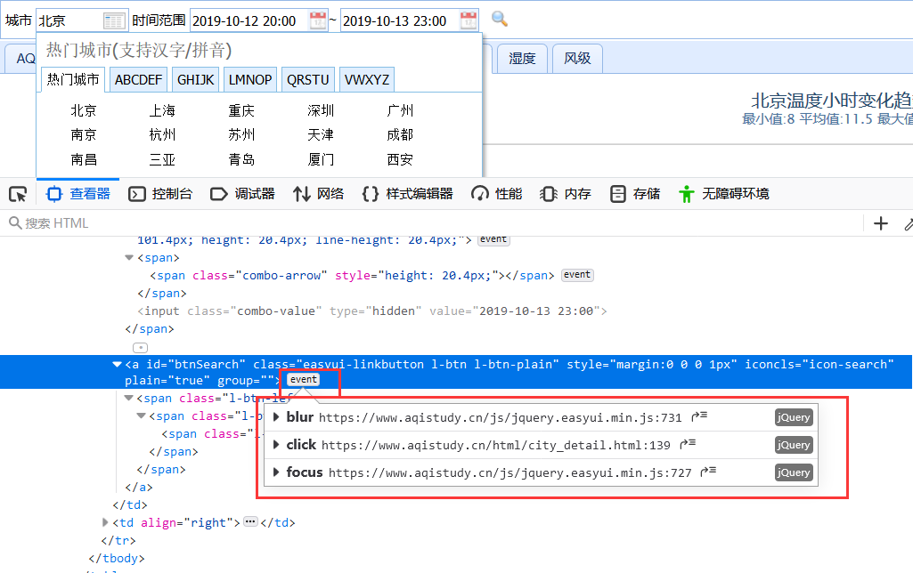
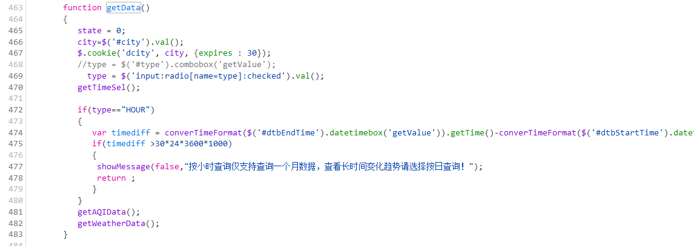
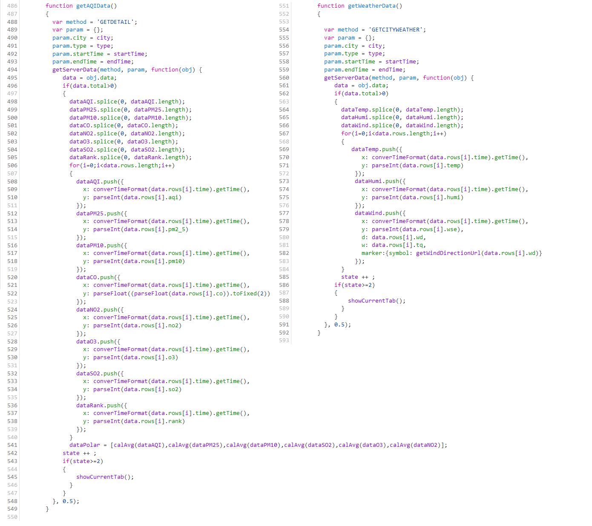
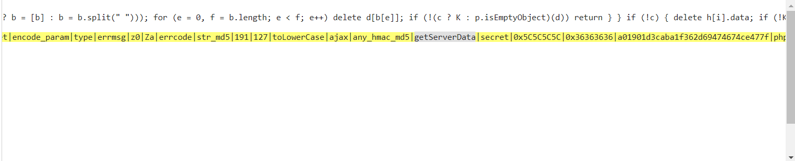

本文以爬取中国空气质量在线监测分析平台为例进行分析。 

<!--more-->


## 需求

- 地址: `https://www.aqistudy.cn/html/city_detail.html`

- 爬取气象数据


## 分析

### ①

在页面中更换查找条件（城市）可以让抓包工具捕获到我们想要的数据包。而每个按钮只是把数据进行展示，并不会发起请求。





### ②

apistudyapi.php 该数据包就是我们最终定位到的爬取数据对应的数据包
- 该数据包中可以提取到url和请求参数（请求参数不正常要么是动态加载的，要么是加密的，还可能是动态且加密的）（刷新后参数在变化也没在页面源码中找到，推测是动态且加密的）
- 响应数据是经过加密的密文




### ③

当修改查询条件后，点击查询按钮后，发起 ajax 请求，url也没有变化，该请求可以请求到 apistudyapi.php 数据包

- 想要捕获的数据是可以通过点击搜索按钮生成的，所以目标移动到这个按钮对应的事件。



### ④

通过火狐浏览器的开发者工具可以找到搜索按钮绑定的点击事件对应的事件函数 getData()


### ⑤

分析 getData():
- 在函数定义中找关于ajax请求相关的代码（含有url，解密方式）
- type这个变量可以为 HOUR
- 虽然没有找到ajax请求但是找到另外两个，getAQIData();getWeatherData();




### ⑥

分析getAQIData(); getWeatherData();

这两个函数的实现除了method变量不同，剩下的都一致
- method = (GETDETAIL或者是GETCITYWEATHER)
- 在这两个函数的实现中也没有发现ajax请求对应的代码，但发现了一个叫做getServerData这个函数的实现中，猜测在这个getServerData包含着ajax请求
    - getServerData(method, param, 匿名函数， 0.5)
    - param是字典，有4组键值对（city,type,starttime,endtime）




### ⑦

分析getServerData函数的实现

- 最终通过抓包工具的全局搜索定位到了该函数的实现，但是实现的js代码被加密了，该种形式的加密被称为js混淆。




如何破解js混淆
- 地址：`http://www.bm8.com.cn/jsConfusion/`

在该函数的实现中终于找到了ajax请求对应的代码：

- ajax请求的url
- ajax请求方式
- 请求参数的来源：getParam(method, object);  object 是前面的param是字典 
- 对加密的响应数据解密：decodeData(密文)


### ⑧

基于python模拟js代码

- PyExecJS模块可以让python模拟执行js代码
- 环境安装：
    - pip install PyExecJS
    - 在本机安装node.js的开发环境


1. 将解密后的代码写入本地，名为 test.js


2. 获取ajax请求的动态变化且加密的请求参数（d：xxx）

```python
#获取ajax请求的动态变化且加密的请求参数（d：xxx）
import execjs
node = execjs.get()
 
# Params
method = 'GETCITYWEATHER'
city = '北京'
type = 'HOUR'
start_time = '2018-01-25 00:00:00'
end_time = '2018-01-25 23:00:00'
 
# Compile javascript
file = 'test.js'
ctx = node.compile(open(file,encoding='utf-8').read())

# Get params
js = 'getPostParamCode("{0}", "{1}", "{2}", "{3}", "{4}")'.format(method, city, type, start_time, end_time)
params = ctx.eval(js)
print(params)
```


3. 携带捕获到请求参数进行请求

```python
#携带捕获到请求参数进行请求
import execjs
import requests

node = execjs.get()
 
# Params
method = 'GETCITYWEATHER'
city = '北京'
type = 'HOUR'
start_time = '2018-01-25 00:00:00'
end_time = '2018-01-25 23:00:00'
 
# Compile javascript
file = 'test.js'
ctx = node.compile(open(file,encoding='utf-8').read())
 
# Get params
js = 'getPostParamCode("{0}", "{1}", "{2}", "{3}", "{4}")'.format(method, city, type, start_time, end_time)
params = ctx.eval(js)

#发起post请求
url = 'https://www.aqistudy.cn/apinew/aqistudyapi.php'
response_text = requests.post(url, data={'d': params}).text
print(response_text)
```


4. 对捕获到的加密的响应数据进行解密

```python
# 对捕获到的加密的响应数据进行解密
import execjs
import requests

node = execjs.get()
 
# Params
method = 'GETDETAIL'
city = '北京'
type = 'HOUR'
start_time = '2018-01-25 00:00:00'
end_time = '2018-01-25 23:00:00'
 
# Compile javascript
file = 'test.js'
ctx = node.compile(open(file,encoding='utf-8').read())
 
# Get params
js = 'getPostParamCode("{0}", "{1}", "{2}", "{3}", "{4}")'.format(method, city, type, start_time, end_time)
params = ctx.eval(js)

#发起post请求
url = 'https://www.aqistudy.cn/apinew/aqistudyapi.php'
response_text = requests.post(url, data={'d': params}).text

#对加密的响应数据进行解密
js = 'decodeData("{0}")'.format(response_text)
decrypted_data = ctx.eval(js)
print(decrypted_data)
```

