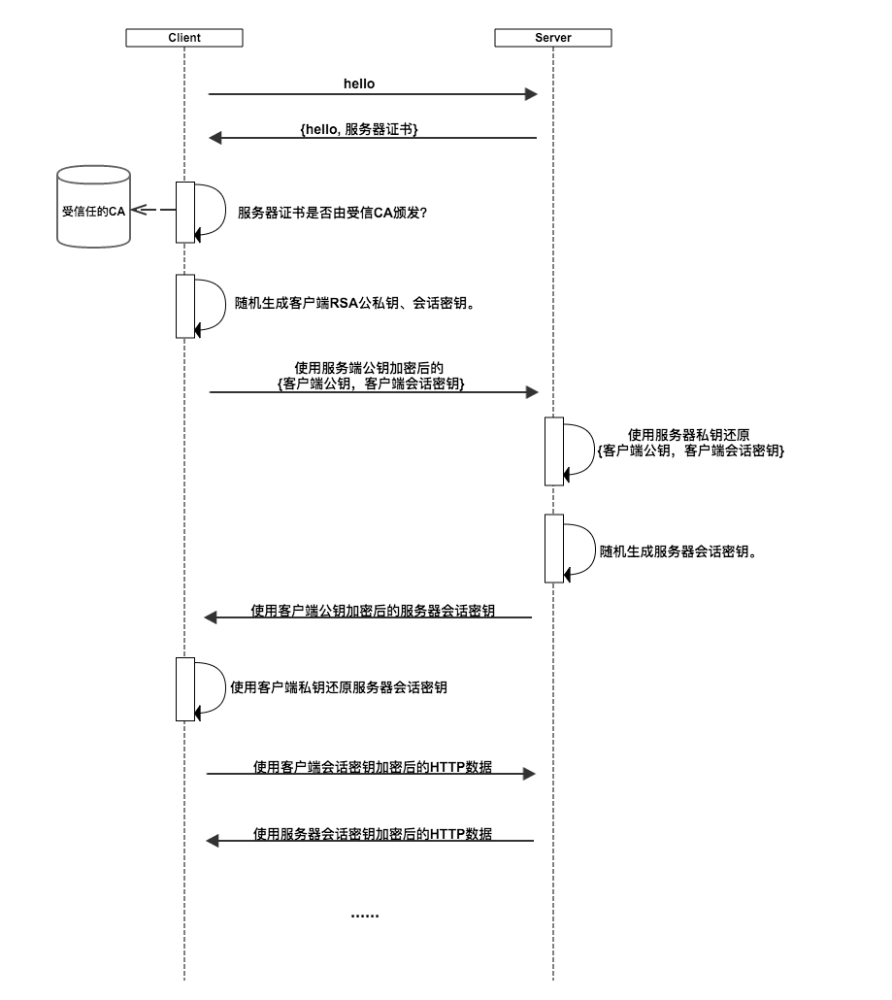

本篇介绍爬虫的基本概念以及遇到的反爬机制与反反爬策略。 

<!--more-->

# 概述

## 爬虫是什么？

- 就是通过编写程序**模拟**浏览器上网，然后让其去互联网中**爬取**数据的过程
    - 模拟
        - 通过url来请求资源
    - 爬取
        - 整张页面
        - 局部的指定的特定的（数据解析）

## 爬虫的分类

- 通用爬虫：爬取一整张页面源码数据。搜索引擎（抓取系统 ==》内部封装的一套爬虫程序）中重点使用的是该种形式的爬虫
- 聚焦爬虫：抓取的页面中指定的局部数据。
- 增量式爬虫：**监测**网站数据更新的情况。抓取的是网站最新更新出来的数据。区别于通用爬虫（一次性的），增加了去重的特点。

## 爬虫安全性的探究

- 风险所在
    - 爬虫干扰了被访问网址的正常运营
    - 爬取到了收法律保护的特定类型的数据或信息
- 如何规避风险
    - 严格遵守网站设置的robots协议；
    - 在规避反爬虫措施的同时，需要优化自己的代码，避免干扰被访问网站的正常运行；
    - 在使用、传播抓取到的信息时，应审查所抓取的内容，如发现属于用户的个人信息、隐私或者他人的商业秘密的，应及时停止并删除

# HTTP与HTTPS

既然爬虫是模拟浏览器上网，那么就需要了解 HTTP/HTTPS 与爬虫相关的那部分细节。

## 什么是HTTP协议

客户端与服务器进行数据交互的某种形式。

## 什么是HTTPS协议

- HTTPS是安全（数据加密）的http协议。

- HTTPS并非是应用层的一种新协议。只是HTTP通信接口部分（应用层与网络层之间）用 SSL（SecureSocket Layer）和 TLS（Transport Layer Security）协议代替而已。

​	TLS / SSL由Internet协议套件（TCP / IP）的应用程序层中的两层组成。

## 常用的头信息

- user-agent: 请求载体（不同的浏览器，爬虫代码）的身份标识
- Connection：'keep-alive'长链接，没有的话就是短链接。 'close'表示请求成功后立即关闭
- content-type：

# HTTPS的加密方式

## 铺垫

基本分为三个阶段：

- **认证服务器**：
  - 客户端判断服务器是否可信。
  - 浏览器内置一个**受信任的CA机构列表**，并保存了这些CA机构的证书。第一阶段服务器会提供经CA机构认证颁发的服务器证书，如果认证该服务器证书的CA机构，存在于浏览器的受信任CA机构列表中，并且服务器证书中的信息与当前正在访问的网站（域名等）一致，那么浏览器就认为服务端是可信的，并从服务器证书中取得服务器公钥，用于后续流程。否则，浏览器将提示用户，根据用户的选择，决定是否继续。当然，我们可以管理这个受信任CA机构列表，添加我们想要信任的CA机构，或者移除我们不信任的CA机构。

- **协商会话密钥**：
  - 客户端得到服务端的公钥。客户端生成公钥和私钥后，利用服务端的公钥加密自己的公钥并发送给服务端，这样两边都有了公钥，就可以加密信息了。
  - 客户端在认证完服务器，获得服务器的公钥之后，利用该公钥与服务器进行加密通信，协商出两个会话密钥，分别是用于<u>加密客户端往服务端发送数据的客户端会话密钥</u>，用于<u>加密服务端往客户端发送数据的服务端会话密钥</u>。在已有服务器公钥，可以加密通讯的前提下，还要协商两个对称密钥的原因，是因为非对称加密相对复杂度更高，在数据传输过程中，使用对称加密，可以节省计算资源。另外，会话密钥是随机生成，每次协商都会有不一样的结果，所以安全性也比较高。

- **加密通讯**：
  - 客户端使用服务端的公钥加密信息，服务端使用客户端的公钥加密信息。
  - 此时客户端服务器双方都有了本次通讯的会话密钥，之后传输的所有Http数据，都通过会话密钥加密。这样网路上的其它用户，将很难窃取和篡改客户端和服务端之间传输的数据，从而保证了数据的私密性和完整性。
    

# 反爬机制与相应的反反爬策略

- 反爬机制：应用在网站中
- 反反爬策略：应用在爬虫程序中

## 第一组(robots协议)

### 反爬机制

robots协议：纯文本的协议

- 例如：https://www.taobao.com/robots.txt
- 特点：防君子不防小人

## 第二组(UA检测)

### 反爬机制

UA检测：检测请求头信息的headers中的 `User-Agent` 

### 反反爬策略

添加UA：请求头信息的headers中添加 `User-Agent` 

## 第三组(Cookie检测)

### 反爬机制

Cookie检测：检测请求头信息的headers中的 `Cookie` 

### 反反爬策略

- 手动：添加Cookie：请求头信息的headers中添加 `Cookie` 

- 自动：使用session发起请求会将服务器发回的cookie保留下来。详见[基于requests的爬虫](https://chennq.com/网络爬虫/20190921-Web_Spider_3.html)

## 第四组（图片懒加载）

### 反爬机制

图片懒加载

- 原本图片的属性 src 伪装成 src2

- 如果在可视区域内，js就将src2变成src
- 不在可视区域内就不请求这张图片

### 反反爬策略

- 拿到 src2 而不是 src，当然要根据爬取到的页面而定。

## 第五组（代理）

### 反爬机制

- ip被封

### 反反爬策略

- 使用代理服务器

代理ip的网站

- 西祠代理  `https://www.xicidaili.com/nn/`
- 快代理
- `www.goubanjia.com`
- 代理精灵

## 第六组（登录限制）

登录限制

- 拿到post提交的url地址进行登录。

- 使用selenium

## 第七组（动态加载的数据）

### 反爬机制

想要爬取的数据并不在当前请求页面的url

### 反反爬策略

1. 找到真正的请求url，发出请求即可
2. 使用selenium实现可见即可得

## 第八组（动态变化的请求参数）

### 反爬机制

提交的参数是动态变化的，如果不正确则无法通过。

### 反反爬策略

通常可在页面的源码中找到。

## 第九组（js混淆）

### 反爬机制

经过js加密的代码称为js混淆。

### 反反爬策略

- 反混淆的地址：http://www.bm8.com.cn/jsConfusion/

- 将接收到的js代码进行反混淆

例子： 空气质量数据爬取

## 第十组（js加密）

### 反爬机制

请求或返回的数据是进过加密的

### 反反爬策略

找到相应的js代码进行解密

例子： 空气质量数据爬取