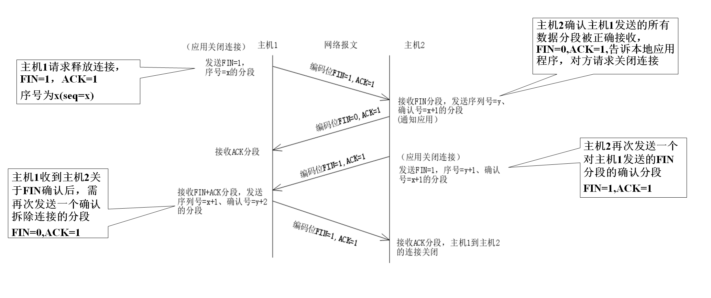

第一部分是介绍计算机网络的基本概念和基本原理；第二部分是计算机网络的组成与体系结构、OSI参考模型及TCP/IP模型。第三部分是分层介绍。 

<!-- more -->

## 基本概念

让我们先看一个实例：假设有一批货物从A地邮寄到B地，How?

| 事情                                      | 意义                               |
| ----------------------------------------- | ---------------------------------- |
| 1）货物打包，填写发出地和目的地           | ——信息编码与封装                   |
| 2）可以通过公路，也可通过铁路、水路和航空 | ——传输媒介                         |
| 3）现假设为公路，有山、川阻隔             | ——网络互连                         |
| 4）公路分支，设路标                       | ——路由（如何寻找到达目的地的路径） |
| 5）要求对方能够接收、识别货物             | ——网络通信协议。                   |
| 6）对货物运输过程中的丢失等进行检查       | ——检错/纠错。                      |
| 7）限速、红绿灯标识—                      | ——流量控制/拥塞控制。              |
| 8）公路维护、管理部门                     | ——网络管理。                       |
| 9）公路巡警                               | ——网络安全。                       |
| 另外：作为司机，应拥有交通地图手册        | ——网络拓扑。                       |

还有哪些交通（海、陆、空）方面的问题可以与网络相对应？

某条路线暂时戒严，使某个车辆通过								——RSVP.
资源预留协议：预先预留一定的网络资源，比如带宽等等，给相应的流量，通路上所有设备必须都支持rsvp，预留才会成功。对于需要保证带宽和时延的业务，如语音传输，视频会议等具有十分重要的作用。  

救火车、救护车、警车等优先											——主动网络。			

### 在计算机网络技术复杂的演变过程中，有三个重要的里程碑：

第一个里程碑：以报文（Message）或分组（Packet）交换技术为标志，如1968年美国国防部的高级研究计划局开始建设的以存储转发（store-and-forward）技术为基础的ARPANET。

第二个里程碑：以1980出现的开放式系统互联参考模型（OSI/RM）为标志。

第三个里程碑：以Internet的迅速发展与推广为特征。

### 计算机网络的类型

 计算机网络有多种分类标准，如按传输技术、通信介质、按数据交换方式、通信速率和使用范围等。

- **最普遍的是按地理范围**（广域网，城域网，局域网）
- 按传输介质（双绞线，同轴电缆，光纤，无线网）
- 使用网络的对象（公用网，专用网）
- 按网络传输技术 （广播式，点到点式）
- 按传输速度（低速网络和高速网络）
- 按逻辑功能可分为（资源子网和通信子网）
- 按拓扑结构分（星，环，总线，树，网）

### 按地理范围划分：

- 局域网（Local area networks ，LANs) 
  范围：小，＜10KM
  传输技术：基带，10Mbps-1000Gbps，延迟低，出错率低
  拓扑结构：总线，环
- 广域网（Wide area networks ，WANs)
  范围：大，＞100KM
  传输技术：宽带，延迟大，出错率高
  拓扑结构：不规则，点到点
- 城域网（Metropolitan  area networks ， MANs)
  范围：中等，＜100KM
  传输技术：宽带/基带
  拓扑结构：总线

### 网络的主要性能指标

计算机网络的最主要的两个性能指标就是**带宽**与**时延**

“**带宽**”(bandwidth) 本来是指信号具有的频带宽度，单位是赫（或千赫、兆赫、吉赫等）。
现在“带宽”是**数字信道**所能传送的“**最高数据率**”的同义语，单位是“**比特每秒**”，或 **b/s** (bit/s)。
**带宽代表数字信号的发送速率，也叫吞吐量**（throughput）    

更常用的带宽单位是
千比每秒，即 Kb/s （10^3 b/s）
兆比每秒，即 Mb/s（10^6 b/s）
吉比每秒，即 Gb/s（10^9 b/s）
太比每秒，即 Tb/s（10^12 b/s）

**时延**是指一个报文或分组从一个网络（或一条链路）的一端传送到另一端所需的时间

总时延 = 处理时延(在队列中产生) + 发送时延(在发送器产生) + 传播时延 (在链路上产生)

### 数据交换技术的分类

#### **电路交换**（circuit switching）

- 以前的电话局，两步电话是通过一条线连接起来的。
- 若要连续传送大量的数据，且其传输时间远远大于连接建立时间，则电路交换具有传输效率较快的优点。

#### **报文交换**（message switching）	

- 报文交换技术是一种**存储转发(Store And Forword)**技术，它是利用计算机带有大量的外存设备来完成交换的。报文交换方式中，两个站点间无需建立专用通道（不需要呼叫，拆线），交换设备的输入线和输出线之间也不必建立物理连接。
- 优点：**线路利用率高**；信道可为多个报文共享；接收端和发送端无需同时工作，在接收方“忙”时，报文可以暂存交换设备处；可同时向多个目的站点发送同一报文；能实现差错控制和纠错处理；
- 缺点：**信息延迟长**，从发送到接收之间的延迟为1分钟或更长，因此，**不适用于实时通信**或交互通信，也不适用于交互式的“终端-主机”连接。

#### **分组交换**（packet switching）

- 分组交换也称为**包交换**。它把一个报文分成若干个较短的报文分组（或信息包），以分组（包）为单位进行传输。
- <u>分组交换又分为无连接的数据报（Datagram）方式和面向连接的虚电路（Virtual Circuit）方式。</u>
- 分组交换比报文交换的时延小，但其结点交换机必须具有更强的处理能力。

##### 过程（假定分组在传输过程中没有出现差错，在转发时也没有被丢弃）

- 在发送端，先把较长的报文**划分成较短的、固定长度的数据段**。 
- 每一个数据段前面添加上**首部**构成分组。
- 分组交换网以“分组”作为数据传输单元。依次把各分组发送到接收端（假定接收端在左边）。
- 最后，在接收端把收到的数据恢复成为原来的报文。

在网络核心部分起特殊作用的是**路由器**。

路由器是实现**分组交换**(packet switching)的关键构件，其**任务是转发收到的分组，这是网络核心部分最重要的功能。** 

在路由器中的输入和输出端口之间**没有直接连线**。

路由器处理分组的过程是：

- 把收到的分组先放入**缓存（暂时存储）**；
- 查找**转发表**，找出到某个目的地址应从哪个端口转发；
- 把分组送到适当的**端口**转发出去。 

## 网络体系结构

网络功能分层结构与各层协议的统称。

### 计算机网络所采用的一般模型为层次模型

### 为什么要分层？

分层的目的是为了降低复杂性，提高灵活性——“分而治之，各个击破”

- 各层之间是独立的。
- 灵活性好。
- 结构上可分割开。
- 易于实现和维护。
- 能促进标准化工作。

### 若干术语

#### 源

- 通信过程中，数据的发送方

#### 目标

- 通信过程中，数据的接收方

#### Entity(实体）

- 每一层上的活动元素，包括实现该层功能的所有硬件与软件，表示任何可发送或接收信息的硬件或软件进程。 

#### Peer-Peer Entity (对等实体)

- 相互通信的两个不同机器上的同一层次完成相同功能的实体

#### Service(服务） 

- 每一层为上一层所提供的功能称为服务。<u>N层使用N-1层所提供的服务，向N+1层提供更高的服务</u>。在这种情况下，n层被称为服务提供者，n+1层是服务用户。

#### Interface (接口)

- 定义下层向其相邻的上层提供的服务及原语操作，但服务的实现细节对上层是透明的（不可见的）。

一个（N）实体向上一层（N+1）实体提供的（N）服务由哪几部分组成？

- （N）实体自身提供的某些功能
- 由（N-1）层及其以下各层及本地系统环境提供的服务
- 处于另一开放系统对等（N）实体的通信而提供的某些服务

#### 协议（Protocols）和N层协议

- 定义: 为网络通信所制定的一组规则、约定和标准。协议可以使通信更有效地进行。协议是控制两个对等实体进行通信的规则的集合。
- 在协议的控制下，两个对等实体间的通信使得本层能够**向上一层提供服务**。
- 要实现本层协议，还**需要使用下层所提供的服务**。
- 网络通信是一种层到层的对等通信，**第N层上的通信规则或约定称为N层协议**

#### 协议数据单元（PDU）

- 对等实体间传送信息的数据单元
- 按每层协议所采用的数据格式，被对等实体用于执行其相同的协议
- 网络中所传送的数据的逻辑组成单元
- 从高层到下层，存在数据的**封装**过程
- 从下层到高层，存在数据的**拆封**过程

#### 协议和服务的区别及相互关系 

- 网络协议——为进行网络中的数据交换而建立的规则、算法或约定，包括语法、语义和语序三要素。（N）协议 
- 网络服务——（N）实体向相邻的上一层的（N+1）实体提供一种能力，这种能力称为（N）服务。

#### 实体、协议、服务和服务访问点

- 本层的服务用户只能看见服务而无法看见下面的协议。
- 下面的协议对上面的服务用户是**透明**的。 
- 协议是“**水平的**”，即协议是控制对等实体之间通信的规则。
- 服务是“**垂直的**”，即服务是由下层向上层通过层间接口提供的。
- 同一系统相邻两层的实体进行交互的地方，称为**服务访问点 SAP** (Service Access Point)。

#### 服务原语

服务原语（Service Primitive）：指服务用户与服务提供者之间进行交互时所要交换的一些必要信息。OSI/RM规定了四种服务原语类型。

- 请求（Request）:一个实体希望得到某种服务
- 指示（Indication）：把关于某一事件的信息告诉某一实体
- 响应（Response）：一个实体愿意响应某一事件
- 证实（Confirm）：把一个实体的服务请求加以确认并告诉它

### OSI 模型

Open System Interconnecting Reference Model

一个概念模型（1984），并未确切描述用于各层的协议和服务，所以并不是严格意义上的体系结构的意义。

应、表、会、传、网、数、物

### 具有五层协议的体系结构 

TCP/IP 是四层的体系结构：应用层、传输层、网际层和网络接口层。但最下面的网络接口层并没有具体内容。因此往往采取折中的办法，即综合 OSI 和 TCP/IP 的优点，采用一种只有五层协议的体系结构 。

 

##### 源——数据封装:

PDU -> Segments -> Packet -> Frame -> Bits

详解:

应用进程数据先传送到应用层，加上<u>应用层首部</u>,成为**应用层PDU** ---->应用层PDU再传到传输层，加上<u>传输层首部</u>，成为**传输层报文 Segments** ----> 传输层报文在传送到网络层，加上<u>网络层首部</u>，成为**IP数据报（或分组）Packet** ----> IP数据报在传送到数据链路层，加上<u>链路层首部和尾部</u>，成为**数据链路层帧Frame** ----> 数据链路层帧在传送给物理层，最下面的**物理层**把**比特流Bits**传送到物理媒体

##### 目的——数据的拆封：

Bits -> Frame -> Packet -> Segment -> PDU

详解:

物理层接收到比特流，上交给数据链路层 ----> 数据链路层**剥去帧首部和帧尾部**取出数据部分，上交给网络层  ----> 网络层**剥去首部**，取出数据部分上交给传输层 ----> **传输层剥去首部**，取出数据部分上交给应用层 ----> **应用层剥去首部**，取出应用程序数据上交给应用进程

## OSI详解

#### 物理层

物理层：是O S I 模型的最低层或第一层，该层包括物理连网媒介，如电缆连线、连接器、网卡等。
物理层的协议产生并检测电压以便发送和接收携带数据的信号。
术语“第一层协议”和“物理层协议”，均是指描述电信号如何被放大及通过电线传输的标准。

#### 功能

负责实际或原始的数据“位（BIT）” 传送，通过传输介质将比特流由一个节点传向另一个节点。

#### 数据链路层

数据链路层:是O S I 模型的**第二层**，它**控制网络层与物理层之间的通信**。

1. 主要功能是**将从网络层接收到的数据分割成特定的可被物理层传输的帧**。  
2. 帧(Frame)是**用来移动数据的结构包**，它不仅包括**原始（未加工）数据**，或称“**有效荷载**”，还**包括发送方和接收方的网络地址**以及**纠错和控制信息**。其中的地址确定了帧将发送到何处，而纠错和控制信息则确保帧无差错到达。
3. 通常发送方的数据链路层将等待来自接收方对数据已正确接收的<u>应答信号</u>。
4. 数据链路层<u>控制信息流量</u>，以允许网络接口卡正确处理数据。
5. 数据链路层的<u>功能**独立于**网络和它的节点所采用的**物理层类型**</u>。 

Note：有一些连接设备，如**<u>网桥</u>**或**<u>交换机</u>**，由于它们要<u>对帧解码并使用帧信息将数据发送到正确的接收方</u>，所以它们是<u>工作在数据链路层的</u>。

#### 功能

- **实现两个相邻的机器间的无差错的传输**。通过对物理层提供的原始比特流传输服务的加强，向网络层提供服务
- **成帧**：规定数据链路层最小的数据传送逻辑单位——帧的类型和格式。将从网络层接收的信息
- 分组组成帧后传送给物理层，由物理层传送到对方的数据链路层。
- 物理寻址和对网络拓朴的存取
- **差错控制**：在信息帧中带有校验字段，当接收方收到帧时，按照选定的差错控制方法进行校验，在发现差错时进行差错处理。
- **流量控制**：协调发送方与接收方的数据流量，使发送速率不要超过接收方速率。
- 共享介质环境中的介质访问控制
- 链路管理：建立、维持与释放数据链路。 

#### 网络层

网络层，O S I 模型的第三层，其主要功能是**将网络地址翻译成对应的物理地址，并决定如何将数据从发送方路由到接收方**。例如：一个计算机有一个网络地址10.34.99.12 （若它使用的是TCP/IP协议）和一个物理地址060973E97F3 。

1. 网络层通过综合考虑**发送优先权、网络拥塞程度、服务质量以及可选路由的花费**来决定从一个网络中节点Ａ 到另一个网络中节点Ｂ 的**最佳路径**。
2. 在网络中，“**路由**”是**基于编址方案、使用模式以及可达性**来指引数据的发送。 

Note：由于网络层处理路由，而**路由器**因为连接网络各段，并智能指导数据传送，所以**属于网络层**。

#### 功能

- 涉及将源端发出的数据（分组）经各种途径送到目的端，从源端到目的端可能要经过许多的中间节点---互连和路径选择（源网络-目标网络）                    
- 通信子网的最高层，但是处理端到端（主机—主机）数据传输的最低层。
- 信息分组的类型和格式
- 逻辑寻址
- 路由和转发
- **拥塞控制**

#### 传输层

传输层：主要负责**确保数据可靠、顺序、无错地从Ａ 点到传输到Ｂ 点**（Ａ 、Ｂ 点可能在也可能不在相同的网络段上）。

1. 因为**如果没有传输层，数据将不能被接受方验证或解释**（收到？对/错？乱序？），所以，**传输层常被认为是O S I 模型中最重要的一层。**
2. 传输协议同时进行**流量控制**（根据接收方可接收数据的快慢程度规定适当的发送速率）。
3. 传输层按照网络能处理的最大尺寸将较长的数据包进行强制分割并编号。例如：以**太网无法接收大于1 5 0 0 字节的数据包**。发送方节点的传输层将数据分割成较小的数据片，同时**对每一数据片安排一序列号**，以便数据到达接收方节点的传输层时，能**以正确的顺序重组**。该过程即被称为**排序**。
4. 在网络中，传输层发送一个**A C K （应答）信号**以通知发送方数据已被正确接收。如果**数据有错**或者**数据在一给定时间段未被应答**，传输层将请求发送方重新发送数据。

NOTE：工作在传输层的一种服务是**TCP/IP协议栈**中的T C P（Transfer Control Protocol **传输控制协议**），另一项传输层服务是**IPX/SPX 协议集**的S P X（ Serial package Exchange **序列包交换**）

#### 功能

- 为高层数据传输建立、维护与拆除传输连接，实现透明的端到端的传输（主机-主机）
- 真正意义上的**从源到目标的“端到端”**层，源端的某程序与源端的“类似”程序进行对等通信
- 屏蔽了上三层 (面向应用) 和下三层（面向数据传输）之间的界限，弥补网络所提供的服务质量的不足，提供可靠的网络服务
- 信息的分段（源端）和合并（目标端）
- **流量控制**和差错恢复
- **多路复用**

### 会话层

会话层:负责在网络中的两节点之间建立和维持通信。

1. 会话层的功能包括：**建立**通信链接，**保持**会话过程通信链接的畅通，**同步**两个节点之间的对话，决定通信是否被**中断**以及通信中断时决定从何处重新发送。
       例如，网络上常常使用的下载工具软件，迅雷支持端点续传功能，就是使用了会话层的这个功能，知道从上次中断的地方继续下载。
2. 会话层通过**决定节点通信的优先级**和**通信时间的长短**来设置**通信期限**。

#### 功能

- 建立、管理和终结不同机器上的**应用程序或进程间的会话**
- 为表示层提供服务
- 会话(Dialogue)的管理：
      令牌（Token)
- 会话的同步
      检查点（Checkpoint)

### 表示层

表示层：充当应用程序和网络之间的“**翻译官**”角色。

1. 在表示层，数据将**按照网络能理解的方式进行格式化**；这种格式化也**因所使用网络的类型不同而不同**。例如，IBM主机使用EBCDIC编码，而大部分PC机使用的是ASCII码、甚至反码或补码。在这种情况下，为了让采用不同编码方法的计算机能相互理解通信交换后数据的值，便需要会话层来完成这种转换。
   方法：采用抽象的标准方法来定义数据结构、标准的编码表示形式。
2. 表示层**管理数据的解密与加密**，如系**统口令的处理**。
3. 表示层协议还对**图片和文件格式信息进行解码和编码**。GIF、JPEG

#### 功能

- 表示层以下各层只关心**可靠的数据传输**，而表示层关心的是所传送**数据的语法和语义**。
- 完成**语法格式的转换**
      不同的计算机可能有不同的内部数据表示（抽象语法），表示层收到应用层传过来的某种语法形式的数据后，将其转换成适合在网络实体间传送的公共语法（传送语法）表示的数据。包括数据表示格式和转换、数据压缩、加密与解密、协议转换等
- 与接收方协商所采用的公共语法类型
- 表示层对等实体间连接的建立、数据传送与连接释放。

### 应用层

应用层：O S I 模型的顶端也即第七层是。应用层负责**对软件提供接口**以使程序能使用网络服务。

1. 术语“**应用层**”<u>并不是指运行在网络上的某个特别应用程序</u>，而是**提供了一组**方便程序开发者在自己的应用程序中使用网络功能的服务。
2. 应用层提供的服务包括**文件传输（FTP）**、**文件管理**以及**电子邮件的信息处理（SMTP）**等。

NOTE：一个A P I （应用程序接口）是使一个程序与操作系统相互作用的例行程序（即一组指令）。**API 属于OSI 模型的应用层**，编程者使用API 在代码与操作系统之间建立链接。

### osi模型各层功能总结

- 应用层：网络服务与最终用户的一个接口。
  - 协议有：HTTP FTP TFTP SMTP SNMP DNS TELNET HTTPS POP3 DHCP
- 表示层：数据的表示、安全、压缩。（在五层模型里面已经合并到了应用层）
  - 格式有，JPEG、ASCll、DECOIC、加密格式等
- 会话层：建立、管理、终止会话。（在五层模型里面已经合并到了应用层）
  - 对应主机进程，指本地主机与远程主机正在进行的会话
- 传输层：定义传输数据的协议端口号，以及流控和差错校验。
  - 协议有：TCP UDP，数据包一旦离开网卡即进入网络传输层
- 网络层：进行逻辑地址寻址，实现不同网络之间的路径选择。
  - 协议有：ICMP IGMP IP（IPV4 IPV6） ARP RARP
- 数据链路层：建立逻辑连接、进行硬件地址寻址、差错校验等功能。
  - 将比特组合成字节进而组合成帧，用MAC地址访问介质，错误发现但不能纠正。
- 物理层：建立、维护、断开物理连接。
- OSI/RM七层协议模型上、下大，中间小，这是因为最高层要和各种类型的应用进程接口，而最低层要和各种类型的网络接口，因此上、下两头标准特别多，而中间几层标准就稍简单些。有些层的任务过于繁重，如数据链路层和网络层，有些层的任务又太轻，如会话层和表示层。

## TCP/IP模型

应用层（Application）、传输层（Transport）、互联网络层（Internet）、网络接口层（Network Access）（数据链路层 + 物理层）

### 网络接口层

- **网络接口层**似乎与**OSI的数据链路层和物理层**相对应，但实际上TCP/IP并没有真正描述这一部分，**只是指出主机必须使用某种协议与网络连接**，以便能在其上传递IP（互连网络协议）分组。
- 具体的**物理网络**可以是各种类型的局域网，如以太网、令牌环网、令牌总线网等，也可以是诸如X.25、帧中继、电话网、DDN等公共数据网络。
- **网络接口层**负责从主机或节点接收IP分组，并把它们发送到指定的物理网络上。

### 互联网络层

- **互连网络层是整个体系结构的关键部分**，功能是**使主机可以把分组发往任何网络，并使分组独立地传向目的地（可能经由不同的物理网络）**。
- 这些分组到达的顺序和发送的顺序可能不同，因此如需要按顺序发送及接收时，高层必须对分组**排序**。
- 互连网络层定义了标准的分组格式和协议，即**IP协议（Internet protocol）**。互连网络层的功能就是**把IP分组发送到应该去的地方**。选择**分组路由**和**避免阻塞**是主要的设计问题。
- TCP/IP互连网络层和**OSI网络层**在功能上非常相似。

### 传输层

- 传输层在TCP/IP模型中位于互连网络层之上，功能是**使源端和目的端主机上的对等实体可以进行会话**（和OSI的传输层一样）。这里定义了两个端到端的协议。
- 第一个是**传输控制协议TCP**（Transmission Control Protocol）。
- 第二个协议是**用户数据报协议UDP**（User Datagram Protocol）。

**传输控制协议TCP**。TCP是一个**面向连接**的协议，允许从一台机器发出的字节流**无差错**地发往互联网上的其它机器。
TCP把输入的字节流分成报文段，并传给互连网络层。在接收端，TCP接收进程把收到的报文再组装成输出流。TCP还要处理**流量控制**，以避免快速发送方向低速接收方发送过多报文而使接收方无法处理。

**用户数据报协议UDP**。它是一个不可靠的、无连接协议，用于不需要TCP的排序和流量控制能力而是自己完成这些功能的应用程序。
被广泛地应用于只有一次的**客户—服务器模式**的请求—应答查询，以及快速递交比准确递交更重要的应用程序，如传输语音或影像。自从这个协议体系出现以来，IP已经在很多其它网络上实现了。 

### 应用层

- 传输层的上面是应用层。它包含所有的高层协议。
- 最早引入的是**虚拟终端协议（TELNET）**、**文件传输协议（FTP）**和**电子邮件协议（SMTP）**；

**虚拟终端协议**允许一台机器上的用户登录到远程机器上进行工作；
**文件传输协议**提供了有效地把数据从一台机器移动到另一台机器的方法；
**电子邮件**最初仅是一种文件传输，但是后来为它提出了专门的协议。
**域名系统服务DNS**（domain name service）用于把主机名映射到网络地址；HTTP协议用于在WWW上获取主页等。

### OSI七层和TCP/IP四层的关系

- OSI引入了服务、接口、协议、分层的概念，TCP/IP借鉴了OSI的这些概念建立TCP/IP模型。
- OSI先有模型，后有协议，先有标准，后进行实践；而TCP/IP则相反，先有协议和应用再提出了模型，且是参照的OSI模型。
- OSI是一种理论下的模型，而TCP/IP已被广泛使用，成为网络互联事实上的标准。且**TCP协议**与**IP协议**两者可联合使用，也可单独与其他协议配合使用。

### OSI七层和TCP/IP的区别

- TCP/IP他是一个协议簇；而OSI（开放系统互联）则是一个模型，且TCP/IP的开发时间在OSI之前，所以两者间不存在严格的对应关系。
- TCP/IP由于层次更少显得比OSI更简洁
- TCP/IP将OSI中的<u>上三层</u>合并成了一个**应用层**，<u>下两层</u>合并成了一个**网络接口层**。
- TCP/IP是由一些交互性的模块做成的分层次的协议，其中每个模块提供特定的功能；OSi则指定了哪个功能是属于哪一层的。
- TCP/IP作为从INTERNET上发展起来的协议，已成了网络互连的事实标准目前还没有按OSI实现的网络产品，OSI仅作为理论的参考模型被广泛使用。

## 物理层

### 概念

物理层的主要任务描述为**确定与传输媒体的接口的一些特性**，即： 

- 机械特性:指明接口所用**接线器**的形状和尺寸、引线数目和排列、固定和锁定装置等等。
- 电气特性:指明在接口**电缆**的各条线上出现的电压的范围。
- 功能特性:指明某条线上出现的某一电平的**电压**表示何种意义。
- 过程特性:指明对于不同功能的各种可能事件的出现顺序。

### 物理层需要解决的问题

数据如何用电信号表示？

信号如何传输？

### 物理层的设备与组件:

- 被动(不需要外电源)：线缆、连接头、连接座、接线面板、转换器
- 主动 (需要电源)：调制解调器、中继器（对物理信号进行放大与再生，单进单出）、集线器（多端口中继器，对物理信号进行放大与再生）

### 数据如何用电信号表示？

基带传输与数字数据编码
频带传输与模拟数据编码

### 信号如何传输？

对信道的要求
串行通信与并行通信
单工通信、半双工通信、全双工通信
多路复用技术
异步通信与同步通信

## 数据链路层（以太网协议）

为什么需要数据链路层？
物理层所作的工作？传输比特流

### 数据链路层需解决的问题

如何识别相邻的机器？

- 编址与寻址

如何识别数据流的开始与结束？

- 成帧和拆帧

如何实现可靠的数据传输？

- 差错控制和流量控制

如何实现透明传输？

- 控制字符实现帧定界

在这一层，每台计算机与 **以太网交换机** 或者 **集线器** 之类的设备连接，并用 **以太网协议** 进行通信。

以太网协议：

主要解决 **寻址**以及 **复用/分用** 两大问题（数据链路层解决了多台共用信道计算机之间的通讯问题）

- 一组电信号构成一个数据报，叫做 **帧**。

- 每一数据帧分为:包头head 和 数据data两部分

  数据头（header）|data数据

  数据头：固定长度：18字节（6，6，6）

  ​		**源地址，目的地址，数据类型**

  data数据：最短46字节，最长1500字节

  一帧的数据 = 最短64字节，最长1518字节，超过最大限制就分片发送。

1. 问题1：为什么数据头要固定?
   - 固定就是一个标准，统一，为了提取源地址以及目标地址。
2. 问题2：以太网协议中源目标地址如何设置唯一?
   - 网线直接接触的硬件就是网卡，网卡上有一个地址，mac地址，确定计算机唯一性的物理地址。
   - 网卡：12位16进制组成的一串数字：前六位：厂商编号，后六位：流水线号

制作好了信件：head（源地址，目标地址，数据类型）| data（今晚你请我吃饭）

广播：计算机最原始的通信方式就是吼。

数据的分组（源地址，目标地址） + 广播：理论上我的计算机就可以通信了。

数据链路层的局限性：

1. 广播风暴
2. 地址表规模(MAC地址分散性)；

随着接入计算机的不断增加，效率降低，每台计算机都需要接受广播的消息，查看是否是给自己的数据，比广播风暴还要严重。所以，广播它是有范围的，在同一子网，局域网内是通过广播的方式，发消息但不同的局域网之间还无法通信，所以需要网络层。

## 网络层（IP协议）

广播，mac地址 + ip == 可以找到世界上任意一台计算机。

为了解决数据链路层的局限性，需要引入新的一层，以及新的地址。新的地址就是 **网络层地址** 。 在网络层转发数据的中间节点，称为 **网络层路由** 。 网络层主要职责在于：实现 **全球寻址** 以及 **数据路由** 。

每台参与网络通讯的计算机分配一个唯一的地址，即 **网络层地址** 。 网络层地址按 **网络拓扑** 分配，保证组织内部的地址是连续的。 例如，给某个公司分配地址 123.58.173.x，只有最后一个数字是不同的。 这样，一条转发配置便可为几百个地址服务。相应地，地址表规模也可下降若干数量级。

**网络层路由** 存有 **路由表** ，规定了目的地址与与下一跳的对应关系。 **路由表** 看起来与数据链路层 MAC地址表 颇为类似，但更加高级：

1. 支持 **地址段** 。一条记录配置某个区间地址的下一跳，有效降低路由表规模。
2. 支持 **高级学习算法** 。例如选择一条跳数最少的路径。

路由接到 **网络层包** 之后，以 **目的地址** 检索路由表决定如何发给下一跳.

ARP协议:将对方ip地址**获取**对方的MAC地址

如果两个客户（局域网内）进行第一次通信的时候，你不可能知道对方的mac地址，你必须要知道对方的ip地址。 IP + ARP协议 获取对方的MAC地址。

## 传输层（端口协议tcp/udp）

传输层的功能---提供端到端的可靠传输

### TCP的三次握手与四次握手

#### TCP的三次握手

客户端与服务端第一次建立通信联系，需要三次握手。

1. A 的TCP向 B 发出连接请求报文段，其首部中的同步位 SYN = 1，并选择序号 seq = x，表明传送数据时的第一个数据字节的序号是 x。
2. B 的TCP收到连接请求报文段后，如同意，则发回确认。B在确认报文段中应使 SYN = 1，使 ACK = 1，其确认号ack = x + 1，自己选择的序号 seq = y。
3. A 收到此报文段后向 B 给出确认，其 ACK = 1，确认号 ack = y + 1。A的TCP通知上层应用进程，连接已经建立。
   B 的 TCP 收到主机 A 的确认后，也通知其上层应用进程：TCP 连接已经建立。

进一步的解释：

建立的连接不能一直连接着。

TCP协议:好人协议，不会拒绝别人

sys洪水攻击，黑客会整很多的假IP，然后访问你的服务器。半连接池，缓冲

### TCP的四次挥手

1. A 把连接释放报文段首部的 FIN = 1，其序号seq = u，等待 B 的确认。
2. B 发出确认，确认号 ack = u + 1，而这个报文段自己的序号 seq = v。TCP 服务器进程通知高层应用进程。从 A 到 B 这个方向的连接就释放了，TCP 连接处于半关闭状态。B 若发送数据，A 仍要接收。
3. 若 B 已经没有要向 A 发送的数据，其应用进程就通知 TCP 释放连接。
4. A 收到连接释放报文段后，必须发出确认。在确认报文段中 ACK = 1，确认号 ack = w + 1，自己的序号 seq = u + 1 。 

注意：tcp连接必须经过时间2MSL后才能真正释放掉，这因为：

1. 为了保证 A 发送的最后一个 ACK 报文段能够到达 B。
2. 防止 “已失效的连接请求报文段”出现在本连接中。A 在发送完最后一个 ACK 报文段后，再经过时间 2MSL，就可以使本连接持续的时间内所产生的所有报文段，都从网络中消失。这样就可以使下一个新的连接中不会出现这种旧的连接请求报文段。

TCP协议：流式协议（面向连接）

​	优点: 稳定，安全，全双工

​	缺点: 效率低

​	使用TCP的应用：Web浏览器，文件传输程序。

UDP协议：（面向报文）

​	优点：效率高，传输快。

​	缺点:  不安全

​	使用UDP的应用: 域名系统dns ， 视频流； ip语音，微信，qq。

1. TCP与UDP的区别： 
   1. TCP面向连接（如打电话要先拨号建立连接）;UDP是无连接的，即发送数据之前不需要建立连接
   2. TCP提供可靠的服务。也就是说，通过TCP连接传送的数据，无差错，不丢失，不重复，且按序到达;UDP尽最大努力交付，即不保证可靠交付
      Tcp通过校验和，重传控制，序号标识，滑动窗口、确认应答实现可靠传输。如丢包时的重发控制，还可以对次序乱掉的分包进行顺序控制。
   3. UDP具有较好的实时性，工作效率比TCP高，适用于对高速传输和实时性有较高的通信或广播通信。
   4. 每一条TCP连接只能是点到点的;UDP支持一对一，一对多，多对一和多对多的交互通信
   5. TCP对系统资源要求较多，UDP对系统资源要求较少。

 

2、为什么UDP有时比TCP更有优势?
UDP以其简单、传输快的优势，在越来越多场景下取代了TCP,如实时游戏。

1. 网速的提升给UDP的稳定性提供可靠网络保障，丢包率很低，如果使用应用层重传，能够确保传输的可靠性。
2. TCP为了实现网络通信的可靠性，使用了复杂的拥塞控制算法，建立了繁琐的握手过程，由于TCP内置的系统协议栈中，极难对其进行改进。
   采用TCP，一旦发生丢包，TCP会将后续的包缓存起来，等前面的包重传并接收到后再继续发送，延时会越来越大，基于UDP对实时性要求较为严格的情况下，采用自定义重传机制，能够把丢包产生的延迟降到最低，尽量减少网络问题对游戏性造成影响。

## 应用层

### 应用层的功能

FTP服务
HTTP服务
DNS服务

### 应用层协议的特点 

每个应用层协议都是为了解决某一类应用问题，而问题的解决又往往是通过位于不同主机中的多个应用进程之间的通信和协同工作来完成的。应用层的具体内容就是规定应用进程在通信时所遵循的协议。
应用层的许多协议都是基于**客户服务器**（C/S）方式。

### 基于TCP的网络服务的实现

基于TCP的网络服务有两种实现方式：

- 为每一次的应用层事务通信建立一次传输层的TCP连接。一旦相应的事务完毕，则连接即被释放　　
  如：HTTP,Redirector 
- 维持所建立的连接直到所有的事务处理完毕 
  如：Telnet ,FTP 

### 基于UDP的网络服务的实现

- 基于UDP的网络服务通常用于一次数据流量较少的应用

  ​		如：如DNS，SNMP，etc。

- 基于UDP的网络服务要借助于应用层提供或完成端到端的可靠传输或差错控制。

### 域名服务DNS

### 为什么需要DNS服务？

　　因特网上的主机是由IP地址来标识的，不同的主机具有不同的IP地址（唯一性）。用户在访问相关的站点时，必须提供相应的IP地址。但IP地址很难记忆。

### 能否提供与站点服务相关的更易记忆的方式？

- 代替二进制网络地址的是主机名方式，即ASCII码表示的字符串。

DNS提供**域名到主机IP地址**的映射
其核心是**分级**的基于域的命名机制以及为了实现该命名机制的分布式数据库系统

### 域名服务DNS三大要素

- 域（Domain）： 域指由地理位置或业务类型而联系在一起的一组计算机构成。
- 域名(Domain name)：任何一个连接在因特网上的主机或路由器，都有一个惟一的层次结构的名字，即域名，域名是由字符或数字组成的名称，用于替代主机的数字化地址（IP地址）。
- 域名服务器：提供域名解析服务的主机，通常由其IP地址标识。

### 动态主机配置协议 DHCP(Dynamic Host Configuration Protocol)  

DHCP是一个局域网的网络协议，使用UDP协议工作，主要有两个用途：给内部网络或网络服务供应商**自动分配IP地址**给用户；给内部网络管理员作为对所有计算机作中央**管理的手段**。 
DHCP 提供了即插即用连网(plug-and-play networking)的机制。这种机制允许一台计算机加入新的网络和获取IP地址而不用手工参与。

未完待续！！！

------

